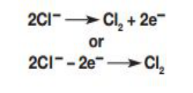

<u>Edexcel</u> IGCSE Chemistry Topic 1: Principles of chemistry **Electrolysis** 

**Notes** 

_<mark>1.55</mark>_   _<mark>(chemistry</mark>_   _<mark>only)</mark>_   _<mark>understand</mark>_   _<mark>why</mark>_   _<mark>covalent</mark>_   _<mark>compounds</mark>_   _<mark>do</mark>_   _<mark>not</mark>_   _<mark>conduct electricity</mark>_ 

   - They do not have free electrons – the electrons are shared in a covalent bond 

- _<mark>1.56</mark>_   _<mark>(chemistry</mark>_   _<mark>only)</mark>_   _<mark>understand</mark>_   _<mark>why</mark>_   _<mark>ionic</mark>_   _<mark>compounds</mark>_   _<mark>conduct</mark>_   _<mark>electricity only</mark>_   _<mark>when</mark>_   _<mark>molten</mark>_   _<mark>or</mark>_   _<mark>in</mark>_   _<mark>aqueous</mark>_   _<mark>solution</mark>_ 

   - Ions are fixed when ionic compounds are solid, meaning they can’t move so can’t conduct electricity 

   - when the compounds are molten or in aqueous solution, the ions (that are electrically charged) are able to move and carry charge 

_<mark>1.57</mark>_   _<mark>(chemistry</mark>_   _<mark>only)</mark>_   _<mark>know</mark>_   _<mark>that</mark>_   _<mark>anion</mark>_   _<mark>and</mark>_   _<mark>cation</mark>_   _<mark>are</mark>_   _<mark>terms</mark>_   _<mark>used</mark>_   _<mark>to</mark>_   _<mark>refer</mark>_   _<mark>to negative</mark>_   _<mark>and</mark>_   _<mark>positive</mark>_   _<mark>ions</mark>_   _<mark>respectively</mark>_ 

- aNion = Negatively charged ion (-) 

- ca+ion = posi+ively charged ion (+) 

_<mark>1.58</mark>_   _<mark>(chemistry</mark>_   _<mark>only)</mark>_   _<mark>describe</mark>_   _<mark>experiments</mark>_   _<mark>to</mark>_   _<mark>investigate</mark>_   _<mark>electrolysis,</mark>_   _<mark>using inert</mark>_   _<mark>electrodes,</mark>_   _<mark>of</mark>_   _<mark>molten</mark>_   _<mark>compounds</mark>_   _<mark>(including</mark>_   _<mark>lead(II)</mark>_   _<mark>bromide)</mark>_   _<mark>and aqueous</mark>_   _<mark>solutions</mark>_   _<mark>(including</mark>_   _<mark>sodium</mark>_   _<mark>chloride,</mark>_   _<mark>dilute</mark>_   _<mark>sulfuric</mark>_   _<mark>acid</mark>_   _<mark>and</mark>_   _<mark>copper (II)</mark>_   _<mark>sulfate)</mark>_   _<mark>and</mark>_   _<mark>to</mark>_   _<mark>predict</mark>_   _<mark>the</mark>_   _<mark>products</mark>_ 

- During electrolysis, **** positively charged **** ions move to the **** negative electrode (cathode), and **** negatively charged ions **** move to the **** positive electrode (anode). 

- Ions are discharged at the electrodes producing elements, this process is called electrolysis 

- When you have a ionic solution (NOT a molten ionic compound), your solution will contain: the ions that make up the ionic compound, and the ions in water (OH-  and H+ ) 

- at the cathode (-): 

   - hydrogen (from H+  in water) is produced UNLESS the + ions in the ionic compound are from a metal less reactive than hydrogen 

   - if the metal is less reactive, it will be produced instead 

- at the anode (+): 

   - oxygen (from OH-  in water) will be produced UNLESS the ionic compound contains halide ions (Cl- ,  Br-  ,  I-  ) 

   - if there are halide ions, the halogen will be produced instead (e.g. Cl2)  

   - Using the logic above… 

   - Electrolysis of: 

      - Sodium chloride solution 

         - H+  ions go to cathode, H2 (g) is produced (Na is more reactive than hydrogen) 

         - Cl-  ions go to anode, Cl2 (g) is produced (Cl-  are halide ions) 

      - Copper (II) sulfate solution 

         - Cu+  ions go to cathode, Cu (s) is produced (Cu is less reactive than hydrogen) 

         - OH-  ions go to anode, O2  (g) is produced (SO42- ions are not halide ions) 

      - Water acidified with sulfuric acid 

         - H+  to cathode, H2 (g) is produced (these are the other ions present in sulfuric acid H2SO 4)  

         - OH-  to anode, O2  (g) is produced (SO42- ions are not halide ions) 

      - Molten lead (II) bromide (demonstration) 

         - Pb2+  to cathode, Pb (s) is produced (not in solution so these are the only + ions present) 

         - Br-   to anode, Br2  (l) is produced **** (not in solution so these are the only - ions present) 

- _<mark>1.59</mark>_   _<mark>(chemistry</mark>_   _<mark>only)</mark>_   _<mark>write</mark>_   _<mark>ionic</mark>_   _<mark>half-equations</mark>_   _<mark>representing</mark>_   _<mark>the</mark>_   _<mark>reactions at</mark>_   _<mark>the</mark>_   _<mark>electrodes</mark>_   _<mark>during</mark>_   _<mark>electrolysis</mark>_   _<mark>and</mark>_   _<mark>understand</mark>_   _<mark>why</mark>_   _<mark>these</mark>_   _<mark>reactions</mark>_   _<mark>are classified</mark>_   _<mark>as</mark>_   _<mark>oxidation</mark>_   _<mark>or</mark>_   _<mark>reduction</mark>_ 

   - This is an example of a half equation; the small number is always the same as the 2 larger numbers within the equation. & electrons are represented by the symbol ‘e-‘ 

- Oxidation Is Loss (of electrons) 

- Reduction Is Gain (of electrons) 

- writing half equations for the reactions at each electrode: 

   - negative electrode: X+  -> X, so ionic equation must be: 

      - X+  + e-   -> X, electrons gained, so positive ions are reduced 

   - positive electrode: X-  -> X, so ionic equation must be: X-  -> e-   + X, electrons are lost, so negative ions are oxidised 

© www.pmt.education wwopmteducation 

# _<mark>1.60</mark>_   _<mark>(chemistry</mark>_   _<mark>only)</mark>_   _<mark>practical:</mark>_   _<mark>investigate</mark>_   _<mark>the</mark>_   _<mark>electrolysis</mark>_   _<mark>of</mark>_   _<mark>aqueous solutions</mark>_ {#pmt-4ch1-notes-unit-1-1i-electrolysis-chemistry-only-s1}
example- copper sulfate solution using copper electrodes 

- set up: 

   - anode is made of impure copper (that you are purifying) 

   - cathode is made of pure copper 

   - the solution is copper sulfate 

- what happens: 

   - Cu2+  ions from the anode move to the cathode, where they gain electrons and are discharged as pure copper 

   - impurities form as sludge below the anode 

- the cathode will increase in mass as it gains pure copper, whilst the anode will lose mass as copper ions are lost (they replace the ones from the CuSO4 solution that go to the cathode) and so are impurities
