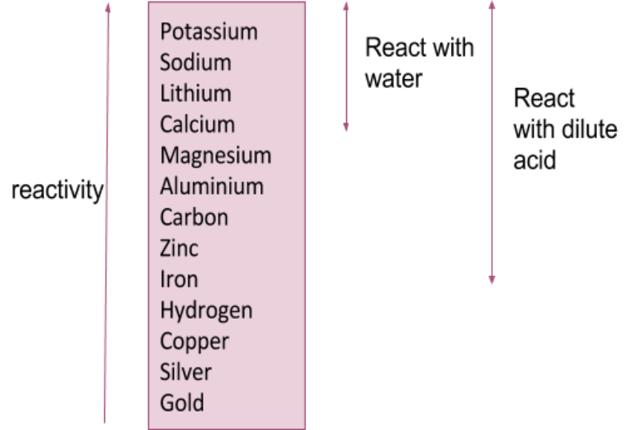

<u>Edexcel</u> IGCSE Chemistry Topic 2: Inorganic chemistry **Reactivity**   **series** 

**Notes** 

_<mark>2.15</mark>_   _<mark>understand</mark>_   _<mark>how</mark>_   _<mark>metals</mark>_   _<mark>can</mark>_   _<mark>be</mark>_   _<mark>arranged</mark>_   _<mark>in</mark>_   _<mark>a</mark>_   _<mark>reactivity</mark>_   _<mark>series</mark>_   _<mark>based</mark>_   _<mark>on their</mark>_   _<mark>reactions</mark>_   _<mark>with:</mark>_   _<mark>water,</mark>_   _<mark>dilute</mark>_   _<mark>hydrochloric</mark>_   _<mark>or</mark>_   _<mark>sulfuric</mark>_   _<mark>acid</mark>_ 

- A few reactive metals will react with cold water: 

   - Products are a metal hydroxide (forming an alkaline solution) and hydrogen gas (can see bubbles given off) 

   - E.g. with potassium: 2K + 2H2O  -> 2KOH + H2 

- Most metals react with acid: 

   - acid + metal → salt + hydrogen (can see bubbles of H2 given off) 

- Almost all metals react with oxygen : 

   - metal + oxygen → metal oxide 

   - Only metal that does not react with any of the above is gold, because it is extremely unreactive 

- You can therefore deduce the relative reactivity of some metals by seeing if they react with water (i.e. VERY reactive), acid (reactive), and oxygen (not that reactive) 

_<mark>2.16</mark>_   _<mark>understand</mark>_   _<mark>how</mark>_   _<mark>metals</mark>_   _<mark>can</mark>_   _<mark>be</mark>_   _<mark>arranged</mark>_   _<mark>in</mark>_   _<mark>a</mark>_   _<mark>reactivity</mark>_   _<mark>series</mark>_   _<mark>based</mark>_   _<mark>on their</mark>_   _<mark>displacement</mark>_   _<mark>reactions</mark>_   _<mark>between:</mark>_   _<mark>metals</mark>_   _<mark>and</mark>_   _<mark>metal</mark>_   _<mark>oxides,</mark>_   _<mark>metals</mark>_   _<mark>and aqueous</mark>_   _<mark>solutions</mark>_   _<mark>of</mark>_   _<mark>metal</mark>_   _<mark>salts</mark>_ 

   - You can see if one metal is more reactive than another by using displacement reactions: 

      - Easily seen when a salt of the less reactive metal is in the solution 

         - More reactive metal gradually disappears as it forms a solution 

         - Less reactive metal coats the surface of the more reactive metal 

- _<mark>2.17</mark>_   _<mark>know</mark>_   _<mark>the</mark>_   _<mark>order</mark>_   _<mark>of</mark>_   _<mark>reactivity</mark>_   _<mark>of</mark>_   _<mark>these</mark>_   _<mark>metals:</mark>_   _<mark>potassium,</mark>_   _<mark>sodium, lithium,</mark>_   _<mark>calcium,</mark>_   _<mark>magnesium,</mark>_   _<mark>aluminium,</mark>_   _<mark>zinc,</mark>_   _<mark>iron,</mark>_   _<mark>copper,</mark>_   _<mark>silver,</mark>_   _<mark>gold</mark>_ 

   - When metals react with other substances, metal atoms form positive ions 

   - Reactivity of a metal is related to its tendency to form positive ions 

   - Metals can be arranged in order of their reactivity in a reactivity series 

      - Metals potassium, sodium, lithium, calcium, magnesium, zinc, iron and copper can be put in order of their reactivity from their reactions with water and dilute acids 

      - Non-metals hydrogen and carbon are often included in the reactivity series 

   - A more reactive metal can displace a less reactive metals from a compound (think about how this is similar as well to halogens) 

## **reactivity**   **series:** {#pmt-4ch1-notes-unit-2-2d-reactivity-series-s1}

# _<mark>2.18</mark>_   _<mark>know</mark>_   _<mark>the</mark>_   _<mark>conditions</mark>_   _<mark>under</mark>_   _<mark>which</mark>_   _<mark>iron</mark>_   _<mark>rusts</mark>_ {#pmt-4ch1-notes-unit-2-2d-reactivity-series-s2}
- Both air and water are necessary for iron to rust – i.e. oxidation – gain of oxygen results in corrosion 

_<mark>2.19</mark>_   _<mark>understand</mark>_   _<mark>how</mark>_   _<mark>the</mark>_   _<mark>rusting</mark>_   _<mark>of</mark>_   _<mark>iron</mark>_   _<mark>may</mark>_   _<mark>be</mark>_   _<mark>prevented</mark>_   _<mark>by:</mark>_   _<mark>barrier methods,</mark>_   _<mark>galvanising,</mark>_   _<mark>sacrificial</mark>_   _<mark>protection</mark>_ 

- rusting can be prevented by excluding oxygen and water e.g. by: 

   - painting 

   - coating with plastic 

   - using oil or grease 

- water can be kept away using a desiccant in the container (absorbs water vapour) 

- oxygen can be kept away by storing the metal in a vacuum container 

- Sacrificial protection: where the metal you want to be protected from rusting is galvanised with a more reactive metal, which will rust first and prevent water and oxygen reaching the layer underneath 

   - E.g. zinc is used to galvanise iron 

> www.pmt.education wwopmteducation 

# _<mark>2.20</mark>_   _<mark>understand</mark>_   _<mark>the</mark>_   _<mark>terms:</mark>_   _<mark>oxidation,</mark>_   _<mark>reduction,</mark>_   _<mark>redox,</mark>_   _<mark>oxidising</mark>_   _<mark>agent, reducing</mark>_   _<mark>agent</mark>_   _<mark>in</mark>_   _<mark>terms</mark>_   _<mark>of</mark>_   _<mark>gain</mark>_   _<mark>or</mark>_   _<mark>loss</mark>_   _<mark>of</mark>_   _<mark>oxygen</mark>_   _<mark>and</mark>_   _<mark>loss</mark>_   _<mark>or</mark>_   _<mark>gain</mark>_   _<mark>of electrons</mark>_ {#pmt-4ch1-notes-unit-2-2d-reactivity-series-s3}
- oxidation: gain of oxygen OR loss of electrons 

- reduction: loss of oxygen OR gain of electrons 

- redox: a reaction in which both oxidation and reduction occur 

- oxidising agent: causes another reactant to be oxidised and is reduced itself 

- reducing agent: causes another reactant to be reduced and is oxidised itself 

_<mark>2.21</mark>_   _<mark>practical:</mark>_   _<mark>investigate</mark>_   _<mark>reactions</mark>_   _<mark>between</mark>_   _<mark>dilute</mark>_   _<mark>hydrochloric</mark>_   _<mark>and</mark>_   _<mark>sulfuric acids</mark>_   _<mark>and</mark>_   _<mark>metals</mark>_   _<mark>(e.g.</mark>_   _<mark>magnesium,</mark>_   _<mark>zinc</mark>_   _<mark>and</mark>_   _<mark>iron)</mark>_ 

- in the diagram showing the reactivity series, you can see that only the more reactive metals will react with dilute acids (up to iron) 

- metal + acid → hydrogen + salt 

- you can observe the reaction of different metals with acids, as the most reactive will give off large amounts of H2 gas bubbles and the least reactive will not give off any at all
