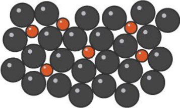

<u>Edexcel</u> IGCSE Chemistry Topic 2: Inorganic chemistry **Extraction**   **and**   **uses**   **of**   **metals** 

**Notes** 

- _<mark>2.22</mark>_   _<mark>(chemistry</mark>_   _<mark>only)</mark>_   _<mark>know</mark>_   _<mark>that</mark>_   _<mark>most</mark>_   _<mark>metals</mark>_   _<mark>are</mark>_   _<mark>extracted</mark>_   _<mark>from</mark>_   _<mark>ores</mark>_   _<mark>found in</mark>_   _<mark>the</mark>_   _<mark>Earth’s</mark>_   _<mark>crust</mark>_   _<mark>and</mark>_   _<mark>that</mark>_   _<mark>unreactive</mark>_   _<mark>metals</mark>_   _<mark>are</mark>_   _<mark>often</mark>_   _<mark>found</mark>_   _<mark>as</mark>_   _<mark>the uncombined</mark>_   _<mark>element</mark>_ 

   - The second to last element is gold (in the Reactivity Series on the (d) revision sheet), since it is very unreactive, it is found in the Earth as the metal itself 

   - But, most metals are extracted from ores found in the Earth’s crust 

_<mark>2.23</mark>_   _<mark>(chemistry</mark>_   _<mark>only)</mark>_   _<mark>explain</mark>_   _<mark>how</mark>_   _<mark>the</mark>_   _<mark>method</mark>_   _<mark>of</mark>_   _<mark>extraction</mark>_   _<mark>of</mark>_   _<mark>a</mark>_   _<mark>metal</mark>_   _<mark>is related</mark>_   _<mark>to</mark>_   _<mark>its</mark>_   _<mark>position</mark>_   _<mark>in</mark>_   _<mark>the</mark>_   _<mark>reactivity</mark>_   _<mark>series,</mark>_   _<mark>illustrated</mark>_   _<mark>by</mark>_   _<mark>carbon</mark>_   _<mark>extraction for</mark>_   _<mark>iron</mark>_   _<mark>and</mark>_   _<mark>electrolysis</mark>_   _<mark>for</mark>_   _<mark>aluminium</mark>_ 

- Can only be extracted by reduction of carbon if metal is less reactive so that carbon displaces the metal from the ore… 

- If more reactive than carbon, electrolysis can be used (metals less reactive than carbon can also be extracted this way) 

- Electrolysis is expensive due to the use of large amounts of energy to melt the compounds and to produce the electrical current (so you wouldn’t extract a metal using electrolysis if it could be done more cheaply using carbon) 

- Extraction by heating with carbon (including iron): 

   - Iron oxide loses oxygen, and is therefore reduced. The carbon gains oxygen, and is therefore oxidised. 

   - 2Fe2 O 3(s)  + 3C(s) -> 4Fe(l) + 3CO2(g)  

   - For iron, this is carried out at high temperatures in a blast furnace 

- Extraction by electrolysis (including aluminium): 

   - Metals that are more reactive than carbon e.g aluminium are extracted by electrolysis of molten compounds. 

      - Too reactive to be extracted by reduction with carbon 

      - Aluminium is manufactured by the electrolysis of a molten mixture of aluminium oxide and cryolite using carbon as the positive electrode (anode). 

   - Metals that react with carbon can be extracted by electrolysis as well 

_<mark>2.24</mark>_   _<mark>(chemistry</mark>_   _<mark>only)</mark>_   _<mark>be</mark>_   _<mark>able</mark>_   _<mark>to</mark>_   _<mark>comment</mark>_   _<mark>on</mark>_   _<mark>a</mark>_   _<mark>metal</mark>_   _<mark>extraction</mark>_   _<mark>process, given</mark>_   _<mark>appropriate</mark>_   _<mark>information;</mark>_   _<mark>detailed</mark>_   _<mark>knowledge</mark>_   _<mark>of</mark>_   _<mark>the</mark>_   _<mark>processes</mark>_   _<mark>used</mark>_   _<mark>in the</mark>_   _<mark>extraction</mark>_   _<mark>of</mark>_   _<mark>a</mark>_   _<mark>specific</mark>_   _<mark>metal</mark>_   _<mark>is</mark>_   _<mark>not</mark>_   _<mark>required</mark>_ 

- ALTERNATIVE METHODS 

- Phytoextraction 

   - Some plants absorb metal compounds through their roots 

   - They concentrate these compounds as a result of this 

   - The plants can be burned to produce an ash that contains the metal compounds 

- Bacterial extraction 

   - Some bacteria absorb metal compounds 

   - Produce solutions called leachates which contain the metals 

# _<mark>2.25</mark>_   _<mark>(chemistry</mark>_   _<mark>only)</mark>_   _<mark>explain</mark>_   _<mark>the</mark>_   _<mark>uses</mark>_   _<mark>of</mark>_   _<mark>aluminium,</mark>_   _<mark>copper,</mark>_   _<mark>iron</mark>_   _<mark>and</mark>_   _<mark>steel in</mark>_   _<mark>terms</mark>_   _<mark>of</mark>_   _<mark>their</mark>_   _<mark>properties;</mark>_   _<mark>the</mark>_   _<mark>types</mark>_   _<mark>of</mark>_   _<mark>steel</mark>_   _<mark>will</mark>_   _<mark>be</mark>_   _<mark>limited</mark>_   _<mark>to</mark>_   _<mark>low-carbon (mild),</mark>_   _<mark>high-carbon</mark>_   _<mark>and</mark>_   _<mark>stainless</mark>_ {#pmt-4ch1-notes-unit-2-2e-extraction-and-uses-of-metals-chemistry-only-s1}
- Aluminium – low density, corrosion-resistant, used for aircraft, trains, overhead power cables, saucepans and cooking foil 

- Copper – soft and easily bent, good conductor of electricity, does not react with water, used for electrical wiring and plumbing 

- Iron – from the blast furnace: hard, but too brittle for most uses, so converted to steel, pure iron: too soft for many uses 

- Low carbon steel: 0.25% carbon, easily shaped, car body panels 

- High carbon steel: 2.5% carbon, hard, cutting tools 

- Stainless steel: chromium & nickel, resistant to corrosion, cutlery and sinks 

# _<mark>2.26</mark>_   _<mark>(chemistry</mark>_   _<mark>only)</mark>_   _<mark>know</mark>_   _<mark>that</mark>_   _<mark>an</mark>_   _<mark>alloy</mark>_   _<mark>is</mark>_   _<mark>a</mark>_   _<mark>mixture</mark>_   _<mark>of</mark>_   _<mark>a</mark>_   _<mark>metal</mark>_   _<mark>and</mark>_   _<mark>one</mark>_   _<mark>or more</mark>_   _<mark>elements,</mark>_   _<mark>usually</mark>_   _<mark>other</mark>_   _<mark>metals</mark>_   _<mark>or</mark>_   _<mark>carbon</mark>_ {#pmt-4ch1-notes-unit-2-2e-extraction-and-uses-of-metals-chemistry-only-s2}
- Most metals in everyday uses are alloys. Pure copper, gold, iron and aluminium are all too soft for everyday uses and so are mixed with small amounts of similar metals to make them harder for everyday use. 

   - Gold in jewellery is usually an alloy with silver, copper and zinc 

Example of an alloy – two different metals 

© www.pmt.education wwopmteducation 

# _<mark>2.27</mark>_   _<mark>(chemistry</mark>_   _<mark>only)</mark>_   _<mark>explain</mark>_   _<mark>why</mark>_   _<mark>alloys</mark>_   _<mark>are</mark>_   _<mark>harder</mark>_   _<mark>than</mark>_   _<mark>pure</mark>_   _<mark>metals</mark>_ {#pmt-4ch1-notes-unit-2-2e-extraction-and-uses-of-metals-chemistry-only-s3}
- in a pure metal, the ions are all the same size and are in a regular arrangement of layers, meaning that they can slide over each other easily, making them soft. In an alloy, there are different sized ions,which disrupts the regular arrangement and prevents layers being able to slide over each other so easily.
