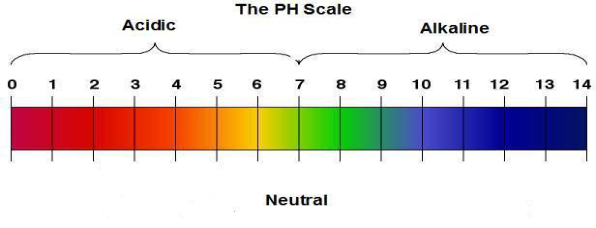

<u>Edexcel</u> IGCSE Chemistry Topic 2: Inorganic chemistry **Acids,**   **alkalis**   **and**   **titrations** 

**Notes** 

- _<mark>2.28</mark>_   _<mark>describe</mark>_   _<mark>the</mark>_   _<mark>use</mark>_   _<mark>of</mark>_   _<mark>litmus,</mark>_   _<mark>phenolphthalein</mark>_   _<mark>and</mark>_   _<mark>methyl</mark>_   _<mark>orange</mark>_   _<mark>to distinguish</mark>_   _<mark>between</mark>_   _<mark>acidic</mark>_   _<mark>and</mark>_   _<mark>alkaline</mark>_   _<mark>solutions</mark>_ 

   - Phenolphthalein <mark>o Alkaline</mark>   <mark>=</mark>   <mark>pink</mark> o Acidic = colourless 

   - ● Methyl orange <mark>o Alkaline</mark>   <mark>=</mark>   <mark>yellow o Acidic</mark>   <mark>=</mark>   <mark>red</mark> 

   - ● Litmus o Litmus solution <mark>▪ Alkaline</mark>   <mark>=</mark>   <mark>blue ▪ Acidic</mark>   <mark>=</mark>   <mark>red</mark> 

   - o Litmus paper ▪ Blue litmus paper goes red in acidic & stays blue in alkaline ▪ Red litmus paper goes blue in alkaline & stays red in acidic 

- _<mark>2.29</mark>_   _<mark>understand</mark>_   _<mark>how</mark>_   _<mark>to</mark>_   _<mark>use</mark>_   _<mark>the</mark>_   _<mark>pH</mark>_   _<mark>scale,</mark>_   _<mark>from</mark>_   _<mark>0-14,</mark>_   _<mark>can</mark>_   _<mark>be</mark>_   _<mark>used</mark>_   _<mark>to</mark>_   _<mark>classify solutions</mark>_   _<mark>as</mark>_   _<mark>strongly</mark>_   _<mark>acidic</mark>_   _<mark>(0-3),</mark>_   _<mark>weakly</mark>_   _<mark>acidic</mark>_   _<mark>(4-6),</mark>_   _<mark>neutral</mark>_   _<mark>(7),</mark>_   _<mark>weakly alkaline</mark>_   _<mark>(8-10)</mark>_   _<mark>and</mark>_   _<mark>strongly</mark>_   _<mark>alkaline</mark>_   _<mark>(11-14)</mark>_ 

   - The pH scale (0 to 14) measures the acidity or alkalinity of a solution, and can be measured using universal indicator of a pH probe 

      - pH 7 is neutral 

      - o < pH 7 is acidic (the closer to 0, the stronger the acid) o > pH 7 is alkaline (the closer to 14, the stronger the alkali) 

- _<mark>2.30</mark>_   _<mark>describe</mark>_   _<mark>the</mark>_   _<mark>use</mark>_   _<mark>of</mark>_   _<mark>universal</mark>_   _<mark>indicator</mark>_   _<mark>to</mark>_   _<mark>measure</mark>_   _<mark>the</mark>_   _<mark>approximate</mark>_   _<mark>pH value</mark>_   _<mark>of</mark>_   _<mark>an</mark>_   _<mark>aqueous</mark>_   _<mark>solution</mark>_ 

   - add a couple of drops of solution to a piece of universal indicator paper and observe what colour it goes (compare to pH scale) 

© www.pmt.education wwopmteducation 

_<mark>2.31</mark>_   _<mark>know</mark>_   _<mark>that</mark>_   _<mark>acids</mark>_   _<mark>in</mark>_   _<mark>aqueous</mark>_   _<mark>solution</mark>_   _<mark>are</mark>_   _<mark>a</mark>_   _<mark>source</mark>_   _<mark>of</mark>_   _<mark>hydrogen</mark>_   _<mark>ions</mark>_   _<mark>and alkalis</mark>_   _<mark>in</mark>_   _<mark>an</mark>_   _<mark>aqueous</mark>_   _<mark>solution</mark>_   _<mark>are</mark>_   _<mark>a</mark>_   _<mark>source</mark>_   _<mark>of</mark>_   _<mark>hydroxide</mark>_   _<mark>ions</mark>_ 

- Acids produce H+  ions in aqueous solutions 

- Alkalis produce OH-  ions in aqueous solutions 

# _<mark>2.32</mark>_   _<mark>know</mark>_   _<mark>that</mark>_   _<mark>alkalis</mark>_   _<mark>can</mark>_   _<mark>neutralise</mark>_   _<mark>acids</mark>_ {#pmt-4ch1-notes-unit-2-2f-acids-alkalis-and-titrations-s1}
- A neutralisation reaction is one between an acid and a base 

- the ionic equation **** for any alkali-acid neutralisation reaction is: H+ (aq)  + OH- (aq)  -> H2O(l) 

# _<mark>2.33</mark>_   _<mark>(chemistry</mark>_   _<mark>only)</mark>_   _<mark>describe</mark>_   _<mark>how</mark>_   _<mark>to</mark>_   _<mark>carry</mark>_   _<mark>out</mark>_   _<mark>an</mark>_   _<mark>acid-alkali</mark>_   _<mark>titration</mark>_ {#pmt-4ch1-notes-unit-2-2f-acids-alkalis-and-titrations-s2}
## **How**   **to**   **carry**   **out**   **a**   **titration:** {#pmt-4ch1-notes-unit-2-2f-acids-alkalis-and-titrations-s3}
1. Wash burette using acid and then water 

2. Fill burette to 100cm3  with acid with the meniscus’ base on the 100cm3  line 

3. Use 25cm3 pipette to add 25cm3 of alkali into a conical flask, drawing alkali into the pipette using a pipette filler 

4. Add a few drops of a suitable indicator to the conical flask (eg: phenolphthalein which is pink when alkaline and colourless when acidic) 

5. Add acid from burette to alkali until end-point is reached (as shown by indicator) 

6. The titre (volume of acid needed to exactly neutralise the acid) is the difference between the first (100cm3 )  and second readings on the burette) 

7. Repeat the experiment until you get concordant results
