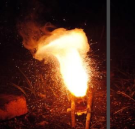
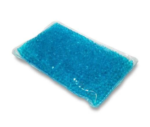

<u>Edexcel</u> IGCSE Chemistry Topic 3: Physical chemistry **Energetics** 

**Notes** 

# _<mark>3.1</mark>_   _<mark>know</mark>_   _<mark>that</mark>_   _<mark>chemical</mark>_   _<mark>reactions</mark>_   _<mark>in</mark>_   _<mark>which</mark>_   _<mark>heat</mark>_   _<mark>energy</mark>_   _<mark>is</mark>_   _<mark>given</mark>_   _<mark>out</mark>_   _<mark>are described</mark>_   _<mark>as</mark>_   _<mark>exothermic,</mark>_   _<mark>and</mark>_   _<mark>those</mark>_   _<mark>in</mark>_   _<mark>which</mark>_   _<mark>heat</mark>_   _<mark>energy</mark>_   _<mark>is</mark>_   _<mark>taken</mark>_   _<mark>in</mark>_   _<mark>are described</mark>_   _<mark>as</mark>_   _<mark>endothermic</mark>_ {#pmt-4ch1-notes-unit-3-3a-energetics-s1}

- An exothermic reaction is one that transfers energy to the surroundings so the temperature of the surroundings increases. 

- Examples of exothermic reactions include; combustion, many oxidisation reactions and neutralisation. 

- Everyday examples of exothermic reactions include; self-heating cans (e.g for coffee) and hand warmers. 

- An endothermic reaction is one that takes in energy from the surroundings so the temperature of the surroundings decreases. 

- Examples of endothermic reactions are thermal decomposition and the reaction of citric acid and sodium hydrogencarbonate. 

- Some sports injury packs are based on endothermic reactions. 

# _<mark>3.2</mark>_   _<mark>describe</mark>_   _<mark>simple</mark>_   _<mark>calorimetry</mark>_   _<mark>experiments</mark>_   _<mark>for</mark>_   _<mark>reactions</mark>_   _<mark>such</mark>_   _<mark>as combustion,</mark>_   _<mark>displacement,</mark>_   _<mark>dissolving</mark>_   _<mark>and</mark>_   _<mark>neutralization</mark>_ {#pmt-4ch1-notes-unit-3-3a-energetics-s2}
- Salts dissolving in water can be either exothermic or endothermic 

- Neutralisation reaction is exothermic 

- Displacement is an exothermic or endothermic reaction 

- Combustion is an exothermic reaction 

# _<mark>3.3</mark>_   _<mark>calculate</mark>_   _<mark>the</mark>_   _<mark>heat</mark>_   _<mark>energy</mark>_   _<mark>change</mark>_   _<mark>from</mark>_   _<mark>a</mark>_   _<mark>measured</mark>_   _<mark>temperature</mark>_   _<mark>change using</mark>_   _<mark>the</mark>_   _<mark>expression</mark>_   _<mark>Q</mark>_   _<mark>=</mark>_   _<mark>mc</mark>_ <mark>∆</mark> _<mark>T</mark>_ {#pmt-4ch1-notes-unit-3-3a-energetics-s3}
It is possible to measure the enthalpy change by using a reaction to heat or cool a known mass of water. The enthalpy change can be measured by using the formula: 

Δ **E**   **=**   **m**   **c**  Δ **T** 

- Δ **E**  **** = energy supplied by water (joules) 

- **m ** = mass of water (grams) 

- **c**  **** = specific heat capacity of water (4.2 J/g/°C) 

- Δ **T**  **** = the change in temperature of the water (°C). 

Since an increase in the temperature of the water means a decrease in the energy of the chemicals, to find the enthalpy change of the reaction, use: 

Δ **H**   **=**   **-**   **m**   **c**  Δ **T** 

If the reaction occurs in solution, the mass of the solution is used. 

© www.pmt.education wwopmteducation 

Enthalpy change is commonly given per mole, and the molar enthalpy change is given in kilojoules per mole. 

e.g. 100g of water were placed in a copper calorimeter above a fuel burner containing hexane, C6 H 14.  Burning the hexane caused the temperature of the water to rise from 18 to 44℃. The mass of the burner decreased from 98.30g to 97.87g. What is the enthalpy of combustion of 1 mole of hexane? 

- Formula mass of hexane = (6 x 12) + (14 x 1) = 86 

- Temperature rise = 44 – 18 = 26°C 

- Mass of hexane burned = 98.30 – 97.87 = 0.43 g 

- Moles of hexane burned = mass / molar mass = 0.43 / 86 = 0.005 mol 

- Energy supplied to water = m c ΔT = 100g **** x **** 4.2 J/g/°C **** x ** ** 26°C= 10920 J 

- Enthalpy change = - m c ΔT= -10920 J 

- Enthalpy change per mol= -10920J / 0.005 mol= -2184000 J/mol 

   -  **                             ** <u>Δ</u> **<u>H</u>**   **<u>_ =</u>**   **-2184**   **<u>kJ/mol</u>** 

_<mark>3.4</mark>_   _<mark>calculate</mark>_   _<mark>the</mark>_   _<mark>molar</mark>_   _<mark>enthalpy</mark>_   _<mark>change</mark>_   _<mark>(</mark>_ <mark>∆</mark> _<mark>H)</mark>_   _<mark>from</mark>_   _<mark>the</mark>_   _<mark>heat</mark>_   _<mark>energy</mark>_   _<mark>change,</mark> Q_ 

- Q/ J divide by 1,000 to get Q/ kJ 

- Find moles of fuel used using moles = mass / molar mass 

- Then do Q/ kJ divided by mol to get ∆H/ kJ/mol. 

_<mark>3.5</mark>_   _<mark>(chemistry</mark>_   _<mark>only)</mark>_   _<mark>draw</mark>_   _<mark>and</mark>_   _<mark>explain</mark>_   _<mark>energy</mark>_   _<mark>level</mark>_   _<mark>diagrams</mark>_   _<mark>to</mark>_   _<mark>represent exothermic</mark>_   _<mark>and</mark>_   _<mark>endothermic</mark>_   _<mark>reactions</mark>_ 

- energy level diagrams can be used to show the energy of the reactants compared to the products of a reaction 

- exothermic reaction: energy is released to surroundings, so reactants have more energy than products 

- endothermic reactions: energy is taken in from surroundings, so reactants have less energy than products 

_<mark>3.6</mark>_   _<mark>(chemistry</mark>_   _<mark>only)</mark>_   _<mark>know</mark>_   _<mark>that</mark>_   _<mark>bond-breaking</mark>_   _<mark>is</mark>_   _<mark>an</mark>_   _<mark>endothermic</mark>_   _<mark>process and</mark>_   _<mark>that</mark>_   _<mark>bond-making</mark>_   _<mark>is</mark>_   _<mark>an</mark>_   _<mark>exothermic</mark>_   _<mark>process</mark>_ 

- During a chemical reaction: 

   - Energy must be taken in to break bonds in the reactants 

   - Energy is released when bonds in the products are formed 

- Energy needed to BREAK > energy RELEASED **** ENDOTHERMIC 

- Energy needed to BREAK < energy RELEASED **** EXOTHERMIC 

_<mark>3.7</mark>_   _<mark>(chemistry</mark>_   _<mark>only)</mark>_   _<mark>use</mark>_   _<mark>bond</mark>_   _<mark>energies</mark>_   _<mark>to</mark>_   _<mark>calculate</mark>_   _<mark>the</mark>_   _<mark>enthalpy</mark>_   _<mark>change during</mark>_   _<mark>a</mark>_   _<mark>chemical</mark>_   _<mark>reaction</mark>_ 

1. Add together all the bond energies for all the bonds in the reactants – this is the ‘energy in’ 

2. Add together the bond energies for all the bonds in the products – this is the ‘energy out’ 

3. Calculate the energy change: energy in – energy out 

_<mark>3.8</mark>_   _<mark>practical:</mark>_   _<mark>investigate</mark>_   _<mark>temperature</mark>_   _<mark>changes</mark>_   _<mark>accompanying</mark>_   _<mark>some</mark>_   _<mark>of</mark>_   _<mark>the following</mark>_   _<mark>types</mark>_   _<mark>of</mark>_   _<mark>change:</mark>_   _<mark>salts</mark>_   _<mark>dissolving</mark>_   _<mark>in</mark>_   _<mark>water,</mark>_   _<mark>neutralisation</mark>_   _<mark>reactions, displacement</mark>_   _<mark>reactions,</mark>_   _<mark>combustion</mark>_   _<mark>reactions</mark>_
