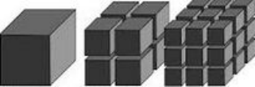
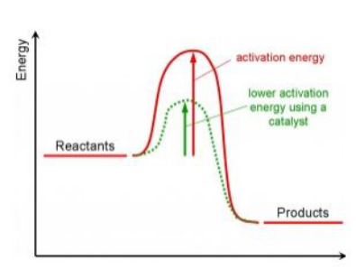

<u>Edexcel</u> IGCSE Chemistry Topic 3: Physical chemistry **Rates**   **of**   **reaction** 

**Notes** 

_<mark>3.9</mark>_   _<mark>describe</mark>_   _<mark>experiments</mark>_   _<mark>to</mark>_   _<mark>investigate</mark>_   _<mark>the</mark>_   _<mark>effects</mark>_   _<mark>of</mark>_   _<mark>changes</mark>_   _<mark>in</mark>_   _<mark>surface area</mark>_   _<mark>of</mark>_   _<mark>a</mark>_   _<mark>solid,</mark>_   _<mark>concentration</mark>_   _<mark>of</mark>_   _<mark>a</mark>_   _<mark>solution,</mark>_   _<mark>temperature</mark>_   _<mark>and</mark>_   _<mark>the</mark>_   _<mark>use</mark>_   _<mark>of</mark>_   _<mark>a catalyst</mark>_   _<mark>on</mark>_   _<mark>the</mark>_   _<mark>rate</mark>_   _<mark>of</mark>_   _<mark>a</mark>_   _<mark>reaction</mark>_ 

- Use equations below to find the rate of reaction to compare the effect of changes in surface area, concentration, temperature, use of a catalyst etc… 

- Rates of reactions can be measured using the amount of product used, or amount of product formed over time: 

   -  **                          **  **Rate**   **of**   **reaction**   **=**  **** **<u>amount</u>**   **<u>of</u>**   **<u>reactant</u>**   **<u>used</u>** 

   -  **                                                                             **  **Time** 

   -  **                          **  **Rate**   **of**   **reaction**   **=**  **** **<u>amount</u>**   **<u>of</u>**   **<u>product</u>**   **<u>formed</u>** 

   -  **                                                                             **  **Time** 

      - Quantity of reactant or product can be measured by the mass in grams or by a volume in cm3  

      - Units of rate of reaction may be given as g/s or cm3 /s 

      - Use quantity of reactants in terms of moles and therefore, units for rate of reaction in mol/s 

_<mark>3.10</mark>_   _<mark>describe</mark>_   _<mark>the</mark>_   _<mark>effects</mark>_   _<mark>of</mark>_   _<mark>changes</mark>_   _<mark>in</mark>_   _<mark>surface</mark>_   _<mark>area</mark>_   _<mark>of</mark>_   _<mark>a</mark>_   _<mark>solid,</mark>_   _<mark>concentration of</mark>_   _<mark>a</mark>_   _<mark>solution,</mark>_   _<mark>pressure</mark>_   _<mark>of</mark>_   _<mark>a</mark>_   _<mark>gas,</mark>_   _<mark>temperature</mark>_   _<mark>and</mark>_   _<mark>the</mark>_   _<mark>use</mark>_   _<mark>of</mark>_   _<mark>a</mark>_   _<mark>catalyst</mark>_   _<mark>on the</mark>_   _<mark>rate</mark>_   _<mark>of</mark>_   _<mark>a</mark>_   _<mark>reaction</mark>_ 

- Increasing the temperature increases the 

- rate of reaction. As increasing temperature increases the speed of the moving particles, so they collide more frequently and energetically. 

      - Increasing pressure in reacting gases 

   - increases the rate of reaction, as it increases the frequency of collisions. 

- Increasing concentration of reacting solutions increases the rate of reaction, as it increases the frequency of collisions. 

- Increasing the surface area of solid reactants increases the rate of reaction, as it increases the frequency of collisions. 

- Catalysts speed up chemical reactions 

_<mark>3.11</mark>_   _<mark>explain</mark>_   _<mark>the</mark>_   _<mark>effects</mark>_   _<mark>of</mark>_   _<mark>changes</mark>_   _<mark>in</mark>_   _<mark>surface</mark>_   _<mark>area</mark>_   _<mark>of</mark>_   _<mark>a</mark>_   _<mark>solid,</mark>_   _<mark>concentration of</mark>_   _<mark>a</mark>_   _<mark>solution,</mark>_   _<mark>pressure</mark>_   _<mark>of</mark>_   _<mark>a</mark>_   _<mark>gas</mark>_   _<mark>and</mark>_   _<mark>temperature</mark>_   _<mark>on</mark>_   _<mark>the</mark>_   _<mark>rate</mark>_   _<mark>of</mark>_   _<mark>a</mark>_   _<mark>reaction</mark>_   _<mark>in terms</mark>_   _<mark>of</mark>_   _<mark>particle</mark>_   _<mark>collision</mark>_   _<mark>theory</mark>_ 

- see 3.10 

_<mark>3.12</mark>_   _<mark>know</mark>_   _<mark>that</mark>_   _<mark>a</mark>_   _<mark>catalyst</mark>_   _<mark>is</mark>_   _<mark>a</mark>_   _<mark>substance</mark>_   _<mark>that</mark>_   _<mark>increases</mark>_   _<mark>the</mark>_   _<mark>rate</mark>_   _<mark>of</mark>_   _<mark>a reaction,</mark>_   _<mark>but</mark>_   _<mark>is</mark>_   _<mark>chemically</mark>_   _<mark>unchanged</mark>_   _<mark>at</mark>_   _<mark>the</mark>_   _<mark>end</mark>_   _<mark>of</mark>_   _<mark>the</mark>_   _<mark>reaction</mark>_ 

- Catalysts are substances that speed up chemical reactions without being changed or used up during the reaction 

_<mark>3.13</mark>_   _<mark>know</mark>_   _<mark>that</mark>_   _<mark>a</mark>_   _<mark>catalyst</mark>_   _<mark>works</mark>_   _<mark>by</mark>_   _<mark>providing</mark>_   _<mark>an</mark>_   _<mark>alternative</mark>_   _<mark>pathway</mark>_   _<mark>with lower</mark>_   _<mark>activation</mark>_   _<mark>energy</mark>_ 

- Catalysts provide an alternative pathway for a chemical reaction with a lower activation energy. 

- this increases the proportion of particles with energy to react. 

# _<mark>3.14</mark>_   _<mark>(chemistry</mark>_   _<mark>only)</mark>_   _<mark>draw</mark>_   _<mark>and</mark>_   _<mark>explain</mark>_   _<mark>reaction</mark>_   _<mark>profile</mark>_   _<mark>diagrams</mark>_   _<mark>showing</mark>_ <mark>∆</mark> _<mark>H</mark>_   _<mark>and</mark>_   _<mark>activation</mark>_   _<mark>energy</mark>_ {#pmt-4ch1-notes-unit-3-3b-rates-of-reaction-s1}

_<mark>3.15</mark>_   _<mark>practical:</mark>_   _<mark>investigate</mark>_   _<mark>the</mark>_   _<mark>effect</mark>_   _<mark>of</mark>_   _<mark>changing</mark>_   _<mark>the</mark>_   _<mark>surface</mark>_   _<mark>area</mark>_   _<mark>of</mark>_   _<mark>marble chips</mark>_   _<mark>and</mark>_   _<mark>of</mark>_   _<mark>changing</mark>_   _<mark>the</mark>_   _<mark>concentration</mark>_   _<mark>of</mark>_   _<mark>hydrochloric</mark>_   _<mark>acid</mark>_   _<mark>on</mark>_   _<mark>the</mark>_   _<mark>rate</mark>_   _<mark>of reaction</mark>_   _<mark>between</mark>_   _<mark>marble</mark>_   _<mark>chips</mark>_   _<mark>and</mark>_   _<mark>dilute</mark>_   _<mark>hydrochloric</mark>_   _<mark>acid</mark>_ 

- using smaller marble chips (larger surface area), you should see an increase in reaction rate 

- increasing the concentration of hydrochloric acid should increase the reaction rate 

_<mark>3.16</mark>_   _<mark>practical:</mark>_   _<mark>investigate</mark>_   _<mark>the</mark>_   _<mark>effect</mark>_   _<mark>of</mark>_   _<mark>different</mark>_   _<mark>solids</mark>_   _<mark>on</mark>_   _<mark>the</mark>_   _<mark>catalytic decomposition</mark>_   _<mark>of</mark>_   _<mark>hydrogen</mark>_   _<mark>peroxide</mark>_   _<mark>solution</mark>_ 

© www.pmt.education wwopmteducation
