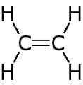
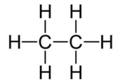

<u>Edexcel</u> IGCSE Chemistry Topic 4: Organic chemistry **Introduction** 

**Notes** 

_<mark>4.1</mark>_   _<mark>know</mark>_   _<mark>that</mark>_   _<mark>a</mark>_   _<mark>hydrocarbon</mark>_   _<mark>is</mark>_   _<mark>a</mark>_   _<mark>compound</mark>_   _<mark>of</mark>_   _<mark>hydrogen</mark>_   _<mark>and</mark>_   _<mark>carbon</mark>_   _<mark>only</mark>_ 

- Hydrocarbon = compound of hydrogen and carbon ONLY 

_<mark>4.2</mark>_   _<mark>understand</mark>_   _<mark>how</mark>_   _<mark>to</mark>_   _<mark>represent</mark>_   _<mark>organic</mark>_   _<mark>molecules</mark>_   _<mark>using empirical</mark>_   _<mark>formulae,</mark>_   _<mark>molecular</mark>_   _<mark>formulae,</mark>_   _<mark>general</mark>_   _<mark>formulae, structural</mark>_   _<mark>formulae</mark>_   _<mark>and</mark>_   _<mark>displayed</mark>_   _<mark>formulae</mark>_ 

   - Empirical formula = simplest whole number ratio of each element in a compound (e.g. for ethene = CH2)  

   - Molecular formulae = actual numbers of each element in a compound (e.g. for ethene = C2H 4)  

   - General formulae = a type of empirical formula that represents the composition of any member of an entire class of compounds (e.g. for ethene = CnH2n)  

   - Structural formulae = formula which shows the arrangement of atoms in the molecule of a compound (e.g. for ethene = CH2CH 2)   

   - Displayed formulae = shows the symbols for each atom in a compound, with straight lines representing covalent bonds 

- E.g. for ethene… 

- _<mark>4.3</mark>_   _<mark>know</mark>_   _<mark>what</mark>_   _<mark>is</mark>_   _<mark>meant</mark>_   _<mark>by</mark>_   _<mark>the</mark>_   _<mark>terms</mark>_   _<mark>homologous</mark>_   _<mark>series,</mark>_   _<mark>functional</mark>_   _<mark>group and</mark>_   _<mark>isomerism</mark>_ 

   - Homologous series = series of compounds with the same general formula and similar properties 

   - Functional group = a group of atoms responsible for the chemical reactions of a compound 

   - Isomerism = compounds with the same molecular formula exist in different forms due to different arrangements of atoms (different forms of isomerism exist) 

_<mark>4.4</mark>_   _<mark>understand</mark>_   _<mark>how</mark>_   _<mark>to</mark>_   _<mark>name</mark>_   _<mark>compounds</mark>_   _<mark>relevant</mark>_   _<mark>to</mark>_   _<mark>this</mark>_   _<mark>specification</mark>_   _<mark>using the</mark>_   _<mark>rules</mark>_   _<mark>of</mark>_   _<mark>International</mark>_   _<mark>Union</mark>_   _<mark>of</mark>_   _<mark>Pure</mark>_   _<mark>and</mark>_   _<mark>Applied</mark>_   _<mark>Chemistry</mark>_   _<mark>(IUPAC) nomenclature;</mark>_   _<mark>students</mark>_   _<mark>will</mark>_   _<mark>be</mark>_   _<mark>expected</mark>_   _<mark>to</mark>_   _<mark>name</mark>_   _<mark>compounds</mark>_   _<mark>containing</mark>_   _<mark>up to</mark>_   _<mark>six</mark>_   _<mark>carbon</mark>_   _<mark>atoms</mark>_ 

- Prefixes (beginning of the name) 

   - Any compound with 1 carbon has the prefix of: Meth- 

   - 2 carbons: Eth- 

   - 3 carbons: Prop- 

   - 4 carbons: But- 

   - (Then follow the same rules as shapes in mathematics) 5 carbons: Pent- 6 carbons: Hex- 

   - remember the first 4 prefixes using MEPB Monkeys Eat Peanut Butter 

- The suffix of any compound refers to the functional group 

   - Alkanes – ane (C-C // C-H) e.g. ethane 

   - Alkenes – ene (C=C) e.g. ethene 

   - Alcohols – ol (OH) e.g. ethanol 

   - Carboxylic acids – anoic acid (-COOH) e.g. ethanoic acid 

_<mark>4.5</mark>_   _<mark>understand</mark>_   _<mark>how</mark>_   _<mark>to</mark>_   _<mark>write</mark>_   _<mark>the</mark>_   _<mark>possible</mark>_   _<mark>structural</mark>_   _<mark>and</mark>_   _<mark>displayed</mark>_   _<mark>formulae of</mark>_   _<mark>an</mark>_   _<mark>organic</mark>_   _<mark>molecule</mark>_   _<mark>given</mark>_   _<mark>its</mark>_   _<mark>molecular</mark>_   _<mark>formula</mark>_ 

- use information provided above 

- e.g. if given ** ** molecular formula C2H 6,  structural formula would be CH3CH 3 and **** displayed formula would be: 

_<mark>4.6</mark>_   _<mark>understand</mark>_   _<mark>how</mark>_   _<mark>to</mark>_   _<mark>classify</mark>_   _<mark>reactions</mark>_   _<mark>of</mark>_   _<mark>organic</mark>_   _<mark>compounds</mark>_   _<mark>as substitution,</mark>_   _<mark>addition</mark>_   _<mark>and</mark>_   _<mark>combustion;</mark>_   _<mark>knowledge</mark>_   _<mark>of</mark>_   _<mark>reaction</mark>_   _<mark>mechanisms is</mark>_   _<mark>not</mark>_   _<mark>required</mark>_ 

- Addition reactions involve only ONE PRODUCT 

   - I.e. 2 reactants → 1 product 

   - I.e. addition of hydrogen to ethene to produce ethane (H2 is added onto C=C to form H-C-C-H) 

- Substitution reactions involve TWO PRODUCTS 

   - I.e. 2 reactants → 2 products 

   - I.e. Hydrogen chloride + ethanol → chloroethane + water (Cl replaces OH – they switch places) 

- Combustion involves the reaction of a fuel with OXYGEN 

   - Products are water and carbon dioxide only from hydrocarbons (if combustion is COMPLETE) 

© www.pmt.education wwopmteducation
