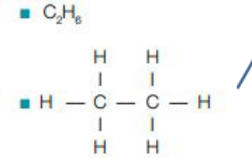
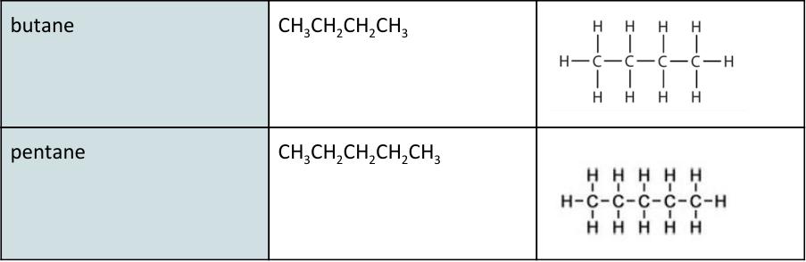

<u>Edexcel</u> IGCSE Chemistry 

Topic 4: Organic chemistry **Alkanes** 

**Notes** 

# _<mark>4.19</mark>_   _<mark>know</mark>_   _<mark>the</mark>_   _<mark>general</mark>_   _<mark>formula</mark>_   _<mark>for</mark>_   _<mark>alkanes</mark>_ {#pmt-4ch1-notes-unit-4-4c-alkanes-s1}
- CnH2n+2 is the general formula 

- E.g. ethane is C2H 6 

# _<mark>4.20</mark>_   _<mark>explain</mark>_   _<mark>why</mark>_   _<mark>alkanes</mark>_   _<mark>are</mark>_   _<mark>classified</mark>_   _<mark>as</mark>_   _<mark>saturated</mark>_   _<mark>hydrocarbons</mark>_ {#pmt-4ch1-notes-unit-4-4c-alkanes-s2}
   - Contain no C=C double bonds, therefore the carbons are saturated, because each carbon has formed its maximum of 4 single bonds 

- _<mark>4.21</mark>_   _<mark>understand</mark>_   _<mark>how</mark>_   _<mark>to</mark>_   _<mark>draw</mark>_   _<mark>the</mark>_   _<mark>structural</mark>_   _<mark>and</mark>_   _<mark>displayed</mark>_   _<mark>formulae</mark>_   _<mark>for alkanes</mark>_   _<mark>with</mark>_   _<mark>up</mark>_   _<mark>to</mark>_   _<mark>five</mark>_   _<mark>carbon</mark>_   _<mark>atoms</mark>_   _<mark>in</mark>_   _<mark>the</mark>_   _<mark>molecule,</mark>_   _<mark>and</mark>_   _<mark>to</mark>_   _<mark>name</mark>_   _<mark>the unbranched-chain</mark>_   _<mark>isomers</mark>_ 

   - Alkane molecules can be represented in the following forms: 

- The first 4 alkanes are methane, ethane, propane and butane (MEPB: Monkeys Eat Peanut Butter) 

|alkane|structural formula|displayed formula|
| _[structure figure — see source PDF]_ | _[structure figure — see source PDF]_ | _[structure figure — see source PDF]_ |
|methane|CH4| _[structure figure — see source PDF]_ |
|ethane| _[structure figure — see source PDF]_ |rant ee HH|
|propane| _[structure figure — see source PDF]_ ||

© www.pmt.education wwopmteducation 

- _<mark>4.22</mark>_   _<mark>describe</mark>_   _<mark>the</mark>_   _<mark>reactions</mark>_   _<mark>of</mark>_   _<mark>alkanes</mark>_   _<mark>with</mark>_   _<mark>halogens</mark>_   _<mark>in</mark>_   _<mark>the</mark>_   _<mark>presence</mark>_   _<mark>of ultraviolet</mark>_   _<mark>radiation,</mark>_   _<mark>limited</mark>_   _<mark>to</mark>_   _<mark>mono-substitution;</mark>_   _<mark>knowledge</mark>_   _<mark>of</mark>_   _<mark>reaction mechanisms</mark>_   _<mark>is</mark>_   _<mark>not</mark>_   _<mark>required</mark>_ 

   - Br2  + C2H 6 **** -(UV)-> C2H 5Br  + HBr 

   - Halogen + alkane –(UV)-> halogenoalkane + hydrogen halide 

© www.pmt.education wwopmteducation
