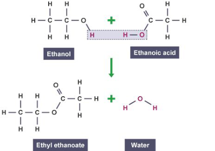
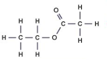

<u>Edexcel</u> IGCSE Chemistry Topic 4: Organic chemistry **Esters** 

**Notes** 

_<mark>4.38</mark>_   _<mark>(chemistry</mark>_   _<mark>only)</mark>_   _<mark>know</mark>_   _<mark>that</mark>_   _<mark>esters</mark>_   _<mark>contain</mark>_   _<mark>the</mark>_   _<mark>functional</mark>_   _<mark>group</mark>_   _<mark>–COO-</mark>_ 

- They have the functional group –COO-. 

_<mark>4.39</mark>_   _<mark>(chemistry</mark>_   _<mark>only)</mark>_   _<mark>know</mark>_   _<mark>that</mark>_   _<mark>ethyl</mark>_   _<mark>ethanoate</mark>_   _<mark>is</mark>_   _<mark>the</mark>_   _<mark>ester</mark>_   _<mark>produced</mark>_   _<mark>when ethanol</mark>_   _<mark>and</mark>_   _<mark>ethanoic</mark>_   _<mark>acid</mark>_   _<mark>react</mark>_   _<mark>in</mark>_   _<mark>the</mark>_   _<mark>presence</mark>_   _<mark>of</mark>_   _<mark>an</mark>_   _<mark>acid</mark>_   _<mark>catalyst</mark>_ 

- Carboxylic acids react with alcohols in the presence of an acid catalyst to produce esters 

- ethyl ethanoate is produced when ethanol and ethanoic acid react: 

- _<mark>4.40</mark>_   _<mark>(chemistry</mark>_   _<mark>only)</mark>_   _<mark>understand</mark>_   _<mark>how</mark>_   _<mark>to</mark>_   _<mark>write</mark>_   _<mark>the</mark>_   _<mark>structural</mark>_   _<mark>and</mark>_   _<mark>displayed formulae</mark>_   _<mark>of</mark>_   _<mark>ethyl</mark>_   _<mark>ethanoate</mark>_ 

structural formula: CH3COOCH 2CH 3 displayed formula: 

© www.pmt.education wwopmteducation 

_<mark>4.41</mark>_   _<mark>(chemistry</mark>_   _<mark>only)</mark>_   _<mark>understand</mark>_   _<mark>how</mark>_   _<mark>to</mark>_   _<mark>write</mark>_   _<mark>the</mark>_   _<mark>structural</mark>_   _<mark>and</mark>_   _<mark>displayed formulae</mark>_   _<mark>of</mark>_   _<mark>an</mark>_   _<mark>ester,</mark>_   _<mark>given</mark>_   _<mark>the</mark>_   _<mark>name</mark>_   _<mark>or</mark>_   _<mark>formula</mark>_   _<mark>of</mark>_   _<mark>the</mark>_   _<mark>alcohol</mark>_   _<mark>and carboxylic</mark>_   _<mark>acid</mark>_   _<mark>from</mark>_   _<mark>which</mark>_   _<mark>it</mark>_   _<mark>is</mark>_   _<mark>formed</mark>_   _<mark>and</mark>_   _<mark>vice</mark>_   _<mark>versa</mark>_ 

- naming esters: 

   - first part comes from alcohol, remove -anol and replace with -yl e.g. propanol → propyl 

   - second part comes from carboxylic acid, remove -oic acid and replace with -oate e.g. methanoic acid → methanoate 

   - full name from propanol and methanoic acid would be propyl methanoate 

- structure of esters: 

   - H is lost from alcohol and OH from carboxylic acid, bond forms between C in carboxylic acid and O in alcohol 

_<mark>4.42</mark>_   _<mark>(chemistry</mark>_   _<mark>only)</mark>_   _<mark>know</mark>_   _<mark>that</mark>_   _<mark>esters</mark>_   _<mark>are</mark>_ <mark>…</mark> 

- Volatile compounds with distinctive smells 

- Used as food flavourings and in perfumes 

_<mark>4.43</mark>_   _<mark>(chemistry</mark>_   _<mark>only)</mark>_   _<mark>practical:</mark>_   _<mark>prepare</mark>_   _<mark>a</mark>_   _<mark>sample</mark>_   _<mark>of</mark>_   _<mark>an</mark>_   _<mark>ester</mark>_   _<mark>such</mark>_   _<mark>as</mark>_   _<mark>ethyl ethanoate</mark>_
