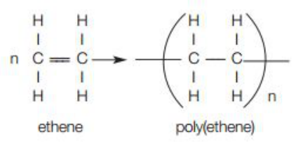
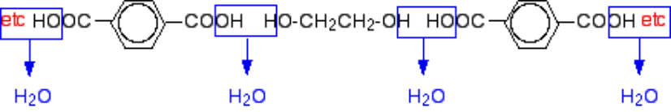

<u>Edexcel</u> IGCSE Chemistry Topic 4: Organic chemistry   **Synthetic**   **polymers** 

**Notes** 

# _<mark>4.44</mark>_   _<mark>know</mark>_   _<mark>that</mark>_   _<mark>an</mark>_   _<mark>addition</mark>_   _<mark>polymer</mark>_   _<mark>is</mark>_   _<mark>formed</mark>_   _<mark>by</mark>_   _<mark>joining</mark>_   _<mark>up</mark>_   _<mark>many</mark>_   _<mark>small molecules</mark>_   _<mark>called</mark>_   _<mark>monomers</mark>_ {#pmt-4ch1-notes-unit-4-4h-synthetic-polymers-s1}
- Alkenes can be used to make polymers such as poly(ethane) and poly(propene) by addition polymerisation. In this reaction, many small molecules (monomers) join together to create very large molecules (polymers). For example: 

- The repeat unit has the same atoms as the monomer because no other molecule is formed in the reaction 

# _<mark>4.45</mark>_   _<mark>understand</mark>_   _<mark>how</mark>_   _<mark>to</mark>_   _<mark>draw</mark>_   _<mark>the</mark>_   _<mark>repeat</mark>_   _<mark>unit</mark>_   _<mark>of</mark>_   _<mark>an</mark>_   _<mark>addition</mark>_   _<mark>polymer, including</mark>_   _<mark>poly(ethene),</mark>_   _<mark>poly(propene),</mark>_   _<mark>poly(chloroethene)</mark>_   _<mark>and (poly)tetrafluoroethene</mark>_ {#pmt-4ch1-notes-unit-4-4h-synthetic-polymers-s2}
|II|a HoH H H/n HOCH, HCH, eihene. pulidiors) Propene Polypropene H cl 4 Cl 1 == > c—c n Fy vFE etTI / \ | | Fr’C=C\F _> FF/n H H H H , Chloroethene Poly(chloroethene) _tetrafluoroethene_  ** **  _poly(tetrafluoroethene)_ (vinyl chloride) poly(vinyl chloride), PVC 

- _<mark>4.46</mark>_   _<mark>understand</mark>_   _<mark>how</mark>_   _<mark>to</mark>_   _<mark>deduce</mark>_   _<mark>the</mark>_   _<mark>structure</mark>_   _<mark>of</mark>_   _<mark>a</mark>_   _<mark>monomer</mark>_   _<mark>from</mark>_   _<mark>the</mark>_   _<mark>repeat unit</mark>_   _<mark>of</mark>_   _<mark>an</mark>_   _<mark>addition</mark>_   _<mark>polymer</mark>_   _<mark>and</mark>_   _<mark>vice</mark>_   _<mark>versa</mark>_ 

   - Monomer is just repeat unit, replacing C-C with C=C and removing brackets and “n” 

© www.pmt.education wwopmteducation 

# _<mark>4.47</mark>_   _<mark>explain</mark>_   _<mark>problems</mark>_   _<mark>in</mark>_   _<mark>the</mark>_   _<mark>disposal</mark>_   _<mark>of</mark>_   _<mark>addition</mark>_   _<mark>polymers,</mark>_   _<mark>including:</mark>_ {#pmt-4ch1-notes-unit-4-4h-synthetic-polymers-s3}
- Unable to biodegrade, because they are inert / unable to react therefore, microorganisms and bacteria are unable to break them down 

- The production of toxic gases when they are burned 

- Carbon dioxide is released when burnt– which adds to global warming 

_<mark>4.48</mark>_   _<mark>(chemistry</mark>_   _<mark>only)</mark>_   _<mark>know</mark>_   _<mark>that</mark>_   _<mark>condensation</mark>_   _<mark>polymerisation,</mark>_   _<mark>in</mark>_   _<mark>which</mark>_   _<mark>a dicarboxylic</mark>_   _<mark>acid</mark>_   _<mark>reacts</mark>_   _<mark>with</mark>_   _<mark>a</mark>_   _<mark>diol,</mark>_   _<mark>produces</mark>_   _<mark>a</mark>_   _<mark>polyester</mark>_   _<mark>and</mark>_   _<mark>water</mark>_ 

- In condensation polymerisation, a small molecule is formed as a by-product each time a bond is formed between two monomers 

- diol- molecule with 2 alcohol OH functional groups 

- dicarboxylic acid- molecule with 2 carboxylic acid COOH functional groups 

- When you react a diol and a dicarboxylic acid, the alcohol and carboxylic acid functional groups react, losing a small molecule – water 

- This is an ester – therefore a polyester is a lot of these monomers (esters) 

   - the dicarboxylic acid loses the OH group off of each COOH group 

   - the di-alcohol loses the H off of each OH group 

   - the remaining molecules join together to make a polyester 

   - the H and OH join to form water 

_<mark>4.49</mark>_   _<mark>(chemistry</mark>_   _<mark>only)</mark>_   _<mark>understand</mark>_   _<mark>how</mark>_   _<mark>to</mark>_   _<mark>write</mark>_   _<mark>the</mark>_   _<mark>structural</mark>_   _<mark>and</mark>_   _<mark>displayed formula</mark>_   _<mark>of</mark>_   _<mark>a</mark>_   _<mark>polyester,</mark>_   _<mark>showing</mark>_   _<mark>the</mark>_   _<mark>repeat</mark>_   _<mark>unit</mark>_   _<mark>given</mark>_   _<mark>the</mark>_   _<mark>formulae</mark>_   _<mark>of</mark>_   _<mark>the monomers</mark>_   _<mark>from</mark>_   _<mark>which</mark>_   _<mark>it</mark>_   _<mark>is</mark>_   _<mark>formed</mark>_   _<mark>including</mark>_   _<mark>the</mark>_   _<mark>reaction</mark>_   _<mark>of</mark>_   _<mark>ethanedioic</mark>_   _<mark>acid and</mark>_   _<mark>ethanediol</mark>_ 

- similar to polymers 

- from the monomers, identify the OH (from carboxylic acids) and H (from alcohols) that will be lost and join up the molecules at these points 

- the repeat unit is simply one of each diol and dicarboxylic acid joined together, with a bond sticking out at each end (the same as for polymers) 

© www.pmt.education wwopmteducation 

- _<mark>4.50</mark>_   _<mark>(chemistry</mark>_   _<mark>only)</mark>_   _<mark>know</mark>_   _<mark>that</mark>_   _<mark>some</mark>_   _<mark>polyesters,</mark>_   _<mark>known</mark>_   _<mark>as</mark>_   _<mark>biopolyesters, are</mark>_   _<mark>biodegradable</mark>_ 

   - Biopolyesters are biodegradable, making them easier to dispose of than other polyesters
