# Exam Questions — States of Matter
**1. Principles of Chemistry** · Edexcel IGCSE Chemistry 4CH1
> Source: [https://www.savemyexams.com/igcse/chemistry/edexcel/19/topic-questions/1-principles-of-chemistry/1-1-states-of-matter/exam-questions/](https://www.savemyexams.com/igcse/chemistry/edexcel/19/topic-questions/1-principles-of-chemistry/1-1-states-of-matter/exam-questions/) · 23 questions · total 120 marks

## Q1 — easy — 7 marks

### 2 — 5 marks — command: complete — structured
This question is about states of matter.

The names of some terms are given in the box.

| melting | deposition | evaporation |
|---|---|---|
| condensing | sublimation | freezing |
| boiling point | liquid | gas |

Complete the table by choosing the term from the box that matches each description.

Each substance may be used once, more than once, or not at all.

| Description | Substance |
|---|---|
| the state of ammonia at room temperature |   |
| when particles gain the most energy at constant temperature |   |
| the process of forming frost on a cold day |   |
| particles break away from their fixed arrangement |   |
| when kerosene is produced from crude oil |   |

### 2 — 2 marks — command: describe — structured
Describe a test for ammonia.

## Q2 — easy — 1 marks

### 3 — 1 mark — multiple_choice
Substances exist as solids, liquids or gases.

What change of state occurs at Y?
- **A.** Melting
- **B.** Freezing
- **C.** Boiling
- **D.** Condensation

## Q3 — hard — 5 marks

### 2(a) — 3 marks — command: which — structured — from paper 2021 · Ja1C
The table gives the melting and boiling points of four pure substances, W, X, Y and Z.

|   | **Melting point in °C** | **Boiling point in °C** |
|---|---|---|
| W | -7 | 60 |
| X | 660 | 2500 |
| Y | 180 | 1330 |
| Z | 115 | 445 |

Use data from the table to answer the questions.

i) Which substance is a gas at 100 °C?

(1)

| ☐ | **A** | W |
|---|---|---|
| ☐ | **B** | X |
| ☐ | **C** | Y |
| ☐ | **D** | Z |

ii) Which substance is a liquid for the largest range of temperature?

(1)

| ☐ | **A** | W |
|---|---|---|
| ☐ | **B** | X |
| ☐ | **C** | Y |
| ☐ | **D** | Z |

iii) Which substance is a liquid at 1000 °C and a gas at 2000 °C?

(1)

| ☐ | **A** | W |
|---|---|---|
| ☐ | **B** | X |
| ☐ | **C** | Y |
| ☐ | **D** | Z |

### 2(b) — 1 mark — command: give — structured — from paper 2021 · Ja1C
Substance Y does not conduct electricity when solid but does conduct electricity when molten.

Give the type of bonding in substance Y.

### 2(c) — 1 mark — command: suggest — structured — from paper 2021 · Ja1C
Suggest how the melting point of a pure substance changes when an impurity is added.

## Q4 — easy — 1 marks

### 5 — 1 mark — multiple_choice
The diagram below shows a bottle of perfume which has been sprayed in a room. Very soon the perfume can be smelled in every part of the room.

Which statement explains these observations?
- **A.** The perfume particles diffuse into the air
- **B.** The perfumes particles sublime into the air
- **C.** The perfume particles are carried in air currents
- **D.** The perfume particles are changing state

## Q5 — hard — 9 marks

### 4(a) — 3 marks — command: multiple — structured — from paper 2021 · Jun2C
A student investigates the solubility of potassium nitrate in water. She measures the masses of potassium nitrate that dissolve in 25 cm3 of water at different temperatures.

The table shows the student’s results.

One of the results is anomalous.

| Temperature in °C | 10 | 20 | 30 | 40 | 50 | 60 | 70 |
|---|---|---|---|---|---|---|---|
| Mass of potassium nitrate in g | 8.0 | 10.0 | 12.5 | 16.0 | 17.5 | 26.5 | 34.0 |

i) Plot the results on the grid.

(1)

ii) Draw a circle around the anomalous result.

(1)

iii) Ignoring the anomalous result, draw a curve of best fit.

(1)

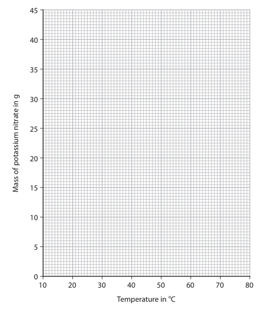

### 4(b) — 2 marks — command: suggest — structured — from paper 2012 · Jun2C
Suggest two possible mistakes that could have caused the anomalous result.

1. ..............................................................

2. ..............................................................

### 4(c) — 2 marks — command: show — structured — from paper 2021 · Jun2C
Use your graph to find the maximum mass of potassium nitrate that dissolves in 25 cm3 of water at 75 °C.

Show on your graph how you obtained your answer.

mass = ............................................... g

### 4(d) — 2 marks — command: calculate — structured — from paper 2021 · Jun2C
Use your graph to calculate the solubility of potassium nitrate in g per 100 g of water at 25 °C.

[1.0 cm3 of water has a mass of 1.0 g]

solubility = ............................................... g per 100g of water

## Q6 — medium — 9 marks

### 4(a) — 1 mark — command: give — structured — from paper 2020 · Ja1CR
This question is about ammonium chloride.

Give the formula of the ammonium ion.

### 4(b) — 3 marks — command: describe — structured — from paper 2020 · Ja1CR
Describe a test to show that ammonium chloride contains ammonium ions.

### 4(c) — 1 mark — command: state — structured — from paper 2020 · Ja1CR
The equation shows the thermal decomposition of ammonium chloride.

NH4Cl(s) $\rightleftharpoons$ NH3(g) + HCl(g)

State what the $\rightleftharpoons$ symbol indicates about this reaction.

### 4(d) — 4 marks — command: multiple — structured — from paper 2020 · Ja1CR
The diagram shows the formation of ammonium chloride in a glass tube.

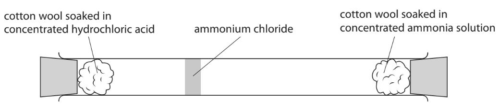

i) Explain how the mean speed of ammonia molecules compares with the mean speed of hydrogen chloride molecules.

(2)

ii) Gas particles travel very quickly.

Give two reasons why it takes several minutes for the ammonium chloride to form.

(2)

## Q7 — easy — 1 marks

### 8 — 1 mark — multiple_choice
The diagram shows a mirror in a bathroom. As the water vapour cools it turns into droplets of water on the bathroom mirror.

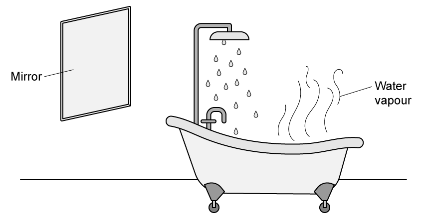

When the water vapour changes to liquid water the change is called
- **A.** vaporisation
- **B.** condensation
- **C.** sublimation
- **D.** evaporation

## Q8 — medium — 6 marks

### 2(a) — 3 marks — command: draw — structured — from paper 2020 · Nov1C
The boxes list changes that may happen in a laboratory and the names of some changes.

Draw **one** straight line from each change to its correct name.

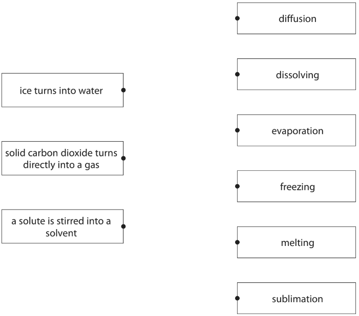

### 2(b) — 3 marks — command: describe — structured — from paper 2020 · Nov1C
A student has two solids, X and Y.

One of these solids is a pure substance and the other is a mixture.

Describe how the student could identify which solid is pure and which is a mixture by measuring a physical property of each solid.

## Q9 — medium — 7 marks

### 3(a) — 3 marks — command: complete — structured — from paper 2022 · Jan1C
This question is about states of matter.

The box gives words relating to changes of state.

| condensation | cooling | evaporation |
|---|---|---|
| freezing | melting | sublimation |

Complete the table by giving the correct word from the box for each change of state.

| **Change of state** | **Name of change** |
|---|---|
| solid to liquid |   |
| solid to gas |   |
| liquid to solid |   |

### 3(b) — 4 marks — command: multiple — structured — from paper 2022 · Jan1C
When ammonia gas and hydrogen chloride gas mix, they react together to form a white solid called ammonium chloride.

The equation for the reaction is

NH3 (g) + HCl (g) → NH4Cl (s)

A teacher soaks a piece of cotton wool in concentrated ammonia solution and another piece of cotton wool in concentrated hydrochloric acid.

The teacher places the two pieces of cotton wool at opposite ends of a glass tube at the same time.

After several minutes, a white ring of solid ammonium chloride forms.

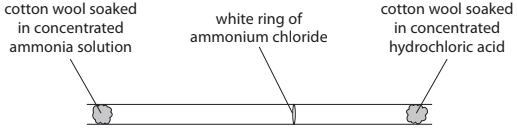

i) State the name given to the spreading out of gas particles.

(1)

ii) State how the diagram shows that the particles of ammonia gas are travelling at higher speeds than the particles of hydrogen chloride gas.

(1)

iii) Gas particles travel at high speeds.

Give a reason why the white ring of ammonium chloride takes several minutes to form.

(1)

iv) Concentrated ammonia solution and concentrated hydrochloric acid are corrosive.

Give one safety precaution the teacher should take.

(1)

## Q10 — medium — 4 marks

### 1(a) — 1 mark — multiple_choice — from paper 2019 · Ju1c
Potassium permanganate is a purple solid that is soluble in water.

A crystal of potassium permanganate is placed in a beaker containing water.

After a short time, the crystal becomes smaller and the liquid at the bottom of the beaker becomes purple.

Which statement explains this observation?
- **A.** the crystal condenses in the water
- **B.** the crystal dissolves in the water
- **C.** the crystal evaporates in the water
- **D.** the crystal melts in the water

### 1(b) — 2 marks — command: multiple — structured — from paper 2019 · Ju1c
The beaker is left until there is no further change in the appearance of the liquid.

i) Which statement describes the final appearance of the liquid?

(1)

| ☐ | **A** | all of the liquid is purple |
|---|---|---|
| ☐ | **B** | none of the liquid is purple |
| ☐ | **C** | only the bottom half of the liquid is purple |
| ☐ | **D** | only the top half of the liquid is purple |

ii) Which process causes this change in appearance?

(1)

| ☐ | **A** | condensation |
|---|---|---|
| ☐ | **B** | crystallisation |
| ☐ | **C** | diffusion |
| ☐ | **D** | evaporation |

### 1(c) — 1 mark — multiple_choice — from paper 2019 · Ju1c
The formula of potassium permanganate is KMnO4.

How many different elements are there in potassium permanganate?
- **A.** 3
- **B.** 4
- **C.** 6
- **D.** 7

## Q11 — easy — 7 marks

### 2(a) — 2 marks — command: multiple — structured — from paper 2020 · Ja1CR
This question is about states of matter.

The diagram shows how the particles of a substance are arranged in two different states.

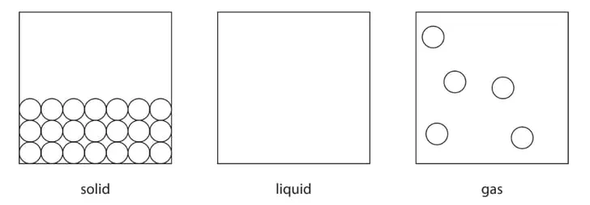

i) Complete the diagram to show how particles are arranged in the liquid state.

(1)

ii) Identify the state of matter in which the particles have the most energy.

(1)

### 2(b) — 3 marks — command: complete — structured — from paper 2020 · Ja1CR
The state symbols (s), (l), (g) and (aq) are often used in chemistry. The table shows some physical changes. Complete the table by giving the state symbol before and after each change.

|   | **State symbol** |   |
|---|---|---|
| **Physical change** | **before change** | **after change** |
| water evaporates |   |   |
| crystals of iodine sublime |   |   |
| ice melts |   |   |

### 2(c) — 2 marks — command: explain — structured — from paper 2020 · Ja1CR
Explain why hot water evaporates more quickly than cold water.

## Q12 — medium — 6 marks

### 1(a) — 3 marks — command: give — structured — from paper 2021 · Ja1C
This question is about states of matter.

Use the words solid, liquid or gas to give the initial and final state of matter for each of the changes listed in the table. The first one has been done for you.

| **Change** | **Initial state** | **Final state** |
|---|---|---|
| melting | solid | liquid |
| sublimation |   |   |
| condensing |   |   |
| evaporation |   |   |

### 1(b) — 3 marks — command: describe — structured — from paper 2021 · Ja1C
Particles in a solid are closely packed, arranged in a regular pattern and vibrate about fixed positions.

Describe the arrangement and movement of the particles in a gas.

## Q13 — easy — 6 marks

### 2(a) — 2 marks — command: state — structured — from paper 2022 · Jan1CR
i) State the meaning of the term **solute**.

(1)

ii) State the meaning of the term **solvent**.

(1)

### 2(b) — 2 marks — command: explain — structured — from paper 2022 · Jan1CR
Explain what is meant by a **saturated solution.**

### 2(c) — 2 marks — command: explain — structured — from paper 2022 · Jan1CR
A dark purple liquid is diluted by adding water.

The diluted liquid becomes a pale purple colour.

Explain the process that causes this change.

Refer to particles in your answer.

## Q14 — easy — 5 marks

### 1(a) — 2 marks — command: multiple — structured — from paper 2021 · Jan2CR
Substances can exist as solids, liquids or gases.

i) Give the change of state that occurs when a substance melts.

(1)

ii) Complete the word equation for the sublimation of iodine.

iodine (s) → iodine (...........)

(1)

### 1(b) — 1 mark — command: show — structured — from paper 2021 · Jan2CR
The circle in the diagram represents a particle.

Complete the diagram to show the arrangement of particles in a gas.

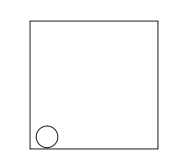

### 1(c) — 2 marks — command: place — structured — from paper 2021 · Jan2CR
The table lists some statements about particles.

Place ticks (✔) in boxes to show which two statements are correct for water particles.

| **Statement** | **Tick** |
|---|---|
| the particles only vibrate |   |
| the particles do not move |   |
| the particles have no gaps between them |   |
| the particles move randomly |   |
| the particles have more energy than in ice |   |
| the particles have a regular arrangement |   |

## Q15 — easy — 1 marks

### 16 — 1 mark — multiple_choice
A crystal of potassium permanganate is placed in a beaker and left for a short time and a purple liquid is seen at the bottom of the beaker.

Which statement is correct?
- **A.** Potassium permanganate solution is formed
- **B.** Water is the solute
- **C.** A saturated solution is formed
- **D.** The crystal sublimes

## Q16 — easy — 6 marks

### 3(a) — 3 marks — command: multiple — structured — from paper 2021 · Ju1C
Some sugar is added to cold water in a beaker.

After some time, all the sugar dissolves and spreads throughout the water.

i) Name the process that occurs that causes the sugar to spread throughout the water.

(1)

ii) State two ways to make the sugar dissolve more quickly.

(2)

### 3(b) — 3 marks — command: multiple — structured — from paper 2021 · Ju1c
Pure water can be obtained from the sugar solution using this apparatus.

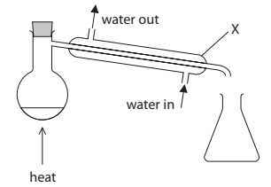

i) Name the process used to obtain pure water from the sugar solution.

(1)

ii) Explain the purpose of the piece of apparatus labelled X.

(2)

## Q17 — medium — 6 marks

### 1(a) — 3 marks — command: complete — structured — from paper 2019 · Ju1CR
This question is about the three states of matter, solid, liquid and gas.

Solids, liquids and gases can be changed from one state to another.

| condensing | evaporation | melting | sublimation |
|---|---|---|---|

Use words from the box to complete the sentences.

Each word may be used once, more than once or not at all.

i) The change from solid to liquid is called

(1)

ii) The change from liquid to gas is called

(1)

iii) The change from solid to gas is called

(1)

### 1(b) — 3 marks — command: describe — structured — from paper 2019 · Ju1CR
Describe the arrangement and the movement of particles in a solid.

## Q18 — medium — 1 marks

### 19 — 1 mark — multiple_choice
The solubility curve for copper(II)sulfate is shown below:

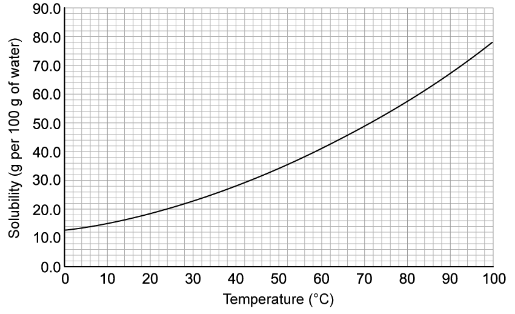

Which of these statements is supported by the graph?
- **A.** At 50 oC the solubility of copper(II) sulfate is 71 g per 100 g water
- **B.** At 60 oC the solubility of copper(II) sulfate is 41 g per 100 g of water
- **C.** The solubility of copper(II) sulfate doubles for every 10 oC rise
- **D.** 30 g of copper(II) sulfate can dissolve in 100 g of water at 20 oC

## Q19 — hard — 8 marks

### 3(a) — 2 marks — command: name — structured — from paper 2021 · Ja1C
Lead nitrate and potassium iodide react to form the insoluble solid lead iodide. Crystals of lead nitrate and potassium iodide are placed at opposite ends of a container of water. Solid lead iodide forms after several minutes.

The diagram shows the container at the start and after several minutes.

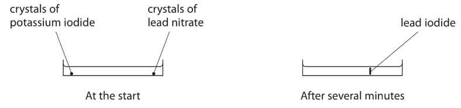

Name the two processes that occur before the solid lead iodide forms.

### 3(b) — 3 marks — command: explain — structured — from paper 2021 · Ja1C
Explain why solid lead iodide takes less time to form when the reaction is repeated using water at a higher temperature.

### 3(c) — 2 marks — command: give — structured — from paper 2021 · Ja1C
The formula for lead nitrate is Pb(NO3)2

i) Give the number of different elements in lead nitrate.

(1)

ii) Give the charge on the lead ion in Pb(NO3)2

(1)

### 3(d) — 1 mark — command: complete — structured — from paper 2021 · Ja1C
Complete the chemical equation for the reaction between lead nitrate and potassium iodide.

Pb(NO3)2 (aq) + .......... KI (aq) → PbI2 (s) + .......... KNO3 (aq)

## Q20 — medium — 7 marks

### 3(a) — 1 mark — command: state — structured — from paper 2017 · Specimen1C
Ammonium chloride decomposes in a reversible reaction. The equation for this reaction is

NH4Cl (s) $\rightleftharpoons$ NH3 (g) + HCl (g)

State how the equation shows that the reaction is reversible.

### 3(b) — 3 marks — command: multiple — structured — from paper 2017 · Specimen1C
Some ammonium chloride is heated gently in a test tube.

The diagram shows the test tube after it has been heated gently for a short time.

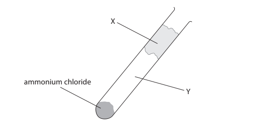

i) Identify solid X and the two gases formed in region Y of the test tube.

Solid** X** ................................................................................................

Gases at **Y** ..................................................................................................

(2)

ii) Which change of state occurs in the test tube during heating?

(1)

| ☐ | **A** | condensing |
|---|---|---|
| ☐ | **B** | evaporating |
| ☐ | **C** | melting |
| ☐ | **D** | subliming |

### 3(c) — 3 marks — command: explain — structured — from paper 2017 · Specimen1C
An experiment involving ammonium chloride can be used to show the process of diffusion.

The diagram shows the apparatus at the start of the experiment.

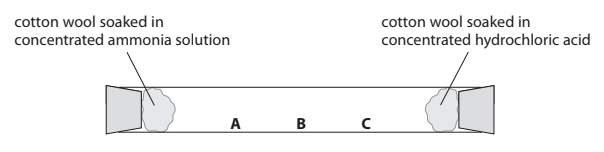

At the end of the experiment, a white solid forms in the test tube.

Explain which position, A, B or C, shows where the white solid forms.

## Q21 — hard — 9 marks

### 3(a) — 4 marks — command: multiple — structured — from paper 2022 · Jan2C
This question is about solubility.

The graph shows the solubilities of copper(II) chloride and sodium chloride at different temperatures.

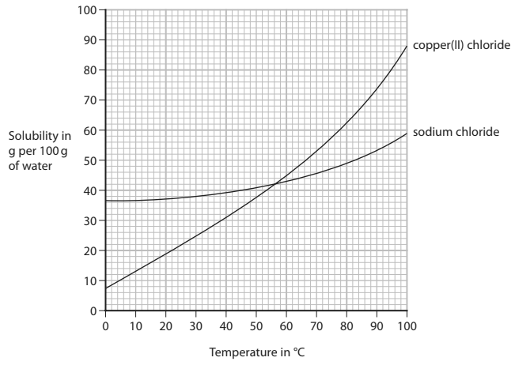

i) Determine the temperature at which copper(II) chloride and sodium chloride have the same solubility.

Show on the graph how you obtained your answer.

(2)

temperature = .............................. °C

ii) A saturated solution of copper(II) chloride in 100 g of water is cooled from 40 °C to 10 °C.

Determine the mass, in grams, of copper(II) chloride that crystallises.

(2)

mass of copper(II) chloride = .............................. g

### 3(b) — 5 marks — command: multiple — structured — from paper 2022 · Jan2C
A student uses this method to determine the solubility of potassium chloride in water at room temperature.

- record the mass of an empty evaporating basin
- pour some saturated potassium chloride solution into the evaporating basin
- record the mass of the evaporating basin and saturated potassium chloride solution
- heat the evaporating basin to remove all the water
- record the mass of the evaporating basin and the dry potassium chloride

The table shows the student’s results.

|   | **Mass in grams** |
|---|---|
| evaporating basin | 58.1 |
| evaporating basin and saturated potassium chloride solution | 78.2 |
| evaporating basin and dry potassium chloride | 63.2 |

i) Calculate the mass of dry potassium chloride obtained.

(1)

mass = .............................. g

ii) Calculate the mass of water removed.

(1)

mass = .............................. g

iii) Calculate the solubility of potassium chloride in grams per 100 grams of water.

(2)

solubility = .............................. g per 100 g of water

iv) Suggest why the student’s method is not suitable for determining the solubility of hydrated copper(II) sulfate.

(1)

## Q22 — easy — 1 marks

### 23 — 1 mark — multiple_choice
The diagram shows the three states of matter for a substance:

Which statement is correct about the movement or arrangement of the particles?
- **A.** In the solid the particles move fast in all directions
- **B.** In the gas the particles are close together
- **C.** In the liquid the particles move randomly
- **D.** In the liquid the particles vibrate about fixed positions

## Q23 — hard — 7 marks

### 2(a) — 2 marks — command: calculate — structured — from paper 2017 · Specimen2C
This is a method used to measure the solubility of a solid in water:

- add an excess of solid to some water in a boiling tube and stir
- measure the temperature of the saturated solution formed
- weigh an empty evaporating basin
- pour some of the saturated solution into the evaporating basin
- weigh the basin and contents
- heat the evaporating basin to remove all of the water
- weigh the evaporating basin and remaining solid

The table shows the results of an experiment using this method.

| mass of evaporating basin / g | 89.6 |
|---|---|
| mass of evaporating basin + saturated solution / g | 115.8 |
| mass of evaporating basin + solid / g | 94.9 |

Calculate the mass of solid obtained and the mass of water removed.

mass of solid = .............................................................. g mass of water = .............................................................. g

### 2(b) — 2 marks — command: calculate — structured — from paper 2017 · Specimen2C
In another experiment, at a different temperature, the mass of solid obtained is 10.5 g and the mass of water removed is 16.8 g.

Calculate the solubility of the solid, in g per 100 g of water, at this temperature.

solubility = .............................................................. g per 100 g of water

### 2(c) — 3 marks — command: explain — structured — from paper 2017 · Specimen2C
If the evaporating basin is heated too strongly, some of the solid decomposes to form a gas.

Explain how this strong heating would affect the value of the calculated solubility of the solid.
