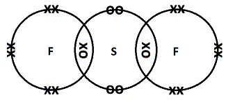
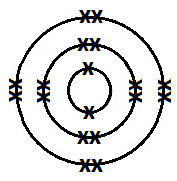

# Mark Schemes — The Periodic Table
**1. Principles of Chemistry** · Edexcel IGCSE Chemistry 4CH1

## Q1 — medium — 4 marks

### 2 — 4 marks
The completed table is:

| Statement |   |
|---|---|
| The name of the element with atomic number 18. | **argon** **[1]** |
| The name of the element with relative atomic mass 7. | **lithium ****[1]** |
| The name of the element in Group 3, Period 4. | **gallium ****[1]** |
| The electronic configuration of the element phosphorus. | **2.8.5** **[1]** |

> **[exam-tip]**
> Examiners sometimes comment that students don't read instructions, especially when asked for the symbol versus the name of an element.
> 
> You will probably still receive credit for this question if you gave the symbol, but it's good practice to read the question carefully!
> 
> To deduce the electronic configuration:
> 
> 1. Find the atomic number from the Periodic Table
> 2. A neutral phosphorus atom has 15 electrons
> 3. Fill the shells:
> 
>   - 2 electrons in the first shell
>   - 8 electrons in the second shell
>   - This leaves 5 electrons for the third shell
>   - This gives the configuration **2.8.5**.

## Q2 — medium — 1 marks

### 3 — 1 marks
**Correct answer: D** — element R

**Final answer:** **The correct answer is D**

- The element with the electronic configuration 2,8,3 is D.
- The position of R corresponds to a group 3 element, which must have three outer electrons
- It is also in the third period

  - The first short period (H and He) is not shown on this table, but it should be obvious that R is in the third row of the periodic table

## Q3 — hard — 11 marks

### 4 — 2 marks
i) The element whose atoms contain 10 neutrons and 9 protons is:

- Fluorine / F; **[1 mark]**

ii) The element whose atoms have the electronic configuration 2.8.5 is:

- Phosphorous / P; **[1 mark]**

**[Total: 2 marks]**

- *The element with 10 neutrons and 9 electrons has an atomic mass of 19, which corresponds to *`straight F presubscript 9 presuperscript 19`* *
- *The element with the electronic configuration 2.8.5 has 15 electrons (2 + 8 + 5 = 15)*

  - *You are not told any other information so you have to assume that it is electronically neutral and, therefore, has 15 protons*
  - *15 protons means an atomic / proton number of 15, which corresponds to *`straight P presubscript 15 presuperscript 31`

### 4 — 1 marks
The name of the compound formed between the element with an electronic configuration of 2.8.6 and the non-metallic element in Group 3 is:

- Boron sulfide; **[1 mark]**

**[Total: 1 mark]**

- *An electronic configuration of 2.8.6 means that the element has 16 electrons (2 + 8 + 6 = 16)*

  - *You are not told any other information so you have to assume that it is electronically neutral and, therefore, has 16 protons*
  - *16 protons means an atomic / proton number of 16, which corresponds to sulfur*
- *The only non-metallic element in Group 3 is boron*
- *Boron + sulfur → boron sulfide*

  - *Remember:** When two elements form a compound, the products name will normally end in –IDE*

### 4 — 5 marks
i) The type of bonding present in the white solid is:

- Ionic; **[1 mark]**

ii) The changes that occur to the atoms of both elements as they react to form the white solid are:

- Nitrogen correctly identified 
**AND **
Aluminium correctly identified; **[1 mark]**
- Nitrogen gains <u>three</u> electrons **AND** aluminium loses / gives / donates <u>three</u> electrons 
**OR **
Aluminium transfers <u>three</u> electrons to nitrogen; **[1 mark]**
- Nitrogen forms a 3– ion 
**AND **
Aluminium forms a 3+ ion; **[1 mark]**

iii) The chemical formula of the white solid is:

- AlN; **[1 mark]**

**[Total: 5 marks]**

- *The element with an atomic number of 7 is nitrogen, which is a non-metal*
- *The element with an electronic configuration of 2.8.3 is aluminium, which is a metal*
- *The reaction of a metal and a non-metal forms an ionic compound*

  - *Word equation: aluminium + nitrogen → aluminium nitride*
- *In ionic bonding*

  - *The metal aluminium will lose three electrons to form an Al**3+** ion*
  - *The non-metal nitrogen will gain three electrons to form an N**3–** ion*
  - *Chemical equation: Al + N → AlN*
  
    - *The reaction requires one Al**3+** ion and one N**3–** ion to form the compound since the charges cancel out*

### 4 — 3 marks
i) The dot-and-cross diagram to show the bonding in a molecule of the compound formed with a relative molecular mass (*M*r) of 70 is:

- 2 bonding pairs (between S and F / in the S F overlap); **[1 mark]**
- Rest of the molecule fully correct; **[1 mark]**

ii) The molecular formula of the alternative product with a relative molecular mass (*M*r) of 146 is:

- SF6; **[1 mark]**

**[Total: 3 marks]**

- *The Group 6 element whose oxides are linked to acid rain is sulfur*
- *The element with an electronic configuration of 2.7 is fluorine*
- *Under different conditions, they react to form various sulfur fluoride compounds*
- *The sulfur fluoride compound with a relative molecular mass of 70 is SF**2** (32 + 19 + 19 = 70)*

  - *This means that you are drawing the dot-and-cross diagram for SF**2*
  - *Each fluorine atom will form one covalent bond by sharing one electron with a central sulfur atom*
  - *Make sure that each atom has a share of 8 electrons*
- *The sulfur fluoride compound with a relative molecular mass of 146 is SF**6** (32 + (19 x 6) = 146)*

## Q4 — medium — 1 marks

### 5 — 1 marks
**Correct answer: D** — They have full outer shells

**Final answer:** **The correct answer is D**

- The elements have similar chemical and physical properties because  They have full outer shells.
- All these elements have a full outer shell of electrons
- A full outer shell makes them unreactive, which is a property of these group members

## Q5 — medium — 1 marks

### 6 — 1 marks
**Correct answer: D** — 

**Final answer:** **The correct answer is D**

- The electronic configuration of a nitrogen atom is D.
- Nitrogen has atomic number 7, which means it has 7 electrons in the atom
- The first shell holds only 2 electrons

  - So, the configuration has 2 electrons in the first shell and 5 electrons in the second shell

## Q6 — easy — 7 marks

### 1(a) — 5 marks
i) The element with atomic number 5 is:

- Boron / B; **[1 mark]**

ii) The symbol of a metallic element in Period 3 is:

- Na / Mg / Al; **[1 mark]**

iii) The element whose atoms contain 14 protons is:

- Silicon / Si; **[1 mark]**

iv) The element whose atoms have the electronic configuration 2.5 is:

- Nitrogen / N; **[1 mark]**

v) The name of the compound formed between oxygen and the element with atomic number 13 is:

- Aluminium oxide / Al2O3; **[1 mark]**

**[Total: 5 marks]**

- *The atomic number is the smallest number on the chemical symbol*

  - *This means that atomic number 5 is boron*
- *Period 3 is the third row of the Periodic Table*

  - *The metals in this period / row are sodium, magnesium and aluminium*
- *The atomic number is sometimes known as the proton number*

  - *This means that you are looking for the element with an atomic number of 14, which is silicon*
- *An electron configuration of 2.5 means that there are 2 + 5 = 7 electrons *

  - *Since you are looking for an element (not an ion) it will also have 7 protons*
  - *Therefore, the element has an atomic number of 7 and is nitrogen*
- *The element with atomic number 13 is aluminium*

  - *Aluminium + oxygen → aluminium oxide*

### 1(b) — 2 marks
i) The group that contains elements that are all unreactive is:

- **D** / Group 0; **[1 mark]**

ii) The least reactive element in Group 1 is:

- **B** / lithium; **[1 mark]**

**[Total: 2 marks]**

- *Group 0 are the Noble gases which are known for being unreactive due to having a complete / full outer shell of valence electrons*
- *In Group 1, the elements get more reactive as you move down the Group*

  - *This means that you are looking for the element that is highest up / nearest to the top of the Group*

## Q7 — medium — 6 marks

### 1(a) — 3 marks
i) The element with atomic number 14 is:

- Silicon; **[1 mark]**

ii) The element with a relative atomic mass of 11 is:

- Boron; **[1 mark]**

iii) The element in Group 2 and Period 3 is:

- Magnesium; **[1 mark]**

**[Total: 3 marks] **

- *Elements are arranged on the Periodic Table in order of increasing atomic number *
- *The Periodic Table groups are the columns and periods are the rows*

### 1(b) — 3 marks
i) The number of neutrons in a phosphorus atom with mass number 31 is:

- Sixteen / 16; **[1 mark]**

ii) The electronic configuration of an aluminium atom is:

- 2.8.3 / 2,8,3; **[1 mark]**

iii) Neon is unreactive because:

- It does not (easily) gain / lose / share electrons
OR
It has a full outer shell / 8 outer electrons; **[1 mark]**

**[Total: 3 marks] **

- *Phosphorus has 15 protons as its atomic number is 15*

  - *Number of neutrons = Mass number - Proton number*

## Q8 — medium — 1 marks

### 9 — 1 marks
**Correct answer: D** — 2,8,4

**Final answer:** **The correct answer is D**

- The electronic configuration of silicon is  2,8,4
- The first shell, which is closest to the nucleus, contains 2 electrons
- The second shell has 8 electrons
- The third shell has 4 electrons
- So, the electron configuration is 2,8,4

## Q9 — easy — 7 marks

### 1(a) — 5 marks
The completed table matching substances with descriptions is:

| **Description** | **Substance** |
|---|---|
| a good conductor of electricity | copper / Cu; **[1 mark]** |
| an element that has a basic oxide | copper / Cu; **[1 mark]** |
| a substance used as a fuel | methane / CH4; **[1 mark]** |
| a major cause of acid rain | sulfur dioxide / SO2; **[1 mark]** |
| a non‐metallic element that is a solid at room temperature | iodine / I; **[1 mark]** |

**[Total: 5 marks]**

- *You are expected to know the properties of various elements and compounds, as shown in this question*
- *The main tricky ones in this question are:*

  - *The element that has a basic oxide - this is an element that can react with oxygen to form a basic oxide*
  
    - *Bromine, iodine and nitrogen will not form a  basic oxide - this leaves copper*
  - *The non-metallic element that is a solid at room temperature*
  
    - *The non-metallic elements are bromine, iodine and nitrogen*
    - *Bromine is a liquid, nitrogen is a gas - this leaves iodine which is solid at room temperature *

### 1(b) — 2 marks
The test for carbon dioxide is:

- Bubble the gas / carbon dioxide through limewater / calcium hydroxide; **[1 mark]**
- (The limewater / calcium hydroxide) turns cloudy / milky 
**OR **
(The limewater / calcium hydroxide) forms a white precipitate; **[1 mark]**

**[Total: 2 marks]**

- *The second mark can only be awarded if limewater / calcium hydroxide is mentioned in the answer*

  - *You might see this shown as M2 Dep M1 on mark schemes*
- *You need to know your gas tests as it is typical for at least one of them to be in the exams*

## Q10 — hard — 8 marks

### 11 — 2 marks
The letter of the two** **elements that belong to the same group and the group they belong to are:

- K / sodium **AND **L / potassium; **[1 mark]**
- Group 1; **[1 mark]**

**[Total: 2 marks]**

- *K** is sodium as it has 11 electrons (2 + 8 + 1 = 11) therefore its atomic number is 11*
- *L** is potassium as it has 19 electrons (2 + 8 + 8 + 1 = 19) therefore its atomic number is 19*
- *Both of these have one electron in their outer shell so are in Group 1*

### 11 — 2 marks
i) The letter of the element that is represented by the atom labelled A is:

- N / silicon; **[1 mark]**

ii) The diagram shows that the atom labelled B is oxygen because:

Any **one **of the following:

- Oxygen is a smaller atom / particle than N / silicon; **[1 mark]**
- Oxygen forms two bonds; **[1 mark]**

**[Total: 2 marks]**

- *Careful:** The atom labelled A is pointing to a black coloured atom showing 2 covalent bonds, however the same coloured atom shows 4 covalent bonds elsewhere in the structure*

  - *This means that atom A is capable of making four covalent bonds*
  - *Therefore, it is sharing four outer electrons and comes from Group 4*
  - *The only element in the table that can make four covalent bonds is element N with an electronic configuration of 2, 8, 4, which is silicon*
- *Having determined that atom A is silicon, you can comment on the relative size of the atoms *

  - *Oxygen is a smaller atom than silicon*
- *Alternatively, oxygen forms two covalent bonds *

  - *Throughout the structure given, atom B forms a maximum of two covalent bonds*

### 11 — 3 marks
The letter of the element that is monatomic is:

- J / argon; **[1 mark]**
- Its outer shell (of electrons) is full; **[1 mark]**
- Does not need to lose / gain electrons (for a stable electron configuration) 
**OR** 
They are unreactive; **[1 mark]**

**[Total: 3 marks]**

- *Group 0 elements are monatomic as they are unreactive*
- *Element J is the only element with a full outer shell of electrons as it has 8 electrons in its outer shell*

### 11 — 1 marks
The letters of two elements that are gases at room temperature are:

- J 
M; **[1 mark]**
*Both J and M are required for the mark*

**[Total: 1 mark]**

- *J** is argon as it has 18 electrons (2 + 8 + 8 = 18) therefore its atomic number is 18*

  - *All the elements in Group 0 (the noble gases) are gases at room temperature*
- *M** is fluorine as it has 9 electrons (2 + 7) therefore its atomic number is 9)*

  - *Fluorine is a Group 7 element that is a gas at room temperature*

## Q11 — easy — 5 marks

### 2(a) — 4 marks
i) The symbol of a metal is:

- Na / K; **[1 mark]**

ii) The symbol of a noble gas is:

- He; **[1 mark]**

iii) The symbol of a liquid at room temperature is:

- Br; **[1 mark]**

iv) The symbols of the two elements in Period 3 are:

- Na  **AND** Cl; **[1 mark]**

**[Total: 4 marks] **

- *Metals are on the left-hand side of the periodic table so this should give you the answer to part i)*
- *The noble gases are in Group 0 or Group 8 *
- *The only element that is a liquid is bromine - you need to know the physical states of the halogens (Group 7)*
- *Period 3 is the third row down, remember to include the row containing H and He, this is Period 1*

### 2(b) — 1 marks
The electronic configuration of Na is:

- 2.8.1; **[1 mark]**

**[Total: 1 mark] **

- *Sodium is in Period 3 and in Group 1*

  - *The period number will give the number of shells*
  - *The group number will give the number of electrons in the outermost shell*
- *The maximum number of electrons in each shell you need to know is 2,8,8*
- *You can also draw a diagram showing the arrangement of electrons in sodium to score the mark*
- *You can use full stops or commas in the electronic configuration*

## Q12 — hard — 10 marks

### 13 — 2 marks
Hydrogen should not be placed in Group 1 because:

Any **two** from:

- Hydrogen is a non-metal 
**OR **
Group 1 elements are metals; **[1 mark]**
- Hydrogen does not react similarly to the other Group 1 elements 
**OR **
Hydrogen does not react with water 
**OR **
Group 1 elements react with water; **[1 mark]**
- (At room temperature and pressure) hydrogen is a gas 
**OR **
(At room temperature and pressure) Group 1 elements are solids; **[1 mark]**
- Hydrogen can form a negative ion 
**OR **
Hydrogen can gain an electron 
**OR **
Group 1 elements form positive ions 
**OR **
Group 1 elements lose an electron; **[1 mark]**
- Hydrogen can form covalent bonds 
**OR  **
Hydrogen can share electrons 
**OR **
Group 1 elements form metallic bonds 
**OR **
Group 1 elements transfer electrons; **[1 mark]**

**[Total: 2 marks]**

- *This question tests your knowledge of the Group 1 elements and then compares this to hydrogen*

  - *Any differences can be used as an explanation as to why hydrogen should not be placed with the Group 1 elements*

### 13 — 2 marks
Hydrogen could be placed in Group 1 because:

- It has one electron in its outer shell; **[1 mark]**
- It can form ions with a 1+ charge; **[1 mark]**

**[Total: 2 marks]**

- *As with part (a), this question is asking you to compare Group 1 elements with hydrogen to find the similarities between them*

### 13 — 2 marks
Hydrogen could be placed in Group 7 because:

Any **two** from:

- It has one electron missing from its outer shell; **[1 mark]**
- It exists as a diatomic molecule; **[1 mark]**
- It forms covalent bonds/compounds; **[1 mark]**
- It is able to form H- ions; **[1 mark]**
- It has a low melting / boiling point; **[1 mark]**
- It is a non-metal; **[1 mark]**

**[Total: 2 marks]**

- *This involves a comparison between Group 7 elements and hydrogen to find the similarities*

### 13 — 4 marks
The scientific discoveries that led to elements being placed in the correct group and period are:

- Electrons **AND** Protons; **[1 mark]**

The discovery of these enabled the elements to be placed in their correct places because:

Any **three** from:

- The number of protons gives the atomic number; **[1 mark]**
- The number of protons equals the number of electrons; **[1 mark]**
- Elements in the same group have the same number of <u>outer</u> electrons; **[1 mark]**
- Reactivity / (chemical) properties depend on the number of (outer) electrons; **[1 mark]**
- The number of (electron) shells gives the period; **[1 mark]**

**[Total: 4 marks]**

- *The columns in the Periodic Table are known as groups*
- *The rows in the Periodic Table are known as periods*

## Q13 — medium — 1 marks

### 14 — 1 marks
**Correct answer: C** — M is a non-metal element

**Final answer:** **The correct answer is C**

- The true statement is: M is a non-metal element.
- M is on the right-hand side of the periodic table and is in group 7, so it must be a non-metal element
- **A** is incorrect as the position of T and Q shows they are metals

  - Metals form basic oxides
- **B** is incorrect as the position of M shows it is a non-metal element and does not conduct electricity

  - The only non-metal element which conducts electricity is carbon, but that is in group 4
- **D** is incorrect as the position of R shows it is on the metal / non-metal dividing line

  - It is actually aluminium which is not a gas or non-metal

## Q14 — easy — 9 marks

### 15 — 2 marks
i) The letter from the diagram that represents an element in period 3 is:

- Q / Si; **[1 mark]**

ii) Two letters from the diagram that represent elements that are in the same group are:

- J and A / H and Li  
**OR **
E and G / V and Ta 
**OR **
Q and R / Si and Sn 
**OR **
X and Z / He and Ne; **[1 mark]**

**[Total: 2 marks]**

- *Although answers should be letters from the diagram, the chemical symbols for the elements are accepted as long as they correspond to the correct letter, e.g. J = hydrogen / H, X = helium / He*
- *Periods are the horizontal rows in the Periodic Table*

  - *Careful: **Don't forget the first period which contains J / hydrogen and X / helium*
  - *Therefore, Period 3 is the third row of the Periodic Table*
- *Group are the columns in the Periodic Table*

  - *Hydrogen, represented by the letter J in the diagram, is a member of Group 1 (first column) although it is often shown "floating"*
  
    - *Therefore, J (hydrogen) and A (lithium) are in the same group*
  - *Q (silicon) and R (tin) are in the same group*
  - *X (helium) and Z (neon) are in the same group*
  - *It is not common to talk about the transition metals as belonging to specific groups but E (vanadium) and G (tantalum) are in the same group*

### 15 — 2 marks
i) The letter from the diagram that represents the element with 5 protons is:

- M / B; **[1 mark]**

ii) The electronic configuration of the element with 5 protons is:

- 2.3; **[1 mark]**

**[Total: 2 marks]**

- *The elements of the Periodic Table are arranged in increasing atomic / proton number*

  - *You count from left to right*
  - *Using the diagram in part (a) we have:*
  
    1. *J (hydrogen)*
    2. *X (helium)*
    3. *A (lithium)*
    4. *A blank space*
    5. *M (boron) and so on*
- *Element M (boron) is in Period 2 and Group 3*

  - *The period number will give the number of shells*
  - *The group number will give the number of electrons in the outermost shell*
- *The maximum number of electrons in the first shell is 2*

  - *The maximum number of electrons in the second shell is 8*
  - *This means that the electronic configuration of M is 2.3*
- *You can draw a diagram showing the arrangement of electrons in element M / boron to score the mark*
- *The electronic configuration can use full stops or commas*

### 15 — 3 marks
i) This element belongs to period number:

- 3; **[1 mark]**

ii) This element belongs to group number:

- 6; **[1 mark]**

iii) The name of the element with the electronic configuration 2.8.6 is:

- Sulfur / S; **[1 mark]**

**[Total: 3 marks]**

- *These questions guide you through the points required to identify an element from its electronic configuration*

  - *The number of individual digits in the electronic configuration tells you the period number*
  
    - *In this case, three digits means Period 3*
  - *The final digit in the electronic configuration tells you the group number*
  
    - *In this case, a final digit of 6 means Group 6*
- *Therefore, this element is in Period 3 and Group 6, i.e. 3 down and 6 across*

  - *This means that the element is sulfur*

### 15 — 2 marks
i) The element with the electronic configuration 2.8.1 is:

- Sodium / Na; **[1 mark]**

ii) The element in part (i) is a:

- Metal; **[1 mark]**

**[Total: 2 marks]**

- *The number of individual digits in the electronic configuration tells you the period number*

  - *In this case, three digits means Period 3*
- *The final digit in the electronic configuration tells you the group number*

  - *In this case, a final digit of 1 means Group 1*
- *Therefore, this element is in Period 3 and Group 1, i.e. 3 down and 1 across*

  - *This means that the element is sodium*
- *Sodium is on the left-hand side of the Periodic Table which means that it is a metal*

  - *Remember:** As a rough guide, there is a staircase moving down and right starting with aluminium as the top step*
  - *Everything to the left of this staircase is a metal *

## Q15 — easy — 8 marks

### 16 — 1 marks
The term used to describe the vertical columns of the Periodic Table is:

- Group(s); **[1 mark]**

**[Total: 1 mark]**

- *Remember:** The columns are the groups and the rows are the periods*

### 16 — 3 marks
i) Two alkali metals are:

| Lithium | Sodium | Potassium |
|---|---|---|
| Rubidium | Caesium | Francium |

- **Two** alkali metals from the table above; **[1 mark]**

ii) The element that is in Group 1 but cannot be classed as an alkali metal is:

- Hydrogen / H; **[1 mark]**

iii) An observation when an alkali metal reacts with water are:

Any **one **of the following:

- The metal floats / moves across the water; **[1 mark]**
- The metal disappears / gets smaller; **[1 mark]**
- Effervescence / fizzing / bubbles / gas given off; **[1 mark]**

**[Total: 3 marks]**

- *The alkali metals are in the first column of the Periodic Table because they are Group 1*

  - *You can use the Periodic Table to get the names of these elements*
- *Group 1 elements have one electron in their outer shell*

  - *This means that hydrogen is a Group 1 element *
  - *Hydrogen cannot be classed as an alkali metal as it is not a metal and it does not react with water to produce an alkaline solution*
- *You are expected to know the reactions of lithium, sodium and potassium with water and oxygen as well as being able to predict the reactions of other Group 1 elements with water and oxygen*

### 16 — 3 marks
The trends in the reactivity of elements in Groups 1, 7 and 0 are:

- Group 1 becomes more reactive as you move down the group; **[1 mark]**
- Group 7 elements become less reactive as you move down the group; **[1 mark]**
- Group 0 elements show no pattern in reactivity / are unreactive; **[1 mark]**

**[Total: 3 marks]**

- *The reverse arguments for Groups 1 and 7 will score the marks*

  - *e.g. Group 1 becomes less reactive as you move up the group*
  - *e.g. Group 7 elements become more reactive as you move up the group*
- *You need to know the trends in Groups 1 and 7*
- *You also need to know that Group 0 is unreactive*

### 16 — 1 marks
The completed diagram to show the electronic configuration of argon is:

**[1 mark]**

**[Total: 1 mark]**

- *Remember:** The first shell can hold a maximum of 2 electrons, the second shell can hold a maximum of 8 electrons and the third shell can hold a maximum of electrons*
- *You are told that argon is in Period 3 so it will have electrons in all three shells*
- *You are told that argon is Group 0 so it will have a full outer shell*

## Q16 — hard — 5 marks

### 5(a) — 1 marks
**Correct answer: C** — low density

**Final answer:** **The correct answer is C**

- The correct answer is  low density.
- For an airship to fly, it needs to be lightweight

  - The only relevant property for this is that hydrogen is low density
- Being colourless, insoluble in water and having no smell are not relevant properties for the use of hydrogen in an airship

### 5(b) — 2 marks
Helium is now used in airships instead of hydrogen because:

- Helium is inert / unreactive 
**OR **
Helium does not react (with air / oxygen); **[1 mark]**
- Hydrogen is flammable / explosive (in air / oxygen); **[1 mark]**

**[Total: 2 marks]**

- *You should know that:*

  - *Hydrogen is flammable (from the gas tests) and would therefore be an unsuitable gas to use in the large quantities required for an airship*
  - *Helium, as a Noble gas, is inert / unreactive and therefore would be suitable*

### 5(c) — 2 marks
i) The chemical equation for this reaction is:

- N2 + 3H2 → 2NH3 **OR **N2 + 3H2 $\rightleftharpoons$ 2NH3; **[1 mark]**

ii) A catalyst is used in this reaction because:

- It increases the rate of reaction / speeds up the reaction 
**OR **
It produces / uses a reaction pathway with a lower activation energy 
**OR **
It lowers the activation energy 
**OR **
It makes it easier to break the (covalent) bonds; **[1 mark]**

**[Total: 2 marks]**

- *The Haber process uses nitrogen (from the air) and hydrogen (from methane) to manufacture ammonia*

  - *Unbalanced equation N**2** + H**2** → NH**3*
  - *The equation needs balancing - 2 nitrogens on the left should guide you to 2 ammonia on the right N**2** + H**2** → **2**NH**3*
  - *This gives 6 hydrogens on the right, which can be balanced by tripling the amount of hydrogen on the left N**2** + **3**H**2** → 2NH**3*
- *The reason for using any catalyst is to speed up the rate of reaction*

  - *The catalyst provides an alternative reaction pathway of lower activation energy - this definition can be quite a common exam question for 2 marks*

## Q17 — hard — 4 marks

### 2(a) — 1 marks
The letter from the diagram that represents a noble gas is:

- T; **[1 mark]**

**[Total: 1 mark]**

- *You should know that certain groups (columns) of the Periodic Table can be known by other names:*

  - *Group 1 - the Alkali metal*
  - *Group 2 - the Alkali Earth metals*
  - *Group 7 - the Halogens*
  - *Group 8 - the Noble Gases*

### 2(b) — 1 marks
Elements L and M have similar chemical reactions because:

- They have the same number of (valence) electrons in their outer shell / level / orbital 
**OR** 
They have one (valence) electron in the outer shell / level / orbital; **[1 mark]**

**[Total: 1 mark]**

- *Chemical reactions are based on the outer (valence) electrons of atoms*
- *This means that two different elements with the same number of outer (valence) electrons will react in a similar manner and be placed in the same group *

  - *The element will become more or less reactive as you move down the group*

### 2(c) — 2 marks
The number of protons in an atom of element R is:

- 33; **[1 mark]**
- (Because,) the atomic number of R is two more (than Q) 
**OR** 
(Because,) R is two places to the right / two places further on / along (in the period); **[1 mark]**

**[Total: 2 marks]**

- *The proton number is also the atomic number (this is often included on the key of the Periodic Table)*
- *The atoms are arranged by atomic / proton number*
- *Therefore, if element Q is 31 then element R must be 33 as it is two places further along *
