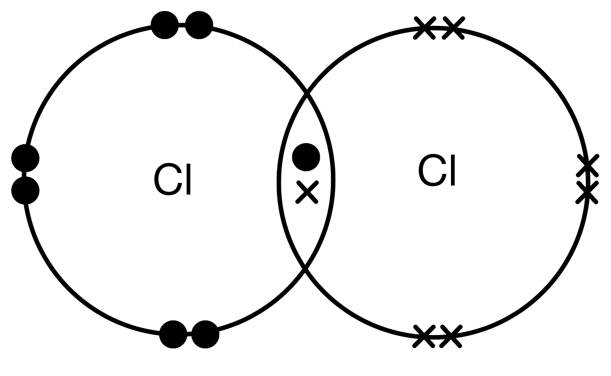
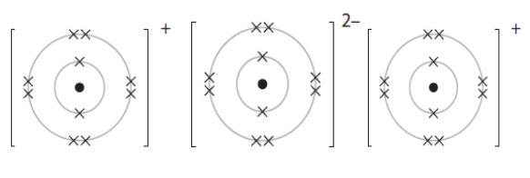
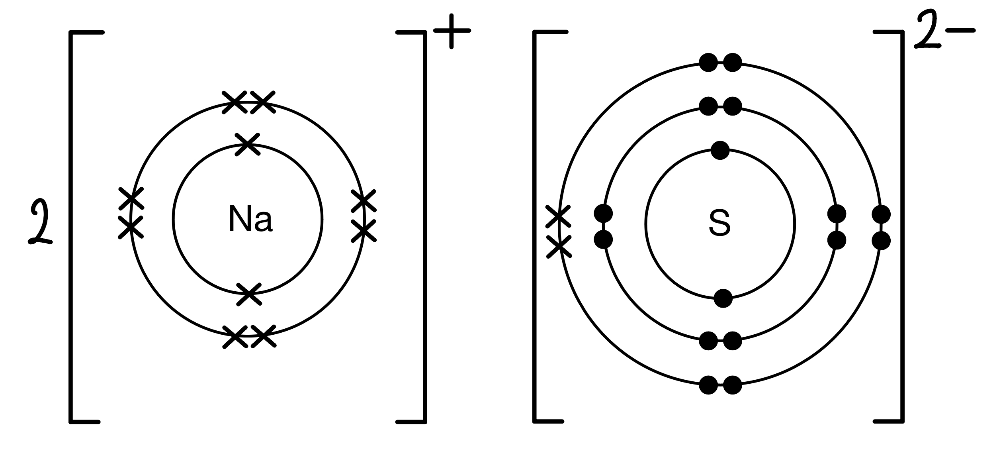
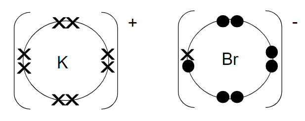

# Mark Schemes — Ionic Bonding
**1. Principles of Chemistry** · Edexcel IGCSE Chemistry 4CH1

## Q1 — hard — 3 marks

### 2 — 3 marks
> **[mark-scheme]**
> Magnesium oxide is suitable for refractory bricks because:
> 
> - Magnesium oxide has a (very) high melting point** [1 mark]**
> - It has a giant / lattice structure **[1 mark]**
> - With (very) <u>strong</u> <u>ionic bonds</u> **[1 mark]**

> **[exam-tip]**
> When a question asks you to explain a physical property (like melting point) by referring to structure and bonding, you must make a clear link between all three things.
> 
> A complete explanation follows this logical sequence:
> 
> 1. **Structure:** State that it is a "giant ionic lattice"
> 2. **Bonding:** Describe the "strong electrostatic forces" between ions
> 3. **Energy:** State that a "large amount of energy" is needed to overcome these forces
> 4. **Property:** Conclude that this results in a "high melting point"
> 
> Examiner reports show that students often miss marks by just stating one or two of these points. Make sure your explanation connects them all.

## Q2 — hard — 10 marks

### 3 — 3 marks
> **[mark-scheme]**
> When magnesium and chlorine atoms combine to form magnesium chloride:
> 
> - The magnesium (atom) loses electron(s) **[1 mark]**
> - The chlorine (atom) gains electron(s) **[1 mark]**
> - Magnesium loses 2 electrons **AND** chlorine gains 1 electron **OR** Magnesium becomes 2.8 **AND** chlorine becomes 2.8.8** [1 mark]**

> **[exam-tip]**
> For questions about forming ionic bonds from atoms, examiner reports show that precision is key. For full marks, you need to state:
> 
> 1. Which atom **loses** electrons and **how many** (Mg loses 2).
> 2. Which atom **gains** electrons and **how many** (Cl gains 1).

### 3 — 3 marks
i) The amount of magnesium chloride that can be produced:

- Deduce the reacting ratio from the equation:

1 mol Mg + 1 mol Cl2 → 1 mol MgCl2

- Deduce which reactant will run out first:

0.20 mol Cl2 < 0.60 mol Mg

Cl2 will run out first

Therefore, moles of MgCl2 = **0.20 mol**** [1 mark]**

ii) To find the mass of magnesium chloride that would be formed:

- Calculate the *M**r* of MgCl2:

relative formula mass of MgCl2 = 24 + (2 x 35.5) = 95 **[1 mark]**

- Convert the moles into mass:

mass = moles x *M**r* 

mass of MgCl2 formed = 0.2 x 95

mass of MgCl2 formed = **19 g** **[1 mark]**

> **[exam-tip]**
> Examiner reports show that a common mistake is to guess which mole value (0.60 or 0.20) to use in the final calculation.
> 
> You **must** use the balanced equation to determine which reactant will run out first, as shown in the working above.
> 
> The steps for a limiting reactant calculation are:
> 
> 1. Check the mole ratio
> 2. Find the limiting reactant
> 3. Calculate the product

### 3 — 2 marks
> **[mark-scheme]**
> The structure and bonding in magnesium chloride:
> 
> - Giant (lattice) structure** [1 mark]**
> - Ionic bonding/strong electrostatic forces of attraction between oppositely charged ions / between Mg2+ and Cl- ions** [1 mark]**

> **[exam-tip]**
> The general rules for bonding type are:
> 
> - metal and non-metal = ionic
> - non-metal and non-metal = covalent
> - metal(s) only = metallic
> 
> All ionic compounds have giant structures.
> 
> Since magnesium chloride is ionic, it must be a giant structure.

### 3 — 2 marks
> **[mark-scheme]**
> To test for chloride ions:
> 
> - Add silver nitrate solution **[1 mark]**
> - A white precipitate is formed** [1 mark]**

## Q3 — medium — 6 marks

### 4 — 4 marks
The completed table is:

| Substance | Melting point | Conducts electricity as a solid | Conducts electricity when molten | Type of bonding | Type of structure |
|---|---|---|---|---|---|
| P | high | yes | yes | **Final answer:** **metallic**  **[1]** | **Final answer:** **giant (lattice)**  **[1]** |
| Q | high | no | yes | **Final answer:** **ionic**  **[1]** | **Final answer:** **giant (lattice) **  **[1]** |
| R | low | no | no | covalent | simple molecular |

> **[exam-tip]**
> This question tests your ability to link a substance's physical properties to its bonding and structure. You can work out the answers by looking for key clues in the table:
> 
> - **Substance P**
> 
>   - The key property is **conducting electricity as a solid**.
>   - This is characteristic of metals, which have **metallic** bonding and a **giant** structure.
> - **Substance Q**
> 
>   - The key properties are a **high melting point** AND **conducting electricity only when molten**.
>   - This combination is the classic test for a substance with **ionic** bonding and a **giant ionic** lattice.
> - **Substance R**
> 
>   - The key property is a **low melting point**.
>   - This indicates weak forces need to be overcome, which is characteristic of a **simple molecular** structure.

### 4 — 2 marks
> **[mark-scheme]**
> Substance Q conducts electricity when molten, but not when solid because:
> 
> - Substance Q is made from ions / is ionic **[1 mark]**
> - The ions are freely moving when molten and carry the current **OR** The ions cannot move in the solid** [1 mark]**

> **[exam-tip]**
> This is a key concept that is frequently tested, and can sometimes be worth 3 marks. A complete answer would:
> 
> 1. Identify the charge carriers (**ions**).
> 2. Explain the situation in the solid state (**ions are fixed**).
> 3. Explain the situation in the liquid/molten state (**ions are free to move**).
> 
> Remember, it is the **ions** that move, not the electrons, in a molten ionic compound. Mentioning electrons will lose you marks.

## Q4 — medium — 1 marks

### 5 — 1 marks
**Correct answer: A** — 

**Final answer:** **The correct answer is A.**

- The correct arrangement of electrons in lithium sulfide is A
- Lithium is a Group 1 metal so has one electron in its outer shell

  - It will lose one outer electron to another atom to gain a full outer shell of electrons
  - A positive lithium ion with the charge 1+ is formed
  - It now has 2 electrons in its outer shell which is complete as the shell closest to the nucleus can hold a maximum of 2 electrons
- Sulfur is a Group 6 non-metal so will need to gain two electrons to have a full outer shell of electrons

  - One electron will be transferred from the outer shell of a lithium atom to the outer shell of the sulfur atom
  - A second electron will be transferred from the outer shell of another lithium atom to the outer shell of the sulfur atom
  - A sulfur atom will gain two electrons to form a negatively charged sulfide ion with a charge of 2-

## Q5 — easy — 1 marks

### 6 — 1 marks
**Correct answer: B** — substance **X**

**Final answer:** **The correct answer is B.**

- The ionic compound is Substance X
- Ionic substances have high melting and boiling points due to the presence of strong electrostatic forces acting between the oppositely charged ions
- These forces act in all directions and a lot of energy is required to overcome them
- Ionic compounds can conduct electricity in the molten state as they have ions that can move and carry charge
- They cannot conduct electricity in the solid state as the ions are in fixed positions within the lattice and are unable to move

## Q6 — hard — 14 marks

### 8(a) — 3 marks
What happens when calcium reacts with chlorine to form the ionic compound calcium chloride, CaCl2 in terms of electrons is:

- Calcium loses electrons; **[1 mark]**
- Chlorine gains electrons; **[1 mark]**
- Two atoms of chlorine each gain one electron 
**OR** 
Calcium loses 2 electrons and chlorine gains 1 electron; **[1 mark]**

*If 'chlorine molecules' are gaining electrons do not award M3*

*Allow 1 mark from M1 and M2 for 'electron transfer from chlorine to calcium' without specifying the number of electrons*

*Any reference to sharing electrons or covalent or metallic bonding scores 0*

**[Total: 3 marks]**

- *There are three marks here, so you need to make sure you are referring to what happens to each of the atoms and do so with the numbers of electrons moving rather than general statements*

### 8(b) — 4 marks
The test for Ca2+ ions is:

Any **one **of the following pairs:

Pair 1:

- Flame test (allow description of a flame test); **[1 mark]**
- Orange-red flame colour / brick red flame; **[1 mark]**

Pair 2:

- Add sodium hydroxide; **[1 mark]**
- (Slight) white precipitate; **[1 mark]**

The test for Cl- ions is:

- Add silver nitrate;** [1 mark]**
- White precipitate; **[1 mark]**

*Marks for colour depend on the correct test*

*Do not allow a mention of any acid other than nitric acid*

**[Total: 4 marks]**

- *The flame test is easier to recall but both tests are equally valid*
- *The tests for halide ions are also standard ones you need to recall; the precipitate colour changes for different halides*

### 8(c) — 5 marks
i) The graph should be:

- All points correct ± half a square;** [2 marks]**
- 2 straight lines of best fit ignoring the anomalous point;** [1 mark] **
*One plotting error only scores*** [1 mark]**

ii) The trend shown on the graph for the first six spatulas of calcium chloride added is:

- The conductivity is (directly) proportional (to the number of spatulas of calcium chloride added) 
**OR** 
The conductivity increases (as the number of spatulas of calcium chloride increases); **[1 mark]**

iii) Any **one** from:

- The student took the reading before adding the calcium chloride;** [1 mark]**
- The student forgot to stir the mixture / did not stir the mixture properly; **[1 mark]**

*Ignore any references to human error*

**[Total: 5 marks]**

- *Make sure you plot points using crosses rather than dots, which can get lost under a best fit line*
- *Refer to the terms on the axis when describing a graph's shape; you can use 'er' 'er' statements, so the great**er** value of x means a great**er** or less**er** value of y...*
- *When looking at types of error make sure you focus on the method given and see if there are any steps where errors could easily be made*

### 8(d) — 2 marks
Another way to make calcium chloride conduct electricity is:

- Heat (the calcium chloride);** [1 mark]**
- Until molten / melts; **[1 mark]**

**[Total: 2 marks]**

- *You need to know that ionic compounds conduct when dissolved (as in part (c)) or molten (melted), but not when solid*

## Q7 — medium — 8 marks

### 8 — 3 marks
The different roles of electrons in the formation of lithium chloride and hydrogen chloride

*Lithium chloride:*

- The lithium (atom) loses electron;** [1 mark]**
- The chlorine (atom) gaining an electron; **[1 mark]**

*Hydrogen chloride:*

- Involves sharing a pair of electrons (one electron from each atom);** [1 mark]**

**[Total: 3 marks]**

- *The command word here is describe, but you can support your answer with dot and cross diagrams *
- *However, they must be correct and not contradict your descriptions*

### 7(b) — 5 marks
Why lithium chloride has a higher melting point than hydrogen chloride:

*Any ****five**** of the following:*

*Lithium chloride:*

- Lithium chloride has a giant (ionic) structure; **[1 mark]**
- There are strong (electrostatic) forces of attraction; **[1 mark]**
*allow strong bonds*
- That occur between oppositely charged ions; **[1 mark]**

*Hydrogen chloride:*

- Has a simple molecular structure; **[1 mark]**
*Mentioning "molecules" or "intermolecular forces" does NOT gain this mark*
- There are weak intermolecular forces of attraction; **[1 mark]**
*allow weak forces between the molecules*
- Therefore more (heat/thermal) energy is needed to overcome forces/break bonds in lithium chloride (than the  intermolecular forces in hydrogen chloride); **[1 mark]**

**[Total: 5 marks]**

- *Good words to use here would be to talk about lattices and strong bonds between positive and negative ions in lithium chloride*
- *You can get credit for referring to weak bonds between the molecules in hydrogen chloride, but chemists normally call them intermolecular forces as they are considerably weaker than covalent bonds*
- *You will lose credit if you refer to molecules or atoms in lithium chloride or mention covalent bonds or intermolecular forces*
- *If it is not clear what bonds you are talking about in hydrogen chloride and imply covalent bonds are broken you will lose the mark*
- *Make sure you use comparative  language e.g. 'more energy' rather than 'alot of energy' for the final marking point*

## Q8 — medium — 1 marks

### 9 — 1 marks
**Correct answer: C** — K2SO4

**Final answer:** **The correct answer is C.**

- The formula of potassium sulfate is  K2SO4
- Potassium is in Group 1 so will lose one electron to become a 1+ ion
- A sulfate ion has a 2- charge
- In order to produce a neutral compound, two potassium ions are needed for every one sulfate ion
- K2SO4 is the formula for potassium sulfate

## Q9 — hard — 13 marks

### 10 — 3 marks
The balanced symbol equation is:

2Al (s) + 3Cl2 (g)  →   2AlCl3 (s)

- Correct formulae for all reactants and products;** [1 mark]**
- Correctly balanced; **[1 mark]**
- Correct state symbols; **[1 mark]**

**[Total: 3 marks]**

- *You know all reactants and products from the question information *
- *Chlorine is a group 7 element and therefore diatomic so should be represented as Cl**2*
- *To deduce the formula of aluminium chloride, you need to know the charge of the ions *

  - *Aluminium is a metal in group 3 so forms ions with a 3+ charge*
  - *Chlorine forms ions with a 1- charge *
  - *The compound should have no charge overall*
  - *Therefore, three chlorine atoms are needed to equal the charge of the aluminium ion *

### 10 — 3 marks
A molecule of chlorine:

- Electronic configuration of 2,8,7; **[1 mark]**
- It shares a <u>pair</u> of electrons; 
**OR** 
Dot cross diagram  ; **[1 mark] **
- (And forms a) Covalent bond; **[1 mark]**

**[Total: 3 marks]**

- *The question asks you to describe the bonding in terms of electron arrangement*
- *The first thing you need to do is check the number of electrons using the periodic table*
- *Then work out the electronic configuration*
- *Using this, you can work out how it achieves a full outer shell *
- *You would not get the final mark if you made any reference to ionic bonds*

### 10 — 5 marks
The raw materials are:

- Aluminium has the electronic configuration 2,8,3** **
**AND** 
Chlorine has 2,8,7 ;** [1 mark]**
- Aluminium loses three electrons; **[1 mark] **
- Each chlorine atom gains one electron;** [1 mark]**
- Al3+ and Cl- form;** [1 mark] **
- There is an electrostatic attraction between the ions / ionic bond forms;** [1 mark] **

**[Total: 5 marks]**

- *For hard questions you can expect to be given examples where the number of electrons being lost from one atom does not match the number required by another (like sodium chloride for example)*
- *If the question doesn't tell you, look at the group number on the periodic table to determine the number of electrons in the outer shell of the atoms involved *

### 10 — 2 marks
Molten aluminium chloride can conduct electricity because:

- Ions are free; **[1 mark] **
- Able to move and carry a charge; **[1 mark] **

**[Total: 2 marks] **

- *This is commonly answered poorly by students as electrons are mistaken for ions in this case*
- *When molten, the aluminium chloride lattice is broken up and therefore ions are free, not electrons*
- *Ions can transfer or carry a charge if an electrical current is passed through*

## Q10 — medium — 9 marks

### 6(a) — 3 marks
The changes in the electronic configuration of the atoms of sodium and oxygen to form the ions in sodium oxide are:

Any **three** from (1 mark per point):

- Sodium / sodium atom loses electrons;** [1 mark]**
- Oxygen / oxygen atom gains electrons; **[1 mark]**
- Sodium loses 1 / an electron
**AND**
Oxygen gains 2 electrons; **[1 mark]**
- Both atoms become ions with the configuration of 2.8; **[1 mark]**

**[Total: 3 marks]**

> **[exam-tip]**
> Be specific when describing ionic bonding. State what happens to each atom individually:
> 
> - Each sodium atom loses one electron to become a 1+ ion with the electronic configuration of 2,8
> - Each oxygen atom gains two electrons to become a 2- ion with the electronic configuration of 2,8
> 
> "Changes in electronic configuration" means electron loss/gain and final shell structure, not the formula or charges of the compound.
> 
> Do not mention sharing of electrons. Sodium oxide is ionic, not covalent. Any reference to sharing will score 0 for the entire question.
> 
> Name the atom each time (sodium loses, oxygen gains). Using "it" or "they" without making clear which atom you mean risks losing marks.

### 6(b) — 1 marks
The relative formula mass (*M*r) of sodium oxide, Na2O, is:

- 62; **[1 mark]**

**[Total: 1 mark]**

- *To calculate the relative formula mass of sodium oxide, you add up the atomic masses of all the component atoms*

  - *23 + 23 +16 = 62*

### 6(c) — 2 marks
Solid sodium oxide does not conduct electricity because:

Any **two** from:

- (Sodium oxide has) ions / (giant) ionic structure; **[1 mark]**
- Ions / electrons cannot flow / move;** [1 mark]**
- No delocalised electrons; **[1 mark]**

**[Total: 2 marks]**

- *It is a more commonly asked question as to which states conduct electricity for differently bonded substances, but this question is asking for why, and in detail, so make sure that multiple distinct points are made*
- *Whether a substance conducts electricity comes down to if charged particles can move through the structure:*

  - *For ionic substances, this is ions *
  - *For metals and some giant covalent structures such as graphite, this is electrons*
  - *Do not mix these examples up!*

### 6(c) — 2 marks
A test to show that sodium oxide contains sodium ions is:

- Flame test;** [1 mark]** 
*A description of performing a flame test is accepted*
- Yellow / orange / yellow-orange colour flame (is seen with sodium ions); **[1 mark]**

**[Total: 2 marks]**

- *One test for metal ions is the flame test*
- *You need to know the colours of the common metals for flame tests:*

  - *Lithium ion = red*
  - *Sodium ion = yellow*
  - *Potassium ion = lilac*
  - *Calcium ion = orange / red*
  - *Copper ion = green*

### 6(e) — 1 marks
The completed equation for the reaction of sodium oxide to form sodium metal and sodium peroxide, Na2O2 is:

- 2Na2O → 2Na + Na2O2; **[1 mark]**

**[Total: 1 mark]**

- *Starting from the sodium oxide reactant Na**2**O →*
- *You are told that the products are sodium metal and sodium peroxide Na**2**O → **Na + Na**2**O**2*** **
- *There is one reactant oxygen and two product oxygens, so double the sodium oxide reactant to balance the oxygen atoms **2**Na**2**O → Na + Na**2**O**2*
- *This gives you 4 reactant sodiums and three product sodium, doubling the sodium metal resolves this imbalance  2Na**2**O → **2**Na + Na**2**O**2*

## Q11 — easy — 4 marks

### 1(a) — 1 marks
**Correct answer: A** — substance **P**

**Final answer:** **The correct answer is A.**

- The substance that is a solid at 3000 °C is substance **P**
- The melting point of substance A is above 3000 °C (3410 °C), therefore substance **P** will still be solid at this temperature

### 1(b) — 1 marks
**Correct answer: C** — substance **R**

**Final answer:** **The correct answer is C.**

- The substance that is a liquid at 25 °C is substance R
- All the other substances have a melting point that is above 25 °C, so substance C will be the only liquid at this temperature, the other substances will remain solids

### 1(c) — 1 marks
**Correct answer: B** — substance **Q**

**Final answer:** **The correct answer is B.**

- The ionic compound is substance Q
- The tell tale sign that a substance is ionic, is that it will only conduct electricity when molten or in solution
- They also have a high melting point as well

### 1(d) — 1 marks
**Correct answer: A** — substance **P**

**Final answer:** **The correct answer is A.**

- The substance that is a metal is substance P
- Metals will conduct electricity in both a solid and liquid state

## Q12 — easy — 8 marks

### 13 — 1 marks
Chlorine is in the group:

- 7 / 17; **[1 mark]**

**[Total: 1 mark]**

- *This information can be obtained by using the Periodic Table *
- *Group 7 is known as the halogens *
- *It is also known as Group 17*

### 13 — 4 marks
The completed sentences are:

A lithium atom becomes an ion by **losing** one electron.

A lithium ion has a **positive** charge.

The lithium ion now has the electronic structure of a **group 0 **element.

The ions in lithium chloride are held together by strong **electrostatic** forces.

- Losing; **[1 mark]**
- Positive; **[1 mark]**
- Group 0; **[1 mark]**
- Electrostatic; **[1 mark]**

**[Total: 4 marks]**

- *When a metal and non-metal react, an ionic compound is formed*
- *The metal atom will lose electrons to form a positive ion*
- *The non-metal atom will gain electrons to form negative ions*
- *The electrostatic force of attraction between the oppositely charged ions holds the ions in place, these forces of attraction are known as ionic bonds*

### 13 — 2 marks
They react in this way:

- To achieve a full outer shell;** [1 mark]**
- Of electrons;** [1 mark]**

**[Total: 2 marks]**

- *Atoms react to achieve a full outer shell and become stable*** **
- *Noble gases are unreactive due to already having a full outer shell of electrons*

### 13 — 1 marks
The formula of the ionic compound formed from magnesium and bromine is:

- MgBr2;** [1 mark]**

**[Total: 1 mark]**

- *Magnesium is in Group 2 so will lose 2 electrons to form a 2+ ion*
- *Bromine is in Group 7 so will gain one electron to form a 1- ion*
- *There is no overall charge on the compound so the positive and negative charges must cancel out*
- *There must be two bromide ions for every one magnesium ion*
- *The formula is therefore MgBr**2*

## Q13 — hard — 9 marks

### 4(a) — 4 marks
i) The missing formulae are:

|   | **Mg****2+** | **Al****3+** | **NH****4****+** |
|---|---|---|---|
| **S****2-** | MgS | Al2S3 | **(NH****4****)****2****S**; **[1 mark]** |
| **NO****3****-** | **Mg(NO****3****)****2**; **[1 mark]** | Al(NO3)3 | NH4NO3 |
| **CO****3****2-** | MgCO3 | **Al****2****(CO****3****)****3**; **[1 mark]** | (NH4)2CO3 |

ii) The name of the compound with the formula NH4NO3 is:

- Ammonium nitrate;** [1 mark]**

**[Total: 4 marks]**

- *Make sure the total positive and negative charges cancel each other out so that the compound is neutral overall*

  - *Example:** Mg**2+** x **1** = 2+ and NO**3**-** x **2** = 2-, so the formula is **Mg(NO**3**)**2*
- *NH**4**+ **is an ammonium ion; NO**3**-*** ***is a nitrate ion, therefore the resulting compound is ammonium nitrate*

### 4(b) — 5 marks
i) The meaning of the term **ionic bond** is:

- Electrostatic (force of) attraction / electrostatic force; **[1 mark]**
- Between oppositely charged ions / positive and negative ions / cations and anions; **[1 mark]**

ii) The arrangement of the electrons in the ions of sodium oxide:

- Correct electron arrangement of both sodium ions; **[1 mark]**
- Correct electron arrangement of the oxide ion;** [1 mark] **
*If only outer shells shown correctly scores 1 mark* 
*Accept dots in place of crosses or any combination of dots and crosses*
- Correct charges on all ions (with or without brackets);** [1 mark]**

**[Total: 5 marks]**

- *Sometimes only the outer electrons are required, however, in this case, **ALL **of the electrons need to be drawn - read the question carefully - unless it specifically states to draw the outer electrons only, it is best to show all the electrons*
- *Sodium is in Group 1 so will lose its outer electron to form a 1+ ion*
- *Oxygen is in Group 6 so will gain 2 electrons (one electron from 2 different sodium atoms) to form a 2- ion*

## Q14 — hard — 12 marks

### 15 — 3 marks
When sodium sulfide is formed in this reaction:

- Sodium (atoms) **lose** electrons; **[1 mark] **
*Allow sodium donates / gives away*
*Reject "sodium ions lose..." *
*Incorrect starting particle*
- Sulfur (atoms) **gain** electrons;** [1 mark] **
*Allow* sulfur accepts / takes
*Allow* 1 mark for "Electron transfer from sodium to sulfur" if M1/M2 not scored separately
- Two sodium atoms each lose one electron (to the sulfur atom); **[1 mark]**
*Allow* sulfur gains 2 electrons
*Allow* Reference to formation of *Na*+ and *S*2−
Reject M3 if the product is described as an atom or molecule (e.g., "making them sodium atoms")
Score 0 for the whole question if sharing / covalent bonding is mentioned

**[Total: 3 marks] **

- *The metal atom, in this case sodium, will lose electrons to achieve a full outer shell*
- *Sodium atoms need to lose 1 electron*
- *The non-metal atom, in this case sulfur, will gain electrons to achieve a full outer shell*
- *Sulfur atoms need to gain 2 electrons *
- *You need to specify the number of electrons transferred in order to gain all the marks*

### 15 — 4 marks
A dot-and-cross diagram for sodium sulfide is:

- 2 sodium ions indicated / drawn;** [1 mark] **
- Both ions with correct electronic configuration (Na [2.8]+ and S [2.8.8]2-);** [1 mark] **
- Correct charges; **[1 mark] **
- (Square) brackets drawn around each ion; **[1 mark] **

**[Total: 4 marks] **

- *The formula for sodium sulfide is Na**2**S, therefore two sodium ions are required for every sulfide ion*
- *You need to make sure that the charges are correct in your dot-and-cross diagram*

  - *As sodium has lost 1 electron, it now has a 1+ charge*
  - *As sulfur has gained 2 electrons, it now has a 2- charge*
- *You need to include brackets to indicate that you have drawn an ion, otherwise it will appear like a Group 0 atom*

### 15 — 2 marks
The melting point of hydrogen sulfide is lower than sodium sulfide because:

- Attractions between H2S molecules are weak(er) / easily overcome / need little energy to break;** [1 mark]**
- Attractions between (sodium and sulfide) ions are strong(er) / ionic bonds are strong / need a lot of energy to break; **[1 mark]**

**[Total: 2 marks] **

- *Hydrogen sulfide, H**2**S is a simple molecule and has covalent bonds between the atoms and weak intermolecular forces between the molecules*

  - *These weak intermolecular forces are easily overcome*
- *Sodium sulfide has strong electrostatic attractions between positively and negatively charged ions*

  - *These require a lot of energy to overcome*

### 15 — 3 marks
The balanced symbol equation is:

H2S (g) + 2NaOH (aq) → Na2S (aq) + 2H2O (l)

- Correct formulae for reactants and products; **[1 mark] **
- Correct state symbols; **[1 mark]**
- Correctly balanced; **[1 mark] **

**[Total: 3 marks] **

- *All the information you require to answer part (c) is given throughout the question*
- *Make sure you look for clues about the states of each of the reactants and products*

  - *You are told sodium sulfide is soluble, so the state symbol must be (aq)*
- *You should know the formula for sodium hydroxide*

  - *If you don’t you can work it out by using the charges of the ions *
  - *Na has a 1+ charge and the hydroxide ion has a 1- charge, therefore the formula is NaOH*
- *To balance the equation:*

  - *H**2**S (g) + NaOH (aq) → Na**2**S (aq) + H**2**O (l) - There are 3 H atoms on the left, but 2 on the right-hand side*
  - *H**2**S (g) + NaOH (aq) → Na**2**S (aq) + 2H**2**O (l) - There is 1 Na atom on the left and 2 on the right-hand side*
  - *H**2**S (g) + 2NaOH (aq) → Na**2**S (aq) + 2H**2**O (l)*
  - *All the atoms are now balanced*

## Q15 — hard — 15 marks

### 4(a) — 2 marks
The colour of astatine and the physical state of fluorine at room temperature are:

- Physical state of fluorine: gas; **[1 mark]**
- Colour of astatine: black; **[1 mark]** 
*Accept very gark grey*

**[Total: 2 marks]**

- *You need to know the colours, physical state at room temperature and trends in the physical properties of Group 7 elements*
- *The melting point and boiling point of the Group 7 elements increases as you go down the group, which is why the physical state at room temperature changes from gas to liquid to solid down the group*
- *The colour gets darker as you go down the group*

### 4(b) — 2 marks
The solution turns orange when chlorine gas is bubbled into a colourless solution of potassium bromide because:

- Bromine / Br2 is formed / displaced / produced; **[1 mark]** 
*Do not allow bromide* 
*Accept bromine / Br**2** shown as the product in an equation*
- As chlorine is more reactive (than bromine);** [1 mark]** 
*Do not allow chloride / bromide*

**[Total: 2 marks]**

- *A more reactive group 7 element will displace a less reactive group 7 element from an aqueous solution of its halide*
- *In this case, chlorine displaces bromine from aqueous potassium halide:*

  - *2KBr + Cl**2** → 2KCl + Br**2*

### 4(c) — 3 marks
Diagrams to show the outer electrons in a potassium ion and in a bromide ion:

- Correct structure of potassium ion; **[1 mark]**
- Correct structure of bromide ion; **[1 mark]**
- Charges on both ions correct (with or without square brackets); **[1 mark] ** *Accept any combination of dots and crosses* *Ignore inner shells even if incorrect*

**[Total: 3 marks]**

- *Potassium is in Group 1, so will have 1 outer electron which it loses forming an ion with a 1+ charge*
- *Bromine is in Group 7, so has 7 electrons in its outer shell and will gain 1 electron to form a 1- ion*

### 4(d) — 5 marks
The electrical conductivity of the various substances can be explained by:

- Water is covalently bonded / has a simple molecular structure / has a covalent compound; **[1 mark]**
- Water does not contain any free (moving) charged particles / ions / (delocalised) electrons (so does not conduct electricity); **[1 mark]**
- Sodium chloride has a giant ionic structure / has an ionic lattice structure / is ionically bonded / contains ions / is an ionic compound; **[1 mark]** *Do not allow mention of atoms / molecules / intermolecular forces in sodium*
- The ions are in fixed positions / cannot move (so does not conduct electricity); **[1 mark]**
- In solution/ aqueous sodium chloride the ions are free to flow / move (so the solution does conduct electricity); **[1 mark]** *Do not allow reference to electrons conducting electricity in aqueous sodium chloride* *Ignore reference to ions carrying charge / current*

**[Total: 5 marks]**

- *When explaining conductivity, state the type of structure and whether it contains any charged particles that are free to move*
- *Carefu**l: Use the correct terminology:*

  - *Covalently bonded substances do not conduct as they have no free charged particles (either ions or delocalised electrons*
  - *Ionically bonded substances conduct when their **ions **are free to move (i.e. when molten or in aqueous solution)*
  - *Metallically bonded substance conduct as they have **delocalised electrons** that are free to move*

### 4(e) — 3 marks
i) The ionic half-equation for the formation of chlorine at the positive electrode is:

- 2Cl- → Cl2 + 2e- 
**OR** 
2Cl- - 2e- → Cl2;** [1 mark]**

ii) This represents an oxidation reaction because:

- Electrons are lost (by chloride ions / Cl- ); **[1 mark]** 
*Accept oxidation number of chlorine increases (by 1) / changes from -1 to 0* 
*Reject chlorine loses electrons* 
*Ignore references to gain of oxygen*

iii) The substance that is formed at the negative electrode (cathode) is:

- A / hydrogen;** [1 mark]**

**[Total: 3 marks]**

- *Chloride ions are attracted to the positive electrode as opposites attract*
- *Here, it loses its outer electron which is oxidation*
- *Remember**: **OIL RIG** - **O**xidation **I**s **L**oss, **R**eduction **I**s **G**ain of electrons*
- *For concentrated aqueous sodium chloride:*

  - *The ions present are: Na**+**, H**+**, Cl**-**, and OH**–*
  - *Hydrogen is less reactive than sodium so hydrogen ions are discharged at the cathode where they are reduced to hydrogen gas :*
  
    - *2H**+** + 2e**-** → H**2*
  - *The chlorine has been discharged at the anode*
  - *The Na**+** and OH**–** have remained in solution to form sodium hydroxide, NaOH*

## Q16 — easy — 1 marks

### 17 — 1 marks
**Correct answer: C** — Electrostatic attraction between oppositely charged ions

**Final answer:** **The correct answer is C.**

- The statement which describes ionic bonding is (C) Electrostatic attraction between oppositely charged ions
- The positive and negatively charged ions are held together by the strong electrostatic forces of attraction
- This is what holds ionic compounds together

## Q17 — easy — 7 marks

### 18 — 4 marks
i) A sodium atom becomes a sodium ion by:

- Loses / losing;** [1 mark] **
- 1 / one / an electron; **[1 atom] ** *Only these points are required for the mark and ignore reference to charges of the ions and subsequent bonding*

ii) A chlorine atom becomes a chloride ion by:

- Gains / Gaining; **[1 mark] **
- 1 / one / an electron; **[1 mark] ** *Only these points are required for the mark and ignore reference to charges of the ions and subsequent bonding*

**[Total: 4 marks] **

- *Sodium is in Group 1 so has 1 electron in its outermost shell*

  - *In order to have a full outer shell, it will lose one electron*
- *Chlorine is in Group 7 so has 7 electrons in its outermost shell*

  - *In order to have a full outer shell, it will gain one electron*

### 18 — 1 marks
Sodium fluoride is soluble in water because:

| Both ionic compounds and water are polar substances | **✓;** **[1 mark] ** |
|---|---|
| Ionic compounds have weak bonds |   |
| Water has weak bonds |   |

**[Total: 1 mark] **

- *Water is polar which means that one side of the molecule has a slightly positive charge and the other side has a slightly negative charge*
- *The water molecules can then interact with the positive and negative charges of the ions in the ionic lattice*
- *This splits up the lattice and the ionic compound dissolves*

### 18 — 1 marks
The melting point of sodium fluoride is high because:

| The electrons and positive ions attract strongly |   |
|---|---|
| The covalent bonds between the ions are strong |   |
| There are strong bonds between the positively and negatively charged ions | **✓;**** ****[1 mark]** |

**[Total: 1 mark] **

- *Ionic lattices have a high melting point due to the strong attraction between the positively and negatively charged ions *

  - *This is also called electrostatic attraction*
- *Electrons and positive ions attract in metallic lattices*
- *Covalent bonds occur in simple and giant structures*

### 18 — 1 marks
Sodium fluoride can only conduct electricity when molten or in solution because:

| Electrons can move and carry a charge |   |
|---|---|
| Ions can move and carry a charge | **✓;**** ****[1 mark]** |
| Electrons can flow throughout the ionic lattice |   |

**[Total: 1 mark] **

- *When ionic compounds are in solution or molten the ions become free and able to move*
- *In the solid state, the ions are fixed in position so can not move or carry a charge*
- *Many students make the error of stating electrons can move and carry a charge, this occurs in metallic lattices, not molten or aqueous ionic compounds*

## Q18 — medium — 1 marks

### 19 — 1 marks
**Correct answer: D** — An oxide ion has an electronic configuration of 2.6

**Final answer:** **The correct answer is D.**

- The statement **not** correct about the changes in electronic configuration that occur when lithium and oxygen react to form lithium oxide, Li2O is D
- An oxygen atom has the electronic configuration of 2.6
- Oxygen gains two electrons to form the oxide ion
- An oxide ion will have the electronic configuration 2.8

## Q19 — medium — 14 marks

### 5(a) — 1 marks
One property of metals is:

Any **one **of the following:

- Good conductors of heat; **[1 mark]**
- Good conductors of electricity;** [1 mark]**
- Malleable; **[1 mark]**
- Ductile; **[1 mark]**
- High density; **[1 mark]**
- Have basic oxides / hydroxides; **[1 mark]**
- High melting point; **[1 mark]**
- Sonorous; **[1 mark]**
- Shiny; **[1 mark]**
- Hard; **[1 mark]**
- Strong;** [1 mark]**

**[Total: 1 mark]**

- *The most common correct answer to this question is about metals being good conductors of electricity*

  - *Careful: **Good conductor on its own may not be enough to achieve the mark*

### 5(b) — 2 marks
The difference in the movement of particles in liquid mercury and in a solid metal is:

- In mercury, the particles can move / flow;** [1 mark] ***Comments about the spacing and energy of the particles are ignored*
- In solid metals, the particles do not move 
**OR **
In solid metals, the particles vibrate around / are in fixed positions; **[1 mark]**

**[Total: 2 marks]**

- *This question is not actually asking about metals*

  - *Mercury is included as an example of a liquid but the idea of different metals is a distraction from the main question*
- *It is asking you to compare the movement of particles in a liquid and a solid*

### 5(c) — 2 marks
i) One observation made during the combustion of magnesium metal is:

- (Bright) white flame / light 
**OR **
Forms a white powder / solid / ash; **[1 mark]**

ii) One chemical property of the product of combustion that can be used to classify magnesium as a metal is:

- (The product / magnesium oxide) is basic / a base 
**OR **
(The product / magnesium oxide) neutralises acids 
**OR **
(The product / magnesium oxide) reacts with / dissolves in acid 
**OR **
(The product / magnesium oxide) produces an alkali when it is added to water; **[1 mark]**

**[Total: 2 marks]**

- *The main observation for the combustion of magnesium is a memorable bright white light*
- *The product of combustion is magnesium oxide*

  - *Magnesium + oxygen → magnesium oxide*
  - *2Mg + O**2** → 2MgO*
- *Magnesium oxide is a base, which means that it will:*

  - *React with / neutralise acids*
  - *Produce an alkaline solution (of magnesium hydroxide) when added to water*

### 5(d) — 9 marks
i) One reason why the reaction needs to be done in the absence of air is:

- The magnesium / sulfur would react with oxygen 
**OR **
Magnesium oxide would form 
**OR **
Sulfur dioxide would form ; **[1 mark]**

ii) The ions in magnesium sulfide are formed by:

- Magnesium losing 2 electrons (to sulfur); **[1 mark]**
- Sulfur gaining two electrons (from magnesium); **[1 mark]** 
*Two electrons are transferred from magnesium to sulfur scores both of these marks*
- The magnesium ion is 2+ / Mg2+  
**AND** 
The sulfur / sulfide ion is 2- / S2–; **[1 mark]**

iii) Magnesium sulfide has a very high melting point because:

- There are strong (electrostatic) forces of attraction 
**OR **
There are strong ionic bonds;** [1 mark]** 
*Talking about the forces between atoms or molecules / intermolecular forces or covalent bonding means that the first two marks cannot be awarded*
- Between magnesium ions / Mg2+ and sulfide ions / S2– 
**OR **
Between oppositely charged ions 
**OR **
Between positive and negative ions;** [1 mark]**
- Large amounts of (heat / thermal) energy are required to overcome the (electrostatic) forces of attraction 
**OR **
Large amounts of (heat / thermal) energy are required to break the bonds;** [1 mark] **

iv) The chemical equation for the reaction of magnesium sulfide with hydrochloric acid to form magnesium chloride and hydrogen sulfide gas, H2S, is:

MgS + 2HCl → MgCl2 + H2S

- All chemical formulae correct; **[1 mark]**
- Correct balancing; **[1 mark]**

**[Total: 9 marks]**

- *The main focus of this question is ionic bonding*
- *To correctly answer how ions are formed and achieve all the associated marks, you should:*

  - *State how many electrons the metal loses AND the ion that it becomes*
  - *State how many electrons the nonmetal gains AND the ion that it becomes*
- *Careful: **Melting points (and boiling points) can cause confusion*

  - *They are to do with forces of attraction, NOT the bonding*
  - *In ionic compounds, melting points are about the large amounts of energy required to overcome the strong electrostatic forces of attraction between oppositely charged ions*
  
    - *These forces of attraction between oppositely charged ions are basically the ionic bonds - which is where the relatively common misconception comes from*
  - * In covalent compounds, melting points are about the intermolecular forces of attraction and the amounts of energy required to overcome them*
  
    - *There are some exceptions, such as diamond, where covalent bonds need to break*
