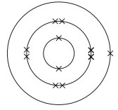
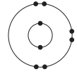
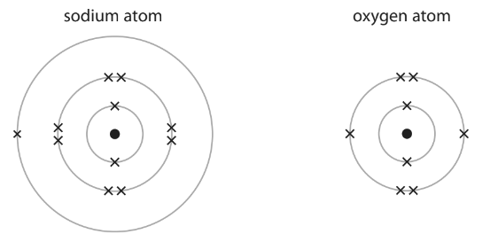
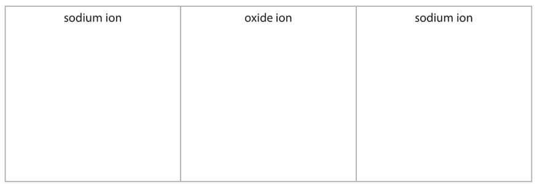

# Exam Questions — Ionic Bonding
**1. Principles of Chemistry** · Edexcel IGCSE Chemistry 4CH1
> Source: [https://www.savemyexams.com/igcse/chemistry/edexcel/19/topic-questions/1-principles-of-chemistry/1-6-ionic-bonding/exam-questions/](https://www.savemyexams.com/igcse/chemistry/edexcel/19/topic-questions/1-principles-of-chemistry/1-6-ionic-bonding/exam-questions/) · 19 questions · total 137 marks

## Q1 — hard — 3 marks

### 2 — 3 marks — command: suggest — structured
Refractory bricks are special bricks used in lining furnaces, kilns, and fireplaces.

Magnesium oxide can be used to make refractory bricks.

Suggest why magnesium oxide is suitable for refractory bricks.

Give a reason, referring to the structure and bonding.

## Q2 — hard — 10 marks

### 3 — 3 marks — command: describe — structured
This question is about magnesium chloride.

The diagram shows the electronic configuration of atoms of magnesium and chlorine.

Describe what happens to the electronic configurations of these atoms when they combine to form magnesium chloride.

### 3 — 3 marks — command: determine — structured
The equation for the reaction between magnesium and chlorine is

Mg + Cl2 → MgCl2

i) Determine the maximum amount, in moles, of magnesium chloride that can be produced from 0.60 mol of magnesium and 0.20 mol of chlorine.

[1]

ii) Determine the mass of magnesium chloride that would be formed.

[2]

### 3 — 2 marks — command: describe — structured
Describe the structure and bonding in magnesium chloride.

### 3 — 2 marks — command: give — structured
Give a test to show that magnesium chloride contains chloride ions.

## Q3 — medium — 6 marks

### 4 — 4 marks — command: complete — structured
The table gives some information about three substances, P, Q, and R.

| Substance | Melting point | Conducts electricity as a solid | Conducts electricity when molten | Type of bonding | Type of structure |
|---|---|---|---|---|---|
| P | high | yes | yes |   |   |
| Q | high | no | yes |   |   |
| R | low | no | no | covalent | simple molecular |

Complete the table by giving the missing information.

### 4 — 2 marks — command: explain — structured
Explain why substance Q conducts electricity when molten, but not when solid.

## Q4 — medium — 1 marks

### 5 — 1 mark — multiple_choice
Which of the following dot-and-cross diagrams shows the correct arrangement of electrons in lithium sulfide?
- **A.** 
- **B.** 
- **C.** 
- **D.** 

## Q5 — easy — 1 marks

### 6 — 1 mark — multiple_choice
The table below shows the properties of four substances, **W**,** X**, **Y** and **Z**.

| **Substance** | **Melting point**  **/ ****o ****C** | **Boiling point **  **/ ****o ****C** | **Conducts electricity when** |   |
|---|---|---|---|---|
| **solid ** | **liquid** |   |   |   |
| **W** | 3410 | 5930 | yes | yes |
| **X** | 801 | 1413 | no | yes |
| **Y** | 3550 | 4830 | no | no |
| **Z** | -91 | 98 | no | no |

Use the information in the table to identify the substance that is an ionic compound.
- **A.** substance **W**
- **B.** substance **X**
- **C.** substance **Y**
- **D.** substance **Z**

## Q6 — hard — 14 marks

### 8(a) — 3 marks — command: describe — structured — from paper 2020 · Ja1CR
The diagram shows the arrangement of electrons in an atom of calcium and in an atom of chlorine.

Describe, in terms of electrons, what happens when calcium reacts with chlorine to form the ionic compound calcium chloride, CaCl2

### 8(b) — 4 marks — command: describe — structured — from paper 2020 · Ja1CR
Describe tests to show that an aqueous solution of calcium chloride contains calcium ions and chloride ions.

calcium ions: ...................................................................... chloride ions:  ......................................................................

### 8(c) — 5 marks — command: multiple — structured — from paper 2020 · Ja1CR
Solid calcium chloride does not conduct electricity. Aqueous solutions of calcium chloride do conduct electricity. A student uses this method to investigate how the conductivity of a solution changes when calcium chloride is dissolved in pure water.

- Step 1 add 100 cm3 of pure water to a beaker
- Step 2 add one spatula of solid calcium chloride to the beaker
- Step 3 stir the solution
- Step 4 measure the conductivity of the solution
- Step 5 repeat until nine spatulas of solid calcium chloride have been added

The table shows the student’s results.

| **Number of spatulas of calcium chloride** | **Conductivity of solution in arbitrary units** |
|---|---|
| 0 | 0 |
| 1 | 6 |
| 2 | 12 |
| 3 | 12 |
| 4 | 24 |
| 5 | 30 |
| 6 | 36 |
| 7 | 36 |
| 8 | 36 |
| 9 | 36 |

i) Plot the results on the grid and draw two straight lines of best fit. Ignore the anomalous result.

(3)

ii) State the trend shown on the graph for the first six spatulas of calcium chloride.

(1)

iii) Suggest an error the student could have made to cause the anomalous result.

(1)

### 8(d) — 2 marks — command: describe — structured — from paper 2020 · Ja1CR
Describe another way to make solid calcium chloride conduct electricity.

## Q7 — medium — 8 marks

### 8 — 3 marks — command: describe — structured — from paper 2021 · Ja1CR
The formation of ions and covalent bonds involves electrons. The table gives the electronic configurations of atoms of hydrogen, lithium and chlorine.

| **Element ** | **Electronic configuration of atom** |
|---|---|
| hydrogen | 1 |
| lithium | 2.1 |
| chlorine | 2.8.7 |

Describe the different roles of electrons in the formation of

- ions in lithium chloride
- covalent bonds in hydrogen chloride

### 7(b) — 5 marks — command: explain — structured — from paper 2021 · Ja1CR
Explain why lithium chloride has a higher melting point than hydrogen chloride.

Refer to structure and bonding in your answer.

## Q8 — medium — 1 marks

### 9 — 1 mark — multiple_choice
What is the formula of potassium sulfate?
- **A.** K2(SO4)2
- **B.** K(SO4)2
- **C.** K2SO4
- **D.** KSO4

## Q9 — hard — 13 marks

### 10 — 3 marks — command: write — structured
This question is about chemical bonds.

Aluminium and chlorine react to form aluminium chloride.

Write the balanced symbol equation for the reaction.

Include state symbols.

### 10 — 3 marks — command: describe — structured
Describe, in terms of electron arrangement, the type of bonding in a molecule of chlorine.

### 10 — 5 marks — command: describe — structured
Describe, in terms of electron arrangement, the type of bonding in the compound aluminium chloride.

### 10 — 2 marks — command: explain — structured
Explain why molten aluminium chloride can conduct electricity.

## Q10 — medium — 9 marks

### 6(a) — 3 marks — command: describe — structured — from paper 2022 · Jan1C
This question is about sodium oxide, Na2O

The diagram shows the electronic configuration of atoms of sodium and oxygen.

|  |  |
|---|---|
| Sodium | Oxygen |

Describe the changes in the electronic configuration of the atoms of sodium and oxygen to form the ions in sodium oxide.

### 6(b) — 1 mark — command: calculate — structured — from paper 2022 · Jan1C
Calculate the relative formula mass (*M*r) of sodium oxide, Na2O, using information from the Periodic Table.

*M*r = ..............................

### 6(c) — 2 marks — command: explain — structured — from paper 2022 · Ja1C
Explain why solid sodium oxide does not conduct electricity.

### 6(c) — 2 marks — command: give — structured — from paper 2022 · Jan1C
Give a test to show that sodium oxide contains sodium ions.

### 6(e) — 1 mark — command: complete — structured — from paper 2022 · Ja42
When sodium oxide is heated it reacts to form sodium metal and sodium peroxide, Na2O2

Complete the equation for this reaction.

Na2O →

## Q11 — easy — 4 marks

### 1(a) — 1 mark — multiple_choice — from paper 2017 · Specimen2C
The table shows some properties of four substances, **P**, **Q**, **R** and **S**.

| **Substance** | **Melting Point / ****o****C** | **Boiling Point / ****o****C** | **Conducts electricity when** |   |
|---|---|---|---|---|
| **solid** | **liquid** |   |   |   |
| P | 3410 | 5930 | yes | yes |
| Q | 734 | 1435 | no | yes |
| R | -95 | 69 | no | no |
| S | 2507 | 3900 | no | no |

Use the information in the table to answer the following questions. You may use each letter once, more than once or not at all.

Choose a substance that is a solid at 3000 °C.
- **A.** substance **P**
- **B.** substance **Q**
- **C.** substance **R**
- **D.** substance **S**

### 1(b) — 1 mark — multiple_choice — from paper 2017 · Specimen2C
Choose a substance that is a liquid at 25 °C.
- **A.** substance **P**
- **B.** substance **Q**
- **C.** substance **R**
- **D.** substance **S**

### 1(c) — 1 mark — multiple_choice — from paper 2017 · Specimen2C
Choose a substance that is an ionic compound.
- **A.** substance **P**
- **B.** substance **Q**
- **C.** substance **R**
- **D.** substance **S**

### 1(d) — 1 mark — multiple_choice — from paper 2017 · Specimen2C
Choose a substance that is a metal.
- **A.** substance **P**
- **B.** substance **Q**
- **C.** substance **R**
- **D.** substance **S**

## Q12 — easy — 8 marks

### 13 — 1 mark — command: which — structured
This question is about lithium and chlorine.

Which group of the Periodic Table is chlorine in?

### 13 — 4 marks — command: complete — structured
Lithium reacts with chlorine to produce lithium chloride.

lithium      +      chlorine     $\overset{}{\rightarrow}$   lithium chloride

The diagram shows how the reaction happens.

Only the outer electrons are shown.

Use the words in the boxes to complete the sentences:

| gaining | sharing | positive | group 1 | negative |
|---|---|---|---|---|
| covalent | losing | group 0 | electrostatic | neutral |

A lithium atom becomes an ion by ...............................................  one electron.

A lithium ion has a ............................................... charge.

The lithium ion now has the electronic structure of a ............................................... element.

The ions in lithium chloride are held together by strong ............................................... forces.

### 13 — 2 marks — command: why — structured
Why do lithium and chlorine react in this way?

### 13 — 1 mark — command: what — structured
Magnesium and bromine will form an ionic compound, like lithium and chlorine.

What is the formula of the ionic compound formed from magnesium and bromine?

Tick (**✓**) **one** box.

| MgBr |   |
|---|---|
| MgBr2 |   |
| Mg2Br |   |

## Q13 — hard — 9 marks

### 4(a) — 4 marks — command: multiple — structured — from paper 2020 · Ja1C
This question is about ionic compounds.

The table shows the formulae of some positive and negative ions, and the formulae of some compounds containing these ions.

|   | **Mg****2+** | **Al****3+** | **NH****4****+** |
|---|---|---|---|
| **S****2-** | MgS | Al2S3 |   |
| **NO****3****-** |   | Al(NO3)3 | NH4NO3 |
| **CO****3****2-** | MgCO3 |   | (NH4)2CO3 |

i) Complete the table by giving the three missing formulae.

(3)

ii) Give the name of the compound with the formula NH4NO3

(1)

### 4(b) — 5 marks — command: multiple — structured — from paper 2020 · Ja1C
Sodium oxide, Na2O, is an ionic compound. The sodium and oxide ions are held together by ionic bonds.

i) State the meaning of the term **ionic bond**.

(2)

ii) The diagram shows the arrangement of the electrons in a sodium atom and in an oxygen atom.

Draw diagrams in the boxes to show the arrangement of the electrons in the ions of sodium oxide.  Include the charges on the ions.

(3)

## Q14 — hard — 12 marks

### 15 — 3 marks — command: describe — structured
The diagram shows how the electrons are arranged in an atom of sulfur. Sulfur can form both covalent and ionic compounds.

The electronic configuration of a sodium atom is 2.8.1 Sodium sulfide, Na2S, is an ionic compound formed when sodium reacts with sulfur.

Describe, in terms of electrons, what happens when sodium sulfide is formed in this reaction.

### 15 — 4 marks — command: draw — structured
Draw a dot-and-cross diagram to show the bonding in sodium sulfide.

### 15 — 2 marks — command: explain — structured
Sodium sulfide is a water-soluble compound. When hydrogen sulfide gas is bubbled through sodium hydroxide it will form sodium sulfide and water.

Explain why the melting point of hydrogen sulfide is lower than the melting point of sodium sulfide.

### 15 — 3 marks — command: write — structured
Write a balanced symbol equation including state symbols for the reaction occurring in part c).

## Q15 — hard — 15 marks

### 4(a) — 2 marks — command: predict — structured — from paper 2019 · Ju2CR
This question is about the halogens and their compounds.

The table gives the colour and physical state at room temperature of the halogens.

Complete the table by predicting the colour of astatine and the physical state of fluorine at room temperature.

| **Halogen** | **Colour** | **Physical state at room temperature** |
|---|---|---|
| fluorine | pale yellow |   |
| chlorine | pale green | gas |
| bromine | red-brown | liquid |
| iodine | dark grey | solid |
| astatine |   | solid |

### 4(b) — 2 marks — command: explain — structured — from paper 2019 · Ju2CR
Chlorine gas is bubbled into a colourless solution of potassium bromide.

Explain why the solution turns orange.

### 4(c) — 3 marks — command: draw — structured — from paper 2019 · Ju2CR
Potassium bromide is an ionic compound.

Draw diagrams to show the outer electrons in a potassium ion and in a bromide ion.

Include the charges on the ions.

### 4(d) — 5 marks — command: explain — structured — from paper 2019 · Ju2CR
A student sets up a circuit to test the electrical conductivity of water, solid sodium chloride and aqueous sodium chloride.

The table shows the student’s results.

| **Substance** | **Conducts electricity?** |
|---|---|
| water | no |
| solid sodium chloride | no |
| aqueous sodium chloride | yes |

Explain these results, with reference to the structure and bonding of the substances.

### 4(e) — 3 marks — command: multiple — structured — from paper 2019 · Ju2CR
A concentrated aqueous solution of sodium chloride is electrolysed using graphite electrodes.

Chlorine is formed at the positive electrode (anode).

i) Give an ionic half-equation for the formation of chlorine at the positive electrode.

(1)

ii) State why this ionic half-equation represents an oxidation reaction.

(1)

iii) Which substance is formed at the negative electrode (cathode)?

| ☐ | **A** | hydrogen |
|---|---|---|
| ☐ | **B** | oxygen |
| ☐ | **C** | sodium |
| ☐ | **D** | water |

(1)

## Q16 — easy — 1 marks

### 17 — 1 mark — multiple_choice
Which of the statements describes ionic bonding?
- **A.** Electrostatic attraction between atoms
- **B.** Electrostatic attraction between positively charged particles and delocalized electrons
- **C.** Electrostatic attraction between oppositely charged ions
- **D.** Electrostatic attraction between the nuclei of two atoms and a shared pair of electrons

## Q17 — easy — 7 marks

### 18 — 4 marks — command: explain — structured
Sodium chloride is an ionic compound which is soluble in water. Sodium ions and chloride ions bond together forming an ionic lattice.

i) Explain how a sodium atom becomes a sodium ion.

(2)

ii) Explain how a chlorine atom becomes a chloride ion.

(2)

### 18 — 1 mark — command: which — structured
Which of the following explains why sodium fluoride is soluble in water.

Tick (**✓**) **one** box.

| Both ionic compounds and water are polar substances |   |
|---|---|
| Ionic compounds have weak bonds |   |
| Water has weak bonds |   |

### 18 — 1 mark — command: why — structured
Sodium fluoride has a melting point 993 °C. Why does sodium fluoride have a high melting point.

Tick (**✓**) **one** box.

| The electrons and positive ions attract strongly |   |
|---|---|
| The covalent bonds between the ions are strong |   |
| There are strong bonds between the positively and negatively charged ions |   |

### 18 — 1 mark — command: why — structured
Sodium fluoride can conduct electricity when either molten or in solution. Why can sodium fluoride only conduct electricity when molten or in solution.

Tick (**✓**) **one** box.

| Electrons can move and carry a charge |   |
|---|---|
| Ions can move and carry a charge |   |
| Electrons can flow throughout the ionic lattice |   |

## Q18 — medium — 1 marks

### 19 — 1 mark — multiple_choice
The diagram shows the electronic configurations of an atom of lithium and an atom of oxygen.

Which statement is **not** correct about the changes in electronic configuration that occur when lithium and oxygen react to form lithium oxide, Li2O?
- **A.** Two lithium atoms each lose one electron
- **B.** One oxygen atom gains 2 electrons
- **C.** A lithium ion has an electronic configuration of 2
- **D.** An oxide ion has an electronic configuration of 2.6

## Q19 — medium — 14 marks

### 5(a) — 1 mark — command: state — structured — from paper 2022 · Jan1CR
This is a question about metals and their compounds.)

State one property of metals.

### 5(b) — 2 marks — command: describe — structured — from paper 2022 · Jan1CR
Mercury is the only metal that is liquid at room temperature.

Describe the difference in the movement of particles in liquid mercury and in a solid metal.

### 5(c) — 2 marks — command: state — structured — from paper 2022 · Jan1CR
Magnesium is a metal that burns in air.

i) State one observation made during the combustion of magnesium metal.

(1)

ii) State one chemical property of the product of combustion that can be used to classify magnesium as a metal.

(1)

### 5(d) — 9 marks — command: multiple — structured — from paper 2022 · Jan1CR
In the absence of air, magnesium reacts with sulfur to form the ionic compound magnesium sulfide, MgS

i) Give a reason why the reaction needs to be done in the absence of air.

(1)

ii) Describe, in terms of electrons, the formation of the ions in magnesium sulfide.

Give the charges on the ions.

(3)

iii) Explain why magnesium sulfide has a very high melting point.

(3)

iv) Magnesium sulfide reacts with hydrochloric acid to form magnesium chloride and hydrogen sulfide gas, H2S

Give the chemical equation for this reaction.

(2)
