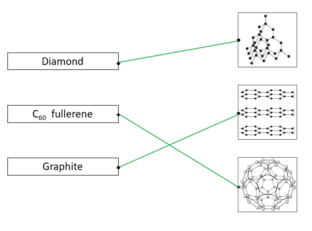
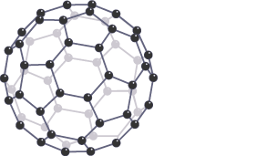
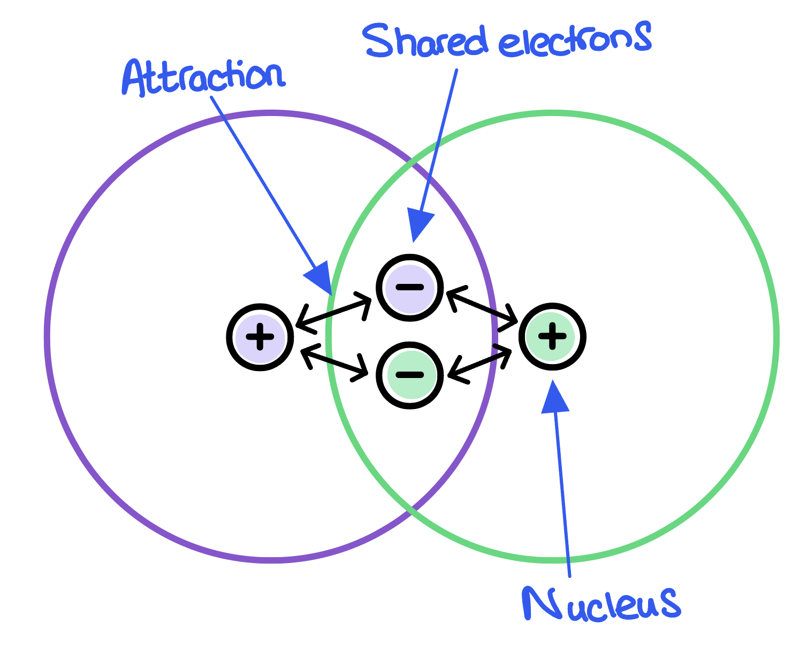
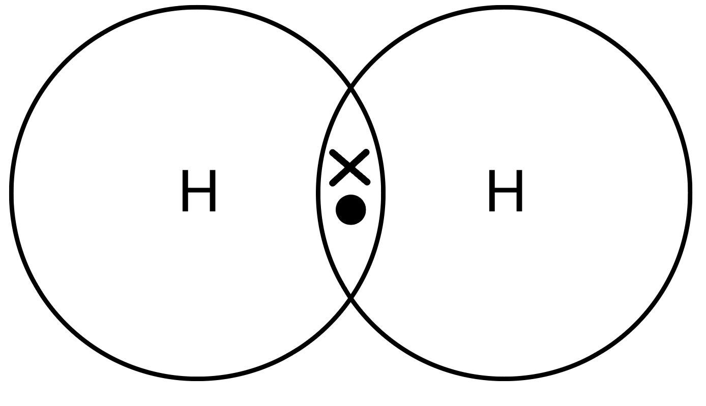
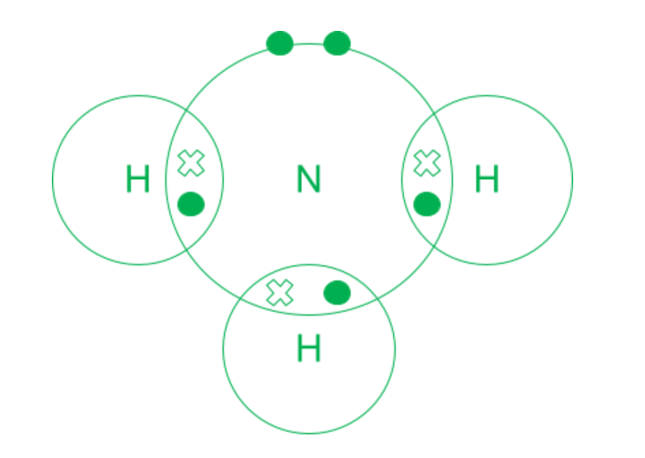
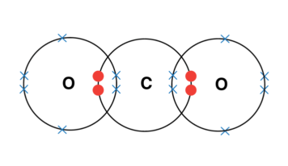
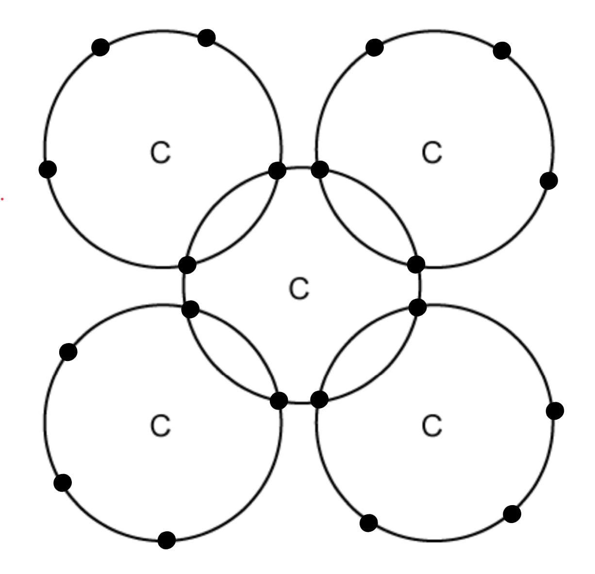
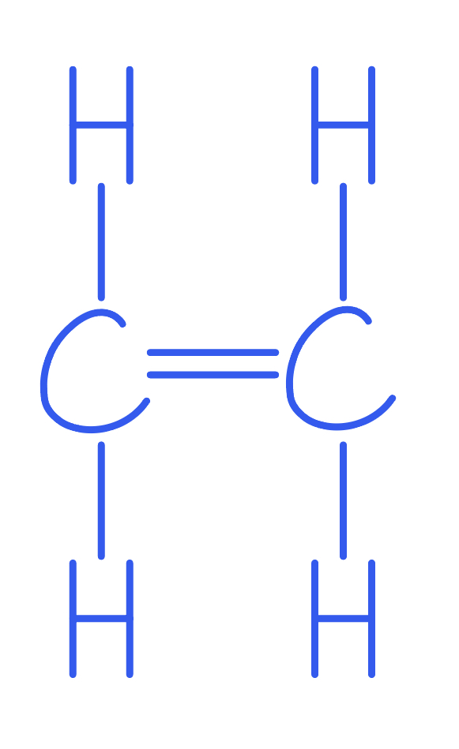
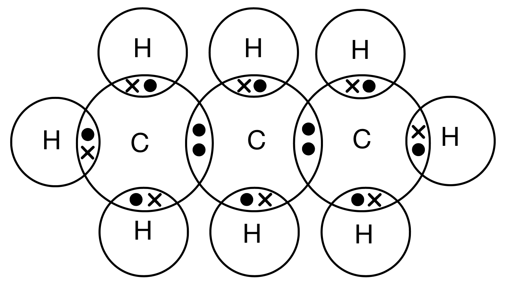

# Mark Schemes — Covalent Bonding
**1. Principles of Chemistry** · Edexcel IGCSE Chemistry 4CH1

## Q1 — easy — 7 marks

### 2 — 3 marks
The correct pairs are:

- Each correct pair;** [1 mark]**

**[Total: 3 marks]**

- *Careful: **If a substance has more than one line then you do not get the mark for that substance*
- *You should be able to recognise the diagrams for each substance*
- *Common questions that follow ask about the properties of these substances*

### 2 — 1 marks
The type of bonding is:

- Covalent;** [1 mark]**

**[Total: 1 mark]**

- *Graphite, diamond, buckminsterfullerene and nanotubes are all made from carbon*
- *Carbon is a non-metal*
- *The type of bond between non-metal atoms is covalent*

### 2 — 1 marks
The substance that conducts electricity is:

- Graphite; **[1 mark]**

**[Total: 1 mark]**

- *Graphite has freely moving electrons so it can conduct electricity*
- *Diamond cannot conduct as each carbon atom is bonded to four others, so there are no unbonded electrons*
- *C**60** fullerene is a molecule with three covalent bonds to each carbon and delocalised electrons, however these electrons cannot jump between molecules*

### 2 — 2 marks
The completed sentence is:

Their melting points are **high **due to strong covalent bonds needing lots of **energy **to break.

- High; **[1 mark]**
- Energy; **[1 mark]**

**[Total: 2 marks]**

- *The wording about melting points can help you answer questions*

  - *High** melting points are associated with:*
  
    - *Strong** bonds / forces *
    - *Lots** of bonds in the case of diamond*
    - *Requiring **lots** / **large amounts** of energy to overcome*

## Q2 — medium — 1 marks

### 3 — 1 marks
**Correct answer: C** — silicon(IV) chloride has a lower melting point as it has fewer covalent bonds to overcome

**Final answer:** **The correct answer is C.**

- Silicon(IV) chloride has a lower melting point because the intermolecular forces are weak

  - Less energy is needed to overcome these forces
  - It has a lower melting point
- Silicon dioxide has many strong covalent bonds which need to be broken

  - More energy is needed to break these bonds
  - It has a higher melting point

## Q3 — hard — 9 marks

### 4 — 2 marks
Substance **X** is:

- Graphene; **[1 mark]**
- (It can be used to make touchscreens because) it is transparent / one atom thick;** [1 mark]**

**[Total: 2 marks]**

- *You need to apply your knowledge about the properties of graphene to this question *
- *Other allotropes of carbon are strong and can conduct electricity such as fullerenes but graphene is the only one that is one atom thick *

### 4 — 2 marks
Buckminsterfullerene is used as a lubricant because:

- The molecules are spherical; **[1 mark]**
- So (the molecules) can roll; **[1 mark]**

**[Total: 2 marks]**

- *The structure of Buckminsterfullerene is:*

- *It has the formula C**60** and is composed of atoms arranged in hexagons which form a spherical shape*

### 4 — 3 marks
Graphene can be used in these applications because:

Catalysts

- They have a large surface area;** [1 mark]**

Electronics

- They can conduct electricity; **[1 mark]**
- Due to delocalised / free electrons that can move; **[1 mark]**

**[Total: 3 marks]**

- *Use the number of marks each part of this question is worth to determine what you need to say*
- *You can obtain two marks from simply giving the property that determines each use:*

  - *Catalysts - due to large surface area*
  - *Electronics- they can conduct electricity*
- *The electronics question is worth two marks so you need to explain this property further*

### 4 — 2 marks
A catalyst increases the rate of a reaction by:

- Lowering the activation energy; **[1 mark]**
- By providing an alternative pathway (for the reaction); **[1 mark]**

**[Total: 2 marks]**

- *Exam questions will often interleave questions on different topics*
- *You should already know that a catalyst speeds up the rate of a chemical reaction and you should be aware of it lowering the activation energy*
- *The alternative route it causes the reaction to take has the lower activation energy and it is this second marking point that students often miss out*

## Q4 — hard — 11 marks

### 8(a) — 2 marks
i) The correct choice is:

- B / 5; **[1 mark] **

ii) The correct choice is:

- D / ; **[1 mark] **

**[Total: 2 marks] **

- *For part ii)*

  - *A is incorrect as 1 is the pH of a strong acid*
  - *B is correct as weak acids have a pH between 3 and 6*
  - *C is incorrect as 7 is the pH of a neutral solution*
  - *D is incorrect as 9 is the pH of a weak alkali*
- *For part ii) *

  - *A is incorrect as alkalis contain OH**−** ions not acids*
  - *B is incorrect as acids do not donate electrons*
  - *C is incorrect as bases are proton acceptors not acids*
  - *D is correct as acids are proton donors*

### 8(b) — 2 marks
i) The name of this type of reaction is:

- Thermal decomposition; **[1 mark] **

ii) The completed equation is:

PbCO3 → PbO + CO2

- PbO + CO2; **[1 mark] **

**[Total: 2 marks] **

- *When a compound is heated and breaks down, the reaction is known as thermal decomposition*
- *When a carbonate breaks down the metal oxide and carbon dioxide gas are formed*

### 8(c) — 7 marks
i) The completed table is:

- Liquid (shown in table); **[1 mark] **

ii) Silicon dioxide has a much higher melting point than silicon(IV) chloride because:

An explanation which links any **six** of the following points

- Silicon dioxide has a giant (covalent) structure;** [1 mark] **
- Covalent bonds are (very) strong; **[1 mark] **
- (In silicon dioxide) many / all the covalent bonds need to be broken; **[1 mark] **
- A large amount of / more energy is required to break the bonds (in silicon dioxide); **[1 mark] **
- Silicon(IV) chloride has a simple molecular structure**; [1 mark] **
- The forces between the molecules/intermolecular forces (in silicon(IV) chloride) are weak; **[1 mark] **
- Little / less energy is needed to overcome the forces in silicon(IV) chloride; **[1 mark] **

**[Total: 7 marks] **

- *You should know that silicon dioxide has a giant covalent structure and therefore has similar properties to diamond*
- *Silicon(IV) chloride is a simple molecule, it only contains 5 atoms, therefore you need to apply your knowledge of simple molecules to answer the question*

## Q5 — medium — 6 marks

### 7(a) — 2 marks
Silicon dioxide has a high melting point because:

- It has lots / many / strong (covalent) bonds;** [1 mark]** 
*Accept strong (electrostatic) forces of attraction between the nuclei of atoms and the bonding electrons*
- (Therefore,) a large amount of (heat / thermal) energy is needed to break the bonds 
**OR**
** **(Therefore,) a large amount of (heat / thermal) energy is needed to overcome the forces; **[1 mark]**
 *Mentioning metallic bonding, ionic bonding / ions, intermolecular forces scores zero* marks

**[Total: 2 marks]**

- *The melting and boiling points of most covalent compounds are related to the intermolecular forces of attraction *
- *However, the melting point of diamond and silicon dioxide is dependent on the strength and large number of covalent bonds*
- *Careful: **You will automatically lose all marks if you talk about metals and metallic bonding, ions and ionic bonding or intermolecular forces *

### 7(b) — 2 marks
Graphite conducts electricity because:

- It has delocalised electrons; **[1 mark]** *Free electrons and sea of electrons are ignored*
- That are mobile / able to move / able to flow; **[1 mark] ***Electrons must be mnetioned to score the second mark Ideas about carrying charge / current are ignored Any mention of ions in graphite scores an automatic zero marks*

**[Total: 2 marks]**

- *The main structure of graphite has only 3 covalent bonds*
- *The remaining electrons from the "missing" fourth bond are delocalised between the layers of carbon atoms*

  - *These electrons are able to move and therefore conduct electricity*

### 7(c) — 2 marks
Diamond is hard but graphite is soft because:

- Diamond has a 3D / rigid / tetrahedral lattice *Accept structure in place of the word lattice*** **
**OR**
** **Every carbon is bonded to 4 other carbons;** [1 mark] ***Talking about intermolecular forces in diamond automatically loses the mark*
- Graphite has layers that can slide over each other; **[1 mark] ***Talking about intermolecular forces between the layers of graphite is ignored*

**[Total: 2 marks]**

- *It is very common for exams to ask about one (or more) of these three covalent compounds and their properties*

  - *Diamond*
  - *Silicon dioxide*
  - *Graphite and other graph- chemicals, e.g. graphene*

## Q6 — easy — 4 marks

### 7 — 1 marks
**Correct answer: C** — Shared pair of electrons between two non-metal atoms

**Final answer:** **The correct answer is C.**

- The best description of a covalent bond is Shared pair of electrons between two non-metal atoms.
- A covalent bond is a shared pair of electrons between two non-metals

  - Their shells overlap to share electrons
  - The attraction is between the nuclei of both atoms and the pair of electrons

- Options **A**, **B** and **D** are incorrect because:

  - Option **A** - Sea of delocalised electrons and positive metal ions is a description of metallic bonding
  - Option **B** - Attraction between positive and negative ions is a description of ionic bonding
  - Option **D** - Weak intermolecular forces occur between simple molecules

### 7 — 1 marks
**Correct answer: D** — Oxygen

**Final answer:** **The correct answer is D.**

- The covalently bonded substance is oxygen.
- Sodium oxide and sodium bromide are ionic compounds as they are formed from a metal and a non-metal
- Sodium is a metal, so bonds via metallic bonding

### 7 — 1 marks
The completed dot-and-cross diagram for hydrogen is:

- 2 electrons in the segment / overlap between two hydrogen atoms; **[1 mark]**

**[Total: 1 mark] **

- *It is a common question to have to complete dot-and-cross diagrams for both covalent and ionic compounds*
- *Make sure you use a dot to identify the electron that has come from one atom and a cross for the other*
- *Hydrogen has an atomic number of 1, is in Group 1 and Period 1*

  - *Therefore, it just has 1 electron and 1 shell*
- *Hydrogen has 1 outer electron but needs to have 2*

  - *The maximum number of electrons that can fit in the first shell is 2*
- *Therefore the shells will overlap and they will share a pair of electrons*

  - *Each hydrogen atom now has 2 electrons in their shell*

### 7 — 1 marks
The correct statement is:

| The intermolecular forces are strong |   |
|---|---|
| The bonding in hydrogen is weak |   |
| The intermolecular forces are weak | ; **[1 mark] ** |

**[Total: 1 mark] **

- *Hydrogen gas is an example of a simple molecule which exhibits covalent bonding *
- *Weak intermolecular forces exist between individual molecules*

  - *These forces are between the molecules*
- *It is a common mistake for pupils to talk about the bonds between the atoms being weak - these are in fact very strong *

## Q7 — medium — 6 marks

### 9(a) — 2 marks
The calculation to show that the empirical formula of this compound is CBrF3 is:

Method 1:

- Carbon: $\frac{8.05}{12}$ **OR** 0.671 **AND **Bromine: $\frac{53.69}{80}$ **OR** 0.671 **AND **Fluorine: $\frac{38.26}{19}$** OR** 2.01; **[1 mark]**
- Carbon: $\frac{0.671}{0.671}$ = 1 **AND **Bromine: $\frac{0.671}{0.671}$ = 1 **AND **Fluorine: $\frac{2.01}{0.671}$ = 3; **[1 mark]**

Method 2:

- *M*r of CBrF3 = 149; **[1 mark]**
- Carbon: $\frac{12}{149}\times100$ = 8.05% **AND **Bromine: $\frac{80}{149}\times100$= 53.69% **AND **Fluorine: $\frac{57}{149}\times100$ = 38.26%; **[1 mark]**

**[Total: 2 marks]**

- *Empirical formula calculations follow the same steps regardless of the compound*
- **1** |   | > *Write the elements* | > *C* | > *Br* | > *F* |
|---|---|---|---|---|
| > *2* | > *Write the values from the question (can be % or g)* | > *8.05* | > *53.69* | > *38.26* |
| > *3* | > *Write the atomic mass* | > *12* | > *80* | > *19* |
| > *4* | $\frac{\mathrm{Value}}{\mathrm{Atomic} \mathrm{mass}}$ | > *0.671* | > *0.671* | > *2.01* |
| > *5* | > *Ratio (divide the answers by the smallest value)* | > $\frac{0.671}{0.671}$* = 1* | > $\frac{0.671}{0.671}$* = 1* | > $\frac{2.01}{0.671}$* = 3* |
| > *6* | > *Write the empirical formula* | > *C* | > *Br* | *F**3* |
- *Edexcel like to give questions asking you to prove an empirical formula and these are answered surprisingly badly, even though you have the final answer to work towards*

### 9(b) — 2 marks
The dot-and-cross diagram showing all the outer electrons of Halon 1301 is:

- All four bonding pairs (xo) correct;** [1 mark]**
- Three non-bonding pairs (oo) around the bromine and fluorine atoms;** [1 mark]**

**[Total: 2 marks]**

- *Carbon, bromine and fluorine are all non-metals so it will be covalent bonding - shared pairs of electrons*
- *Carbon has four outer electrons while bromine and fluorine have 7 outer electrons*
- *Place carbon in the centre with its four electrons around it (North, South, East, West)*
- *Place the 1 bromine and 3 fluorine atoms around the central atom*
- *Add one electron between the carbon and bromine atom, then add bromines remaining six electrons*
- *Add one electron between the carbon and each fluorine atom, then add each fluorines remaining six electrons*
- *Double-check that each atom has eight electrons around it, including shared electrons*

### 9(c) — 2 marks
Halon 1301 has a low boiling point because:

- The intermolecular forces (of attraction) are weak;** [1 mark] **
*London forces / dispersion forces / dipole-dipole forces / intermolecular bonds are all accepted*
- Therefore, little energy is needed to overcome these forces 
**OR **
Therefore, little energy is needed to separate the molecules;** [1 mark]** 
*The word bond can be used instead of forces but it ****must ****be clear that you are breaking the bonds ****between**** molecules Less energy is ignored *
*Any mention of ionic, covalent or metallic bonds being broken automatically scores zero marks*

**[Total: 2 marks]**

- *Remember:** Melting and boiling points relate to the intermolecular forces of attraction of a compound*

  - *They do not normally relate to breaking the bonds of a compound *
  - *If you think about water, breaking the bonds leaves you with hydrogen and oxygen atoms but overcoming the intermolecular forces of attraction melts / boils the water *

## Q8 — easy — 1 marks

### 9 — 1 marks
**Correct answer: A** — 

**Final answer:** **The correct answer is A.**

- The incorrect explanation for the property of a substance is **A.**
- Each carbon atom in graphite is bonded to three other carbon atoms, leaving one free electron per carbon atom
- These free electrons migrate along the layers and are free to move and carry charge, hence graphite can conduct electricity

  - It is important that you talk about the electrons for graphite conducting electricity
  - Talking about ions for graphite conducting electricity will not gain you any marks

## Q9 — medium — 1 marks

### 10 — 1 marks
**Correct answer: B** — 2

**Final answer:** **The correct answer is B.**

- The number of **non-bonding**, outer-shell electrons present in one molecule of ammonia is 2.
- There are no unbonded electrons in the hydrogens
- The nitrogen has 5 electrons on the outer shell, and shares 3 in total (one with each hydrogen)
- This leaves two unbonded electrons (a lone pair) on the outer shell of the nitrogen

## Q10 — easy — 6 marks

### 11 — 1 marks
**Correct answer: B** — Butane has a higher *M*r than ethane

**Final answer:** **The correct answer is B.**

- The boiling point of butane is higher than ethane because  Butane has a higher *M*r than ethane
- As the relative molecular mass of a substance increases, the melting and boiling point will increase as well
- The relative molecular mass of butane (C4H10) is 58 and ethane (C2H6) is 30

### 11 — 3 marks
The completed sentence is:

Ethane and butane do not **conduct** electricity because there are no **free **ions / **electrons **that are able to move and carry charge.

Each correct word scores **[1 mark]**

**[Total: 3 marks]**

- *Ethane and butane are simple molecules and are therefore poor conductors of electricity as there are no free ions or electrons to carry the charge*

### 11 — 1 marks
The type of bonding in ethane and butane is:

- Covalent:** [1 mark] **

**[Total: 1 mark] **

- *Carbon and hydrogen are both non-metals*
- *They will share electrons to form covalent bonds*

### 11 — 1 marks
The correct statement is:

| A double bond contains two electrons |   |
|---|---|
| A double bond contains two pairs of electrons | ; **[1 mark]** |

**[Total: 1 mark] **

- *A single covalent bond contains 1 pair of electrons*
- *A double covalent bond contains 2 pairs of electrons *

## Q11 — medium — 11 marks

### 10(a) — 4 marks
i) A dot-and-cross diagram to show the outer shell electrons in a molecule of carbon dioxide, CO2 is:

- Four electrons between the carbon and each oxygen; **[1 mark]**
- Rest of molecule correct; **[1 mark]**

ii) The forces of attraction in a covalent bond are:

- Shared pair(s) of electrons; **[1 mark]**
- Attracted to (two) <u>nuclei</u>; **[1 mark]**

*The second mark depends on the mention of electrons first*

**[Total: 4 marks]**

- *When drawing dot and cross diagrams, consider how many extra electrons each species needs*

  - *Carbon needs another 4, so has to share 4; this is two with each oxygen*
  - *Oxygen needs only another 2 each, so can share two with carbon*
  - *The result is two double bonds, with no spare (lone) electrons on the carbon and 4 spare electrons (two lone pairs) on each oxygen*
- *You need to know the definition of covalent bonding!*

### 10(b) — 7 marks
i) Graphite conducts electricity as:

- Graphite has <u>delocalised</u> electrons; **[1 mark]**
- (Delocalised electron(s)) can move or flow (throughout the structure); **[1 mark]**

*Ignore sea of electrons / free electrons / number of electrons*

*The second mark depends on mentioning electrons first*

*Any mention of ions scores 0, mentioning intermolecular bonds for diamond scores 0 and mentioning breaking covalent bonds for C**60** scores 0*

ii) Diamond has a much higher melting point than C60 fullerene as:

- (Diamond) giant covalent / macromolecular;** [1 mark]**
- (In melting diamond) covalent bonds are broken;** [1 mark]**
- (C60) has a (simple) molecular structure; **[1 mark]**
- (In melting C60) intermolecular forces (of attraction) are overcome; **[1 mark]**
- More energy is needed to break covalent bonds (in diamond) than intermolecular forces (in C60) / covalent bonds are stronger than intermolecular forces;** [1 mark]**

**[Total: 7 marks]**

- *The question is asking about the reason why graphite conducts electricity, so any reference carrying a charge or current will not get credit, as that is saying what happens when something conducts and does not explain the feature in graphite that allows the conduction to occur*

  - *Likewise, any reference to layers is to do with why graphite is a lubricant and not why it conducts*
- *You can describe a covalent bond rather than name it to gain the marks in part ii)*
- *The second part is a significant number of marks, so make sure you have covered both structures and explained reasons, not just stated the facts*

  - *It can be helpful to write your answers in bullet points or tables to make it easier to see if you have five distinct points*

> **[exam-tip]**
> An "explain" answer must give reasons about structure and bonding, not just describe what happens or the shape of the arrangement
> 
> Remember C60 melts by overcoming weak intermolecular forces, not by breaking covalent bonds

## Q12 — medium — 11 marks

### 8(a) — 3 marks
i) The name of the change of state from solid to gas is:

- Sublimation / subliming; **[1 mark]**

ii) The test for carbon dioxide gas is:

- (Add to/bubble into) limewater; **[1 mark]**
- (Limewater) turns cloudy / milky;** [1 mark]** *Accept forms a white precipitate*

**[Total: 3 marks]**

- *You need to know all of the names for the changes between states*
- *When giving the test for gases, often there is a mark available to state the test, and a second mark to give the result of a positive test*

### 8(b) — 2 marks
Carbon dioxide turns from a solid to a gas at a very low temperature because:

- Weak forces (of attraction) between molecules / weak intermolecular forces (of attraction); **[1 mark]**
- Little energy is needed to overcome the (intermolecular) forces / separate the molecules; **[1 mark]**

**[Total: 2 marks]**

- *This question is another way of asking why carbon dioxide has a low melting & boiling point*
- *Remember: **Whilst strong covalent bonds exist between the atoms in a carbon dioxide molecule, there are weak forces of attraction between the molecules and it is these that need to be overcome in order for the molecules to be separated from each other*
- *Accept 'little / not much / doesn't take a lot of energy' for the second mark; do not accept 'less energy' alone*

> **[exam-tip]**
> Don't say covalent bonds are broken \u2013 it's the weak forces between molecules that are overcome, not the bonds within them.

### 8(c) — 6 marks
Reasons why diamond and graphite are suitable for their particular use are:

For diamond, any **three** from:

- Each (carbon) atom is (covalently) bonded to four other (carbon) atoms 
**OR**
** **Each carbon has four bonds;** [1 mark]**
- In a (giant) tetrahedral lattice / network / structure; **[1 mark]**
- The (covalent) bonds are (very) strong 
**OR**
** **There are many bonds; **[1 mark]**
- Therefore diamond is (very) hard / stong; **[1 mark]** *If any mention of intermolecular forces scores a maximum of 2 marks* *If any mention of ions, only that final mark can be awarded*

For graphite, any **three** from:

- Each (carbon) atom is (covalently) bonded to three other (carbon) atoms; **[1 mark]**
- (The structure is) in layers / sheets;** [1 mark]**
- With weak forces (between layers);** [1 mark]**
- (The layers can) slide over each other / rub off; **[1 mark]**
- This makes graphite soft / slippery;** [1 mark] ***If any mention of intermolecular forces scores a maximum of 2 marks* *If any mention of ions, only that final mark can be awarded*

**[Total: 6 marks]**

- *This question is an example of how terminology is very important when explaining properties referring to structure and bonding*
- *It is worth taking the time to ensure you learn the correct terms associated with each type of structure as these are commonly confused and marks are lost for incorrect usage of words*

## Q13 — hard — 9 marks

### 10(a) — 4 marks
i) The dot and cross diagram showing the outer shell electrons in a molecule of nitrogen, N2; is:

- 6 bonding electrons (between the nitrogen atoms); **[1 mark]**
- 2 non-bonding electrons on each nitrogen atom;** [1 mark]** *The non-bonding electrons do not have to be paired up  The mark for the non-bonding electrons is dependent on the 6 shared electrons *

ii) The forces of attraction in a covalent bond are:

- The shared pair(s) of electrons;** [1 mark]**
- Being attracted to (two) nuclei;** [1 mark]** *The word nucleus is not accepted for this mark The second mark is dependent on mentioning electrons for the first mark*

**[Total: 4 marks]**

- *Tip:** For diatomic molecules like nitrogen, you can use the group number to help you quickly draw the dot-and-cross diagram*

  - *Nitrogen is in group 5*
  - *Therefore, it needs 3 electrons to have a complete outer shell*
  - *For the left-hand atom, draw 3 electrons in the shared space and 2 electrons outside of the shared space*
  - *Repeat the process for the right-hand atom, draw 3 electrons in the shared space and 2 electrons outside of the shared space*
  - *Each atom has its own 5 electrons but a share of 8 electrons*
- *The definition of a covalent bond is a very specific statement*

  - *A covalent bond is the force of attraction between **shared pair(s) of electrons** and the **nuclei **of the bonding atoms*
  - *If you do not talk about pairs of electrons or nuclei, then you cannot achieve full marks*

### 10(b) — 5 marks
i) Structure A is:

- Diamond; **[1 mark]**

ii) C60 fullerene has a much lower melting point than graphite because:

Any **four **of the following:

- Graphite is a giant covalent structure;** [1 mark]** *Molecules of graphite does not score this mark*
- (When graphite melts) the covalent bonds are broken; **[1 mark] ***A description of covalent bonds is accepted*
- C60 / fullerene has a (simple) molecular structure 
**OR**
** **C60 / fullerene is molecules of C60; **[1 mark]**
- (When C60 / fullerene melts) the intermolecular forces (of attraction) are overcome; **[1 mark]**
- More energy is needed to break the covalent bonds (in graphite) than to overcome intermolecular forces (in C60 / fullerene); **[1 mark]**

**[Total: 5 marks]**

- *You should be able to identify diamond from its structure*
- *The melting points of all three compounds vary because of their structures and what needs to break / be overcome:*

  - *Diamond - has a high melting point because its giant molecular / covalent structure requires the many, strong covalent bonds to break so that it can melt (4 per carbon)*
  - *Graphite - has a lower melting than diamond because its giant molecular / covalent structure does not have as many covalent bonds to break compared to diamond (3 per carbon in graphite vs 4 per carbon in diamond)*
  - *Fullerene - has a low melting point because of its simple molecular structure, so only needs to overcome the intermolecular forces of attraction in order to melt*

## Q14 — hard — 15 marks

### 15 — 2 marks
Diamond can be used for:

Any **two** from

- Making jewellery;** [1 mark]**
- For cutting tools **/ **blade edges; **[1 mark]**
- To make diamond tipped drill bits; **[1 mark]**

**[Total: 2 marks]**

- *Diamond is very hard as each carbon atom is bonded to four other carbon atoms*
- *This makes it useful for cutting tools*

### 15 — 3 marks
The bonding arrangement in diamond can be represented as:

- Each carbon has 4 electrons; **[1 mark]**
- One shared pair of electrons per outer atom; **[1 mark]**
- 4 shared pairs for the central atom; **[1 mark]**

**[Total: 3 marks]**

> *The centre of the dots must be on or inside overlapping areas*

### 15 — 4 marks
Diamond has a high melting point because:

- It has a giant structure/lattice;** [1 mark]**
- There are strong covalent bonds; **[1 mark]**
- Between (carbon) <u>atoms</u>;** [1 mark]**
- Which need lots of energy to break; **[1 mark]**

**[Total: 4 marks]**

- *Tip: **For questions on melting point follow the same structure for your answer:*

  - *Does it have a giant structure or consist of small molecules?*
  - *What type of bond/force exists? *
  - *What does this bond/force exist between? (Oppositely charged ions / atoms / ions and delocalised electrons?) *
  - *Refer to the amount of energy needed to break the bonds*

### 15 — 2 marks
Ethene is a gas at room temperature because:

- There are weak intermolecular forces (between the molecules);** [1 mark] **
- Easily overcome at room temperature; **[1 mark] **

**[Total: 2 marks] **

- *Covalent bonds which hold together diamond and molecules of ethene are very strong*
- *Diamond has many covalent bonds throughout the structure so a great deal of energy is required to break them*
- *Ethene is a simple molecule which consists of 6 atoms (2 carbons and 4 hydrogens) *

- *Between these molecules are only weak intermolecular forces so there is enough energy at room temperature to overcome these forces and disperse them*

  - *This means ethene is a gas at room temperature *

### 15 — 4 marks
The trend is:

- (Boiling point) increases; **[1 mark]**
- The relative molecular mass of / number of electrons in a substance increases; **[1 mark] **
- There are more intermolecular forces of attraction that need to be overcome when a substance changes state; **[1 mark]**
- So larger amounts of heat energy are needed to overcome forces;** [1 mark] **

**[Total: 4 marks] **

- *The molecular masses of the family of molecules (alkenes) increases *

| **Molecule** | **Formula** | **Relative molecular mass** |
|---|---|---|
| Ethene | C2H4 | 28 |
| Propene | C3H6 | 42 |
| Butene | C4H8 | 56 |
| Pentene | C5H10 | 70 |

## Q15 — medium — 1 marks

### 16 — 1 marks
**Correct answer: A** — 

**Final answer:** **The correct answer is A.**

- The correct dot and cross diagram is **A**.
- A molecule of carbon dioxide is formed from one atom of carbon and two atoms of oxygen, CO2

  - The oxygen atoms have 6 electrons in their outer shell
  - The carbon atom has 4 electrons in its outer shell
- When carbon dioxide is formed, the carbon atom shares two pairs of electrons with each oxygen atom, forming a double bond between the carbon atom and each oxygen atom

  - All atoms have a full outer shell of electrons
- B is incorrect as each carbon atom and oxygen atom are only sharing one pair of electrons. No atom has a full outer shell of electrons
- C is incorrect as each oxygen atom has 2 electrons too few
- D is incorrect as each oxygen atom has 2 electrons too many

## Q16 — hard — 6 marks

### 17 — 1 marks
A covalent bond is:

- A shared <u>pair</u> of electrons
**OR**
(strong electrostatic) attraction between bonding/shared pair of electrons and nuclei (of hydrogen and oxygen); **[1 mark]**

**[Total: 1 mark]**

- *The common mistake of this question is missing out the word pair *
- *Each covalent bond between atoms represents two electrons *
- *If a compound has a double covalent bond, in total four electrons are being shared, two per bond *
- *If using the more detailed definition stating nucleus instead of nuclei if clear reference to 2 atoms would be acceptable*

### 17 — 1 marks
The completed dot and cross diagram is:

- All electrons drawn correctly in pairs; **[1 mark] ***Allow all dots or all crosses or any other acceptable symbol *

**[Total: 1 mark]**

- *Don't panic when you see the number of atoms in this question*
- *Each hydrogen has one electron and therefore must share it with the carbon *
- *Each carbon has four electrons in its outer shell so again must share it to achieve eight*
- *Once you have finished adding the electrons in, count around each atom to ensure the shell has the correct amount*

  - *Remember, hydrogen will only have two electrons as it only has one shell*

### 17 — 2 marks
Propane cannot conduct electricity because:

- There are no (free) electrons / charged particles;** [1 mark]**
- That can carry a charge / move (through the structure);** [1 mark]**

**[Total: 2 marks]**

- *Propane consists of simple molecules *
- *Simple molecules cannot conduct electricity as all their electrons have been used to form covalent bonds*
- *A substance can only conduct electricity if there are charged particles such as ions or electrons that are free to move *

### 17 — 2 marks
The bonding in carbon dioxide is:

- Correct C=O bonds containing two pairs of • x electrons; **[1 mark] **
- Correct number of electrons on both oxygen atoms; **[1 mark] **

**[Total: 2 marks]**

- *Carbon dioxide contains two carbon atoms and oxygen atoms covalently bonded by double bonds*
- *The carbon atom has 4 electrons in its outermost shell and so requires 4 more for a full shell *
- *Therefore each oxygen atom must share two of its six electrons *
- *Each oxygen atom has 6 electrons in its outermost shell so requires 2 more electrons for a full shell*
- *Therefore the carbon atom must share 2 electrons with each oxygen atom *
- *This creates two double bonds, each containing two pairs of electrons *
- *Carbon dioxide can be written as O=C=O to show the double bonds *
- *Make sure you are consistent with your dots and crosses - so if you have decided to use dots for the carbon electrons (as shown in the mark scheme) make sure the oxygen atoms have crosses to represent electrons *

## Q17 — medium — 11 marks

### 9(a) — 3 marks
Diamond has a high melting point because:

- Covalent bonds are strong; **[1 mark]**
- Many (covalent) bonds (need to be broken);** [1 mark]**
- A large amount of (thermal / heat) energy is needed to break the bonds; **[1 mark] **
*Any mention of intermolecular forces / forces between molecules or ions / ionic bonding / metallic bonding scores 0 out of 3*

**[Total: 3 marks]**

- *Always refer to covalent bonds as being strong when explaining the properties of covalent compounds*
- *You would be given credit for stating that there are strong forces of attraction between the nuclei of atoms and the bonding electrons for this first mark*
- *You would be allowed to state that there are intermolecular forces in the molecule, but be careful not to confuse these with actual bonds *
- *Giant structures, such as diamond, only have strong covalent bonds which all need to be broken in order for the atoms to separate*
- *Be careful with terminology when referring to structure and bonding, it is important to use the correct terms*

### 9(b) — 3 marks
i) C60 fullerene has a much lower melting point than diamond because:

- The intermolecular forces (of attraction) are weak; **[1 mark] **Therefore little / less (thermal / heat) energy needed to overcome the forces (of attraction) / separate the molecules;** [1 mark]**

ii) C60 fullerene is suitable for use in medicines because:

Any **one** from:

- The medicine can fit inside (the C60 molecule / it) (the C60 molecule / it) will not react; **[1 mark]**
- With the blood / medicine; **[1 mark] ***e.g. C**60** molecule / it is inert / unreactive*
- (The C60 molecule / it) is non-toxic; **[1 mark]**

**[Total: 3 marks]**

- *The 'suggest' command word in part(ii) indicates that this is not something that you are expected to know, but you have to apply your knowledge to be able to deduce a possible reason*
- *Intermolecular forces are also known as London forces or dispersion forces or dipole-dipole forces or van der Waals forces, and any of these would gain a mark*

> **[exam-tip]**
> Explain C60's low melting point by the weak intermolecular forces between molecules being overcome, never by breaking covalent bonds within the molecules.

### 9(c) — 5 marks
Graphite is soft and conducts electricity because:

An explanation linking any **five **of the following six points but must include **M3 AND M6** for full marks:

Graphite is soft because:

- **M1** the structure is in layers;** [1 mark]**
- **M2** there are weak forces / attractions between the layers (of atoms); **[1 mark]** *Do not accept a reference to weak intermolecular forces or layers of molecules / ions *
- **M3** layers can slide / slip over each other;** [1 mark]**

Graphite conducts electricity because:

- **M4** each carbon atom is (covalently) bonded to three other carbon atoms; **[1 mark] **
- **M5** one delocalised electron per carbon atom; **[1 mark]**
- **M6** delocalised electrons flow / move (through the structure) / are mobile; **[1 mark]** *Ignore free electrons / sea of electrons / references to carrying charge / current If reference to ions for conduction of electricity no M4 M5 M6*

**[Total: 5 marks]**

- *This question is another example of how terminology is very important when explaining properties referring to structure and bonding*
- *It is worth taking the time to ensure you learn the correct terms associated with each type of structure as these are commonly confused and marks are lost for incorrect usage of words*
- *When referring to the delocalised electron in M5, you can use words such as unbonded and free electron to describe them, or, for this mark, you could explain that not all (or only three) of the electrons are involved in bonding *
- *Note how you would not gain a mark in M6 for using the term free electron*

## Q18 — medium — 13 marks

### 5(a) — 3 marks
How the position of these elements in the Periodic Table depends on their electronic configurations:

- They are all in Group 7 / the same group; **[1 mark]**
- Because they all have 7 outer electrons 
**OR**
** **Because they all have the same number of outer electrons; **[1 mark]**
- The number of shells determines the period that they are in; **[1 mark]**

**[Total: 3 marks]**

- *Using the Periodic Table, you should recognise that chlorine, bromine and iodine are all in Group 7*

  - *This means that they each have 7 outer shell electrons*
- *Chlorine has 3 shells as it is in the 3**rd** Period *

  - *The relationship (at GCSE) is that the number of shells matched with the row of the Periodic Table*

### 5(b) — 8 marks
i) The condition necessary for this reaction is:

- Ultraviolet / UV radiation; **[1 mark]** *Allow light or rays instead of radiation*

ii) The equation for this reaction is:

- Cl2 + CH4 → CH3Cl + HCl; **[1 mark] **

iii) A covalent bond is:

Option 1:

- The attraction between <u>shared pairs</u> of electrons; **[1 mark]**
- And the <u>nuclei</u> of two / both atoms (in the bond);** [1 mark]** *The words shared pair and nuclei are required to score each mark Nucleus does not score the second mark*

Option 2:

- Bonding / shared pairs of electrons;** [1 mark]**
- That are attracted to (both) nuclei of the atoms (in the bond); [1 mark] *The words shared pair and nuclei are required to score each mark Nucleus does not score the second mark*

iv) The dot‐and‐cross diagram for a molecule of CH3Cl is:

- Four shared pairs of electrons between the central carbon atom and four other atoms; **[1 mark]**
- 3 lone pairs on the chlorine atom 
**AND**
** **The rest of the molecule correctly labelled; **[1 mark]**

v) CH3Cl has a low boiling point because:

- It has weak intermolecular forces / bonds 
**OR**
** **It has weak forces of attraction / bonds between molecules; **[1 mark]** *It must be clear that the forces are between molecules Any suggestion that the bonds within the molecule / covalent bonds are being broken scores 0 marks*
- That require little (heat) energy to overcome;** [1 mark]**

**[Total: 8 marks]**

- *Parts (i) and (ii) are about the substitution reaction of an alkane by a halogen*

  - *The most common condition given for this reaction is UV light*
  - *During this reaction, 1 hydrogen is swapped / substituted on the alkane at a time although this can potentially happen multiple times until all the hydrogens have been replaced*
- *Examiners are very specific about you choice of words when you are talking about bonds and bonding*

  - *Covalent bonds are the forces of attraction between shared pairs of electrons and the nuclei*
  
    - *It must be clear that you are talking about shared pairs*
    - *It must be clear that you are talking about nuclei, which implies more than one - the word nucleus here will cost you a mark*
- *Most exam mark schemes will ignore whether you have used dots, crosses or a combination (unless directed in the question) but they will focus on the bonding pairs and lone pairs being in the correct position*
- *Questions about boiling points of covalent molecules are another examiner favourite for being picky about your language*

  - *Tip: **Avoid talking about bonds when answering about boiling points*
  - *Boiling supplies energy to overcome the intermolecular forces of attraction; it does not break bonds*
  
    - *If you think about this, boiling turns water into water vapour it does not break it into hydrogen and oxygen atoms*

### 5(c) — 2 marks
Graphite is able to conduct electricity because:

- There is one delocalised electron (per carbon atom); **[1 mark]** *Free electrons and sea of electrons are ignored as answers *
- That is free to move / mobile; **[1 mark]** *The second mark is dependent on electrons being mentioned in the answer *

**[Total: 2 marks]**

- *The ability to conduct electricity by both graphite and metals is due to:*

  - *The presence of delocalised electrons that are able to move / flow through the structures*

## Q19 — easy — 7 marks

### 20 — 2 marks
The diagram should be:

- Dot and cross in each overlap of carbon and hydrogen atom; **[1 mark] **
- Rest of molecule correct; **[1 mark] **

**[Torget: 2 marks] **

- *Carbon has 4 electrons in its outermost shell, therefore it requires 4 more to have a full outer shell (8 electrons)*
- *There are 4 hydrogen atoms, each containing only 1 electron*

  - *These 4 hydrogen atoms overlap with 1 carbon atom and a pair of electrons are shared between both atoms*
- *Hydrogen now has 2 electrons which gives it a full shell*
- *Carbon now has eight electrons *
- *Do not add extra electrons, there should only be 8 in your answer*

### 20 — 1 marks
The type of bond is:

| Metallic |   |
|---|---|
| Ionic |   |
| Covalent | ;** [1 mark] ** |

**[Total: 1 mark] **

- *Carbon and hydrogen are both non-metals*
- *They will share electrons to form covalent bonds*

### 20 — 3 marks
Methane is a gas at room temperature because:

- Intermolecular forces;** [1 mark] **
- (Are) weak;** [1 mark] **
- Little energy is required to overcome**; [1 mark] ** *Ignore reference to simple molecular structure* *'Weak intermolecular forces' stated scores both first and second marks*

**[Total: 3 marks] **

- *The covalent bonds themselves are strong and therefore do not break*
- *It is the forces between the molecules that are weak*
- *Therefore at room temperature there is enough energy to overcome the weak intermolecular forces and the molecules will move away from one another*

### 20 — 1 marks
Methane does not conduct electricity because:

| Electrons are fixed in position |   |
|---|---|
| The ions are free to move and carry a charge |   |
| There are no free electrons to carry the charge | ; **[1 mark] ** |
| The bonds contain no electrons |   |

**[Total: 1 mark] **

- *There are no free electrons in methane, they are all used up in the formation of covalent bonds*

- *Simple covalent molecules do not conduct electricity as they do not contain free electrons*

  - *Make sure you know this as it is a common question*
