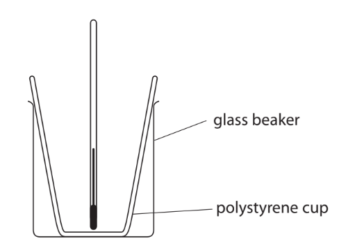
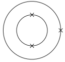

# Exam Questions — Group 1 (Alkali Metals)
**2. Inorganic Chemistry** · Edexcel IGCSE Chemistry 4CH1
> Source: [https://www.savemyexams.com/igcse/chemistry/edexcel/19/topic-questions/2-inorganic-chemistry/2-1-group-1-alkali-metals/exam-questions/](https://www.savemyexams.com/igcse/chemistry/edexcel/19/topic-questions/2-inorganic-chemistry/2-1-group-1-alkali-metals/exam-questions/) · 18 questions · total 139 marks

## Q1 — hard — 10 marks

### 2 — 4 marks — command: multiple — structured
The question is about Group 1 elements.

A small piece of a Group 1 element is added to some water in a large trough.

The element floats on the water’s surface and bursts into a purple flame. Some universal indicator is added to the resulting solution.

i) State the identity of the Group 1 element.

[1]

ii) Give the equation for the reaction.

[1]

iii) State and explain the final colour of the universal indicator in the resulting solution.

[2]

### 2 — 3 marks — command: explain — structured
i) Explain why sodium and potassium have similar reactions with water.

[1]

ii) Explain why sodium is less reactive than potassium.

[2]

### 2 — 3 marks — command: calculate — structured
In a further experiment, 0.225 g of sodium is added to an excess of water, and the hydrogen gas is collected.

The equation for the reaction is

2Na (s) + 2H2O (l) → 2NaOH (aq) + H2 (g)

Calculate the volume of hydrogen gas collected at room temperature and pressure (rtp).

Give your answer to 2 significant figures.

(24,000 cm3 at rtp)

## Q2 — medium — 1 marks

### 3 — 1 mark — multiple_choice
When lithium, a Group 1 metal, reacts with water, two products are formed.

Which is the correct balanced symbol equation, including state symbols, that represents this reaction?
- **A.** Li (s) + 2H2O (l)  →  Li(OH)2 (l) + H2 (g)
- **B.** 2Li (s) + 2H2O (l)  →  2LiOH (aq) + H2 (g)
- **C.** 2Li (s) + H2O (l)  →  Li2O (aq) + H2 (g)
- **D.** 2Li (s) + 2H2O (l)  →  2LiOH (l) + O2 (g)

## Q3 — hard — 13 marks

### 5(a) — 3 marks — command: give — structured — from paper 2020 · Ja2CR
This question is about Group 1 metals and their reactions.

When lithium is added to water, bubbles of hydrogen gas are observed.

i) Give two other observations that could be made.

(2)

ii) Give the test for hydrogen gas.

(1)

### 5(b) — 4 marks — command: multiple — structured — from paper 2020 · Ja2CR
i) Give one observation that would be different if potassium is used instead of lithium.

(1)

ii) The diagram represents an atom of lithium and an atom of potassium.

Explain why potassium is more reactive than lithium.

(3)

### 5(c) — 6 marks — command: calculate — structured — from paper 2020 · Ja2CR
The equation for the reaction between lithium and water is:

2Li (s) + 2H2O (l) → 2LiOH (aq) + H2 (g)

i) A mass of 0.500 g of lithium reacts with an excess of water. Calculate the volume, in cm3, of hydrogen gas produced at rtp.

[molar volume of a gas at rtp = 24 000 cm3]

Give your answer to three significant figures.

(3)

volume = .......................................... cm3

ii) In a reaction between lithium and water, 150 cm3 of lithium hydroxide solution is formed.

The lithium hydroxide solution is then completely neutralised by 24.85 cm3 of 0.100 mol/dm3 sulfuric acid. The equation for the neutralisation is

2LiOH (aq) + H2SO4 (aq) → Li2SO4 (aq) + 2H2O (l)

Calculate the concentration, in mol/dm3, of the lithium hydroxide solution.

(3)

concentration = .............................................................. mol/dm3

## Q4 — hard — 14 marks

### 5 — 5 marks — command: multiple — structured
This question is about some Group 1 metal oxides.

When lithium is exposed to oxygen, it is oxidised and traces of lithium peroxides are produced.

i) Explain why the formation of lithium oxide is a redox reaction.

(3)

ii) Lithium oxide and a gas are produced by the thermal decomposition of lithium peroxide, Li2O2.

Write the balanced chemical equation for this reaction. State symbols are not required.

(2)

### 5 — 1 mark — command: state — structured
Lithium oxide can also be produced by heating lithium hydroxide.

2LiOH → Li2O + H2O

State the type of reaction that occurs during this process.

### 5 — 4 marks — command: compare — structured
The oxidation of potassium can produce potassium oxide, K2O, and potassium superoxide, KO2.

Compare the oxidation of potassium with the combustion of carbon.

### 5 — 4 marks — command: multiple — structured
Potassium superoxide is sometimes used as a water dehumidifier, carbon dioxide scrubber and oxygen generator on board space craft and submarines.

As it absorbs and reacts with carbon dioxide, it locks the carbon dioxide up as potassium carbonate and releases oxygen.

i) Write the balanced chemical equation for this chemical reaction. State symbols are not required.

(2)

ii) Determine the number of moles of carbon dioxide absorbed and the number of moles of oxygen released by one mole of potassium superoxide.

(2)

## Q5 — easy — 13 marks

### 6 — 3 marks — command: multiple — structured
This question is about some of the Group 1 alkali metals and their reactions.

i) Complete the sentence to describe a characteristic reaction of the Group 1 elements.

(2)

Group 1 elements react with ____________________ to form ____________________ solutions and hydrogen.

ii) Solid lithium reacts with cold water to form an aqueous solution of lithium hydroxide and hydrogen gas.

Lithium + water → lithium hydroxide + hydrogen

Which is the correct balanced chemical equation for the reaction of lithium with water?

(1)

| ☐ | **A** | Li (s) + H2O (g) → LiOH (aq) + H2 (g) |
|---|---|---|
| ☐ | **B** | Li (s) + H2O (l) → LiOH (aq) + H2 (g) |
| ☐ | **C** | 2Li (s) + 2H2O (l) → 2LiOH (aq) + H2 (g) |
| ☐ | **D** | 2Li (s) + 2H2O (g) → 2LiOH (aq) + H2 (g) |

### 6 — 3 marks — command: place — structured
Place the following Group 1 metals in order from least to most reactive.

- Caesium
- Lithium
- Potassium
- Sodium

| **least reactive ** |   |   |   |   |   | **most reactive** |
|---|---|---|---|---|---|---|
| _______________ | → | _______________ | → | _______________ | → | _______________ |

### 6 — 4 marks — command: multiple — structured
#### Separate: Chemistry Only

i)The chemical symbol for the Group 1 metal sodium is `Na presubscript 11 presuperscript 23`.

State the number of electrons in one atom of sodium.

(1)

ii) Complete the diagram to show the arrangement of electrons in a sodium atom.

(2)

iii) Group 1 metals like sodium typically form ionic compounds with other elements.

State how a Group 1 metal atom, M, becomes a Group 1 metal ion, M+.

(1)

### 6 — 3 marks — command: explain — structured
Explain why francium is more reactive than rubidium.

Use the words in the boxes to complete the sentences. Each word may be used once, more than once or not at all.

| greater | electrostatic | weaker |
|---|---|---|
| stronger | less | thermal |

The distance between the outermost electron of francium and its nucleus is __________ than that of rubidium.

This means that the forces of attraction in francium are __________ .

Therefore, __________ energy is required to overcome the forces of attraction in francium.

## Q6 — medium — 9 marks

### 4(a) — 6 marks — command: multiple — structured — from paper 2021 · Ja2C
This question is about sodium and potassium.

A trough is filled with water and a few drops of phenolphthalein indicator are added.

A small piece of sodium is dropped into the water. One of the products of the reaction is an alkali.

i) Complete the chemical equation for the reaction of sodium with water.

(2)

___Na (.......) + ___H2O (l) → ___NaOH (........) + H2 (g)

ii) Identify the ion that causes the solution to become alkaline.

(1)

iii) Give three observations that would be made when sodium reacts with water.

(3)

### 4(b) — 3 marks — command: explain — structured — from paper 2021 · Ja2C
Explain why potassium is more reactive than sodium. Refer to the electronic configurations of the atoms in your answer.

## Q7 — hard — 13 marks

### 9(a) — 1 mark — command: suggest — structured — from paper 2021 · Ja1CR
Lithium, sodium and potassium are the first three elements in Group 1 of the Periodic Table.

Suggest why these three elements are all stored in paraffin oil.

### 9(b) — 4 marks — command: give — structured — from paper 2021 · Ja1CR
Caesium, Cs, is below potassium in Group 1.

i) Give a similarity and a difference between the reactions of potassium with water and caesium with water.

similarity..........................................................

difference........................................................

(2)

ii) Give the chemical equation for the reaction between caesium and water.

(2)

### 9(c) — 3 marks — command: multiple — structured — from paper 2021 · Ja1CR
A student investigates the temperature change in the reaction between dilute acids and solutions of Group 1 hydroxides.

He uses this apparatus.

This is the student’s method:

- Measure the temperature of 50 cm3 of hydrochloric acid
- Pour the acid into a polystyrene cup
- Add 50 cm3 of sodium hydroxide solution to the acid
- Measure the maximum temperature of the mixture

i) Suggest what could be added to the apparatus to improve the experiment.

(1)

ii) Explain a change to the method that would improve the accuracy of the experiment.

(2)

### 9(d) — 5 marks — command: calculate — structured — from paper 2021 · Ja1CR
These are the student’s results:

Temperature of hydrochloric acid = 19.9 °C

Maximum temperature of mixture = 26.5 °C

i) Calculate the energy change, Q, in joules for this reaction.

[mass of 1.0 cm3 of mixture = 1.0 g]

[for the mixture, c = 4.2 J / g / °C]

Q = .............................................. J

(3)

ii) In the student’s reaction between hydrochloric acid and sodium hydroxide, 0.050 mol of water forms.

Calculate the molar enthalpy change, Δ*H*, in kJ / mol for this reaction.

Δ*H* = .............................................. kJ / mol

(2)

## Q8 — medium — 1 marks

### 9 — 1 mark — multiple_choice
The position of an element in the Periodic Table can be used to predict its properties.

Which of the following statements could **not** be predicted using the trends in Group 1?
- **A.** Rubidium has a lower melting point than lithium
- **B.** Lithium is softer than potassium
- **C.** Sodium will tarnish more quickly than lithium
- **D.** Caesium is more reactive than potassium

## Q9 — medium — 9 marks

### 6(a) — 1 mark — command: state — structured — from paper 2017 · Specimen1C
This question is about the elements in Group 1 of the Periodic Table and their reactions with water.

State why sodium and potassium are in Group 1 of the Periodic Table.

### 6(b) — 5 marks — command: multiple — structured — from paper 2017 · Specimen1C
A reaction occurs when a small piece of sodium is added to a large volume of water in a trough.

i) Give **two** observations that you would make during this reaction.

(2)

ii) After the reaction has finished, a few drops of universal indicator are added to the solution in the trough. Explain the final colour of the universal indicator.

(2)

iii) What is the most likely pH value of the solution in the trough after the reaction is complete?

| ☐ | **A** | 2 |
|---|---|---|
| ☐ | **B** | 5 |
| ☐ | **C** | 8 |
| ☐ | **D** | 12 |

(1)

### 6(c) — 1 mark — command: give — structured — from paper 2017 · Specimen1C
Give the name of a Group 1 metal that is less reactive than sodium.

### 6(d) — 1 mark — command: give — structured — from paper 2017 · Specimen1C
A small piece of potassium is added to a large volume of water in a trough. Give **one **observation that is made when potassium is added to water that is not made when sodium is added to water.

### 6(e) — 1 mark — command: complete — structured — from paper 2017 · Specimen1C
Complete the equation for the reaction of rubidium with water. State symbols are not required.

........Rb + ........H2O → ........RbOH + .........H2

## Q10 — medium — 6 marks

### 2(a) — 3 marks — command: tick — structured — from paper 2019 · Ju1CR
This question is about some elements in Group 1 of the Periodic Table.

The table gives some statements about the reaction of potassium with water. Place ticks (✔) in three boxes to show which three statements are correct.

| **Statement** |   |
|---|---|
| potassium reacts more vigorously than sodium when added to water |   |
| potassium sinks to the bottom of the water |   |
| bubbles of oxygen gas are produced |   |
| a lilac flame is seen |   |
| potassium moves around |   |
| a solution of potassium oxide is formed |   |

### 2(b) — 2 marks — command: multiple — structured — from paper 2019 · Ju1CR
After the reaction of potassium with water is complete, a few drops of universal indicator are added to the solution formed. The universal indicator turns purple.

i) Suggest a value for the pH of the solution.

(1)

ii) Give the formula of the ion responsible for this pH value.

(1)

### 2(c) — 1 mark — command: complete — structured — from paper 2019 · Ju1CR
Sodium burns in oxygen to produce sodium oxide. Complete the equation for this reaction.

..........Na + ..........O2 → ..........Na2O

## Q11 — hard — 9 marks

### 12 — 2 marks — command: give — structured
This question is about some of the alkali metals and their compounds.

When a teacher drops a small piece of potassium into a trough of cold water, they observe bubbles of gas.

Give two other observations that would be made when potassium reacts with cold water.

### 12 — 2 marks — command: explain — structured
When the reaction between potassium and cold water is complete, the teacher adds some universal indicator to the trough.

Explain the final colour of the universal indicator.

### 12 — 1 mark — command: suggest — structured
Suggest why the teacher does not repeat the experiment using hydrochloric acid instead of cold water.

### 12 — 4 marks — command: multiple — structured
i) Give the balanced chemical equation for the reaction of potassium with hydrochloric acid. State symbols are required.

(2)

ii) Draw diagrams to show the arrangement of the electrons in the product of this reaction.

(2)

## Q12 — medium — 11 marks

### 4(a) — 2 marks — command: give — structured — from paper 2020 · N2CR
This question is about some of the alkali metals and their compounds.

When a teacher drops a small piece of sodium into a trough of cold water, she observes bubbles of gas.

Give two other observations that would be made when sodium reacts with cold water.

### 4(b) — 6 marks — command: multiple — structured — from paper 2020 · N2CR
Lithium reacts with fluorine to form the compound lithium fluoride.

i) Give a chemical equation for this reaction.

(1)

ii) Give a test to show that lithium fluoride contains lithium ions.

(2)

iii) Draw diagrams to show the arrangement of the electrons in a lithium ion and in a fluoride ion.

Include the charge on each ion.

(3)

| Lithium ion | Fluoride ion |
|---|---|

### 4(c) — 3 marks — command: explain — structured — from paper 2020 · N2CR
The table shows the electronic configurations of sodium and potassium.

| **Element** | ** Electronic configurations** |
|---|---|
| sodium | 2.8.1 |
| potassium | 2.8.8.1 |

Explain, in terms of their electronic configurations, why potassium is more reactive than sodium.

## Q13 — hard — 11 marks

### 4(a) — 3 marks — command: give — structured — from paper 2022 · Jan2C
This question is about the reactions of Group 1 metals with water.

A teacher adds a piece of sodium to some water containing universal indicator.

The equation for this reaction is:

2Na (s) + 2H2O (l) → 2NaOH (aq) + H2 (g)

The sodium floats on the surface of the water and the universal indicator changes colour because an alkaline solution is formed.

i) Give two other observations.

(2)

ii) Give the final colour of the universal indicator.

(1)

### 4(b) — 4 marks — command: multiple — structured — from paper 2022 · Jan2C
The diagram represents an atom of lithium and an atom of sodium.

|  |  |
|---|---|
| lithium | sodium |

i) Give a reason why lithium and sodium have similar reactions with water.

(1)

ii) Explain why lithium is less reactive than sodium.

(3)

### 4(c) — 4 marks — command: show — structured — from paper 2022 · Jan2C
The teacher adds 0.150 g of lithium to an excess of water and collects the hydrogen gas produced.

The equation for the reaction is

2Li (s) + 2H2O (l) → 2LiOH (aq) + H2 (g)

The teacher collects 254 cm3 of hydrogen gas at room temperature and pressure (rtp).

Show by calculation that 1 mol of hydrogen gas has a volume of approximately 24000 cm3 at rtp.

## Q14 — easy — 1 marks

### 15 — 1 mark — multiple_choice
This question is about the reaction between sodium and water.

Which statement about this reaction is correct?
- **A.** Sodium sinks to the bottom of the water
- **B.** A lilac flame is seen
- **C.** A solution of sodium oxide is produced
- **D.** Bubbles of hydrogen gas are produced

## Q15 — easy — 1 marks

### 16 — 1 mark — multiple_choice
Sodium and rubidium have similar chemical properties because their atoms
- **A.** Form positive ions
- **B.** Have the same number of electrons in their outer shell
- **C.** Have the same electronic configuration
- **D.** Readily gain electrons

## Q16 — easy — 1 marks

### 17 — 1 mark — multiple_choice
Which of the following could **not **be predicted about caesium, based on the trends seen in Group 1 metals?
- **A.** It is soft
- **B.** It has a relatively high melting point
- **C.** It is very reactive
- **D.** It has a relatively low density

## Q17 — medium — 15 marks

### 6(a) — 7 marks — command: multiple — structured — from paper 2021 · Ju1C
This question is about some of the Group 1 elements and their compounds.

A teacher adds a small piece of lithium to water in a trough.

i) Give three observations that are made when lithium reacts with water.

(3)

ii) After the reaction has finished, the teacher adds a few drops of universal indicator to the solution in the trough.

Explain the colour of the universal indicator after it is added to the solution.

(2)

iii) Write a chemical equation for the reaction of lithium with water.

(2)

### 6(b) — 3 marks — command: multiple — structured — from paper 2021 · Ju1C
A student does a flame test to see if a white solid contains sodium ions.

She cleans a platinum wire before using it for the flame test.

i) Explain why the student needs to clean the platinum wire.

(2)

ii) Which of these is the colour of the flame if the solid contains sodium ions?

(1)

| ☐ | **A** | green |
|---|---|---|
| ☐ | **B** | lilac |
| ☐ | **C** | red |
| ☐ | **D** | yellow |

### 6(c) — 5 marks — command: multiple — structured — from paper 2021 · Ju1C
Potassium sulfate (K2SO4) is an ionic compound.

i) Give the formula of each ion in potassium sulfate.

(1)

potassium ion ..................

sulfate ion ...............

ii) The melting point of potassium sulfate is 1069 °C.

Explain why potassium sulfate has a high melting point.

Refer to structure and bonding in your answer.

(4)

## Q18 — easy — 1 marks

### 19 — 1 mark — multiple_choice
A teacher adds a small piece of potassium to a large trough of water to form a solution.

When the reaction has completed she adds a few drops of universal indicator to the solution.

What is the most likely pH value of the solution?
- **A.** 3
- **B.** 7
- **C.** 8
- **D.** 12
