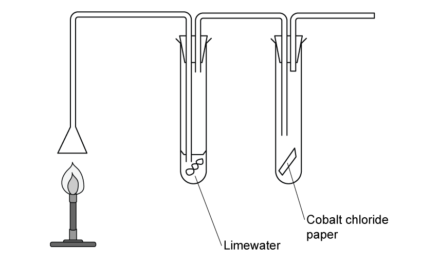
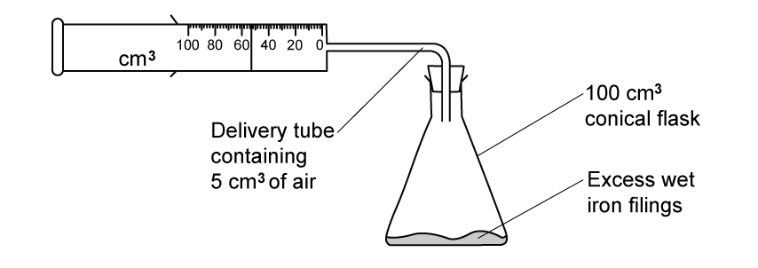
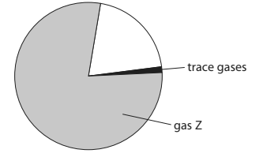
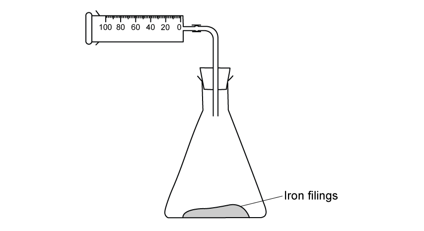
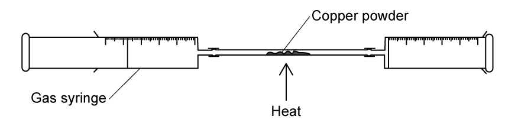
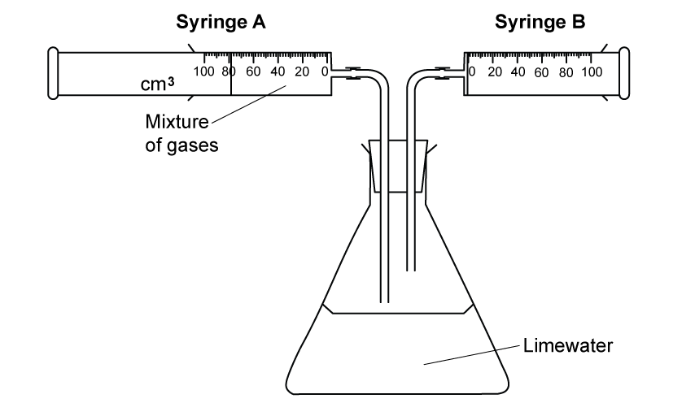

# Exam Questions — Gases in the Atmosphere
**2. Inorganic Chemistry** · Edexcel IGCSE Chemistry 4CH1
> Source: [https://www.savemyexams.com/igcse/chemistry/edexcel/19/topic-questions/2-inorganic-chemistry/2-3-gases-in-the-atmosphere/exam-questions/](https://www.savemyexams.com/igcse/chemistry/edexcel/19/topic-questions/2-inorganic-chemistry/2-3-gases-in-the-atmosphere/exam-questions/) · 18 questions · total 121 marks

## Q1 — easy — 9 marks

### 2 — 5 marks — command: multiple — structured
This question is about gases in the atmosphere.

A teacher uses this apparatus to determine the percentage of oxygen in air.

The teacher heats the copper wire strongly and passes the air in the syringe from one side to the other.

She then lets the apparatus cool down and she measures the volume of air in the syringe.

i) State the appearance of the copper wire after heating.

[1]

ii) Write an equation for the reaction between copper and oxygen.

[1]

iii) Explain why the teacher leaves the apparatus to cool down before taking a reading of the volume.

[1]

iv) Explain why the teacher uses copper wire rather than a piece of copper.

[2]

### 2 — 3 marks — command: calculate — structured
Calculate the expected volume of gas in the syringe at room temperature.

### 2 — 1 mark — command: give — structured
The teacher measures the volume of the syringe at the end of the experiment and records the volume as 42 cm3.

Give one reason why this was not the expected result.

## Q2 — medium — 13 marks

### 3 — 2 marks — command: state — structured
This question is about non-metals and their compounds.

Sulfur is a non-metal that burns in air.

i) State one observation made during the combustion of sulfur.

[1]

ii) State one chemical property of the product of combustion that can be used to classify sulfur as a non-metal.

[1]

### 3 — 2 marks — command: describe — structured
Describe the difference in the movement of the particles in liquid sulfur and solid sulfur.

### 3 — 2 marks — command: explain — structured
Sulfur dioxide and carbon dioxide are gases with simple molecular structures.

Explain why these substances have low melting and boiling points.

### 3 — 2 marks — command: show — structured
Complete the dot and cross diagram for carbon dioxide. Show outer electrons only.

### 3 — 3 marks — command: multiple — structured
Carbon dioxide is one of the greenhouse gases found in the Earth’s atmosphere.

i) Explain what is meant by the term greenhouse gas.

[1]

ii) State an environmental consequences associated with carbon dioxide.

[1]

iii) Choose the correct % of carbon dioxide in dry air:

[1]

A. 0.04%

B. 0.4%

C. 4%

D. 10%

### 3 — 2 marks — command: explain — structured
Limestone (CaCO3) is used in large quantities to produce cement by thermal decomposition.

Explain how the thermal decomposition of carbonates presents an environmental problem.

## Q3 — easy — 1 marks

### 4 — 1 mark — multiple_choice
Air is a mixture of gases.

What is the approximate percentage of nitrogen in air?
- **A.** 1
- **B.** 20
- **C.** 25
- **D.** 78

## Q4 — hard — 11 marks

### 5 — 2 marks — command: calculate — structured
This question is about the combustion of fuels and atmospheric pollution.

Methane is a common fuel that can be combusted.

CH4 (g) + 2O2 (g) → CO2 (g) + 2H2O (l)

Calculate the mass of methane that is required to produce 50.0 g of carbon dioxide.

### 5 — 3 marks — command: multiple — structured
An experiment is set up to show the products of combustion for methane.

i) Write a chemical equation for the reaction that occurs in the limewater as it gives a positive test for one of the combustion products.

(1)

ii) The cobalt chloride paper tests for the other combustion product. Explain why the set-up of this apparatus does not prove that this combustion product is produced.

(2)

### 5 — 3 marks — command: multiple — structured
Fossil fuels are burned in car engines releasing carbon dioxide and other gases. Rainwater is acidic because carbon dioxide dissolves in water to form carbonic acid along with other acidic pollutant gases, such as nitrogen dioxide, dissolving in the water.

i) Give the name of the acid that forms when nitrogen dioxide dissolves in water.

(1)

ii) Explain how nitrogen dioxide is produced in a car engine if there are no nitrogen-based impurities in fossil fuels?

(2)

### 5 — 3 marks — command: explain — structured
Explain how reducing the amount of sulfur in fossil fuels reduces the erosion of limestone.

## Q5 — medium — 1 marks

### 6 — 1 mark — multiple_choice
The approximate percentage of oxygen in air can be determined in the laboratory using this apparatus.

The steps for the method are shown below.

The steps shown are not in the correct order.

| **Step K:** | Place some damp iron wool and a rubber bung in the top of the tube |
|---|---|
| **Step L:** | Leave the apparatus for a few days |
| **Step M:** | Place a graduated glass tube in a beaker of water |
| **Step N:** | Record the reading of the water level in the tube |
| **Step O:** | Record the reading of the water level again |

Which of the following shows the correct order of the steps above?
- **A.** M, K, N, L, O
- **B.** K, M, N, L, O
- **C.** M, N, K, L, O
- **D.** M, K, N, L, O

## Q6 — hard — 13 marks

### 7 — 2 marks — command: write — structured
This question is about the percentage of oxygen in the air.

The percentage of oxygen in the air can be determined by observing the formation of hydrated iron(III) oxide.

Write the balanced chemical equation for the formation of iron(III) oxide from iron.

### 7 — 2 marks — command: complete — structured
A student sets up this apparatus to observe the formation of hydrated iron(III) oxide.

The reading on the syringe is recorded at the start of the experiment. The apparatus is then left for a week before the reading on the syringe is recorded again.

The table shows the initial reading of the syringe.

| syringe reading at start / cm3 | 100 |
|---|---|
| syringe reading at end / cm3 |   |
| volume of oxygen used / cm3 |   |

The atmosphere is comprised of 20% oxygen. Complete the table to show the expected results.

### 7 — 3 marks — command: calculate — structured
A student completes a second experiment.

The diagram shows the readings on the student's experiment.

The student completes their results table, as shown, to calculate that the percentage of oxygen in the air is 21.5%.

| syringe reading at start / cm3 | 84 |
|---|---|
| syringe reading at end / cm3 | 40 |
| volume of oxygen used / cm3 | 44 |

Identify the error that the student has made and calculate the correct percentage of oxygen in the air.

### 7 — 6 marks — command: explain — structured
Another set of experiments featured changes to the apparatus.

i) Explain how the use of dry iron filings would affect the calculated percentage of oxygen in the air.

(3)

ii) Explain how leaving the apparatus in a warm place for 1 week would affect the calculated percentage of oxygen in the air.

(3)

## Q7 — medium — 8 marks

### 4(a) — 2 marks — command: complete — structured — from paper 2017 · Specimen1C
The percentage by volume of oxygen in air can be found by using the rusting of iron. A student sets up this apparatus to measure the volume of oxygen in a sample of air.

An excess of wet iron filings is used. At the start of each experiment, the reading on the syringe is recorded and the apparatus is then left for a week so that the reaction is complete. The reading on the syringe is then recorded again.

The diagram shows the readings in one experiment.

Complete the table to show:

- the syringe reading at the end of this experiment
- the volume of oxygen used in the experiment.

| syringe reading at start / cm3 | 76 |
|---|---|
| syringe reading at end / cm3 |   |
| volume of oxygen used / cm3 |   |

### 4(b) — 3 marks — command: calculate — structured — from paper 2017 · Specimen1C
The table shows the results recorded by a different student in her experiment.

| volume of air in conical flask / cm3 | 100 |
|---|---|
| volume of air in connecting tube / cm3 | 10 |
| original volume of air in syringe / cm3 | 80 |
| final volume of air in syringe / cm3 | 43 |

Calculate the percentage of oxygen in air using these results.

percentage of oxygen = ............. %

### 4(c) — 3 marks — command: complete — structured — from paper 2017 · Specimen1C
The table shows some possible causes of anomalous results in this experiment. Use terms from the box to complete the table, showing possible causes and their effects on the volume of oxygen used in this experiment.

| decreased | increased | no effect |
|---|---|---|

Each term may be used once, more than once, or not at all.

| **Possible cause** | **Effect on volume of oxygen used** |
|---|---|
| wet iron filings not in excess |   |
| apparatus left for 1 hour instead of 1 week |   |
| apparatus left in a warmer place for 1 week |   |

## Q8 — easy — 8 marks

### 2(a) — 2 marks — command: which — structured — from paper 2022 · Jan2C
This question is about gases in the air.

The pie chart represents the percentages of gases in dry, unpolluted air.

Gases with percentages of less than 1% in air are called trace gases.

i) Which of these is gas Z?

(1)

| ☐ | A | hydrogen |
|---|---|---|
| ☐ | B | methane |
| ☐ | C | neon |
| ☐ | D | nitrogen |

ii) Which of these is the approximate percentage of oxygen in dry, unpolluted air?

(1)

| ☐ | A | 0.04% |
|---|---|---|
| ☐ | B | 0.9% |
| ☐ | C | 21% |
| ☐ | D | 35% |

### 2(b) — 4 marks — command: multiple — structured — from paper 2022 · Jan2C
One of the trace gases is carbon dioxide.

i) Identify two reactions that produce carbon dioxide by placing a tick (✔) in two boxes.

| cracking an alkane |   |
|---|---|
| complete combustion of an alkane |   |
| reaction between magnesium and hydrochloric acid |   |
| rusting of iron |   |
| thermal decomposition of copper(II) carbonate |   |

(2)

ii) Name an environmental problem that is caused by the percentage of carbon dioxide increasing in the atmosphere.

(1)

iii)Name the trace gas with the highest percentage in dry, unpolluted air.

(1)

### 2(c) — 2 marks — command: multiple — structured — from paper 2022 · Jan2C
Rainwater is acidic because carbon dioxide dissolves in water to form carbonic acid.

Acid rain is more acidic than rainwater because acidic pollutant gases also dissolve in water.

i) Give the name of the acid that forms when nitrogen dioxide dissolves in water.

(1)

ii) Name another pollutant gas that also forms acid rain.

(1)

## Q9 — hard — 12 marks

### 5 — 1 mark — command: state — structured — from paper 2021 · Ja1CR
A student uses this apparatus to investigate the effect of heat on different solid metal carbonates.

This is the student’s method:

- Use a spatula to put some metal carbonate in the boiling tube
- Fit the delivery tube into position
- Pour some limewater into the test tube
- Start a timer and immediately begin to heat the metal carbonate
- Record the time when a change first occurs in the limewater

The student repeats the method using different metal carbonates.

When a metal carbonate is heated a reaction sometimes occurs. The equation for the reaction is:

metal carbonate → metal oxide + carbon dioxide

State the name given to this type of reaction.

### 5(b) — 2 marks — command: state — structured — from paper 2011 · Ja1CR
State two variables that the student should control in this investigation.

1. ........................................... 2. ...........................................

### 5(c) — 1 mark — command: suggest — structured — from paper 2021 · Ja1CR
Suggest why bubbles appear in the limewater immediately after heating has started but before there is any change to the metal carbonate.

### 5(d) — 2 marks — command: explain — structured — from paper 2021 · Ja1CR
Explain the purpose of limewater in this investigation.

### 5(e) — 3 marks — command: multiple — structured — from paper 2021 · Ja1CR
The table shows some of the results for the student’s investigation.

| **Metal carbonate** | **Colour change of solid ** | **Time taken for any** **change in limewater** |
|---|---|---|
| calcium carbonate | remains white | 90 seconds |
| sodium carbonate | remains white | no change |
| copper(II) carbonate |   | 50 seconds |

i) State the colour change that occurs for copper(II) carbonate.

from ...................................... to ...................................

(2)

ii) Give a chemical equation for this reaction of copper(II) carbonate.

(1)

### 5(f) — 3 marks — command: deduce — structured — from paper 2021 · Ja1CR
There is a relationship between the position of a metal in the reactivity series and how easily the metal carbonate reacts when heated.

I) Use the student’s results and your own knowledge to deduce this relationship.

(2)

ii) State how you should extend the investigation to see if your deduction is correct.

(1)

## Q10 — easy — 6 marks

### 1(a) — 4 marks — command: identify — structured — from paper 2020 · Ja1C
This question is about gases in the atmosphere.

The box gives the names of some gases in the atmosphere.

| argon | carbon dioxide | helium | nitrogen | oxygen |
|---|---|---|---|---|

Choose gases from the box to answer these questions. Each gas may be used once, more than once or not at all.

i) Identify a noble gas.

(1)

ii) Identify a gas that makes up about 78% of the atmosphere.

(1)

iii) Identify a greenhouse gas.

(1)

iv) Identify a gas produced by the thermal decomposition of calcium carbonate.

(1)

### 1(b) — 2 marks — command: multiple — structured — from paper 2020 · Ja1C
Sulfur reacts with oxygen to produce sulfur dioxide gas.

i) Write a chemical equation for this reaction.

(1)

ii) State an environmental problem caused when sulfur dioxide gas dissolves in water in the atmosphere.

(1)

## Q11 — easy — 5 marks

### 1(a) — 4 marks — command: identify — structured — from paper 2019 · Ju2CR
This question is about gases in the atmosphere.

The box gives the names of some gases in the atmosphere.

| argon                     carbon dioxide                helium  nitrogen                                oxygen |
|---|

Use gases from the box to answer the questions. Each gas may be used once, more than once or not at all.

i) Identify the two noble gases.

(1)

ii) Identify the gas that is a compound.

(1)

iii) Identify the most abundant gas in the atmosphere.

(1)

iv) Identify the greenhouse gas.

(1)

### 1(b) — 1 mark — command: describe — structured — from paper 2018 · Ju2CR
Describe the test for oxygen.

## Q12 — hard — 13 marks

### 13 — 4 marks — command: multiple — structured
This question is about determining the percentage composition by volume of a mixture of three gases, oxygen, carbon dioxide and argon in air.

Two experiments are done to determine the percentage composition by volume of oxygen.

In experiment 1, a student connects a gas syringe to a conical flask filled with iron filings. The diagram shows the apparatus the student uses.

i) Give two changes the student needs to make to the apparatus in experiment 1 to find the percentage by volume of oxygen in a sample of air.

(2)

In experiment 2, two 100 cm3 gas syringes are connected to a reaction tube containing copper powder. The sample of air is passed over hot copper oxide. The diagram shows the apparatus that is used.

ii) Explain why both syringes should not be filled with 100 cm3 of oxygen.

(2)

### 13 — 3 marks — command: multiple — structured
When the apparatus in experiment 2 is set up correctly, the mixture of gases is passed over the hot copper powder.

The total volume of the mixture of gases in the syringes at the start is 76 cm3.

The total volume of the mixture of gases in the syringes at the end is 64 cm3.

i) Calculate the percentage by volume of oxygen in the mixture of gases.

(2)

ii) Explain how the answer to part (i) suggests that all of the oxygen has not reacted.

(1)

### 13 — 4 marks — command: explain — structured
To determine the percentage of carbon dioxide in the air, the student suggests adapting the apparatus in experiment 2.

They suggest replacing the reaction tube containing copper powder with a conical flask containing limewater, as shown.

Explain why this experiment will not show the presence of carbon dioxide and give two reasons why this experiment will not allow the percentage of carbon dioxide in the air to be determined.

### 13 — 2 marks — command: explain — structured
The percentage by volume of argon cannot be determined directly because it is very unreactive.

Explain why argon is extremely unreactive.

## Q13 — medium — 1 marks

### 14 — 1 mark — multiple_choice
Metal carbonates undergo thermal decomposition when heated.

Which is a correct balanced symbol equation for the thermal decomposition of a metal carbonate?
- **A.** LiCO3 → LiO + CO2
- **B.** Mg2CO3 → Mg2O + CO2
- **C.** CaCO3 + CO2 → CaO
- **D.** CuCO3 → CuO + CO2

## Q14 — easy — 5 marks

### 2(a) — 4 marks — command: name — structured — from paper 2021 · Ja2C
This question is about gases.

The box gives the names of some gases.

|   | argon | carbon dioxide | hydrogen | nitrogen | oxygen |
|---|---|---|---|---|---|

Use gases from the box to answer these questions. Each gas may be used once, more than once or not at all.

i) Name the most abundant gas in the Earth’s atmosphere.

(1)

ii) Name the gas that is a compound.

(1)

iii) Name the least reactive of the gases.

(1)

iv) Name the gas formed by the complete combustion of hydrocarbons.

(1)

### 2(b) — 1 mark — command: describe — structured — from paper 2021 · Ja2C
Describe the test for hydrogen gas.

## Q15 — medium — 5 marks

### 5(a) — 1 mark — command: how — structured — from paper 2020 · Ja1CR
A teacher uses the reaction between phosphorus and oxygen to calculate the percentage of oxygen in air. She uses this apparatus and excess phosphorus.

The volume of gas in the tube decreases as the phosphorus reacts with oxygen. The teacher measures the volume of gas in the tube at one-minute intervals. The table shows the teacher’s results.

| **Time in minutes** | **Volume of gas in tube in cm****3** |
|---|---|
| 0 | 48.5 |
| 1 | 41.0 |
| 2 | 38.0 |
| 4 | 37.5 |
| 5 | 37.0 |
| 6 | 37.0 |
| 7 | 37.0 |

State how the results show that all the oxygen has reacted.

### 5(b) — 1 mark — command: give — structured — from paper 2020 · Ja1CR
Give one change to this experiment that would make the results more accurate.

### 5(c) — 3 marks — command: calculate — structured — from paper 2020 · Ja1CR
Use the results to calculate the percentage of oxygen in air. Give your answer to one decimal place.

percentage = ...........................%

## Q16 — hard — 8 marks

### 4(a) — 3 marks — command: multiple — structured — from paper 2022 · Jan1C
A teacher uses this apparatus to find the percentage of oxygen in a gaseous mixture of oxygen and argon.

This is the teacher’s method.

1. Heat the copper powder
2. Push the plunger on syringe A to pass the mixture of oxygen and argon over the hot copper so that the mixture moves into syringe B
3. Push the plunger on syringe B to pass the mixture of oxygen and argon over the hot copper so that the mixture moves into syringe A
4. Record the reading on syringe A
5. Repeat Steps 2, 3 and 4 a number of times

The volume of gas decreases as the oxygen reacts with the copper.

Argon is unreactive so does not react with the copper.

The copper powder turns black.

i) Give a reason why the copper powder is heated.

(1)

ii) State why argon is unreactive.

(1)

iii) Give the name of the black powder that forms when the oxygen reacts with the copper.

(1)

### 4(b) — 5 marks — command: multiple — structured — from paper 2022 · Jan1C
The table shows the teacher’s results.

| **Reading number** | **Reading on syringe A in cm****3**** ** |
|---|---|
| Start | 78 |
| 1 | 70 |
| 2 | 67 |
| 3 | 65 |
| 4 | 63 |
| 5 | 61 |
| 6 | 60 |
| 7 | 59 |
| 8 | 58 |
| 9 | 58 |
| 10 | 58 |

i) State how the results show that all the oxygen has reacted.

(1)

ii) The volume of gas in the glass tube and connecting tubes is 175 cm3.

Calculate the percentage of oxygen in the mixture of oxygen and argon.

(3)

iii) Suggest one reason why the calculated percentage of oxygen in the mixture may not be accurate.

(1)

## Q17 — easy — 1 marks

### 18 — 1 mark — multiple_choice
Carbon dioxide is a gas present in air.

Which statement is **not **correct about carbon dioxide?
- **A.** When bubbled through limewater, carbon dioxide turns limewater cloudy
- **B.** It is produced when copper(II) carbonate undergoes thermal decomposition
- **C.** It is the third most abundant gas in the atmosphere
- **D.** It is a greenhouse gas that contributes to climate change

## Q18 — medium — 1 marks

### 19 — 1 mark — multiple_choice
Combustion reactions involve a chemical change in which oxygen reacts with elements or compounds to produce oxides.

Which is the correct statement about combustion?
- **A.** Combustion reactions are also reduction reactions
- **B.** During the combustion of sulfur, a blue flame is observed and a colourless, poisonous gas is produced
- **C.** All combustion reactions are endothermic
- **D.** The balanced symbol equation for the combustion of hydrogen is: H2 + O2 → H2O2
