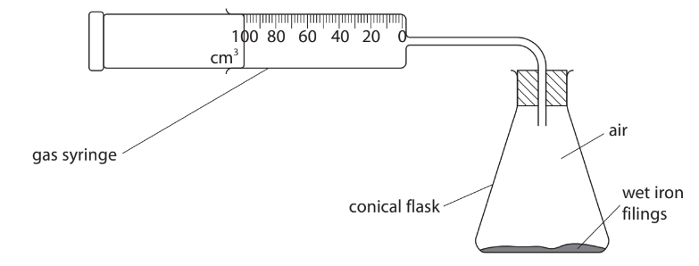
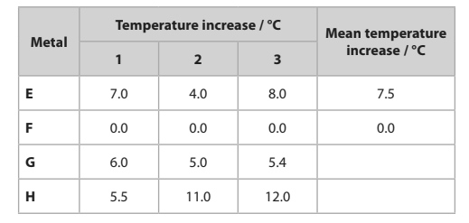
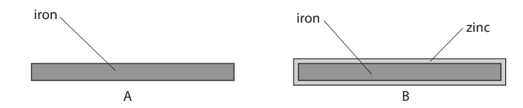
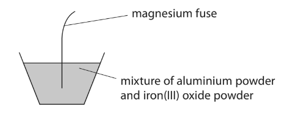
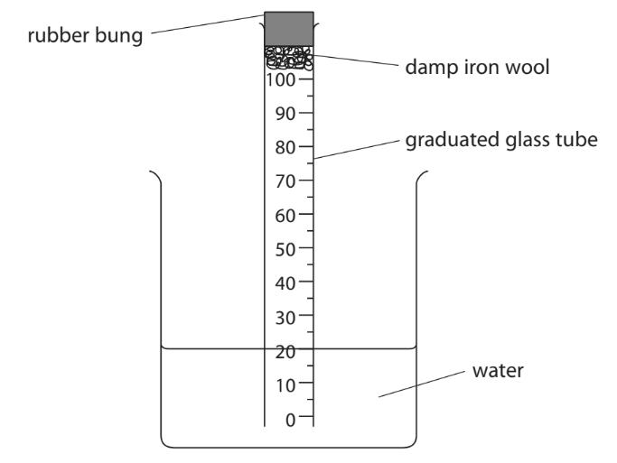
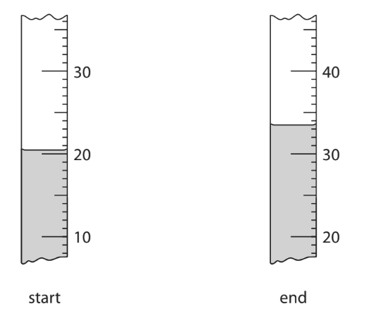
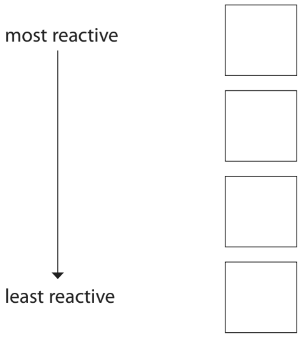
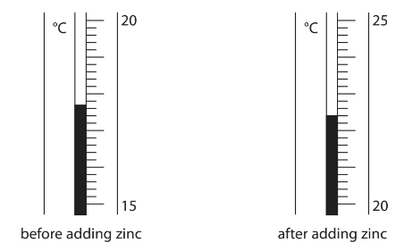
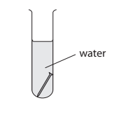
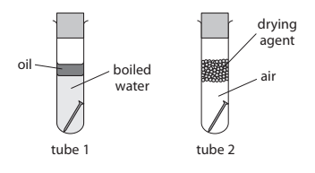

# Exam Questions — Reactivity Series
**2. Inorganic Chemistry** · Edexcel IGCSE Chemistry 4CH1
> Source: [https://www.savemyexams.com/igcse/chemistry/edexcel/19/topic-questions/2-inorganic-chemistry/2-4-reactivity-series/exam-questions/](https://www.savemyexams.com/igcse/chemistry/edexcel/19/topic-questions/2-inorganic-chemistry/2-4-reactivity-series/exam-questions/) · 19 questions · total 119 marks

## Q1 — hard — 8 marks

### 2 — 3 marks — command: write — structured
Tin can be extracted by smelting tin(IV) oxide with carbon. This reaction forms molten tin and carbon monoxide.

Write a balanced symbol equation for this reaction. Include state symbols in your equation.

### 2 — 2 marks — command: multiple — structured
i) In terms of electrons explain why tin ions have been reduced.

(1)

ii) Write the half equation for the reduction of tin ions.

(1)

### 2 — 1 mark — multiple_choice
Which is the correct formula of a compound that contains the tin(IV) ion?
- **A.** SnCl2
- **B.** Sn3(PO4)4
- **C.** SnSO4
- **D.** Sn(NO3)2

### 2 — 2 marks — command: write — structured
Zinc is a more reactive metal than tin. It can reduce tin(IV) oxide to tin when they are heated together.

Write a ionic equation for this reaction.

## Q2 — medium — 1 marks

### 3 — 1 mark — multiple_choice
A reaction took place between iron sulfate and magnesium.

iron(II) sulfate + magnesium  →    magnesium sulfate + iron

Which species has been oxidised?
- **A.** Iron
- **B.** Magnesium
- **C.** Sulfur
- **D.** None of the above

## Q3 — hard — 11 marks

### 4 — 3 marks — command: write — structured
Manganese is extracted from manganese oxide, MnO2 , by heating with aluminium powder. Molten manganese and a solid product are formed in this reaction.

Write a balanced symbol equation for this reaction. Include state symbols in your answer.

### 4 — 2 marks — command: write — structured
Use your answer to part a) to write the ionic equation for the reaction of manganese oxide with aluminium powder. You do not need to include state symbols in your answer.

### 4 — 3 marks — command: explain — structured
In terms of electrons, explain why this reaction is classed as a redox reaction

### 4 — 3 marks — command: calculate — structured
Calculate the mass of aluminium that was required to react with manganese oxide, MnO2, to form 200 g of manganese.

(*A*r: O = 16, Mn = 55, Al = 27)

## Q4 — hard — 7 marks

### 4(a) — 3 marks — command: calculate — structured — from paper 2021 · Ja1C
This question is about rusting.

When iron rusts, it reacts with oxygen in the air.

A student uses the rusting of iron to find the percentage of oxygen in a sample of air.

The diagram shows the apparatus.

These are the student’s results.

volume of air in conical flask and connecting tube = 265 cm3

volume of air in gas syringe at start = 100 cm3

volume of air in gas syringe at end = 25 cm3

Calculate the percentage of oxygen in the sample of air using the student’s results.

percentage of oxygen = .............................................................. %

### 4(b) — 4 marks — command: explain — structured — from paper 2021 · Ja1C
i) Cars are painted to prevent the iron in car bodies from rusting. Explain how painting prevents the iron in car bodies from rusting.

(2)

ii) Some car manufacturers use paint containing tiny particles of zinc. Explain how particles of zinc prevent iron in car bodies from rusting even when this paint is scratched.

(2)

## Q5 — easy — 8 marks

### 6 — 2 marks — command: multiple — structured
The following reaction occurs when zinc is added to a solution of copper(II) sulfate.

Zn (s) + CuSO4 (aq) → ZnSO4 (aq) + Cu (s)

i) Name the type of reaction occurring.

(1)

ii) Give one observation for this reaction.

(1)

### 6 — 3 marks — command: multiple — structured
Zinc also reacts with hydrochloric acid to form a salt and a gaseous product.

i) Write a word equation for this reaction.

zinc + hydrochloric acid → ___________ _____________ + _______________

(1)

ii) Describe how to test for the gas formed in this reaction.

(2)

### 6 — 2 marks — command: state — structured
Metals, such as the alkali metals, which are more reactive than zinc react readily with water. State two observations for the reaction of an alkali metal and water.

### 6 — 1 mark — multiple_choice
When Group 1 metals react with water they are oxidised and form the metal hydroxide. What is the correct definition of oxidation.
- **A.** Gain of electrons
- **B.** Loss of electrons
- **C.** Loss of oxygen
- **D.** Gain of hydrogen

## Q6 — easy — 9 marks

### 2(a) — 4 marks — command: multiple — structured — from paper 2022 · Jan1C
This question is about rusting.

A simplified formula for rust is Fe2O3

i) Name the two substances needed for iron to rust.

(2)

ii) Give the chemical name for rust.

(1)

iii) What type of reaction occurs in the rusting of iron?

(1)

| **A** | combustion |
|---|---|
| **B** | neutralisation |
| **C** | oxidation |
| **D** | thermal decomposition |

### 2(b) — 5 marks — command: multiple — structured — from paper 2022 · Jan1C
Some iron objects are coated with a layer of zinc to prevent rusting.

i) Name this type of rust prevention.

(1)

ii) Explain how this type of rust prevention continues to protect iron when the layer of zinc is damaged.

(2)

iii) Give two other methods used to prevent iron from rusting.

(2)

## Q7 — medium — 8 marks

### 5(a) — 2 marks — command: state — structured — from paper 2017 · Specimen1C
A metal is added to copper(II) sulfate solution. A displacement reaction only occurs if the metal added is more reactive than copper.

metal + copper(II) sulfate → metal sulfate + copper

Displacement reactions are exothermic. The more reactive the metal added, the greater the temperature rise. A student uses the following method in an experiment to compare the reactivities of different metals:

- Pour some copper(II) sulfate solution into a boiling tube and record its temperature using a thermometer
- Add some metal to the tube and stir with the thermometer
- Record the maximum temperature of the contents of the tube.

He repeats the method using the same amount, in moles, of different metals.

To make the experiment valid, he starts with the copper(II) sulfate solution and the added metal at the same temperature.

State **two** other variables that must be controlled if the experiment is to be valid.

### 5(b) — 6 marks — command: multiple — structured — from paper 2017 · Specimen1C
Another student uses the same method three times for each of the metals **E**, **F**, **G** and **H**. The table shows her results for these metals.

i) The student calculates the mean temperature increase for metals **E** and **F**. She does not include anomalous values in her calculations. Calculate the mean temperature increase for metals **G** and **H**, ignoring any anomalous values. Write your answers in the table.

(2)

ii) Explain which metal is the most reactive.

(2)

iii) Explain which metal is less reactive than copper.

(2)

## Q8 — medium — 10 marks

### 3(a) — 1 mark — command: name — structured — from paper 2020 · Ja1C
The diagram shows two samples of iron, A and B.

Sample B is coated with a thin layer of zinc.

Name the process used to coat iron with zinc.

### 3(b) — 3 marks — command: give — structured — from paper 2020 · Ja1C
The two samples of iron are left outside for several weeks.

A brown solid containing hydrated iron(III) oxide forms on sample A.

i) Give the common name for the brown solid.

(1)

ii) Give the names of the two substances that react with the iron to form the brown solid.

(2)

1........................................................................................................

2........................................................................................................

### 3(c) — 6 marks — command: multiple — structured — from paper 2020 · Ja
Iron can be formed by reacting aluminium powder with iron(III) oxide. The diagram shows how this reaction can be demonstrated.

When the magnesium fuse is lit, a very exothermic reaction occurs.

i) State the meaning of the term **exothermic**.

(1)

ii) The equation for the reaction between aluminium and iron(III) oxide is

2Al + Fe2O3 → 2Fe + Al2O3

Explain what this reaction shows about the relative reactivities of aluminium and iron.

(2)

iii) Explain why the reaction between aluminium and iron(III) oxide is a redox reaction.

(3)

## Q9 — medium — 1 marks

### 10 — 1 mark — multiple_choice
A reactivity series can be deduced by observing the reactions of metals with water and sulfuric acid.

Four metals were added to water and sulfuric acid and the results recorded below.

| **Metal** | **Reaction with water** | **Reaction with dilute sulfuric acid** |
|---|---|---|
| **W** | no reaction | no reaction |
| **X** | very slow reaction | reacts quickly |
| **Y** | no reaction | reacts slowly |
| **Z** | reacts quickly | reacts violently |

What is the order of reactivity starting with the least reactive?
- **A.** W, Y, X, Z
- **B.** Y, W, X, Z
- **C.** W, Y, Z, X
- **D.** Z, X, Y, W

## Q10 — hard — 8 marks

### 5(a) — 1 mark — command: state — structured — from paper 2017 · Specimen2C
Zinc metal is obtained from sulfide ores. The most common ore of zinc is sphalerite, which contains zinc sulfide (ZnS) and a small amount of cadmium sulfide (CdS). The stages involved in the extraction of zinc from sphalerite are:

Stage 1: Sphalerite is strongly heated in air.

2ZnS (s) + 3O2 (g) → 2ZnO (s) + 2SO2 (g)

2CdS (s) + 3O2 (g) → 2CdO (s) + 2SO2 (g)

Stage 2: The mixture of oxides is reacted with sulfuric acid.

ZnO (s) + H2SO4 (aq) → ZnSO4 (aq) + H2O (l)

CdO (s) + H2SO4 (aq) → CdSO4 (aq) + H2O (l)

Stage 3: Zinc dust is added to the solution containing zinc sulfate and cadmium sulfate to remove the cadmium ions.

Cd2+ (aq) + Zn (s) → Cd (s) + Zn2+ (aq)

Stage 4: The solid cadmium is filtered off and the pure zinc sulfate solution is electrolysed.

State how the reaction in stage 3 shows that zinc is more reactive than cadmium.

### 5(b) — 4 marks — command: multiple — structured — from paper 2017 · Specimen2C
i) During the electrolysis in stage 4, zinc is deposited on the cathode.

Write an ionic half-equation for the reaction that occurs.

(1)

ii) Complete the ionic half-equation for the reaction occurring at the anode.

.................... H2O → .....................H+ + O2 + ..................... e−

(1)

iii) Explain how the pH of the solution surrounding the anode changes during the electrolysis.

(2)

### 5(c) — 3 marks — command: explain — structured — from paper 2017 · Specimen2C
Zinc is mixed with copper to make the alloy brass. Explain why brass is harder than pure copper.

## Q11 — hard — 1 marks

### 12 — 1 mark — multiple_choice
A displacement reaction occurs between zinc and copper chloride.

Which half equation correctly shows the change that zinc undergoes?
- **A.** Zn2+(aq) + 2e-  →    Zn (s)
- **B.** Zn (s) + 2e-  →    Zn2+ (aq)
- **C.** Zn2+ (aq)  → Zn (s) + 2e-
- **D.** Zn (s)  →    Zn2+ (aq) + 2e-

## Q12 — easy — 1 marks

### 13 — 1 mark — multiple_choice
Which metal is most suitable for galvanizing iron?
- **A.** Lead
- **B.** Copper
- **C.** Sodium
- **D.** Zinc

## Q13 — medium — 9 marks

### 4(a) — 3 marks — command: multiple — structured — from paper 2021 · Ja1CR
When iron is left in damp air, rust forms on its surface.

i) State the chemical name for rust.

(1)

ii) Explain how a barrier method prevents rusting.

(2)

### 4(b) — 3 marks — command: multiple — structured — from paper 2021 · Ja1CR
A student uses this apparatus to find the approximate percentage by volume of oxygen in air.

This is the student’s method:

- Place a graduated glass tube in a beaker of water
- Place some damp iron wool and a rubber bung in the top of the tube
- Record the reading of the water level in the tube
- Leave the apparatus for a few days
- Record the reading of the water level again

The diagram shows the readings at the start and at the end of the experiment.

i) Use the readings to complete the table, giving all values to the nearest 0.5 cm3

| reading at start in cm3  | 20.5 |
|---|---|
| reading at end in cm3 |   |
| volume of oxygen used in cm3 |   |

(2)

ii) The student uses these results to calculate the percentage by volume of oxygen in air.

Suggest why her calculated value is lower than the expected value.

(1)

### 4(c) — 3 marks — command: calculate — structured — from paper 2021 · Ja1CR
The student repeats the experiment using the same apparatus.

These are her results for the second experiment.

volume of air in tube at start = 80.0 cm3

reading at start = 20.0 cm3

reading at end = 35.5 cm3

Use the results to calculate the percentage by volume of oxygen in air.

percentage = ............................................... %

## Q14 — easy — 1 marks

### 15 — 1 mark — multiple_choice
What type of reaction occurs when iron rusts?
- **A.** Oxidation
- **B.** Neutralisation
- **C.** Combustion
- **D.** Displacement

## Q15 — medium — 8 marks

### 3(a) — 3 marks — command: multiple — structured — from paper 2020 · Nov1C
This question is about metals.

Metals can be arranged in a reactivity series based on their reactions with water and their reactions with dilute hydrochloric acid.

The table shows how four metals, P, Q, R and S, react with water and with dilute hydrochloric acid.

| **Metal** | **Reaction with water** | **Reaction with dilute hydrochloric acid** |
|---|---|---|
| P | no reaction | hydrogen gas forms very slowly |
| Q | no reaction | no reaction |
| R | hydrogen gas forms very quickly | not done |
| S | hydrogen gas forms quickly | hydrogen gas forms very quickly |

i) Identify which of the metals P, Q, R or S could be gold.

(1)

ii) Suggest why the reaction between metal R and dilute hydrochloric acid was not done.

(1)

iii) Use the information in the table to place the metals in order of reactivity from most reactive to least reactive.

(1)

### 3(b) — 2 marks — command: state — structured — from paper 2020 · Nov1C
Zinc is used to coat iron gates to prevent the iron from rusting.

i) State the name of this method of preventing iron from rusting.

(1)

ii) State another method of preventing iron from rusting.

(1)

### 3(c) — 3 marks — command: multiple — structured — from paper 2020 · Nov1C
A mixture of zinc powder and copper(II) oxide is heated.

The chemical equation for the reaction that takes place is

Zn + CuO → ZnO + Cu

i) State how the reaction shows that zinc is more reactive than copper.

(1)

ii) Explain which substance is the oxidising agent.

(2)

## Q16 — medium — 12 marks

### 6(a) — 1 mark — command: write — structured — from paper 2020 · Ja1C
A student uses this method to investigate the reaction of dilute hydrochloric acid with zinc.

- pour some dilute hydrochloric acid into a glass beaker
- record the initial temperature of the acid
- add a piece of zinc and stir the mixture
- record the temperature of the mixture after one minute

Write a word equation for the reaction of dilute hydrochloric acid with zinc.

### 6(b) — 3 marks — command: complete — structured — from paper 2013 · Ja1C
The diagram shows the thermometer readings for this reaction.

Complete the table, giving all values to the nearest 0.1 °C.

| temperature in °C after adding zinc |   |
|---|---|
| temperature in °C before adding zinc |   |
| temperature change in °C |   |

### 6(c) — 5 marks — command: multiple — structured — from paper 2020 · Ja1C
Another student repeats the method using five different metals to compare their reactivity.

i) This student uses a polystyrene cup instead of a glass beaker. Explain why a polystyrene cup is better than a glass beaker in this investigation.

(2)

ii) Give three factors that the student should keep constant in this investigation.

(3)

1........................................................................................................2........................................................................................................3........................................................................................................

### 6(d) — 3 marks — command: multiple — structured — from paper 2020 · Ja1C
The table shows some of the student’s results.

| **Metal added** | **Observation** | **Temperature change in °C** |
|---|---|---|
| copper | no bubbling | 0.0 |
| iron | slow bubbling |   |
| magnesium | rapid bubbling | 8.7 |
| tin | very slow bubbling | 1.4 |
| zinc | moderate bubbling | 5.1 |

i) State why there is no temperature change for copper.

(1)

ii) Predict the temperature change for iron.

(1)

temperature change = ...................................................................... °C

iii) Deduce the order of reactivity of the five metals.

(1)

| most reactive | ................................................. |
|---|---|
|   | ................................................. |
|   | ................................................. |
|   | ................................................. |
| least reactive | ................................................. |

## Q17 — easy — 5 marks

### 1(a) — 2 marks — command: name — structured — from paper 2022 · Ja2CR
Two substances are needed to cause iron to rust. Name these two substances.

1....................................................................................................................................... 2.......................................................................................................................................

### 1(b) — 3 marks — command: give — structured — from paper 2022 · Ja2CR
The box gives the names of some substances.

| calcium | copper | gold |
|---|---|---|
| iodine | methane | zinc |

Use words from the box to answer these questions.

i) Give the name of a non-metallic element.

(1)

ii) Give the name of a compound.

(1)

iii) Give the name of the metal that is lowest in the reactivity series.

(1)

## Q18 — medium — 6 marks

### 2(a) — 2 marks — command: multiple — structured — from paper 2021 · Jan2CR
A student investigates the rusting of iron.

She places an iron nail in a test tube of water and leaves it for several days.

i) Predict the appearance of the iron nail after several days.

(1)

ii) Name the main compound in rust.

(1)

### 2(b) — 4 marks — command: explain — structured — from paper 2021 · Jun2C
The student then sets up two more test tubes containing iron nails.

Explain why the iron nail in tube 1 and the iron nail in tube 2 do not rust.

tube 1

tube 2

## Q19 — medium — 5 marks

### 6(a) — 1 mark — command: what — structured — from paper 2019 · Ju1C
The reactions of metals with water and with dilute sulfuric acid can be used to determine the order of reactivity of the metals.

The table shows the reactions of four metals, W, X, Y and Z, with water and with dilute sulfuric acid.

| **Metal** | **Reaction with water** | **Reaction with dilute sulfuric acid** |
|---|---|---|
| W | no reaction | no reaction |
| X | very slow reaction | reacts quickly |
| Y | no reaction | reacts slowly |
| Z | reacts quickly | reacts violently |

What is the order of reactivity of these metals?

|   | most reactive |   |   | least reactive |
|---|---|---|---|---|
| **A** | W | X | Y | Z |
| **B** | Z | X | Y | W |
| **C** | W | Y | X | Z |
| **D** | Z | Y | X | W |

### 6(b) — 2 marks — command: state — structured — from paper 2019 · Ju1C
i) State which metal, W, X, Y or Z, could be copper.

(1)

ii) State which metal, W, X, Y or Z, could be magnesium.

(1)

### 6(c) — 2 marks — command: state — structured — from paper 2019 · Ju1C
A displacement reaction can also be used to decide the order of reactivity of two metals.

State two observations made when an excess of magnesium powder is added to an aqueous solution of copper(ll) sulfate.
