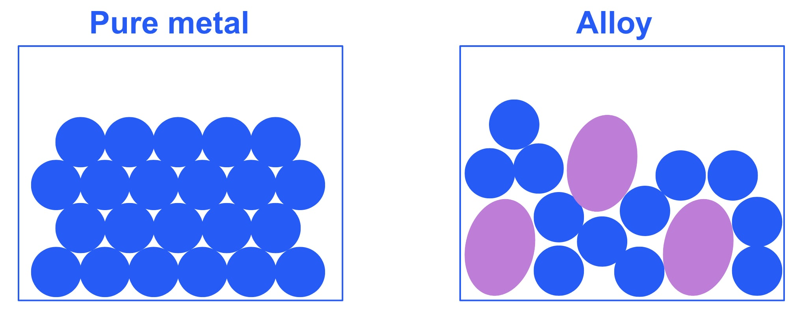
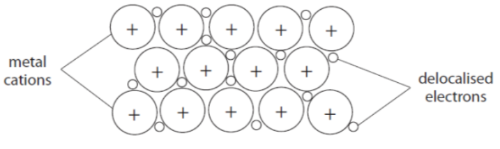

# Mark Schemes — Extraction & Uses of Metals
**2. Inorganic Chemistry** · Edexcel IGCSE Chemistry 4CH1

## Q1 — medium — 14 marks

### 2 — 4 marks
> **[mark-scheme]**
> i) Titanium cannot be extracted from TiCl4 by heating with carbon because:
> 
> - Titanium is more reactive than carbon
> **OR**
> Titanium is higher than carbon in the reactivity series** [1 mark]**
> 
> ii) Titanium cannot be extracted from TiCl4 using electrolysis because:
> 
> - Titanium(IV) chloride is not ionic 
> **OR**
> Titanium(IV) chloride is covalent **[1 mark]**
> - Titanium(IV) chloride does not contain ions that are free to move
> **OR**
> Titanium(IV) chloride does not conduct electricity **[1 mark]**

iii) The completed table is:

| Substance | Melting point oC | Boiling point oC | Physical state at 1000 oC |
|---|---|---|---|
| TiCl4 | -24 | 136 | **Final answer:** **gas** |
| Na | 98 | 883 | **Final answer:** **gas** |
| NaCl | 801 | 1413 | **Final answer:** **liquid** |
| Ti | 1668 | 3287 | **Final answer:** **solid** |

** [1 mark]**

> **[mark-scheme]**
> iii) 1 mark for all four physical states at 1000 oC

> **[exam-tip]**
> The method used to extract a metal depends on its reactivity.Only metals that are less** **reactive than carbon (e.g., iron, zinc, copper) can be extracted by heating their oxides with carbon.
> 
> More reactive metals like titanium must be extracted using other methods. But, it is insufficient to say that titanium is too reactive to be extracted by carbon. You must say it is **higher than carbon** in the reactivity series.
> 
> Not all metals are extracted by reduction with carbon or by electrolysis. You don't need to know any other methods, but this question tests if you can apply your knowledge of the properties of substances to deduce that titanium(IV) chloride must be a **simple molecular** (covalent) substance. It is a liquid at room temperature and a gas at 1000 oC, so it cannot be electrolysed.
> 
> To find the state of a substance at a specific temperature (e.g., 1000 °C), compare that temperature to its melting and boiling points:
> 
> - If the temperature is **below** the melting point, it is a **solid**. (e.g., Ti)
> - If the temperature is **between** the melting and boiling points, it is a **liquid**. (e.g., NaCl)
> - If the temperature is **above** the boiling point, it is a **gas**. (e.g., TiCl4 and Na)

### 2 — 3 marks
The mass of sodium needed to produce 1 kg of titanium process:

- Convert mass of Ti to grams:

1 kg = 1000 g

- Calculate moles of Ti:

moles = $\frac{\mathrm{mass}}{M_{r}}$

moles of Ti = $\frac{1000}{48}$

moles of Ti = 20.83 mol **[1 mark]**

- Deduce the number of moles of Na needed:

From the equation, 4 mol of Na $\Rightarrow$ 1 mol of Ti

moles of Na = 4 x 20.83

moles of Na = 83.33 mol **[1 mark]**

- Convert mass of Na:

mass = moles x *M*r

mass of Na = 83.33 x 23

mass of Na = 1916.67 g

- Convert to kg and express to 2 sig figs:

mass of Na =** **$\frac{1916.67}{1000}$

mass of Na = **1.9 kg** **[1 mark]**

> **[mark-scheme]**
> The correct answer scores all three marks regardless of workings

### 2 — 2 marks
> **[mark-scheme]**
> i) The term alloy means:
> 
> - A mixture of a metal with at least one other element (usually other metals or carbon)
> **OR**
> A mixtures of two or more metals **[1 mark]**
> 
> ii) The purpose of making alloys is:
> 
> Any **one **from:
> 
> - To change the properties of the original metal
> - To make it harder / stronger
> - To make it more resistant to corrosion
> 
> **[1 mark]**

> **[exam-tip]**
> Avoid the words "combined" or "bonded" in your definition, as these imply a compound; always use the word mixture
> 
> Alloys are usually mixtures of metals; steel is an exception involving carbon, and "a mixture of metals" is acceptable
> 
> When explaining the purpose, use a comparative such as harder or stronger, and stick to properties listed in the scheme rather than ones like malleability

### 2 — 4 marks
> **[mark-scheme]**
> Two uses of aluminium and the matching property are:
> 
> Any **two** pairs from (1 mark for each point):
> 
> - Use: Saucepans
> - Property: Good conductor of heat
> 
> **OR**
> 
> - Use: Aircraft / car bodies
> - Property: Low density / strong / resists corrosion
> 
> **OR**
> 
> - Use: Drink cans / cooking foil
> - Property: Malleable / resists corrosion / non-toxic
> 
> **OR**
> 
> - Use: Overhead electricity cables
> - Property: Good conductor of electricity / low density / ductile
> 
> **[4 marks]**
> 
> The property mark is dependent on a suitable linked use.

> **[exam-tip]**
> For a 4-mark question like this, you need to provide **two** distinct uses, and for **each** use, you must state a property that makes aluminium suitable.
> 
> A good strategy is to think of an object made from aluminium first, and then ask yourself, "Which of its properties is most important for this job?". For example:
> 
> - Object*:* A drink can.
> - Why aluminium? It needs to be easily shaped (malleable) and not react with the drink (resists corrosion / non-toxic).

### 2 — 1 marks
> **[mark-scheme]**
> i) The half-equation for the extraction of aluminium is:
> 
> - Al3+ + 3e- → Al **[1 mark]**
> 
> Allow e instead of e-
> 
> ii) In terms of redox, this reaction is:
> 
> - Reduction **[1 mark]**
> - Reason: Electrons are gained by Al3+ **[1 mark]**

> **[exam-tip]**
> A half-equation must be balanced in two ways:
> 
> 1. **Atom balance**
> 
>   - 1 Al on the left
>   - 1 Al on the right
> 2. **Charge balance**
> 
>   - The left side has a total charge of (+3) + (3 × -1) = 0.
>   - The right side has a total charge of 0.
>   - The charges are balanced.
> 
> Remember the acronym **OIL RIG**: **O**xidation **I**s **L**oss (of electrons), **R**eduction **I**s **G**ain (of electrons).
> 
> Examiner reports often note that students lose marks for imprecise language:
> 
> - For example, **IT** gains electrons.
> - What is **IT**? Is **IT** aluminium?
> - No - it is the aluminium **ion (Al****3+****)** that gains electrons, not the aluminium atom.

## Q2 — easy — 1 marks

### 3 — 1 marks
**Correct answer: C** — The layers of atoms are distorted

**Final answer:** **The correct answer is C**

- Alloys are harder than the pure metals from which they are made because The layers of atoms are distorted.
- Alloys are mixtures of metals
- The different metals have different sized atoms which means the atoms are no longer arranged in rows
- The layers of atoms become distorted so that if pressure is applied, the layers cannot slide over each other making the alloy harder and stronger

## Q3 — easy — 6 marks

### 3(a) — 1 marks
**Correct answer: B** — gold

**Final answer:** **The correct answer is B**

- The metal which is found uncombined in the Earth’s crust is Gold .
- Uncombined metals are the least reactive metals
- Sometimes they are know as native meta*ls*

### 3 — 3 marks
i) The word equation for the reaction is:

- iron; **[1 mark]**
- carbon dioxide; **[1 mark]**

ii) During this reaction:

- D  /   the iron oxide is reduced; **[1 mark]**

**[Total: 3 marks]**

- *You can have carbon monoxide as an alternative answer to carbon dioxide*
- *The iron oxide loses oxygen which is the definition of reduction*

### 3(c) — 1 marks
A reason why the starting mass of copper carbonate is always the same as the mass of the products formed:

- No atoms have been created or destroyed / all the original atoms have simply been rearranged in the products; **[1 mark]**

**[Total: 1 mark]**

- *This is the law of conservation of mass*

### 3(d) — 1 marks
A reason zinc is extracted by electrolysis or by heating the ore with carbon:

- Heating with carbon as it is cheaper / less expensive than using electrolysis; **[1 mark]**

**[Total: 1 mark]**

- *You need to get both parts of this question right, the method and the reason to score the mark*
- *Be careful to read this type of question carefully as it looks like it is only one answer*

## Q4 — hard — 7 marks

### 3(b) — 2 marks
i) Steel alloys are used in preference to iron because:

Any **one **of the following sensible suggestions:

- Harder; **[1 mark]**
- Stronger; **[1 mark] **
- It can be tailored for a specific use; **[1 mark] **
- It is more resistant to corrosion; **[1 mark]**
- Any other sensible suggestion; **[1 mark] **

ii) A use of stainless steel is:

Any **one **of the following:

- Chemical plants;** [1 mark] **
- Cooking utensils; **[1 mark] **
- Jewellery; **[1 mark] **
- Cutlery; **[1 mark] **
- Surgical equipment; **[1 mark] **
- Kitchen sinks;** [1 mark] **
- Pipes; **[1 mark] **
- Any other sensible suggestion; **[1 mark] **

**[Total: 2 marks]**

- *Ensure you learn some of the uses of stainless steel and what properties make it suitable for that application*

  - *The use mentioned in the specification is its use in cutlery because of its hardness and its resistance to rusting*
- *You would not gain the mark for part (i) for saying steel does not rust*

  - *This is because over time stainless steel will rust*

### 3(c) — 4 marks
i) Metals have a typical high melting point because

- There are strong attractive forces / strong bonds that require a lot of energy to break **OR **There are strong attractive forces / strong bonds that are hard to break;** [1 mark]**
- The forces / bonds are between positive ions and (negative) electrons;** [1 mark] **

ii) Steel changes its shape because:

- Because the layers, lattice or rows of ions / cations; **[1 mark]**
- Can move / slip / slide past each other; **[1 mark] **

**[Total: 4 marks] **

- *In the question you are given the information that both iron and steel have the same structure, so you can apply your knowledge of metallic bonding to this question*

### 5 — 1 marks
The correct statement is:

| Brass dissolves fully in hydrochloric acid |   |
|---|---|
| Brass has a chemical formula of CuZn |   |
| Brass is formed by a chemical reaction between two metals |   |
| One of the metals in the alloy will dissolve in dilute hydrochloric acid | ✔; **[1 mark]** |

**[Total: 1 mark] **

- *Zinc is above hydrogen in the reactivity series so will react with dilute hydrochloric acid and will completely dissolve*
- *Copper is below hydrogen in the reactivity series so will not react with dilute hydrochloric acid*
- *Copper in the alloy will not dissolve in dilute hydrochloric acid as copper is lower than hydrogen in the reactivity series*
- *Alloys are mixtures, not compounds, so cannot be represented by a chemical formula*

  - *Remember**: alloys are not chemically combined*

## Q5 — hard — 10 marks

### 3(a) — 3 marks
i) The metal from the box that burns with a bright white flame is:

- Magnesium; **[1 mark]**

ii) The metal most likely to be found as an uncombined element is:

- Silver; **[1 mark]**
- Because it is the least reactive (of the metals); **[1 mark] **

**[Total: 3 marks] **

- *You should know that magnesium burns with a bright white flame *
- *Un-reactive elements will remain in their elemental form*

### 3(b) — 3 marks
The method which should be used to obtain lead from lead(II) oxide, PbO is:

- Method 1 / heating the metal oxide/lead(II) oxide with carbon; **[1 mark] **
- (because) lead is less reactive than iron (and iron is obtained from iron oxide by carbon extraction); **[1 mark] **
*Allow carbon is more reactive than lead *
*Accept reverse arguments*
- 2PbO + C → 2Pb + CO2; **[1 mark] **
*Allow PbO + CO → Pb + CO**2** *
*Allow PbO + C → Pb +CO*

**[Total: 3 marks] **

- *If a metal is less reactive than carbon, it can be extracted from its oxide by being heated with carbon*
- *If asked to give the method, make sure you state 'heated' with carbon*
- *If you just say mix, you will not be given the mark as the process would not work*

### 6 — 4 marks
Alloys are harder than pure metals because:

Pure metal:

- (Particles / ions / atoms are the same size in a regular arrangement so) layers can easily slide over each other; **[1 mark] **

Alloy*:*

- Diagram of alloy structure showing a minimum of three layers with at least one different-sized circle; **[1 mark]**
- (Having different sized particles / ions / atoms) disrupts / breaks up the regular arrangement;** [1 mark]**
- So, it is hard(er) for layers to slide over each other; **[1 mark] **

**[Total: 4 marks]**

- *You can be given marks for stating*

  - *disrupts the lattice / layers / rows (of particles / ions / atoms)*
  - *layers cannot slide over each other*
- *But will not be credited for:*

  - *references to strength / breaking of forces / (metallic) bonds - this is because alloys are mixtures*
- *Your diagram could look like this*

  - *Note there are three layers of metal ions*
  - *There is at least one different-sized atom included as well* 

## Q6 — easy — 1 marks

### 7 — 1 marks
**Correct answer: D** — Platinum

**Final answer:** **The correct answer is D**

- The metal found as an uncombined element in the Earth's crust is Platinum.
- Platinum is an unreactive element found uncombined in the Earth's crust
- The other metals are reactive and extracted from their ores using either electrolysis or reduction

## Q7 — easy — 1 marks

### 8 — 1 marks
**Correct answer: B** — They are more reactive than carbon

**Final answer:** **The correct answer is B**

- Some metals are extracted using electrolysis because They are more reactive than carbon.
- The method used to extract a metal from its ore is determined by its place in the reactivity series
- Metals less reactive than carbon can be extracted by reduction
- Metals more reactive than carbon are extracted using electrolysis
- Native metals are unreactive metals that are found in the earth on their own

## Q8 — medium — 1 marks

### 9 — 1 marks
**Correct answer: A** — Easily shaped

**Final answer:** **The correct answer is A**

- The property which belongs to low carbon steels is  Easily shaped.
- Low carbon steels are softer and easily shaped compared to high carbon steels
- B and D are incorrect as these are properties of high carbon steels
- C is incorrect as this is a property of stainless steel

## Q9 — medium — 1 marks

### 10 — 1 marks
**Correct answer: C** — Property 1: low density
Property 2: malleable

**Final answer:** **The correct answer is C**

- Two properties that make aluminium suitable as the metal used as cans for drinks are  low density and malleable.
- The properties of aluminium that make is suitable for this particular use are

  - low density meaning it is lightweight
  - does not react with the drink
  - malleable
  - non-toxic

## Q10 — hard — 10 marks

### 11 — 2 marks
The balanced symbol equation is:

WO3 + 3H2 → W + 3H2O

- Correct chemical formulae; **[1 mark]**
- Correctly balanced equation; **[1 mark] **

**[Total: 2 marks] **

- *Water is formed in this reaction as well as tungsten*
- *A similar reaction you may have seen is the reduction of copper oxide by hydrogen *

  - *Copper oxide + hydrogen → Copper + water *
- *To balance the equation*

  - *WO**3** + H**2** → W + H**2**O *
  
    - *There are 3 oxygen atoms on the left-hand side and 1 on the right*
  - *WO**3** + H**2** → W + **3**H**2**O *
  
    - *There are now 3 oxygen atoms on each side of the equation, but 6 hydrogen atoms on the right-hand side and 2 on the left-hand side*
  - *WO**3** + **3**H**2** → W + **3**H**2**O *
  
    - *The equation is now balanced*

### 11 — 1 marks
The reaction is described as reduction because:

- W / tungsten has lost oxygen (atoms / ions) 
**OR **
W / tungsten <u>ions</u> have gained electrons; **[1 mark] **

**[Total: 1 mark] **

- *You would not gain the mark for simply saying 'it' loses oxygen or gains electrons*

  - *You must be specific about what is occurring*
- *If giving your answer in terms of electrons you must say W ions are gaining electrons*

  - *The half equation would be:*
  - *W**6+** + 6e**–** → W*
- *If W atoms were gaining electrons you would end up with a negatively charged ion*

### 11 — 3 marks
The alloy is stronger because:

- Pure metals have a regular lattice arrangement 
**OR **
All of the atoms / ions in a pure metal are the same size; **[1 mark]**
- Alloys contain atoms that are different sizes; **[1 mark]**
- So, the layers cannot slide over each other (easily); **[1 mark]**

**[Total: 3 marks] **

- *The bonding in pure metals has a regular arrangement so the layers can slide over one another easily*
- *This means that pure metals are malleable and ductile*
- *An alloy contains different elements which will be different sizes which disrupt the regular arrangement of the pure metal*

  - *More force is therefore needed to change the shape of the metal alloy* 

### 11 — 4 marks
To calculate the empirical formula of the ore:

- % of oxygen = 100 - (13.9 + 63.9) = 22.2%;** [1 mark] **
- Ca = $\frac{13.9}{40}$ = 0.348 
**AND **
W = $\frac{63.9}{184}$= 0.347 
**AND **
O = $\frac{22.2}{16}$ = 1.39; **[1 mark]**
- Ca = $\frac{0.348}{0.347}$= 1 
**AND **
W = $\frac{0.347}{0.347}$= 1 
**AND **
O = $\frac{1.39}{0.347}$ = 4; **[1 mark]**
- Empirical formula = CaWO4; **[1 mark]**

**[Total: 4 marks]**

- *Work through your calculation one step at a time *

  - *Calculate the missing mass of oxygen*
  - *Calculate the moles of each element*
  - *Calculate the ratio of elements *
  - *Give your final answer*
- *This way your work will be given credit even if you make a mistake*
- *Many students will miss the last marking point of actually writing the empirical formula of the tungsten ore *

## Q11 — hard — 10 marks

### 12 — 2 marks
In terms of the relative reactivities of carbon, magnesium and titanium, this suggests that:

- Magnesium is more reactive than titanium 
**AND **
Titanium is more reactive than carbon; **[1 mark]** 
*The reverse arguments can be accepted *
- (Therefore,) magnesium is the most reactive 
**OR **
(Therefore,) carbon is the least reactive; **[1 mark]**

**[Total: 2 marks]**

- *This question requires you to apply the information that you are given*

  - *Magnesium must be more reactive than titanium as a reaction occurs*
  - *Carbon cannot be more reactive than titanium as no reaction occurs*
  - *Therefore, magnesium is the most reactive, titanium is the second most reactive and carbon is the least reactive*

### 12 — 3 marks
To compare the amount of each metal produced per hour:

Titanium reactors produce about 41.67 kg of titanium per hour whereas iron blast furnaces produce about 20 000 tonnes of iron per hour.

**Option 1** - convert titanium to tonnes per hour

- $\frac{41.67}{1000}$ = 0.04167 tonnes per hour; **[1 mark]**
- $\frac{20000}{0.04167}$ = 479961.6031; **[1 mark]**
- 480000; **[1 mark]**

**Option 2** - convert iron to kg per hour

- 20000 x 1000 = 20000000 kg per hour; **[1 mark]**
- $\frac{20000000}{41.67}$ = 479961.6031; **[1 mark]**
- 480000;** [1 mark]**

**[Total: 3 marks]**

- *This question relies only on your maths skills*
- *Careful: **The amount of each metal produced is given in different units, so one will need to be converted*
- *Careful: **The question asks for the answer to three significant figures*

  - *This is often missed in calculation questions*
  - *This is more challenging in this question as the third significant figure is zero*

### 12 — 4 marks
Titanium costs more than steel to produce because:

Any **four **from:

- It takes a long time / 17 days to process; **[1 mark]**
- There is a small amount / low abundance (of the titanium oxide ore); **[1 mark]**
- Each batch only produces a small amount of titanium; **[1 mark]**
- It is a batch process 
**OR **
Iron production / blast furnace is a continuous process;** [1 mark]**
- There are more / many / several stages to make / produce titanium;** [1 mark]**
- More energy is used per tonne of titanium; **[1 mark]**
- Magnesium/chlorine is expensive 
**AND **
(Because) it / magnesium / chlorine is produced by electrolysis; **[1 mark] **
*References to temperature are ignored*
- The process is labour intensive 
**OR** 
Separating the titanium requires a lot of time/manpower; **[1 mark]*** *
*References to cost / easier / usefulness alone ****or ****references to incorrect processes are ignored*

**[Total: 4 marks]**

- *Exam technique should tell you that you need to make at least four points*
- *Using the information in the scenario at the start of part (a) should guide you toward some of the ideas*

  - *Takes up to 17 days*
  - *Reactions with chlorine and magnesium*
  - *Multiple stages*
  - *Separated by hand*

### 12 — 1 marks
The suggestion of washing the titanium end product with water to remove the magnesium chloride is not suitable because:

- The titanium will react with water 
**OR **
The titanium reacts to form titanium oxide / titanium dioxide 
**OR **
Ti + 2H2O → TiO2 + 2H2; **[1 mark]**

**[Total: 1 mark]**

- *Titanium is above hydrogen in the reactivity series so it can displace the hydrogen out of water*
- *This typically only happens at the surface because the titanium oxide / titanium dioxide that is made forms a protective layer*

## Q12 — medium — 10 marks

### 13 — 2 marks
Gold is found in its unreacted form because:

- Gold / it is unreactive / near the bottom of the reactivity series; **[1 mark]**
- Gold / it doesn’t form compounds with other elements; **[1 mark]**

**[Total: 2 marks]**

- *The main reason that a metal is found **native** is because it is unreactive *

### 13 — 2 marks
Carbon is used to extract zinc because:

- Carbon is more reactive than zinc **OR **Carbon is placed higher up on the reactivity series than zinc; **[1 mark]**
- So carbon can displace zinc (in reduction displacement reactions); **[1 mark]**

**[Total: 2 marks]**

- *The reactivity series allows you to work out which reactions can / cannot happen*
- *If the lone metal / element is higher up the reactivity series then the metal that is in a compound then a displacement reaction takes place*

### 13 — 3 marks
Sodium was not extracted until 1807 because:

- Sodium is very reactive / near the top of the reactivity series; **[1 mark]**
- Therefore, it cannot be extracted by displacement methods 
**OR **
It can only be extracted by electrolysis; **[1 mark]**
- Electricity hadn't been discovered 
**OR **
Electrolysis had to wait for the discovery of electricity; **[1 mark]**

**[Total: 3 marks]**

- *Sodium is very reactive so forms compounds very easily*
- *It can not be extracted by reduction with carbon as carbon is less reactive than sodium*
- *Therefore, like aluminium, sodium has to be extracted by electrolysis*

### 13 — 3 marks
Two non-metals that are in the reactivity series are:

- Carbon / C; **[1 mark]**
- Hydrogen / H2; **[1 mark] **

Explanation

- They are used to extract metals so their relative position is useful to know; **[1 mark] **

**[Total: 3 marks]**

- *Metals below carbon in the reactivity series can be extracted by heating with carbon*
- *For example zinc can be extracted from zinc oxide*

  - *2ZnO + C → 2Zn + CO**2*
- *Metals below hydrogen in the reactivity series can be extracted by reduction with hydrogen*

  - *CuO + H**2** → Cu + H**2**O*

## Q13 — medium — 8 marks

### 9(a) — 4 marks
i) In the reaction when iron is extracted from iron oxide by heating the oxide with carbon:

- C / iron oxide is reduced; **[1 mark]**

ii) The maximum mass of iron that can be obtained from 240 tonnes of iron oxide, Fe2O3 is:

- Relative formula mass Fe2O3 = (2 x 56) + (3 x 16) 
**OR** 160; **[1 mark]**
- 160 tonnes Fe2O3 produces (2 x 56) 
**OR** 112 tonnes Fe;** [1 mark]**
- 240 tonnes Fe2O3 produces $\frac{2\times56}{160}\times240$ 
**OR** 168 (tonnes); **[1 mark]**

**OR**

- Relative formula mass Fe2O3 = (2 x 56) + (3 x 16) 
**OR** 160;** [1 mark]**
- $\frac{240}{160}$ = 1.5;** [1 mark]**
- 1.5 x 112 **OR** 168 (tonnes);** [1 mark]**

**OR**

- Relative formula mass Fe2O3 = (2 x 56) + (3 x 16) **OR** 160; **[1 mark]**
- $\frac{112}{160}$ = 0.7; **[1 mark]**
- 0.7 x 240 **OR** 168 (tonnes); **[1 mark]** 
*An answer of 168 (tonnes) with or without working scores 3 marks*

**[Total: 4 marks]**

- *Iron oxide is reduced as it loses oxygen to form iron*
- *Carbon is oxidised as it gains oxygen to form carbon dioxide*
- *As the formula of iron oxide is Fe**2**O**3**, it must produce twice the quantity of Fe, so 160 tonnes of Fe**2**O**3** produces 2 x 56 = 112 tones of Fe*
- *1 tonne of Fe**2**O**3** produces 112/160 = 0.7 tonnes of Fe*
- *240 tonnes Fe**2**O**3 **of produces 0.7 x 240 = 168 tonnes of FeFe**2**O**3*

### 9(b) — 2 marks
Aluminium has to be extracted from its oxide by electrolysis because:

- Aluminium is high in reactivity / aluminium oxide is (very) stable / aluminium is more reactive than carbon / carbon is less reactive than aluminium; **[1 mark]**
- Aluminium (oxide) cannot be reduced by carbon / carbon cannot diplace aluminium; **[1 mark]**

**[Total: 2 marks]**

- *Only metals less reactive than carbon can be extracted by heating with carbon*
- *You would be awarded a mark if you said that aluminium **oxide **does not react with carbon - but be careful, you wouldn't gain the mark if you said aluminium does not react with carbon *

### 9(c) — 1 marks
The method that will have to be used to extract calcium from its ore is:

- Electrolysis: **[1 mark]**

**[Total: 1 mark]**

- *Calcium is higher in the reactivity series than carbon, therefore electrolysis is required to extract it from its ore*

### 14 — 1 marks
**Correct answer: D** — Lithium

**Final answer:** **The correct answer is D**

- The metal which cannot be extracted from its ore by reduction is Lithium.
- Only metals below carbon in the reactivity series can be extracted by reduction
- Elements above carbon, such as lithium are extracted using electrolysis

## Q14 — hard — 8 marks

### 7(a) — 3 marks
The experiments that can be done to determine the order of reactivity of these metals by displacement reactions are:

A description to include:

- Place separate pieces of each metal into solutions of each of salt (in spotting tray / container); **[1 mark]**
- Observe changes in appearance / colour of metal / solution; **[1 mark]**
- The more reactive metal shows the greater number of reactions; **[1 mark]**

**[Total: 3 marks]**

- *The description needs to include a brief explanation of how to perform the experiment, what results need to be collected and how these results can be used to deduce the order of reactivity*

### 7(b) — 2 marks
Aluminium cannot be extracted from its ore by heating with carbon but can be extracted by electrolysis because:

Any **two **from:

- Aluminium is more reactive than carbon (so electrolysis is required); **[1 mark]**
- Carbon cannot remove the oxygen / there is no reaction between carbon and aluminium oxide / carbon cannot displace aluminium; **[1 mark] **
- Electrolysis can be used to reduce aluminium ions / electrolysis is a more powerful method of reduction; **[1 mark] **

**[Total: 2 marks]**

- *The method of extraction of a metal from its compound relates to its position in the reactivity series*
- *As the question asks you to 'explain', you need to give more detail in your answer than just referring to the reactivity of aluminium compared with carbon*
- *Electrolysis reduces aluminium ions as aluminium ions gain electrons during electrolysis to form aluminium atoms*

### 7(c) — 1 marks
Pure titanium chloride could be separated from the impurities by:

- (Simple) distillation; **[1 mark]**

**[Total: 1 mark]**

- *The word 'suggest' in the question should tell you that this question will involve you applying your knowledge to an unfamiliar situation*
- *When the gas is cooled, it forms a liquid that has dissolved impurities in it*
- *Simple distillation is the method used to separate a liquid and **soluble solid** from a solution so is the most appropriate in this application*
- *You would be awarded the mark if you gave fractional distillation as your answer*

### 7(e) — 2 marks
A simple method to separate titanium from the mixture is:

A description to include:

Any **one **of the following pairs:

Pair 1

- Add dilute hydrochloric acid (to solid mixture sample to react with the magnesium to form magnesium chloride solution); **[1 mark]**
- Filter the mixture (to remove titanium) / filter off the titanium; **[1 mark]**

Pair 2

- Filter the mixture (to remove titanium) / filter off the titanium; **[1 mark]**
- Wash the titanium; **[1 mark]**

**[Total: 2 marks]**

- *Another question that asks you to 'suggest' a method, this time the question is worth 2 marks which implies more detail is needed than just stating a method*
- *The clue to the answer is given in the question as you are told that titanium doesn't react with hydrochloric acid*
- *You should know that magnesium reacts with hydrochloric acid to form magnesium chloride and hydrogen*
- *So, if you add dilute hydrochloric acid to the mixture, you should be left with a solution of magnesium chloride which also contains titanium metal*
- *It is then a case of filtering the titanium off to separate it from the magnesium chloride solution*

## Q15 — medium — 10 marks

### 5(a) — 4 marks
i) A labelled diagram showing the structure and bonding in a metal should be:

- At least three rows of at least three cations / atoms in a regular arrangement;** [1 mark]**
- Surrounded by (delocalised) electrons; **[1 mark]**

ii) A metal conducts electricity because:

- Delocalised electrons; **[1 mark]**
- Which can flow / move / are mobile / are free to move; **[1 mark]**

**[Total: 4 marks]**

- *If you draw an unlabelled diagram for part i) you will get only one mark*
- *You need to show charges for the cations*

  - *Otherwise it implies that they are neutral and therefore the electrons have no source*
- *The terms 'free electron' or 'sea of electrons' are not permitted alternatives to 'delocalised electrons' in this specification, so make sure you learn the required terminology*
- *There are also forfeits for chemical errors across the structure and bonding topics; any mention of ions or atoms moving (instead of electrons) means that no marks can be gained in part ii)*

### 5(b) — 2 marks
Two properties of aluminium that make it suitable to make cans for drinks:

Any **two** from:

- Low density / lightweight; **[1 mark]**
- Does not react with the drink / non-toxic / does not corrode; **[1 mark]**
- Malleable / easy to shape / easy to bend; **[1 mark]**

**[Total: 2 marks]**

- *This is where you must be specific and not just list properties of aluminium or metals in general; the melting point, for example, is not relevant to whether it makes good drinks cans or not*

### 5(c) — 4 marks
i) Aluminium cannot be extracted by heating aluminium oxide with carbon because:

- Aluminium is more reactive / higher in the reactivity series than carbon 
**OR** 
Aluminium is too reactive / too high in the reactivity series; **[1 mark]**

ii) The half equation is a reduction reaction because:

- Electrons are gained (by aluminium ion / Al3+) 
**OR** 
Oxidation state of aluminium / Al is decreased / changes from +3 to 0; **[1 mark]**

iii) The ionic half-equation for the reaction at the positive electrode is:

**   2**O2− → **O****2** + **4e****(−)**

- Correct formulae of products;** [1 mark]**
- Balancing of correct formulae; **[1 mark]**

**[Total: 4 marks]**

- *The first part of the question requires a recall of the place of carbon in the reactivity series, or an understanding that this was the likely issue*
- *Part ii) asks for a reason, which for redox reactions should always be a reference to electrons and / or oxidation numbers*
- *The positive electrode attracts the negative ions, which is the information given in the question, so the fact that oxide ions are oxidised to oxygen gas is not a big leap, so even if you cannot recall the half equations it is possible to complete it*

## Q16 — easy — 8 marks

### 17 — 4 marks
i) An alloy is:

- A mixture of elements in which at least one is a metal; **[1 mark] **
- Not chemically combined; **[1 mark] **

ii) The aluminium alloy is stronger than pure aluminium because:

- Alloy contains different sized atoms; **[1 mark]**
- Prevent layers from sliding over one another; **[1 mark] **

**[Total: 4 marks]**

- *As alloys contain different elements, the atoms are different sizes*
- *The different sized atoms distort the regular arrangements of atoms*
- *This makes it more difficult for the layers to slide over each other, so they are usually much harder than the pure metal*

> **[exam-tip]**
> An alloy is a mixture, not a compound, so never say the elements are chemically combined
> 
> When explaining strength, name different sized atoms as the cause, not just the disrupted layers

### 17 — 1 marks
Aluminium extracted by electrolysis instead of reduction by carbon because:

- Aluminium is more reactive than carbon; **[1 mark] **

**[Total: 1 mark] **

- *Metals that are above carbon in the reactivity series can not be extracted by reduction with carbon*
- *If aluminium oxide and carbon were heated together, the carbon is not reactive enough to remove the aluminium from the oxide or displace it*

### 17 — 1 marks
The property of the aluminium alloy that makes it suitable to use for aeroplane bodies is:

| Good electrical conductor |   |
|---|---|
| High strength to weight ratio | ✔; [1 mark] |
| Non-toxic |   |
| Good conductor of heat |   |

**[Total: 1 mark] **

- *The high strength to weight ratio of the aluminium alloy means that it is less dense than other metal alloys and therefore lighter*
- *The other properties make the aluminium alloy suitable for other uses:*

  - *Good electrical conductor = overhead power cables*
  - *Non-toxic = food tins*
  - *Good conductor of heat = saucepans*

### 17 — 2 marks
To calculate the percentage by mass of aluminium in aluminium oxide:

- *M*r of Al2O3 = (27 x 2) + (16 x 3) = 102;** [1 mark] **
- Percentage of aluminium = `fraction numerator open parentheses 2 cross times 27 close parentheses over denominator 102 end fraction`x 100 = 52.9 / 53 %;** [1 mark] **

**[Total: 2 marks] **

- *To calculate the percentage by mass of aluminium in aluminium oxide you need to make sure you include the total mass of aluminium as there are two atoms of aluminium in Al**2**O**3*
