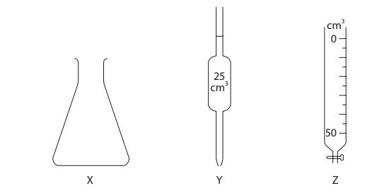
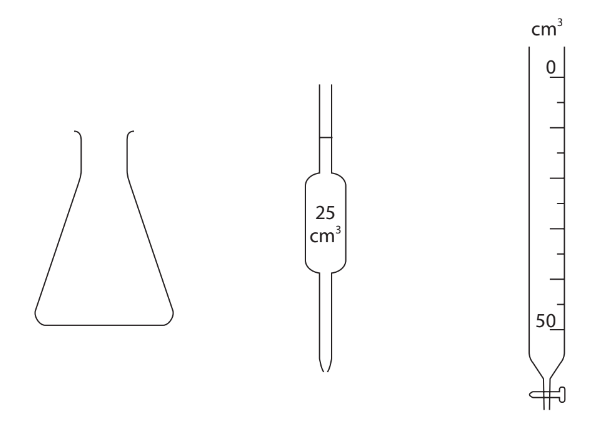
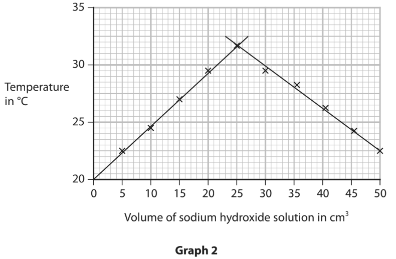
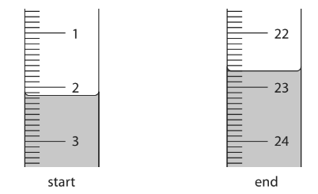

# Exam Questions — Acids, Alkalis & Titrations
**2. Inorganic Chemistry** · Edexcel IGCSE Chemistry 4CH1
> Source: [https://www.savemyexams.com/igcse/chemistry/edexcel/19/topic-questions/2-inorganic-chemistry/2-6-acids-alkalis-and-titrations/exam-questions/](https://www.savemyexams.com/igcse/chemistry/edexcel/19/topic-questions/2-inorganic-chemistry/2-6-acids-alkalis-and-titrations/exam-questions/) · 17 questions · total 105 marks

## Q1 — hard — 6 marks

### 2 — 2 marks — command: multiple — structured
A student performs a titration to determine the concentration of an unknown solution of sodium hydroxide.

The student's method is

- 25.0 cm3 of alkali is added to a clean conical flask
- A few drops of indicator are added, and the conical flask is placed on a white tile so that the colour change can be seen more easily
- The burette is filled with acid, and the starting volume is recorded
- The acid is slowly added from the burette to the alkali in the conical flask while the mixture is swirled
- The addition of acid is stopped when the end-point is reached (when the indicator changes colour), and the final volume is recorded
- The steps are repeated until concordant results are obtained

i) Which letter represents the apparatus the student should use to measure exactly 25.0 cm³ of the sodium hydroxide solution?

[1]

ii) Which is the best indicator to use?

[1]

A. litmus

B. methyl orange

C. universal indicator

D. iodine solution

### 2 — 4 marks — command: multiple — structured
The student obtains the following results:

| Volume of sodium hydroxide solution used in cm3 | 25.0 |
|---|---|
| Concentration of sodium hydroxide solution in mol/dm3 | 0.80 |
| Mean volume of sulfuric acid solution used in cm3 | 13.50 |

i) Write a balanced equation for the reaction between sulfuric acid, H2SO4, and sodium hydroxide, NaOH.

[1]

ii) Calculate the amount, in moles, of sodium hydroxide in 25.0 cm3.

[1]

iii) Calculate the amount, in moles, of sulfuric acid in 13.50cm3.

[1]

iv) Calculate the concentration of the sulfuric acid in mol/dm3.

[1]

## Q2 — medium — 10 marks

### 3 — 3 marks — command: complete — structured
A student carries out a titration to find the concentration of a solution of sulfuric acid, H2SO4.

She titrates 25.00 cm3 of sulfuric acid against 0.80 mol/dm³ sodium hydroxide, NaOH.

The results of the titrations are shown

|   | 1 | 2 | 3 |
|---|---|---|---|
| initial volume of NaOH in cm³ | 0.00 | 21.30 |   |
| final volume of NaOH in cm³ | 21.30 | 42.10 | 26.40 |
| volume delivered | 21.30 |   | 20.90 |
| concordant results |   |   |   |

Complete the table of results and tick (✓) the concordant results.

### 3 — 2 marks — command: calculate — structured
Use your concordant result to calculate the average volume of NaOH used.

### 3 — 5 marks — command: multiple — structured
i) Write the equation for the reaction.

[1]

ii) Calculate the number of moles of NaOH in the average volume used.

[1]

iii) Calculate the number of moles of H2SO4 in 25cm3 of the sulfuric acid.

[1]

iv ) Calculate the concentration of the sulfuric acid in mol/dm3.

[2]

## Q3 — easy — 7 marks

### 1(a) — 1 mark — multiple_choice — from paper 2022 · Jan1CR
Which of these is the colour of litmus indicator in an acidic solution?
- **A.** blue
- **B.** orange
- **C.** red
- **D.** yellow

### 1(b) — 1 mark — multiple_choice — from paper 2022 · Jan1CR
Which of these is the pH value of a neutral solution?
- **A.** 0
- **B.** 4
- **C.** 7
- **D.** 14

### 1(c) — 1 mark — multiple_choice — from paper 2022 · Jan1CR
Which of these describes a solution with a pH value of 9?
- **A.** Strongly acidic
- **B.** Strongly alkaline
- **C.** Weakly acidic
- **D.** Weakly alkaline

### 1(d) — 1 mark — multiple_choice — from paper 2022 · Jan1CR
Which of these is the chemical formula of an acid?
- **A.** HNO3
- **B.** H2O
- **C.** NaCl
- **D.** NaOH

### 1(e) — 1 mark — command: name — structured — from paper 2022 · Jan1CR
Name the type of reaction that occurs when an acid reacts with an alkali.

### 1(f) — 2 marks — command: name — structured — from paper 2022 · Jan1CR
Name the two products of the reaction between hydrochloric acid and potassium hydroxide.

## Q4 — hard — 12 marks

### 7(a) — 3 marks — command: give — structured — from paper 2021 · Jun2C
A student does a titration to find the concentration of a solution of phosphoric acid. He uses these pieces of apparatus X, Y and Z in his titration.

Diagrams are not to scale.

Give the names of X, Y and Z.

X ....................................................................................

Y ....................................................................................

Z ....................................................................................

### 7(a) — 1 mark — multiple_choice — from paper 2021 · Jun2C
What is the colour of phenolphthalein in phosphoric acid?
- **A.** blue
- **B.** colourless
- **C.** pink
- **D.** red

### 7(c) — 3 marks — command: multiple — structured — from paper 2021 · Jun2C
The student titrates 25.0 cm3 of phosphoric acid with a solution of sodium hydroxide (NaOH). Table 1 shows the student’s results.

**Table 1**

| **Titration number** | 1 | 2 | 3 | 4 |
|---|---|---|---|---|
| **Volume of NaOH added in cm****3** | 30.35 | 30.25 | 30.00 | 30.30 |
| **Concordant results** |   |   |   |   |

Concordant results are those within 0.20 cm3 of each other.

i) Add ticks (✔) to table 1 to show the concordant results.

(1)

ii) Use your ticked results to calculate the mean (average) volume of NaOH added.

(2)

mean volume = ............................................................cm3

### 7(d) — 5 marks — command: calculate — structured — from paper 2021 · Jun2C
Table 2 shows the titration results of another student.

**Table 2**

| **volume of phosphoric acid used in cm****3** | 25.0 |
|---|---|
| **concentration of sodium hydroxide solution in mol/dm****3** | 0.525 |
| **mean volume of sodium hydroxide added in cm****3** | 30.40 |

The equation for the reaction is:

3NaOH + H3PO4 → Na3PO4 + 3H2O

i) Calculate the amount, in moles, of NaOH in 30.40 cm3 of sodium hydroxide solution.

(2)

amount = .............................................................................. mol

ii) Calculate the amount, in moles, of H3PO4 in 25.0 cm3 of phosphoric acid.

(1)

amount = .............................................................................. mol

iii) Calculate the concentration, in mol/dm3, of the phosphoric acid.

(2)

concentration = .............................................................................. mol/dm3

## Q5 — medium — 9 marks

### 4(a) — 2 marks — command: give — structured — from paper 2020 · Ja202C
A student investigates the reaction between sodium hydroxide solution and dilute sulfuric acid. He does a titration to find the concentration of the sulfuric acid. This is his plan for the titration. There are some mistakes and omissions in his plan.

- rinse a conical flask with the sodium hydroxide solution
- use a measuring cylinder to measure out 25 cm3 of the sodium hydroxide solution and add it to the conical flask
- add a few drops of methyl orange indicator to the conical flask
- rinse a burette with water and then fill it with the sulfuric acid
- add the acid from the burette to the conical flask until the indicator changes colour at the end‐point of the titration
- record the final burette reading

Give the colour change of the methyl orange indicator at the end‐point.

from ........................................................... to ................................................................

### 4(b) — 4 marks — command: describe — structured — from paper 2020 · Ja202C
Describe four changes that the student could make to improve his plan.

### 4(c) — 3 marks — command: calculate — structured — from paper 2020 · Ja202C
The student then does the titration correctly. He finds that 16.70 cm3 of the dilute sulfuric acid neutralises 25.0 cm3 of sodium hydroxide solution of concentration 0.200 mol/dm3. The equation for the reaction is

2NaOH + H2SO4 → Na2SO4 + 2H2O

Calculate the concentration, in mol/dm3, of the sulfuric acid.

## Q6 — medium — 1 marks

### 7 — 1 mark — multiple_choice
The steps below briefly describe how to carry out a titration with sodium hydroxide and hydrochloric acid.

1. Add a few drops of a suitable indicator to the solution
2. Record the final volume of HCl and repeat to obtain concordant results
3. Fill the burette with HCl and record the volume
4. Measure 25 cm3 sodium hydroxide solution into a conical flask using a pipette
5. Add the HCl to sodium hydroxide until the end point is reached

What is the correct order of steps?
- **A.** 1, 3, 4, 5, 2
- **B.** 4, 1,3, 5, 2
- **C.** 4, 2, 5, 1, 3
- **D.** 3, 1, 5, 2, 4

## Q7 — easy — 1 marks

### 8 — 1 mark — multiple_choice
Methyl orange is used as an indicator.

What is the colour of it in an alkaline solution?
- **A.** Yellow
- **B.** Orange
- **C.** Red
- **D.** Blue

## Q8 — medium — 1 marks

### 9 — 1 mark — multiple_choice
A student carried out a titration to investigate the volume of sulfuric acid needed to neutralise 25.0 cm3 of potassium hydroxide.

The diagram shows the equipment they used.

Which piece of apparatus would the student use to measure out 25.0 cm3 of potassium hydroxide?
- **A.** Pipette
- **B.** Measuring cylinder
- **C.** Beaker
- **D.** Conical flask

## Q9 — easy — 1 marks

### 10 — 1 mark — multiple_choice
What is the pH of a weak acid?
- **A.** 2
- **B.** 6
- **C.** 7
- **D.** 11

## Q10 — hard — 11 marks

### 3(a) — 6 marks — command: describe — structured — from paper 2022 · Ja2CR
A student does a titration to find the concentration of a solution of dilute sulfuric acid. The student uses these solutions and this apparatus.

- dilute sulfuric acid
- potassium hydroxide solution of concentration 0.240 mol/dm3
- methyl orange indicator

The student wants to find the volume of sulfuric acid needed to neutralise 25.0 cm3 of the potassium hydroxide solution.

Describe how the student should do this titration.

Assume that all pieces of apparatus are clean and dry.

### 3(b) — 5 marks — command: calculate — structured — from paper 2022 · Ja2CR
The student needs 15.00 cm3 of sulfuric acid to neutralise 25.0 cm3 of the potassium hydroxide solution. This is the equation for the reaction.

2KOH + H2SO4 → K2SO4 + 2H2O

i) Calculate the amount, in moles, of KOH in 25.0 cm3 of potassium hydroxide solution of concentration 0.240 mol/dm3.

(2)

amount of KOH = .............................................................. mol

ii) Calculate the amount, in moles, of H2SO4 in 15.00 cm3 of the sulfuric acid.

(1)

amount of H2SO4 = .............................................................. mol

iii) Calculate the concentration, in mol/dm3, of the sulfuric acid.

(2)

concentration of sulfuric acid = .............................................................. mol/dm3

## Q11 — hard — 9 marks

### 12 — 2 marks — command: describe — structured
This question is about titrations.

An experiment was completed by titrating 25.0 cm3 of hydrochloric acid with 0.100 mol / dm3 sodium hydroxide solution.

Phenolphthalein was used as an indicator.

Describe the colour change the student would observe during this titration.

### 12 — 1 mark — command: suggest — structured
Suggest why an indicator is required for the titration of hydrochloric acid with sodium hydroxide.

### 12 — 1 mark — command: explain — structured
Explain why litmus is not a suitable indicator to use in this titration.

### 12 — 5 marks — command: calculate — structured
The titration results are shown in **Table 1**.

** Table 1**

|   | **Rough** | **Run 1** | **Run 2** | **Run 3** |
|---|---|---|---|---|
| **Initial volume of NaOH / cm****3**** ** | 0.00 | 0.00 | 23.30 | 0.05 |
| **Final volume of NaOH / cm****3**** ** | 24.15 | 23.30 | 46.65 | 23.15 |

Calculate the concentration of the hydrochloric acid.

Use only the student’s concordant results.

Concordant results are those within 0.10 cm3 of each other.

## Q12 — medium — 9 marks

### 7(a) — 2 marks — command: multiple — structured — from paper 2020 · Ja1CR
A student investigates the reaction between sodium hydroxide solution and hydrochloric acid.

He uses this method:

**Step 1** add 50 cm3 of dilute hydrochloric acid to a conical flask

**Step 2** add a 5 cm3 portion of sodium hydroxide solution to the conical flask

**Step 3** test the pH of the mixture using both universal indicator paper and a pH meter

The student repeats step 2 and step 3 until a total of 50 cm3 of sodium hydroxide solution has been added.

i) State the piece of apparatus that should be used to measure 50 cm3 of hydrochloric acid.

(1)

ii) Name the type of reaction that occurs between hydrochloric acid and sodium hydroxide.

(1)

### 7(b) — 4 marks — command: multiple — structured — from paper 2020 · Ja1CR
Graph 1 shows how the pH of the mixture changes as the sodium hydroxide solution is added.

i) Determine the pH after 40 cm3 of sodium hydroxide solution has been added.

(1)

ii) Suggest the colour of the universal indicator paper when these volumes of sodium hydroxide solution have been added.

(2)

15 cm3: ............................................................ 
30 cm3: ............................................................

iii) Give the formula of the ion that causes sodium hydroxide to be alkaline.

(1)

### 7(c) — 3 marks — command: explain — structured — from paper 2020 · Ja1CR
Another student investigates how the temperature changes when the sodium hydroxide solution is added to the hydrochloric acid. The hydrochloric acid and the sodium hydroxide solution are at the same temperature at the start of the investigation. The student records the temperature of the mixture after adding each 5 cm3 portion of sodium hydroxide solution.

Graph 2 shows her results.

Explain the shape of graph 2.

## Q13 — medium — 1 marks

### 14 — 1 mark — multiple_choice
A student added some sulfuric acid gradually to a solution of ammonia until it was in excess.

What happens to the pH during this reaction?
- **A.** pH of ammonia at start: 11
pH after excess sulfuric acid: 7
- **B.** pH of ammonia at start: 7
pH after excess sulfuric acid: 13
- **C.** pH of ammonia at start: 11
pH after excess sulfuric acid: 2
- **D.** pH of ammonia at start: 3
pH after excess sulfuric acid: 8

## Q14 — easy — 1 marks

### 15 — 1 mark — multiple_choice
Carbonic acid is found in fizzy drinks and has the formula, H2CO3.

Which ion causes the drink to be acidic?
- **A.** OH-
- **B.** CO32-
- **C.** H+
- **D.** O2-

## Q15 — easy — 1 marks

### 16 — 1 mark — multiple_choice
A student is carrying out a titration using phenolphthalein indicator.

What is the correct colour of this indicator in an acid and alkali?
- **A.** Colour in acid: pink
Colour in alkali: colourless
- **B.** Colour in acid: colourless
Colour in alkali: pink
- **C.** Colour in acid: red
Colour in alkali: yellow
- **D.** Colour in acid: orange
Colour in alkali: red

## Q16 — hard — 10 marks

### 6(a) — 2 marks — command: multiple — structured — from paper 2021 · Jan2CR
A student does a titration using dilute sulfuric acid to find the concentration of a solution of potassium hydroxide. The student adds 25.0 cm3 of the potassium hydroxide solution to a conical flask. He then adds a few drops of methyl orange indicator. The student does the titration four times.

i) Name the piece of apparatus the student should use to add the potassium hydroxide solution.

(1)

ii) What is the colour of methyl orange in an alkaline solution?

(1)

| ☐ | **A** | blue |
|---|---|---|
| ☐ | **B** | orange |
| ☐ | **C** | red |
| ☐ | **D** | yellow |

### 6(b) — 3 marks — command: multiple — structured — from paper 2021 · Jan2CR
The table shows the student’s results.

| **Titration** | 1 | 2 | 3 | 4 |
|---|---|---|---|---|
| **Volume of acid added in cm****3** | 20.65 | 20.60 | 20.90 | 20.55 |
| **Concordant results** |   |   |   |   |

Concordant results are those within 0.20 cm3 of each other.

i) Place ticks (✔) in the table to show which results are concordant.

(1)

ii) Use the concordant results to calculate the mean (average) volume of acid added.

(2)

mean volume = .............................................................. cm3

### 6(c) — 5 marks — command: calculate — structured — from paper 2021 · Jan2CR
This table shows the student’s results for another titration.

| **Volume of potassium hydroxide solution used in cm****3** | 25.0 |
|---|---|
| **Concentration of potassium hydroxide solution in mol/dm****3** | 0.0370 |
| **Mean volume of sulfuric acid added in cm****3** | 21.20 |

The equation for the reaction is

2KOH + H2SO4 → K2SO4 + 2H2O

i) Calculate the amount, in moles, of KOH in 25.0 cm3 of the potassium hydroxide solution.

(2)

amount of KOH = .............................................................. mol

ii) Calculate the amount, in moles, of H2SO4 in 21.20 cm3 of sulfuric acid.

(1)

amount of H2SO4 = .............................................................. mol

iii) Calculate the concentration, in mol/dm3, of the sulfuric acid.

(2)

concentration of sulfuric acid = .............................................................. mol/dm3

## Q17 — hard — 15 marks

### 6(a) — 4 marks — command: multiple — structured — from paper 2019 · Ju2CR
When a bottle of wine is left open for several days, some of the ethanol in the wine turns to ethanoic acid, CH3COOH.

A scientist uses a titration method to investigate how much ethanoic acid is formed if a bottle of white wine is left open for one week.

She uses this method.

- fill a burette with the white wine and record the reading
- add 25.0 cm3 of sodium hydroxide solution to a conical flask
- add a few drops of phenolphthalein indicator to the flask
- swirl the flask continuously while adding wine from the burette
- add the wine drop by drop near the end point
- record the reading at the end point

i) Name the piece of apparatus that would be most suitable for measuring the 25.0 cm3 of sodium hydroxide solution.

(1)

ii) Suggest why red wine would not be suitable to use for this investigation.

(1)

iii) State why she swirls the flask continuously.

(1)

iv) State why she adds the wine drop by drop near the end point.

(1)

### 6(b) — 3 marks — command: complete — structured — from paper 2019 · Ju2CR
The diagram shows the burette readings at the start and end of one of the titrations.

Use the readings to complete the table. Give your values to the nearest 0.05 cm3.

| burette reading at end |   |
|---|---|
| burette reading at start |   |
| volume of wine added in cm3 |   |

### 6(c) — 3 marks — command: multiple — structured — from paper 2019 · Ju2CR
The scientist repeats the titration four more times. The table shows her results for these four titrations.

| titration number | 1 | 2 | 3 | 4 |
|---|---|---|---|---|
| volume of wine added in cm3 | 20.40 | 20.10 | 20.35 | 20.45 |
| concordant results |   |   |   |   |

Concordant results are those within 0.20 cm3 of each other.

i) Add ticks (✔) to the table to show the concordant results.

(1)

ii) Use your ticked results to calculate the mean (average) volume of wine added.

(2)

### 6(d) — 5 marks — command: multiple — structured — from paper 2019 · Ju2CR
Another scientist repeats the titration with a different bottle of white wine that has been left open for a week. The equation for the reaction that occurs in this titration is

CH3COOH + NaOH → CH3COONa + H2O

The mean volume of wine added is 19.50 cm3.

i) The concentration of the sodium hydroxide solution is 0.0500 mol/dm3. Calculate the amount, in moles, of NaOH in 25.0 cm3 of sodium hydroxide solution.

(2)

ii) Deduce the amount, in moles, of CH3COOH in 19.50 cm3 of the wine.

(1)

iii) Calculate the concentration, in mol/dm3, of CH3COOH in the wine.

(2)
