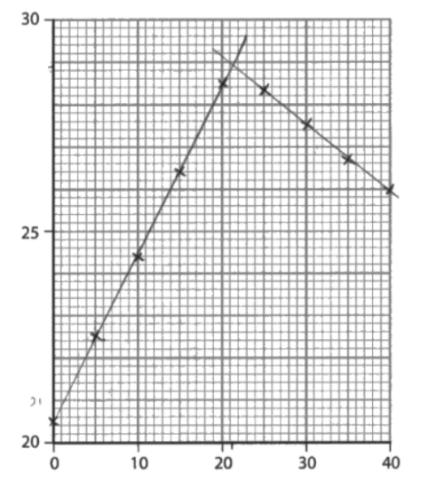
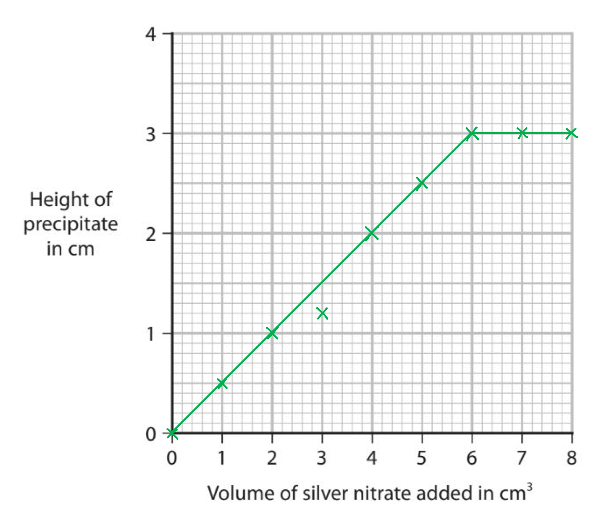

# Mark Schemes — Acids, Bases & Salt Preparations
**2. Inorganic Chemistry** · Edexcel IGCSE Chemistry 4CH1

## Q1 — hard — 6 marks

### 2 — 6 marks
> **[mark-scheme]**
> To make a dry sample of magnesium chloride from magnesium oxide:
> 
> Any **six** from (1 mark each):
> 
> - Add magnesium oxide (one spatula at a time) to hydrochloric acid
> - Until the magnesium oxide is in excess
> - Warm hydrochloric acid
> - Filter off the excess magnesium oxide
> - Heat / boil (the solution)
> - To evaporate some of the water
> - Leave / cool (to crystallise)
> - Pour off excess liquid 
> **OR** 
> Filter (to obtain crystals)
> - Suitable method of drying the crystals, such as blotting with filter paper / using a warm oven / leaving to dry **[6 marks]**

> **[exam-tip]**
> Salt preparation questions carry a lot of marks, so it's a good idea to:
> 
> - Review all the steps in the salt preparation practicals
> - Practice writing out all the details in the correct sequence.
> 
> Common mistakes include:
> 
> - Not stating that the base (magnesium oxide) is in excess.
> - Forgetting to filter the excess .
> 
>   - In the actual exam, both of these points can result in you being capped at 2 marks .
> - Boiling the solution to dryness / remove the water.
> 
>   - You must only heat the solution to evaporate *some* of the water (to the point of crystallisation) and then let it cool.
>   - In the actual exam, this can stop you gaining any of the last three marking points.
> - Washing the crystals, at the end, after boiling the solution.
> 
>   - Since they are soluble, washing them would cause them to redissolve.
>   - In the actual exam, this can stop you gaining any of the last two marking points.
> - Using hot ovens / bunsen burners to dry the crystals.
> 
>   - These methods remove the water of crystallisation and destroy the hydrated crystals.

## Q2 — medium — 6 marks

### 3(a) — 1 marks
**Correct answer: B** — precipitation

**Final answer:** **The correct answer is B**

- The reaction between two solutions to produce an insoluble solid, or precipitate, is precipitation

### 3(b) — 2 marks
Two more steps that will produce a pure, dry sample of silver chloride are:

- Wash the solid  / precipitate with water (to remove impurities);** [1 mark]** *Ignore deionised distilled*

Suitable method of drying solid 

Any **one** of the following

- Dry between filter papers; **[1 mark]**** **
- On paper towel; **[1 mark]**** **
- In an oven; **[1 mark]**** **
- In a desiccator; **[1 mark]**** **
*Allow 'warm oven' but do not award 'hot oven'*
*Do not allow references (direct or inferred) to silver chloride solution or crystallisation for M1 and M2*

**[Total: 2 marks]**

- *The solid needs washing using distilled water to remove any contaminants and can then be left to dry *
- *You should be able to describe methods to make both insoluble and soluble salts*
- *Other suitable methods for drying the solid which would gain you a mark are to leave it to dry in a warm place or leave it for the water to evaporate - just stating to 'dry it' will not gain you a mark*
- *You must not suggest a hot oven or another method of direct heating, e.g. using a Bunsen burner, as this could cause the solid to decompose further*

### 3(c) — 1 marks
Hydrochloric acid is not used to acidify silver nitrate solution because:

Any **one** from:

- (Hydrochloric acid/it) contains chloride ions; **[1 mark]**
- (Hydrochloric acid/it) produces a (white) precipitate with silver nitrate; **[1 mark]**
- (Hydrochloric acid/it) reacts with silver nitrate; **[1 mark]**

**[Total: 1 mark]**

- *Nitric acid is usually used to acidify silver nitrate solution as nitrates are soluble, therefore, it will not form a precipiate with any positive ions formed, and will not interfere with the results of the test*

### 3(d) — 2 marks
The maximum mass of silver chloride, in grams, that can be produced is:

- Moles of AgNO3 or AgCl = 0.0025; **[1 mark]**
- Mass AgCl = 0.0025 x 143.5 = 0.35(9)g; **[1 mark] ***Allow ECF from M1* *Allow one or more sig fig* *Correct answer without working scores 2 marks.*

**[Total: 2 marks]**

- *To calculate the moles of silver nitrate solution use concentration x volume*

  - *0.1 x (25/1000) = 0.0025 mol*
  - *Make sure you have converted the volume from cm**3** to dm**3** by dividing by 1000*
- *The molar ratio of silver nitrate to silver chloride is 1:1 so the moles of silver chloride produced are the same as the moles of silver nitrate used*
- *To calculate the mass of silver chloride, use number of moles x molar mass *

  - *0.0025 x 143.5 = 0.35 g*

## Q3 — medium — 1 marks

### 4 — 1 marks
**Correct answer: B** — It is insoluble in water

**Final answer:** **The correct answer is B**

To produce an insoluble salt, a precipitation reaction occurs

- This involves using two solutions to produce a precipitate
- Lead (II) carbonate is insoluble in water so does not form a solution and so cannot be used

## Q4 — hard — 11 marks

### 5 — 1 marks
**Correct answer: C** — Copper carbonate, copper and copper oxide

**Final answer:** **The correct answer is C**

- Don't let this question catch you out, all three can be used to make a copper salt:

  - Copper + nitric acid → copper nitrate + hydrogen
  - Copper carbonate + nitric acid  → copper nitrate + water + carbon dioxide
  - Copper oxide + nitric acid  → copper nitrate + water

### 5 — 2 marks
A balanced symbol equation for the reaction is:

MgO + 2HNO3 → Mg(NO3)2 + H2O

- Correct chemical formulae; **[1 mark]**
- Correctly balanced;  **[1 mark]**

**[Total: 2 marks]**

- *You are expected to know the chemical formula for magnesium oxide and nitric acid *
- *You should also know that a metal oxide reacts with an acid to form a salt and water  *
- *To deduce the formula of magnesium nitrate look at the ions it is formed from:*

  - *Mg**2+** and NO**3**–*
  - *When magnesium nitrate forms, the charges of the ions should cancel each other out*
  - *This means that you need two nitrate ions for every magnesium ion, which gives the formula Mg(NO**3**)**2*

### 5 — 3 marks
One  reason why each of the following steps were carried out is:

- Step b: To speed up the reaction;** [1 mark]**
- Step e: To make sure all of the acid reacts; **[1 mark]**
- Step f: To remove the excess magnesium oxide; **[1 mark]**

**[Total: 3 marks]**

- *You must be able to write this method yourself and explain why the steps are carried out *

### 5 — 3 marks
The mass of magnesium carbonate the student should react with dilute nitric acid to make 11.0 g of magnesium nitrate is:

- *M*r Mg(NO3)2 = 148 
**AND** 
*M*rof MgCO3 = 84; **[1 mark]**
- Moles of magnesium nitrate= `open parentheses 11 over 148 close parentheses` = 0.0743 mol; **[1 mark]**
- Mass of MgCO3=  (0.0743 x 84) = 6.24 g; **[1 mark]**

**[Total: 3 marks]**

- *Use the equation *$\frac{\mathrm{mass}}{\mathrm{molar} \mathrm{mass}}$* to find the number of moles of magnesium nitrate *
- *The molar ratio of magnesium carbonate to magnesium nitrate is 1:1 so the moles of each substance is equal *
- *Use moles x molar mass to calculate the mass of magnesium carbonate needed *

### 5 — 2 marks
The mass of magnesium nitrate the student actually produced is:

- $\frac{76.3}{100}\times11$; **[1 mark]**
- = 8.39 g; **[1 mark]**

**[Total: 2 marks]**

- *To find the percentage  yield the following equation is used: *$\frac{\mathrm{actual} \mathrm{yield}}{\mathrm{theoretical} \mathrm{yield}}\times100$
- *This can be rearranged to give the answer above *

## Q5 — medium — 9 marks

### 8(a) — 4 marks
i) A word equation for this neutralisation reaction is:

- sodium hydroxide + nitric acid → sodium nitrate + water
**OR**
NaOH + HNO3 → NaNO3 + H2O; **[1 mark] **

ii) A polystyrene cup is used rather than a beaker because:

- Polystyrene is an insulator / poor conductor of heat; **[1 mark]**
- No / less heat is lost (to the surroundings)
**OR**
Polystyrene retains more heat; **[1 mark]**

*Reverse arguments for a glass beaker are acceptd*

iii) A safety precaution that the student should take when using sodium hydroxide solution is:

- Wear eye protection / (safety) goggles / safety glasses
**OR**
Wear gloves; **[1 mark]**

**[Total: 4 marks]**

- *You should know that sodium hydroxide is an alkali therefore the reaction will obey the general equation:*

  - *acid + alkali → salt + water*
- *The salt formed will take the first part of the name from the metal ion in the alkali (sodium) and the second part from the acid used (nitric acid which forms a nitrate)*

> **[exam-tip]**
> For a 2-mark 'explain' question, make two separate points rather than one vague combined phrase

### 8(b) — 5 marks
i) The results and lines of best fit should be drawn as follows:

- All points plotted correctly to +/– half a square; **[1 mark]**
- First best fit line drawn with a ruler;** [1 mark]**
- Second best fit line drawn with a ruler; **[1 mark] ***Award max 1 mark if ruler not used for both* *Do not penalise if two lines do not cross*

ii) Using the graph, the values of volume of acid and maximum temperature are:

- Volume reading read from graph +/– 0.5 (cm3); **[1 mark]**
- Temperature reading read from graph +/– 0.1 (°C);** [1 mark]** *Award 1 mark if values correct but reversed* *If lines do not meet or cross or a curve is drawn between the  lines 0 marks for (ii)*

**[Total: 5 marks]**

- *Always draw straight lines of a graph with a ruler and make sure you follow the instructions given in the question*
- *To find the volume of acid used and the maximum temperature, you should read the temperature and volume of acid values where the two lines intersect*
- *From the graph given in the mark scheme, accepted values would be:*

  - *Volume of acid: 21 to 22 cm**3*
  - *Maximum temperature: 28.8 to 29.0 °C*

## Q6 — easy — 1 marks

### 7 — 1 marks
**Correct answer: A** — aq, aq, s, aq

**Final answer:** **The correct answer is A**

- Lead(II) sulfate is an insoluble salt (and therefore has the state symbol, s) formed from two soluble salts (which therefore have the state symbol, aq)
- The second product sodium nitrate is also soluble so has the state symbol, aq
- The lead(II) sulfate can be removed from the mixture by filtration

## Q7 — hard — 7 marks

### 7 — 2 marks
You could obtain a neutral solution of lithium chloride which does not contain an indicator by:

Any **one **of the following pairs:

Pair 1:

- Repeat experiment without indicator;** [1 mark]**
- Using the same quantity / volume of acid;** [1 mark]**

Pair 2:

- Add carbon / activated charcoal; **[1 mark]**
- Filter; **[1 mark]**

**[Total: 2 marks]**

- *If you add activated charcoal to a mixture of indicator and solution and swirl it, the mixture will become colourless because the activated charcoal absorbs the indicator*

  - *You are not required to know this but it is sometimes an acceptable answer given in mark schemes*
- *Alternatively, you know the required amount of acid needed for the reaction from the titration*
- *This means you can just repeat the experiment without indicator using the correct amount of acid deduced from performing the titration*

### 8 — 1 marks
The ionic equation, including state symbols, for neutralisation is:

- H+ (aq) + OH– (aq) → H2O (l); **[1 mark]**

**[Total: 1 mark]**

- *A common mistake for this question is to write the overall equation for the reaction to show neutralisation*

  - *However, the question only asks for the **ionic **equation of neutralisation*
- *As it is for one mark, failing to include the state symbols would cost you the mark in an exam*

### 8 — 2 marks
A pipette is used to measure the sodium hydroxide solution but a burette is used to measure the citric acid solution because:

- Pipette measures one fixed volume (accurately);** [1 mark]**
- (But) burette measures variable volumes (accurately); **[1 mark]**

**[Total: 2 marks]**

- *As shown in the diagram, 25 cm**3** of lithium hydroxide has been added to the conical flask *

  - *A pipette will measure this exact amount*

### 7 — 2 marks
The concentration of aqueous lithium hydroxide can be calculated as follows:

- Number of moles of HCl = 0.020 x 2.20 = 0.044 
**AND **
Number of moles of LiOH = 0.044;** [1 mark]**

- Concentration of LiOH = 0.044 / 0.025 = 1.76 (mol / dm3); **[1 mark]**

**[Total: 2 marks]**

- *You can score 2 marks for a correct answer with no working out*
- *You first need to calculate the number of moles of HCl using the formula*

  - *concentration (mol / dm**3** ) = *$\frac{\mathrm{moles}(\mathrm{mol})}{\mathrm{volume}(\mathrm{dm}^{3})}$
- *You can then use the molar ratio of HCl: LiOH to find the moles of LiOH*

  - *1:1*
- *You can then use the same equation to find the concentration of LiOH using the moles calculated and the volume given in the question*
- *Always make sure your units are consistent e.g. both concentration and volume use dm**3*
- *To convert cm**3** to dm**3** divide by 1000*

## Q8 — easy — 5 marks

### 1(a) — 4 marks
The names of the pieces of apparatus are:

- A: test tube / boiling tube; **[1 mark]**
- B: evaporating basin / dish; **[1 mark]**
- C: measuring cylinder; **[1 mark]**
- D: (top-pan) balance / measuring balance; **[1 mark]**

**[Total: 4 marks]**

- *You need to know the names of pieces of equipment that are commonly used in practicals*

### 1(b) — 1 marks
**Correct answer: C** — 

**Final answer:** **The correct answer is C**

- A is incorrect as a test tube cannot measure a volume of liquid
- B is incorrect as an evaporating basin cannot measure the volume of liquid
- D is incorrect as a balance measures mass, not volume

## Q9 — hard — 15 marks

### 10(a) — 2 marks
i)  The name given to this type of reaction is:

- Neutralisation; **[1 mark]**

ii)  In terms of protons, what happens in this reaction is:

- An acid donates (a) proton(s) 
**OR**
** **A base accepts proton(s); **[1 mark]**

**[Total: 2 marks]**

- *You could have 'acid-base' as the type of reaction, but it's better to use the more precise term*
- *Saying that the metal oxide accepts the protons would also score you the mark*

### 10(b) — 8 marks
i)  The method that the student should use to prepare a saturated solution of copper(II) sulfate is:

- The appropriate use of at least three named pieces of apparatus; **[1 mark]**

**AND *****four**** from: *

- Add copper(II) carbonate to (dilute sulfuric) acid (a spatula / little at a time and stir after each addition); **[1 mark]**
- Until no more effervescence / bubbling takes place; **[1 mark]**
- Filter (to remove excess copper(II)carbonate to obtain copper(II) sulfate solution;** [1 mark]**
- Heat/warm filtrate/(copper(II) sulfate) solution until crystals start to appear (solution saturated); **[1 mark]**
- Filter to obtain (the saturated) solution; **[1 mark]**

ii)  The student’s percentage yield is:

- Calculation of actual mass of crystals obtained; **[1 mark]**
- Division by expected mass of crystals (6.4) and multiplication by 100 to convert to percentage; **[1 mark]**
- Correct answer to 1 decimal place; **[1 mark]**

*Example calculation*

- 6.40 – 1.80 =  4.60 g;

  - Percentage yield = $\frac{4.60}{6.40}$ x 100 **OR** 71.875%;
  - Answer  to 1 dp = 71.9%

**[Total: 8 marks]**

- *Suitable apparatus for the preparation of a soluble salt includes: beaker, filter funnel, evaporating basin, filter paper, glass rod*
- *Another way to tell if the reaction is complete is to look for an excess of the copper(II)carbonate at the bottom of the beaker*
- *Remember the question is asking you to prepare the saturated solution, not the salt crystals, so there is no need to go on and evaporate the solution*
- *The way to test is to dip a cold glass rod in the hot solution and if crystals form on cooling you know the solution is saturated*

### 10(c) — 5 marks
i) The value of x in CaSO4.xH2O

- Find percentage of water; **[1 mark]**
- Divide each percentage by *M**r* to find number of moles;  **[1 mark]**
- Divide each answer by smallest to find ratio;  **[1 mark]**

*Expected calculation:*

|   | CaSO4 | H2O |
|---|---|---|
| Find the % | 79% | 100-79= 21% |
| Divide by the *M**r* | $\frac{79}{136}=0.58$ | $\frac{21}{18}=1.17$ |
| Divide by the smallest | $\frac{0.58}{0.58}$=1 | $\frac{1.17}{0.58}$= 2 |
|   | x = 2 |   |

ii)  A test for calcium ions in the sample of gypsum.

- Carry out a flame test; **[1 mark]**
- There should be an orange-red flame; **[1 mark]**

**[Total: 5  marks]**

- *You don't have to describe the details how to carry out a flame test, justify identify it as the right test*
- *Sometimes the colour of a calcium flame is described as brick-red*

## Q10 — easy — 4 marks

### 11 — 1 marks
**Correct answer: A** — H+

**Final answer:** **The correct answer is A**

- Hydrogen ions, H+ are found in all acidic solutions
- Hydroxide ions, OH-, are found in all alkaline solutions

### 11 — 1 marks
**Correct answer: C** — Copper(II) sulfate

**Final answer:** **The correct answer is C**

- The following acids form the following salts:

  - Sulfuric acid → sulfates
  - Nitric acid  → nitrates
  - Hydrochloric acid  → chlorides
- The salts formed by citric acid are not covered in this specification

### 11 — 1 marks
The steps in the correct order are:

| ** first step** |   |   |   | **last step** |
|---|---|---|---|---|
| **M** | **L** | **K** | **N** | **J** |

- Correct order; **[1 mark]**

**[Total: 1 mark]**

- *This is one of the practicals you are required to know, including writing a method and explaining why each step is carried out*
- *You could be asked for the method of a different soluble salt, but the method will be the same providing one of the reactants is insoluble*

### 11 — 1 marks
Copper(II) oxide was added in excess:

- To ensure all the acid has reacted 
**OR** 
To ensure neutralisation has occurred; **[1 mark]**

**[Total: 1 mark]**

- *If the acid was not neutralised, it would become very concentrated during the evaporation process which can be dangerous*

## Q11 — easy — 1 marks

### 12 — 1 marks
**Correct answer: C** — As a proton acceptor

**Final answer:** **The correct answer is C**

- Acids contain hydrogen ions, H+
- Hydrogen ions are the same as protons
- During neutralisation acids donate protons and the base it is reacting with accepts them

## Q12 — easy — 1 marks

### 13 — 1 marks
**Correct answer: C** — Reason: to ensure all the acid reacts
Step 3: filtration

**Final answer:** **The correct answer is C**

- Neutralisation needs to occur and for this the acid needs to have fully reacted with the base
- To remove the unreacted copper carbonate, the solution should be filtered as filtration separates a solid and a liquid

## Q13 — medium — 13 marks

### 6(a) — 1 marks
A suitable piece of apparatus that the student should use to measure 25.0 cm3 of sodium hydroxide solution is:

- A pipette; **[1 mark]**

**[Total: 1 mark]**

- *Using a burette is not as practical as using a pipette; the assumption is that the pipette is glass and specific for the volume or is a volumetric pipette equivalent to a small burette*
- *Using a measuring cylinder does not give the required precision needed for the experiment, so is not appropriate*

### 6(b) — 3 marks
i) The colour of the phenolphthalein indicator in sodium hydroxide solution and in hydrochloric acid is:

- Colour in NaOH: pink / magenta / red; **[1 mark]**
- Colour in HCl: colourless / no colour; **[1 mark]**

ii) Universal indicator is never used in a titration because:

- There is no clear (colour change at the) endpoint 
**OR**
** **It is difficult to determine which shade of green is pH 7 
**OR**
** **It has a wide range of colours possible; **[1 mark]**

**[Total: 3 marks]**

- *You need to recall the colour changes of litmus, phenolphthalein and methyl orange in acids and alkalis*
- *Universal indicator is actually a mixture of a number of different indicators, so has a spectrum of colours that means that 'turning blue' or 'yellow' does not have a clear turning point that would not be subjective for those watching for it, so it should not be used as an indicator for titrations*

### 6(c) — 6 marks
i) In order to prepare a pure solution of sodium chloride, the student should:

Any pair from:

Pair 1:

- Add 21.5 cm3 of hydrochloric acid;** [1 mark]**
- To 25 cm3 of sodium hydroxide solution; **[1 mark]** *Allow 'repeat the titration without an indicator' for 1 mark only*

Pair 2:

- Add activated charcoal (to absorb the indicator); **[1 mark]**
- Filter (to remove the activated charcoal and indicator); **[1 mark]**

ii) To obtain dry crystals of sodium chloride from the pure sodium chloride solution, the student should:

- Heat the solution to evaporate some of the water 
**OR **
Heat the solution to form a saturated solution / to crystallisation point; **[1 mark]**
- Leave the solution to cool 
**OR**
** **Leave the solution for (more) crystals to form; **[1 mark]**
- Filter off the crystals; **[1 mark]**
- A suitable method of drying the crystals, e.g. warm oven; **[1 mark]**

**[Total: 6 marks]**

- *The common method for a pure salt (without indicator) would be to replicate the titration using the volumes that have been deduced earlier, but the alternative method is valid and so is creditworthy too!*
- *The method for preparing a sample of a soluble salt is required knowledge, so you are not expected to deduce these steps but to know them (and ideally have carried them out where possible)*

### 6(d) — 3 marks
The concentration, in mol / dm3, of the hydrochloric acid is:

- Moles of NaOH = 0.0250 x 0.800 
**OR**
** **Moles of NaOH = 0.02(00); **[1 mark]**
- Concentration = $\frac{0.02}{0.0215}$ 
**OR**
** **Concentration = $\frac{\mathrm{Moles} \mathrm{calculated}}{0.0215}$; **[1 mark]**
- Answer = 0.930 
**OR**
** **Error carried forward from the first parts to more than 1 significant figure; **[1 mark]**

**[Total: 3 marks]**

- *Make sure you convert volume to be in dm**3** not cm**3**, which means dividing by 1000*
- *Show workings; you get error carried forwards from any incorrect moles calculation in the first part*

## Q14 — medium — 1 marks

### 15 — 1 marks
**Correct answer: B** — calcium carbonate + nitric acid → calcium nitrate + carbon dioxide

**Final answer:** **The correct answer is B**

- When a metal carbonate and acid react, in addition to a salt and carbon dioxide, water is also formed

calcium carbonate + nitric acid → calcium nitrate + carbon dioxide + water

## Q15 — medium — 14 marks

### 7(a) — 8 marks
i) The formula of each ion in magnesium nitrate are:

- Mg2+; **[1 mark]**
- NO3-; **[1 mark]**
*+ and - charges must be written*

ii) A method that she could use to prepare a pure, dry sample of magnesium nitrate crystals from magnesium oxide is:

**Part 1**:** **making magnesium nitrate solution - a description linking any **three **of the following points

- Warm / heat the acid (in a beaker / flask); **[1 mark]** *Do not allow boil*
- Add magnesium oxide (to acid a little at a time) until in excess / no more dissolves; **[1 mark]**
- Stir; **[1 mark]** *This mark is dependent on the use of acid and oxide*
- Filter to remove excess magnesium oxide / excess solid;** [1 mark]**
*A maximum of three points is allowed for this section*

**Part 2**: using (magnesium nitrate) solution / filtrate - a description linking any **three **of the following points:

- Heat / boil (magnesium nitrate solution / filtrate); **[1 mark]**
- Until crystals form in a cooled sample / on glass rod / to crystallisation point; **[1 mark]**
- Leave the solution to cool / crystallise;** [1 mark]**
- Filter /decant the solution (to remove crystals); **[1 mark]**
- Suitable method to dry the crystals e.g. using filter paper / using paper towel / in warm oven / in a desiccator;** [1 mark] ***Do not allow hot oven or any method of direct heating e.g. Bunsen* *Allow leave to dry but not just dry the crystals* *A maximum of three points is allowed for this section*

**[Total: 8 marks]**

- *Magnesium is in Group 2 so will form ions with a 2+ charge*
- *Nitrate is a molecular / compound ion that you should know the charge for*
- *The method to prepare a salt depends on the solubility of the reactants and product*

  - *When one reactant is insoluble, filtration and crystallisation are used*
  - *If both reactants and salt are soluble, then titration should be used*
  - *If the salt produced is insoluble, it can be prepared using a precipitation reaction*
- *You should know how to perform all of these methods and recognise which method should be used *

### 7(b) — 6 marks
i) The relative formula mass of Mg(NO3)2.6H2O is 256 because:

- 24 + (2 x 14) + (6 x 16) + (12 x 1) + (6 x 16) or 24 + 124 + 108 or equivalent working;** [1 mark]** *Some working must be seen*

ii) The maximum mass of Mg(NO3)2.6H2O that could be made from 0.050 mol of nitric acid is about 6 g because:

- Calculate moles of magnesium nitrate: moles = (0.05 / 2) **OR **0.025; **[1 mark]**
- Setting out of calculation of mass: mass = 0.025 x 256; **[1 mark]**
- Final answer: 6.4 (g); **[1 mark]** *6.4(g) with no working scores 3* *Only allow ECF M2 from M1*

iii) The percentage yield of Mg(NO3)2.6H2O in this experiment is:

- Setting out of calculation: $\mathrm{percentage} \mathrm{yield}=\frac{\mathrm{actual} \mathrm{yield}}{\mathrm{predicted} \mathrm{yield}}\times100=\frac{4.8}{6.4}\times100$; [1 mark]
- Final answer: 75 (%);** [1 mark]** *75 (%) with or without working scores 2 marks*

**OR**

- $\frac{4.8}{6}\times100$; **[1 mark]**
- 80 (%);** [1 mark] ***80 (%) with or without working scores 2 marks*

**[Total: 6 marks]**

- *When calculating the mass of magnesium nitrate that could be made from 0.050 mol nitric acid, you need to use the balanced equation to work out how many moles of magnesium nitrate are produced from 0.050 mol of nitric acid*
- *The equation shows that for every 2 moles of nitric acid used, 1 mole of magnesium nitrate are produced*

  - *Therefore 0.05 moles of nitric acid produces 0.050/2 = 0.025 moles of magnesium nitrate*
- *Take care when calculating percentage yield, if you obtain a value of more than 100%, you must have made an error!*
- *The most common error is to divide the predicted yield by the actual yield instead of the other way around; you will not score any marks if you do this*
- *You would be credited with 1 mark if you obtained an answer of 20 or 25%*

## Q16 — hard — 15 marks

### 7(a) — 3 marks
i) The word equation for this reaction is:

- calcium + water  → calcium hydroxide + hydrogen; **[1 mark]**

ii) Two observations that would be made during this reaction

Any **two** from:

- Effervescence / fizzing / bubbles; **[1 mark]**
- Calcium / metal / solid disappears / becomes smaller; **[1 mark]  **
*ignore gas given off* *allow calcium / metal / solid dissolves*
- Test tube / beaker feels warm / hot; **[1 mark]**

**[Total: 3 marks]**

- *You may not have learned about Group 2 metals specifically but they react in a very similar way to Group 1 metals so use your knowledge of their reactions to help answer this question*

### 7(b) — 7 marks
i) a pure, dry sample of the insoluble salt, barium sulfate, could be made from the two solids sodium sulfate and barium chloride by:

- Dissolve each of the solids in water / make a solution of each of the solids; **[1 mark]**
- Mix / add (the two solutions together); **[1 mark]**
- Filter (the mixture); **[1 mark]**
- Wash the precipitate / solid  / barium sulfate / salt / residue (with water); **[1 mark]**
- Suitable method of drying the solid; **[1 mark]**

ii) The ionic equation is:

Ba2+(aq) + SO42- (aq) → BaSO4(s)

- All formulae correct; **[1 mark]**
- State symbols correct; **[1 mark] ***Allow correct state symbols even if formulae incorrect *

**[Total: 7 marks]**

- *You must be able to describe a method to make both soluble and insoluble salts*
- *An ionic equation shows the ions involved in a chemical reaction *
- *In this example, barium and sulfate ions from two separate salt solutions react to form barium sulfate*
- *Aq is used for aqueous solutions where there is one substance dissolved in water- in this case the two reacting salts *
- *The two soluble salts are used to form a precipitate, which is a solid, so (s) is used for the product*

### 7(c) — 5 marks
i) The name for this type of reaction is:

- C- decomposition; **[1 mark]**

ii) The total volume, in dm3, of gas produced at rtp when 7.7 g of magnesium nitrate completely reacts is:

- Calculate the amount, in moles, of magnesium nitrate; **[1 mark]**
- Use the equation to find the total amount, in moles, of gas produced; **[1 mark]**
- Multiply this amount by 24; **[1 mark]**
- Answer given to two significant figures; **[1 mark]**

**[Total: 5 marks]**

- *When there is only one arrow it can be assumed that the substance has been heated to very high temperatures and broken down as a result*

  - *A is incorrect as it is not an addition reaction*
  - *B is incorrect as oxygen is not a reactant*
  - *D is incorrect as nothing is neutralised here*
- *An example calculation for part ii) is:*

  - *Moles of magnesium nitrate = 7.7 ÷ 148 or 0.052 (mol)*
  - *Moles of (gas) = 5 x 0.052 ÷ 2 or 0.13 (mol)*
  - *Total volume of gas = 0.13 x 24 or 3.12*
  - *3.1 (dm**3**)*
- *Moles of magnesium nitrate are found using *$\frac{\mathrm{mass}}{\mathrm{molar} \mathrm{mass}}$*  *

  - *7.7 ÷ 148 = 0.052 mol*
- *There are two moles of magnesium nitrate present, but five moles of gas produced in total*

  - *(0.052 *$\div$*2) x 5 = 0.13 mol*

- *One mole of gas occupies 24 dm**3** so multiply the number of moles by 24*

  - *0.13 x 24 = 3.1 dm**3*

## Q17 — hard — 15 marks

### 6(a) — 4 marks
A student could prepare a pure, dry sample of silver chloride starting with copper(II) chloride solution and silver nitrate solution by:

- Mix / stir / add (silver nitrate and copper(II) chloride); **[1 mark]**
- Filter (the silver chloride); **[1 mark]**
- Wash with (deionised / distilled) water; **[1 mark]**
- Dry in a warm oven / dry with filter paper / leave / allow to dry (on a windowsill) / dry in a desiccator;** [1 mark]**

**[Total: 4 marks]**

- *Silver chloride is an insoluble salt, so it can be prepared by using a precipitation reaction, starting with two soluble reactants*
- *Careful**: When describing how to produce a dry sample, do not mention evaporation to form crystals as this is only applicable to a soluble salt - you would be awarded a maximum of 1 mark if you mention this*
- *It is important to know the 4 steps, so ensure you learn them*
- *The sample shouldn't be dried using a Bunsen burner as this can cause the salt to decompose*

### 6(b) — 5 marks
i) The student's results plotted:

- All points correctly plotted to ± half a square; **[2 marks] ***Deduct 1 mark for every incorrect point*

ii) Two lines of best fit:

- Two straight lines of best fit which must meet at 3 cm and 6 cm3; **[1 mark]**

iii) A possible mistake that the student made to cause the anomalous result is:

Any **one** from:

- The precipitate wasn’t left to settle (for long enough) / the height was measured too early; **[1 mark]**
- The tube was on a slant; **[1 mark]**
- There was not enough / less than 3.0 cm3 of silver nitrate added; [1 mark]

iv) A reason why the last three heights are the same is:

- All the copper(II) chloride has reacted 
**OR**
 The silver nitrate is in excess / not all reacted; **[1 mark]**

**[Total: 5 marks]**

- *The most common mistake when drawing graphs is to use the scale incorrectly*
- *Make sure that you find what the intervals on both axes are*

  - *In this case, on the x-axis, each smaller square represents 0.2 cm3*
  - *On the y-axis, each smaller square represents 0.1 cm*
- *When drawing a line of best fit:*

  - *Ignore any anomalous points, if any*
  - *Try to get as many points on the line as possible, and, for those that don't fit on the line, an equal number of points above and below the line*
  - *Use a ruler for straight lines of best fit*

### 6(c) — 6 marks
i) A piece of apparatus suitable for measuring 25.0 cm3 of copper(II) chloride solution is:

- Burette 
**OR** 
(Volumetric) pipette; [1 mark]

ii) The maximum mass, in grams, of silver chloride that could be produced is;

- Moles of copper chloride = (25 x 0.50) ÷ 1000 
**OR** 
0.0125 moles; **[1 mark]**
- Moles of silver chloride = (0.0125 x 2 =) 0.0250; **[1 mark]**
- Mass of silver chloride = (moles x *M*r = 0.0250 x 143.5 =) 3.59 g; **[1 mark]**

iii) The percentage yield is:

- (= $\frac{\mathrm{actual} \mathrm{yield}}{\mathrm{predicted} \mathrm{yield}}\times100$) = (0.744 ÷ 0.850) × 100; **[1 mark]**
- 87.5(%);** [1 mark]**

**[Total: 6 marks]**

- *A volumetric pipette is the most suitable piece of apparatus for measuring a fixed volume accurately*
- *A burette is most suitable to measure varying volumes*
- *A measuring cylinder is suitable for measuring approximate volumes*

  - *Whilst you would have been awarded the mark in part (i) if you had stated measuring cylinder, this is not always an acceptable answer when volumes need to be measured accurately*
- *To find the moles of copper(II) chloride use the equation: moles = volume (in dm**3**) x concentration*

  - *The volume needs to be in dm**3** so you must divide the volume in cm**3** by 1000*
- *The balanced symbol equation shows that for every 1 mole of copper(II) chloride used, 2 moles of silver chloride are produced*

  - *Therefore, 0.0125 moles of copper(II) chloride will produce 0.0125 x 2 = 0.0250 moles of silver chloride*
- *Remember**: Percentage yield must be less than 100%, if it isn't check that you haven't divided the predicted yield by the actual yield*
- *Make sure you show your workings clearly as you would be allowed an error carried forward if you make a mistake, meaning that you are not penalised more than once for an error*
