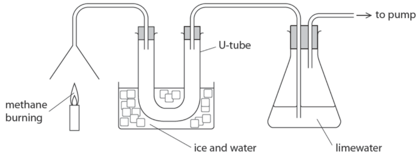
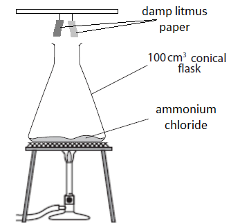
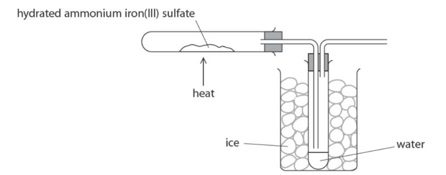

# Exam Questions — Chemical Tests
**2. Inorganic Chemistry** · Edexcel IGCSE Chemistry 4CH1
> Source: [https://www.savemyexams.com/igcse/chemistry/edexcel/19/topic-questions/2-inorganic-chemistry/2-8-chemical-tests/exam-questions/](https://www.savemyexams.com/igcse/chemistry/edexcel/19/topic-questions/2-inorganic-chemistry/2-8-chemical-tests/exam-questions/) · 16 questions · total 95 marks

## Q1 — hard — 8 marks

### 2 — 3 marks — command: show — structured
The table gives some information about manganese and its compounds.

| Compound | Formula | Appearance |
|---|---|---|
| manganese(II) oxide | MnO | green crystals |
| manganese(IV) oxide | MnO2 | black powder |
| manganese(III) oxide | Mn2O3 | brown-black powder |

A sample of one of the oxides of manganese contains 63.2 % manganese and 36.8 % oxygen by mass.

Show by calculation that the sample is manganese(IV) oxide, MnO2.

[*A**r* of Mn = 55; *A**r* of O = 16]

### 2 — 5 marks — command: multiple — structured
When MnO2 is added to a solution of hydrogen peroxide, a gas is formed that relights a glowing splint

i) Identify the gas.

[1]

Another product of the reaction is water.

ii) Describe a chemical test for water.

[2]

iii) Describe a physical test to show whether a sample of the product is pure water.

[2]

## Q2 — medium — 9 marks

### 11(a) — 2 marks — command: calculate — structured — from paper 2019 · Ju1C
The gas burned in a Bunsen burner is methane.

The equation for the complete combustion of methane is

CH4 (g) + 2O2 (g) → CO2 (g) + 2H2O (g)

Calculate the mass of oxygen required to react with 32 g of methane.

[*M*r of methane = 16]

mass of oxygen = .............................. g

### 11(b) — 7 marks — command: multiple — structured — from paper 2019 · Ju1C
The diagram shows methane burning in air. It also shows how the two gases formed are collected and tested.

i) Explain why water collects in the U-tube.

(2)

ii) Describe how anhydrous copper(II) sulfate is used to test for water.

(2)

iii) Explain the change in the appearance of the limewater.

(3)

## Q3 — easy — 1 marks

### 4 — 1 mark — multiple_choice
A student adds a few drops of dilute nitric acid followed by a few drops of silver nitrate solution to a test tube containing an unknown colourless solution. A white precipitate is seen.

What ions could be present in the solution?
- **A.** Ammonium ions
- **B.** Chloride ions
- **C.** Sulfate ions
- **D.** Magnesium ions

## Q4 — easy — 1 marks

### 5 — 1 mark — multiple_choice
A solution containing carbonate ions, CO32-, can be reacted with hydrochloric acid, HCl, and a gaseous product collected and tested.

Which is a correct positive test result for a product of this reaction?
- **A.** A gas is produced which causes cloudiness in limewater
- **B.** A gas is produced which makes a squeaky pop sound when a lit splint is introduced
- **C.** A gas is produced which bleaches damp litmus paper
- **D.** A gas is produced which re-ignites a glowing splint

## Q5 — hard — 6 marks

### 4 — 6 marks — command: describe — structured — from paper 2017 · Specimen2C
A technician finds a white solid in an unlabelled beaker. She knows that the solid is one of the following substances:

- potassium chloride
- potassium sulfate
- sodium chloride
- sodium sulfate.

Describe how the technician can use chemical tests to identify the solid in the beaker.

## Q6 — medium — 13 marks

### 6(a) — 4 marks — command: multiple — structured — from paper 2020 · Nov1CR
This question is about elements in Group 7 of the Periodic Table and their compounds.

i) Give the name of this group of elements.

(1)

ii) State the colour of chlorine gas.

(1)

iii) Give a test for chlorine gas.

(2)

### 5(b) — 3 marks — command: give — structured — from paper 2020 · Nov1CR
Give a test to show that a solution contains iodide ions.

Test

Result

### 5(c) — 6 marks — command: explain — structured — from paper 2020 · Nov1CR
A student compares the reactivity of the elements bromine, chlorine and iodine. He mixes these pairs of solutions and observes the reactions that occur.

- chlorine solution and potassium bromide solution
- bromine solution and potassium iodide solution

Explain how the reactions can be used to show the order of reactivity of the three elements. Include the colour change that the student would observe in each reaction.

## Q7 — hard — 11 marks

### 8 — 3 marks — command: multiple — structured
This question is about ammonium compounds.

The table shows the names and formulae of some ammonium compounds.

| **Name** | Ammonium nitrate | Ammonium carbonate |   |
|---|---|---|---|
| **Formula** | NH4NO3 |   | NH4Cl |

i) Complete the table by giving the missing information.

(2)

ii) When ammonia reacts with nitric acid, ammonium nitrate is formed.

Write a chemical equation for this reaction.

(1)

### 8 — 3 marks — command: describe — structured
When ammonium chloride is heated, it undergoes thermal decomposition to form two gaseous products.

Describe the result of testing each product with damp universal indicator paper.

### 8 — 4 marks — command: multiple — structured
The diagram shows the apparatus used to heat ammonium chloride.

i) Suggest why the damp litmus paper is two different colours.

(1)

ii) Explain what happens to the damp litmus paper as the ammonium chloride is heated.

(3)

### 8 — 1 mark — command: explain — structured
Explain why a fine white powder formed on the inside of the neck of the conical flask in part (c).

## Q8 — medium — 1 marks

### 9 — 1 mark — multiple_choice
Ammonium ions, NH4+, in a solution can be identified by a chemical test.

Which statement is **incorrect** about the test for the ammonium ion, NH4+?
- **A.** Add sodium hydroxide solution
- **B.** A positive test produces a pungent-smelling gas
- **C.** Use dry red litmus paper to test the gas produced
- **D.** The litmus paper should turn blue if NH4+ ions were present

## Q9 — hard — 8 marks

### 9(a) — 2 marks — command: give — structured — from paper 2022 · Jan1CR
A student is given a mixture of two white solid compounds, and a colourless solution containing the same two compounds.

The student is told that one of the compounds is a halide and that the other compound is a carbonate.

Give two reasons why the student should know, without doing any tests, that one of the compounds cannot be copper(II) carbonate.

### 9(b) — 6 marks — command: describe — structured — from paper 2022 · Jan1CR
Describe tests the student could do to show that the mixture contains potassium carbonate and potassium iodide.

## Q10 — hard — 10 marks

### 8(a) — 6 marks — command: describe — structured — from paper 2021 · Ju1C
A scientist finds an unlabelled bottle on a shelf.

She thinks the bottle contains a solution of ammonium sulfate, (NH4)2SO4

Describe tests the scientist could do to show that the solution is ammonium sulfate.

### 8(b) — 4 marks — command: multiple — structured — from paper 2021 · Ju1C
Ammonium sulfate is often used as a fertiliser.

It is prepared by reacting ammonia (NH3) with sulfuric acid (H2SO4).

i) Name the type of reaction that occurs between ammonia and sulfuric acid.

(1)

ii) Write a chemical equation for the reaction of ammonia with sulfuric acid.

(1)

iii) Draw a dot‐and‐cross diagram to show the bonding in a molecule of ammonia.

Show outer electrons only.

(2)

## Q11 — medium — 9 marks

### 6(a) — 3 marks — command: complete — structured — from paper 2021 · Ja1C
This question is about salts.

When solutions of salts are mixed together, precipitates sometimes form. The insoluble salt barium carbonate forms as a precipitate when solutions of the soluble salts ammonium carbonate and barium chloride react together. When solutions of the soluble salts potassium chloride and magnesium sulfate are mixed, no precipitate forms. Complete the table to show the results of mixing solutions of some soluble salts.

|   | **ammonium carbonate solution** | **magnesium sulfate solution** |
|---|---|---|
| **barium chloride solution** | precipitate of barium carbonate |   |
| **potassium chloride solution** |   | no precipitate |
| **calcium chloride solution** |   | precipitate of calcium sulfate |

### 6(b) — 6 marks — command: describe — structured — from paper 2021 · Ja1C
A student has four unlabelled beakers, each containing a colourless solution of a different salt. The four solutions are

- potassium carbonate
- potassium chloride
- potassium iodide
- sodium chloride

Describe a method to identify each solution. Do not refer to safety in your answer.

## Q12 — easy — 1 marks

### 13 — 1 mark — multiple_choice
Which statement is **incorrect** about testing a sample of suspected pure water?
- **A.** Anhydrous copper(II) sulfate would turn blue when the solution was added
- **B.** The resulting hydrated copper(II) sulfate would have the chemical formula CuSO4.H2O
- **C.** The boiling point should be 100 oC
- **D.** The boiling point should be sharp, not gradual

## Q13 — easy — 6 marks

### 3(a) — 1 mark — command: give — structured — from paper 2019 · Ju1C
A student does these two tests on a solution made from a white solid.

- flame test
- add acidified silver nitrate solution

The table shows his results.

| **Test** | **Result** |
|---|---|
| flame test | red flame |
| add acidified silver nitrate solution | cream precipitate |

Give the formula of the ion that produces the red flame.

### 3(b) — 1 mark — command: name — structured — from paper 2019 · Ju1C
Name the cream precipitate.

### 3(c) — 1 mark — command: identify — structured — from paper 2019 · Ju1C
Identify the white solid.

### 3(d) — 3 marks — command: multiple — structured — from paper 2019 · Ju1C
The student uses a clean metal wire in the flame test.

i) State why the wire should be clean when used in the flame test.

(1)

ii) The table lists properties of some metals.

Add ticks (✔) to the table to show the two properties needed in a metal wire used in a flame test.

(2)

| **Property** |   |
|---|---|
| good conductor of electricity |   |
| high density |   |
| high melting point |   |
| unreactive |   |

## Q14 — easy — 1 marks

### 15 — 1 mark — multiple_choice
Scientists test a solution of compound X. The table shows their results.

| **Test** | **Result** |
|---|---|
| Acidified silver nitrate solution | White precipitate |
| Add sodium hydroxide solution | Green precipitate |

Which **two** ions are present in compound X?

| ☐ | **A** | Fe3+ and Cl- |
|---|---|---|
| ☐ | **B** | Fe3+ and SO42- |
| ☐ | **C** | Fe2+ and Cl- |
| ☐ | **D** | Fe2+ and SO42- |
- **A.** Fe3+ and Cl-
- **B.** Fe3+ and SO42-
- **C.** Fe2+ and Cl-
- **D.** Fe2+ and SO42-

## Q15 — hard — 9 marks

### 15(a) — 3 marks — command: complete — structured — from paper 2019 · Ju1C
Hydrated ammonium iron(Ill) sulfate is a violet solid that has the formula (NH4)2SO4.Fe2(SO4)3.xH2O

The table shows some tests done on three separate samples of the solid.

| **Test** | **Observation** |
|---|---|
| Dissolve the solid in water and add acidified barium chloride solution. |   |
| Dissolve the solid in water and add sodium hydroxide solution. |   |
| Add sodium hydroxide solution to the solid and warm the mixture. Test the gas given off with moist universal indicator paper. |   |

Complete the table to show the observation made in each test.

### 15(b) — 6 marks — command: calculate — structured — from paper 2019 · Ju1C
A student needs to find the value of x in the formula (NH4)2SO4.Fe2(SO4)3.xH2O He uses this apparatus.

The hydrated solid decomposes when heated gently. The equation for the reaction is

(NH4)2SO4.Fe2(SO4)3.xH2O —> (NH4)2SO4.Fe2(SO4)3 + xH2O

The table shows the student's results.

| mass of empty test tube in g | 22.04 |
|---|---|
| mass of test tube and (NH4)2SO4.Fe2(SO4)3.xH2O in g | 34.09 |
| mass of test tube and (NH4)2SO4.Fe2(SO4)3 in g | 28.69 |

(i) Calculate the mass of (NH4)2SO4.Fe2(SO4)3 produced by heating.

(1)

mass of (NH4)2SO4.Fe2(SO4)3 = .............................. g 

(ii) Calculate the mass of water produced.

(1)

mass of water = ..................................... g

(iii) Calculate the value of x.

[*M**r* of (NH4)2SO4.Fe2(SO4)3 = 532 and *M**r* of H2O = 18]

Give your answer to the nearest whole number.

(4)

Value of x = .....................................

## Q16 — medium — 1 marks

### 17 — 1 mark — multiple_choice
A compound is suspected of containing copper ions, Cu2+ and bromide ions, Br-.

Which test would **not** help to positively identify copper ions or bromide ions?
- **A.** Test: flame test Result: blue-green flame
- **B.** Test: add sodium hydroxide solutionResult: blue precipitate forms
- **C.** Test: add acidified silver nitrate solutionResult: cream precipitate forms
- **D.** Test: add sodium hydroxide solutionResult: green precipitate forms
