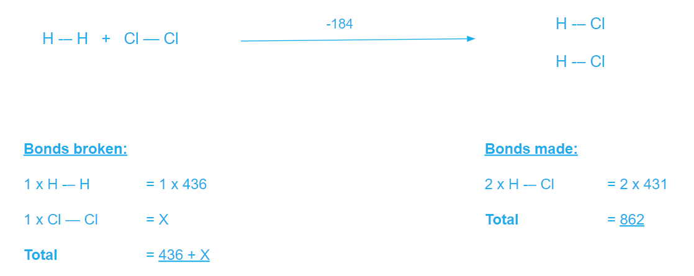
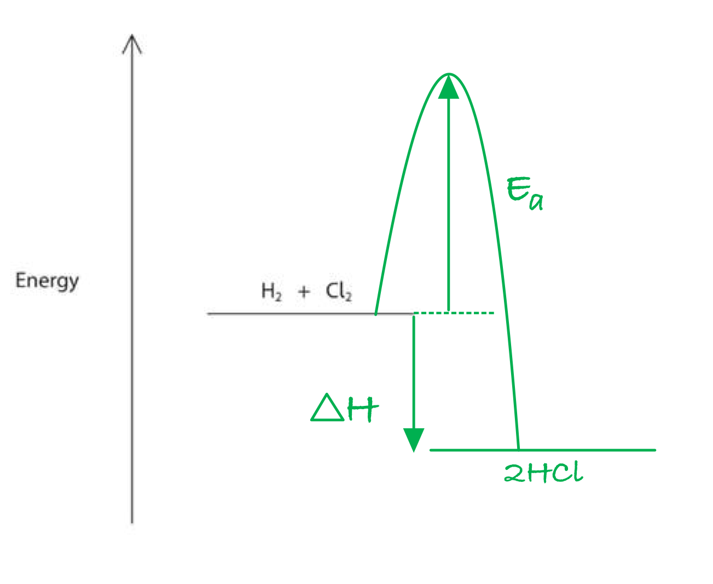
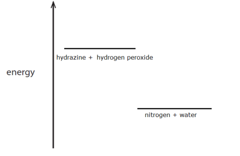
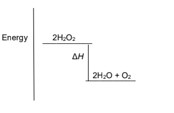
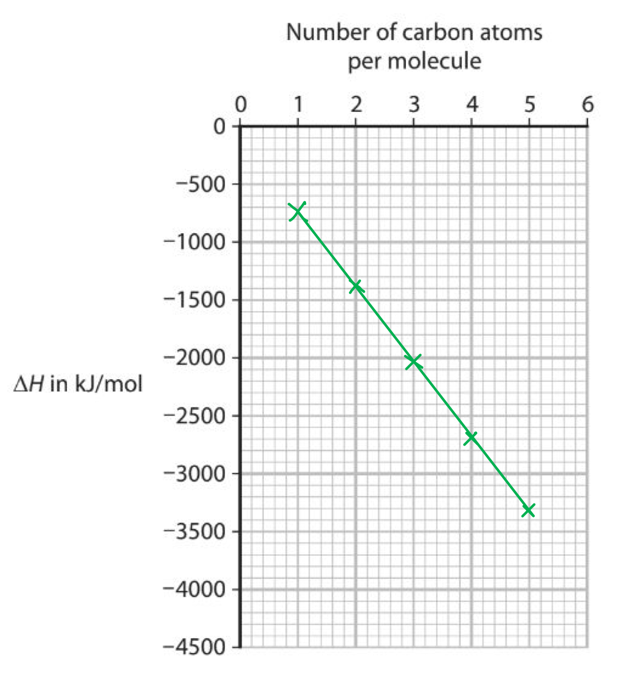
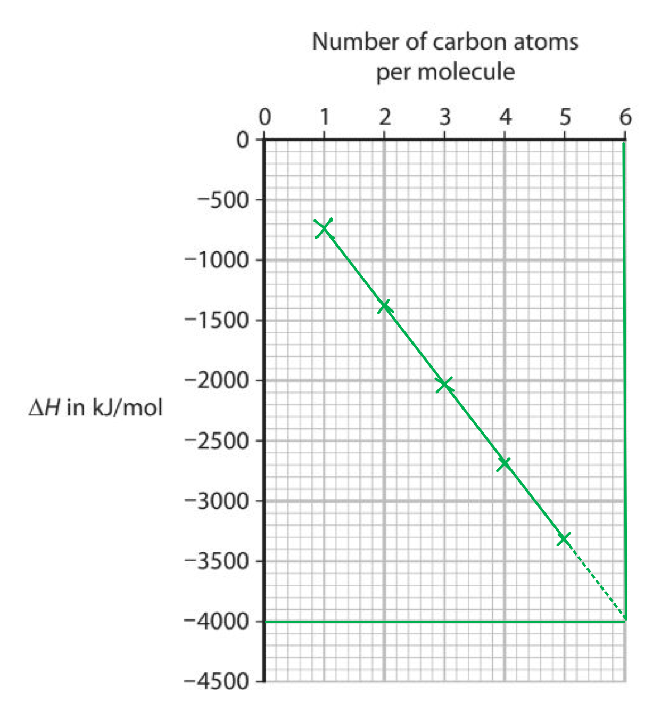
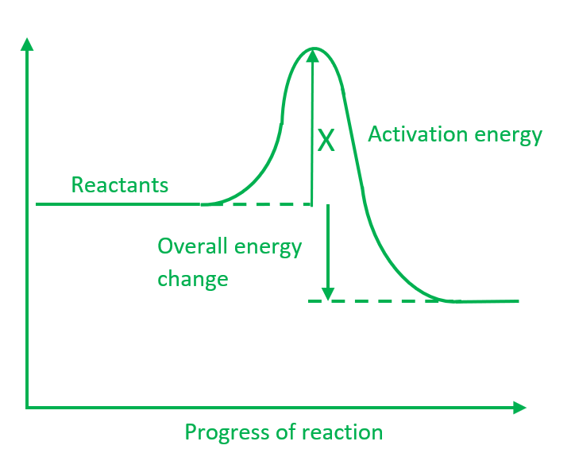

# Mark Schemes — Energetics
**3. Physical Chemistry** · Edexcel IGCSE Chemistry 4CH1

## Q1 — hard — 16 marks

### 2 — 5 marks
i) The number of miles per litre the car consumes is:

miles per litre = $\frac{\mathrm{miles} \mathrm{per} \mathrm{gallon}}{\mathrm{litres} \mathrm{per} \mathrm{gallon}}$

miles per litre = $\frac{56}{4.54}$

miles per litre =** 12.3 miles/L** **[1 mark]**

ii) The heat energy, in kJ/mol, produced by the fuel is:

- Convert mass into moles:

moles = $\frac{\mathrm{mass}}{M_{r}}$

moles in 1 kg of octane = $\frac{1000g}{114}$

moles in 1 kg of octane = 8.7719 mol **[1 mark]**

- Calculate the energy released per mole:

8.77 moles = 5.3 x 105 kJ heat energy

1 mole = $\frac{(5.3\times10^{5})}{8.7719}$

heat energy = 60420 kJ/mol **[1 mark]**

heat energy = **-60,400 kJ/mol**** ****OR** **-6.04 x10****4 ****kJ/mol** **[1 mark]**

> **[mark-scheme]**
> ii)
> 
> - Moles of octane = 8.77 **[1 mark]**
> - Correct calculation of energy per mole = 60433 kJ/mol **[1 mark]**
> - Correct final answer rounded to 3 s.f. **AND** With a negative sign (e.g., -60400 or -6.04x104) **[1 mark]**

iii) The size of the fuel tank is:

size of the fuel tank = $\frac{\mathrm{miles}\times\mathrm{litres}/\mathrm{gallon}}{\mathrm{miles}/\mathrm{gallon}}$

size of the fuel tank = $\frac{650\times4.54}{56}$

size of the fuel tank = **52.7 Litres** **[1 mark]**

> **[exam-tip]**
> In multi-step calculations like part (ii), it is important not to round your answer too early. Use the full value from your calculator for the number of moles (8.7719...) in the next step to ensure your final answer is accurate. Only round right at the end to the number of significant figures required.
> 
> Remember that **combustion is always an exothermic reaction**, meaning it releases heat. Therefore, the enthalpy change (ΔH) for combustion must always be given a **negative sign**. Forgetting the sign will lose you a mark.

### 2 — 3 marks
To calculate the volume of carbon dioxide gas (at rtp) when 1.0 kg of the fuel burns:

- Find the moles of octane in 1 kg:

moles of octane = $\frac{1000g}{114}$ = 8.7719 mol

- Determine the moles of CO2:

the ratio of C8H18 to CO2 is 2 : 16 or 1 : 8

moles of CO2 = moles of C8H18 × 8 ** [1 mark]**

moles of CO2 = 8.7719 × 8

moles of CO2 = 70.175 mol** [1 mark]**

- Convert the moles of CO₂ into volume.

volume = moles × molar volume

volume of CO2 = 70.175 × 24 = 1684.2 dm3

volume of CO2 ≈ **1680 dm****3**** (to 3 s.f.) ****[1 mark]**

> **[mark-scheme]**
> Answers between 1680 - 1684 dm3 would be acceptable.
> 
> Allow error carried forward from an incorrect value for moles in part (a)(ii).
> 
> A correct answer with or without working scores 3 marks

> **[exam-tip]**
> In longer calculation questions, you are often expected to use an answer you calculated in a previous part. Here, you needed the number of moles of octane from part (a)(ii).
> 
> You must use the balanced chemical equation to find the mole ratio between the substance you know (octane) and the substance you want to find out about (carbon dioxide). In this case, the ratio is 2:16, or 1:8.

### 2 — 4 marks
To calculate the enthalpy of reaction for the combustion of methane:

- Calculate the energy of the bonds broken:

* *4 x* E*(C-H) = 4 x 413=  +1652

*2 x E*(0=0) = 2 x 498 = +996

Bonds broken = +1652 + 996 = +2648 **[1 mark]**

- Calculate the energy of the bonds formed:

2 x *E*(C=O) = 2 x (-805) = -1610

4 x *E*(H-O) = 4 x (-464) = -1856

Bonds formed = -1490 + (-1856) = -3466 **[1 mark]**

- Calculate the enthalpy of reaction:

enthalpy of reaction = bonds broken + bonds formed **[1 mark]**

enthalpy of reaction = (+2648) + (-3466)

enthalpy of reaction =** -818 kJ/mol** **[1 mark]**

> **[mark-scheme]**
> The correct final answer scores all the marks

> **[exam-tip]**
> When bonds are broken, the reaction is endothermic, and energy is put in, so the sign is positive.
> 
> When bonds are formed, the reaction is exothermic and energy is released, so the sign is negative.
> 
> The enthalpy of reaction is the sum of the bonds broken and formed.
> 
> Watch out for multiples of bonds in molecules; CO2 has two C=O bonds, so the bond energy is doubled. The water is tricky; there are two 0-H bonds per molecule, so two H20 molecules would have 4 O-H bonds.

### 2 — 4 marks
A reaction profile to represent the combustion of carbon is:

**[4 marks]**

> **[mark-scheme]**
> 1 mark for the energy level for the products (CO2 + 2H2O) drawn **lower** than the energy level for the reactants (CH4 + 2O2)
> 
> 1 mark for a curve drawn from the reactants' level, rising to a peak (the 'hump') and then falling to the products' level
> 
> 1 mark for the activation energy (*E*a) labelled with an arrow pointing upwards from the reactants' level to the peak of the curve
> 
> 1 mark for the enthalpy change (Δ*H*) labelled with an arrow pointing downwards from the reactants' level to the products' level

> **[exam-tip]**
> Examiners say that students often confuse the two primary types of energy diagrams:
> 
> - **Energy level diagrams:** These primarily focus on the relative energy levels of reactants and products, showing the overall enthalpy change (Δ*H*).
> - **Reaction profile diagrams:** These show the energy pathway, explicitly including the energy barrier, or **activation energy** (*Ea*), along with Δ*H*.
> 
> Examiner reports show that students often lose marks on these diagrams for drawing the arrows incorrectly. Remember:
> 
> - **Activation energy (*****E*****a****)**
> 
>   - This is the 'hump' the reactants must get over to start the reaction.
>   - The arrow always goes **from the reactants up to the peak of the curve**.
> - **Enthalpy change (Δ*****H*****)**
> 
>   - This is the overall energy difference between the start and end.
>   - The arrow always goes **from the reactants' level to the products' level**.
>   - For an **exothermic** reaction (like this one), energy is released, so the products are lower and the Δ*H* arrow points **down**
>   - For an **endothermic** reaction, the products would be higher and the Δ*H* arrow would point **up**.

## Q2 — medium — 10 marks

### 3 — 3 marks
> **[mark-scheme]**
> i) The type of reaction taking place is:
> 
> - Neutralisation  **[1 mark]**
> 
> ii) A reason for using a polystyrene cup is:
> 
> - Polystyrene is an insulator
> **OR**
> It reduces heat loss to the surroundings** [1 mark]**
> 
> iii) There is more hydrochloric acid than sodium hydroxide solution:
> 
> - To ensure all the sodium hydroxide is used up / reacted** [1 mark]** **OR** To make sodium hydroxide is a limiting reagent ** [1 mark]**

> **[exam-tip]**
> Polystyrene is used for calorimetry experiments because it is a good insulator. This is important to **reduce heat loss** to the surroundings, which makes the measured temperature change more accurate.
> 
> When you want to measure the energy change for a specific amount of one reactant, you must make sure that reactant gets completely used up. The easiest way to do this is by adding an **excess** of the other reactant. In this case, the acid is in excess to ensure all the alkali reacts.

### 3 — 7 marks
i) To show that the heat energy change (Q) is about 1425J:

- Calculate the temperature change:

temperature change, Δ*T**** ***= final temperature - initial temperature

temperature change, Δ*T**** ***= 24.2 - 18.0

temperature change, Δ*T**** ***= 6.2 oC**  [1 mark]**

- Calculate the energy change:

*Q *= *mc*Δ*T**** ***

*Q *= 55.0 x 4.18 x 6.2** [1 mark]**

*Q* = **1425.38 J/mol** **[1 mark]**

ii) The number of moles of sodium hydroxide reacted is:

moles = concentration x volume in dm3

moles of NaOH = $1.0\times\frac{25.0}{1000}$

moles of NaOH= **0.025 mol** **[1 mark]**

iii) The value of the enthalpy change (Δ*H*), in kilojoules per mole:

molar enthalpy change, Δ*H* =$\frac{Q}{n}$

Δ*H* = $\frac{Q}{n}$= $\frac{1425.38}{0.025}$**[1 mark]**

Δ*H* = -57015.2 J/mol

Δ*H* = **-57.0 kJ/mol ****[2 marks]**

> **[mark-scheme]**
> i)
> 
> 1 mark for mass, *m* = 55.0 g **AND **temperature change, Δ*T**** ***= 6.2 oC
> 
> 1 mark for substitution into *Q* = *mc*Δ*T*** **
> 
> 1 mark for the final answer of 1425.38 J/mol

> **[mark-scheme]**
> ii)
> 
> - Moles of NaOH =** **0.025 mol **[1 mark]**
> 
> iii)
> 
> - Substitution into Δ*H* = $\frac{Q}{n}$ **[1 mark]**
> - A value of 57 kJ/mol **[1 mark]**
> - A negative sign **[1 mark]**

> **[exam-tip]**
> Examiner reports highlight several common errors in these calculations:
> 
> 1. **Mass (m)**
> 
>   - Remember that '*m*' in *Q *= *mc*Δ*T* is the total mass of the final solution (acid + alkali), not just the volume of one of the reactants.
> 2. **Unit conversion**
> 
>   - The question asks for the final answer in **kJ/mol**.
>   - So, don't forget to divide your answer in J/mol by 1000.
> 3. **The sign**
> 
>   - For an **exothermic** reaction (temperature increases), the Δ*H* value must be **negative**.
>   - For an **endothermic** reaction (temperature decreases), Δ*H* is **positive**.
>   - Forgetting the sign will lose you a mark.
> 4. Part iii) The question asks for kilojoules, so you must do the conversion at the end, or you will lose the mark. One mark is for the value, and one mark is for the sign.

## Q3 — medium — 9 marks

### 4 — 6 marks
i) The completed table is:

| temperature in oC after adding the zinc | **28.3** **[1]** |
|---|---|
| temperature in oC before adding the zinc | 17.7 |
| temperature rise in °C | **10.6** **[1]** |

ii) To calculate the heat energy change:

- State the equation:

*Q* = *m* x *c* x Δ*T*** [1 mark]**

- List the known values:

  - *m* = 100 cm3 = 100 g
  - *c* = 4.2 J/g/oC
  - Δ*T* = 10.6 °C
- Substitute the values into the equation:

*Q* = 100 x 4.2 x 10.6 **[1 mark]**

- Solve the equation:

*Q* = 4452 J **[1 mark]**

- Give your answer to two significant figures:

**Q**** = 4500 J** **[1 mark]**

> **[mark-scheme]**
> ii) The correct answer of 4500J with or without working scores full marks
> 
> If you misread the thermometer(s), you can get an error carried forward in part ii) as long as you used your wrong temperature value correctly in the calculation.

> **[exam-tip]**
> It is strongly advised that you show your workings! If you make a mistake, you may still pick up marks, even if you get the final answer wrong.
> 
> Common mistakes include:
> 
> 1. Using one of the initial or final temperatures instead of the **temperature change (Δ*****T*****)**.
> 
>   - Always calculate the change first.
> 2. Forgetting to round your final answer to the **number of significant figures** asked for in the question.
> 
>   - 4452 J would not get the final mark here.
>   - It must be rounded to 4500 J.
> 3. Confusing joules (J) and kilojoules (kJ).
> 
>   - Pay close attention to the units given for 'c'.

### 4 — 3 marks
> **[mark-scheme]**
> i) Two expected observations:
> 
> - A pink-brown solid is formed **[1 mark]**
> - The blue solution becomes paler/ decolourises / fades **[1 mark]**
> 
> ii) The type of reaction:
> 
> - (Metal) displacement **[1 mark]**

> **[exam-tip]**
> i)  You need to know the colours associated with the key substances:
> 
> - Copper(II) sulfate solution is **blue **because of the aqueous Cu2+ ions.
> - Solid copper metal is a **pink-brown** solid.
> - Zinc sulfate solution is **colourless**.
> 
> The observations describe the blue solution fading as the Cu2+ ions are replaced, and the pink-brown solid appearing as copper metal is formed.
> 
> ii) Zinc is more reactive than copper, which means that it can displace the copper from its salt solution. This reaction is a metal displacement reaction.
> 
> It is also a redox reaction, as the zinc is oxidised and the copper ions are reduced.

## Q4 — medium — 12 marks

### 7(a) — 1 marks
The meaning of the term exothermic is:

- (A reaction that) gives out thermal energy / heat (energy); **[1 mark]**

**[Total: 1 mark]**

- *The definitions of exothermic and endothermic are important to remember*

### 7(b) — 4 marks
The calculation to give the bond energy of the Cl–Cl bond:

- `sum from blank to blank of`bond energies of reactants = 436 + X;** [1 mark]**
- `sum from blank to blank of`bond energies of products = 2 x 431 **OR** 862 (kJ); **[1 mark]**
- -184 = 436 + X - 862 
**OR**
 X = -184 + 862 - 436; **[1 mark]**
- X = 242 (kJ/mol); **[1 mark]**

**[Total: 4 marks]**

- *The overall calculation required is:*

  - *Δ**H** = ∑bonds broken - ∑bonds made*
- *To help with your calculation you can set put the working like this:*

- *Then we can see*

  - *Δ**H** = ∑bonds broken - ∑bonds made*
  
    - *-184 = 436 + X - (862) Rearranging to give*
    - *X = -184 + 862 - 436*
    - *X = 242 kJ/mol*

### 7(c) — 3 marks
This reaction is exothermic because:

- Energy is needed to break bonds / bond-breaking is endothermic 
**OR** 
Energy is absorbed / taken in;* ***[1 mark]**
- Energy is given out / released when bonds are formed / bond-forming is exothermic; **[1 mark]**
- The energy given out is greater than energy needed (so exothermic); **[1 mark]**

**[Total: 3 marks]**

- *Students often struggle with this explanation and use terminology incorrectly by confusing whether energy is released or taken in with bond forming or bond breaking, so ensure you learn the correct termonimolgy*
- *Another common mistake is to refer to the number of bonds being broken*
- *A correct explanation that would score all three marks is:*

  - *More energy is released when new bonds are formed (in products) than is needed to break the bonds (in reactants)*
- *This is well worth learning!*

### 7(d) — 4 marks
The completed the reaction profile diagram to show the position of the products, the enthalpy change (Δ*H*) and the activation energy (*E*a) for the reaction:

- Horizontal line to show products below reactants and to the right of reactants and labelled 2HCl / products;**[1 mark]**
- Vertical line from H2 + Cl2 level to 2HCl / products level and labelled enthalpy change / ΔI / -184; **[1 mark]**
- Curve with hump / peak shown on diagram going up from H2 + Cl2 line and ending at 2HCl / products line; **[1 mark]**
- Vertical line from H2 + Cl2 level to top of hump level and labelled activation energy / *E*a; **[1 mark]**

**[Total: 4 marks]**

- *As it is an exothermic reaction, the reactants will be higher than the products - make sure you label the products*

  - *If you draw it as an endothermic reaction with the products higher than the reactants, you can still score the three remaining marks*
- *The enthalpy change is shown by an arrow pointing from the reactants line down to the products line - you would be awarded the mark if you used a double-headed arrow or a vertical line BUT you would be penalised if you drew an arrow pointing in the opposite direction*
- *The activation energy is shown by an arrow pointing from the reactants up to the peak of the curve, again you would be awarded the mark for a double-headed arrow or a vertical line BUT you would be penalised if you drew an arrow in the opposite direction*

## Q5 — hard — 16 marks

### 11(a) — 6 marks
The advantages and disadvantages of each method are:

Any **six **of the following:

**Method 1**:

- Polystyrene (is an insulator so) reduces / prevents heat loss (to the surroundings); **[1 mark]**
- The lack of a lid means that heat / thermal energy will be lost (to the surroundings); **[1 mark]**
- Stirring will ensure an even temperature / more accurate (highest) temperature in the solution 
**OR **
Stirring spreads the heat energy more evenly throughout the solution; **[1 mark]**
- The lack of a lid means that there is a possibility of spillage 
**OR **
The polystyrene cup (containing the thermometer) is unstable / may fall over; **[1 mark]**

**Method 2**:

- The glass bottle is a poor insulator so heat / thermal energy will be lost (to the surroundings); **[1 mark]**
- The bung helps reduce / prevent the loss of heat / thermal energy (to the surroundings); **[1 mark]**
- The bung reduces / prevents spillage; **[1 mark]**
- It cannot be stirred so you cannot ensure an even temperature / cannot ensure an accurate (highest) temperature 
**OR **
The heat energy is not evenly spread throughout the solution; **[1 mark]**

**[Total: 6 marks]**

- *This experiment is using calorimetry as a measure of a metal displacement reaction*
- *Therefore, you should be thinking about the advantages and disadvantages in terms of potential energy losses and / or getting the most accurate results*
- *This will include:*

  - *Material choices for the containers, e.g. polystyrene is a better insulator than glass*
  - *Lids to reduce the heat lost from the top of the experiment*
  - *Whether the experiment is stirred or not as this spreads the heat energy more evenly throughout the reaction mixture / solution*

### 11(b) — 2 marks
To show that the zinc is in excess:

Method 1:

- 0.025 moles of CuSO4 reacts with 0.025 moles of Zn; **[1 mark]**
- So, the mass of Zn needed = 0.025 x 65 = 1.625 g (which is less then 3 g, therefore, the zinc is in excess); **[1 mark]**

Method 2:

- 0.025 moles of CuSO4 reacts with 0.025 moles of Zn; **[1 mark]**
- 3 g of Zn = $\frac{3}{65}$ = 0.046 moles (which is more than 0.025, therefore, the zinc is in excess); **[1 mark]**

**[Total: 2 marks]**

- *Tip: **State the molar relationship of the chemicals in question as this is often worth a mark *
- *Limiting reagent and reagent in excess questions will require you to work out the mass of a reagent (method 1) or the number of moles of a reagent (method 2)*
- *The values calculated then allow you to compare against the amount of chemical used  *

### 11(c) — 6 marks
i) To show that the energy change Q for this reaction is about 4000 J:

- Temperature rise = 40.6 - 21.1 
**OR **
Temperature rise = 19.5; **[1 mark]**
- Q = 50 x 4.2 x 19.5; **[1 mark]**
- Q = 4095 (J) 
**OR **
Q = 4100 (J); **[1 mark]** 
*The sign written with this answer is ignored*

ii) The molar enthalpy change (Δ*H*), in kJ / mol, for the reaction is:

- Molar enthalpy change in J = $\frac{4095}{0.025}$; **[1 mark]**
- Molar enthalpy change in J = 163,800; **[1 mark] **
*Rounded values are accepted, e.g. 164,000 and 160,000*
- Conversion to kJ with correct sign = -163.8; **[1 mark] **
*Rounded values are accepted, e.g. -164 and -160*

**[Total: 6 marks]**

- *This question is a good example of the steps required to complete a molar enthalpy change calculation*

  1. *Calculate the temperature change of the reaction*
  
    - *A surprising number of candidates will guess at the calculation using one of the given temperatures, rather than calculate the temperature change*
  2. *Use that value to calculate the heat energy change, Q*
  
    - *The most common mistake in this step is to use an incorrect value for the mass, m*
  3. *Divide Q by the number of moles to calculate the molar enthalpy change*
  4. *Convert the molar enthalpy change from J / mol to kJ / mol by dividing by 1000*
  
    - *This conversion is often forgotten by exam candidates or completed incorrectly, e.g. ÷100 or x 1000*

### 11(d) — 2 marks
Explanation of what is oxidised and what is reduced in this reaction:

Alternative 1:

- Zinc / Zn is oxidised because it loses electrons; **[1 mark]**
- Copper <u>ions</u> / Cu2+ are reduced because it gains electrons; **[1 mark]**

Alternative 2:

- Zinc / Zn is oxidised 
**AND **
Copper <u>ions</u> / Cu2+ are reduced; **[1 mark]**
- Because the zinc transfers / loses electrons to the copper ions / Cu2+; **[1 mark]**

**[Total: 2 marks]**

- *Remember:** OIL-RIG - oxidation is loss, reduction is gain of electrons*

  - *The copper ions / Cu**2+** will gain 2 negative electrons to become copper atoms*
  - *At the same time, the zinc atoms will lose 2 electrons to become zinc ions / Zn**2+** *
- *Careful: **Examiners are strict about the use of the words atoms and ions*

  - *For example, if you said that zinc is oxidised because it loses electrons while copper is reduced because it gains electrons, you would lose the second mark for talking about copper and not specifying copper ions*
  - *Tip: **The best way to get around this issue it to use the chemical symbols*

## Q6 — medium — 13 marks

### 7(a) — 3 marks
The changes in electronic configuration when lithium and oxygen react to form lithium oxide, Li2O are:

- Two lithium atoms each lose one electron / give one electron to oxygen; **[1 mark]**
- Oxygen gains two electrons; **[1 mark]**
- Lithium (ion) has an electron configuration of 2 **AND** Oxide (ion) is 2,8; **[1 mark]** *All 3 marks can be scored from diagrams showing the electron configuration of the ions*

**[Total: 3 marks]**

- *An atom of lithium has an atomic number of 3, therefore it has 3 electrons in total*

  - *Its electronic configuration is 2,1*
  - *When it loses its outer electron, it has just 2 electrons remaining, which gives it the electron configuration of 2*
- *Oxygen has the atomic number of 8 so it has a total of 8 electrons *

  - *Its electronic configuration is 2,6*
  - *When it gains 2 electrons to form the oxide ion, its outer shell becomes full and its electronic configuration becomes 2,8*
- *Careful**: Lithium oxide is an ionic compound between a metal and a non-metal, so the electrons are transferred from the metal to the non-metal*

  - *If you make any reference to the atoms sharing electrons, you will be awarded 0 marks*

### 7(b) — 10 marks
i) The completed table:

| temperature in °C after adding the lithium oxide | **27.7**; [1 mark] |
|---|---|
| temperature in °C before adding the lithium oxide | 17.3 |
| temperature rise in °C | **10.4**; [1 mark] |

ii) The heat energy change in the reaction is:

Q = mcΔT = 100 x 4.2 x 10.4 = 4368 J

- Use of 100 in Q = m x c x ΔT; **[1 mark]**
- Use of 10.4 in Q = m x c x ΔT;** [ 1 mark]**
- Answer: 4368 J; **[1 mark]**
- 2 sig fig: 4400 J;** [1 mark]**

iii) The molar enthalpy change (Δ*H*) in kJ/mol is:

- Conversion to kJ: 5210 ÷ 1000 or 5.21 (kJ); **[1 mark]**
- ΔH = Q ÷ n = 5.21 ÷ 0.0580; **[1 mark]**
- -89.8 (kJ / mol); **[1 mark] **

iv) A reason why the scientist does the experiment in a polystyrene cup is:

- Polystyrene is a good insulator / poor conductor (of heat) 
**OR **
To minimise / reduce heat loss;** [1 mark]**

**[Total: 10 marks]**

- *Whilst you would be awarded full marks if you obtain the correct answer without showing working, it is important to clearly show your working*

  - *This is because if you make a mistake, you can still gain marks as you will be allowed 'error carried forward'*
- *You must include a sign in part (iii) - as the temperature increases, it is an exothermic reaction, which will have a negative molar enthalpy change*
- *If you correctly calculated the molar enthalpy change for part ii), instead of the heat energy change, you would gain all 3 marks*
- *When explaining why a polystyrene cup is used, you could have said to prevent heat loss*

  - *However, this is not a strong answer as heat loss will never be prevented*
  - *Therefore, it is better to use terms such as reduce or minimise when referring to heat loss*

## Q7 — medium — 10 marks

### 10(a) — 3 marks
i) It is not important to add an exact mass of zinc powder because:

- The zinc (powder) is in excess / not all the zinc is used up / reacts / some zinc is left over; **[1 mark]** 
*Allow because copper sulfate is limiting reagent / all reacted / all used up*

ii) The colour change of the solution is:

- (From) blue; **[1 mark]**
- (To) colourless / no colour / decolourised; **[1 mark]** *Ignore clear*

**[Total: 3 marks]**

- *It is the limiting reagent that determines the amount of product formed so it is important to know the exact quantity of this that reacts*
- *During the course of the reaction, copper sulfate is used up*
- *Aqueous copper sulfate is a clear blue solution, zinc sulfate is a clear colourless solution so the colour will change from blue to colourless as the reaction progresses*

### 10(b) — 7 marks
i) The heat energy change (Q) is about 1300 J because:

- Calculation of temperature increase: (31.5 - 19.0 =) 12.5 (°C); **[1 mark]**
- Substitution into Q = mcΔT: Q = 25 x 4.18 x 12.5; **[1 mark]**
- Evaluation: = 1310 (J); **[1 mark]** *Calculator answer is 1306.25* *accept any number of sig fig greater than 1* 
*Correct answer to 3 or more sig fig without working scores 3* 
*1300 with no working scores 0* 
*If answer in kJ unit must be given* *allow use of 4.2 for all 3 marks (= 1312.5)*

ii) The amount, in moles, of CuSO4 in 2.00 g is:

- n(CuSO4) = (mass ÷ molar mass = 2.00 ÷ 159.5) = 0.0125;** [1 mark] **
*accept any number of sig figs except 1*

iii) The value of the enthalpy change *(ΔH),* in kilojoules per mole, for the reaction between zinc and copper(II) sulfate is:

- `straight Q over straight n space bold OR space fraction numerator 1300 over denominator 0.0125 end fraction space bold OR space fraction numerator answer space to space straight b open parentheses straight i close parentheses over denominator answer space to space straight b open parentheses ii close parentheses end fraction`; **[1 mark]** 
*accept any number of sig figs in the numerator except 1*
- Δ*H* = (-) 104 (kJ/mol); **[1 mark]** 
*accept any number of sig figs* 
*allow ECF *
- Negative sign included; **[1 mark]** *Correct answer with no working and no sign or incorrect sign scores 2* 
*Correct answer with no working and correct sign scores 3* 
*104.5(04)   104.48   104.8   105 all score 2* 
*-104.5(04)   -104.48   -104.8   -105 all score 3*

**[Total: 7 marks]**

- *In this reaction, the temperature of the solution increases, which shows that heat energy is released to the surroundings, i.e. this is an exothermic reaction*
- *Exothermic reactions have a negative Δ**H **value, so remember to include one in your final answer*
- *When calculating Δ**H**, the answer given will be in J/mol as Q is in J, so you must remember to convert this to kJ/mol for your final answer:*

  - *Δ**H **= *$\frac{1300}{0.0125}$* = 104000 J/mol*
  - $\frac{104000}{1000}$* = 104 kJ/mol*

## Q8 — medium — 10 marks

### 9 — 5 marks
i)  Calculating the total amount of energy required to break all of the bonds in the reactants:

- 3861(kJ); **[1 mark]**

ii)  Calculating the total amount of energy released when all of the bonds in the products are made:

- 4649 (kJ); **[1 mark]**

iii) Calculating the enthalpy change, ∆*H*, in kJ/mol, for the reaction:

- 3861-4649 (kJ/mol); **[1 mark]**
- -788; **[2 marks]**

**[Total: 5 marks]**

- *You would score the full three marks for a final answer of -788, but only two marks if your final answer is 788*
- *To calculate the sum of the bonds broken the workings are:*

> *(N-N) x 1 = 159 x 1 = 159*

> *(N-H) x 4 = 391 x 4 = 1564*

> *(O-O) x 2 = 143 x 2 = 286*

> *(O-H) x 4 = 463 x 4 = 1852*

> *    Bonds broken, total = 3861*

- *To calculate the sum of the bonds made the workings are:*

> *(N≡N) x 1 = 945 x 1 = 945*

> *(O-H) x 8 = 463 x 8 = 3704*

> * Bonds made, total = 4649*

- *Σ(bonds broken) - Σ(bonds made)= 3861 - 4649 = -788*
- *There is more energy given out when the bonds are formed than was taken in to break the bonds, so the reaction is exothermic and should have a negative sign in front of the value*

### 9 — 2 marks
In terms of bonds broken and bonds made, why this reaction is exothermic:

- More energy is given out when the bonds are made;** [1 mark]**
- Than is taken in when the bonds are broken; **[1 mark]**

**[Total: 2 marks]**

- *You need to get the flow of energy correctly matching what happens to the bonds*
- *Stating or implying that energy is released when bonds are broken will lose you all credit*
- *You can make your arguments the other way around, e.g. less energy is needed when bonds are broken than is given out when bonds are made*

### 5(c) — 3 marks
An energy level diagram for the reaction between N2H4 and H2O2:

- Right hand line below left hand line;** [1 mark]**
- Correct names/formulae of both reactants;** [1 mark]**
- Correct names/formulae of both products; **[1 mark]**

**[Total: 3 marks]**

- *You don't need to connect the lines or show activation energy as the question only asks for the enthalpy level diagram and not the enthalpy change*
- *Without the names or formulas in the correct places you won't score the second and third mark, for example, if you just wrote reactants an products*
- *Both water / steam is acceptable on the product side*

## Q9 — medium — 9 marks

### 12(a) — 2 marks
The type of reaction taking place in the experiment is:

- Endothermic; **[1 mark]** 
*Exothermic scores zero marks for the entire question*
- (Because,) it takes in heat / thermal energy (from the surroundings) 
**OR **
(Because,) the temperature (of the solution / reaction mixture) decreases 
**OR **
(Because,) the reaction gets colder / cooler; **[1 mark]**

**[Total: 2 marks]**

- *Remember: **Exothermic reactions release energy to the surroundings so the temperature increases; while endothermic reaction take energy from the surroundings so the temperature decreases*

### 12(b) — 3 marks
The calculation to show that the heat energy change, *Q*, is about 2400 J is:

- Temperature change: 14.2 - 20.0 = (-) 5.8; **[1 mark]** 
*The negative sign is not required for the mark*
- *Q *calculation: 100 x 4.18 x (-) 5.8; **[1 mark]** 
*The use of 4.2 instead of 4.18 is allowed and will result in a final answer of (-) 2436 J The use of 108 instead of 100 will give a final answer of (-) 2618 J and scores two marks*
- *Q* answer: roughly (-) 2420 (J) 
**OR **
*Q *answer: (-) 2436 (J); **[1 mark] **
*If the final answer is 2.42 then units of kJ ****must**** be seen to achieve the mark*

**[Total: 3 marks]**

- *Calorimetry calculations are very methodical*
- *Q** = **m** x **c** x Δ**T*

  - *m** will be the volume of water given*
  - *c** is the specific heat capacity (usually of water) but you will be given this value*
  - *Δ**T** is the temperature change which you will usually have to calculate from the information *
- *When you are asked to show that the energy change is a certain value, you often don't have to worry about the sign of the answer*

### 12(c) — 4 marks
To calculate the enthalpy change, Δ*H*, in kilojoules per mole of ammonium nitrate:

- Moles of ammonium nitrate: $\frac{8.00}{80.0}$  
**OR **
Moles of ammonium nitrate:  0.1; **[1 mark]**
- Calculating Δ*H*: $\frac{Q}{n}$ 
**OR **
Calculating Δ*H*: $\frac{2420}{0.1}$ 
**OR **
Calculating Δ*H*: `begin mathsize 14px style fraction numerator Answer space to space part space open parentheses straight b close parentheses over denominator 0.1 end fraction end style`; **[1 mark]**
- Δ*H* = (+) 24.2 kJ / mol; **[1 mark]** 
*Accept any number of significant figures except 1*
* Error carried forward from the previous calculation(s) is allowed*
- Positive sign included in final answer; **[1 mark]** 
*Correct answer including positive sign scores all four marks *
*Correct answer with no sign or an incorrect sign scores a maximum of 3 marks*

**[Total: 4 marks]**

- *Remember: **Δ**H** = *$\frac{Q}{n}$
- *Q ** was calculated in part (b) or you can use the given value of 2420 J*
- *You have to calculate **n** using *$\frac{mass}{M_{r}}$
- *This answer is then substituted into the equation for Δ**H*
- *Your final answer should include a positive sign as you should have deduced that it is an endothermic reaction in part (a)*
- *The question asks for your answer to be given in kJ / mol*

  - *Make sure you divide your answer by 1000 to convert from J / mol to kJ / mol*

## Q10 — hard — 1 marks

### 11 — 1 marks
**Correct answer: C** — 844 J

**Final answer:** **The correct answer is C because**

- **Step 1: **Calculate the amount of nitrogen present

$\mathrm{moles}=\frac{\mathrm{mass} \mathrm{in}g}{\mathrm{molar} \mathrm{mass} \mathrm{in}g/\mathrm{mol}}$

$\mathrm{moles} \mathrm{of}N_{2}=\frac{0.025g}{28.0g/\mathrm{mol}}$

= 8.93 x 10-4 mol

- **Step 2: **Calculate the energy needed to break the bonds and convert to Joules:

energy needed = moles x bond energy

= 8.93 x 10-4 x 945 = 0.844 kJ

= 0.844 kJ  $\times$ 1000 = 844 J

*Remember this is for nitrogen molecules, N2, not atoms

## Q11 — hard — 9 marks

### 7(a) — 1 marks
The word equation for the reaction is:

- Magnesium + hydrochloric acid → magnesium chloride + hydrogen; **[1 mark]**

**[Total: 1 mark]**

- *Remember: **MASH stands for **M**etal + **A**cid → **S**alt + **H**ydrogen*
- *You should know the salts that different acids form:*

  - *Hydrochloric acid = chloride salts*
  - *Sulfuric acid = sulfate salts*
  - *Nitric acid = nitrate salts*

### 7(b) — 8 marks
i) The completed table giving the temperatures to the nearest 0.1 °C is:

| **temperature of the acid at the start in °C** | 22.4; [1 mark] |
|---|---|
| **highest temperature reached in °C** | 43.2; [1 mark] |
| **temperature rise in °C** | 20.8 |

ii) To show that the heat energy change (Q) for this reaction is about 2200 J:

- Q = 25 x 4.2 x 20.8; **[1 mark] **
*25.12 g can be used for the mass instead of 25 g*
- Q = 2184 (J); **[1 mark]**  
*If 25.12 g has been used for the mass, m, then 2194 J will achieve both marks*

iii) The enthalpy change (Δ*H*), in kilojoules per mole of magnesium, for the reaction between magnesium and hydrochloric acid is:

- Moles of magnesium = $\frac{0.12}{24}$ 
**OR **
Moles of magnesium = 0.005; [1 mole]
- $\frac{Q}{n}$** = **$\frac{2184}{0.005}$ 
**OR**
** **$\frac{Q}{n}$= 436,800 (J / mol); **[1 mark]**
- Δ*H* in kJ / mol = $\frac{436800}{1000}$ 
**OR **
Δ*H* in kJ / mol = 436.8 kJ / mol; **[1 mark]**
- The negative sign of Δ*H* = –436.8; **[1 mark]** 
*The correct answer with the negative sign without working scores 4 marks *
*The correct answer without the negative sign without working scores 3 marks*

**[Total: 8 marks]**

- *This question walks you through the necessary steps to correctly calculate the molar enthalpy change for a reaction:*

  1. *Calculate the temperature change*
  2. *Calculate **Q**, using **Q = mc**Δ**T*
  3. *Calculate the number of moles, **n**, of the reactant in question*
  4. *Convert the answer from J / mol to kJ / mol by dividing by 1000*
  5. *Calculate Δ**H** using *$\frac{Q}{n}$
  6. *Check the sign of the final answer*
  
    - *Exothermic reactions should have a negative sign*
    - *Endothermic reactions should have a positive sign*

## Q12 — medium — 1 marks

### 13 — 1 marks
**Correct answer: D** — The student measured the initial temperature of the water as lower than the actual value.

**Final answer:** **The correct answer is D**

- Measuring the initial temperature as lower than the actual value would give a larger value for Q, and therefore a larger value for Δ*H*
- The other statements are all valid reasons why the value recorded for the temperature change of the water, and therefore the value of Q, would be lower than the actual value should be

## Q13 — hard — 12 marks

### 6(a) — 2 marks
i) The reaction occurs because:

- Magnesium is more reactive than copper/ magnesium can displace copper/ magnesium is higher than copper in the reactivity series; **[1 mark]**

*Do not allow magnesium is more reactive than copper(II) / Cu**2+** / copper sulfate*

ii) The completed word equation is:

- (magnesium + copper(II) sulfate) $\rightarrow$ magnesium sulfate + copper; **[1 mark]**

*Reject copper(II)*

**[Total: 2 marks]**

- *It is the reactivity of the metals, not the metal ions, that must be compared in part i), as the reactivity of the ions is different (copper metal is more easily oxidised, copper(II) ions are the product from this oxidation*
- *Both products are required for the mark in part ii), but the order doesn't matter*
- *This is a word equation so you must use words, not formulae*

### 6(b) — 4 marks
i) The heat energy change is:

- Temperature rise = 36.1(°C); **[1 mark]**
- 15 162 J; **[1 mark] **

Correct answer with or without working scores 2 marks

*Allow 2 or more significant figures, ecf from an incorrect temperature change* *Ignore any negative sign*

ii) An explanation that links any **two** of the following points:

- Polystyrene is an insulator / polystyrene is not a (good) conductor of heat; **[1 mark]**
- (So) reduces heat loss (to the surroundings)/ prevents heat loss / keeps heat in OWTTE; **[1 mark]**
- Temperature rise / change / reading will be closer to the true value / more accurate / valid / OWTTE; **[1 mark]**

**[Total: 4 marks]**

- *The temperature change can be calculated from the difference in temperature given in the question; 56.3 - 20.2 = 36.1 **o**C*
- *The energy change is then calculated by using the equation:*

  - *heat energy = mass x specific heat capacity x temperature change*
  - *heat energy = 100 g x 4.2 J/g/ °C x 36.1 **o**C*
  - *heat energy = 15 162 J*
- *The mass of the solution is deduced from there being 100 cm**3** of solution used, and 1.00 g is the mass of each 1 cm**3*

### 6(c) — 6 marks
i) The molar enthalpy change is:

Method 1:

- Calculate the amount, in moles, of zinc: 0.500 ÷ 65 OR 0.00769; **[1 mark]**
- Divide Q by the amount in moles: 1.67 ÷ 0.00769 OR 217 (kJ/mol); **[1 mark]**
- Give the answer to three significant figures with a - sign: -217 (kJ/mol); **[1 mark]**

**OR**

Method 2:

- 1.67 ÷ 0.5 OR 3.34 kJ/g); **[1 mark]**
- 3.34 × 65 OR 217 (kJ/mol); **[1 mark]**
- -217 (kJ/mol); **[1 mark]**

*Correct answer of -217 with or without working scores 3 marks.* *Allow ECF throughout*

ii) The reaction is a redox reaction because:

- Zinc is oxidised and Cu2+ / copper(II) sulfate is reduced; **[1 mark]**
- Zinc loses electrons; **[1 mark]**
- Cu2+ / copper ions gain electrons; **[1 mark]**

*Allow references to changes in oxidation number for M2 and M3*

**[Total: 6 marks]**

- *Although it is possible to gain full marks without workings in part i), this is a very risky strategy as if you make a mistake then you would lose all of the marks. It is always advisable to show workings as it allows you to check over your answers more easily and allows for the possibility of error carried forward marks if you have made a mistake*
- *There are three marks for part ii), so you need to write in enough detail to make three separate points; one about each species involved and one about the types of change overall*
- *The question does not state that you have to answer in terms of electrons, so answering in terms of oxidation numbers is valid too. Watch out for questions that specify which they want!*

## Q14 — medium — 1 marks

### 15 — 1 marks
**Correct answer: C** — 346

**Final answer:** **The correct answer is C**

- The value of X is 346 kJ
- **Step 1: **Write out the overall bond energy calculation:

overall energy change = Σ(energy needed to break bonds) -Σ(energy transferred to surroundings)

- **Step 2: **Calculate the energy needed to break the bonds

energy need to break bonds = (4 x C-H) + ( 1 x Cl-Cl)

= (4 x 413) + 243 = 1895 kJ

- **Step 3: **Calculate the energy transferred to the surroundings:

energy transferred to surroundings= (3 x C-H) + (1 x C-Cl) + (1 x H-Cl)

= ( 3 x 413) + X + 432 = (1671 + X) kJ

- **Step 4**: Rearrange to find the unknown value:

-122 = 1895 - (1671+X)

1671 + X = 2017

X = **346 kJ**

## Q15 — medium — 8 marks

### 5(a) — 1 marks
**Correct answer: B** — it relights a glowing splint

**Final answer:** **The correct answer is B**

- A is incorrect as this is the test for hydrogen
- C is incorrect as oxygen is not an acidic gas
- D is incorrect as this is the test for carbon dioxide

### 5(b) — 2 marks
A catalyst increases the rate of a reaction by:

- Provides an alternative pathway;** [1 mark]**
- With a lower activation energy; **[1 mark]**

**[Total: 2 marks]**

- *This is a common 2 mark question so make sure you learn it*
- *Remember: **The catalyst is not used up in the reaction, it is chemically unchanged *

### 4(c) — 5 marks
i) The enthalpy change, Δ*H*, for the reaction is:

- M1 (4 x 463) + (2 x 143) 
**OR** 
2138 (kJ); **[1 mark]**
- M2 (4 x 463) + 498 
**OR** 
2350 (kJ); **[1 mark]**
- M3 — 212 (kJ) 
**OR** 
M1 – M2 correctly evaluated; **[1 mark]**

ii)The completed energy level diagram is:

- Horizontal line to show products in correct position and correctly labelled; **[1 mark]**
- Vertical line in correct position and labelled Δ*H*;** [1 mark]**

**[Total: 5 marks]**

- *To calculate the enthalpy change for a reaction, count the type and number of bonds being broken and formed*

  - *Bonds broken:*
  
    - *(2 x O-O) + (4 x H-O) *
    - *(2 x 143) + (4 x 463)*
    - *2138 kJ*
  - *Bonds formed:*
  
    - *(4  x H-O) + (1 x O=O)*
    - *(4 x 463) + 498*
    - *2350 kJ*
  - *Energy change = Energy taken in - Energy given out*
  - *2138-** **2350 = -212 kJ*
- *Part i) shows the enthalpy change as negative indicating the reaction is exothermic*
- *During an exothermic reaction, energy is transferred to the surroundings so the product has less energy than the reactant *

  - *Your product line should therefore be somewhere below the reactant line (it does not matter where) and the enthalpy change labelled as the distance between them *

## Q16 — medium — 1 marks

### 17 — 1 marks
**Correct answer: B** — 180 kJ/mol

**Final answer:** **The correct answer is B**

- Δ$\frac{\mathrm{heat} \mathrm{energy} \mathrm{change}(Q)\mathrm{in} \mathrm{kJ}}{\mathrm{number} \mathrm{of} \mathrm{moles} \mathrm{of} \mathrm{Na}_{2}O}$*H* = = $\frac{10.8kJ}{0.06mol}$= 180 kJ/mol
- Common errors include:

  - Not converting Q from J to kJ
  - Putting the fraction the wrong way round
  - Calculator errors such as incorrect numbers of 0 after the decimal point. Remember that most values of Δ*H* in common reactions are in the hundreds, not many thousands, of kJ/mol

## Q17 — medium — 1 marks

### 18 — 1 marks
**Correct answer: C** — Electronic balance, glass beaker, polystyrene cup, thermometer

**Final answer:** **The correct answer is C**

- The scientist will need an electronic balance to measure a known mass of sodium hydroxide, and can also use this to measure 50 g of water
- The scientist will need a glass beaker to contain the polystyrene cup, and can also use this to measure 50 cm3 of water (which is 50 g)
- The scientist will need a polystyrene cup as it is a good insulator and will reduce heat loss by conduction from the solution
- The scientist will need a thermometer to measure the temperature change of the solution

## Q18 — medium — 14 marks

### 8(a) — 3 marks
i) The piece of apparatus the student should use to add the distilled water to the polystyrene cup is a:

- Measuring cylinder 
**OR **
Pipette 
**OR **
Burette; **[1 mark]**

ii) Another reason why the student stirs the solution is:

- To ensure that the temperature is the same throughout the solution 
**OR **
To spread / mix / distribute the heat evenly throughout the solution; **[1 mark]**

iii) The colour of the copper(II) sulfate solution is:

- Blue;** [1 mark]** 
*Blue-green is not accepted All words describing different shades of blue are ignored, e.g. light blue, dark blue*

**[Total: 3 marks]**

- *The question tells you that 50 cm**3** is being added to the polystyrene cup, which will require the use of any of the standard pieces of equipment for measuring volume, although a measuring cylinder will give a less accurate measurement*
- *The idea of stirring is always to spread / evenly distribute something*

  - *You have to decide what is being spread / distributed throughout the solution and, in this case, it is the heat energy *
- *The colour of copper solutions is expected knowledge*

### 8(b) — 3 marks
The completed table is:

| maximum temperature in °C | 27.3**; [1 mark]** |
|---|---|
| initial temperature in °C | 24.4; **[1 mark]** |
| increase in temperature in °C | 2.9; **[1 mark]** |

**[Total: 3 marks]**

- *Take your time reading off these scales, especially as they are decreasing*
- *The most common answers were:*

  - *Maximum = 32.7*
  - *Initial = 25.6*
  - *Leading to an increase of 7.1*

### 8(c) — 6 marks
i) To show that the heat energy change (Q) in this second experiment is approximately 700J:

- Q = 50 x 4.2 x 3.3; **[1 mark]**
- Q = 693 J; **[1 mark]** 
*693 without working scores 2 marks*

ii) The molar enthalpy change (Δ*H*) in kJ / mol is:

- Moles of CuSO4 = $\frac{1.70}{159.5}$ 
**OR **
Moles of CuSO4 = 0.0107; **[1 mark]**
- $\frac{Q}{n}=\frac{693}{0.0107}$ 
**OR **
$\frac{Q}{n}=64766$; **[1 mark]** 
*693 can be replaced with 700 or your answer from part (i)*
- 64.8 (kJ / mol); **[1 mark]** 
*Using 700 gives -65.02 *
*Using 700 and 0.011 gives -63.64 *
*Using 693 and 0.011 gives -63*
- Negative sign / –64.8 (kJ / mol); **[1 mark]** 
*Correct answer of –64.8,  including the negative sign, without working scores all 4 marks *
*Correct answer of 64.8 , excluding the negative sign, without working scores 3 marks*

**[Total: 6 marks]**

- *You are expected to know and apply the Q = m c Δ**T** to calculate a value for the heat energy change, Q*
- *You then divide by the number of moles to get the molar enthalpy change, Δ**H*
- *Since the temperature of the reaction increases, it is an exothermic reaction which has a negative enthalpy *
- *This question shows the volume to mass conversion for the solution clearly, but a common error is to use the wrong mass. Always use the mass of whatever solution the thermometer is in*

### 8(d) — 2 marks
The type of energy change that occurs when hydrated copper(II) sulfate dissolves is:

- The temperature (of the reaction) decreases / drops / falls 
**OR **
The temperature drops by 1.1 oC;** [1 mark]**
- So, it is an endothermic reaction; **[1 mark]**

**[Total: 2 marks]**

- *Remember:** Exothermic reactions feel hot as heat energy is released to the surroundings - the temperature of these reactions increase*

  - *Endothermic reactions feel cold as heat energy is taken in from the surroundings - the temperature of these reactions decrease*

## Q19 — medium — 15 marks

### 9(a) — 1 marks
The student measures the mass of the spirit burner and fuel immediately after heating the water to:

- Minimise / prevent (mass loss by) evaporation of the (liquid) fuel  
**OR** 
To find the mass of the fuel used / burned; **[1 mark]**

**[Total: 1 mark]**

- *The liquid fuel will evaporate from the wick so the mass will decrease over time. This will cause the resulting calculations to be inaccurate*
- *If flame is put out and the mass is measured immediately after the water has been heated, this will reduce the amount lost to evaporation resulting in more accurate results*

### 9(c) — 3 marks
i) The black solid is:

- Soot / carbon; **[1 mark]**

ii) The black solid forms because:

- Incomplete combustion (occurs); **[1 mark]**
- (Because) the air / oxygen supply is limited; **[1 mark]**

**[Total: 3 marks]**

- *You should know the products of both complete and incomplete combustion*
- *Careful**: The black solid is **not **copper oxide, you would not be awarded any marks for giving this in part (i), however, if you did **AND **said that it formed due to copper reacting with oxygen, you would be awarded 1 mark*

### 9(c) — 6 marks
i) It can be shown that the heat energy change, Q, to raise the temperature of 100 cm3 of water by 30°C is approximately 13kJ by:

- Substitution into *Q* = *mc*Δ*T*: *Q* = 100 x 4.2 x 30; **[1 mark]**
- Calculation of heat energy in joules: = 12600 (J); **[1 mark]**
- Conversion to kJ: =12.6 (kJ); **[1 mark]**

ii) The molar enthalpy change, Δ*H*, in kJ/mol, for the combustion of methanol is:

- Calculate the amount, in moles, of methanol: mass ÷ *M*r = 0.96 ÷ 32 **OR **0.03; **[1 mark]**
- Divide Q by the amount in moles: 12.6 ÷ 0.03 **OR **420 (kJ/mol); **[1 mark] **
*Accept 13 ÷ 0.03 ****OR ****430 / 433*
- Give the answer with the correct sign: – 420 (kJ/mol);** [1 mark] **
*Accept -430 / -433*

**[Total: 6 marks]**

- *Whilst you would be awarded 2 marks for giving 12600 J or 3 marks for 12.6 kJ with no workings shown, it is very important to show your working clearly as if you make a mistake, you would not gain any marks*
- *If you show your workings, if you make one mistake, the error is carried forward so that you are not penalised more than once for it*
- *Remember**: Q is calculated in joules, but you are required to show your answer in kJ so convert by diving your answer in joules by 1000*
- *Students often get confused about which mass to use in these calculations:*

  - *When using **Q** = **mc**Δ**T**, it is the mass of the water that is being heated that you need, this is why you are given that the mass of 1.0 cm**3** of water is 1.0 g*
  - *When calculating the number of moles of methanol, it is the mass of methanol burned that you should use*
- *Heat is given out to the surroundings which increase in temperature, therefore it is an exothermic reaction and Δ**H** is negative *

### 9(d) — 5 marks
i) The completed graph:

- All points plotted correctly; **[1 mark]**
- Line of best fit drawn with a ruler; **[1 mark]** *Does not need to start at (0,0)*

ii) The value of Δ*H* for an alcohol *with six c*arbon atoms per molecule is:

- Straight line extrapolated up to 6 carbon atoms; **[1 mark]**
- Value of Δ*H* read from their graph (approximate expected answer = - 4000 (kJ / mol); **[1 mark]**

iii) The relationship between Δ*H* and the number of carbon atoms per molecule is:

- The greater the number of carbon atoms (per molecule) the greater (the magnitude / value of) Δ*H / *the more exothermic the Δ*H *value* *
**OR **
Δ*H* is (directly) proportional to the number of carbon atoms per molecule;** [1 mark]**

**[Total: 5 marks]**

- *The most common mistake when drawing graphs is to use the scale incorrectly*
- *Make sure that you find what the intervals on both axes are*

  - *In this case, on the y-axis, each small square represents 100 kJ / mol*
  - *On the x-axis, you will be using whole numbers of atoms, so make sure your points align with these correctly*
- *When drawing a line of best fit:*

  - *ignore any anomalous points, if any*
  - *try to get as many points on the line as possible, and, for those that don't fit on the line, an equal number of points above and below the line*
- *For part (ii),  you need to extrapolate your line of best fit to extend to 6 carbon atoms per molecule and then read off the corresponding value of Δ**H*
- *Remember to use a ruler *

## Q20 — hard — 12 marks

### 10(a) — 2 marks
**Two **reasons why a burette is better because:

- Increment in volume smaller / more precise; **[1 mark] **
- Avoids refilling the measuring cylinder; **[1 mark] **

**[Total: 2 marks] **

- *Measuring cylinders have a larger diameter than burettes, therefore are less accurate when measuring out liquids*
- *A burette will have a capacity of 50 cm**3** so you can fill the entire burette up with acid and add 5 cm**3** portions for each reading by opening the tap *

  - *You can also add liquid drop wise from a burette to increase accuracy *

### 10(b) — 2 marks
The completed table is:

| thermometer reading at end / °C | 26.8 |
|---|---|
| thermometer reading at start / °C | 18.7 |
| thermometer rise / °C | 8.1 |

- Correct temperature at start; **[1 mark]**
- Correct temperature rise consequential on readings; **[1 mark]**

**[Total: 2 marks] **

### 10(c) — 2 marks
i) The maximum temperature reached during the experiment is:

- 29.5 (°C); **[1 mark] ** *allow an answer between 29.3 (°C) to 29.7 (°C)*

ii) The volume of dilute nitric acid that exactly neutralises the 25 cm3 of aqueous potassium hydroxide

- 20.8 (cm3); **[1 mark] ** *allow an answer between 20.3 (cm³) to 21.3 (cm³)*

**[Total: 2 marks] **

- *The standard rule for reading graphs in an exam is to allow a tolerance of **± half a small square,** which is why a range of answers is given*
- *For the temperature, the y-axis is a strange scale:*

  - *The maximum temperature change is where the lines cross, which is 29.5 ° (halfway between 29.0 and 30 °C) *
  - *Each half square has a value of 0.4 °C*
  
    - *Therefore, the maximum temperature reached is 29.5 °C*
  - *Half a small square: 0.4 / 2 = 0.2 °C which gives a tolerance of 29.5 °C ± 0.2 °C*
- *For the volume (x-axis) the same applies*

  - *Value of one small square on x-axis: 1.0 cm**3*
  - *Half a small square: 1.0 / 2 = 0.5 cm**3*
  
    - *Therefore, the volume of dilute nitric acid that exactly neutralises the 25 cm**3** of aqueous potassium hydroxide is 20.8 cm**3*
  - *Applying the tolerance: 20.8 cm**3** ± 0.5 cm**3*

### 10(d) — 4 marks
To calculate the heat energy released in this experiment:

- Calculation of volume/mass of mixture; **[1 mark] **
- Calculation of temperature increase; **[1 mark]**
- Substitution of values into *q* = *mc*Δ*T*; **[1 mark]**
- Calculation of heat energy released with unit; **[1 mark] **

Example calculation: 
*m* = 20.0 + 20.0 = 40.0 (cm3) 
Δ*T *= 30.0 – 18.5 = 11.5 (°C) 
*q* = 40.0 × 4.2 × 11.5 
*q* = 1900 J *accept 1932 J*

**[Total: 4 marks] **

- *Remember:** It is the change in temperature that is represented by Δ**T**, so you must use the maximum temperature (given in question) - the starting temperature *
- *Students often use the wrong value for m (mass), it is the **total **mass of solution / water being heated that is used here - this is why you are told mass of 1 cm**3 **of mixture = 1 g*

### 10(e) — 2 marks
To calculate value of Δ*H*, in kJ/mol, for the neutralisation of potassium hydroxide

- Setting out of Δ*H* calculation; **[1 mark] **
- Division by 1000 to obtain answer in kJ/mol; **[1 mark] **

Example calculation:

Δ*H *in J/mol = $\frac{q}{\mathrm{mols}}$ = $\frac{1600}{0.040}$ = 40 000 J/mol

Δ*H *in kJ/mol = $\frac{40000}{1000}$= −40 (kJ/mol) (negative value for exothermic reaction)

**[Total: 2 marks] **

- *The enthalpy change, Δ**H , **for a reaction can be calculated in J/mol as well as kJ/mol*
- *To do this you must divide **q** (from **q **= **mc**Δ**T**) by the number of moles used in the reaction *
- *q **= **mc**Δ**T **gives the enthalpy change is J/mol, so to convert to kJ/mol you must divide by 1000*
- *As this is an exothermic reaction the value for Δ**H **is negative*

## Q21 — hard — 13 marks

### 10(a) — 3 marks
i)The correct equation is:

- potassium hydroxide + hydrochloric acid → potassium chloride + water; **[1 mark] **

ii) The student needs to stir the mixture because:

Any** two** of the following:

- To mix (the two solutions more thoroughly); **[1 mark] **
- (So that) more reactant particles come into contact with each other; **[1 mark] **
- So that the heat energy is given out more quickly; **[1 mark] **
- So that the mixture is the same temperature throughout;** [1 mark] **

**[Total: 3 marks]**** **

- *You would also be given the mark for a correct symbol equation:*

  - *KOH (aq) + HCl (aq) → KCl (aq) + H**2**O (l)*

### 10(b) — 2 marks
The mean temperature can be calculated by:

- Setting out of calculation; **[1 mark] **
- Evaluation; **[1 mark] **

Example calculation

Mean temperature = $\frac{17.8+18.4}{2}$ = 18.1 °C

**[Total: 2 marks]**** **

- *Giving the correct answer with or without working scores the two marks*

### 10(c) — 8 marks
i) The completed table is:

| Mean temperature at start in °C | 17.2; **[1 mark] ** |
|---|---|
| Temperature at end in °C | 22.4; **[1 mark] ** |
| Temperature rise in °C | 5.2 |

ii) To calculate Q:

- Calculation of volume and mass of mixture; **[1 mark] **
- Substitution of values into Q = *m *x *c *x* *Δ*T*; **[1 mark] **
- Evaluation; **[1 mark] **

Example calculation

(volume/mass =) 25 + 25 **OR **50 (cm3) or (g)

(Q =) 50 x 4.2 x 5.2

(Q =) 1092

iii) To calculate the enthalpy change (Δ*H*) in kJ/mol, for 1.0 mol of potassium hydroxide:

- Division of Q by moles of KOH;** [1 mark] **
- Conversion of J to kJ; **[1 mark] **
- Answer with correct sign; **[1 mark] **

Example calculation

$\frac{1092}{0.02}$= 54600

Conversion from J to kJ = $\frac{54600}{1000}$=  54.6(00)

Δ*H* = − 54.6 (kJ/mol)

**[Total: 8 marks]**** **

- *There are a few things to double check with these calculations*

  - *The mass of the solution should be used for m in Q = m x c x Δ**T*
  - *Δ**T ** = the change in temperature, not the final temperature*
  - *If the reaction is exothermic the sign Δ**H** should be negative, you need to put this in your answer*
- *It is also very important to show your working clearly*
- *There are marks given for error carried forward, so if the examiner can follow through your answer you will be awarded the marks*

## Q22 — easy — 1 marks

### 23 — 1 marks
**Correct answer: A** — Q = 2,310 J

**Final answer:** **The correct answer is A**

- Q = m x c x ΔT
- Q = 50 x 4.2 x 11 = 2,310 J
- Common errors include:

  - Using the mass of the solid added rather than the mass of the water / solution
  - Incorrect calculation of temperature change

## Q23 — easy — 1 marks

### 24 — 1 marks
**Correct answer: B** — The products have more energy than the reactants in an endothermic reaction

**Final answer:** **The correct answer is B**

- In an endothermic reaction energy is taken in from the surroundings so that the products have a higher energy than the reactants
- A is incorrect as an exothermic reaction gives out heat energy, so the products are lower in energy than the reactants
- C is incorrect as there is no reason for activation energy to be higher in exothermic reactions than endothermic reactions
- D is incorrect as most reactions are exothermic. The products have less energy and are more stable than the reactants, which is the driving force behind most reactions

## Q24 — easy — 1 marks

### 25 — 1 marks
**Correct answer: A** — Activation Energy

**Final answer:** **The correct answer is A**

- X represents Activation energy
- Activation energy is the energy hill that must be overcome for a reaction to take place
- It is the difference between the starting level (reactants) and the top of the 'hill'
- The location of the other answer options is shown below

## Q25 — easy — 1 marks

### 26 — 1 marks
**Correct answer: A** — 

**Final answer:** **The correct answer is A**

- In an exothermic reaction the energy transferred from the reacting chemicals heats up the surroundings and results in a rise in temperature
- B is incorrect as the energy flow and temperature change are the wrong way around for an exothermic reaction
- C is incorrect as the energy flow is the wrong way around for an endothermic reaction
- D is incorrect as the temperature change is the wrong away around

## Q26 — easy — 1 marks

### 27 — 1 marks
**Correct answer: C** — +320 kJ

**Final answer:** **The correct answer is C**

- The activation energy is the distance from the reactants, N2 + O2, to the top of the energy 'hill'
- This distance is 180 + 140  = 320 kJ
- The energy arrows point upwards so energy is increasing which corresponds to a positive sign
