# Exam Questions — Rates of Reaction
**3. Physical Chemistry** · Edexcel IGCSE Chemistry 4CH1
> Source: [https://www.savemyexams.com/igcse/chemistry/edexcel/19/topic-questions/3-physical-chemistry/3-2-rates-of-reaction/exam-questions/](https://www.savemyexams.com/igcse/chemistry/edexcel/19/topic-questions/3-physical-chemistry/3-2-rates-of-reaction/exam-questions/) · 24 questions · total 220 marks

## Q1 — medium — 13 marks

### 2 — 1 mark — command: complete — structured
Zinc reacts with dilute hydrochloric acid to produce zinc chloride and hydrogen.

Complete the chemical equation for the reaction.

.....Zn + ..........HCl → ...................... + ....................

### 2 — 1 mark — command: give — structured
Give a test for hydrogen.

### 2 — 3 marks — command: multiple — structured
A student investigates the rate of reaction between zinc and hydrochloric acid.

He uses this apparatus.

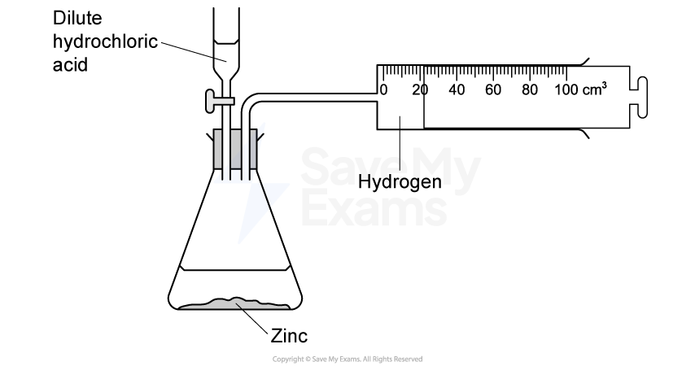

The student records the volume of hydrogen that collects every 2 minutes for 16 minutes.

The table shows his results.

| Time in minutes | Volume of hydrogen in cm3 |
|---|---|
| 0 | 0 |
| 2 | 21 |
| 4 | 39 |
| 6 | 53 |
| 8 | 57 |
| 10 | 73 |
| 12 | 76 |
| 14 | 76 |
| 16 | 76 |

(i) Plot the results on the grid.

[1]

(ii) Identify and draw a circle around the anomalous result.

[1]

(iii) Draw a curve of best fit through the points, ignoring the anomalous result.

[1]

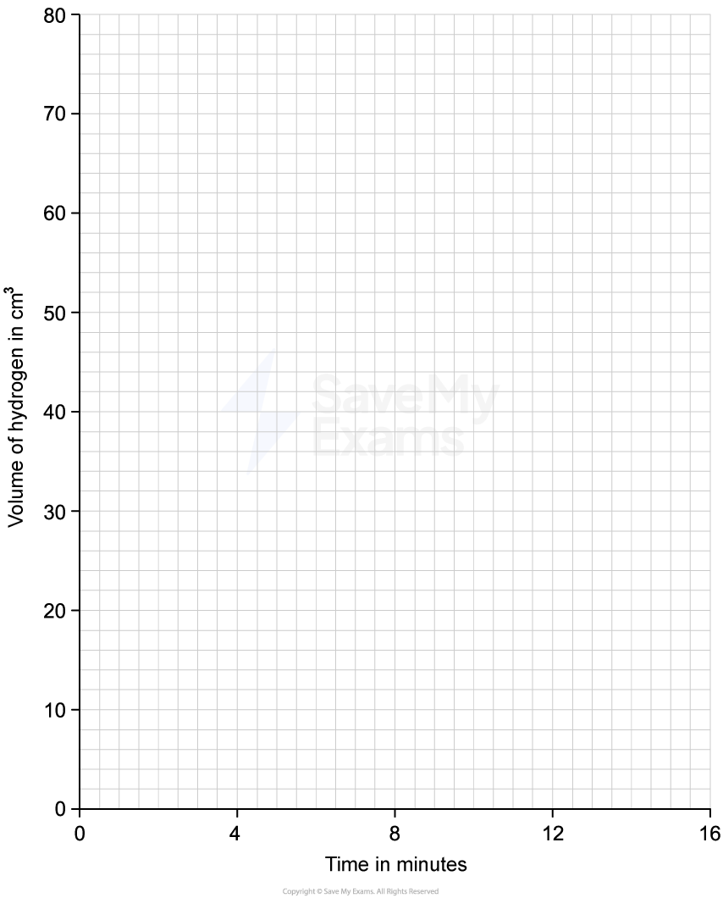

### 2 — 1 mark — command: suggest — structured
Suggest what could have caused the anomalous result.

### 2 — 2 marks — command: indicate — structured
Find the volume of hydrogen produced in the first 5 minutes.

Indicate on your graph how you determined this value.

### 2 — 5 marks — command: multiple — structured
The student repeats the experiment using hydrochloric acid with half the original concentration.

He keeps the volume of acid and all other experimental conditions unchanged.

i) On the grid, sketch the curve you would expect the student to obtain.

[2]

ii) Describe how halving the concentration of hydrochloric acid influences the reaction rate.
In your explanation, refer to particle collision theory.

[3]

## Q2 — medium — 18 marks

### 3 — 5 marks — command: multiple — structured
A student uses this apparatus to investigate the rate of reaction between excess marble chips and dilute hydrochloric acid.

i) Give the equation for the reaction.

[1]

ii) Explain what happens to the mass of the flask contents during the reaction.

[2]

iii) Explain how the result of the investigation could change if the experiment were carried out without the cotton wool.

[2]

### 3 — 4 marks — command: explain — structured
The graph shows the student's results.

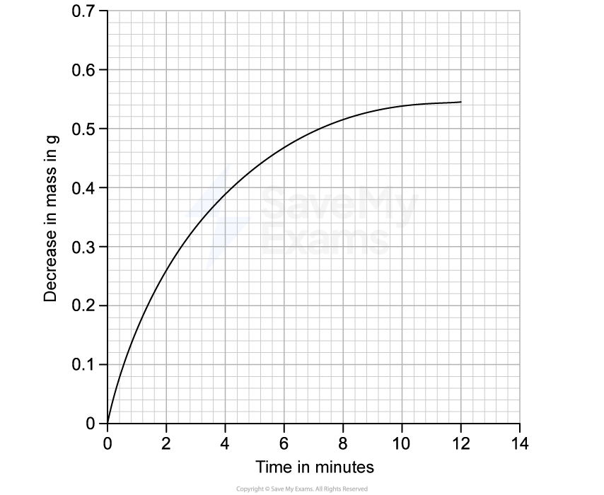

Explain the shape of the graph.

### 3 — 6 marks — command: multiple — structured
The student repeats the experiment using the same mass of smaller marble chips and the same volume and concentration of acid.

i) On the same grid, draw the shape of the curve obtained.

[2]

ii) Explain the shape of the curve with smaller chips.

[4]

### 3 — 3 marks — command: explain — structured
Explain, using collision theory, how doubling the concentration of the acid affects the rate of reaction.

## Q3 — medium — 16 marks

### 4 — 2 marks — command: give — structured
This question is about nitrogen and some of its compounds.

Nitrogen and hydrogen do not react with each other at room temperature.

At high temperatures, nitrogen and hydrogen react to form ammonia, NH3.

i) Give a chemical equation for this reaction.

[1]

ii) Give a reason why this reaction only occurs at high temperatures.

[1]

### 4 — 2 marks — command: explain — structured
The rate of the reaction is increased by passing the gases over a catalyst.

Explain how a catalyst increases the rate of a reaction.

### 4 — 3 marks — command: explain — structured
Explain how increasing the pressure of gases increases the rate of reaction.

### 4 — 6 marks — command: multiple — structured
Nitrogen is a simple molecule with the formula N2.

i) Complete the diagram to show the outer shell electrons in nitrogen.

[2]

ii) The bonds in nitrogen are covalent.

Describe the forces of attraction in a covalent bond.

[2]

ii) Explain why nitrogen has a low boiling point.

[2]

### 4 — 3 marks — command: multiple — structured
i) Describe the effect of heat on ammonium chloride.

[2]

ii) Write an equation for the reaction.

[1]

## Q4 — medium — 12 marks

### 6(a) — 3 marks — command: give — structured — from paper 2021 · Ja1CR
Zinc reacts with dilute hydrochloric acid to form hydrogen.

i) Give a chemical equation for this reaction.

(2)

ii) Give a test for hydrogen gas.

(1)

### 6(b) — 3 marks — command: multiple — structured — from paper 2021 · Ja1CR
A student investigates the reaction between pieces of zinc and dilute hydrochloric acid.

In each experiment, he uses the same mass of zinc but a different volume of the acid.

He collects the hydrogen and measures its volume in each experiment.

The graph shows the student’s results.

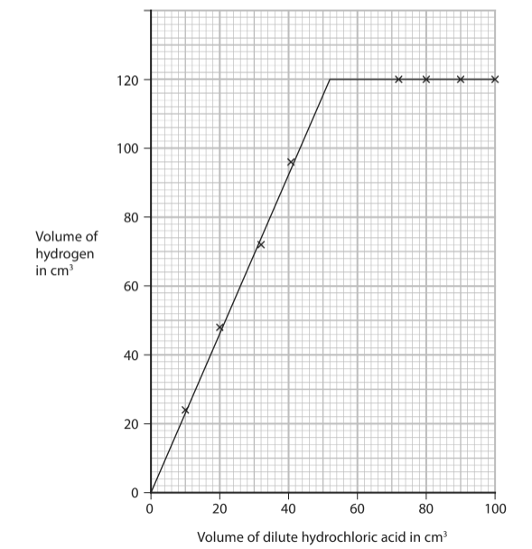

i) Use the graph to find the minimum volume of acid needed to react with all of the zinc.

(1)

ii) The student repeats the investigation, using hydrochloric acid of double the original concentration.

Determine the volume of hydrogen that would be collected using 15 cm3 of this acid.

Show your working on the graph.

(2)

volume = ............................................... cm3

### 6(c) — 3 marks — command: explain — structured — from paper 2021 · Ja1CR
Explain how increasing the concentration of the hydrochloric acid affects the rate of reaction.

### 6(d) — 3 marks — command: explain — structured — from paper 2021 · Ja1CR
The rate of reaction could also be affected by changing the temperature of the hydrochloric acid, or by using a catalyst. Explain one other way in which the rate of reaction between zinc and hydrochloric acid can be affected.

## Q5 — medium — 1 marks

### 6 — 1 mark — multiple_choice
Hydrogen peroxide, H2O2, quickly decomposes to produce water and oxygen when a catalyst is added to the solution:

2H2O2 (aq) → 2H2O (l)  + O2 (g)

The volume of gas produced was measured and is shown in the graph below:

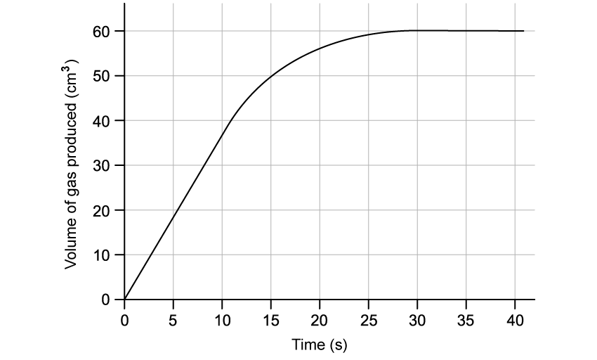

Which statement is **not** true for this reaction?
- **A.** The reaction finishes after 30 seconds
- **B.** The rate of reaction speeds up during the reaction
- **C.** The final volume of gas produced is 60 cm3
- **D.** The concentration of the hydrogen peroxide decreases during the reaction

## Q6 — medium — 5 marks

### 8(a) — 1 mark — command: state — structured — from paper 2017 · Specimen1C
The copper(II) carbonate in the mineral, malachite, reacts with hydrochloric acid according to this equation.

CuCO3 (s) + 2HCl (aq) → CuCl2 (aq) + H2O (l) + CO2 (g)

Some students investigate the effect of changing the concentration of acid on the rate of this reaction. The diagram shows the apparatus they use.

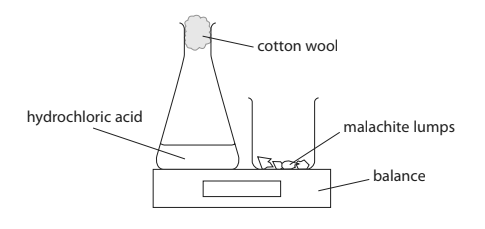

This is the method they use:

- set the balance to zero
- add an excess of malachite lumps to the conical flask and replace the cotton wool
- start a timer and record the balance reading after one minute

The experiment is repeated using different concentrations of hydrochloric acid. The mass and number of malachite lumps are kept the same in each experiment.

The table shows the results obtained in one series of experiments.

| Concentration of hydrochloric acid / mol/dm3 | 0.6 | 0.8 | 1.0 | 1.6 | 1.8 | 2.0 |
|---|---|---|---|---|---|---|
| balance reading/ g | -0.20 | -0.27 | -0.44 | -0.54 | -0.60 | -0.67 |

State why the balance readings have negative values.

### 8(b) — 2 marks — command: multiple — structured — from paper 2017 · Specimen1C
The graph shows the results of this series of experiments.

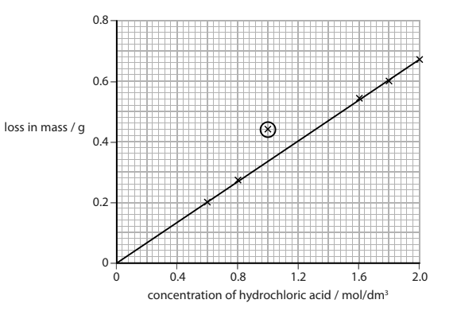

The circled point indicates an anomalous result.

i) Suggest **one** mistake the students could have made to produce this result.

(1)

ii) State the relationship shown by the graph.

(1)

### 8(c) — 2 marks — command: explain — structured — from paper 2017 · Specimen1C
Explain why an increase in the concentration of the acid causes an increase in the rate of the reaction. You should use the particle collision theory in your answer.

## Q7 — medium — 13 marks

### 5(a) — 3 marks — command: multiple — structured — from paper 2019 · Ju1CR
A student uses this apparatus to investigate the rate of reaction between marble chips and dilute hydrochloric acid.

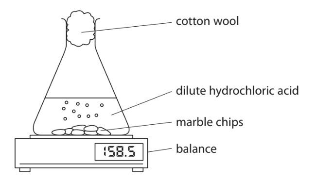

i)

Explain how using the cotton wool increases the accuracy of this investigation.

(2)

ii)

Why is mass lost from the flask?

| ☐ | **A** | acid particles are moving |
|---|---|---|
| ☐ | **B** | gas is given off |
| ☐ | **C** | heat energy is produced |
| ☐ | **D** | marble chips are dissolving |

(1)

### 5(b) — 2 marks — command: add — structured — from paper 2015 · Ju1CR
This is the equation for the reaction between marble chips and dilute hydrochloric acid. Complete the equation by adding the state symbols.

CaCO3 (.........) + 2HCl (.........) → CaCl2 (.........) + H2O (.........) + CO2 (.........)

### 5(c) — 2 marks — command: draw — structured — from paper 2015 · Ju1CR
The student uses large marble chips in the investigation. This is a graph of his results.

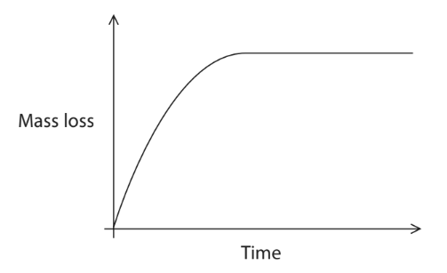

The student repeats the experiment using the same total mass of smaller marble chips. On the graph, draw the curve that would be obtained. [assume the marble chips are in excess]

### 5(d) — 6 marks — command: explain — structured — from paper 2019 · Ju1CR
The rate of this reaction can be altered by increasing the temperature or by increasing the concentration of the hydrochloric acid.

i) Explain, using the particle collision theory, how increasing the concentration of the hydrochloric acid would affect the rate of this reaction.

(3)

ii) Explain, using the particle collision theory, how increasing the temperature would affect the rate of this reaction.

(3)

## Q8 — easy — 1 marks

### 9 — 1 mark — multiple_choice
A student wants to investigate the effect of surface area on the rate of reaction between marble chips and dilute acid.

What pieces of apparatus could be used for this investigation?
- **A.** Burette, beaker, pipette
- **B.** Ruler, thermometer, test tube
- **C.** Measuring cylinder, delivery tube, stopwatch
- **D.** Filter funnel, evaporating basin, Bunsen burner

## Q9 — hard — 14 marks

### 7(a) — 1 mark — command: state — structured — from paper 2020 · Nov1C
Dilute hydrochloric acid reacts with a solution of sodium thiosulfate (Na2S2O3) to form a precipitate.

The equation for the reaction is

Na2S2O3 (aq) + 2HCl (aq) → 2NaCl (aq) + S (s) + H2O (l) + SO2 (g)

State the name of the precipitate that forms.

### 7(b) — 2 marks — command: give — structured — from paper 2020 · Nov1C
The reaction is often used to investigate rates of reaction.

The diagram shows the apparatus a student uses to investigate the effect of temperature on the rate of the reaction.

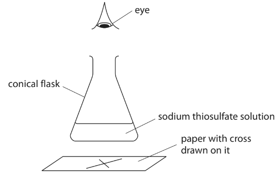

This is the student’s method.

- Pour 50 cm3 of cold sodium thiosulfate solution into a conical flask and heat it to 20 °C
- Draw a cross (X) on a piece of paper and place it under the flask
- Add 5 cm3 of dilute hydrochloric acid to the flask
- Look at the cross from above and record the time taken until the cross cannot be seen

The student repeats the experiment four times, using sodium thiosulfate solution at a different temperature each time.

He keeps the volumes of sodium thiosulfate solution and hydrochloric acid constant in each experiment.

Give two other factors that the student should keep constant.

1 ....................................................................................................

2 ....................................................................................................

### 7(c) — 1 mark — command: suggest — structured — from paper 2020 · Nov1C
The table shows the student’s results.

| **Temperature in °C** | **Time until cross cannot be seen in s** |
|---|---|
| 20 | 400 |
| 30 | 188 |
| 40 | 84 |
| 50 | 44 |
| 60 | 24 |

The highest temperature the student uses is 60 °C because he thinks the results might not be as accurate at temperatures higher than 60 °C.

Suggest a reason why the results might not be as accurate at temperatures higher than 60 °C.

### 7(d) — 2 marks — command: plot — structured — from paper 2020 · Nov1C
The student wants to compare the rates of the reaction at the different temperatures.

He uses this formula to obtain a value for each rate of reaction

rate = $\frac{1}{\mathrm{time} \mathrm{in}s}$

The table shows the value of the rate of reaction at each temperature.

| **Temperature in °C** | **Time until cross cannot be seen in s** | **Rate of reaction in s****-1** |
|---|---|---|
| 20 | 400 | 0.0025 |
| 30 | 188 | 0.0053 |
| 40 | 84 | 0.012 |
| 50 | 44 | 0.023 |
| 60 | 24 | 0.042 |

Plot the values of temperature and rate of reaction on the grid.

Draw a curve of best fit through the points.

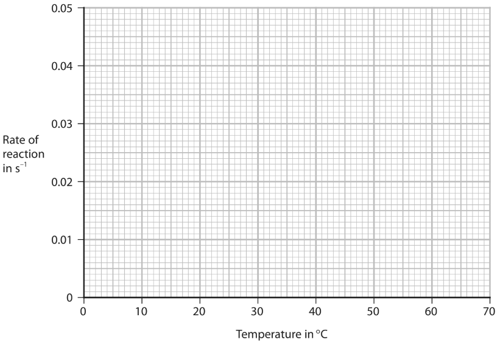

### 7(e) — 5 marks — command: multiple — structured — from paper 2020 · Nov1C
i) Use the graph to determine a value for the rate of the reaction at 45 °C.

Show on the graph how you obtained your answer.

(2)

rate of reaction = .............................................................. s−1

ii) Calculate the time that it would take for the cross not to be seen at 45 °C.

(2)

time = .............................................................. s

iii) Describe the relationship between rate of reaction and temperature shown by the graph.

(1)

### 7(f) — 3 marks — command: explain — structured — from paper 2020 · Nov1C
Explain, in terms of particle collision theory, the effect that increasing the temperature has on the rate of a reaction.

## Q10 — hard — 13 marks

### 5(a) — 1 mark — command: state — structured — from paper 2021 · Jan2CR
Hydrogen peroxide solution decomposes slowly at room temperature to form water and oxygen. The equation for the reaction is

2H2O2 → 2H2O + O2

A catalyst increases the rate of this reaction. State one other property of a catalyst.

### 5(b) — 6 marks — command: describe — structured — from paper 2021 · Jan2CR
A student has samples of three solids, X, Y and Z. The student uses this apparatus to find out which solids act as catalysts in the decomposition of hydrogen peroxide solution.

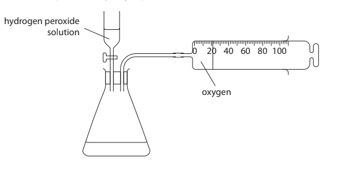

Describe the method that the student should use to find out which solids act as catalysts.

### 5(c) — 2 marks — command: draw — structured — from paper 2021 · Jan2CR
The decomposition of hydrogen peroxide solution is exothermic.

On the diagram, draw and label the reaction profiles for the reaction

- without a catalyst
- with a catalyst

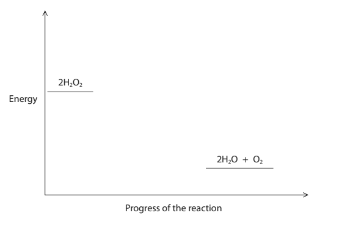

### 5(d) — 4 marks — command: calculate — structured — from paper 2021 · Jan2CR
The equation for the reaction can be shown using displayed formulae.

2H-O-O-H → 2H-O-H + O=O    Δ*H* = –204kJ

The table gives the bond energies for the two of the bonds

| **Bond ** | **Bond energy in kJ/mol** |
|---|---|
| H-O | 463 |
| O-O | 146 |

i)Use this information to calculate the total amount of energy needed to break all the bonds in two moles of H2O2.

(1)

energy needed = .............................................................. kJ

ii) Use this information to calculate the total amount of energy released when all the bonds in two moles of H2O are formed.

(1)

energy released = .............................................................. kJ

iii) Use the value of Δ*H* and your answers for (i) and (ii) to calculate the bond energy, in kJ/mol, for the O=O bond.

(2)

bond energy = .............................................................. kJ/mol

## Q11 — hard — 15 marks

### 9(a) — 2 marks — command: explain — structured — from paper 2022 · Jan1C
A student uses this apparatus to investigate the rate of reaction between calcium carbonate chips and dilute hydrochloric acid.

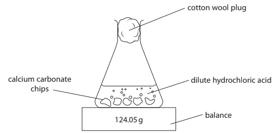

Every 20 seconds the student records the reading on the balance.

Explain why using a cotton wool plug increases the accuracy of the student’s results.

### 9(b) — 2 marks — command: complete — structured — from paper 2022 · Jan1C
Complete the equation for the reaction by adding the state symbols.

CaCO3 (..........) + 2HCl (..........) → CaCl2 (aq) + H2O (..........) + CO2 (..........)

### 9(c) — 7 marks — command: multiple — structured — from paper 2022 · Jan1C
The student uses the balance readings to find the decrease in mass of the flask and contents.

The graph shows the student’s results.

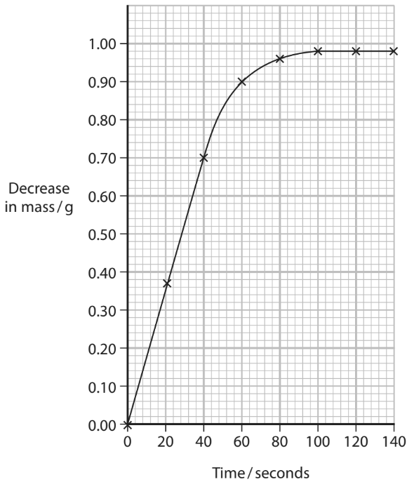

i) Give a reason why there are some calcium carbonate chips remaining in the flask when the reaction stops.

(1)

ii) State how the student would know when the reaction has stopped.

(1)

iii) Use the graph to determine the amount, in moles, of carbon dioxide produced during the reaction.

[*M*r of CO2 = 44]

(2)

amount = .............................. mol

iv) Use the graph to calculate the rate of reaction, in grams per second, at time 60 seconds.

Show your working on the graph.

(3)

rate of reaction = .............................. g / s

### 9(d) — 4 marks — command: multiple — structured — from paper 2022 · Jan1C
The student repeats the investigation by diluting the original hydrochloric acid.

The student then determines the initial rate of reaction at different percentage concentrations of the original hydrochloric acid.

The graph shows the student’s results.

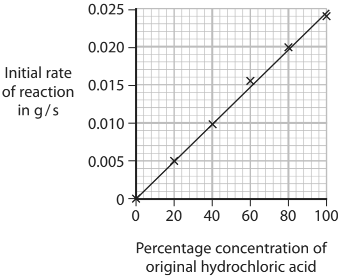

i) Describe the relationship between the initial rate of reaction and percentage concentration of the original hydrochloric acid.

(2)

ii) Explain why changing the concentration of hydrochloric acid has an effect on the initial rate of reaction.

(2)

## Q12 — hard — 15 marks

### 8(a) — 1 mark — command: add — structured — from paper 2022 · Jan1CR
A student uses this apparatus in an experiment to study the rate of the reaction between zinc and dilute sulfuric acid.

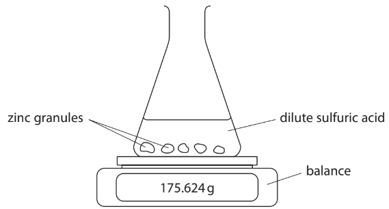

This is the student’s method.

- Add a few zinc granules to a conical flask on a balance
- Add 100 cm3 of dilute sulfuric acid to the flask, start a timer and immediately record the mass of the flask and contents
- Record the mass of the flask and contents every minute until the mass remains constant

The mass of the flask and contents decreases because hydrogen gas is produced and leaves the flask.

The student uses the mass readings to calculate the total mass of hydrogen produced.

Complete the equation for the reaction by adding the state symbols.

Zn (................) + H2SO4 (................) → ZnSO4 (................) + H2 (................)

### 8(b) — 5 marks — command: multiple — structured — from paper 2022 · Jan1CR
The table shows the student’s results.

| **Time in minutes** | **Total mass of hydrogen produced in mg** |
|---|---|
| 0 | 0 |
| 1 | 80 |
| 2 | 110 |
| 3 | 130 |
| 4 | 148 |
| 5 | 162 |
| 6 | 165 |
| 7 | 184 |
| 8 | 192 |
| 9 | 198 |
| 10 | 204 |
| 11 | 209 |
| 12 | 214 |
| 13 | 218 |
| 14 | 220 |
| 15 | 220 |

i) Plot the student’s results. The first three have been done for you.

(1)

ii) Draw a circle around the anomalous result.

(1)

iii) Draw a curve of best fit.

(1)

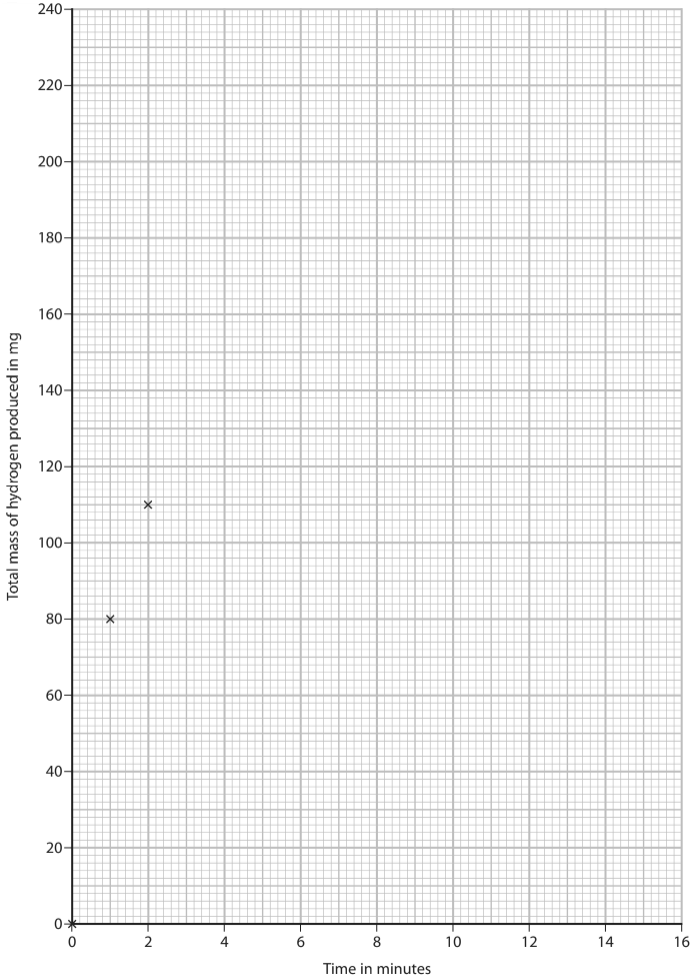

iv) Give a possible reason for the anomalous result.

(1)

v) Determine a more likely value for this result.

(1)

### 8(c) — 3 marks — command: multiple — structured — from paper 2022 · Jan1CR
i) Explain how the shape of the curve shows how the rate of the reaction changes as time increases.

(2)

ii) At the end of the experiment there is no zinc left in the flask.

Give a conclusion the student could make from this observation.

(1)

### 8(d) — 3 marks — command: explain — structured — from paper 2022 · Jan1CR
The student does another experiment using

- the same amount of similarly sized magnesium granules instead of zinc
- the same volume of sulfuric acid, but of a lower concentration

Explain why it is difficult to predict how the rate of reaction in this experiment compares with the rate of reaction in the first experiment.

### 8(e) — 3 marks — command: explain — structured — from paper 2022 · Jan1CR
Explain, in terms of particle collision theory, how increasing the temperature affects the rate of a reaction.

## Q13 — easy — 1 marks

### 14 — 1 mark — multiple_choice
A student draws the reaction profiles shown below for a reaction both with and without a catalyst.

Which statement is correct about the reaction profile?
- **A.** **X** shows the activation energy of the catalysed reaction
- **B.** **Z** shows Δ*H*
- **C.** The activation energy of the uncatalysed reaction pathway is less than that of the catalysed reaction pathway
- **D.** The reaction is endothermic

## Q14 — medium — 15 marks

### 6(a) — 4 marks — command: describe — structured — from paper 2020 · Ja2CR
This question is about ethane and ethene.

Ethane can be obtained from crude oil. Describe the industrial process used to separate crude oil into fractions.

### 6(b) — 8 marks — command: multiple — structured — from paper 2020 · Ja2CR
The equation for the reaction between ethene gas and hydrogen gas is

C2H4 + H2 →  C2H6

i) The rate of this reaction can be increased by increasing the pressure. Explain why increasing the pressure increases the rate of this reaction.

(2)

ii) The rate of this reaction can also be increased by using a catalyst. Explain how using a catalyst increases the rate of a reaction.

(2)

iii) Give one other way that the rate of reaction between ethene gas and hydrogen gas can be increased.

(1)

iv) The reaction between ethene and hydrogen is exothermic. Complete the reaction profile diagram, including labels for the activation energy and the enthalpy change, Δ*H*.

(3)

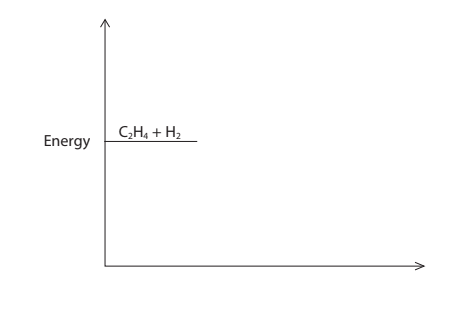

### 6(c) — 3 marks — command: calculate — structured — from paper 2020 · Ja2CR
The reaction between ethene and hydrogen can be represented using displayed formulae.

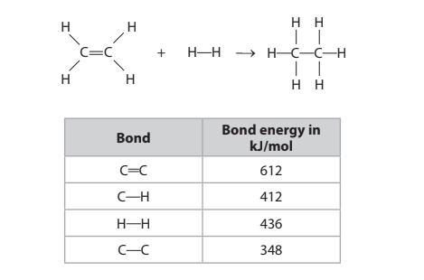

Use the bond energies in the table to calculate the enthalpy change, Δ*H*, in kJ/mol for this reaction.

Δ*H* = .............................................................. kJ/mol

## Q15 — medium — 8 marks

### 5(a) — 5 marks — command: describe — structured — from paper 2022 · Jan1C
Hydrogen peroxide solution decomposes to give water and oxygen gas.

The equation for this reaction is:

2H2O2 (aq) → 2H2O (l) + O2 (g)

Three different solids are catalysts for the decomposition of hydrogen peroxide solution.

A student is given hydrogen peroxide solution and a sample of each of the solid catalysts.

The student has a timer, a measuring cylinder, a balance and the apparatus shown in the diagram.

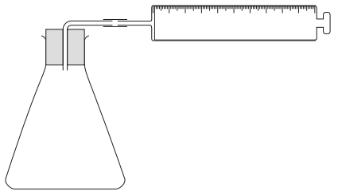

Describe a method the student could use to find which of the three solids is the most effective catalyst for the decomposition of hydrogen peroxide solution.

### 5(b) — 3 marks — command: multiple — structured — from paper 2022 · Jan2C
The diagram shows the reaction profile for the decomposition of hydrogen peroxide without a catalyst.

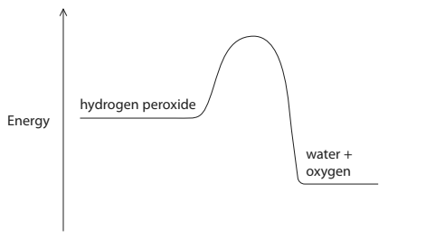

i) Label the diagram to show the activation energy (*E*a) and the enthalpy change (Δ*H*) for this reaction.

(2)

ii) On the diagram, draw a curve to show the reaction profile for the same reaction when a catalyst is used.

(1)

## Q16 — easy — 1 marks

### 17 — 1 mark — multiple_choice
Calcium carbonate reacts with hydrochloric acid to produce calcium chloride, water and carbon dioxide:

CaCO3 (s) + 2HCl (aq) → CaCl2 (aq) + H2O (l) + CO2 (g)

Which statement is **not** true if the temperature of the reaction decreases?
- **A.** The frequency of the collisions between particles decreases
- **B.** The collisions are less energetic
- **C.** The activation energy increases
- **D.** There are fewer particles with the minimum energy to react

## Q17 — easy — 1 marks

### 18 — 1 mark — multiple_choice
Some students investigate the rate of reaction between marble chips and hydrochloric acid.

The diagram shows the apparatus they use.

What is the purpose of the cotton wool?
- **A.** To prevent carbon dioxide gas from escaping
- **B.** To ensure the mass stays constant throughout the experiment
- **C.** To prevent the acid from leaving the conical flask
- **D.** To prevent oxygen entering the conical flask

## Q18 — easy — 1 marks

### 19 — 1 mark — multiple_choice
Which of these statements about catalysts is **not** correct?
- **A.** The mass of the catalyst at the start of the reaction is the same at the end of the reaction
- **B.** Catalysts increase the rate of reaction but do not increase the yield
- **C.** Catalysts are not chemically changed during the course of the reaction
- **D.** Catalysts provide an alternative reaction pathway which has a lower activation energy

## Q19 — easy — 1 marks

### 20 — 1 mark — multiple_choice
Magnesium metal reacts with an excess of hydrochloric acid solution to form magnesium chloride and hydrogen:

Mg (s) + 2HCl (aq) → MgCl2 (aq) + H2 (g)

Which of the following will **not** increase the rate of this reaction?
- **A.** Increase the temperature of the acid
- **B.** Increase the surface area of the pieces of magnesium
- **C.** Increase the concentration of the hydrochloric acid
- **D.** Increase the volume of hydrochloric acid solution used

## Q20 — medium — 14 marks

### 4(a) — 1 mark — command: complete — structured — from paper 2020 · Nov1CR
A solution of hydrogen peroxide decomposes when a catalyst of manganese(IV) oxide is added.

The products of the reaction are water and oxygen.

Complete the chemical equation for this reaction.

............ H2O2 → ........... H2O + ........... O2

### 4(b) — 1 mark — command: give — structured — from paper 2020 · Nov1CR
Give a test for oxygen.

### 4(c) — 1 mark — command: state — structured — from paper 2020 · Nov1CR
State the reason for adding a catalyst.

### 4(d) — 6 marks — command: multiple — structured — from paper 2020 · Nov1CR
A student investigates how changing the concentration of the hydrogen peroxide solution affects the rate of this reaction.

She uses this apparatus.

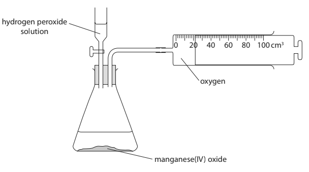

The student records the volume of oxygen that collects every 2 minutes for 16 minutes.

The table shows her results.

| **Time in minutes ** | 0 | 2 | 4 | 6 | 8 | 10 | 12 | 14 | 16 |
|---|---|---|---|---|---|---|---|---|---|
| **Volume of oxygen / cm****3** | 0 | 22 | 38 | 50 | 55 | 69 | 76 | 80 | 80 |

i) Plot the student’s results on the grid.

(1)

ii) Draw a circle on the grid around the anomalous result.

(1)

iii) Draw a curve of best fit through the points, ignoring the anomalous result.

(1)

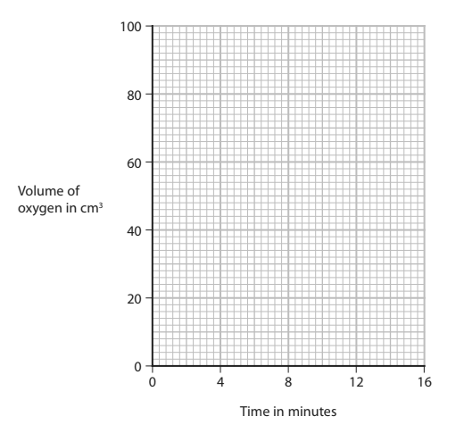

iv) Suggest a mistake that the student might have made to cause the anomalous result.

(1)

v) Determine the volume of oxygen collected during the first 3 minutes. Show on your graph how you obtain your answer.

(2)

volume of oxygen = ............................................... cm3

### 4(e) — 5 marks — command: multiple — structured — from paper 2020 · Nov1CR
The student repeats the experiment using hydrogen peroxide solution of half the concentration of the original solution. She keeps the volume of the hydrogen peroxide solution and all other conditions the same.

i) Draw on the grid the curve you would expect the student to obtain.

(2)

ii) Explain how using hydrogen peroxide solution of half the concentration affects the rate of the reaction.

Refer to particle collision theory in your answer.

(3)

## Q21 — hard — 12 marks

### 13(a) — 2 marks — command: multiple — structured — from paper 2019 · Ju1C
A student uses this apparatus to investigate the rate of reaction between magnesium and an excess of dilute hydrochloric acid.

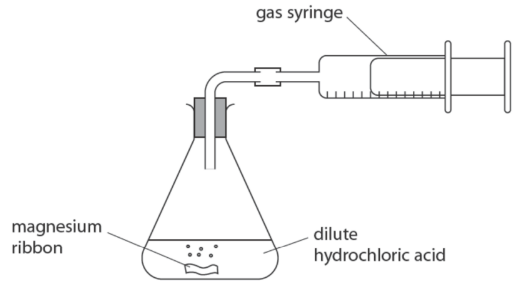

She uses this method.

- use a graduated beaker to pour 50 cm3 of dilute hydrochloric acid of concentration 2.00 mol / dm3 into the conical flask
- add a piece of magnesium ribbon of mass 0.086 g to the acid and put the bung into the neck of the flask
- measure the total volume of gas collected every ten seconds until the reaction stops

The table shows the student's results.

| **Time in s** | **Volume of hydrogen in cm****3**** ** |
|---|---|
| 0 | 0 |
| 10 | 29 |
| 20 | 52 |
| 30 | 67 |
| 40 | 76 |
| 50 | 81 |
| 60 | 84 |
| 70 | 84 |
| 80 | 84 |

i) Plot the student's results on the grid.

(1)

ii) Draw a curve of best fit

(1)

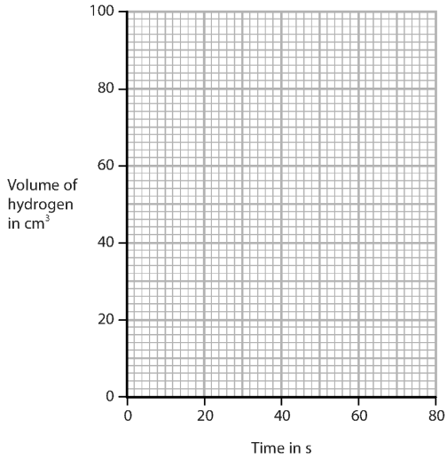

### 13(b) — 4 marks — command: draw — structured — from paper 2019 · Ju1C
i) The student repeats the experiment using

- 0.043 g of magnesium ribbon
- 50 cm3 of 2.00 mol / dm3 hydrochloric acid

Draw, on the grid in part (a), the curve you would expect in this experiment.

Label this curve Y.

(2)

ii) The student repeats the experiment again, using

- 0.086 g of magnesium ribbon
- 50 cm3 of 2.00 mol / dm3 hydrochloric acid
- a slightly higher temperature than the first experiment

Draw, on the grid in part (a), the curve you would expect in this experiment.

Label this curve Z.

(2)

### 13(c) — 1 mark — command: suggest — structured — from paper 2019 · Ju1C
The expected volume of gas produced in the first experiment is 86 cm3.

Suggest why the volume collected is less than the expected volume.

### 13(d) — 2 marks — command: explain — structured — from paper 2019 · Ju1C
The student uses a graduated beaker to measure the volume of dilute hydrochloric acid. Explain why it is **not** necessary to use a measuring cylinder in this experiment.

### 13(e) — 3 marks — command: explain — structured — from paper 2019 · Ju1C
The ionic equation for the reaction between magnesium and hydrochloric acid is

Mg (s) + 2H+ (aq) → Mg2+ (aq) + H2 (g)

Use the information in this equation, and the particle collision theory, to explain why the rate of reaction decreases during each of the experiments.

## Q22 — hard — 15 marks

### 11(a) — 4 marks — command: multiple — structured — from paper 2021 · Ja1C
This question is about reactions that form gases.

Hydrogen peroxide decomposes to form water and oxygen. The equation for the reaction is

2H2O2 → 2H2O + O2

25.0 cm3 of hydrogen peroxide solution are poured into a conical flask and 1.00 g of solid manganese(IV) oxide is added. Bubbles of oxygen gas are formed.

i) Give the test for oxygen gas.

(1)

ii) Describe a method to show that solid manganese(IV) oxide is a catalyst in this reaction and not a reactant.

(3)

### 11(b) — 9 marks — command: multiple — structured — from paper 2021 · Ja1C
A student uses this apparatus to investigate the rate of the reaction between zinc and an excess of dilute hydrochloric acid.

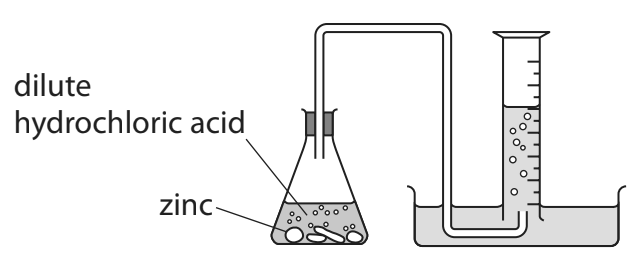

This is the student’s method.

- pour 50 cm3 of dilute hydrochloric acid into a conical flask
- add about 1.2 g of zinc lumps
- record the volume of hydrogen gas collected every 30 s until no more hydrogen is collected

The graph shows the student’s results.

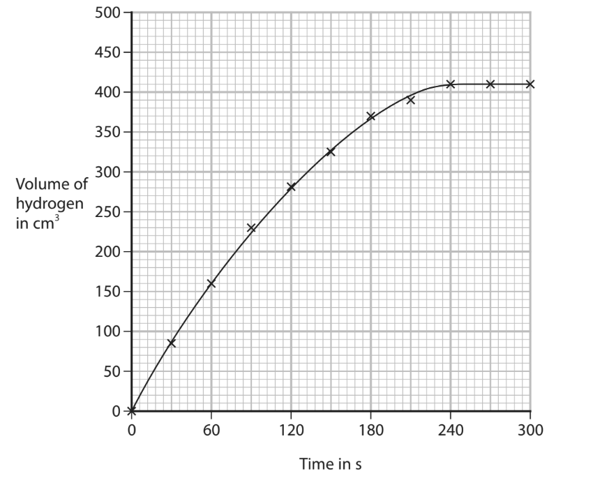

i) Calculate the mean (average) rate of reaction, in cm3 / s, in the first 120 s.

(2)

mean rate = .............................................................. cm3 / s

ii) The equation for the reaction between zinc and hydrochloric acid is

Zn (s) + 2HCl (aq) → ZnCl2 (aq) + H2 (g)

Use this equation and the particle collision theory to explain why the rate of reaction is greatest at the start of the reaction.

(3)

iii) The student repeats the experiment at a higher temperature but keeps all other conditions the same. On the grid, draw the curve you would expect to see in this experiment.

(2)

iv) Explain why the rate of reaction is greater if the same mass of zinc powder is used instead of zinc lumps. All other conditions are kept the same.

(2)

### 11(c) — 2 marks — command: show — structured — from paper 2021 · Ja1C
In another experiment, the student adds 0.55 g of zinc to a solution containing 2.50 × 10−2 moles of hydrochloric acid. Use the equation to show that hydrochloric acid is in excess.

Zn (s) + 2HCl (aq) → ZnCl2 (aq) + H2 (g)

[*A*r of Zn = 65]

## Q23 — easy — 1 marks

### 24 — 1 mark — multiple_choice
A student investigates the rate of reaction between an **excess **of hydrochloric acid and a limiting mass of magnesium using the apparatus shown:

Which of the graphs could represent her results?

- **A.** 
- **B.** 
- **C.** 
- **D.** 

## Q24 — hard — 14 marks

### 9(a) — 4 marks — command: multiple — structured — from paper 2021 · Ju1C
A student uses this apparatus to investigate the rate of reaction between marble chips and dilute hydrochloric acid.

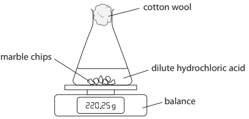

The equation for the reaction is

CaCO3 + 2HCl → CaCl2 + H2O + CO2

During the reaction the mass of the contents of the flask decreases.

i) State why the mass of the contents of the flask decreases.

(1)

ii) State the purpose of the cotton wool.

(1)

iii) Explain why sulfuric acid is not a suitable acid to use in this investigation.

(2)

### 9(b) — 6 marks — command: multiple — structured — from paper 2021 · Ju1C
The graph shows the student’s results.

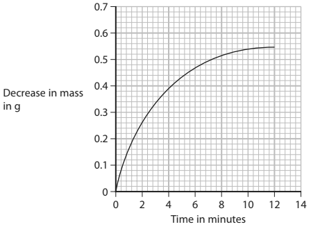

i) In the investigation the marble chips are in excess.

Explain the shape of the graph.

(4)

ii) The student repeats the experiment using the same volume of hydrochloric acid but of half the concentration of the original acid. All other conditions are kept the same.

On the grid, draw the curve the student would obtain.

(2)

### 9(c) — 4 marks — command: explain — structured — from paper 2021 · Ju1C
Explain, using particle collision theory, how increasing the temperature affects the rate of a reaction.
