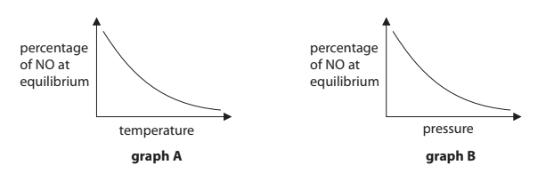
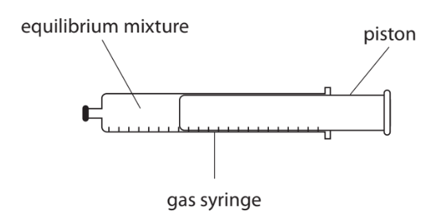
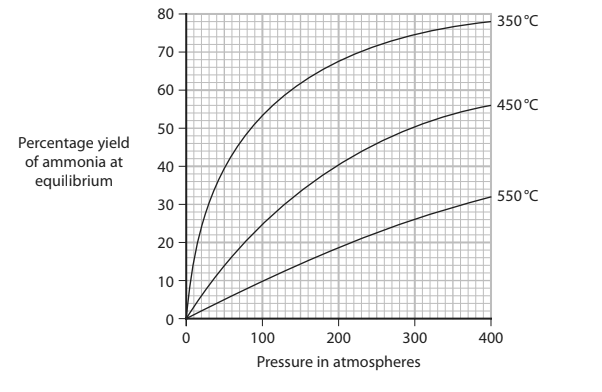

# Exam Questions — Reversible Reactions & Equilibria
**3. Physical Chemistry** · Edexcel IGCSE Chemistry 4CH1
> Source: [https://www.savemyexams.com/igcse/chemistry/edexcel/19/topic-questions/3-physical-chemistry/3-3-reversible-reactions-and-equilibria/exam-questions/](https://www.savemyexams.com/igcse/chemistry/edexcel/19/topic-questions/3-physical-chemistry/3-3-reversible-reactions-and-equilibria/exam-questions/) · 16 questions · total 101 marks

## Q1 — medium — 9 marks

### 2 — 2 marks — command: give — structured
This question is about reversible reactions and equilibria.

Give two characteristics of a dynamic equilibrium.

### 2 — 4 marks — command: multiple — structured
Ethanol and ethanoic acid react together in a dynamic equilibrium.

The reaction is exothermic.

The equation for the reaction is:

C2H5OH (aq) + CH3COOH (aq) $\rightleftharpoons$ CH3COOC2H5 (aq) + H2O (l)

i) Give the name of the organic product

[1]

ii) Predict the effect on the yield of increasing the reaction temperature. Give a reason for your answer.

[2]

iii) The reaction is catalysed by concentrated sulfuric acid. Predict the effect of the catalyst on the reaction yield at equilibrium.

[1]

### 2 — 3 marks — command: draw — structured
Draw an enthalpy level diagram for the reaction between ethanol and ethanoic acid.

Label the enthalpy change, $\Delta$*H*

## Q2 — medium — 1 marks

### 3 — 1 mark — multiple_choice
The gasification of carbon is a reversible endothermic reaction:

C (s) + H2O (g) $\rightleftharpoons$ CO (g) + H2 (g)

Which of the following conditions could be changed to increase the relative amount of H2 gas produced?
- **A.** Increase the surface area to volume ratio of the carbon
- **B.** Increase the pressure
- **C.** Increase the temperature
- **D.** Add a catalyst

## Q3 — easy — 6 marks

### 4 — 2 marks — command: place — structured
When hydrogen gas is heated with iodine gas, hydrogen iodide gas is produced.

The equation for this reversible reaction is:

hydrogen  +  iodine  ⇌  hydrogen iodide

This reversible reaction reaches equilibrium in a sealed container.

Place ticks in boxes by the two statements that are correct for when the reaction reaches equilibrium

| The forward reaction and reverse reaction are both exothermic |   |
|---|---|
| The mass of each substance does not change |   |
| The hydrogen no longer reacts with iodine |   |
| The rates of the forward reaction and reverse reaction are equal |   |
| The gases have escaped from the container |   |

### 4 — 1 mark — command: name — structured
The forward reaction is exothermic.  Name the type of energy change in the reverse reaction.

### 4 — 1 mark — multiple_choice
Hydrogen iodide is colourless.

The colour of hydrogen and iodine in the initial mixture is purple.

When equilibrium is reached, how will the colour of the mixture have changed?
- **A.** The mixture will have become a paler purple
- **B.** The mixture will have become a deeper purple
- **C.** The mixture will have become colourless
- **D.** The colour of the mixture will remain unchanged

### 4 — 2 marks — command: state — structured
Changes to the reaction conditions will move the position of the equilibrium.

State two of these reaction conditions.

## Q4 — hard — 11 marks

### 7(a) — 1 mark — multiple_choice — from paper 2018 · Ju1H
The industrial production of sulfuric acid involves several steps.

One of these steps is the reaction of sulfur dioxide, SO2, with oxygen to form sulfur trioxide, SO3.

2SO2 (g) + O2 (g) $\rightleftharpoons$2SO3 (g)

What volume of sulfur trioxide, in dm3, is produced by the complete reaction of 750 dm3 of sulfur dioxide? (all volumes of gases are measured under the same conditions of temperature and pressure)
- **A.** 375.5
- **B.** 750
- **C.** 1125.5
- **D.** 1500

### 7(b) — 1 mark — command: calculate — structured — from paper 2018 · Ju1H
Calculate the volume of oxygen needed to react completely with 750 dm3 of sulfur dioxide. (all volumes of gases are measured under the same conditions of temperature and pressure)

volume of oxygen = .............................. dm3

### 7(c) — 3 marks — command: calculate — structured — from paper 2018 · Ju1H
Calculate the mass, in kilograms, of 750 dm3 of sulfur dioxide, measured at room temperature and pressure.

(relative formula mass: SO2 = 64; 
1 mol of any gas at room temperature and pressure occupies 24 dm3)

### 7(d) — 6 marks — command: explain — structured — from paper 2018 · Ju1H
The reaction to produce sulfur trioxide reaches an equilibrium.

2SO2 (g) + O2 (g) $\rightleftharpoons$2SO3 (g)

The forward reaction is exothermic. The rate of attainment of equilibrium and the equilibrium yield of sulfur trioxide are affected by pressure and temperature.

A manufacturer considered two sets of conditions, A and B, for this reaction.

In each case sulfur dioxide is mixed with excess oxygen.

The manufacturer changed the temperature and the pressure and only used a catalyst in B.

The sets of conditions A and B are shown in Figure 7.

| set of conditions | pressure in atm | temperature in °C | catalyst |
|---|---|---|---|
| A | 2 | 680 | no catalyst used |
| B | 4 | 425 | catalyst used |

**Figure 7**

The manufacturer chooses set of conditions B rather than set of conditions A.

Explain, by considering the effect of changing the conditions on the rate of attainment of equilibrium and on the equilibrium yield of sulfur trioxide, why the manufacturer chooses the set of conditions B rather than the set of conditions A.

## Q5 — easy — 1 marks

### 6 — 1 mark — multiple_choice
The diagram shows a test tube containing ammonium chloride that has been heated gently.

Which two gases are present at position Y?
- **A.** Ammonia and hydrogen chloride
- **B.** Ammonia and chlorine
- **C.** Hydrogen and chlorine
- **D.** Ammonia and hydrogen

## Q6 — hard — 9 marks

### 7(a) — 6 marks — command: explain — structured — from paper 2017 · Specimen2C
Ammonia is manufactured on a large scale and is used to make fertilisers such as ammonium nitrate (NH4NO3).

The first stage in the manufacture of ammonium nitrate is to react ammonia gas with oxygen gas.

4NH3 (g) + 5O2 (g) $\rightleftharpoons$ 4NO (g) + 6H2O (g)    Δ*H* = −907 kJ/mol

The reaction is carried out at a pressure of about 10 atm and at a temperature of 800 °C, in the presence of a catalyst.

If the mixture is left for long enough in a sealed container, the reaction reaches a position of dynamic equilibrium.

Graph A shows how the percentage of nitrogen monoxide (NO) in the equilibrium mixture varies with temperature at constant pressure.

Graph B shows how the percentage of nitrogen monoxide (NO) in the equilibrium mixture varies with pressure at a constant temperature.

i) Explain why the percentage of NO at equilibrium decreases in each case.

Graph A:

Graph B:

(4)

ii) Explain why the use of a catalyst has no effect on the position of equilibrium in a reversible reaction.

(2)

### 7(b) — 3 marks — command: multiple — structured — from paper 2017 · Specimen2C
The second stage in the manufacture of ammonium nitrate is to convert the nitrogen monoxide into nitric acid. The nitric acid is then reacted with concentrated aqueous ammonia as shown in this equation.

HNO3 (aq) + NH3 (aq) → NH4NO3 (aq)

i) State, in terms of proton transfer, why this reaction is classified as an acid-base reaction.

(1)

ii) Calculate the volume of 14.8 mol/dm3 aqueous ammonia that is required to exactly neutralise 150 dm3 of a solution of nitric acid of concentration 15.8 mol/dm3.

(2)

## Q7 — hard — 8 marks

### 7(a) — 2 marks — command: explain — structured — from paper 2019 · Ju2C
Dinitrogen tetraoxide, N2O4, is a colourless gas.

Nitrogen dioxide, NO2, is a brown gas.

The two gases can exist together in dynamic equilibrium according to the equation:

N2O4(g)    $\rightleftharpoons$     2NO2(g)

Explain what is meant by the term dynamic equilibrium.

### 7(b) — 3 marks — command: multiple — structured — from paper 2019 · Ju2C
Some N2O4 and some NO2 are put into a sealed gas syringe and allowed to form an equilibrium mixture.

This equilibrium mixture is brown.

i) The pressure of the gas in the syringe is increased by pushing in the piston. The mixture is then allowed to reach a new equilibrium at the same temperature as before.

Explain why the new equilibrium mixture contains less NO2 than the original equilibrium mixture.

(2)

ii) A student suggests that the new equilibrium mixture would be lighter in colour than the original equilibrium mixture, as there is now less NO2 present.

Suggest why the new equilibrium mixture is actually darker than the original.

(1)

### 7(c) — 3 marks — command: multiple — structured — from paper 2019 · Ju2C
Carbon monoxide, CO, and oxides of nitrogen are produced in a car engine when petrol is burned.

These oxides can be partly removed by using a catalytic converter fitted to the car’s exhaust system.

i)State how oxides of nitrogen are produced in the car engine.

(1)

ii) Give a disadvantage of allowing oxides of nitrogen to escape into the atmosphere.

(1)

iii) Write a chemical equation for the reaction between nitrogen monoxide, NO, and carbon monoxide to form carbon dioxide and nitrogen.

(1)

## Q8 — medium — 9 marks

### 7(a) — 1 mark — command: what — structured — from paper 2019 · Ju2CR
Hydrogen gas can be produced by reacting a mixture of methane and steam in the presence of a nickel catalyst.

The reaction conditions are a temperature of 700°C and a pressure of 5 atmospheres.

The equation for the reaction is

CH4 (g) + H2O (g) $\rightleftharpoons$ CO (g) + 3H2 (g)                 Δ*H* = +206 kJ/mol

What does the symbol $\rightleftharpoons$ represent?

### 7(b) — 4 marks — command: predict — structured — from paper 2019 · Ju2CR
i) The mixture of methane and steam is heated to a temperature greater than 700 °C but the pressure is kept at 5 atmospheres.

Predict the effect of this change on the yield of hydrogen at equilibrium, giving a reason for your answer.

(2)

ii) The mixture of methane and steam is kept at the same temperature of 700 °C but the pressure is increased to more than 5 atmospheres.

Predict the effect of this change on the yield of hydrogen at equilibrium, giving a reason for your answer.

(2)

### 7(c) — 4 marks — command: calculate — structured — from paper 2019 · Ju2CR
Calculate the volume, in dm3, of hydrogen gas at rtp that is produced when 10 tonnes of methane gas completely react with steam.

[molar volume of hydrogen at rtp is 24 dm3]

Give your answer in standard form.

## Q9 — medium — 1 marks

### 10 — 1 mark — multiple_choice
The decomposition of ammonium chloride is endothermic:

**NH****4****Cl (s) **$\rightleftharpoons$**NH****3**** (g) + HCl (g)**

Which changes to the conditions would both decrease the amount of product in this reaction?

|   | ** ** | **Change 1** | **Change 2** |
|---|---|---|---|
| ☐ | **A** | Increase pressure | Decrease temperature |
| ☐ | **B** | Decrease pressure | Decrease temperature |
| ☐ | **C** | Increase pressure | Increase temperature |
| ☐ | **D** | Decrease pressure | Increase temperature |
- **A.** 
- **B.** 
- **C.** 
- **D.** 

## Q10 — easy — 7 marks

### 11 — 2 marks — command: complete — structured
Hydrated copper sulfate is a blue salt that contains water molecules within its lattice structure. When heated, the water is removed from the structure, forming white anhydrous copper sulfate.

Complete the word equation for the reaction.

hydrated copper sulfate   $\rightleftharpoons$   ____________________   +   ____________________

### 11 — 2 marks — command: what — structured
A student heated hydrated copper sulfate using the equipment in **Figure 1**.

**Figure 1**

What **two **observations would be made when hydrated copper sulfate was heated?

Tick (✓) **two **boxes.

| Hydrated copper sulfate turns white |   |
|---|---|
| Hydrated copper sulfate turns blue |   |
| Substance **A** is a colourless liquid |   |
| Substance **A** is a white solid |   |
| Substance **A** is a blue solution |   |

### 11 — 1 mark — command: what — structured
When hydrated copper sulfate is heated, an endothermic reaction occurs. What type of reaction occurs when water is added to anhydrous copper sulfate?

### 11 — 2 marks — command: calculate — structured
5.2 g of hydrated copper sulfate was heated in a test tube.  3.0 g of anhydrous copper sulfate remained after heating. Calculate the mass of water that was given off in grams**.**

## Q11 — easy — 6 marks

### 12 — 1 mark — command: what — structured
Ammonia can be made from nitrogen and hydrogen during the Haber process.  The forward reaction is exothermic.

N2   +   3H2    $\rightleftharpoons$      2NH3

What does the$\rightleftharpoons$ symbol mean?

### 12 — 1 mark — command: what — structured
The Haber process is exothermic.  What is meant by an **exothermic reaction**?

### 12 — 3 marks — command: explain — structured
#### Separate: Chemistry Only

Use words from the box to complete the sentences to explain the effect of increasing pressure on the yield of ammonia.

| \| increase \| decrease \| forward \| \|---\|---\|---\|  \| fewer \| reverse \| more \|   \| \|---\|---\|---\|---\| |
|---|

Increasing pressure will cause the rate of the ________ reaction to increase.

This is because there are _______ molecules on the right hand side which will reduce the pressure.

The yield of ammonia will __________.

### 12 — 1 mark — multiple_choice
Give one factor which will not** **affect the position of equilibrium for the reaction in part a).
- **A.** Adding a catalyst
- **B.** Increasing temperature
- **C.** Increasing the concentration of hydrogen
- **D.** None of the abov

## Q12 — hard — 10 marks

### 13 — 1 mark — command: which — structured
This question is about equilibrium.

An ionic equation for the reaction between iron (III), Fe3+ and thiocyanate ions, SCN2+ is shown below:

At room temperature, the mixture of the equilibrium solution is orange.

|   | Fe3+ (aq)      + | SCN- (aq)       ⇌ | FeSCN2+ (aq) |
|---|---|---|---|
| Colour of solution | yellow | colourless | red |

Which solvent would be used to dissolve the ions in this reaction?

### 13 — 3 marks — command: explain — structured
Explain the effect, if any, of changing pressure on the colour of the equilibrium mixture.

### 13 — 3 marks — command: explain — structured
A few drops of a colourless solution containing a high concentration of Fe3+ ions are added to the orange equilibrium mixture.

Explain the colour change observed.

### 13 — 3 marks — command: explain — structured
A water bath is set up at a temperature below room temperature.

When a test tube containing the orange equilibrium mixture is placed in the water bath, the mixture becomes more red.

Explain what this shows about the energy change for the forward reaction.

## Q13 — easy — 1 marks

### 14 — 1 mark — multiple_choice
The Haber process is an example of a reversible reaction where the forward reaction is exothermic:

N2 (g) + 3H2 (g) $\rightleftharpoons$ 2NH3 (g)

What is** **not true about this system when it is at equilibrium?
- **A.** The energy change of the reverse reaction is endothermic
- **B.** The equilibrium occurs within a closed system
- **C.** The reaction has reached completion and stopped
- **D.** The rate of the forward reaction is equal to the rate of the reverse reaction

## Q14 — medium — 7 marks

### 8(a) — 3 marks — command: give — structured — from paper 2021 · Jan2CR
This question is about ammonia gas, NH3

Ammonia can be prepared in a laboratory from the reaction between ammonium chloride, NH4Cl, and sodium hydroxide. The other products of the reaction are sodium chloride and water.

i) Give a chemical equation for this reaction.

(1)

ii) Give a test for ammonia gas.

(2)

### 8(b) — 2 marks — command: explain — structured — from paper 2021 · Jan2CR
In industry, ammonia is produced from nitrogen and hydrogen. The equation for this reaction is

N2 (g) + 3H2 (g) $\rightleftharpoons$ 2NH3 (g)

In a sealed container, the reaction can reach a position of **dynamic equilibrium**. Explain the meaning of the term dynamic equilibrium.

### 8(c) — 2 marks — command: explain — structured — from paper 2021 · Jan2CR
The graph shows the percentage yield of ammonia at equilibrium for different temperatures and pressures.

Using the graph, explain if the forward reaction is exothermic or endothermic.

## Q15 — hard — 7 marks

### 7(a) — 3 marks — command: calculate — structured — from paper 2020 · Nov2C
This question is about reactions involving gases.

Potassium carbonate reacts with dilute hydrochloric acid to produce carbon dioxide gas.

The equation for the reaction is

K2CO3 (s) + 2HCl (aq) → 2KCl (aq) + H2O (l) + CO2 (g)

Calculate the volume, in cm3, of carbon dioxide gas produced when 6.9 g of potassium carbonate reacts with excess dilute hydrochloric acid.

[*M**r* of K2CO3 = 138]

[molar volume of CO2 at rtp = 24 dm3]

volume = .............................................................. cm3

### 7(b) — 4 marks — command: predict — structured — from paper 2020 · Nov2C
This reaction involving gases is in dynamic equilibrium at a temperature of 225°C.

H2 (g) + CO2 (g) → CO (g) + H2O (g) Δ*H* = + 41 kJ/mol

i) Predict the effect on the yield of CO (g) at equilibrium when the temperature is increased without changing the pressure.

Give a reason for your answer.

(2)

ii) Predict the effect on the yield of CO (g) at equilibrium when the pressure is increased without changing the temperature.

Give a reason for your answer.

(2)

## Q16 — medium — 8 marks

### 17 — 1 mark — command: explain — structured
This question is about chemical equilibrium and reversible reactions.

If carried out in a closed system, reversible reactions can reach a state of equilibrium.

Explain what a closed system is.

### 17 — 2 marks — command: explain — structured
When a reversible reaction reaches equilibrium, it appears to have stopped.

Explain why.

### 17 — 3 marks — command: explain — structured
In the Haber process, the reaction of nitrogen with hydrogen to produce ammonia is reversible.

N2 (g)     +     3H2 (g)     ⇌      2NH3 (g)

Explain what happens to the amount of ammonia produced at equilibrium if the pressure is increased.

### 17 — 2 marks — command: describe — structured
Describe the effect, if any, of using a catalyst on:

- the rate of reaction
- the position of equilibrium
