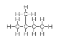
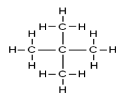
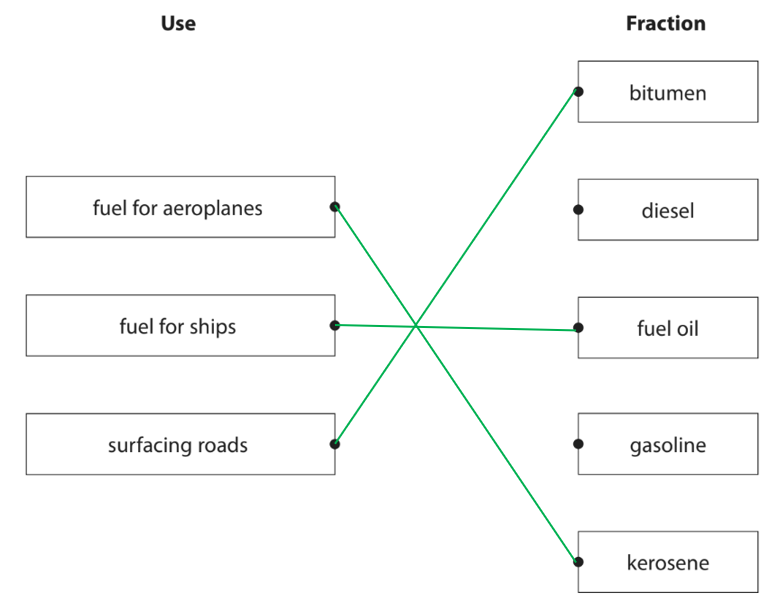
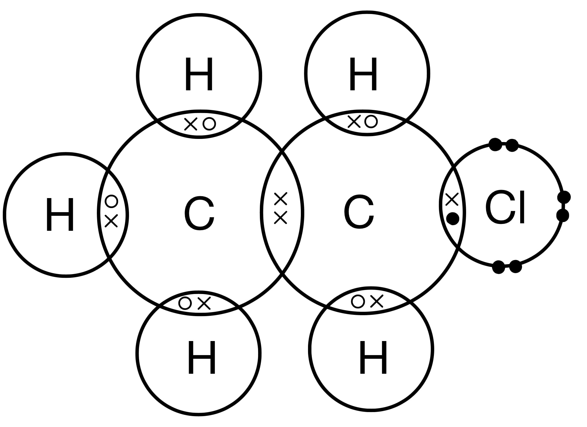

# Mark Schemes — Crude Oil
**4. Organic Chemistry** · Edexcel IGCSE Chemistry 4CH1

## Q1 — medium — 5 marks

### 2 — 3 marks
> **[mark-scheme]**
> Long-chain alkanes are converted into short-chain alkanes and alkenes by:
> 
> - (Catalytic) cracking **[1 mark]**
> - Using a catalyst of silica (SiO2) or alumina (Al2O3) **[1 mark]**
> - Using a temperature range of 600 - 700 oC **[1 mark]**

> **[exam-tip]**
> Examiner reports often show that students confuse **cracking** with **fractional distillation**. It is essential to remember the difference:
> 
> - Fractional distillation is a **physical separation **process that separates the hydrocarbons already present in crude oil.
> - Cracking is a **chemical reaction **(thermal decomposition) that breaks down large hydrocarbon molecules into smaller, more useful ones.
> 
> You are expected to memorise the specific conditions for catalytic cracking: the **catalyst** (silica or alumina) and the **temperature** (600-700 °C).

### 2 — 2 marks
> **[mark-scheme]**
> The reason long-chain alkanes are converted into short-chain alkanes and alkenes:
> 
> Any **two **from (1 mark for each):
> 
> - There is a surplus of long-chain alkanes **OR** There is a low demand for long-chain alkanes
> - There is a low supply of short-chain alkanes **OR** There is a high demand for short-chain alkanes
> - Short-chain alkanes are useful as fuels / petrol
> - Short-chain alkenes are used to make polymers / alcohols
> 
> **[2 marks]**

> **[exam-tip]**
> To get full marks for explaining why cracking is important, you need to discuss the uses of **both** types of products formed:
> 
> 1. **Short-chain alkanes**
> 
>   - These are in high demand for use as high-quality fuels, such as petrol for cars.
> 2. **Alkenes**
> 
>   - These are essential for the chemical industry, primarily as monomers to make polymers (plastics).
> 
> A complete answer should also mention the economic reason for this:
> 
> - Fractional distillation produces more long-chain alkanes than we need, and not enough short-chain alkanes to meet demand.
> - Cracking solves this problem.

## Q2 — easy — 1 marks

### 3 — 1 marks
**Correct answer: A** — Particulates and carbon monoxide

**Final answer:** **The correct answer is A**

- The **two** main substances formed during incomplete combustion, aside from water are: A / Particulates and carbon monoxide

- During incomplete combustion, there is insufficient oxygen for the fuel to burn in
- Instead of carbon dioxide and water (formed during complete combustion) you can form either particulates (a mixture of solid carbon particles and unburnt hydrocarbons) or carbon monoxide, CO, with minimal or no CO2
- B is incorrect because, although soot is produced by incomplete combustion, sulfur dioxide is not — it forms when fuels containing sulfur impurities are burned, not from the combustion of the hydrocarbon itself
- **C** is incorrect as carbon dioxide is a main product made by complete combustion
- D is incorrect as neither is a product of incomplete combustion — oxides of nitrogen form when nitrogen and oxygen in the air react at high temperatures inside engines, and sulfur dioxide forms from sulfur impurities in the fuel

## Q3 — medium — 12 marks

### 9(a) — 2 marks
Propane is a hydrocarbon because:

- It contains hydrogen and carbon; **[1 mark]**
- Only;** [1 mark]**

**[Total: 2 marks]**

- *The word 'only' is very important in this definition as there are many compounds that contain carbon. hydrogen and other elements that are not hydrocarbons*
- *The second mark is dependent on you getting the first mark*

### 9(b) — 2 marks
i) The poisonous gas that forms when propane is burned in a limited supply of air is:

- Carbon monoxide / CO;** [1 mark]**

ii) This gas is poisonous to humans because:

- It decreases the capacity of the blood to transport oxygen / it binds to haemoglobin; **[1 mark]**

**[Total: 2 marks]**

- *Hydrocarbons can undergo complete combustion when there is a plentiful supply of air to form carbon dioxide and water*
- *They can also undergo incomplete combustion when there is a limited supply of air, which can produce carbon monoxide, carbon (soot) and water*
- *You need to know the products of both types of combustion*

### 9(c) — 2 marks
Describing the forces of attraction between the atoms in a molecule of propane:

- There is a (strong electrostatic) attraction between the (bonding) pair of electrons;** [1 mark]**
- And the nuclei (of both atoms); **[1 mark]**

**OR**

- The (bonding) pair of electrons; **[1 mark]**
- Are attracted to the nuclei; **[1 mark]**

**[Total: 2 marks]**

- *Be careful with the use of terminology when describing forces of attraction*
- *You would not be awarded any marks if you:*

  - *Failed to talk about pairs of electrons and nuclei when describing covalent bonding*
  
    - *The more common mistake in this style is to write nucleus instead of nuclei but this will lose a mark*
  - *Referred to intermolecular forces between the atoms*
  
    - *Intermolecular forces of attraction do not exist within a molecule but between molecules*

### 9(d) — 3 marks
Cracking is an important process in the oil industry because:

- (Fractional distillation of crude oil) produces more long chain hydrocarbons than can be used directly 
**OR** 
There is less demand for long chain hydrocarbons; **[1 mark]**
- Short(er) chain alkanes / hydrocarbons are more useful
**OR**
Short(er) chain alkanes / hydrocarbons are more flammable 
**OR**
Short(er) chain alkanes / hydrocarbons are better fuels; **[1 mark]**
- Alkenes are used to make polymers / plastics; **[1 mark]**

**[Total: 3 marks]**

- *You need to:*

  - *Know why cracking is carried out*
  - *The reactions for cracking*
  - *Be able to construct equations for cracking*

### 9(e) — 3 marks
i) The completed equation is:

C3H8 + Br2 →  **C****3****H****7****Br** +** HBr**

- C3H7Br; **[1 mark]**
- HBr; **[1 mark]**

ii) The name of this type of reaction is:

- Substitution; **[1 mark]**

**[Total: 3 marks]**

- *The UV light provides energy to break the bond in bromine, a resulting bromine atom then replaces a hydrogen atom on propane*
- *More than one hydrogen atom can be replaced by a bromine atom, so there are alternative equations for which you would get credit for, providing they were correctly balanced*
- *For example:*

  - *C**3**H**8** + 2Br**2** →  C**3**H**6**Br**2** + 2HBr*

## Q4 — easy — 1 marks

### 5 — 1 marks
**Correct answer: A** — 

**Final answer:** **The correct answer is A**

- The row containing the correct use of each fraction is A
- The main use of kerosene is as a fuel for aircraft
- Bitumen is used to surface roads and roofs
- Fuel oil is used as fuel for large ships and in some power stations

## Q5 — medium — 13 marks

### 4(a) — 2 marks
The meaning of the term *hydrocarbon* is:

- (A compound containing the elements/atoms) hydrogen and carbon; **[1 mark]** 
*allow molecule / substance for compound* *reject element / atom / mixture for compound* *reject ions / molecules for elements / atoms*
- Only; **[1 mark]** 
*accept other equivalent words e.g. solely* *M2 dependent on mention of hydrogen and carbon in M1*

**[Total: 2 marks]**

- *The word 'only' is very important in this definition, so much so that you gain one mark for using it!*
- *This is because there are many compounds that contain carbon, hydrogen and atoms of other elements that aren't hydrocarbons*

### 4(b) — 7 marks
i) The chemical equation for the combustion reaction when pentane burns completely in oxygen is:

C5H12 + 8O2 → 5CO2 + 6H2O

- All formulae correct; **[1 mark]**
- Balancing of correct formulae;** [1 mark]**

ii)  The names of two products of the incomplete combustion of pentane are:

Any **two** from:

- Carbon monoxide / CO; **[1 mark]**
- Carbon / C / soot;** [1 mark]**
- Water / H2O;** [1 mark]**

iii) This gas is poisonous to humans because:

- It reduces / limits capacity of blood to transport oxygen / prevents blood from carrying oxygen; **[1 mark]** *Accept correct references to haemoglobin e.g. prevents haemoglobin from carrying oxygen*

iv) The displayed formulae of the other two isomers are:

; **[1 mark]**

; **[1 mark]**

**[Total: 7 marks]**

- *The products of complete combustion of hydrocarbons are water and carbon dioxide*
- *When balancing, balance the number of carbon atoms first, then the number of hydrogen atoms and finally the number of oxygen atoms*
- *If you end up with a fractional value for oxygen, multiply all of the balancing numbers by 2 to give you whole numbers*
- *You must know the difference in the products formed when there is a plentiful supply of oxygen (i.e. complete combustion occurs) and when there is a limited supply of oxygen (i.e. incomplete combustion occurs)*

### 4(c) — 4 marks
i) The general formula for the alkenes is:

- CnH2n;** [1 mark]**

ii) The meaning of the term unsaturated is:

- (Contains a carbon to carbon) double bond; **[1 mark] **
*Allow (contains a carbon to carbon) multiple bond*

iii) A test to show that a hydrocarbon is unsaturated is:

- Add bromine / Br2 water / solution;** [1 mark]**
- (Bromine water / solution) is decolourised / turns (from orange to) colourless; **[1 mark]** *ignore clear* 
*reject discoloured* 
*If initial colour of bromine water given it must be correct - allow any combination of orange / yellow / brown* 
*allow* 
*M1 add acidified potassium manganate(VII)* 
*M2 (potassium manganate(VII)) is decolourised / turns (from purple to) colourless* 
*reject any other initial colour*

**[Total: 4 marks]**

- *You need to know the general formula of alkanes and alkenes*
- *Remember**: **S**aturated compounds contain **S**ingle bonds, **U**nsaturated compounds contain do**U**ble bonds*
- *When bromine water is added to solutions containing unsaturated compounds, bromine adds across the double bond*
- *This removes bromine from the solution, causing the orangey-brown colour, which is due to bromine, to disappear*

## Q6 — hard — 14 marks

### 7(a) — 4 marks
Crude oil is separated into fractions in the fractionating column by:

- Crude oil is heated / vapourised; **[1 mark]**
- The vapours / gases / compounds / hydrocarbons rise up / diffuse up the column; **[1 mark]**
- The column is hotter at the bottom than the top; **[1 mark]**
- Vapours / compounds / hydrocarbons condense at their boiling point / at different heights
**OR**
Vapours / compounds / hydrocarbons / fractions have different boiling points; **[1 mark]**

**[Total: 4 marks]**

- *The process of fractional distillation is a common exam question, so it is worth learning these key steps*
- *Students often confuse the temperature gradient thinking that it is cooler at the bottom*
- *The fractions with the higher boiling points will condense towards the bottom of the column where it is hotter*
- *The fractions with the lower boiling points will condense nearer the top where it is cooler*

### 7(b) — 2 marks
The conditions for cracking are:

- Temperature of 600°C - 700°C; **[1 mark]**
*Allow a stated temperature between 600°C - 700°C*
- Catalyst of silica / alumina; **[1 mark]**

**[Total: 2 marks]**

- *Aluminium oxide is another common catalyst which would be awarded a mark*

### 7(c) — 8 marks
i) Oxides of nitrogen form in a car engine because:

- Nitrogen (from the air) reacts / combines with oxygen (from the air); **[1 mark]**
- At high temperatures (in the car engine); **[1 mark]**

ii) A reason why oxides of nitrogen should not be released into the atmosphere is:

Any **one** from:

- Acid rain; **[1 mark]**
- Respiratory problems; **[1 mark]**

iii) Showing that the car produces less than 100 g of carbon dioxide per km:

- Volume of carbon dioxide = 206 000 cm3 / 2.06 × 105 cm3 / 206 dm3; **[1 mark]**
- Volume of carbon dioxide per km = 51 500 cm3 / 5.15 × 104 cm3 / 51.5 dm3; **[1 mark]**
- Moles of carbon dioxide (51 500 ÷ 24 000) = 2.15 moles; **[1 mark]**
- *M*r of carbon dioxide = (12 + (2 x 16) =) 44;** [1 mark]**
- Mass of carbon dioxide per km = 94.4 g; **[1 mark] ***Correct answer of 94 to 95 scores 5 marks*

**[Total: 8 marks]**

- *The volume of carbon dioxide is calculated from the total volume of exhaust gases minus the volume of exhaust gases after carbon dioxide has been removed:*

  - *5.02 x 10**5** - 2.96 x 10**5** = 2.06 x 10**5*
- *This volume of carbon dioxide was released during a 4.0 km journey, so to work out the volume of carbon dioxide released per km, divide this by 4:*

  - *2.06 x 10**5 **÷ 4 = 5.15 x 10**4*
- *1 mole of any gas occupies 24 000 cm3, so the number of moles of carbon dioxide present is calculated by:*

  - *moles ÷ 24 000 = 5.15 x 10**4 **÷ 24 000 = 2.15 moles*
- *The mass of carbon dioxide is calculated by moles x **M**r** = 2.15 x 44 = 94.4 g*
- *Make sure that you show your working clearly, if you make a mistake you will be allowed error carried forward meaning you only get penalised once*

## Q7 — medium — 1 marks

### 8 — 1 marks
**Correct answer: B** — 

**Final answer:** **The correct answer is B**

- Cracking is the breakdown of a long chain alkane (obtained from fractional distillation) into a shorter alkane and an alkene
- In this case, kerosene is the alkane obtained from fractional distillation, and is broken down to form a shorter alkane (not shown in the diagram) and the alkene, ethene
- **A** is incorrect as this process is fractional distillation
- **C** is incorrect as this process is a substitution reaction
- **D** is incorrect as this process is polymerisation

## Q8 — medium — 10 marks

### 2(a) — 1 marks
The process used to separate crude oil into fractions is:

- Fractional distillation; **[1 mark]** 
*Accept fractionation / fractioning*

**[Total: 1 mark]**

- *The hydrocarbons present in the crude oil are varying lengths with different boiling points*
- *Fractional distillation separates them based on their boiling points*
- *You should be able to describe this process *

### 9 — 1 marks
One use of the kerosene fraction is;

- Aircraft fuel / jet fuel / paraffin or fuel for lamps / heaters / heating oil / cooking fuel; **[1 mark]**

**[Total: 1 mark]**

- *You should know the names and uses of the main fractions which include: refinery gases, gasoline, kerosene, diesel, fuel oil and bitumen*

### 2(b) — 2 marks
i)The alkane with the structural formula CH3CH2CH2CH3 is:

- Butane; **[1 mark]**

ii) The relative molecular mass (*M**r*) of this alkane is:

- (*M**r* = 4 x 12 + 10 x 1 =) 58; **[1 mark]**

**[Total: 2 marks]**

- *Remember, when naming organic compounds use the following rules to identify the prefix for the substance*

  - *1 carbon atom= meth-*
  - *2 carbon atoms= eth-*
  - *3 carbon atoms= prop-*
  - *4 carbon atoms= but-*
- *Alkanes have the ending -ane *
- *To calculate the relative molecular mass, add up the relative atomic masses for each element present in the compound using your periodic table*

### 2(d) — 2 marks
i) The molecular formula of this alkane is:

- C7H16;** [1 mark]**

ii) The general formula for the alkanes is:

- CnH2n + 2; **[1 mark]** 
*Accept different letters in place of n*

**[Total: 2 marks]**

- *The molecular formula is the actual number of atoms of each element in a compound*
- *You just need to count how many carbon and hydrogen atoms there are in the diagram*
- *You need to learn the general formula for alkanes*

  - *Remember to work out the number of hydrogen atoms just multiply the number of carbons by two and add two*

### 2(e) — 2 marks
i) The catalyst used in catalytic cracking is:

- Alumina / silica; **[1 mark]**

ii) it is necessary to convert long‐chain alkanes into shorter‐chain alkanes because:

- Greater demand for short chain alkanes (than long chain alkanes);** [1 mark]**
- More long-chain alkanes than are needed / too great a supply of /surplus of long-chain alkanes 
**OR** 
Not enough short chain alkanes to meet demands; **[1 mark]**

**[Total: 3 marks]**

- *Remember:** Shorter chain alkanes include fuels such as petrol, of which we have great demand for compared to longer chain alkanes *

### 2(f) — 2 marks
The equation for this cracking reaction is:

- C11H24 → C5H12 + **C****2****H****4**** + C****4****H****8****; ****[2 marks]**

**[Total: 2 marks]**

- *The number of carbon and hydrogen atoms on each side of the equation should be balanced*
- *After taking away the carbon atoms present in pentane from the original hydrocarbon you are left with six carbon atoms *

  - *You are told in the question that two **different **alkenes are formed so propene cannot be a product*
  - *One must have two carbons and the other four carbons*
  - *The general formula of alkenes is C**n**H**2n** so the number of hydrogen atoms is double the number of carbons*
  - *Always count at the end to check the equation is balanced*

## Q9 — easy — 1 marks

### 10 — 1 marks
**Correct answer: C** — Oxides of nitrogen

**Final answer:** **The correct answer is C**

- The other gas is produced by the internal combustion engine in a car is: C / Oxides of nitrogen

- When a fuel is burnt in a car, the gases produced are:

  - Carbon dioxide
  - Nitrogen oxides
  - Sulfur dioxide
  - Carbon monoxide
  - Water vapour

## Q10 — medium — 13 marks

### 3(a) — 1 marks
The name of this homologous series is:

- Alkanes; **[1 mark]**

**[Total: 1 mark]**

### 3(b) — 4 marks
i)  The difference in property on which the process depends:

- A; **[1 mark]**

ii) The fractions and correct uses:

- 3 correct lines; **[3 marks]**

**[Total: 4 marks]**

- *In part i):*

  - *A is the correct answer because fractional distillation depends on differences in boiling point*
  - *B is not correct because fractional distillation does not depend on differences in density*
  - *C is not correct because fractional distillation does not depend on differences in melting point*
  - *D is not correct because fractional distillation does not depend on differences in solubility*
- *Make sure you don't add more than three lines or you will lose marks even if you have three of the lines correct*

### 3(c) — 3 marks
How the combustion of a common impurity in fuels may cause an environmental problem:

- Sulfur is often found as an impurity in fossil fuels;  **[1 mark]**
- When the sulfur burns it releases sulfur dioxide gas, SO2; **[1 mark]**
*allow when sulfur reacts with oxygen *
- Sulfur dioxide reacts or dissolves in water to form acid rain; **[1 mark]**

**[Total: 3 marks]**

- *There are many environmental issues caused by the combustion of fuels, but the question here specifies that it is asking about the common impurity in fuels, which is sulfur*

### 3(d) — 5 marks
i)   The name of the process used to convert long-chain molecules into more useful shorter-chain molecules:

- Cracking; **[1 mark]**

ii)  The catalyst and temperature used in the industrial process to convert long-chain molecules into shorter-chain molecules:

- Silica or alumina; **[1 mark]**
- 600-700 oC; **[1 mark]**

iii)   The equation for this reaction:

- C13H28 → C8H18 + C3H6 **[1 mark]** + C2H4 **[1 mark]**

**[Total: 5 marks]**

- *Alternative answers in part ii) would include silicon dioxide / SiO**2**, aluminium oxide / Al**2**O**3** or zeolite*
- *The two products have to add with C**8**H**18** to the starting formula C**13**H**28*
- *You need to deduce the formula of an alkane and alkene that come to C**5**H**10*

## Q11 — hard — 12 marks

### 12 — 4 marks
The products of burning coal containing carbon, sulfur and hydrogen that affect the environment are:

Any **two** pairs from:

Pair 1:

- Carbon dioxide; **[1 mark]**
- Causes global warming; **[1 mark]**

Pair 2:

- Sulfur dioxide;** [1 mark]**
- Causes acid rain 
**OR**
** **kills plants / causes erosion / acidifies water; **[1 mark] **

Pair 3:

- Carbon monoxide;** [1 mark] **
- Is toxic / poisonous; **[1 mark]**

Pair 4:

- Carbon particles / soot / particulates;** [1 mark]**
- Cause global dimming / blocks out sunlight / smog / causes breathing difficulties; **[1 mark]**

**[Total: 4 marks]**

- *Make sure you name the product **AND** give the effect *
- *You cannot get more than 2 marks if you name more products but give no effects*
- *You may not be aware of the effects of carbon particulates / soot although you should know that they are produced during the incomplete combustion of hydrocarbons*

### 2 — 3 marks
i) Nitrogen monoxide is formed in motor vehicle engines because:

- Nitrogen and oxygen react or combine;** [1 mark]**
- At high temperatures / in presence of a spark; **[1 mark]**

ii) When nitrogen monoxide is released into the atmosphere, nitrogen dioxide / NO2 is formed because:

- It reacts with oxygen 
**OR** 
NO + 1⁄2O2 → NO2 / 2NO + O2 → 2NO2;** [1 mark]**

**[Total: 3 marks]**

- *Do not be thrown by part i) asking you how nitrogen monoxide is formed, this is an oxide of nitrogen that is formed by the high temperatures in a car engine allowing nitrogen and oxygen from the air to react*
- *You can tell from the formula of nitrogen dioxide, NO**2,** compared to nitrogen monoxide, NO, that additional oxygen has been added which helps answer part iv)*

### 12 — 2 marks
Two effects of oxides of nitrogen are:

Any **two** from:

- Acid rain;** [1 mark]**
- Production of (photochemical) smog; **[1 mark] **
- Erosion of limestone; **[1 mark]**
- Respiratory / breathing problems; **[1 mark]**
- Kills aquatic / plant life; **[1 mark]**

**[Total: 2 marks]**

- *Remember:** Sulfur dioxide will also form acid rain, so will share many of the adverse effects as the oxides of nitrogen*

### 2 — 3 marks
The amounts of carbon monoxide and nitrogen monoxide emitted by modern motor vehicles are reduced by:

- The use of a catalytic converter; **[1 mark]**

2NO + 2CO → 2CO2 + N2

- Correct species; **[1 mark]**
- Correct balancing; **[1 mark]**

**[Total: 3 marks]**

- *In a catalytic converter *

  - *Carbon monoxide is oxidised to carbon dioxide: 2CO + O**2** → 2CO**2*
  - *Oxides of nitrogen are reduced to N**2** gas: 2NO → N**2** + O**2*
  - *This gives the overall equation: 2NO + 2CO → 2CO**2** + N**2*
  - *Oxygen does not need to be included *

## Q12 — hard — 13 marks

### 13 — 3 marks
i) The conditions required in reactor **1** are:

- High temperatures / hot / 600-700 °C; **[1 mark]**
- A catalyst 
**OR **
Steam; **[1 mark]**

ii) The reaction which occurs in reactor **2** is:

- Polymerisation; **[1 mark]**

**[Total: 3 marks]**

- *Reactor **1** represents a cracking reaction*
- *This involves breaking down long chain hydrocarbons into shorter more useful ones *
- *There are two types of cracking*

  - *Catalytic - requires high temperatures and a catalyst *
  - *Steam - requires high temperatures and steam *
- *Both types require high temperatures so this must be a condition given*
- *Since the question has not specified what type of cracking is occurring you can answer with either a catalyst or steam as your second mark*

  - *If you named a catalyst, such as alumina **or** silica **or **zeolites **or** aluminosilicates **or** broken / porous pot, you would score this mark*
- *In reactor **2**, ethene is being converted to poly(ethene)*
- *During this, many ethene monomers join together to form a long chained molecule called a polymer*
- *The reaction that occurs is addition polymerisation *

  - *You would have been awarded the mark if you said 'addition'*

### 13 — 4 marks
Comparing the properties of gasoline and fuel oil:

Similarities: Any **two **from:

- Both fractions are made up of alkanes;** [1 mark]**
- Both fractions consist of hydrocarbons; **[1 mark] **
- Fractions only contain single bonds/are saturated; **[1 mark]**

Differences: Any **two **from:

- Fuel oil is less flammable;** [1 mark]**
- Fuel oil is more viscous; **[1 mark]**
- Fuel oil has a higher boiling point;** [1 mark]**
- Fuel oil is a longer hydrocarbon;** [1 mark]**

**[Total: 4 marks]**

- *A compare question means to give the similarities AND differences *
- *You would be given the marks for the differences if you said the converse for gasoline for any of the points given in the mark scheme*
- *If you fail to write any similarities between the two fuels, the maximum mark you can achieve is 2 out of 4. *
- *As you go down the column, the properties of the hydrocarbons change, which determines what they can be used for *
- *Gasoline is collected nearer the top of the fractionating column whereas fuel oil is collected near the bottom, which means that fuel oil is a longer chain hydrocarbons than gasoline*

### 13 — 1 marks
The market demand for shorter chain alkanes is greater than that of long chain alkanes because:

- (Shorter chain alkanes) are used as fuels / petrol 
**OR** 
(Shorter chain alkanes) are easier to burn **[1 mark]**

**[Total: 1 mark]**

- *Shorter chain alkanes burn more easily and so are more useful as fuels*
- *If you said that long chain alkanes are not useful as fuels, this would be accepted*

### 13 — 3 marks
Three ways of overcoming the issue of the supply of short chain fraction not meeting the supply is:

Any **three** from:

- Develop a market for low demand fractions; **[1 mark]**
- Crack long chain hydrocarbons:** [1 mark]**
- Convert low demand fractions to high demand fractions or bigger molecules to smaller molecules; **[1 mark]**
- Develop alternative fuels;** ****[1 mark]**
- Use different crude oils; **[1 mark]**
- Develop new techniques/equipment to use low demand fractions as fuels; **[1 mark]**

**[Total: 3 marks]**

- *The 'suggest' command word implies that you have not specifically learnt about this but you may need to apply your knowledge to this unfamiliar context*
- *Any reference to the price of fractions would not be credited*

### 13 — 2 marks
The trend the student would expect to see is:

- (As the number of carbons increases) the time to reach line **X** increases;** [1 mark]**
- (Because) the viscosity increases; **[1 mark]**

**[Total: 2 marks]**

- *Viscosity refers to the ability of a liquid to flow *
- *Longer alkanes are thicker substances, and less runny than short chain alkanes*
- *The time it will take them to pass through the funnel will therefore increase*
- *You would be awarded the marks if you gave the reverse argument for the number of carbons decreasing *

## Q13 — medium — 10 marks

### 3(a) — 4 marks
i) The name of the industrial equipment is:

- Fractionating column/ fractionating tower; **[1 mark] **

ii) One use of the fuel oil fraction is:

- Fuel for ships/ fuel for power stations; **[1 mark] **

iii) The names of fractions A and C are:

- Fraction A: refinery gases; **[1 mark] **
- Fraction F: bitumen; **[1 mark]**

**[Total: 4 marks] **

- *You should be able to name the fractions and also give a use for each*
- *The larger fractions remain closer to the bottom of the column, as they condense as soon as the temperature drops, whilst the smaller fractions can travel up the column further before cooling enough to condense*

### 3(b) — 4 marks
i) The general formula of the alkanes is:

- CnH2n + 2; **[1 mark] **

ii) C12H26 has a higher boiling point than C8H18 because:

An explanation that links the following** three **points:

- C12H26 has larger molecules / longer chain; **[1 mark]**
- C12H26 has stronger intermolecular forces; **[1 mark] **
- More energy is needed to separate the molecules/ overcome the forces in C12H26 ; **[1 mark] **

**[Total: 4 marks] **

- *When discussing boiling points of alkanes you should refer to intermolecular forces as alkanes are simple molecular structures*
- *If you refer to covalent bonds you will not score the mark*

  - *It is not the bonds that are breaking, it is the molecules moving further apart from one another that is actually happening when a liquid boils*

### 3(c) — 2 marks
i) The name of the catalyst used is:

- Silica / alumina / silicon dioxide / aluminium oxide / SiO2 / Al2O3 / aluminosilicates / zeolite; **[1 mark] **

ii) The completed reaction is:

- C12H26 → C9H20 + C3H6; **[1 mark] **

**[Total: 2 marks]**

- *Catalytic cracking will produce an alkane and an alkene*
- *The general formula for an alkene is C**n**H**2n*
- *You are given the formula of both alkanes, therefore you can simply subtract the number of carbon and hydrogen atoms from the reactant *

  - *C**12**H**26** - C**9**H**20** leaves 3 carbon atoms and 6 hydrogen atoms so the alkene is C**3**H**6*
  - *This fits in with the general formula for the alkene*
- *Careful: check the equation for ratios in the balanced equation*

  - *You could be given 2C**3**H**8** in the products, which means there are 6 carbons and 16 hydrogens to consider when working out the formula of the alkene *

## Q14 — easy — 1 marks

### 15 — 1 marks
**Correct answer: C** — The molecules in each fraction have a similar boiling point and carbon chain length

**Final answer:** **The correct answer is C**

- The correct statement about the process of fractional distillation is: C / The molecules in each fraction have a similar boiling point and carbon chain length

- The boiling point of hydrocarbons depends on the number of carbon atoms in the chain

  - Each fraction consists of groups of hydrocarbons of** similar** chain lengths
  - Therefore each fraction will have **similar **boiling points
- **A** & **B** are incorrect as fractional distillation is carried out in a fractionating column which is very hot at the **bottom **and cool at the **top**

  - Crude oil enters the fractionating column and is heated so vapours rise
  - Vapours of hydrocarbons with **low** boiling points will rise up the column and condense at the top to be tapped off
- **D ** is incorrect as viscosity refers to the ease of flow of a liquid. Viscosity increases with increasing chain length as the intermolecular forces of attraction increase with molecular size. Fractions collected at the bottom of the column have longer chain lengths and therefore have a **high **viscosity

## Q15 — medium — 8 marks

### 3(a) — 4 marks
i) Uses for bitumen and uses for gasoline are:

- (Bitumen): (surfacing) roads / (surfacing) roofs / other suitable uses; **[1 mark]**
- (Gasoline): petrol / fuel for cars / vehicles 
**OR** 
Fuel for cooking; **[1 mark]**

ii) Bitumen is collected at the bottom of the fractionating column and gasoline is collected near the top of the fractionating column because:

An explanation that links the following **two** points:

- The column is cooler near the top than at the bottom/ hotter at the bottom than the top/ temperature decreases up the column;** [1 mark]**
- Gasoline has a lower boiling point than bitumen 
**OR** 
Gasoline has a low boiling point (so is collected near the top) and bitumen has a high boiling point (so is collected near the bottom); **[1 mark]**

**[Total: 4 marks]**

- *You need to know the names and uses of the main fractions obtained from crude oil: refinery gases, gasoline, kerosene, diesel, fuel oil and bitumen*
- *Fractional distillation works on a temperature gradient that separates compounds according to boiling point*
- *As it is heated at the bottom of the column, the higher up the column a substance gets the cooler it gets and only substances with a low boiling point are still gaseous*

### 3(b) — 4 marks
i) The conditions needed for cracking are:

- Alumina/ silica (catalyst) / Al2O3 / SiO2 / aluminium oxide / silicon dioxide / aluminosilicate(s) / zeolite(s); **[1 mark]**
- 600 – 700 (oC) (range or value in this range); **[1 mark] **

ii) The completed equation should be:

C12H26 → C7H16 + **C****2****H****4**** **+ **C****3****H****6**

- C2H4; **[1 mark]**
- C3H6; **[1 mark]**

**[Total: 4 marks]**

- *You need to be able to recall the conditions; the easiest catalyst to remember is alumina or silica*
- *Cracking is when a large alkane is broken down into a shorter alkane and one or more alkenes*

  - *Remember: **Alkenes need to have the general formula C**n**H**2n*
- *Make sure that the carbons and hydrogens all add up to the original alkane formula*

## Q16 — hard — 13 marks

### 7(a) — 6 marks
i) The letters that represent hydrocarbons with the general formula CnH2n are:

- **B** **AND E**;** [1 mark] **

ii) **B** is the only hydrocarbon shown as a displayed formula because:

- (It is the only one that shows) all atoms and all bonds;** [1 mark]**

iii) The **two** letters represent isomers are

- **D** **AND F**; **[1 mark]**
- They have the same molecular formula  /the same number of each type of atom; **[1 mark]**
- But different structures / atoms joined together in different ways/different structural formulae; **[1 mark] **

iv) There are ....... hydrocarbons which are members of the homologous series of alkanes

- 4; **[1 mark] **

**[Total: 6 marks] **

- *The general formula for alkanes is C**n**H**2n+2** and the general formula for alkenes is C**n**H**2n*
- *The easiest way to spot the difference between alkanes and alkenes is that alkanes only have single bonds*
- *The molecular formula of **D** and **F** is the same*

  - *C**4**H**10*

### 7(b) — 3 marks
i) The combustion of a hydrocarbon can lead to the formation of a poisonous gas because:

- Incomplete combustion / lack of oxygen; **[1 mark]**
- Leads to the formation of carbon monoxide; **[1 mark] **

ii) This gas is poisonous to humans

- It reduces the capacity of blood to transport oxygen; **[1 mark] **

**[Total: 3 mark] **

- *Incomplete combustion means that there is not enough oxygen gas present in order to form carbon dioxide and water*
- *For example:*

  - *Complete combustion of butane is represented by*
  
    - *C**4**H**10** + 6½O**2** → 4CO**2** + 5H**2**O *
  - *Incomplete combustion of butane is represented by*
  
    - *C**4**H**10** + 4½O**2** → 4CO + 5H**2**O *
- *Carbon monoxide and / or carbon can be formed during incomplete combustion *

### 7(c) — 4 marks
The combustion of these fuels in car engines still leads to the formation of acid rain

- Nitrogen in the air and oxygen react;** [1 mark]**
- At high temperatures; **[1 mark]**
- Which causes the formation of nitrogen oxide(s); [1 mark]
- Oxides then react with water (vapour) in the atmosphere to form nitric acid; **[1 mark] **

**[Total: 4 marks]**

- *Nitrogen oxide that is formed in the car engine is an acidic oxide - most non-metal oxides are acidic oxides*
- *You must state 'high temperature' in the car engine*
- *Nitrogen is very unreactive due to the triple bond present (N*$\equiv$*N) so a very high temperature is needed to break this bond and then react with the oxygen gas*

## Q17 — medium — 8 marks

### 3(a) — 6 marks
i) The process used to separate crude oil into different fractions is:

- Fractional distillation / fractionating / fractionation; **[1 mark]**

ii) At X, the crude oil:

- Is heated / vapourised; **[1 mark]** *Allow boiled* *Ignore evaporates*

iii) The differences between fraction B and fraction E are:

- B contains larg<u>**er**</u> / long<u>**er**</u> molecules; **[1 mark]**
- B has a high<u>**er**</u> boiling point 
**OR** 
E is <u>**more**</u> volatile;** [1 mark]**
- B has a dark<u>**er**</u> colour; **[1 mark]**
- B is <u>**more**</u> viscous / has great<u>**er**</u> viscosity 
**OR** 
E is <u>**more**</u> runny; **[1 mark]** 
*Accept reverse arguments Max 2 marks if no reference to B or E in the answer*

**[Total: 6 marks]**

- *The crude oil needs to be vapourised as it goes into the fractionating column so that the vapours can rise and the fractions condense as they reach their boiling points*
- *When explaining the differences between the 2 fractions, you must compare them; just stating that B has a large molecule or has a high boiling point will not get you any marks*
- *Make sure you refer to each of the 4 points asked for in the question*

### 3(b) — 2 marks
Sulfur as an impurity is a problem becasue:

- (When sulfur burns) sulfur dioxide / SO2 is formed; **[1 mark] **
*Allow sulfur trioxide / SO**3*
- (Which) causes acid rain;** [1 mark]** 
*Allow a specified harmful effect of acid rain* 
*Accept references to causing / acerbating respiratory problems* 
*Allow greenhouse gas / causes global warming / climate change*

**[Total: 2 marks]**

- *Acid rain is the main problem caused by sulfur impurities in fossil fuels*
- *Coal is another common fossil fuel that contains sulfur impurities*

## Q18 — easy — 10 marks

### 2(b) — 3 marks
The completed the passage is:

- Crude oil is **heated** to form vapour; **[1 mark]**
- The vapour is passed through a **fractionating** column; **[1 mark]**
- The refinery gases are collected at the top of the column because they have low **boiling points**;** [1 mark]**

**[Total: 3 marks]**

- *It is important that you know the process of fractional distillation thoroughly as it can come up as an extended response question, worth 6 marks, so well worth investing the time to learn it very well!*
- *You could also say that the crude oil is boiled, but you would not be credited if you used the terms vapourised or evaporated*
- *You would also have been given credit if you said fractional distillation in the second sentence*

### 2(b) — 1 marks
One use of bitumen is:

- Road surfacing / roofing / roads; **[1 mark]**

**[Total: 1 mark]**

- *You need to know the uses of the main fractions obtained from fractional distillation*

### 2(c) — 2 marks
i) The name of this alkane is:

- Pentane; **[1 mark]**

ii) The relative molecular mass (*M*r) of this alkane is:

- (*M*r = (5 x 12) + (12 x 1)) = 72;** [1 mark]**

**[Total: 2 marks]**

- *The suffix of any alkane is -ane*
- *The prefix depends on the number of carbon atoms present*
- *5 carbon atoms in straight chain have the prefix pent-*
- *Putting these together gives pentane*

### 2(d) — 2 marks
The name of the catalyst and the temperature used in catalytic cracking are:

- **Catalyst**: alumina / silica / aluminium oxide; **[1 mark]**
- **Temperature**: any temperature in the range 600 - 700 °C inclusive; **[1 mark]**

**[Total: 2 marks]**

- *You need to know these conditions, know why cracking is performed and be able to construct equations to show cracking *
- *Other accepted catalysts are:*

  - *Silicon dioxide*
  - *Zeolite aluminosilicate(s)*
  - *Or any formulae of the accepted catalysts*

### 2(e) — 2 marks
The complete equation for this cracking process is:

C10H22 → C4H10 + **C****2****H****4**** **+ **C****4****H****8**

- C2H4;** [1 mark]**
- C4H8; **[1 mark]**

**[Total: 2 marks]**

- *You are told that two alkenes are formed so the two products must obey the general equation C**n**H**2n*
- *This is not the only possible answer, the products formed in the equations below would also gain you marks:*

  - *C**10**H**22** → C**4**H**10** + **C**6**H**12*** ***+ **C**2**H**4*
  - *C**10**H**22** → C**4**H**10** + 2C**3**H**6*** **
- *The total number of carbons from all three products must equal 10 and the total number of hydrogens from all three products must equal 22*

## Q19 — hard — 19 marks

### 9(a) — 5 marks
The diesel fraction is obtained from the crude oil in step 1 by:

A description that makes reference to **five **of the following points:

- Crude oil is heated / vaporised; **[1 mark] **
- The vapour enters the lower part of the column; **[1 mark] **
- There is a temperature gradient up the column; [1 mark]
- The vapour in the diesel fraction rises up the column until it condenses; **[1 mark] **
- At a height where its boiling point is lower than the temperature in the column; **[1 mark] **
- So the diesel fraction is removed; **[1 mark] **

**[Total: 5 marks] **

- *Many students make the mistake that the fractionating column is hotter at the top than at the bottom*
- *The temperature gradient decreases up the column so it is cooler at the top and hotter at the bottom*
- *Make sure you include key terms in your answer*

  - *Condense*
  - *Vapour*
  - *Temperature gradient *
  - *Boiling point *
  - *Fraction*

### 9(b) — 3 marks
Dodecane is described as a saturated hydrocarbon because:

An explanation that makes reference to the following three points:

- Dodecane contains hydrogen and carbon; **[1 mark]**
- Only / and no other elements; **[1 mark]**
- And contains only single bonds 
**OR** 
Does not contain double / multiple bonds; **[1 mark] **

**[Total: 3 marks] **

- *The definition of a hydrocarbon is a molecule that only contains hydrogen and carbon *
- *Many students omit the work 'only' from their definition *
- *Remember**: **S**aturated compounds contain **S**ingle bonds, **U**nsaturated compounds contain do**U**ble bonds*

### 9(c) — 1 marks
**Correct answer: C** — C11H24

**Final answer:** **The correct answer is C**

- Option C is the only molecular formula that follows the general formula of an alkane CnH2n+2
- C11H24

  - The number of hydrogen atoms for an alkane containing 11 carbon atoms will 11 x 2 + 2 = 24

### 9(d) — 1 marks
The completed equation is:

C12H26 → 2C2H4 + C8H18

- C8H18; **[1 mark] **

**[Total: 1 mark] **

- *The process of cracking will break a long chain alkane into an alkane and an alkene *
- *C**2**H**4 **is an alkene, and note that the equation gives 2C**2**H**4*
- *Therefore the alkane formed is C**8**H**18*

  - *12 - 4 = C**8*
  - *26 - 8 = H**18*

### 9(e) — 5 marks
i) The condition required is:

- Ultraviolet radiation / ultraviolet light; **[1 mark] **

ii) Compound X is:

- HCl; **[1 mark] **

iii) The dot-and-cross diagram to represent a molecule of C2H5Cl is:

- All 6 atoms with a dot and cross representing each bonding pair of electrons; **[1 mark] **
- 3 lone pairs of electrons on Cl and none on any of the H atoms; **[1 mark] **

iv) The type of reaction shown by equation 1:

- Substitution; **[1 mark] **

**[Total: 5 marks] **

- *C**2**H**6**+ Cl**2** → C**2**H**5**Cl + HCl*

  - *This is an example of a substitution reaction, ultraviolet radiation is required for this to occur as the alkane is very unreactive*
  - *One of the H atoms is swapping place with one of the chlorine atoms*
  - *Therefore substitution has occurred *
- *C**2**H**4** + Br**2** → C**2**H**4**Br**2*

  - * This is an example of an addition reaction as bromine has been added across the double bond*
  - * H**2**C=CH**2** + Br-Br → H**2**BrC-CBrH**2*

### 9(f) — 4 marks
i) The colour change occurs in the reaction between propene and bromine water:

- D; **[1 mark] **

ii) To calculate the empirical formula:

- Dividing percentages by atomic masses; **[1 mark]**
- Dividing results by smallest value 
**OR** 
Obtaining ratio; **[1 mark] **
- Writing empirical formula; **[1 mark]** 

Example calculation: 
C = $\frac{25.9}{12}$ = 2.16  : $\frac{2.16}{0.72}$ = 3 
H = $\frac{5}{1}$= 5.0 : $\frac{5.0}{0.72}$ = 7 
Br = $\frac{57.6}{80}$ = 0.72 : $\frac{0.72}{0.72}$ = 1 
O = $\frac{11.5}{16}$ = 0.72 : $\frac{0.72}{0.72}$= 1 

C3H7BrO 
*Accept symbols in any order*

**[Total: 4 marks] **

- *Testing for unsaturation or alkenes requires bromine water*
- *The colour change is from orange to colourless*
- *You must state colourless, not clear*
- *Empirical formula calculations follow the same pattern*

  - *Step 1 - divide mass stated in question by relative atomic mass*
  - *Step 2 - divide each answer by the smallest value calculated in step 1 *
  - *Step 3 - write down your ratios *
