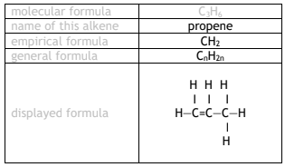
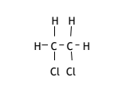
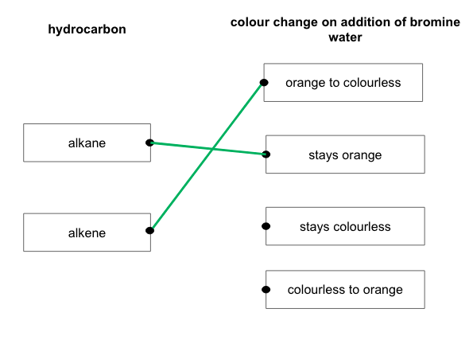
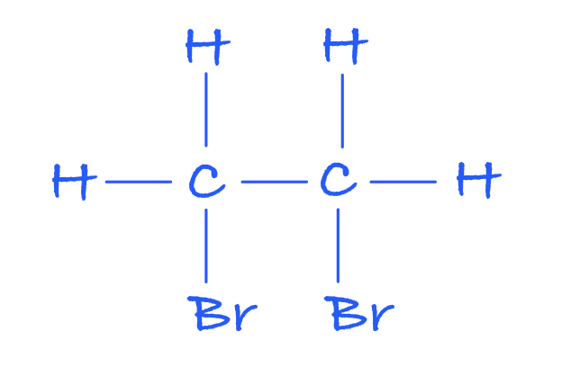
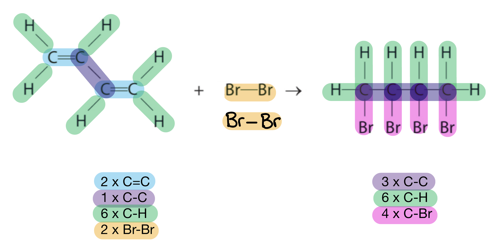
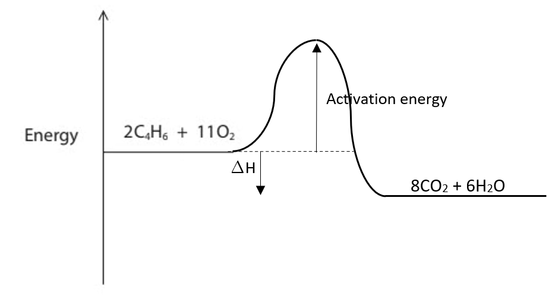
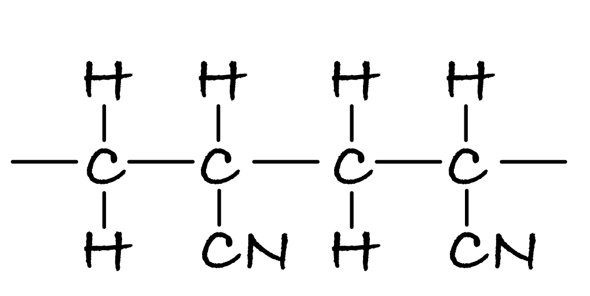
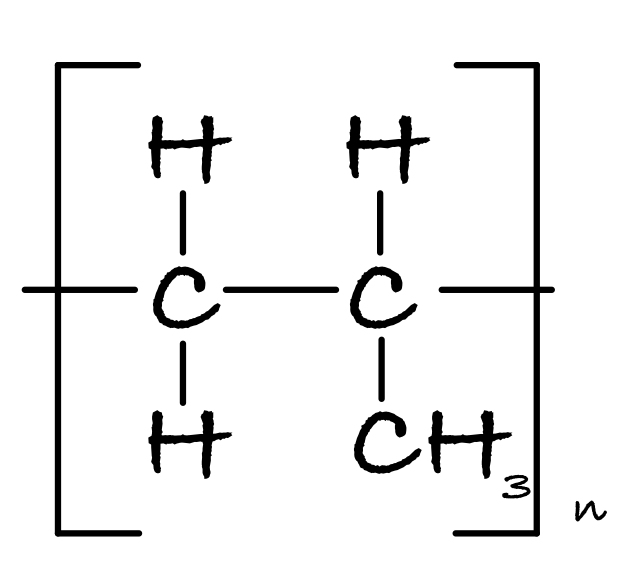

# Mark Schemes — Alkenes
**4. Organic Chemistry** · Edexcel IGCSE Chemistry 4CH1

## Q1 — medium — 10 marks

### 2 — 3 marks
The completed table:

| Molecular Formula | Empirical Formula | General Formula |
|---|---|---|
| **C****3****H****6** **[1]** | **CH****2****[1]** | **C****n****H****2n ****[1]** |

> **[mark-scheme]**
> A molecular formula of CH3CH=CH2 can also score 1 mark

> **[exam-tip]**
> The molecular formula is the actual number of atoms in the compound. You will still score the mark if you wrote the formula as CH3CH=CH2, but note this is a structural formula, not the molecular formula.
> 
> The empirical formula is the simplest possible whole-number ratio of the atoms.
> 
> The general formula applies to the whole group and is shown with respect to the varying number of carbon atoms (n).

### 2 — 2 marks
The completed symbol and word equations are:

C4H8 + Br2 → **C****4****H****8****Br****2**** ****[1 mark]**

Butene + bromine → **dibromobutane ****[1 mark]**

> **[mark-scheme]**
> 1 mark for C4H8Br2
> 
> 1 mark fo dibromobutane

> **[exam-tip]**
> This is an **addition** reaction. The double bond in the butene molecule breaks open, and the bromine molecule (Br2) 'adds' across it. This means there is only **one product**.
> 
> A very common mistake is to name the product **dibromobutene**. Remember that after the reaction:
> 
> - The C=C double bond is gone
> - So, the molecule is no longer an alk**ene**
> - It has become a saturated alk**ane** derivative
> - That's why the name ends in **-ane**

### 2 — 4 marks
i) The completed equation for the polymerisation of propene is:

**[2 marks]**

> **[mark-scheme]**
> i) For the completed equation:
> 
> 1 mark for a single bond between the two carbon atoms **AND **a** **single bonds to 3 hydrogen atoms **AND **a single bond to a CH3 group
> 
> 1 mark for trailing bonds extending through the brackets **AND** 'n' outside the brackets / on the right

> **[mark-scheme]**
> ii) The product of the reaction is:
> 
> - Polypropene / (Poly) propene **[1 mark]**
> 
> iii) The type of polymerisation is:
> 
> - Addition (polymerisation) **[1 mark]**

> **[exam-tip]**
> The key to drawing a repeat unit for an addition polymer is to focus on the C=C double bond in the monomer:
> 
> 1. Draw the two carbons from the double bond side-by-side with a **single** bond between them
> 2. Draw "trailing bonds" extending outwards from these two carbons
> 3. Copy the four groups that were attached to the double-bond carbons onto the available bonds (two pointing up, two pointing down)
> 4. Put square brackets around the unit and add a subscript 'n'
> 
> The name of an addition polymer is simply the name of the monomer with "poly-" in front. For example, propene becomes **poly(propene)**

### 2 — 1 marks
The displayed formula of the monomer used to make this polymer is:

**[1 mark]**

> **[mark-scheme]**
> The chlorine atom can be on either carbon atom

> **[exam-tip]**
> To find the monomer from an addition polymer's repeat unit, you need to reverse the polymerisation process.
> 
> - Identify the two carbon atoms that form the main chain of the polymer.
> - Change the single C-C bond between them back into a C=C double bond.
> - Remove the trailing bonds.
> 
> The groups attached to the carbons (H and Cl in this case) remain the same.
> 
> Brackets and n are not used in the monomer drawings, but they will be ignored if you include them.
> 
> You should know how to draw the monomers and polymers for ethene, propene, chloroethene and tetrafluoroethene.

## Q2 — medium — 14 marks

### 3(a) — 4 marks
The completed table is:

- **1 mark **for each correct answer

**[Total: 4 marks] **

- *An acceptable answer for the name of the alkene is propylene*

### 3(b) — 3 marks
i) The term unsaturated means:

- (Contains a carbon carbon) double bond; **[1 mark] **

ii) A test to show that a compound is unsaturated is:

- Add bromine water; **[1 mark] **
- Decolourises / changes to colourless; **[1 mark] **

**[Total: 3 marks] **

- *You will gain the mark for turns 'colourless', but the word 'clear' should not be used*
- *Many students make this mistake - colourless means the absence of colour *

### 3(c) — 3 marks
i) The equation between methane and chlorine is:

- CH4 + Cl2 → CH3Cl + HCl; **[1 mark] **

ii) The correct choice is:

- D / substitution;** [1 mark] **

iii) The required conditions are:

- Ultraviolet radiation / light;** [1 mark] **

**[Total: 3 marks] **

- *D is the correct choice in part ii) as substitution involves the 'swapping' of an atom for another*

  - *CH**4** + Cl-**Cl **→ CH**3**Cl + **H**-Cl*
  - *Here, a hydrogen atom bonded to a carbon atom has been swapped for a chlorine atom *
- *A is incorrect as it is not an addition reaction*
- *B is incorrect as it is not a decomposition reaction*
- *C is incorrect as it is not a neutralisation reaction*
- *The reaction of an alkane and chlorine will only occur if ultraviolet radiation is present*

### 3(d) — 4 marks
i) Isomers are:

- (Isomers have) the same molecular formula; **[1 mark]**
- (But) different structural / displayed formulae; **[1 mark] **

ii) The isomers are:

| **Isomer 1** | **Isomer 2** |
|---|---|
|  |  |

- Each correct structure scores 1 mark

**[Total: 4 marks] **

- *You should be able to draw isomers of small organic compounds such as dichloroethane *
- *Remember**: You need to break the bonds and then redraw them in a different place*
- *Notice that the chlorine atoms are bonded to either the same carbon atom or different carbon atoms*

## Q3 — easy — 7 marks

### 4 — 2 marks
Two differences between an alkane and an alkene are:

- Alkanes have only single bonds; **[1 mark]**
- Alkanes have more hydrogen atoms per carbon atom; **[1 mark]**

**[Total: 2 marks]**

- *Alkanes are known as saturated hydrocarbons due to having only single bonds*
- *Alkenes have a C=C double bond and are therefore unsaturated hydrocarbons*
- *Remember**: **S**aturated have **S**ingle bonds, **U**nsaturated have do**U**ble bonds*
- *As a result of the C=C double bond, there are less hydrogen atoms as each carbon atom can only form four covalent bonds*

### 4 — 2 marks
The correct observations are:

- Alkane with: stays orange; **[1 mark]**
- Alkene with: orange to colourless; **[1 mark]**

**[Total: 2 marks]**

- *Alkenes have a double bond and are able to react with the bromine water forming a colourless solution*
- *Alkanes do not react as they do no have a double bond so the bromine water (which is orange) remains so*

### 4 — 1 marks
The general formula for the alkenes is:

- CnH2n;** [1 mark]**

**[Total: 1 mark] **

- *The alkenes are unsaturated hydrocarbons and contain a carbon-carbon double bond, C=C*
- *In an alkene molecule, there are 2 hydrogen atoms for every carbon atom*

  - *Therefore the general formula is **C**n**H**2n*

### 4 — 2 marks
The correct structure of propene is:

- Correct bonds; **[1 mark] **
- Correct number of carbon and hydrogen atoms; **[1 mark] **

**[Total: 2 marks] **

- *You do not have to draw the bonds at a particular angle to gain the marks*
- *As long as your molecule of propene contains 1 C=C, 3 carbon atoms and 6 hydrogen atoms*
- *You should know how to draw ethene (C**2**H**4**), propene (C**3**H**6**) and butene (C**4**H**8**) molecules*

## Q4 — easy — 4 marks

### 5 — 1 marks
The alkene is:

- C7H14;** [1 mark]**

**[Total: 1 mark]**

- *Alkenes have the general formula C**n**H**2n*
- *Therefore the number of hydrogen atoms is double the number of carbons *
- *C**5**H**12** would be an alkane as the general formula for them is C**n**H**2n+2*

### 5 — 1 marks
One use of the alkenes produced from cracking is:

Any **one** from:

- Making polymers / plastics;** [1 mark]**
- As starting materials for other products;** [1 mark]**

**[Total: 1 mark]**

- *You should know that addition polymers are made from the joining of many monomers containing a C=C bond*

### 5 — 1 marks
**Correct answer: B** — C2H4Br2

**Final answer:** **The correct answer is B.**

- When ethene reacts with bromine, Br2 the bromine atoms add across the double bond
- The product is a saturated compound due to the loss of the double bond
- It is known as a dibromoalkane as it has 2 bromine atoms:

- **A** is incorrect as this has two few hydrogen atoms, suggesting that the C=C double bond is still present
- **C** is incorrect as each carbon atom would be attached to 5 other atoms
- **D** is incorrect as this has only had one bromine atom attached

### 5 — 1 marks
**Correct answer: A** — addition

**Final answer:** **The correct answer is A.**

- The type of reaction is Addition
- Bromine **adds** across the double bond

## Q5 — medium — 7 marks

### 1(a) — 3 marks
i) The term hydrocarbon means:

- A compound / substance / molecule / chemical that contains hydrogen/ H and carbon /C; **[1 mark]**
- Only; **[1 mark]** 
*The second mark is dependent on the mention of carbon and hydrogen*

ii) Ethene is described as unsaturated because:

- It has a carbon-to-carbon double bond / C=C; **[1 mark]**

**[Total: 3 marks]**

- *These are fundamental definitions of Organic Chemistry, so make sure that you know them as well as saturated (contains only single bonds)*

### 1(b) — 1 marks
**Correct answer: A** — colourless

**Final answer:** **The correct answer is A.**

- The appearance of the solution formed when ethene is bubbled through bromine water is Colourless
- When bromine water is bubbled through an alkene, the bromine adds across the carbon-to-carbon double bond / C=C and consequently removed from the bromine water which leaves colourless water

### 1(c) — 3 marks
i) The temperature and pressure used in this reaction are:

- Temperature = 250 - 350 oC;** [1 mark]  **
*Equivalent temperatures in other units are accepted*
- Pressure  = 60 - 70 atmospheres; **[1 mark]** 
*Equivalent temperatures in other units are accepted*

ii) The molecular formula of ethanol is:

- C2H6O; **[1 mark]** 
*C**2**H**5**OH is not accepted*

**[Total: 3 marks]**

- *You need to know the conditions for the formation of ethanol as well as be able to compare this method with fermentation*
- *In part (ii), C**2**H**5**OH is not accepted as it is not a molecular formula*

## Q6 — hard — 15 marks

### 5(a) — 3 marks
An unsaturated hydrocarbon is:

Explanation including following points

- (unsaturated because) contains (carbon to carbon) double bond(s); **[1 mark] **
- (hydrocarbon because) contains (the elements/atoms) carbon and hydrogen;** [1 mark] **
- only;** [1 mark] **

**[Total: 3 marks] **

- *This definition is in two parts*

  - *Unsaturated - contains at least one double bond*
  - *Hydrocarbon - contains hydrogen and carbon **only *
- *The most common error for the definition of a hydrocarbon is to miss out the word 'only' *
- *Organic compounds contain hydrogen and carbon, but will also contain other elements like oxygen and nitrogen, therefore they can not be hydrocarbons*
- *You will be credited with stating 'contains a C=C' bond*

### 5(b) — 5 marks
i) The colour change is:

- From orange to colourless; **[1 mark] **

ii) To calculate the energy change

- Calculation of energy involved in bond breaking in reactants;** [1 mark]**
- Calculation of energy involved in bond making in products; **[1 mark]**
- Evaluation of difference; **[1 mark]**
- Correct answer and sign; [**1 mark] **

Example calculation

- 2(612) + 1(348) + 6(412) + 2(193) = 4430
- 3(348) + 6(412) + 4(276) = 4620
- (4620 - 4430 = ) 190
- -190 kJ/mol

**[Total: 5 marks] **

- *To calculate the energy change of the reaction when given bond energy data use*
- *Δ**H **= **∑**bonds broken - **∑**bonds made*
- *It is always helpful to cross off the bonds as you go through your calculation*
- *Note that in the equation 2Br-Br is given, so remember to draw this out as well*

### 5(c) — 7 marks
i) The balanced equation is:

- 2C4H6 + 7O2 → **2**C + 4CO + 2CO2 + **6**H2O; **[1 mark] **

ii) One of the products, other than carbon, may cause a problem by:

Alternative 1

- CO / carbon monoxide; [1 mark]
- Is poisonous / toxic / reduces capacity of blood to carry oxygen; **[1 mark] **

Alternative 2

- CO2 / carbon dioxide;** [1 mark]**
- Is a greenhouse gas/contributes to global warming/ contributes to climate change; **[1 mark] **

iii) The completed diagram is:

- Horizontal line below level of reactants with 8CO2 + 6H2O;** [1 mark] **
- Profile curve rising from reactants level to form “hump” and then falling down to products level;** [1 mark] **
- Activation energy correctly shown and labelled; [1 mark]
- Δ*H* correctly shown and labelled;** [1 mark] **

**[Total: 7 marks] **

- *To balance the combustion equation balance the oxygen atoms first because carbon appears as an element, therefore is on its own on the right hand side, so easy to balance*

  - *2C**4**H**6 **+ 7O**2** → ......C + 4CO + 2CO**2 **+ .....H**2**O*
- *There are 14 oxygen atoms on the left hand side and currently 8 oxygen atoms on the right hand side, therefore a 6 is required in front of H2O*

  - *2C**4**H**6 **+ 7O**2** → ......C + 4CO + 2CO**2 **+ 6H**2**O*
- *There are 8 carbons on the left hand side and 6 on the right hand side, therefore 2 extra carbons are required on the right hand side*

  - *2C**4**H**6 **+ 7O**2** → 2C + 4CO + 2CO**2 **+ 6H**2**O*
- *Problems that are caused by the products of combustion are issues that you need to be able to explain*
- *When drawing an energy profile, make sure you include the reactants and products from the equation*

  - *Not including these is a common mistake that students make*
- *All diagrams that you draw should always be clearly labelled *
- *All combustion reactions are exothermic, so products must be lower in energy than reactants *

## Q7 — easy — 1 marks

### 8 — 1 marks
**Correct answer: C** — Butene

**Final answer:** **The correct answer is C.**

- Compound Y is called butene
- The number of carbon atoms determines the prefix of the alkene name
- Four carbon atoms indicate that the alkene is butene
- A is incorrect as ethene has two carbon atoms
- B is incorrect as propene has three carbon atoms
- D is incorrect as pentene has five carbon atoms

## Q8 — hard — 11 marks

### 5 — 3 marks
i) These two hydrocarbons are isomers because:

- Have same molecular formula / both are C5H10; **[1 mark]**
- They have different structural formulae / different structures; **[1 mark]**

ii)  The structural formula of anothi) Give the structural formula and name of the product of the reaction between ethene and bromine.

(2)

ii) State the type of reaction that occurs when ethene reacts with bromine.

(1)

iii) Hydrogen will react in a similar way to bromine when it reacts with ethene.

Suggest the molecular formula of the product of the reaction between hydrogen and bromine.

(1)er hydrocarbon which is isomeric with the above is:

- CH3-CH2-CH=CH-CH3 / any other correct isomer; **[1 mark]**

**[Total: 3 marks]**

- *Remember:** The molecular formula is the actual number of atoms of each element in a compound but the structural formula is how the atoms are arranged*
- *In the question, the names of the two isomers are 3-methylbutene and pent-1-ene*
- *Their atoms are arranged differently but they both have the same molecular formula of C**5**H**10*
- *A quick way of working out another isomer is to simply move the position of the double bond *

### 5 — 4 marks
i) The structural formula and name of the product for the reaction between ethene and bromine are:

- CH2(Br)CH2Br; **[1 mark]**
- (1,2-)Dibromoethane; **[1 mark]**

ii) The type of reaction that occurs when ethene reacts with bromine is:

- Addition; **[1 mark]**

iii) The molecular formula of the product of the reaction between hydrogen and bromine is:

- C2H6; **[1 mark]**

**[Total: 4 marks]**

- *You would not be awarded the first mark in part i) if you gave the molecular formula, C**2**H**4**Br**2*
- *You do not need to give numbers in the name of dibromoethane, but, if given they must be 1,2-*
- *When alkenes react with halogens, they undergo addition reactions*
- *The C=C double bond will break to create a saturated compound and a halogen atom will add to each carbon atom*
- *Remember: **when a halogen is added onto an alkene, you must represent the fact there are two halogen atoms in the name of the new compound- so **di**bromoethane as opposed to bromoethane*
- *When ethene reacts with hydrogen, it will undergo an addition reaction but this time, a hydrogen atom will add to each carbon atom, producing ethane, C**2**H**6*
- *It sometimes helps to draw out the displayed formula for the reactants and products before answering the question*

### 5 — 2 marks
The formulae of the alkenes which would produce those carboxylic acids when oxidised are:

- CH3-CH=CH-CH2-CH3; **[1 mark]**
- CH3-CH=CH-CH3;** [1 mark]**

**[Total: 2 marks]**

- *The information given in the question should help you answer this*

  - *You are told the following:*
  
    - *Propene, CH**3** –CH=CH**2**, would produce ethanoic acid, CH**3** –COOH, and methanoic acid, H–COOH.*
    - *So you should be able to see that when the alkene is oxidised, the molecule splits into two at the double bond, and each resulting carbon chain forms a carboxylic acid*
    - *If you have ethanoic acid and propanoic acid, the alkene that it was produced from must have 2 carbon atoms on one side of the double bond and 3 carbon atoms on the other side of the double bond*
    - *The alkene must therefore have five carbon atoms, which is pentene and the double bond is between the 2nd and 3rd carbon atoms*
    - *If only ethanoic acid is produced, the alkene must have two carbon atoms either side of the double bond totalling four carbon atoms and so butene is formed with the double bond between the 2nd and 3rd carbon atoms*

### 5 — 2 marks
The displayed formula of poly(cyanoethene), including at least two monomer units is:

- Correct repeat unit CH2-CH(CN); **[1 mark]**
- Bonds to show continuation;  **[1 mark]**

**[Total: 2 marks]**

- *Remember: **When drawing polymers, the double bond in the alkene breaks and the monomers join together*
- *You must show bonds extending from each monomer as if it were joining to another monomer to obtain the second mark as a polymer is **many** monomers joined together*

## Q9 — easy — 1 marks

### 10 — 1 marks
**Correct answer: C** — C5H10

**Final answer:** **The correct answer is C.**

- The alkene is C5H10
- The general formula of an alkene is CnH2n
- The formula for 5 carbons: C5H10 
- **A** is incorrect as this molecule has a general formula CnH2n-2
- **B** &** D** are incorrect as these molecules have a general formula for an alkane / CnH2n+2

## Q10 — easy — 1 marks

### 11 — 1 marks
**Correct answer: D** — C4H8

**Final answer:** **The correct answer is D.**

- The compound that would cause decolourise the bromine solution is C4H8
- Bromine water is decolourised when shaken with an unsaturated compound

  - Alkenes are unsaturated compounds (i.e. contain the functional group C=C)
  - Alkenes have the general formula CnH2n
  - Compound **D** follows this general formula and is the alkene, butene
- **A** is incorrect as this is the formula of the alkane, propane. Alkanes are saturated compounds and do not decolourise bromine water
- **B** is incorrect as this is an alkane as it fits the general formula CnH2n+2. Alkanes are saturated compounds and do not decolourise bromine water
- **C** is incorrect as this is neither an alkane or an alkene as it has too many hydrogen atoms for the number of carbon atoms

## Q11 — medium — 13 marks

### 6(a) — 1 marks
The relative formula mass (*M*r) of ocimene is:

- 136; **[1 mark]**

**[Total: 1 mark]**

- *The molecular formula of ocimene is C**10**H**16** *
- *Therefore, the relative formula mass is (12 x 10) + (1 x 16) = 136*

### 6(b) — 2 marks
An empirical formula is:

- The simplest (whole number) ratio of atoms / elements present (in a compound); **[1 mark]**
- The empirical formula (of ocimene / C10H16) is C5H8  
**OR **
The C : H ratio of ocimene is 5 : 8; **[1 mark]**

**[Total: 2 marks]**

- *Empirical formula questions are quite common*
- *Although they tend to lean towards calculating the empirical formula using given data, you could just as easily be asked for the definition and an application such as this question*

### 6(c) — 3 marks
Ocimene is described as an unsaturated hydrocarbon because:

Unsaturated:

- It contains (carbon to carbon) double bonds;** [1 mark]**

Hydrocarbon:

- It contains carbon and hydrogen (atoms); **[1 mark]** 
*The word molecules does not score this mark*
- Only; **[1 mark]** 
*This mark is dependent on saying carbon and hydrogen for the previous mark*

**[Total: 3 marks]**

- *Three basic definitions that you should know for organic chemistry are:*

  - *Hydrocarbon = a compound that contains **only **carbon and hydrogen*
  
    - *The word **only **is often missed and costs you a mark*
  - *Saturated = contains only carbon to carbon single bonds / C-C*
  - *Unsaturated = contains at least one carbon to carbon double bond / C=C*
  
    - *Unsaturated compounds can also / actually contain at least one carbon to carbon triple bond / C*$\equiv$*C*

### 6(d) — 2 marks
i) The type of reaction that occurs between ocimene and bromine is:

- A / addition; **[1 mark] **

ii) Ocimene does not have the alkene general formula because:

- It contains more than one double bond 
**OR **
It contains 3 double bonds; **[1 mark]**

**[Total: 2 marks]**

- *Bromine reacts with the carbon to carbon double bond / C=C of unsaturated compounds, breaking them open and adding across them*
- *The C**n**H**2n** general formula is for an alkene containing one carbon to carbon double bond / C=C*

  - *It does not account for compounds that contain multiple carbon to carbon double bonds / C=C or carbon to carbon triple bonds / C*$\equiv$*C*

### 6(e) — 2 marks
The equation for the complete combustion of ocimene is:

C10H16 + 14O2 → 10CO2 + 8H2O

- Correct products / CO2 + H2O; **[1 mark]**
- Correct balancing; **[1 mark]**

**[Total: 2 marks]**

- *Remember: **Complet combustion forms carbon dioxide and water*
- *To balance the equation:*

  - *C**10**H**16** suggests the formation of 10CO**2**  C**10**H**16** + ..........O**2** → 10CO**2** + ....................*
  - *C**10**H**16** suggests the formation of 8H**2**O C**10**H**16** + ..........O**2** → 10CO**2** + 8H**2**O*
  - *This then means that there are 28 oxygen atoms on the products side, which corresponds to 14O**2**  C**10**H**16** + 14O**2** → 10CO**2** + 8H**2**O*

### 6(f) — 3 marks
i) The two products from the incomplete combustion of ocimene are:

- Carbon / C / soot;** [1 mark]**
- Carbon monoxide / CO; **[1 mark]**

ii) The gas produced is poisonous because:

- It reduces the ability / capacity of blood to carry oxygen 
**OR **
Combines irreversibly with haemoglobin / forms carboxyhaemoglobin which stops / prevents oxygen binding to the haemoglobin; **[1 mark]**

**[Total: 3 marks]**

- *You are expected to know the products of complete and incomplete combustion *
- *The effect of carbon monoxide is a common question for the Edexcel exam board*

## Q12 — hard — 15 marks

### 8(a) — 5 marks
i) The letter of the compound that is not shown as a displayed formula is:

- A; **[1 mark]**

ii) The letter of the saturated compound with the general formula CnH2n is:

- C; **[1 mark]**

iii) Compound E is called:

- Propene; **[1 mark]**

iv) Compounds A and D are isomers because:

- They have the same molecular formula; **[1 mark]**
- But, a different structure / structural formula / different arrangement of atoms; **[1 mark]**

**[Total: 5 marks]**

- *Remember:** Displayed formulae have all atoms and bonds showing*

  - *Compound A has a CH**3** group which is not showing the three hydrogen atoms or the C-H bonds*
- *Compounds C and E both have the general formula C**n**H**2n*

  - *Compound C is saturated as it contains only carbon-to-carbon single bonds / C-C*
  - *Compound E is unsaturated as it contains one carbon-to-carbon double bond / C=C*
- *Compound E is an alkene as it contains a carbon-to-carbon double bond / C=C*

  - *It contains three carbons, so its name starts with prop-*
  - *Combining these ideas gives propene*
- *You need to know the definition of isomers*

  - *You can be asked to state what isomers are*
  - *You can be asked to apply the definition to explain how / why given compounds are isomers*
  - *You can be asked to draw possible isomers*

### 8(b) — 2 marks
i) The completed equation for the reaction of compound F with bromine in the presence of ultraviolet radiation is:

- CH3Br + HBr;** [1 mark]**

ii) This type of reaction is:

- Substitution;** [1 mark]**

**[Total: 2 marks]**

- *Compound F is methane, which is relatively unreactive*
- *In the presence of high energy ultraviolet radiation, methane (and other alkanes) can react with halogens to replace / substitute a hydrogen atom for a halogen atom*

  - *This process can happen multiple times, but at GCSE the focus is typically on a single substitution *

### 8(c) — 5 marks
i) To show by calculation that the empirical formula of compound G is C2H4Cl:

Method 1:

- Carbon: $\frac{37.8}{12}$  
**AND **
Hydrogen: $\frac{6.3}{1}$ 
**AND **
Chlorine: $\frac{55.9}{35.5}$; **[1 mark]**
- Carbon: 3.15 
**AND**
** **Hydrogen: 6.3
 **AND **
Chlorine: 1.575; **[1 mark]**
- Carbon: $\frac{3.15}{1.575}$ = 2 
**AND **
Hydrogen: $\frac{6.3}{1.575}$ = 4 
**AND **
Chlorine: $\frac{1.575}{1.575}$ = 1; **[1 mark]**

Method 2:

- *M*r of C2H4Cl = 63.5;** [1 mark]**
- Mass of carbon in compound G = 2 x 12 = 24 
**AND **
Mass of hydrogen in compound G = 4 x 1 = 4 
**AND **
Mass of chlorine in compound G = 1 x 35.5 = 35.5; **[1 mark]**
- Carbon: $\frac{24}{63.5}\times100$ = 37.8% 
**AND **
Hydrogen: $\frac{4}{63.5}\times100$= 6.3% 
**AND **
Chlorine: $\frac{35.5}{63.5}\times100$ = 55.9%; **[1 mark]**

ii) The molecular formula of G is:

- $\frac{127}{63.5}$ = 2;** [1 mark]**
- Molecular formula = C4H8Cl2; **[1 mark]**

**[Total: 5 marks]**

- *Empirical formula calculations follow the same steps regardless of the compound*
- | 1 | > *Write the elements* | > *C* | > *H* | > *Cl* |
|---|---|---|---|---|
| > *2* | > *Write the values from the question* *(can be % or g)* | > *37.8* | > *6.3* | > *55.9* |
| > *3* | > *Write the atomic mass* | > *12* | > *1* | > *35.5* |
| > *4* | $\frac{\mathrm{Value}}{\mathrm{Atomic} \mathrm{mass}}$ | > *3.15* | > *6.3* | > *1.575* |
| > *5* | > *Ratio (divide the answers by the smallest value)* | > $\frac{3.15}{1.575}$* = 2* | > $\frac{6.3}{1.575}$* = 4* | > $\frac{1.575}{1.575}$* = 1* |
| > *6* | > *Write the empirical formula* | > *C**2* | > *H**4* | > *Cl* |
- *Edexcel like to give questions asking you to prove an empirical formula and these are answered surprisingly badly, even though you have the final answer to work towards*
- *Once you have calculated the empirical formula, you calculate its mass*

  - *C**2**H**4**Cl = (2 x 12) + (4 x 1) + 35.5 = 63.5*
- *To determine the molecular formula, you divide the molecular mass by the mass of the empirical formula*

  - $\frac{127}{63.5}$* = 2*
- *Then you apply this number to the empirical formula*

  - *C**2**H**4**Cl x 1 = C**4**H**8**Cl**2*

### 8(d) — 3 marks
i) The polymer formed from two molecules of compound E is:

- Two carbon atoms with two hydrogens; **[1 mark]**
- Two carbon atoms with one hydrogen atom and one methyl / CH3 group attached 
**AND** 
Nothing attached to the continuation / trailing / joining bonds; **[1 mark]**

ii) One problem caused by the disposal of addition polymers is:

- Landifll sites are getting full 
**OR **
Toxic / greenhouse gases are released when they are burned; **[1 mark]**

**[Total: 3 marks]**

- *Take your time drawing polymers*
- *For this polymer:*

  - *Start with a carbon-to-carbon double bond / C=C (drawn in pencil)*
  - *On one carbon, draw a hydrogen above and a hydrogen below connected with single bonds*
  - *On the next carbon, draw a hydrogen above and a CH**3** group below connected with single bonds*
  - *Replace the central carbon-to-carbon double bond / C=C with a single bond *
  - *Draw an exact copy of this next to it*
  - *Connect the two molecules with a carbon-to-carbon single bond / C-C*
  - *Add an open single bond on the left-hand carbon*
  - *Add an open single bond on the right-hand carbon*

## Q13 — medium — 1 marks

### 14 — 1 marks
**Correct answer: C** — Dichloroethane

**Final answer:** **The correct answer is C.**

- The product formed from the reaction between ethene and chlorine is Dichloroethane
- When ethene and chlorine the chlorine molecule adds across the carbon-to-carbon double bond / C=C
- The product formed is:

- Due to presence of two chlorine atoms and the fact that the compound is now saturated it is called dichloroethane

## Q14 — hard — 18 marks

### 3 — 4 marks
i) The equation for the cracking of the alkane, decane is:

Example: C10H22 → C8H18 + C2H4

- One product with an alkane / CnH2n+2 formula, e.g. C8H18; **[1 mark]**
- One product with an alkene / CnH2n formula, e.g. C2H4; **[1 mark]**

ii)  Chloropropane can be made from propane by:

- Reagent = Chlorine; **[1 mark]**
- Conditions = Ultraviolet / UV radiation / light 
**OR** 
Heat / 200°C  
**OR** 
High temperature MAX 1000°C; **[1 mark]**

**[Total: 4 marks]**

- *Cracking results in the breakdown of a long-chain alkane into a short-chain alkane and alkene *
- *Any combination of alkane and alkene could be given here*

  - *Careful: **Cracking equations usually have some extra marking guidance:*
  
    - *The number of carbon atoms on the left-hand side and right-hand side of the equation must balance*
    - *The number of hydrogen atoms on the left-hand side and right-hand side of the equation must balance*
    - *The formulae for the alkane and alkene must be correct / match the appropriate general formula*
- *Some examples you could write are:*

  - *C**10**H**22** → C**8**H**18** + C**2**H**4 *
  - *C**10**H**22** → C**7**H**16** + C**3**H**6 *
  - *C**10**H**22** → C**6**H**14** + C**4**H**8 *
- *You would have been awarded one mark for giving the correct formula of an alkane and alkene but the total number of carbon and hydrogen didn't balance*
- *You could also have given the reaction in which an alkene and hydrogen are formed:*

  - *C**10**H**22** → C**10**H**20** + H**2 *
- *Haloalkanes are formed by a substitution reaction when an alkane reacts with a halogen*

  - *You should know the conditions for this reaction*

### 3 — 4 marks
i) They  are isomers because:

- (They have the) same molecular formula; **[1 mark]**
- Different structures or structural formulae; **[1 mark]**

ii) The name and structural formula of another hydrocarbon that is isomeric with the above is

- But-2-ene; **[1 mark]**
- CH3CHCHCH3 
**OR **
CH3(CH)2CH3; **[1 mark]**

**[Total: 4 marks]**

- *The molecular formula is the actual number of atoms of each element in a compound *
- *The molecular formula of the structures shown is C**4**H**8** but as you can see their atoms are arranged differently so they are known as structural isomers *
- *But-1-ene and 2-methylpropene are shown in part a) and so the position of the double bond can be moved to deduce the third isomer, but-2-ene*

### 15 — 8 marks
**i)  C**omparing the structures of propene with propane.

Any **two** similarities from:

- Both are hydrocarbons; **[1 mark]**
- Both contain three carbon atoms (per molecule); **[1 mark]**
- Both have covalent bonds;** [1 mark]**
- Both contain C—H bonds; **[1 mark]**
- Both are small molecules; **[1 mark]**

Differences:

- Propane contains eight hydrogen atoms (per molecule) 
**AND **
Propene contains six hydrogen atoms (per molecule); **[1 mark]**
- Propane contains single carbon-carbon bonds / C—C only 
**AND **
Propene contains a carbon-carbon double bond / C=C; **[1 mark]**

ii) Comparing the reactions of propene with propane:

Any **two** similarities from:

- Both react with oxygen in complete combustion reactions; **[1 mark]**
- To produce water and carbon dioxide; **[1 mark]**
- Both react with oxygen in incomplete combustion reactions;** [1 mark]**
- To produce water, carbon monoxide and carbon; **[1 mark]**

Any **two **differences from:

- Incomplete combustion is more likely with propene; **[1 mark]**
- Propene decolourises bromine water / propane does not decolourise bromine water; **[1 mark]**
- Propene is more reactive (than propane); **[1 mark]**
- Propene can react with halogens (to produce halogenoalkanes);** [1 mark]**
- Propene can undergo addition reactions / propane can undergo substitution reactions; **[1 mark]**
- Propene can polymerise (to produce poly(propene)); **[1 mark]**

**[Total: 8 marks]**

- *The command word 'compare' means you need to give similarities as well as differences, so you should deduce that there are 2 marks available for the similarities and 2 marks for the differences in part i) and ii)*
- *This question relies on you having an excellent recall of knowledge about the structure and reactions of the alkanes and alkenes as you are not given any specific reactions to refer to*

### 15 — 2 marks
The balanced symbol equation is:

C3H6 + 3O2 → 3CO + 3H2O

- Correct formulae; **[1 mark]**
- Correct balancing; **[1 mark]**

**[Total: 2 marks]**

- *You should know that combustion involves propene / C**3**H**6** reacting with oxygen, and the products are stated in the question*

  - *C**3**H**6** + O**2** → CO + H**2**O*
- *Balance the carbon atoms first*

  - *C**3**H**6** + O**2** → **3**CO + H**2**O*
- *Balance the hydrogen atoms second *

  - *C**3**H**6** + O**2** → **3**CO + **3**H**2**O*
- *Balance the oxygen atoms last *

  - *C**3**H**6** + **3**O**2** → **3**CO + **3**H**2**O*

## Q15 — hard — 9 marks

### 7 — 2 marks
i) Their empirical formula is:

- CH2/H2C; **[1 mark]**

ii)  The empirical formula the same for these alkenes because:

- Same ratio of C:H (atoms) / all cancel to CH2 / because general formula is CnH2n / same ratio of atoms or elements (in the compound) / C:H ratio is 1:2; **[1 mark]**

**[Total: 2 marks]**

- *Remember: **The empirical formula is the simplest ratio of atoms of each element in a compound*
- *There are always double the number of hydrogen atoms compared to carbon atoms according to the general formula C**n**H**2n *
- *Some alkenes have multiple double bonds, which will change the ratio of carbon atoms to hydrogen atoms, so they will have a different empirical and therefore general formula*

### 7 — 1 marks
The product formed is:

- CH3CH(Br)CH2Br; **[1 mark]**

**[Total: 1 mark]**

- *When alkenes react with halogens, they form haloalkanes *
- *Both halogen atoms must add across the double bond, breaking it and forming a saturated compound *
- *For the purpose of this question, it does not matter which carbon atoms you place your bromines on *

### 7 — 2 marks
The repeat unit of poly(propene) is:

- Correct unit; **[1 mark]**
- Continuation bonds at both ends; **[1 mark]**

**[Total: 2 marks]**

- *You should know the structure of propene as C**3**H**6*
- *To draw the structure of the polymer from the monomer: *

  - *Remove the double bond *
  - *Add brackets around the repeat unit*
  - *Place an n at the bottom right hand corner, outside of the brackets *
- * You would be awarded the marks if you drew more than one repeat unit, or if you didn't include the square brackets or n*

### 7 — 4 marks
i) To determine the formula of the alkene:

- Moles of O2 (= 2.4 / 32 =) 0.075 mol 
**AND** moles of CO2 (= 2.2 / 44 =) 0.05 mol; **[1 mark]**
- Moles of alkene : moles of O2 : moles of CO2 = 1 : 7.5 : 5 **OR** 
2 : 15 : 10; **[1 mark]**
- Formula of alkene = C5H10; **[1 mark]**

ii) The equation for the complete combustion of this alkene is:

- C5H10 + 7.5O2 → 5CO2 + 5H2O 
**OR **
2C5H10 + 15O2 → 10CO2 + 10H2O;** [1 mark]**

**[Total: 4 marks]**

- *Complete combustion occurs when a fuel reacts with oxygen to form carbon dioxide and water *
- *The word equation would be:*

  - *Alkene + oxygen → carbon dioxide + water *
- *You are given the number of moles of the alkene = **0.01 mol*
- *You are given the mass of oxygen and carbon dioxide so can use these to find the moles of the oxygen and carbon dioxide (as shown in the mark scheme) *

  - *Oxygen 2.4 ÷ 32 = **0.075 mol*
  - *Carbon dioxide = 2.2 ÷ 4 4=** 0.05 mol*
- *You, therefore, have: 0.01 : 0.075 : 0.05 *
- *To calculate the ratio divide each of these by the smallest number which is 0.01*

  - *This gives you the ratio of 1 : 7.5 : 5 or if you double it 2 : 15 : 10*
- *From this, you know that you have five moles of carbon dioxide*

  - *Therefore, the alkene must have five carbons*
- *The general formula for alkenes is C**n**H**2n** so if you have 5 carbons you have 10 hydrogen atoms *
- *Put this information into the equation  *

  - *C**5**H**10** + 7.5O**2** → 5CO**2** + H**2**O*
- *Balance the rest of the equation*

  - *C**5**H**10** + 7.5O**2** → 5CO**2** + **5**H**2**O*
- *This answer is accepted or you could double the 7.5 to achieve a whole number 15, but remember to double the other substances too*

  - *2**C**5**H**10** + **15**O**2** → **10**CO**2** + **10**H**2**O*

## Q16 — medium — 1 marks

### 17 — 1 marks
**Correct answer: D** — Addition

**Final answer:** **The correct answer is D.**

- Converting compound R to compound T by reacting it with bromine is Addition
- The reaction between ethene and bromine is an example of an addition reaction
- The bromine is added across the carbon-to-carbon double bond / C=C
- The resulting compound, T, is called 1,2-dibromoethane
