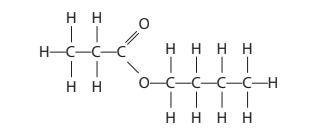
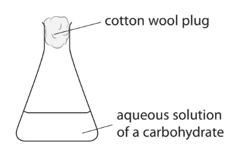
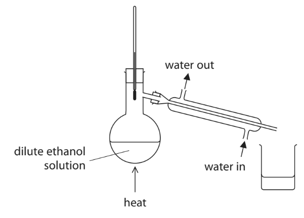
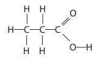
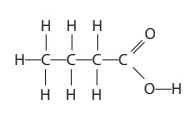
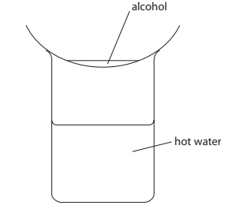
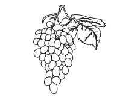
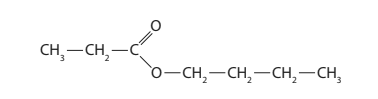
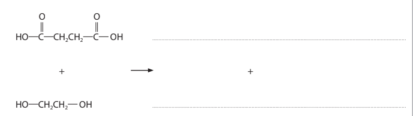

# Exam Questions — Alcohols
**4. Organic Chemistry** · Edexcel IGCSE Chemistry 4CH1
> Source: [https://www.savemyexams.com/igcse/chemistry/edexcel/19/topic-questions/4-organic-chemistry/4-5-alcohols/exam-questions/](https://www.savemyexams.com/igcse/chemistry/edexcel/19/topic-questions/4-organic-chemistry/4-5-alcohols/exam-questions/) · 18 questions · total 148 marks

## Q1 — medium — 14 marks

### 2 — 4 marks — command: multiple — structured
This question is about alcohols.

i) State two methods used to produce ethanol.

[2]

Method 1: ..........................................................

Method 2: .........................................................

ii) Write a chemical equation for each method.

[2]

Method 1: ...............................................................................................

Method 2: ...............................................................................................

### 2 — 7 marks — command: multiple — structured
The table gives some information about the two methods.

|   | Method 1 | Method 2 |
|---|---|---|
| Name of method |   |   |
| Temperature |   | 300 oC |
| Catalyst | yes | yes |
| Rate of reaction | slow | fast |

i) Complete the missing information.

[3]

ii) State the catalysts used in each method and explain one advantage of each.

[4]

### 2 — 3 marks — command: explain — structured
One of the methods takes place in anaerobic conditions.

State the meaning of anaerobic and explain why it is necessary.

## Q2 — hard — 14 marks

### 7(a) — 6 marks — command: multiple — structured — from paper 2020 · Ja2CR
Ethanol, C2H5OH, can be produced by the fermentation of glucose, C6H12O6

i) Complete the equation for the fermentation of glucose.

(1)

C6H12O6  → 2C2H5OH + 2 ........................................

ii) State why it is necessary for fermentation to be done in the absence of air.

(1)

iii) Explain why the temperature should not be higher than 40 °C.

(2)

iv) When 4 mol of glucose is fermented, a mass of 55.2 g of ethanol is produced. Show that the percentage yield of ethanol is 15%. [*M*r of C2H5OH = 46]

(2)

### 7(b) — 4 marks — command: multiple — structured — from paper 2020 · Ja202CR
Ethanol can also be produced by the reaction between ethene and steam. The equation for the reaction is

C2H4 (g) + H2O (g) $\rightleftharpoons$ C2H5OH (g)

i) This reaction is in dynamic equilibrium. Give two features of a reaction in dynamic equilibrium.

(2)

ii) When the equilibrium mixture is heated, the yield of ethanol decreases. Explain whether the forward reaction is exothermic or endothermic.

(2)

### 7(c) — 4 marks — command: multiple — structured — from paper 2020 · Ja2CR
Carboxylic acids react with alcohols to form esters. The displayed formula of an ester is

i) Carboxylic acid A and alcohol B react to produce this ester. Give the displayed formula of carboxylic acid A and of alcohol B.

(2)

ii) Indicators can be used to test for carboxylic acids. Describe a different chemical test for a carboxylic acid.

(2)

## Q3 — easy — 1 marks

### 4 — 1 mark — multiple_choice
Which is of these is true about the manufacture of ethanol?
- **A.** Fermentation has a 100% atom economy
- **B.** The hydration of ethene has a 100% atom economy
- **C.** Fermentation produces pure ethanol
- **D.** Alkenes are reactive so the hydration of ethene occurs readily at room temperature

## Q4 — hard — 13 marks

### 10(a) — 4 marks — command: multiple — structured — from paper 2020 · N2H
Ethanol can be produced from an aqueous solution of a carbohydrate, such as glucose.

The diagram below shows a flask fitted with a cotton wool plug. The flask contains an aqueous solution of a carbohydrate.

i) State two steps that need to be taken to turn the solution of the carbohydrate in the flask into a solution of ethanol.

(2)

ii) The apparatus shown in the diagram below is used to increase the concentration of the dilute solution of ethanol.

This apparatus did not produce a very concentrated solution of ethanol. Describe how the apparatus can be altered to produce a more concentrated solution of ethanol.

(2)

### 10(b) — 3 marks — command: calculate — structured — from paper 2020 · N2H
The equation for the fermentation of the carbohydrate glucose, C6H12O6, is

C6H12O6 → 2C2H5OH + 2CO2

Calculate the maximum mass of carbon dioxide that could be produced if 135 g of this carbohydrate is fully fermented

(*M*r:    CO2 = 44;    C6H12O6 = 180)

mass of carbon dioxide = ............................... g

### 10(c) — 2 marks — command: calculate — structured — from paper 2021 · N2H
Sucrose is another type of carbohydrate that can be used to produce alcohols. Calculate the total number of atoms in 10.0 g of sucrose, C12H22O11. 
(*M*r: C12H22O11 = 342; Avogadro constant = 6.02 × 1023)

number of atoms = ......................................

### 6 — 4 marks — command: multiple — structured — from paper 2011 · Ju32
Alcohols can be produced in a number of different ways.

Methanol can be made from a mixture of carbon monoxide and hydrogen.

CO (g) + 2H2 (g) $\rightleftharpoons$ CH3OH (g)

The forward reaction is exothermic.

i)  Explain why the concentration of methanol at equilibrium does not change.

(2)

ii)  Suggest conditions, in terms of temperature and pressure, which would give a high yield of methanol.

(2)

## Q5 — easy — 1 marks

### 6 — 1 mark — multiple_choice
When ethanol is heated with potassium dichromate(VI) and one other reagent, a reaction occurs.

Which statement about the reaction is correct?
- **A.** The colour change that occurs during the reaction is from green to orange
- **B.** The other reagent is sulfuric acid
- **C.** The product of the reaction is ethene
- **D.** This is an example of a displacement reaction

## Q6 — medium — 15 marks

### 4(a) — 1 mark — command: give — structured — from paper 2020 · Nov2C
Alcohols contain the functional group —OH

Give the structural formula of the alcohol that contains one carbon atom.

### 4(b) — 5 marks — command: multiple — structured — from paper 2020 · Nov2C
Ethanol (C2H5OH) is an alcohol that can be obtained from glucose (C6H12O6).

i) Name the process that converts glucose into ethanol.

(1)

ii) Explain why this process is carried out in the absence of air and at a temperature below 40 °C.

(4)

### 4(c) — 4 marks — command: multiple — structured — from paper 2020 · Nov2C
The table gives information about some organic compounds in the same homologous series.

| **Compound** | **Molecular formula** | **Displayed formula** |
|---|---|---|
| ethanoic acid | C2H4O2 |   |
| propanoic acid |   |  |
|   | C4H8O2 |  |

i) Complete the table by giving the missing information.

(3)

ii) Name the homologous series that contains these compounds.

(1)

### 4(d) — 5 marks — command: multiple — structured — from paper 2020 · Nov2C
The compounds in the table can react with alcohols to form esters.

When preparing esters, a small amount of concentrated sulfuric acid is also used.

i) State the purpose of the acid.

(1)

ii) Draw the displayed formula of the ester that forms when propanoic acid reacts with ethanol.

(2)

iii) Esters have particular uses that depend on their properties. Give an example of a property and use of esters.

(2)

property .....................................................................................................

use ..........................................................................................................

## Q7 — easy — 1 marks

### 8 — 1 mark — multiple_choice
Ethanol is produced by fermentation.

Which of the following conditions is **not **required to produce ethanol by fermentation?
- **A.** A temperature of between 15 oC and 35 oC
- **B.** The addition of yeast
- **C.** The presence of oxygen
- **D.** Sugar or starch dissolved in water

## Q8 — hard — 8 marks

### 9 — 1 mark — command: draw — structured
This question is about alcohols.

Alcohols have the general formula CnH2n+1OH.

Draw the displayed formula of propanol.

### 9 — 1 mark — command: deduce — structured
Deduce the molecular formula of the alcohol that has a relatvie molecular mass of 102.

### 9 — 3 marks — command: write — structured
Alcohols undergo combustion reactions.

Write a balanced symbol equation for the complete combustion of butanol.

### 9 — 3 marks — command: describe — structured
Describe the conditions needed to convert ethene to ethanol.

## Q9 — medium — 9 marks

### 3(a) — 2 marks — command: state — structured — from paper 2019 · Ju2C
Methanol, ethanol, propanol and butanol are alcohols. They are all liquids that evaporate easily when warmed. A student uses this apparatus to compare the time taken for the four liquids to evaporate.

She uses this method:

- pour some methanol into an evaporating basin
- place the evaporating basin on top of a beaker containing hot water
- measure the time taken for the methanol to evaporate completely
- repeat the experiment with each of the other alcohols, using the same apparatus

State two variables the student should control to make sure her results are valid.

### 3(b) — 1 mark — command: state — structured — from paper 2019 · Jy2C
State why it is not safe to heat the evaporating basin directly with a Bunsen flame.

### 3(c) — 6 marks — command: multiple — structured — from paper 2019 · Ju2C
The table shows the results of experiments done by four students, A, B, C and D.

| **Alcohol** | **Formula** **of** **alcohol** | **Time taken for liquid to evaporate in s** |   |   |   |   |
|---|---|---|---|---|---|---|
| **Student** **A** | **Student** **B** | **Student** **C** | **Student** **D** | **Mean time in s** |   |   |
| methanol | CH3OH | 20 | 24 | 22 | 26 | 23 |
| ethanol | C2H5OH | 32 | 34 | 35 | 30 | 33 |
| propanol | C3H7OH | 45 | 47 | 50 | 48 | 48 |
| butanol | C4H9OH | 64 | 63 | 90 | 60 |   |

i) Calculate the mean (average) time for butanol to evaporate.

mean time = ..............................................................s

(2)

ii) Explain how the results show which alcohol evaporates most easily.

(2)

iii) State the relationship between the number of carbon atoms in the molecule and how easily the alcohol evaporates.

(2)

## Q10 — medium — 7 marks

### 4(a) — 2 marks — command: complete — structured — from paper 2021 · Jan2CR
This question is about alcohols, carboxylic acids and esters.

The table gives information about some alcohols.

| **Alcohol** | **Structural formula** | **Relative formula mass** |
|---|---|---|
| Methanol | CH3OH | 32 |
| Ethanol | C2H5OH |   |
|   | C4H9OH | 74 |

Complete the table by giving the missing information

### 4(b) — 2 marks — command: multiple — structured — from paper 2021 · Jan2CR
Ethanol can be oxidised to ethanoic acid by heating with potassium dichromate(VI) and another reagent.

i) Name the other reagent.

(1)

ii) State the colour change that occurs during this reaction.

(1)

from ........................................ to ................................................

### 4(c) — 3 marks — command: multiple — structured — from paper 2021 · Jan2CR
Alcohols react with carboxylic acids to form esters.

i) Name the ester that forms when ethanol reacts with ethanoic acid.

(1)

ii) Complete the equation for the reaction between methanol and ethanoic acid.

(2)

CH3OH + ......................................→ .............................................. + H2O

## Q11 — medium — 12 marks

### 9(a) — 6 marks — command: multiple — structured — from paper 2017 · Specimen2C
#### Separate: Chemistry Only

Grapes contain glucose that can be fermented to make ethanol.

The grapes are collected and crushed to produce an aqueous solution containing glucose. Yeast is added to the solution and the mixture is left to ferment at a temperature of about 30 °C in the absence of air.

i) State why yeast is added.

(2)

ii) Explain why another organic compound may also be formed if fermentation is carried out in the presence of air.

(2)

iii) Explain why 30 °C is considered to be an optimum temperature for this reaction.

(2)

### 9(b) — 4 marks — command: multiple — structured — from paper 2017 · Specimen2C
#### Separate: Chemistry Only

Ethanol can also be manufactured by reacting ethene with steam.

i) Write the chemical equation for this reaction.

(1)

ii) Name the type of reaction that occurs.

(1)

iii) State **two** conditions used for this reaction in industry.

(2)

### 9(c) — 2 marks — command: deduce — structured — from paper 2017 · Specimen2C
Grapes also contain esters. The formula of an ester is shown.

Deduce the name of the carboxylic acid and the alcohol that can react together to make this ester.

carboxylic acid .................................................................................... alcohol ....................................................................................

## Q12 — medium — 1 marks

### 13 — 1 mark — multiple_choice
Butanol is a member of the homologous series of alcohols.

Which of the following is **not** a formula of butanol?
- **A.** C4H10O
- **B.** C4H10OH
- **C.** C4H9OH
- **D.** CH3CH2CH2CH2OH

## Q13 — easy — 6 marks

### 14 — 1 mark — command: give — structured
The alcohols form a homologous series.

Give the name of the third member of this series.

### 14 — 2 marks — command: calculate — structured
Calculate the relative formula mass of hexanol, C6H13OH.

(*A*r: C = 12,     H = 1,     O = 16)

relative formula mass = ........................................

### 14 — 2 marks — command: place — structured
Alcohols can be oxidised to form organic compounds from a different homologous series.

Place ticks (✔) in boxes by the two statements that are correct

| Alkenes are formed when alcohols are oxidised |   |
|---|---|
| Ethanol oxidises to form ethanoic acid |   |
| Alcohols can be oxidised by heating with potassium dichromate(VI) in dilute sulfuric acid |   |
| Alcohols are oxidised by fermenting at 30 °C with the absence of oxygen |   |
| When ethanol oxidises in air, carbon dioxide is produced |   |

### 14 — 1 mark — multiple_choice
The structural formula of the first four alcohols in the homologous series are shown below, in order.

- CH3OH
- C2H5OH
- C3H7OH
- C4H9OH

Which of the following structural formulae is the correct formula for the fifth member of the series?
- **A.** C5H10OH
- **B.** C5H11COOH
- **C.** C5H11OH
- **D.** C5H13OH

## Q14 — easy — 6 marks

### 15 — 1 mark — multiple_choice
#### Separate: Chemistry Only

Methanol and ethanol are both members of the same homologous series.

Which of the following is the functional group of this homologous series?
- **A.** C=C
- **B.** –COOH
- **C.** –OH
- **D.** C–C

### 15 — 1 mark — multiple_choice
Which of the following is **not** a feature of a homologous series?
- **A.** the compounds differ by CH2 in molecular formula from neighbouring compounds
- **B.** they have similar chemical properties
- **C.** they have the same general formula
- **D.** they have the same physical properties

### 15 — 2 marks — command: complete — structured
Ethanoic acid can be produced from ethanol.

Use words from the box to complete the sentences about ethanol and ethanoic acid.

| –OH | oxidised | –COOH | displaced |
|---|---|---|---|
| reduced | C=C | neutralised | decomposed |

Ethanol can be ............................... to form ethanoic acid.

The functional group of ethanoic acid is ....................................... .

### 15 — 2 marks — command: draw — structured
Like methanol and ethanol, butanol is an alcohol. Draw the structure of butanol. You should show all of the bonds in the structure.

## Q15 — medium — 1 marks

### 16 — 1 mark — multiple_choice
Which of the following reactions does **not **involve the oxidation of ethanol?
- **A.** Production of ethanol from the fermentation of glucose
- **B.** Heating ethanol with potassium dichromate(VI) in dilute sulfuric acid
- **C.** Reaction of ethanol with oxygen in the air
- **D.** Formation of carbon dioxide and water from the complete combustion of ethanol

## Q16 — hard — 11 marks

### 6(a) — 3 marks — command: multiple — structured — from paper 2020 · Ja202C
Ethanol, C2H5OH, can be manufactured from ethene and steam using a phosphoric acid catalyst.

i) State the temperature and pressure used in this manufacturing process.

temperature ................................................................................................ pressure ........................................................................................................

(2)

ii) Draw the displayed formula of ethanol.

(1)

### 6(b) — 3 marks — command: multiple — structured — from paper 2020 · Ja202C
Ethanol burns in a plentiful supply of air to form carbon dioxide and water.

i) Give the chemical equation for this reaction.

(2)

ii) When the air supply is limited, incomplete combustion occurs and carbon monoxide forms.
State why carbon monoxide is poisonous to humans.

(1)

### 6(c) — 1 mark — command: give — structured — from paper 2020 · Ja202C
When ethanol reacts with ethanoic acid, an ester forms.

Give the name of this ester.

### 17 — 4 marks — command: multiple — structured
Butanedioic acid and ethanediol react together to form a polyester and water.

i) Give the name of this type of polymerisation.

(1)

ii) Complete the equation. 
Show only one repeat unit of the polyester.

(3)

## Q17 — hard — 14 marks

### 5(a) — 2 marks — command: give — structured — from paper 2021 · Jun2C
Ethanol, C2H5OH, is a member of the homologous series of alcohols.

Give two characteristics of a homologous series.

1. ................................................................

2. ................................................................

### 5(b) — 5 marks — command: multiple — structured — from paper 2021 · Jun2C
When ethanol is heated with potassium dichromate(VI) and one other reagent, the ethanol is oxidised to ethanoic acid, CH3COOH.

i) Give the formula of the other reagent.

(1)

ii) State the colour change that occurs during this oxidation reaction.

(2)

from ............................to ..........................

iii) Draw the displayed formulae for ethanol and ethanoic acid in the boxes.

(2)

### 5(c) — 7 marks — command: multiple — structured — from paper 2021 · Jun2C
Ethanol can be manufactured by two different methods. The table gives some information about the two methods.

|   | **Hydration of ethene** | **Fermentation of glucose** |
|---|---|---|
| raw material | crude oil | sugar cane |
| rate of reaction | fast | slow |
| purity of ethanol | pure | impure |
| operating temperature | 300 °C | 30 °C |
| operating pressure | 60-70 atmospheres | 1 atmosphere |
| catalyst | phosphoric acid | enzymes in yeast |

i) Discuss the advantages and disadvantages of these two methods, using information from the table.

(6)

ii) The word equation for the fermentation process is

glucose → ethanol + carbon dioxide

Complete the chemical equation for this reaction.

(1)

C6H12O6 → ...................................+ .......................................

## Q18 — medium — 14 marks

### 6(a) — 4 marks — command: multiple — structured — from paper 2019 · Ju2C
Some cars in Brazil use ethanol, C2H5OH, as a fuel instead of petrol. The ethanol is made by the fermentation of glucose which is obtained from sugar cane. The sugar is extracted from the sugar cane and then dissolved in water to make a sugar solution.

i) Name the substance that is added to the sugar solution that causes glucose to ferment.

(1)

ii) Which temperature is the most suitable for fermentation?

|   | ☐ | **A** | 0°C |
|---|---|---|---|
|   | ☐ | **B** | 10°C |
|   | ☐ | **C** | 30°C |
|   | ☐ | **D** | 80°C |

(1)

iii) Explain why fermentation is done in the absence of air.

(2)

### 6(b) — 3 marks — command: multiple — structured — from paper 2019 · Ju2C
i) State what is meant by the term **fuel**.

(1)

ii) Write a chemical equation for the complete combustion of ethanol in air.

(2)

### 6(c) — 2 marks — command: state — structured — from paper 2019 · Ju2C
Ethanol is also manufactured by reacting steam with ethene, C2H4

The equation for this reaction is:

C2H4 (g) + H2O (g) → C2H5OH (g)

State the conditions of temperature and pressure used in this process.

temperature .......................................

pressure ...............................................

### 6(d) — 5 marks — command: multiple — structured — from paper 2019 · Ju2C
When ethanol is heated with acidified potassium dichromate(VI), it is oxidised to ethanoic acid.

i) State the colour change that occurs in the potassium dichromate(VI) during this reaction.

from .........................................................to ...............................................

(1)

ii) The structural formula of ethanoic acid is CH3COOH.

Draw the displayed formula of ethanoic acid.

(2)

iii) Complete the equation for the reaction of ethanoic acid with sodium.

.......CH3COOH (aq) + .........Na (s) → .......................... (aq) + .......................... (g)

(2)
