# Mark Schemes — Esters
**4. Organic Chemistry** · Edexcel IGCSE Chemistry 4CH1

## Q1 — medium — 4 marks

### 2 — 3 marks
> **[mark-scheme]**
> i) The name of the ester produced is:
> 
> - Ethyl propanoate **[1 mark]**
> 
> ii) Two characteristics of a dynamic equilibrium are:
> 
> - The forward and reverse reactions occur at the same rate **[1 mark]**
> - The concentrations of reactants and products remain constant **[1 mark]**

> **[exam-tip]**
> The name of an ester has two parts. A good way to remember the rule is:
> 
> 1. The **first part** of the name comes from the **alcohol**.
> 
>   - Change the "-anol" ending to "-yl".
>   - e.g., ethan**ol** → eth**yl**
> 2. The **second part** of the name comes from the **carboxylic acid**.
> 
>   - Change the "-oic acid" ending to "-oate".
>   - e.g., propan**oic acid** → propan**oate**
> 
> **Dynamic equilibrium**
> 
> Remember that "dynamic" means the forward and reverse reactions are still happening, but **at the same rate**, so there is no overall change. A common mistake is to think the reaction has stopped.
> 
> Another common error is to state that the amounts of reactants and products are equal; they are **not equal**, they are just **constant**.
> 
> You might get credit for saying that a dynamic equilibrium occurs in a **closed system**, but this is not in the specification.

### 2 — 1 marks
**Correct answer: C** — 

**Final answer:** **The correct answer is C **

- An ester has the functional group RCOOR
- A carboxylic acid has the functional group -COOH

**A** is incorrect as this group (sometimes called an ester link) is present in both esters and carboxylic acids

**B** is incorrect as the carbonyl group (C=O) is present in both esters and carboxylic acids

**D** is incorrect as this piece can appear in a number of organic molecules including esters and ethers

> **[exam-tip]**
> It's important to distinguish between a **functional group** and a specific example of a molecule containing that group.
> 
> - The **ester functional group** is the RCOOR arrangement of atoms that is common to all esters.
> - A specific ester, like methyl ethanoate, contains this group but also has specific alkyl groups (e.g., -C3) attached.
> 
> This question asks for the functional group itself, which is represented by structure **C**.

## Q2 — hard — 15 marks

### 7(a) — 4 marks
i) The functional group in ester A is:

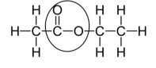

- Ring drawn around COO atoms; **[1 mark]**

ii) The name of ester A is:

- Ethyl ethanoate; **[1 mark]**

iii) A chemical test, other than using an indicator, to show that the reaction mixture contains ethanoic acid is:

Alternative 1

- Add a metal such as magnesium, aluminium, zinc or iron; **[1 mark] **
- Effervescence / bubbles / fizzing; **[1 mark]**

Alternative 2

- Add a carbonate; **[1 mark] **
- Effervescence / bubbles / fizzing; **[1 mark]**

**[Total: 4 marks]**

- *The ester group contains -C=O and C-O- so only these parts should be circled *
- *The gases formed from the chemical tests outlined above can also be tested*

  - *Test gas with lighted splint which pops*
  - *Test gas with limewater which goes cloudy / milky *

### 7(b) — 2 marks
The molar enthalpy change (Δ*H*) for the reaction between ester A and water is 0 kJ / mol because:

- C-O and one / two O-H bonds are broken and formed; **[1 mark]**
- So the same amount of energy is needed to break the bonds in the reactants as is given off when the bonds in the products are formed; **[1 mark]**

**[Total: 2 marks]**

- *If the enthalpy change (Δ**H**) is 0 kJ/mol then the reaction is neither exothermic or endothermic*
- *This is because the same bonds are broken and formed or the energy of bonds formed equals energy of bonds broken*

### 7(c) — 4 marks
i) A dynamic equilibrium is:

- The rate of the forward reaction equals the rate of the backward reaction; **[1 mark]**
- The concentrations of reactants and products remain constant; **[1 mark]**

ii) Adding a catalyst does not change the position of equilibrium because:

- A catalyst increases the rate of forward and backward reactions; **[1 mark]**
- Equally; **[1 mark] **

**[Total: 4 marks]**

- *A common error that students make is to say that the concentrations of reactants and products are equal when describing a dynamic equilibrium *
- *The concentration of reactants and products remains constant *
- *At equilibrium the concentration of reactants could be higher than products or vice versa*
- *Adding a catalyst will just speed up the rate at which you will reach equilibrium *

### 7(d) — 3 marks
The amount, in moles, of ethanoic acid neutralised is:

- Number of moles of barium hydroxide = (0.150 × 22.75) ÷ 1000 
**OR **
0.0034125; **[1 mark]**
- Moles of ethanoic acid = 0.0034125 x 2 =) 0.006825;** [1 mark]**
- Moles of ethanoic acid to 3 significant figures = 0.00683 / 6.83 x 10-3; **[1 mark]**

**[Total: 3 marks]**

- *The number of moles is calculated by the equation: *`moles space equals space concentration space cross times space volume space open parentheses in space dm cubed close parentheses space OR space concentration space cross times space fraction numerator volume space open parentheses in space cm cubed close parentheses over denominator 1000 end fraction`
- *Once the number of moles of barium hydroxide has been found, the number of moles of ethanoic needed to neutralise this is determined by the reacting ratio from the balanced symbol equation:*

  - *1 mole of barium hydroxide reacts with 2 moles of ethanoic acid*
  - *So, 0.0034125 moles of barium hydroxide will react with twice this number of moles of ethanoic acid = 2 x 0.0034125 = 0.006825 moles*
- *Remember to give your answer to 3 sig fig, if a value ends in 5, round up*
- *For the 1st marking point, you should give at least 3 sig fig*

  - *If you used 3 sig fig, you would end up with 0.00682, which would be accepted*
- *You will gain full marks if you gain the correct answer without workings, but it is really important to lay your calculation out clearly so you can still pick up marks if you make a mistake*

### 7(e) — 2 marks
The repeat unit of the polymer formed is:

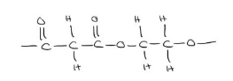

- Three carbons from the dicarboxylic acid and two from the diol and the ester linkage; **[1 mark]**
- -OH lost from the dicarboxylic acid and -H lost from the diol; **[1 mark]**

**[Total: 2 marks]**

- *When drawing the repeat unit - remove both of the -OH from the dicarboxylic acid and the -H from both of the OH on the diol*

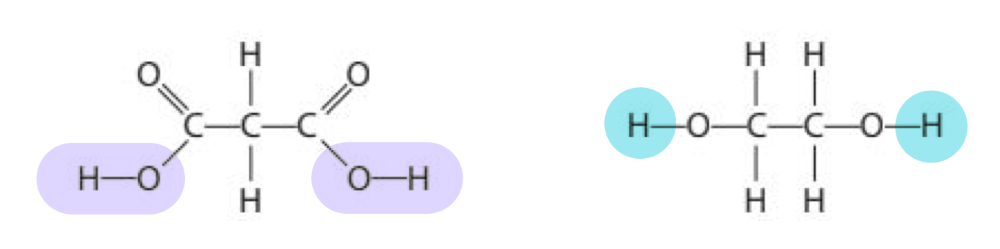

- *Then join the 2 structures together to form the ester link -COO-*
- *The structure should have extension bonds either side of the repeat unit, although you would not be penalised if you didn't include these*
- *Water is also formed but you do not need to show this*
- *If you had shown the -OH lost from diol and -H lost from dicarboxylic acid, you would still gain the marks*

## Q3 — easy — 1 marks

### 4 — 1 marks
**Correct answer: C** — They have fragrant odours

**Final answer:** **The correct answer is C**

- Esters are used in perfumes and flavourings due to their distinctive and fragrant smells

## Q4 — medium — 1 marks

### 5 — 1 marks
**Correct answer: D** — The ethyl ethanoate collected is pure

**Final answer:** **The correct answer is D**

- The ester distills first due to its high volatility and low boiling point
- Small amounts of ethanol, sulfuric acid and ethanoic acid will also have evaporated and be present in the solution
- Therefore the ester formed is not pure initially
- Ethanol is removed using calcium chloride solution
- Acidic impurities are removed using sodium carbonate

## Q5 — hard — 12 marks

### 6 — 2 marks
i) The displayed formula of ethanoic acid, showing all bonds is:

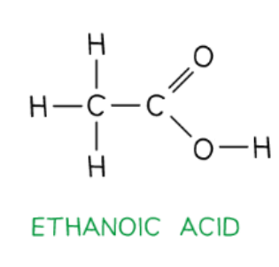

- Correct structure showing the bonds; **[1 mark]**

ii) The displayed formula of ethanol, showing all bonds is:

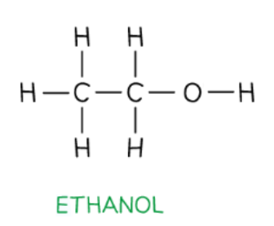

- Correct structure showing the bonds; **[1 mark]**

**[Total: 2 marks]**

- *The stem 'eth' tells you that both compounds have 2 carbon atoms*
- *The ending 'oic acid' means that it contains the functional group -COOH*
- *The ending 'ol' means that it contains the -OH group*
- *When drawing the displayed formula, you should show all of the bonds in the molecule*
- *In this question, you would not get penalised if you omitted the OH bond in either ethanoic acid or ethanol*

### 6 — 5 marks
i) The name of this ester is:

- Ethyl ethanoate; **[1 mark]**

ii) The structure of the polyester which can be formed from the monomers shown in the questions is:

–OCC6H4COOCH2CH2O–

- Correct ester linkage; **[1 mark]**
- Correct repeat units; **[1 mark]**
- Continuation bonds; **[1 mark]**

iii) The pollution problems caused by non-biodegradable polymers are:

Any **one** from:

- They take a long time to decay; **[1 mark]**
- (They take up space in) landfill sites; **[1 mark]**
- Visual pollution / litter; **[1 mark]**
- Danger to animals; **[1 mark]**
- Produce poisonous gases when burnt;  **[1 mark]**

**[Total: 5 marks]**

- *To draw the structural formula of the polyester, remove the OH from either end of the carboxylic acid and the H from either end of the alcohol:*

  - *—OC—C**6**H**4**—CO— and —O—CH**2**—CH**2**—O—*
- *Now join them together by an ester linkage —COO—:*

  - *—OC—C**6**H**4**—COO—CH**2**—CH**2**—O—*
- *Usually in structural formula, most of the covalent bonds are omitted but it is important that you keep the bonds at either end, to show that this is a repeating unit:*

  - *—OCC**6**H**4**COOCH**2**CH**2**O—*

### 6 — 3 marks
i) The catalyst needed to form an ester from ethanoic acid and methanol is:

- (Concentration) sulfuric acid; **[1 mark]**

ii) The ester formed when ethanoic acid reacts with methanol is:

- Methyl ethanoate; **[1 mark]**

iii) The structural formula of the ester formed when ethanoic acid reacts with methanol is:

- CH3COOCH3; **[1 mark]**

**[Total: 4 marks]**

- *Esters are formed from alcohols and carboxylic acids *
- *The first part of the name indicates the length of the carbon chain in the alcohol, and it ends with the letters ‘- yl’*
- *The second part of the name indicates the length of the carbon chain in the carboxylic acid, and it ends with the letters ‘- oate’*
- *So. the ester formed from** meth**anol and ***ethan***oic acid is called **meth**yl ***ethan***oate*
- *When giving the structural formula of an ester- the methyl part is given after the COO group, and the carboxylic acid before it*

### 7 — 2 marks
The relative molecular mass of methyl butanoate is:

- (5 x 12) + (10 x 1) + (2 x 16); **[1 mark]**
- = 102; **[1 mark]**

**[Total: 2 marks]**

- *A correct answer of 90 scores 2 marks, with or without working*
- *Be careful in this question as you need to first work out the number of each element in methyl butanoate *
- *When methanol, CH**3**OH, and butanoic acid, C**3**H**7**COOH react*

  - *Butanoic acid loses the OH group leaving C**4**H**7**O*
  - *Methanol loses the H from the OH group leaving CH**3**O*
- *So the resulting ester will contain:*

  - *5 carbon atoms (4 from butanoic acid and 1 from methanol)*
  - *10 hydrogen atoms (7 from butanoic acid and 3 from methanol)*
  - *2 oxygen atoms (1 from butanoic acid and 1 from methanol)*
- *Then you need to multiply the** A**r** of each element by the number of atoms of that element and add these together:*

  - *(5 x 12) + (10 x 1) + (2 x 16) = 102*

## Q6 — hard — 12 marks

### 7 — 3 marks
i) The displayed formula and identifying the functional group:

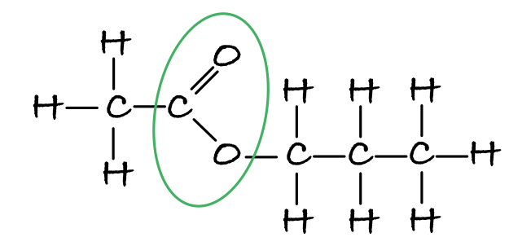

- Correct displayed formula: **[1 mark]**
- -COO- circled; **[1 mark]**

ii) The name of the alcohol used to make this ester is:

- Propanol; **[1 mark]**

**[Total: 3 mark]**

- *Make sure you show all of the bonds when drawing the displayed formula*
- *The functional group of an ester is COO so you need to make sure that these 3 atoms - and these only- are circled*
- *Careful**: The question in part ii) asks you to identify the name of the alcohol used to prepare this ester NOT the name of the ester, sometimes students misread and incorrectly give propyl ethanoate as their answer*
- *The alcohol part of the ester is the part to the right of the COO group*

  - *CH**3**COO**CH**2**CH**2**CH**3*

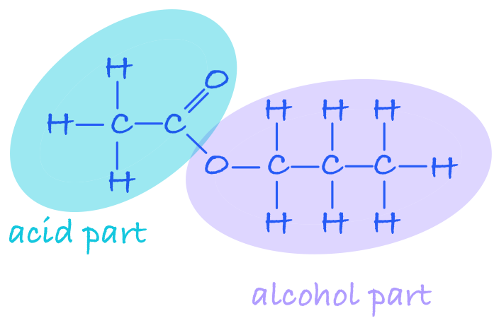

- *This has 3 carbon atoms, so the alcohol that formed this ester, must have the prefix prop-*

### 7 — 2 marks
The balanced equation for the production of CH3(CH2)2COOCH3 is:

CH3(CH2)2COOH + CH3OH → CH3(CH2)2COOCH3 + H2O

- Correct formula for the reactants; **[1 mark]**
- Rest of the equation correct; **[1 mark]**

**[Total: 2 marks]**

- *Don't be put off by the more complicated formula of the ester *
- *To deduce the formula of the carboxylic acid and alcohol, work backwards from the formula of the ester*
- *During esterification, the carboxylic acid loses OH and the alcohol loses the H from the OH group, so split the ester between the two O atoms:*

  - *CH**3**(CH**2**)**2**CO and OCH**3*
- *Add an OH to the carboxylic acid part:*

  - *CH**3**(CH**2**)**2**COOH*
- *Add an H to the alcohol part:*

  - *CH**3**OH*
- *So these are the reactants*
- *Don't forget that the OH and H that are removed join together to form a water molecule - students often forget to include the water molecule in equations showing esterification*

### 7 — 4 marks
To show that ester **X** is not the ester with the formula CH3(CH2)2COOCH3:

- Percentage of oxygen = 53.37%; **[1 mark]**
- Divide percentages by relative atomic masses: 
C = $\frac{39.98}{12}$ **OR **3.33(167) 
**AND** 
H = $\frac{6.65}{1}$ **OR **6.65 
**AND** 
O = $\frac{53.37}{16}$ **OR **3.34 **OR **3.3356(25); **[1 mark]**
- Divide results by the smallest value to obtain the ratio, C:H:O = 1:2:1; **[1 mark]**
- The empirical formula of ester **X **is CH2O **AND** The (empirical formula of the) other ester CH3(CH2)2COOCH3 is C5H10O2 (so they cannot be the same esters); **[1 mark]**

**[Total: 4 marks]**

- *You are only given the percentages of carbon and hydrogen but esters also contain oxygen*
- *You, therefore, need to work out the percentage of oxygen present:*

  - *100 - 39.98 - 6.65 = 53.37%*
- *To show that they are not the same ester, you need to compare their empirical formulae*

  - *So, you must give both empirical formulae to be awarded the final mark*

### 7 — 3 marks
The molecular formula of ester **X** is:

- Relative molecular mass of CH2O = 12 + (2 x 1) + 16 = 30; **[1 mark]**
- $\frac{60}{30}$ = 2; **[1 mark]**
- Molecular formula of ester **X** = C2H4O2; **[1 mark]**

**[Total: 3 marks]**

- *If the mass of the CH**2**O is 30 and the mass of the ester is twice this, then there must be 2 x CH**2**O within the molecule*
- *Ester **X** is methyl methanoate*

## Q7 — medium — 1 marks

### 8 — 1 marks
**Correct answer: C** — Ethyl methanoate

**Final answer:** **The correct answer is C**

- When naming an ester the first part of the name is derived from the alcohol and the second part of the name is derived from the carboxylic acid
- The alcohol used is ethanol - the first part of the ester name is therefore ethyl
- The carboxylic acid used is methanoic acid - the second part of the ester name is therefore methanoate
- The ester is ethyl methanoate

## Q8 — easy — 1 marks

### 9 — 1 marks
**Correct answer: D** — Thermal decomposition

**Final answer:** **The correct answer is D**

- The reaction to form an ester is called esterification
- The following reversible reaction occurs:

CH3COOH + C2H5OH $\rightleftharpoons$** **CH3COOC2H5 + H2O

- This is known as a condensation reaction because water is formed when the ethanol and ethanoic acid react

  - A condensation involves the removal of a small molecule, commonly (but not always) water
- Thermal decomposition does not occur

## Q9 — hard — 8 marks

### 10 — 1 marks
**Correct answer: D** — butanol and methanoic acid

**Final answer:** **The correct answer is D**

- For this question, you needed to work out the resulting ester from the reactants given and then deduce whether it had the empirical formula C2H4O
- The reactants in option **D** will form butyl methanoate:

  - Butanol, C4H9OH, would have the H removed from the OH group - leaving C4H9O
  - Methanoic acid, HCOOH, would have the OH removed, leaving HCO
  - Combining these, the resulting ester, butyl methanoate, would have the molecular formula C5H10O2, this is the simplest ratio so is also its empirical formula
- Working through the other reactants in a similar way will show that they have the empirical formula C2H4O:

  - The reactants in option **A** will form methyl propanoate:
  
    - Methanol, CH3OH, would have the H removed from the OH group - leaving CH3O
    - Propanoic acid, C2H5COOH, would have the OH removed, leaving C2H5CO
    - Combining these, the resulting ester, methyl propanoate, would have the molecular formula C4H8O2, and its empirical formula is therefore C2H4O
  - The reactants in option **B** will form ethyl ethanoate:
  
    - Ethanol, C2H5OH, would have the H removed from the OH group - leaving C2H5O
    - Ethanoic acid, CH3COOH, would have the OH removed, leaving CH3CO
    - Combining these, the resulting ester, ethyl ethanoate, would have the molecular formula C4H8O2, and its empirical formula is therefore C2H4O
  - The reactants in option **C** will form propyl methanoate:
  
    - Propanol, C3H7OH, would have the H removed from the OH group - leaving C3H7O
    - Methanoic acid, HCOOH, would have the OH removed, leaving HCO
    - Combining these, the resulting ester, propyl methanoate, would have the molecular formula C4H8O2, and its empirical formula is therefore C2H4O

### 10 — 2 marks
The ester is separated from the reaction mixture by:

- (Fractional) distillation;** [1 mark]**
- The ester distils first because it has a lower boiling point;** [1 mark]**

**[Total: 2 marks]**

- *Fractional distillation is used to separate two or more liquids that are miscible (i.e. mix with each other)*
- *The mixture should be heated until it reaches the temperature that corresponds to the lowest boiling point in the mixture which will cause all of that substance to evaporate and condense in the condenser so it can be collected*
- *This question is worth 2 marks, so it is a safe assumption that 1 mark is to explain how the ester is separated, i.e. what method is used and 1 mark to explain why it is separated, i.e. it has the lowest boiling point of the substances in the reaction mixture*

### 10 — 4 marks
The molecular formula of **Y** is:

- Relative mass of CHO2 = 12 + 1 + (2 x 16) = 45;** [1 mark]**
- ($\frac{90}{45}$ = 2), so molecular formula = C2H2O4;** [1 mark]**

ii) The displayed formula of the carboxylic acid, **Y** is:

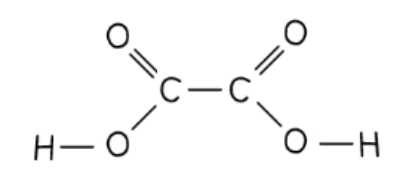

- Two -COOH groups;** [1 mark]**
- The rest of the structure correct;** [1 mark]**

**[Total: 4 marks]**

- *The carboxylic functional group is -COOH, which contains the same number of atoms of each element as the empirical formula of **Y*
- *Combining the fact that the molecular formula contains 4 oxygen atoms with your knowledge that polyesters can be formed from the reaction between a diol and dicarboxylic acid should lead you to deduce **Y** is a dicarboxylic acid*
- *Make sure you show the bond in the OH groups*

### 10 — 1 marks
The formula of the other product in this reaction is:

- H2O; **[1 mark]**

**[Total: 1 mark]**

- *The reaction between a carboxylic acid and alcohol is a condensation reaction in which a small molecule of water is also produced*
- *You must give the formula, as specified in the question, stating water would not gain the mark*

## Q10 — medium — 11 marks

### 5(a) — 3 marks
i) The chemical equation for the reaction of ethanoic acid, CH3COOH, with potassium carbonate solution is:

2CH3COOH + K2CO3 →  **2CH****3****COOK + CO****2**** + H****2****O**

- 2CH3COOK / 2KCH3COO / 2CH3COO-K+; **[1 mark]**
- CO2 + H2O;** [1 mark] **
*If the first mark is not awarded any numbers before CO**2** + H**2**O can be ignored and the second mark can be awarded* 
*For both marks to be awarded the equation must be correctly balanced*

ii) In this reaction, you would see:

- Effervescence / fizzing / bubbles; **[1 mark] **
*Ignore carbon dioxide / gas given off / evolved / formed / produced* *Ignore mention of incorrect gas*

**[Total: 3 marks]**

- *Like other acids, carboxylic acids will react with metal carbonates to form a salt + carbon dioxide + water*
- *Careful**: When you are asked for observations in a reaction, do not just state what is produced as this is not what the question is asking*
- *This question is testing your understanding that a gas is produced in the reaction, and that you see effervescence when gases are produced*

### 5(b) — 3 marks
i) The role of concentrated sulfuric acid in this reaction is:

- (It acts as a) catalyst;** [1 mark] **
*Accept increases the rate of the reaction / speeds up the reaction*

ii) A reason why the mixture is heated in a water bath rather than directly with a Bunsen burner flame is:

- Ethanol is flammable / might catch fire / might ignite; **[1 mark] **
*Accept ethyl ethanoate / the mixture / it is flammable / might catch fire / might ignite*

iii) You would know that ethyl ethanoate has formed because:

- (Esters have a) sweet / fruity / distinctive smell 
**OR** 
Liquid (ester) floats on top of mixture; **[1 mark]**

**[Total: 3 marks]**

- *The 'suggest' command word in part (ii) means that you may not have directly learnt this but you should be able to apply your knowledge to deduce a possible reason*

  - *You should know that alcohols are used as fuels as they readily undergo combustion - this means they are flammable*
- *You should know how esters are formed by esterification, including the use of an acid catalyst*
- *The sweet smell of esters makes them quite distinctive and is often used as a way to identify that an ester has been produced*

### 5(c) — 4 marks
i) The displayed formulae of methanol, propanoic acid and the ester, methyl propanoate are:

Methanol:

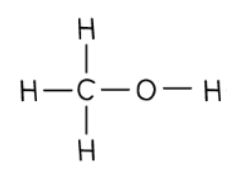

Propanoic acid:

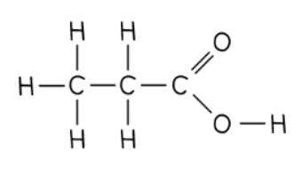

Methyl propanoate:

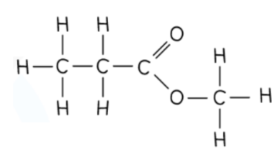

- Correct displayed formula for methanol; **[1 mark]**
- Correct displayed formula for propanoic acid; **[1 mark]**
- Correct displayed formula for methyl propanoate; **[1 mark]** *Penalise missing bond between O and H once only* *If incorrect number of carbon atoms in alcohol and or acid allow ECF for structure of ester formed from their alcohol  and acid*

ii) The name of the other product of this reaction is:

- Water / H2O; **[1 mark]**

**[Total: 4 marks]**

- *When drawing the displayed formula of an ester, remember that the part of the name ending in -yl comes from the alcohol used and the carbon chain from the alcohol will be attached to the -O- of the ester*

  - *Methanol is used, therefore 1 carbon atom will be attached to this oxygen atom*
- *The part of the name ending -anoate comes from the carboxylic acid and the carbon chain from the carboxylic acid will be attached to the 2 oxygen atoms*

  - *Propanoic acid is used so 3 carbon atoms are attached to the 2 oxygen atoms*
  - *Remember**: Count the carbon of the -COO- group when you are counting the number of carbon atoms*
- *The general equation for esterification  is:*

  - *alcohol + carboxylic acid → ester + water*

### 5(d) — 1 marks
One use of esters is:

- Food flavourings / perfumes; **[1 mark] **
*Accept any correct use e.g. in cosmetics / making soaps / making detergents / solvents (for paints / varnishes)*

**[Total: 1 mark]**

- *It is the distinctive sweet smell that make esters useful in these applications*
- *You are expected to know that they are used as food flavouring and in perfumes but not the other applications*

## Q11 — easy — 6 marks

### 12 — 2 marks
a)

i) The name that is given to this process is:

- Esterification; **[1 mark]**

ii) The other product formed during this reaction is:

- A / water; **[1 mark]**

**[Total: 2 marks]**

- *During the reaction, the OH from ethanoic acid and the H from the OH group of ethanol are removed, and they join together to form water*
- *This is also known as a condensation reaction *
- *A condensation reaction is one in which two molecules combine and a small molecule is eliminated, often the small molecule is water*

  - *You would score the first mark if you said condensation, but you are not expected to know this*

### 12 — 2 marks
The relative molecular mass of ethyl ethanoate is:

- (4 x 12) + (8 x 1) + (2 x 16);** [1 mark]**
- = 88; **[1 mark]**

**[Total: 2 marks]**

- *A correct answer of 88 would score 2 marks, with or without workings*
- *From the displayed formula, you should see that ethyl ethanoate has 4 carbon atoms, 8 hydrogen atoms and 2 oxygen atoms*
- *The relative molecular mass is the sum of the relative atomic masses of each atom*

### 12 — 1 marks
The sign that is used in reactions to show that a reaction is reversible is:

- $\rightleftharpoons$; **[1 mark]**

**[Total: 1 mark]**

- *When writing chemical equations for reversible reactions, two opposing arrows are used to indicate the forward and reverse reactions occurring at the same time*
- *Each one is drawn with just half an arrowhead – the top one points to the right, and the bottom one points to the left*

> **[exam-tip]**
> Don't confuse the reversible reaction sign with an equals sign – they mean different things

### 12 — 1 marks
**Correct answer: D** — the rate of the forward reaction is equal to the rate of the reverse reaction

**Final answer:** **The correct answer is D**

- Equilibrium is said to be dynamic as the molecules on the left and right of the equation are constantly changing into each other

  - Whilst there will be no observable changes, both reactions are still occurring - this rules out option C
- At equilibrium, the concentrations of the reactants and products will most likely be different, but the rate at which the forward and reverse reactions occur will be the same
- Equilibrium can only be established in a closed system

## Q12 — easy — 8 marks

### 13 — 2 marks
The completed structure of ethyl ethanoate is:

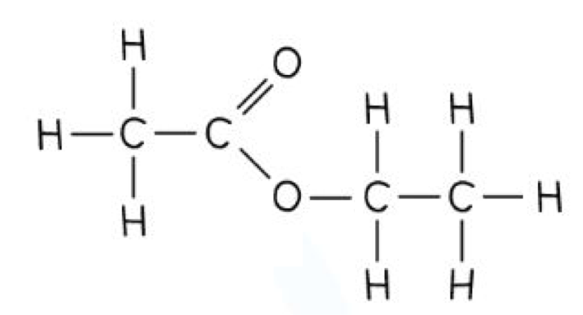

- Correct ester structure -COO-; **[1 mark]**
- Rest of structure correct; **[1 mark]**

**[Total: 2 marks]**

- *Ethyl ethanoate is made from ethanoic acid and ethanol*
- *The OH from ethanoic acid and the H from the OH group of ethanol are removed to form water and acid and alcohol join*

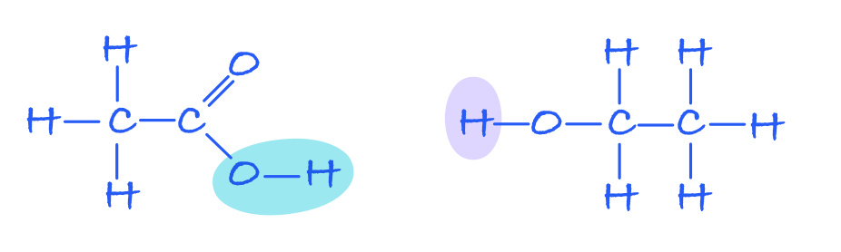

### 13 — 1 marks
One other use of esters is:

- Perfume; **[1 mark]**

**[Total: 1 mark]**

- *Esters are liquids that have a very distinctive, sweet smell which makes them ideal to uses in perfumes*
- *This is the expected response to this question but other uses would be allowed, such as in essential oils or cosmetics*

### 13 — 2 marks
Ethyl ethanoate cannot be referred to as a hydrocarbon because:

- Hydrocarbons contain carbon and hydrogen atoms only 
**OR**
Ethyl ethanoate does not contain only carbon and hydrogen atoms); **[1 mark]**
- Ethyl ethanoate / esters contain oxygen atoms; **[1 mark]**

**[Total: 2 marks]**

- *The definition of the term hydrocarbon is one you should be very familiar with*
- *Any compound which contains any element other than carbon or hydrogen, cannot be considered a hydrocarbon*
- *Esters have the function group -COO- so also contain oxygen atoms*

### 13 — 3 marks
The correct sentences are:

During the esterification process to produce methyl propanoate, the carboxylic acid **propanoic acid** and the alcohol **methanol **react together.

The reaction uses concentrated **sulfuric acid** which acts as a catalyst.

- Each word in the correct order; **[1 mark]**

**[Total: 3 marks]**

- *The first part of the name of the ester indicates the length of the carbon chain in the alcohol, and it ends with the letters ‘- yl’*
- *The second part of the name indicates the length of the carbon chain in the carboxylic acid, and it ends with the letters ‘- oate’*
- *So the ester called **meth**yl ***propan***oate is formed from** meth**anol and ***propan***oic acid *
- *You need to know the catalyst for esterification*

## Q13 — medium — 16 marks

### 7(a) — 2 marks
i) Another reactant needed for this reaction to occur is:

- Sulfuric acid / H2SO4;** [1 mark]**

ii) The colour change is:

- D (orange to green); **[1 mark]**

**[Total: 2 marks]**

- *An acid is required to oxidise an alcohol; one of the definitions of oxidation is the loss of oxygen and the gain of hydrogen, which comes from the acid present*
- *For the multiple choice colour changes:*

  - *A is incorrect as the solution is not colourless at the start of the reaction*
  - *B is incorrect as the solution is not green at the start or orange at the end of the reaction*
  - *C is incorrect as the solution is not colourless at the end of the reaction*

### 7(b) — 5 marks
i) The energy needed to break all the bonds in the reactants is:

- Addition of bond enthalpies: ∑ C-C + 5C-H + C-O + O-H + 3O=O 
**OR** 
Numbers shown: ∑ 346 + (5 x 412) + 358 + 463 + (3 x 496); **[1 mark]**
- Answer of 4715 (kJ); **[1 mark]**

ii) The energy released when all the bonds in the products are formed is:

- Expression for the sum: ∑ 4C=O + 6O-H 
**OR** 
∑ (4 x 743) + (6 x 463); **[1 mark]**
- Answer: 5750 (kJ); **[1 mark]**

iii) The molar enthalpy change (Δ*H*) is:

- Using answers from i) and ii): (4715 – 5750 =) – 1035 (kJ / mol) / 1040 to 3 s.f.; **[1 mark]**

**[Total: 5 marks]**

- *For each calculation error, one mark will be deducted, so it is possible to get one mark for a single error carried forward but not multiple errors*
- *A correct answer with no workings scores full marks, but this is a risky strategy as if you make an error you will miss out on the error carried forward marks*

### 7(c) — 5 marks
i) The name of the ester that forms is:

- Ethyl methanoate / ethyl formate; **[1 mark]**

ii) The displayed formula for this ester is:

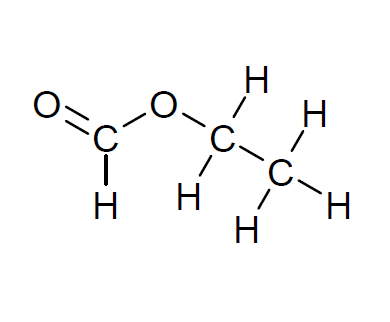

- Ester linkage O=C−O− ; **[1 mark]**
- Rest of the molecule correct; **[1 mark]**

iii) Two characteristics of a reaction at dynamic equilibrium are:

- Forward and reverse reactions occur at the same rate 
**OR **
The rate of the forward reaction is equal to the rate of the reverse reaction;** [1 mark]**
- Concentrations of reactants and products remain constant; **[1 mark]**

**[Total: 5 marks]**

- *Try to use the IUPAC names for chemicals, so use ethyl methanoate instead of ethyl formate*
- *It doesn't matter if the ester is shown on the left or right, the mirror image of the way this answer is drawn is still the same*
- *Make sure that each carbon has 4 bonds, each oxygen has 2 bonds and each hydrogen had one bond when drawing display formulae*
- *You need to be able to recall the features of dynamic equilibrium: the first point is more commonly recalled, the second less so. Constant concentrations are a consequence of the rates of the forward and reverse reactions being equal*

### 7(d) — 4 marks
Volume of carbon dioxide:

- Moles of HCOOH = $\frac{2.3}{46}$ 
**OR **
Moles of HCOOH = 0.05(0); **[1 mark]**
- Moles of CO2 = $\frac{0.05}{2}$ 
**OR **
Moles of CO2 = 0.025; **[1 mark]**
- Volume of CO2 = 0.025 x 24 
**OR **
Volume of CO2 = 0.025 x 24000; **[1 mark]**
- Volume of CO2 = 600 (cm3); **[1 mark]**

**[Total: 4 marks]**

- *The correct answer without any workings gets you full marks, but again it is risky as it means you cannot access any error carried forwards marks if you do not show your workings*
- *You need to use the balanced equation to work out the number of moles of CO**2** from the number of moles of HCOOH*
- *Common errors can lead to the following answers:*

  - *0.6, 1200 and 2400 each score 3 marks*
  - *1.2 and 2.4 each score 2 marks*

## Q14 — hard — 11 marks

### 15 — 2 marks
The term **dynamic equilibrium **means:

- A reaction is taking place in both directions (at the same time) 
**OR **
Forward and backwards reactions are taking place (at the same time); **[1 mark]**
- At an equal rate 
**OR**
** **The rate of the forward reaction is equal to the rate of the backward reaction 
**OR **
The concentrations of the reactants and products remain constant;** [1 mark]**

**[Total: 2 marks]**

- *This is a key definition that you need to know*
- *The rate of the forward reaction is equal to the rate of the reverse reaction would gain 2 marks*
- *Careful: **You would gain the second mark by stating that the concentration of the reactants and products remains **constant*

  - *You would not be awarded this mark for stating that the concentrations of the reactants / products are **the same** or **equal*

### 15 — 2 marks
i) The name of the ester produced during the reaction between methanoic acid and butanol is:

- Butyl methanoate;** [1 mark]**

ii) The necessary catalyst for the reaction is:

- <u>Concentrated</u> (sulfuric) acid;** [1 mark]**

**[Total: 2 marks]**

- *The first part of the name indicates the length of the carbon chain in the alcohol, and it ends with the letters ‘- yl’*
- *The second part of the name indicates the length of the carbon chain in the carboxylic acid, and it ends with the letters ‘- oate’*

  - *e.g. the ester formed from** but**anol and ***methan***oic acid is called **but**yl ***methan***oate*
- *You must state that the acid is concentrated to get the second mark but you do not need to specify which acid*

  - *Concentrated sulfuric acid is the common acid used in esterification*

### 15 — 5 marks
The maximum mass of ester that could be produced from this reaction is:

- *M*r of HCOOH =  46 
**AND **
*M*r of C4H9OH = 74 
**AND** 
*M*r of HCOOC4H9 = 102; **[1 mark]**
- Moles of HCOOH = $\frac{4.60}{46}$ = 0.10 (mol); **[1 mark]**
- Moles of C4H9OH = $\frac{9.62}{74}$ = 0.13 (mol);** [1 mark]**
- Moles of HCOOC4H9 = 0.10 (mol); **[1 mark]**
- Maximum mass of HCOOC4H9 = 0.10 x 102 = 10.2 (g); **[1 mark]**

**[Total: 5 marks]**

- *You need to use the equation moles = mass ÷ **M**r** to find the number of moles of methanoic acid and butanol used in the reaction*
- *The balanced symbol equation shows that 1 mole of methanoic acid reacts with 1 mole of butanol to form 1 mole of the ester, HCOOC**4**H**9*
- *As there are more moles of butanol than methanoic acid, butanol is in excess and methanoic acid is the limiting reactant *
- *The number of moles of limiting reactant determines the number of moles of product formed, therefore 0.10 moles of the ester is formed*

### 15 — 2 marks
The mass of ester produced is:

- Actual yield = $\frac{68.6}{100}$ x 10.2; **[1 mark]**
- = 7.00 g;** [1 mark]**

**[Total: 2 marks]**

- *Percentage yield = *$\frac{\mathrm{actual} \mathrm{yield}}{\mathrm{theoretical} \mathrm{yield}}\times100$
- *You need to rearrange this equation to give you the actual yield*
- *You must give your answer to 3 significant figures to be awarded the second mark*
- *Careful**: The calculator value of 6.9972 should be rounded to 7.00, not 6.99, and you must give the two 0's after the decimal place*

## Q15 — easy — 5 marks

### 16 — 1 marks
**Correct answer: C** — 

**Final answer:** **The correct answer is C**

- The reactants are ethanoic acid and ethanol which need to be heated in the round-bottomed flask
- Concentrated sulfuric acid is also added to the reaction mixture which acts as a catalyst to the reaction
- The ester is removed from the mixture by distillation so is collected in the beaker

### 16 — 1 marks
The most suitable method to heat the reaction mixture is to use a:

- Water bath:** [1 mark]**

**[Total: 1 mark]**

- *Ethanol is flammable so a naked flame may cause the reaction mixture to catch fire*
- *This means that using a Bunsen burner or spirit burner which both heat using a naked flame, are not suitable*
- *A water bath or electric heater are both suitable methods to hear flammable substances*

### 16 — 1 marks
One observation the student would make when sodium carbonate was added to the mixture if acid impurities were present is:

- Effervescence / fizzing / bubbling; **[1 mark]**

**[Total: 1 mark]**

- *Both ethanoic acid and sulfuric acid could be present in the distillate*
- *Acids react with metal carbonates, such as sodium carbonate, to form a salt, carbon dioxide and water:*

  - *sodium carbonate + ethanoic acid → sodium ethanoate + carbon dioxide + water*
  - *sodium carbonate + sulfuric acid → sodium sulfate + carbon dioxide + water*
- *As carbon dioxide which is a gas is produced, effervescence is seen*
- *Careful**: Stating that carbon dioxide or a gas is produced would not gain the mark as this is not an observation*

### 16 — 2 marks
The name of the carboxylic acid and alcohol that would be required to produce propyl butanoate are:

- Carboxylic acid: butanoic acid;** [1 mark]**
- Alcohol: propanol;** [1 mark]**

**[Total: 2 marks]**

- *The first part of the name indicates the length of the carbon chain in the alcohol, and it ends with the letters ‘- yl’*
- *The second part of the name indicates the length of the carbon chain in the carboxylic acid, and it ends with the letters ‘- oate’*
- *e.g. the ester formed from** prop**anol and ***butan***oic acid is called **prop**yl ***butan***oate*

## Q16 — medium — 1 marks

### 17 — 1 marks
**Correct answer: B** — 

**Final answer:** **The correct answer is B**

- The ester formed is ethyl propanoate, which is structure B
- **A** is incorrect as this is methyl propanoate formed from methanol and propanoic acid
- **C** is incorrect as this is propyl ethanoate formed from propanol and ethanoic acid
- **D** is incorrect as this is ethyl ethanoate formed from ethanol and ethanoic acid
