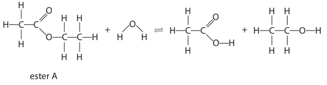
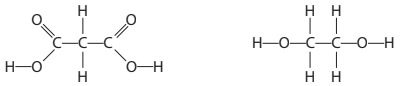
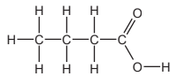
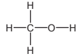
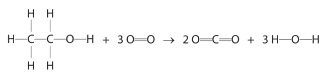
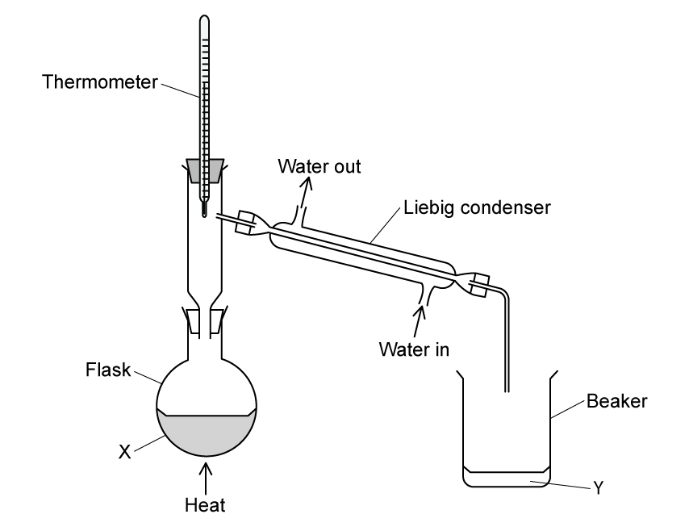

# Exam Questions — Esters
**4. Organic Chemistry** · Edexcel IGCSE Chemistry 4CH1
> Source: [https://www.savemyexams.com/igcse/chemistry/edexcel/19/topic-questions/4-organic-chemistry/4-7-esters/exam-questions/](https://www.savemyexams.com/igcse/chemistry/edexcel/19/topic-questions/4-organic-chemistry/4-7-esters/exam-questions/) · 16 questions · total 113 marks

## Q1 — medium — 4 marks

### 2 — 3 marks — command: multiple — structured
An ester is formed in the following dynamic equilibrium reaction between ethanol and propanoic acid:

CH3CH2OH + CH3CH2COOH $\rightleftharpoons$ CH3CH2COOCH2CH3 + H2O

i) Name the ester produced.

[1]

ii) State two characteristics of a dynamic equilibrium.

[2]

### 2 — 1 mark — multiple_choice
Which structure represents part of an ester molecule but **not** part of a carboxylic acid molecule?
- **A.** 
- **B.** 
- **C.** 
- **D.** 

## Q2 — hard — 15 marks

### 7(a) — 4 marks — command: multiple — structured — from paper 2022 · Jan2C
This question is about esters.

Ester A reacts with water to form ethanoic acid and ethanol.

The displayed formulae of the reactants and products are shown in this equation

The molar enthalpy change (Δ*H*) for the reaction is 0 kJ / mol.

i) Draw a ring around the functional group in ester A.

(1)

ii) Give the name of ester A.

(1)

iii) Describe a chemical test, other than using an indicator, to show that the reaction mixture contains ethanoic acid.

(2)

### 7(b) — 2 marks — command: explain — structured — from paper 2022 · Jan2C
Explain why the molar enthalpy change (Δ*H*) for the reaction between ester A and water is 0 kJ / mol.

In your answer, refer to the bonds broken and the bonds formed.

### 7(c) — 4 marks — command: multiple — structured — from paper 2022 · Jan2C
A mixture of ester A and water is left in a sealed container until the reaction mixture reaches dynamic equilibrium.

i) Describe what is meant by dynamic equilibrium.

(2)

ii) Explain why adding a catalyst does not change the position of equilibrium.

(2)

### 7(d) — 3 marks — command: calculate — structured — from paper 2022 · Jan2C
The ethanoic acid produced in the reaction is completely neutralised by 22.75 cm3 of 0.150 mol / dm3 barium hydroxide solution.

The equation for the neutralisation reaction is

2CH3COOH + Ba(OH)2 → Ba(CH3COO)2 + 2H2O

Calculate the amount, in moles, of ethanoic acid neutralised.

Give your answer to 3 significant figures.

amount = .............................. mol

### 7(e) — 2 marks — command: give — structured — from paper 2022 · Jan2C
The structures of two organic compounds are shown.

These compounds react together to form a polymer.

Give the repeat unit of the polymer formed.

## Q3 — easy — 1 marks

### 4 — 1 mark — multiple_choice
Why can esters be used as food flavourings?
- **A.** They are volatile
- **B.** They have distinctive colours
- **C.** They have fragrant odours
- **D.** They are insoluble in water

## Q4 — medium — 1 marks

### 5 — 1 mark — multiple_choice
Ethyl ethanoate can be prepared by heating a mixture of ethanoic acid, ethanol and concentrated sulfuric acid.

Which statement about this reaction is **not **correct?
- **A.** Concentrated sulfuric acid acts as catalyst
- **B.** The ester distills first due to its low boiling point
- **C.** The mixture is heated using a water bath not a Bunsen burner
- **D.** The ethyl ethanoate collected is pure

## Q5 — hard — 12 marks

### 6 — 2 marks — command: show — structured — from paper 2011 · O31
Esters are organic chemicals noted for their characteristic smells. A carboxylic acid and an alcohol will react to form an ester.

Draw the displayed formula of each of the following. Show all the bonds in the structure.

i) ethanoic acid

(1)

ii) ethanol

(1)

### 6 — 5 marks — command: multiple — structured — from paper 2011 · O31
Ethanoic acid and ethanol react to form an ester.

i) What is the name of this ester?

(1)

ii) The same linkage is found in polyesters. Draw the structure of the polyester which can be formed from the monomers shown below.

HOOC—C6H4—COOH and HO—CH2—CH2—OH

(3)

iii) Describe the pollution problems caused by non-biodegradable polymers.

(1)

### 6 — 3 marks — command: multiple — structured — from paper 2015 · Ju41
Ethanoic acid and methanol will react to form a different ester.

i) Name the catalyst needed to form an ester from ethanoic acid and methanol.

(1)

ii) Name the ester formed when ethanoic acid reacts with methanol.

(1)

iii) Give the structural formula of the ester formed when ethanoic acid reacts with methanol.

(1)

### 7 — 2 marks — command: calculate — structured — from paper 2013 · O32
The ester methyl butanoate is found in apples. It can be made from butanoic acid and methanol. Their structural formulae are given below.

|  |  |
|---|---|
| butanoic acid | methanol |

Calculate the relative molecular mass of methyl butanoate.

(*A*r: C = 12, H = 1, O = 16)

Relative molecular mass .....................................................

## Q6 — hard — 12 marks

### 7 — 3 marks — command: multiple — structured
An ester has the structural formula CH3COOCH2CH2CH3.

i) Draw out the displayed formula and circle the functional group.

(2)

ii) State the name of the alcohol used to make this ester.

(1)

### 7 — 2 marks — command: write — structured
The ester CH3(CH2)2COOCH3 is an ester found in apples and contributes to their smell.

This ester can be prepared in the laboratory from a carboxylic acid and an alcohol.

Write a balanced equation for the production of CH3(CH2)2COOCH3.

### 7 — 4 marks — command: show — structured
An ester, **X**, was found to contain 39.98% carbon and 6.65% hydrogen.

Show that ester **X** is not the ester with the formula CH3(CH2)2COOCH3.

### 7 — 3 marks — command: deduce — structured
The molecular mass of ester **X** is 60.

Deduce the molecular formula of ester **X**.

## Q7 — medium — 1 marks

### 8 — 1 mark — multiple_choice
#### Separate: Chemistry Only

Methanoic acid and ethanol react in the presence of an acid to form an ester.

Name the ester that will be formed.
- **A.** Methyl methanoate
- **B.** Methyl ethanoate
- **C.** Ethyl methanoate
- **D.** Ethyl ethanoate

## Q8 — easy — 1 marks

### 9 — 1 mark — multiple_choice
In a laboratory, ethyl ethanoate can be prepared by heating ethanol, ethanoic acid and sulfuric acid.

The following reaction occurs:

**ethanoic acid + ethanol **$\rightleftharpoons$** ethyl ethanoate + water**

Which of the following terms cannot be used to describe the reaction that takes place?
- **A.** Esterification
- **B.** Condensation
- **C.** Reversible
- **D.** Thermal decomposition

## Q9 — hard — 8 marks

### 10 — 1 mark — multiple_choice
A sweet-smelling ester with the empirical formula C2H4O was produced.

Which of the following reactants could not have been used to produce this ester?
- **A.** methanol and propanoic acid
- **B.** ethanol and ethanoic acid
- **C.** propanol and methanoic acid
- **D.** butanol and methanoic acid

### 10 — 2 marks — command: explain — structured
During the preparation of an ester, the reactants are added to a flask and heated using a water bath.

Explain how and why the ester is separated from the reaction mixture.

### 10 — 4 marks — command: multiple — structured
A carboxylic acid, **Y**, was used to form a polyester. The relative formula mass of the carboxylic acid was found to be 90 and its empirical formula is CHO2.

i) Deduce the molecular formula of carboxylic acid **Y**.

(2)

ii) Draw the displayed formula of the carboxylic acid, **Y**.

(2)

### 10 — 1 mark — command: give — structured
Carboxylic acid **Y** reacted with alcohol **Z** to form a polyester.

Give the formula of the other product in this reaction.

## Q10 — medium — 11 marks

### 5(a) — 3 marks — command: multiple — structured — from paper 2019 · Ju2CR
This question is about the reactions of carboxylic acids.

Carboxylic acids react with solutions of metal carbonates.

i) Complete the chemical equation for the reaction of ethanoic acid, CH3COOH, with potassium carbonate solution.

2CH3COOH + K2CO3 →............................... + ....................... + ........................

(2)

ii) State what you would see in this reaction.

(1)

### 5(b) — 3 marks — command: multiple — structured — from paper 2019 · Ju2CR
The ester, ethyl ethanoate, can be prepared by reacting ethanol with ethanoic acid.

This is the method for the preparation.

- mix equal amounts of ethanoic acid and ethanol in a boiling tube
- add a few drops of concentrated sulfuric acid
- place the boiling tube in a hot water bath for several minutes

i) State the role of concentrated sulfuric acid in this reaction.

(1)

ii) Suggest why the mixture is heated in a water bath rather than directly with a Bunsen burner flame.

(1)

iii) State how you would know that ethyl ethanoate has formed.

(1)

### 5(c) — 4 marks — command: multiple — structured — from paper 2019 · Ju2CR
Another ester, methyl propanoate, can be prepared by reacting methanol with propanoic acid.

i) Draw the displayed formulae of methanol, propanoic acid and the ester, methyl propanoate.

(3)

ii) Give the name of the other product of this reaction.

(1)

### 5(d) — 1 mark — command: give — structured — from paper 2019 · Ju2CR
Give one use of esters.

## Q11 — easy — 6 marks

### 12 — 2 marks — command: multiple — structured
Ethyl ethanoate has a distinctive smell which is similar to pear drops.

It is made by the reaction between ethanol and ethanoic acid in the presence of a sulfuric acid catalyst.

i) State the name that is given to this process.

(1)

ii) Which of the following is the other product formed during this reaction?

(1)

| **A** | water |
|---|---|
| **B** | hydrogen chloride |
| **C** | hydroxide |
| **D** | hydrogen |

### 12 — 2 marks — command: calculate — structured
The displayed formula of ethyl ethanoate is shown below.

Calculate the relative molecular mass of ethyl ethanoate.

(*A*r: C = 12, H = 1, O = 16)

### 12 — 1 mark — command: give — structured
The reaction between ethanoic acid and ethanol to form ethyl ethanoate and another product is a reversible reaction.

Give the sign that is used in reactions to show that a reaction is reversible.

### 12 — 1 mark — multiple_choice
The reaction between ethanoic acid and ethanol will reach dynamic equilibrium.

Which statement about the dynamic equilibrium of this reaction is correct?
- **A.** the concentration of the reactants equals the concentration of the products
- **B.** equilibrium is established in an open container to allow the gases to escape
- **C.** the reaction has stopped
- **D.** the rate of the forward reaction is equal to the rate of the reverse reaction

## Q12 — easy — 8 marks

### 13 — 2 marks — command: complete — structured
Ethyl ethanoate belongs to the homologous series, esters.

Complete the structure of ethyl ethanoate.

### 13 — 1 mark — command: give — structured
Esters can be used in food flavourings.

Give one other use of esters.

### 13 — 2 marks — command: explain — structured
Explain why ethyl ethanoate cannot be referred to as a hydrocarbon.

### 13 — 3 marks — command: complete — structured
Methyl propanoate can be made by a process called esterification. Use words from the box to complete the sentences about the reaction to produce methyl propanoate.

| methanol |   | sodium hydroxide |   | propanoic acid |   | propanol |
|---|---|---|---|---|---|---|
|   | sulfuric acid |   | methanoic acid |   | ammonia |   |

During the esterification process to produce methyl propanoate, the carboxylic acid ...................................... and the alcohol ........................ react together.

The reaction uses concentrated ..................................  which acts as a catalyst.

## Q13 — medium — 16 marks

### 7(a) — 2 marks — command: multiple — structured — from paper 2020 · N2CR
Ethanol, C2H5OH, can be oxidised to produce ethanoic acid, CH3COOH, by heating it with potassium dichromate(VI).

i) Name one other reactant needed for this reaction to occur.

(1)

ii) Which colour change occurs during this reaction?

(1)

| ☐ | **A** | colourless to green |
|---|---|---|
| ☐ | **B** | green to orange |
| ☐ | **C** | orange to colourless |
| ☐ | **D** | orange to green |

### 7(b) — 5 marks — command: calculate — structured — from paper 2020 · N2CR
When ethanol is burned in air, complete combustion can occur. The equation for this reaction is:

C2H5OH + 3O2 → 2CO2 + 3H2O

This equation can also be written using displayed formulae to show all the covalent bonds in the molecules.

The table gives the bond energies for these bonds.

| **Bond** | C-C | C-H | C-O | O-H | O=O | C=O |
|---|---|---|---|---|---|---|
| **Bond energy in kJ / mol** | 346 | 412 | 358 | 463 | 496 | 743 |

i) Use values from the table to calculate the energy needed to break all the bonds in the reactants.

(2)

energy needed .............................................................. kJ

ii) Use values from the table to calculate the energy released when all the bonds in the products are formed.

(2)

energy released .............................................................. kJ

iii) Calculate the molar enthalpy change (Δ*H*) in kJ / mol, for the complete combustion of ethanol. Include a sign in your answer.

(1)

Δ*H* = .............................................................. kJ / mol

### 7(c) — 5 marks — command: multiple — structured — from paper 2020 · N2CR
#### Separate: Chemistry Only

Ethanol reacts with methanoic acid, HCOOH, in the presence of an acid catalyst to form an ester.

The equation for the reaction is:

The equation for the reaction is:

C2H5OH + HCOOH $\rightleftharpoons$ HCOOC2H5 + H2O

i) Give the name of the ester that forms.

(1)

ii) Draw the displayed formula for this ester.

(2)

iii) When this reaction takes place in a sealed container, the reaction can reach dynamic equilibrium.

Give two characteristics of a reaction at dynamic equilibrium.

(2)

### 7(d) — 4 marks — command: calculate — structured — from paper 2020 · N2CR
Methanoic acid reacts with sodium carbonate to form sodium methanoate, carbon dioxide and water.

The equation for the reaction is:

2HCOOH + Na2CO3 → 2HCOONa + CO2 + H2O

Calculate the volume, in cm3 , of carbon dioxide gas produced when 2.3 g of methanoic acid reacts completely with sodium carbonate.

[*M**r* of HCOOH = 46]

[Molar volume of carbon dioxide at rtp = 24 dm3]

volume of carbon dioxide = .............................................................. cm3

## Q14 — hard — 11 marks

### 15 — 2 marks — command: explain — structured
An ester was produced in the following reaction between methanoic acid and butanol.

HCOOH + C4H9OH $\rightleftharpoons$ HCOOC4H9 + H2O

After a period of time, the reaction reaches dynamic equilibrium.

Explain what is meant by the term **dynamic equilibrium**.

### 15 — 2 marks — command: multiple — structured
i) Give the name of the ester produced during the reaction between methanoic acid and butanol.

(1)

ii) State the necessary catalyst for the reaction.

(1)

### 15 — 5 marks — command: calculate — structured
4.60 g of methanoic acid was added to 9.62 g of butanol.

Calculate the maximum mass of ester that could be produced from this reaction.

### 15 — 2 marks — command: determine — structured
The percentage yield of the reaction was found to be 68.6%.

Determine the mass of ester produced.

Give your answer to 3 significant figures.

## Q15 — easy — 5 marks

### 16 — 1 mark — multiple_choice
Ethyl ethanoate can be prepared in the laboratory using the equipment shown in the diagram below.

Which row in the table correctly identifies **X** and **Y**.

|   | ** ** | **X** | **Y** |
|---|---|---|---|
| ☐ | **A** | ethanoic acid and ethanol | ethyl ethanoate |
| ☐ | **B** | ethyl ethanoate | ethanoic acid and ethanol |
| ☐ | **C** | ethanoic acid, ethanol and sulfuric acid | ethyl ethanoate |
| ☐ | **D** | ethyl ethanoate | ethanoic acid, ethanol and sulfuric acid |
- **A.** 
- **B.** 
- **C.** 
- **D.** 

### 16 — 1 mark — command: tick — structured
A student carried out a practical to produce ethyl ethanoate using the apparatus shown in part a).

Place a tick (✔) in the box that shows the most suitable method to heat the reaction mixture.

| Bunsen burner |   |
|---|---|
| spirit burner |   |
| water bath |   |

### 16 — 1 mark — command: give — structured
The mixture containing ethyl ethanoate may also contain some acid impurities which can be removed by adding sodium carbonate solution to the mixture.

Give one observation the student would make when sodium carbonate was added to the mixture if acid impurities were present.

### 16 — 2 marks — command: give — structured
Propyl butanoate is another ester that has a fruity smell is another ester.

Give the name of the carboxylic acid and alcohol that would be required to produce propyl butanoate.

| Carboxylic acid | ............................................................................. |
|---|---|
| Alcohol | ............................................................................. |

## Q16 — medium — 1 marks

### 17 — 1 mark — multiple_choice
Propanoic acid reacts with ethanol in an esterification reaction.

What is the displayed formula of the ester that is formed during this reaction?
- **A.** 
- **B.** 
- **C.** 
- **D.** 
