# Mark Schemes — Synthetic polymers
**4. Organic Chemistry** · Edexcel IGCSE Chemistry 4CH1

## Q1 — hard — 7 marks

### 2 — 2 marks
This reaction is classed as a condensation reaction because:

- Condensation reactions produce a small molecule (as the second product); **[1 mark]**
- This reaction (also) produces HCl / hydrogen chloride; **[1 mark]**

**[Total: 2 marks]**

- *Careful: **The term condensation polymerisation can be misleading as it does not always involve the formation of water*
- *Although the first chemical may look unfamiliar, this question is asking you to apply your knowledge of forming polyesters*

  - *The process is still, basically, the same but instead of starting with a dicarboxylic acid you start with a chemical called a diacyl dichloride*
  - *You still remove the 'bit' attached to the C=O and a hydrogen from the OH group of the diol*
- *Looking at the two monomers side by side and comparing them to the polymer formed, you should be able to identify:*

  - *The Cl atoms on the first monomer have been removed*
  - *The OH group hydrogen atoms on the second monomer have been removed* 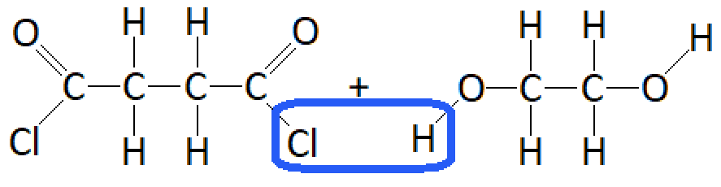
- *This results in the formation of HCl*

  - *This is a small molecule and, therefore, matches the idea of condensation polymerisation forming a polymer **AND** a small molecule *

### 2 — 2 marks
The displayed formula of each of the two monomers needed to form the polyester are:

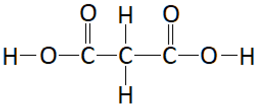

; **[1 mark]  **

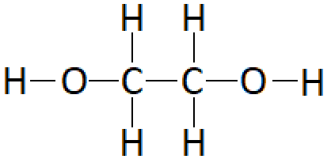

; **[1 mark]**

**[Total: 2 marks]**

- *You may be allowed to write the OH groups without the bond between the oxygen and the hydrogen atoms*

  - *But, you cannot be guaranteed that this will be allowed *
  - *So, it is good practice to draw **all** of the bonds in your displayed formulae as well as matching what the question asks for*
- *The question tells you that **condensation polymers are commonly formed by the esterification reaction of a diol monomer and a dicarboxylic acid monomer*

  - *This means that your monomers should be a diol and a dicarboxylic acid *
- *You can identify them by looking for:*

  - *C-O bonds for the diol*
  - *C=O bonds for the dicarboxylic acid*
  - 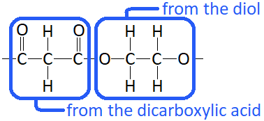
- * Once you have identified the monomers you add*

  - *OH groups to the C=O carbons to form the dicarboxylic acid*
  - *H atoms to the single-bonded oxygens to form the diol*

### 2 — 2 marks
The repeat unit of the polymer formed is:

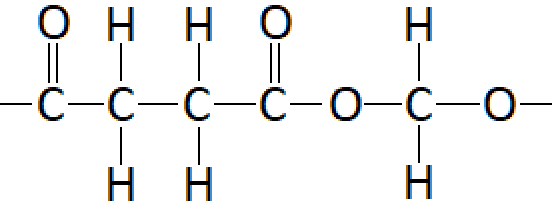

- All four carbons from the dicarboxylic acid 
**AND **
One carbon from the diol  
**AND **
A correct ester linkage; **[1 mark]**
- -OH lost from the dicarboxylic acid 
**AND **
-H lost from the OH group of the diol;** [1 mark]**

**[Total: 2 marks]**

- *The polymer will be formed by the loss of a small molecule of water*
- *The polymer repeat unit can be easily determined by:*

  - *Drawing the molecules very close together* 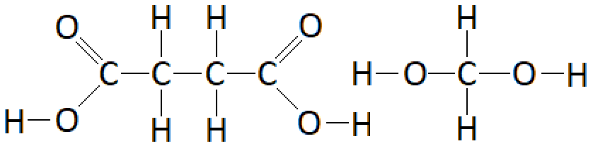
  - *This allows you to identify the small molecule being removed during condensation* 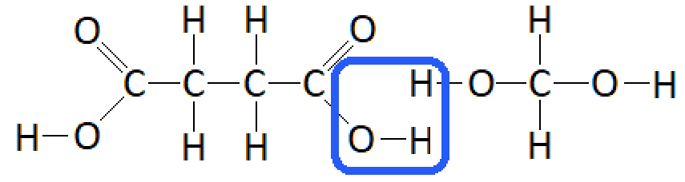
  - *You replace this with a single bond*
  - *You also replace the OH group from the left-hand side and the OH hydrogen from the right-hand side with a single bond* 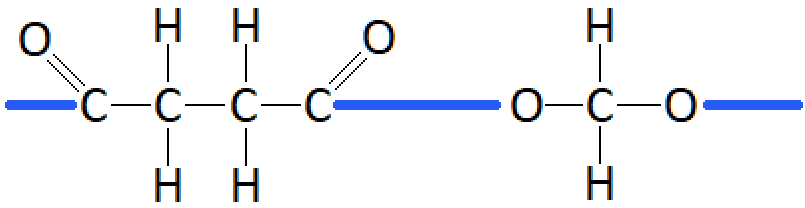

### 2 — 1 marks
One advantage of biopolyesters is:

- They are biodegradable 
**OR**
** **They break down (over time);** [1 mark]**

**[Total: 1 mark]**

- *Biopolyesters are polyesters but the 'bio' part of the name refers to the fact that they are biodegradable*

  - *Ensure that you know what biodegradable means because it has featured as an exam question with examiners commenting that it was not answered well*
  - *Biodegradable means it breaks down naturally over time*

## Q2 — easy — 1 marks

### 3 — 1 marks
**Correct answer: C** — A large molecule made from many small molecules

**Final answer:** **The correct answer is C**

- Polymers are large molecules made from many small molecules called monomers
- The monomers must contain a carbon-carbon double bond which is broken when the molecules are joined together

## Q3 — hard — 12 marks

### 4 — 5 marks
i) The displayed formulae of the first two members of the homologous series of alkenes are:

- 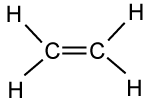 ; **[1 mark]**
-  ;** [1 mark]**

ii) These compounds are in the same homologous series because:

- They have the same general formula / CnH2n; **[1 mark]**
- They have the same functional group 
**OR **
They both contain a carbon-carbon double bond / C=C;** [1 mark]**
- They differ by CH2;** [1 mark]**

**[Total: 5 marks]**

- *Careful:** The homologous series of alkenes cannot start with a single carbon structure*

  - *This is because one of the characteristic features of the alkenes is the carbon-carbon double bond, which means that you need to have two carbons*
  - *Therefore, the first two members of the homologous series of alkenes are ethene and propene*
- *You should know that the characteristic features of a homologous series are:*

  - *Same general formula*
  - *Same functional group*
  - *Same chemical properties*
  - *Pattern / trend in physical properties*
  - *Same methods of preparation*
  - *Consecutive members differ by CH**2*
- *However, some of these points are not illustrated by the displayed formulae of ethene and propene*

  - *You cannot comment on the chemical and physical properties or their methods of preparation as these are not shown by the structures*

### 4 — 3 marks
The compounds that cannot form polymers are:

- **C** and **F**; **[1 mark]**
- (Because,) they do not have a carbon-carbon double bond / C=C (needed for addition polymerisation); **[1 mark]**
- (Because,) they do not have alcohol / hydroxyl / OH groups **OR **they are not diols 
**AND**
** **They do not have the functional / carboxylic acid / COOH groups (needed for condensation polymerisation) **OR **they are not dicarboxylic acids; **[1 mark]**

**[Total: 3 marks]**

- *Careful:** Since part (a) and part (b) talk about alkenes, it is easy to forget about condensation polymerisation*
- *You can score a single mark for giving the reason that 'they don't have the functional groups required'*
- *To score maximum marks you need to talk about the requirements to make an addition polymer and a condensation polymer:*

  - *Addition polymer - needs a carbon-carbon double bond / C=C*
  - *Condensation polymer - needs a diol which has the OH functional group and a dicarboxylic acid which has the COOH functional group*
  
    - *There are other possibilities to form condensation polymers but the OH / COOH are the main focus at GCSE level*

### 4 — 2 marks
The product to complete the equation is:

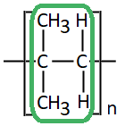

- Correct repeat unit (highlighted in green); **[1 mark]**
- Extension / continuation bonds 
**AND **
Brackets 
**AND **
n after the brackets; **[1 mark]**

**[Total: 2 marks]**

- *Having a carbon-carbon double bond / C=C in your final answer will lose **all** of the marks*
- *The way to draw addition polymer structures from monomers is the same regardless of the monomer structure:*

  1. *Draw the monomer structure again **in pencil** *
  2. *Replace the carbon-carbon double bond / C=C with a single bond / C–C*
  3. *Add extension / continuation bonds to both of the carbons that had the double bond*
  4. *Draw brackets around the entire structure*
  5. *Move the little n from in front of the equation to after the brackets, at the bottom right*
- *Common mistakes include:*

  - *Leaving the carbon-carbon double bond / C=C in the polymer structure *
  - *Forgetting the brackets*
  - *Not including / moving the little n*

### 4 — 2 marks
i) The empirical formula of the polymer is:

- CH2; **[1 mark]**

ii) Another compound from part (b) that can form this polymer is:

- (Compound) **B**; **[1 mark]**

**[Total: 2 marks]**

- *Remember:** Empirical formula is the simplest whole number ratio of atoms*

  - *The repeat unit contains four carbon and eight hydrogen atoms, so it is still C**4**H**8** *
  - *Dividing by 4, gives the correct empirical formula of CH**2** *
- *The repeat unit shows one methyl / CH**3** group below the first central carbon atoms and one methyl / CH**3** group above the second central carbon atom*

  - *This makes it relatively easy to make the comparison with compound **E** as stated in the question*
  - *Compound **E** also has one methyl / CH**3** group below the first central carbon atoms and one methyl / CH**3** group above the second central carbon atom*
- *To identify the other compound that can form the polymer, you need to think more literally:*

  - *The repeat unit shown has a methyl / CH**3** group on every central carbon atom*
  - *Ignore whether the methyl / CH**3** group is above or below its central carbon atom*
  - *Compound **B** also has a methyl / CH**3** group on every central carbon atom*
  - *The underlying chemistry of how and why two different alkene isomers can form the same polymer is not covered at GCSE level*

## Q4 — easy — 1 marks

### 5 — 1 marks
**Correct answer: A** — They are inert

**Final answer:** **The  correct answer is A**

- Addition polymers contain strong covalent bonds and are essentially inert at ordinary temperatures
- They cannot be broken down by bacteria so are not biodegradable
- They are usually sent to landfill or incinerated which both negatively impact the environment

## Q5 — easy — 8 marks

### 6 — 1 marks
The alkene is unsaturated because:

- It has a double bond / multiple / triple bonds 
**OR** 
It does not only have single bonds;** [1 mark]**

**[Total: 1 mark]**

- *Unsaturated molecules have at least one double (or triple) bond*
- *Saturated molecules have only single bonds*

### 6 — 3 marks
The correct sentences are:

During polymerisation, **many** ethene molecules join together to form the large molecule, **poly(ethene).**** **

These large molecules are called** ****polymers.**

- Many; **[1 mark]**
- Poly(ethene)** ****[1 mark]**
- Polymers;** ****[1 mark]**

**[Total: 3 marks]**

- *Careful**: Even though the name of the polymer is poly(ethene), it does not contain double bonds that are usually associated with the -ene part of the name*
- *The part of the name inside the brackets tells you the monomer from which the polymer was made *

### 6 — 2 marks
The repeat unit is :

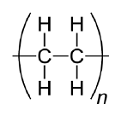

- Two extending bonds coming out of either side of the brackets; **[1 mark]**
- Five single bonds (4 between the C-H and one between the C-C); **[1 mark]**

**[Total: 2 marks]**

- *The double bond is broken so that monomers can add together*
- *The lines coming out of the brackets indicate that the monomer is joined to others*
- *The n represents a large number of monomers that will be joined together*

### 6 — 1 marks
The type of polymer formed is:

- Condensation; **[1 mark]**

**[Total: 1 mark]**

- *Addition polymers are formed from monomers that have a double bond *
- *Condensation polymers are formed from either:*

  - *One type of monomer that has different functional groups*
  - *Two different monomers that have the same functional group on either end capable of reacting together *
- *Polyesters are formed from a diol and a dicarboxylic acid*

### 6 — 1 marks
An advantage of using biopolyesters instead of synthetic polyesters is:

- Biopolyesters / they biodegrade easily / naturally; **[1 mark]**

**[Total: 1 mark]**

- *Microorganisms break down biopolyesters into carbon dioxide and water*
- *Non-biodegradeable polyesters cause environmental problems as they will fill landfill sites and will not break down *

## Q6 — hard — 11 marks

### 7 — 3 marks
The equations for both methods are:

- Method 1: C2H4 + Cl2 → C2H4Cl2; **[1 mark]**
- Method 2: C2H4 + 2HCl + ½O2 → C2H4Cl2 + H2O
**OR**
2C2H4 + 4HCl + O2 → 2C2H4Cl2 + 2H2O; **[1 mark]**

Plus any **one **of the following:

- Method 1 uses one mole of ethene
**AND**
Method 2 uses 2 moles of ethene;** [1 mark]**
- Method 1 only forms 1,2-dichloroethane / C2H4Cl2 
**AND**
Method 2 forms 1,2-dichloroethane / C2H4Cl2 and water / H2O **OR **method 2 forms a second / more than one product; **[1 mark]**
- Method 1 is more efficient than method 2; **[1 mark]**

**[Total: 3 marks]**

- *Since the question asks you to use chemical equations, you should give the equations for both reactions*

  - *Method 1*
  
    - *Involves the reaction of chlorine with ethene to form 1,2-dichloroethane*
    - *C**2**H**4** + Cl**2** → C**2**H**4**Cl**2*
    - *This equation does not require balancing*
  - *Method 2*
  
    - *Involves the reaction of hydrogen chloride and oxygen with ethene to form 1,2-dichloroethane and a second product*
    - *C**2**H**4** + HCl +O**2** → C**2**H**4**Cl**2** + ?*
  - *To balance this equation:*
  
    - *There are two chlorine atoms on the right-hand side, which will require 2HCl on the left-hand side*
    - *C**2**H**4** + 2HCl +O**2** → C**2**H**4**Cl**2** + **?*
    - *The carbon atoms, some hydrogen atoms and the chlorine atoms are accounted for on both sides of the equation. *
    - *This leaves some hydrogen atoms and the oxygen atoms unaccounted for, so it is likely that the second product is water*
    - *C**2**H**4** + 2HCl +O**2** → C**2**H**4**Cl**2** + **H**2**O*
    - *There are two oxygen atoms on the left-hand side but only one on the right-hand side, so we can use ½O**2** to form the H**2**O*
    - *C**2**H**4** + 2HCl +**½**O**2** → C**2**H**4**Cl**2** + **H**2**O*
    - *You can also double the entire equation to remove the **½**O**2** and write your equation with whole numbers*
    - *2C**2**H**4** + 4HCl +O**2** → 2C**2**H**4**Cl**2** +2**H**2**O*
- *When you are comparing the two methods, ensure that you say about both methods*

  - *This may seem obvious but mark schemes often expect both sides of the comparison and examiner's reports frequently comment on the lack of balance*
  - *For example, method 1 only makes 1,2-dichloroethane*
  
    - *It may seem obvious to you that this means method 2 makes another product*
    - *But without clearly stating method 2 creates water as well, the examiner will not award the mark for the actual comparison*

### 7 — 4 marks
i) The displayed formula of the organic product of stage 2 is:

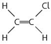

- Carbon=carbon double bond / C=C; **[1 mark]**
- The rest of the molecule is correct; **[1 mark]**

ii) The organic product of stage 2 is:

Any **two **of the following:

- An alkene; **[1 mark]**
- Unsaturated;** [1 mark]**
- A monomer; **[1 mark]**

**[Total: 4 marks]**

- *It is easy to get distracted by all of the information given in the question*
- *The organic product of stage 2 is also the reactant of stage 3*
- *This means that it must be an alkene*

  - *Alkenes are described as unsaturated hydrocarbons due to the carbon=carbon double bond*
  - *Alkenes can also be described as monomers when they are being used to form polymers*

### 7 — 1 marks
The type of polymerisation that occurs in stage 3 is:

- Addition (polymerisation); **[1 mark]**

**[Total: 1 mark]**

- *The process of using an alkene to form a polymer is addition polymerisation*

  - *This is where the carbon=carbon double bond breaks open and attaches to another molecule*

### 7 — 3 marks
The environmental problems caused by these two methods of disposal are:

Any **three** of the following:

- Polymers / poly(chloroethene) will remain / stay in landfill indefinitely; **[1 mark]**
- (Because,) they are inert / unreactive / do not biodegrade; **[1 mark]**
- Burning polymers / poly(chloroethene) produces toxic gases / hydrogen chloride gas; **[1 mark]**
- Burning polymers / poly(chloroethene) produces greenhouse gases;** [1 mark]**

**[Total: 3 marks]**

- *You should know the environmental problems / advantages and disadvantages of each of the following methods of polymer disposal:*

  - *Landfill / burial*
  - *Incineration / burning*
  - *Recycling*
- *You need to know these for addition and condensation polymers*

## Q7 — medium — 1 marks

### 8 — 1 marks
**Correct answer: D** — 

**Final answer:** **The correct answer is D**

- The monomers link together using an ester link
- The diol and dioic acid monomers have two carbons and four carbons respectively, so the polymer must have the same sections
- The carboxylic acid unit is four carbons long, so there must be four carbons between the ester links ( including the ester carbon)
- A is incorrect as the ester links are only two carbons long instead of four and the diol section is four carbons long instead of two
- B is incorrect as each section is only two carbons long, instead of two and four
- C is incorrect as each section is four carbons long instead of two and four

## Q8 — medium — 1 marks

### 9 — 1 marks
**Correct answer: B** — 

**Final answer:** **The correct answer is B**

- In addition polymers, the repeat unit always has two carbons in the chain and the other atoms are side groups drawn above or below the chain
- Each carbon across the double bond in the monomer has a -CH3 group and -H attached, so the polymer must also have these as side groups
- A is incorrect as the chain of the repeat unit is four carbons long instead of two
- C is incorrect as one carbon in the chain has two Hs instead of a CH3 and H
- D is incorrect as the chain of the repeat unit is four carbons long instead of two

## Q9 — easy — 1 marks

### 10 — 1 marks
**Correct answer: A** — 

**Final answer:** **The correct answer is A**

- Monomers that make addition polymers show a double bond and the side groups on the chain must correspond to the side groups on the monomer
- This polymer has CH3 and Cl on adjacent carbons so the monomer must be the same
- **B** is incorrect as three carbons are shown in the chain of the monomer instead of two
- **C** is incorrect as the monomer is missing a Cl side group
- **D** is incorrect as there is a missing double bond in the monomer

## Q10 — medium — 8 marks

### 5(b) — 2 marks
The structure of the monomer is:

- One C=C bond in a three consecutive carbon atom molecule; **[1 mark]**
- All other atoms and bonds correct; **[1 mark]**

**[Total: 2 marks]**

- *To draw the monomer for a given polymer*

  - *Add a double bond between the two carbon atoms with the extended bonds*
  - *Remove the extended bonds, brackets and n*

### 5(c) — 2 marks
Poly(chloroethene) is a suitable material for this purpose because:

An explanation linking:

- Low ability to conduct / does not conduct / is an insulator; **[1 mark]**
- So separates the user from the electricity / prevents an electric shock; **[1 mark]**

**[Total: 2 marks]**

- *The question asks you to 'suggest', so you may not have specifically learnt about the uses of this polymer, but you should be able to apply your knowledge from other areas of the course to answer this*
- *When explaining why a material is suitable for a purpose, you need to state both a suitable property **and **give a reason why this property is useful for this application*
- *Poly(chloroethene) is a large molecule with strong covalent bonds between atoms in a polymer chain, so there are no free electrons to carry a charge, therefore it does not conduct electricity*

### 5(d) — 1 marks
**Correct answer: B** — condensation

**Final answer:** **The correct answer is B**

- The condensation reaction to form a polyester involves reacting a diol and a dicarboxylic acid together
- The products are a polymer and a water molecule
- **Careful**: Addition is another type of polymerisation but this involves the joining of many monomers that contain C=C bonds

### 5(e) — 3 marks
i) The structure of each molecule is:

| 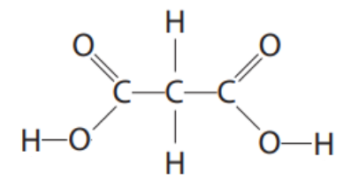 | ;** [1 mark]** |
|---|---|
| 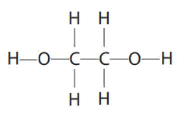 | ;** [1 mark]** |

ii) The name or formula of the small molecule formed when the monomer molecules react to form an ester link is:

- Water / H2O; **[1 mark]**

**[Total: 3 marks]**

- *A dicarboxylic acid and a diol form polyester*

  - *When the monomers join together, the carboxylic acid loses its OH group, and the alcohol loses its hydrogen from the -OH group resulting in the formation of an ester linkage -COO-*
- *For every ester linkage formed in condensation polymerisation, one molecule of water is formed from the combination of a -H and an -OH group*
- *To draw the monomers, identify the carboxylic acid part and the alcohol part in the polyester*

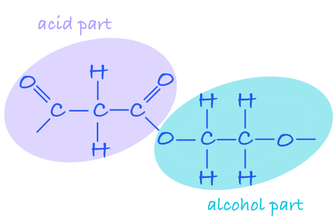

- *Split the repeat unit into the carboxylic part and alcohol part:*

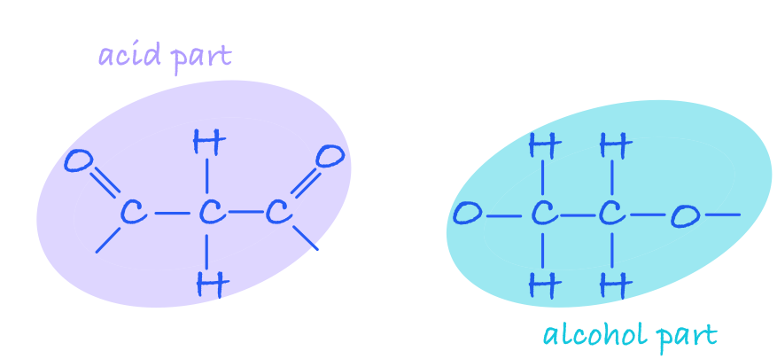

- *Add an OH to each end of the carboxylic acid and an H to each end of the alcohol:*

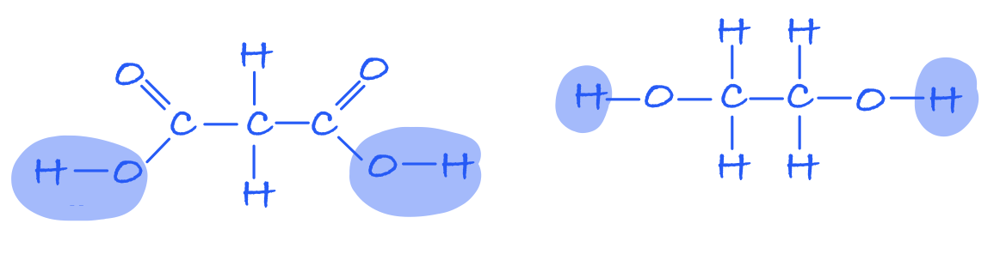

## Q11 — easy — 1 marks

### 12 — 1 marks
**Correct answer: B** — Addition polymers are unsaturated as they are made by combining molecules which contain a carbon double bond

**Final answer:** **The correct answer is B**

- Addition polymers are formed by the joining up of many monomers and only occurs in monomers that contain C=C bonds

  - One of the bonds in each C=C bond breaks and forms a bond with the adjacent monomer with the polymer being formed containing single bonds only
  - Compounds containing single bonds only are saturated compounds

## Q12 — medium — 13 marks

### 6(a) — 3 marks
The empirical formula of chloroethene can be shown to be C2H3Cl as follows:

- Dividing percentages by atomic masses: C: 38.4/12 **AND **H: 4.8/1 **AND **Cl: 56.8/35.5; **[1 mark]**
- Correct results of divisions: C: 3.2 **AND **H: 4.8 **AND** Cl: 1.6; **[1 mark]**
- Obtaining ratio by dividing results by smallest value: C: 3.2/1.6 (= 2) **AND **H: 4.8/1.6 (= 3) **AND** Cl: 1.6/1.6 (= 1); **[1 mark]**

**Alternative method**

- Calculating *M*r of C2H3Cl:  C2H3Cl (= 24 + 3 + 35.5) = 62.5; **[1 mark]**
- Working for finding ratio of each element: C: 24/62.5 **AND **H: 3/62.5 **AND **Cl: 35.5/62.5; **[1 mark]**
- Evaluation of correct percentages: all x 100 C = 38.4(%) **AND **H = 4.8(%) **AND **Cl = 56.8(%); **[1 mark]**

**[Total: 3 marks]**

- *To calculate the empirical formula when given percentages, it is easiest to assume that you have 100 g of the sample, then you can workout the number of moles of each element in 100 g by using the **M**r**:*

|   | > *C* | > *H* | > *Cl* |
|---|---|---|---|
| > *Calculate the number of moles of each element in 100 g (%/**M**r**)* | $\frac{38.4}{12}\,=3.2$ | $\frac{4.8}{1}\,=4.8$ | $\frac{56.8}{35.5}\,=1.6$ |
| > *Divide by the smallest number to find the smallest ratio* | > * 3.2/1.6 = 2* | > * 4.8/1.6 = 3* | > * 1.6/1.6 = 1* |

- *The empirical formula is therefore C**2**H**3**Cl*

### 5(b) — 5 marks
i) The formula of iron(III) chloride is:

- FeCl3; **[1 mark] **
*allow Fe**3+**Cl**3**-*

ii) The purpose of using a catalyst is:

- To increase the rate of the reaction / to speed up the reaction; **[1 mark] **
*allow references to (providing reaction pathway of) lower activation energy*

iii) The meaning of the term exothermic is:

- Gives out heat (energy) / thermal energy;** [1 mark] **
*Do not accept energy on its own* *ignore reference to negative ΔH*

iv) The type of reaction that occurs in stage 1 between ethene and chlorine is:

- A / addition;** [1 mark]**

v) The chemical equation for the decomposition of dichloromethane is:

- C2H4Cl2 → C2H3Cl + HCl; **[1 mark]**

**[Total: 5 marks]**

- *This question pulls on your knowledge from many different areas of the course and demonstrates how you need to know the definitions of many different terms*
- *In stage 1, the double bond of ethene opens up and chlorine adds across it, causing an addition reaction*
- *In part (v), the reaction may be unfamiliar to you but you are giving the names of the reactants and products*

  - *You are also given the formulae of dichloromethane and chloroethene, and you should know the formula of hydrogen chloride*
  - *This information is sufficient to be able to construct the chemical equation*

### 6(c) — 5 marks
i) The displayed formula of chloroethene is:

- Chloroethene:  ; **[1 mark]**

The repeat unit of poly(chloroethene) is:

- Correct displayed formula with single bond between C atoms; **[1 mark]**
- Extension bonds shown on C atoms; **[1 mark]** 
*If double bond shown in repeat unit, max 1 mark* *ignore brackets / n* *More than one correct repeat unit with extension bonds scores 1 mark out of M2/M3*

ii) A dot‐and‐cross diagram to represent a molecule of chloroethene is:

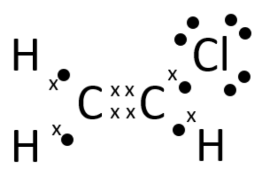

- 2 shared pairs between C atoms;** [1 mark]**
- Rest of structure fully correct; **[1 mark] **
*accept any combination on of dots and crosses*
*ignore inner shells even if incorrect* *M2 is dependent on M1*

**[Total: 5 marks]**

- *Polymerisation is the process where lots (poly-) of links / monomers join together to form a long chain*
- *Addition polymerisation involves breaking open the C=C bond of monomers, joining the monomers together and forms only the polymer *
- *To draw the polymer from the monomer*

  1. *Draw a copy of the monomer*
  2. *Replace the carbon=carbon double bond with a carbon-carbon single bond*
  3. *Add brackets around the molecule *
  4. *Add one continuation / extension bond from each carbon to outside the bracket*
  5. *Add **n** after the brackets (bottom right)*
- *Whilst this question doesn't require the brackets and n, in some instances this is required, so it is best to add these in *
- *When drawing dot-and-cross diagrams, you can add a circle to represent the electron shell or leave it out, as per this mark scheme*
- *Remember**: Check that the electron shell of each atom is full*

## Q13 — hard — 15 marks

### 8(a) — 4 marks
i)  What is meant by the term isomers:

- Isomers are molecules / compounds with the same molecular formulae; **[1 mark]**
- With different structural / displayed formulae; **[1 mark]**

ii)  The displayed formulae of two isomers of Q:

| 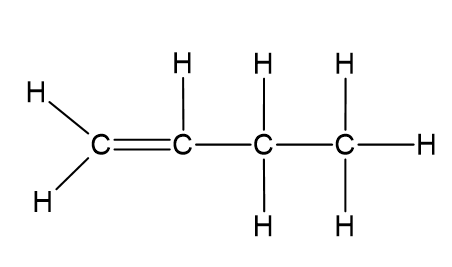  **[1 mark]** | 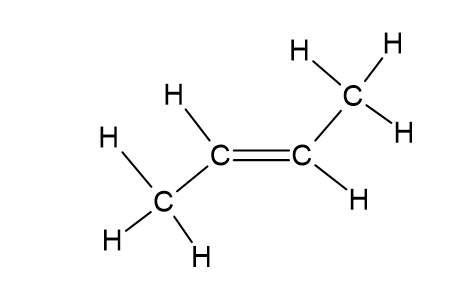  **[1 mark]** |
|---|---|

*Alternative:*

|  |
|---|

**[Total: 4 marks]**

- *You don't need to get the bond angles correct in these drawings to get the marks*

### 8(b) — 5 marks
i)  Whether the molecule is an unsaturated hydrocarbon:

- The molecule is unsaturated as it contains (carbon to carbon) double bond;** [1 mark]**
- The molecule not a hydrocarbon as contains oxygen; **[1 mark]**

ii)  The type of polymerisation that occurs in the formation of the polymer:

- Addition;** [1 mark]**

iii)  Completing the equation for the polymerisation reaction:

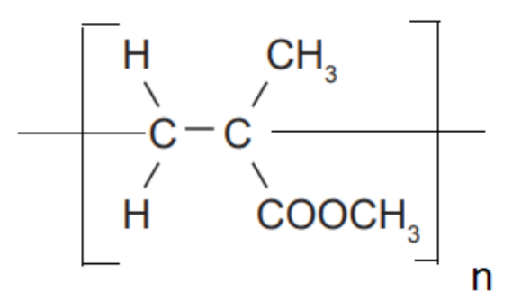

- Correct repeat unit;** [1 mark]**
- Using continuation bonds, the bracket and n;** [1 mark]**

**[Total: 5 marks]**

- *The bonds do not have to go through the brackets to get the second mark*
- *The n can be anywhere after the bracket*

### 8(c) — 6 marks
i)  The mass, in kg, of carbon dioxide formed if all the octane in the fuel tank undergoes complete combustion.

- Calculation of mass of octane;** [1 mark]**

- Calculation of *M**r* of C8H18 and CO2; **[1 mark]**
- Showing the link between mass / mol of C8H18 and mass/mol CO2;** [1 mark]**
- The calculation of mass of CO2 in g; **[1 mark]**
- The calculation of mass CO2 in kg; **[1 mark]**

*Example calculation:*

- 50 x 700 = 35 000 (g)

*- M**r *of C8H18 = 114 and Mr CO2 = 44 - 114g C8H18 produces (8 x 44 =) 352 (g) CO2

- 35 000 g C8H18 produces $\frac{35000\times352}{114}$= 108 070.2 (g)

- CO2  = 108 (kg)

*Alternative method using moles:*

- 50 x 700 = 35 000 (g) *- M**r *of C8H18 = 114 and Mr CO2 = 44 - n (C8H18) = $\frac{35000}{114}$ = 307.0175 mol - so n (CO2) = 8 x 307.0175 = 2456.14 mol mass CO2 = 2 456.14 x 44 = 108 070.2 (g) - CO2 = 108 (kg)

ii)  An environmental problem caused by carbon dioxide is:

- Global warming / climate change;** [1 mark]**

**[Total: 6 marks]**

- *You can use moles or reacting masses to solve these calculations, but make sure you don't round off until the end of the calculation*
- *Follow the data if you are not sure about decimal places or significant figures; the data has three significant figures so quote three in your answer*

  - *You would get credit for 2 significant figures, but not less than that or more than 3*

## Q14 — medium — 13 marks

### 9(a) — 4 marks
i) The completed table should contain:

- (Empirical formula): CH2; **[1 mark]**
- (General formula): CnH2n; **[1 mark]**

*Allow subscript and superscript numbers, capital letters and letters other than n*

ii) Two other characteristics of a homologous series are:

Any **two** from:

- Each member differs from the next by a CH2 group; **[1 mark]**
- (Each member has) the same functional group; **[1 mark]**
- (Each member has) similar/ same chemical properties / similar/ same (chemical) reactions; **[1 mark]**
- Trend in physical properties (between successive members)/ named physical property trend; **[1 mark]**

*Do not allow 'similar/ same physical properties'*

**[Total: 4 marks]**

- *Molecular formula show how many of each type of atom is actually present in a particular molecule, the empirical formula is the simplest ratio of atoms and the general formula could be applied to find the formulae of others in that homologous series*
- *The general formula should be written as given with subscript numbers and n, but variations are sometimes accepted, as is the case here. Try to learn the standard format to be safe!*

### 9(b) — 8 marks
i) The type of reaction is:

- Addition/ additional; **[1 mark]**

ii) The completed diagram should be:

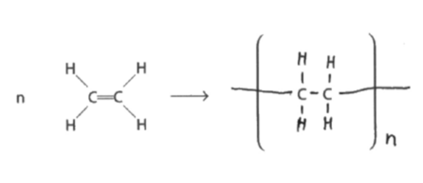

- Single bond between the two carbons, 4 hydrogens joined by single bonds; **[1 mark]**
- Trailing bonds through the brackets and the n to the right (n in any position outside the bracket to the right of the structure); **[1 mark]**

*Allow capital N*

iii)

Any **five** from (including at least one advantage or disadvantage):

- Poly(ethene) is cheaper than polymers from corn starch; **[1 mark]**
- Poly(ethene) is stronger than polymers from corn starch; **[1 mark]**
- Poly(ethene) frees up land to grow food crops; **[1 mark]**
- Poly(ethene) comes from (cracking of certain fractions from) crude oil; **[1 mark]**
- Poly(ethene) is non-renewable 
**OR** 
Ethene is a finite source; **[1 mark]**
- Poly(ethene) is inert; **[1 mark]**
- Poly(ethene) is non-biodegradable; **[1 mark]**
- Poly(ethene) takes longer to decompose; **[1 mark]**
- Disposal of poly(ethene) is a problem (in landfill); **[1 mark]**
- Poly(ethene) causes problems with litter; **[1 mark]**
- Burning poly(ethene) (could) create toxic fumes / greenhouse gases; **[1 mark]**

**[Total: 8 marks]**

- *Addition reactions have a clue in the name; molecules are added together to make one product.*
- *They need a double bond so that one bond can break and one can remain, so the trailing bonds shown are from that broken double bond*
- *If you need to draw it from scratch then start with the carbons that have the double bond, add trailing bonds, then branched groups and brackets*
- *When you are given information to analyse make sure you look at both sides of the argument; only talking about advantages or disadvantages will mean you get a maximum of 3 marks on this question*

### 9(c) — 1 marks
The monomer is:

- Diagram that shows every bond; **[1 mark]**

**[Total: 1 mark]**

- *When drawing monomers from repeat units, put a double bond between the carbons which have the trailing bonds and remove the trailing bonds*
- *If you leave the trailing bonds in place that is incorrect and you will not get the marks*

## Q15 — hard — 6 marks

### 8(a) — 2 marks
i) The name of the monomer is:

- Chloroethene; **[1 mark] ** 
*Accept vinyl chloride*

ii) The addition polymer formed from this monomer is:

- Poly(chloroethene);** [1 mark] ** *Accept polyvinyl chloride* *Ignore PVC*

**[Total: 2 marks]**

- *The carbon chain contains two carbon chains therefore 'eth' must be included in the name *
- *There is a double bond between the two carbon chains, so the name will contain ethene *
- *The monomer contains a chlorine atom, so the prefix 'chloro' must be used *

  - *Therefore the monomer is chloroethene *
- *Also, when it becomes a polymer, the name changes by the addition of 'poly' in front *

  - *polychloroethene *

### 8(b) — 1 marks
The displayed formula of the monomer is:

;** [1 mark] **

*Ignore bond angles*

**[Total: 1 mark] **

- *The monomer has a similar structure to the polymer*

  - *The differences are*
  
    - *A monomer must contain a double bond between the two carbon atoms (C=C)*
    - *A polymer repeat unit shows bonds extended from each carbon atom *
  - *The four groups from the two carbon atoms remain the same*

### 8(c) — 3 marks
i) The structure of the repeat unit of the polyester formed from these two monomers is:

- Correct ester link;** [1 mark] **
- Rest of unit correct;** [1 mark] **

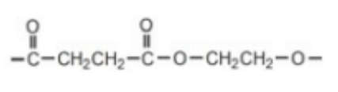

**   OR**

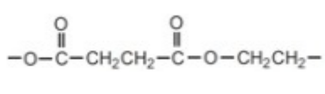

ii) The small molecule formed when these two monomers form the polyester are:

- Water / H2O; **[1 mark] **

**[Total: 3 marks]**** **

- *Condensation polymerisation involves the elimination of a small molecule which does not have to be water*

  - *It could be HCl or NH**3*
- *The formation of the condensation polymer is:* 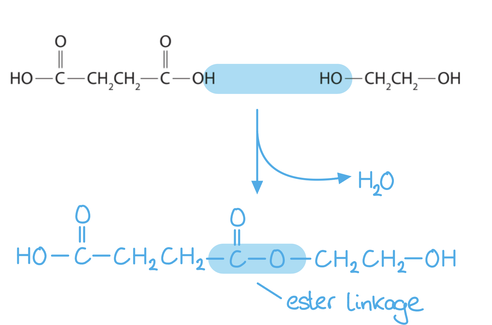
