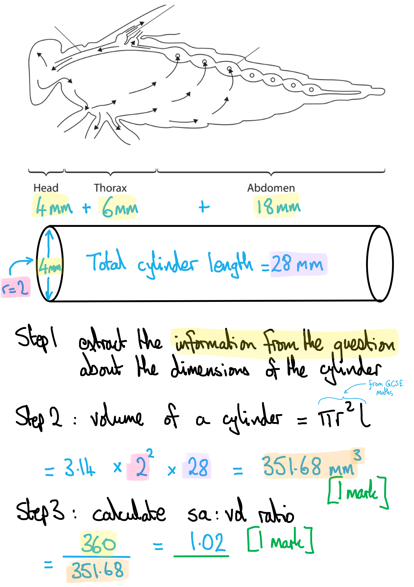

# Mark Schemes — Biological Molecules
**1. Molecules, Transport & Health** · Edexcel International A Level (IAL) Biology (YBI11)

## Q1 — medium — 9 marks · exam-questions

### 4() — 3 marks
(i) The correct answer is **B** (sucrose only) because...

**Sucrose is the only sugar in the list that contains more than one monosaccharide. Sucrose is made up of one glucose molecule and one fructose molecule, and these are joined by a one glycosidic bond.**

> *A** is incorrect because fructose is a monosaccharide.*

> *C** is incorrect because both glucose and fructose are monosaccharides.*

> *D** is incorrect because fructose is a monosaccharide.*

(ii) The correct answer is **C** (peptide and condensation) because...

**Peptide**** bonds are how amino acids are joined together in a polypeptide, and these bonds are formed by ****condensation**** (water is a by-product).**

> *A** is incorrect because ester bonds are found in lipids.*

> *B** is incorrect because ester bonds are found in lipids and hydrolysis splits bonds.*

> *D** is incorrect because hydrolysis splits bonds.*

(iii) The correct answer is **B** (absent / lower) because...

**Saturated lipids have no C=C double bonds, so have more hydrogen per carbon atom, so their C:H ratio is lower than their unsaturated counterparts.**

> *A** is incorrect because saturated fatty acids have more hydrogens than unsaturated fatty acid of same length.*

> *C** and **D** are incorrect because there are no carbon-to-carbon double bonds in saturated fatty acids.*

**Final answer:** **[Total: 3 marks]**

### 4() — 6 marks
(i) An estimate of the the surface area to volume ratio of the butterfly is as follows:

**Up to ****two**** from:**

- Volume of cylinder calculated; **[1 mark]**

  - *Allow range of volume calculated 336 to 352 mm**3** inclusive*
- Ratio of surface area : volume to max 2 decimal points; **[1 mark]**

  - *Allow range of final ratio from 1.00 to 1.07*
  - *Allow ratio to be expressed as 1.02 or 1.02 : 1*

(ii) The circulation of a butterfly is different from the circulation of a mammal because:

**Final answer:** **Any**** two**** of the following:**

- The insect is small and so the cells will not be far from the sinuses / blood **OR** there will be a short diffusion distance/pathway; **[1 mark]**
- (So) diffusion can supply the oxygen / nutrients / named nutrient (from the blood) **OR** can remove CO2; **[1 mark]**
- The insect is small so it does not have a double circulation system / blood vessels / a closed circulatory system / a complex circulatory system / high pressure; **[1 mark]**

**OR**

**Final answer:** **Any ****two**** of the following:**

- Because the insect has a low metabolic rate / oxygen demand; **[1 mark]**
- Diffusion can supply oxygen (from blood / tracheoles) **OR** the oxygenated and deoxygenated blood does not need to be kept separate; **[1 mark]**
- Because the insect is small it does not have a double circulation system / blood vessels / a closed circulatory system / a complex circulatory system / high pressure; **[1 mark]**

*Ignore references to surface area to volume ratio Ignore the insect has an open system because this is stated in the question*

> *Make sure to write your answer giving plenty of **comparisons** between a mammal and a butterfly. It's not enough to just write about the mammalian circulatory system. *

(iii) The structure of collagen is:

**Final answer:** **Any**** two**** from the following:**

- A <u>fibrous</u> protein; **[1 mark]**
- A triple / three-stranded helix (held with hydrogen bonds); **[1 mark]**
- With short repeating sequences of amino acids **OR** high hydroxyproline / proline / glycine content / every third amino acid is glycine; **[1 mark]**

*Ignore alpha if alpha-helix quoted* *Ignore references to secondary/tertiary/quaternary structure*

**Final answer:** **[Total: 6 marks]**

## Q2 — medium — 5 marks · exam-questions

### 3((a)) — 5 marks
(i) The correct answer is **A **because...

**Glycogen is made up of α glucose monomers. When they bond together it releases a water molecule, therefore this is a condensation reaction. **

> *B** is incorrect because when two α glucose monomers join together it is not a hydrolysis reaction, it is a condensation reaction. *

> *C** and** D **are incorrect because glycogen is not made from β glucose monomers.*

(ii) The bond that joins two glucose molecules together is...

- Glycosidic (bond / link); **[1 mark]**

***Accept**** covalent bond*

(iii) The structure of glycogen relates to its role as an energy storage molecule because...

Any **three **of the following**:**

- Glycogen is a polymer of glucose / glycogen is a polysaccharide, therefore has a high energy content; **[1 mark]**
- Glycogen is a large molecule/polymer/polysaccharide therefore insoluble/has no osmotic effect; **[1 mark]**
- Glycogen has a branched structure therefore it is broken down/energy released/hydrolysed faster (**reject**: <u>easier</u> to break down); **[1 mark]**
- Glycogen is compact therefore has a high energy density / high energy stored in a small space / many glucose molecules stored in a small space; **[1 mark]**

**[Total: 5 marks]**

> *You can list as many correct facts about the structure of glycogen as you like, but if you do not link these to energy storage you cannot gain the marks that relate to energy (which is 3 of the 4 mark scheme points available). *

## Q3 — medium — 7 marks · exam-questions

### 1((a)) — 4 marks
The table should be filled in as follows...

| **Polymer** | **Monomer** | **Elements present in** **monomer** | **Type of bond between** **monomers** |
|---|---|---|---|
| polysaccharides | monosaccharide | Carbon, hydrogen and oxygen; **[1 mark]** | glycosidic |
| nucleic acid | (mono)nucleotide; **[1 mark]** | carbon, hydrogen, oxygen, phosphorus and nitrogen | Phosphodiester; **[1 mark]** |
| protein | amino acid | Carbon, hydrogen, oxygen, (sulfur) and nitrogen; **[1 mark]** | peptide |

**Final answer:** **Accept**** chemical symbols C, H, O, S and N.**

**[Total: 4 marks]**

### 1((b)) — 3 marks
An unsaturated triglyceride is synthesised as follows...

**Final answer:** **Any ****two**** of the following:**

- (One) glycerol **AND** three fatty acids; **[1 mark]**
- Joined together by a condensation reaction / ester bond; **[1 mark]**
- (Condensation reactions are) catalysed by enzymes; **[1 mark]**

**AND**

- (At least) one fatty acid is unsaturated / has a carbon to carbon/CC double bond; **[1 mark]**

**[Total: 3 marks]**

## Q4 — medium — 7 marks · exam-questions

### 1((a)) — 1 marks
**Final answer:** **The correct answer is ****C (two) ****because...**

**Starch is insoluble in water and consists of the polysaccharides amylose and amylopectin.**

> *However, starch has 1-4 glycosidic bonds as well as 1-6 glycosidic bonds.*

**[Total: 1 mark]**

### 1((b)) — 6 marks
(i) The completed sentences are as follows...

Disaccharides consist of two monosaccharides joined together by a **glycosidic** **[1 mark]** covalent bond. Sucrose and lactose are both disaccharides. They both contain a molecule of **(α) glucose** **[1 mark]**. Sucrose also contains one molecule of **fructose** **[1 mark]** and lactose also contains one molecule of **galactose** **[1 mark]** .

(ii) The type of reaction that joins these monosaccharides together in the formation of gentiobiose is...

- Condensation (reaction); **[1 mark]**

***Accept**** polymerisation*

(iii) **The correct answer is ****C**** (342) because...**

**The molecular mass is 180 + 180 – 18 = 342.**

> *The reason for this is because both monosaccharides have a molecular mass of 180, so two of these would equal 360. However, when the glycosidic bond forms between them to make a disaccharide this is a condensation reaction and a water molecule is released. Water has a molecular mass of 18 (H**2**O = 1 + 1 + 16 = 18). This must be subtracted from 360 to give a final answer of 342. *

**[Total: 6 marks]**

## Q5 — easy — 10 marks · exam-questions

### 1() — 2 marks
To calculate the expected energy content of product B per 100 g:

- Multiply the mass of each macronutrient by its energy value:

Carbohydrate = 44 × 17

= 748 kJ

Fat = 18 × 39

= 702 kJ

Protein = 14 × 17

= 238 kJ

- Sum these values

= 748 + 702 + 238

= **1688** kJ / 100 g

> **[mark-scheme]**
> Award marks as follows:
> 
> - 748 **AND** 702 **AND** 238 **[1 mark]**
> - 1688 **OR** 1690 **[1 mark]**
> 
> Award full marks for the correct answer in the absence of working.

### 2() — 3 marks
> **[mark-scheme]**
> Any **three** from:
> 
> - Saturated fat increases blood LDL concentration
> - Cholesterol leads to the formation of an atheroma / plaque in the coronary artery
> - Atheroma / plaque restricts / prevents blood flow to the heart muscle
> - Heart muscle cells receive no oxygen for respiration / aerobic respiration cannot take place in heart muscle cells
> 
> **[3 marks]**
> 
> Do not accept "fatty deposit" for plaque / atheroma

> **[exam-tip]**
> Make sure you build a clear causal chain in your answer: saturated fat → raised LDL/cholesterol → atheroma formation → restricted blood flow → reduced respiration.
> 
> Always specify that it is the coronary arteries that are affected, not just "arteries" in general, as the question asks about coronary heart disease.

### 3() — 2 marks
> **[mark-scheme]**
> Any **two** from:
> 
> - Saturated fatty acids have no C=C double bonds** WHILE** unsaturated fatty acids have one or more C=C double bonds
> - Saturated fatty acids have a higher H:C ratio than unsaturated fatty acids **OR **unsaturated fatty acids have a lower H:C ratio than saturated fatty acids
> - Saturated fatty acids have a straight/linear hydrocarbon chain **WHILE** unsaturated fatty acids have a bent/kinked chain
> 
> **[2 marks]**

> **[exam-tip]**
> This question asks for *differences*, so you must compare both types of fatty acid in each point. Use language such as "while", "higher" or "lower", to make the contrast between saturated and unsaturated fatty acids clear.
> 
> Be precise with terminology: refer to C=C (carbon-to-carbon) double bonds rather than just "double bonds", as this makes it clear you are referring to bonds within the hydrocarbon chain.

### 4() — 1 marks
**Correct answer: B** — Ester bond formed by condensation

> **[mark-scheme]**
> **The correct answer is B**.
> 
> - Triglycerides are formed via condensation reactions, producing ester bonds at each glycerol-fatty acid junction
> 
> **A** is incorrect because glycosidic bonds form between monosaccharides, not glycerol and fatty acids; hydrolysis also breaks bonds rather than forming them.
> 
> **C **is incorrect because peptide bonds form between amino acids during polypeptide synthesis.
> 
> **D** is incorrect because hydrolysis breaks ester bonds; condensation forms them.

### 5() — 2 marks
> **[mark-scheme]**
> - Sucrose is a disaccharide **AND** is formed from one glucose and one fructose molecule **[1 mark]**
> - Joined by a glycosidic bond **[1 mark]**
> 
> Ignore references to α or β variations.
