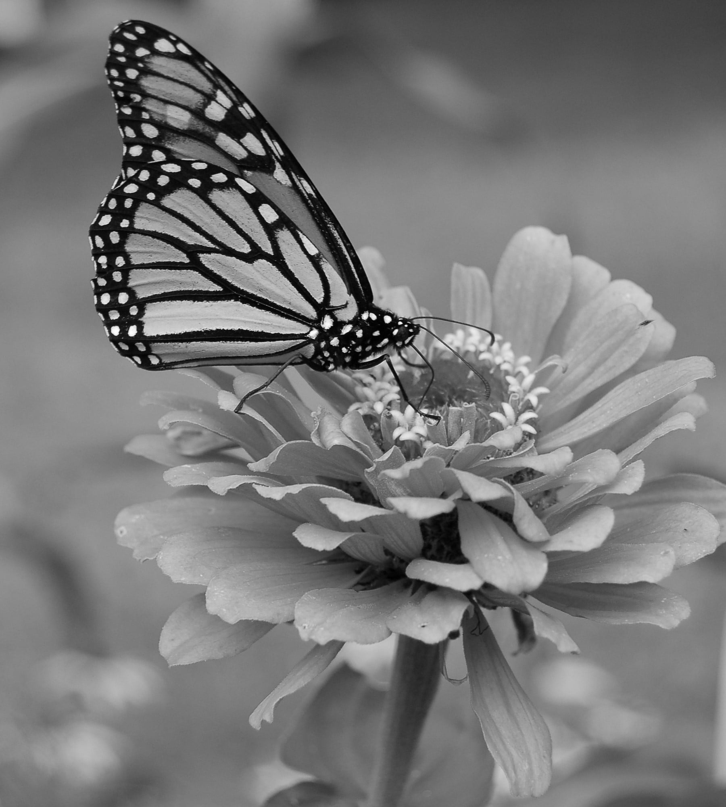
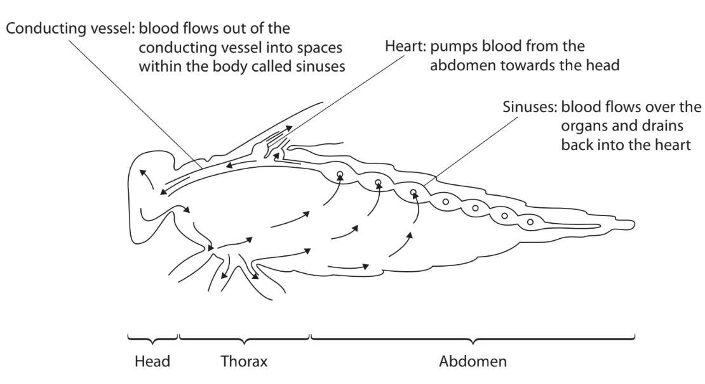
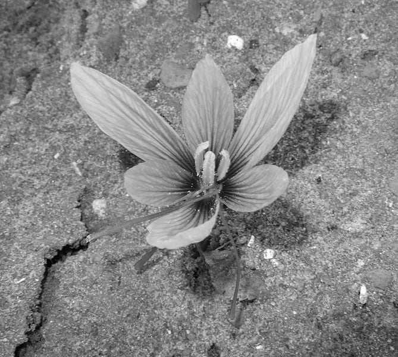

# Exam Questions — Biological Molecules
**1. Molecules, Transport & Health** · Edexcel International A Level (IAL) Biology (YBI11)
> Source: [https://www.savemyexams.com/international-a-level/biology/edexcel/18/topic-questions/1-molecules-transport-and-health/biological-molecules/exam-questions/](https://www.savemyexams.com/international-a-level/biology/edexcel/18/topic-questions/1-molecules-transport-and-health/biological-molecules/exam-questions/) · 5 questions · total 38 marks

## Q1 — medium — 9 marks · exam-questions

### 4() — 3 marks — command: which — structured — from paper Oct/Nov 2021 · WBI11/01
The butterfly is an insect that feeds on nectar produced by flowers. 
The photograph shows a butterfly feeding on a flower.

Photo (c)2006 Derek Ramsey (Ram-Man), GFDL 1.2 , via Wikimedia Commons

The nectar in flowers contains nutrients including sugars, amino acids and lipids.

(i) The sugars in the nectar are fructose, glucose and sucrose.

Which of these contain glycosidic bonds?

**(1)**

☐ **A** fructose only

☐ **B** sucrose only

☐ **C** fructose and glucose

☐ **D** fructose and sucrose

(ii) Which row of the table describes how amino acids are joined together to form a protein?

**(1)**

|   |
|---|

|   | **name of bond** | **type of reaction** |
|---|---|---|
| ☐**A** | ester | condensation |
| ☐**B** | ester | hydrolysis |
| ☐**C** | peptide | condensation |
| ☐**D** | peptide | hydrolysis |

(iii) Which row of the table describes a saturated lipid?

**(1)**

|   | **carbon-carbon double bonds** | **carbon : hydrogen ratio** |
|---|---|---|
| ☐**A** | absent | higher than in an unsaturated fatty acid chain |
| ☐**B** | absent | lower than in an unsaturated fatty acid chain |
| ☐**C** | present | higher than in an unsaturated fatty acid chain |
| ☐**D** | present | lower than in an unsaturated fatty acid chain |

** **

### 4() — 6 marks — command: multiple — structured — from paper Oct/Nov 2021 · WBI11/01
The circulatory system of an insect is described as an open system. This means that the blood is not contained inside blood vessels but flows through cavities called sinuses.

The diagram shows part of the circulatory system of an insect.

(i) The length of the head of a butterfly is 4mm, the thorax is 6mm and the abdomen is 18mm.

Estimate the surface area to volume ratio of the butterfly.

Assume that the insect is a cylinder of diameter 4mm and the surface area is 360mm2

**(2)**

(ii) Explain why the circulation of a butterfly is different from the circulation of a mammal.

**(2)**

(iii) The blood flowing through the sinuses of the butterfly is separated from the organs by collagen.

Describe the structure of collagen.

**(2)**

## Q2 — medium — 5 marks · exam-questions

### 3((a)) — 5 marks — command: multiple — structured — from paper Jan 2021 · WBI11/01
Humans store energy as glycogen.

(i) Which is the correct statement about the formation of glycogen?

**(1)**

| ☐ | **A** | α glucose molecules join together by a condensation reaction |
|---|---|---|
| ☐ | **B** | α glucose molecules join together by a hydrolysis reaction |
| ☐ | **C** | β glucose molecules join together by a condensation reaction |
| ☐ | **D** | β glucose molecules join together by a hydrolysis reaction |

(ii) Name the bond that joins two glucose molecules together.

**(1)**

(iii)   Explain how the structure of glycogen relates to its role as an energy storage molecule.

**(3)**

## Q3 — medium — 7 marks · exam-questions

### 1((a)) — 4 marks — command: complete — structured — from paper June 2021 · WBI11/01
Polysaccharides, lipids, nucleic acids and proteins are large molecules found in living organisms.

Polymers are large molecules made of monomers. The table gives information about some of these polymers.

Complete the table by filling in the empty boxes with either the name of the monomer, the elements present in each monomer or the type of bond between monomers.

**(4)**

| **Polymer** | **Monomer** | **Elements present in** **monomer** | **Type of bond between** **monomers** |
|---|---|---|---|
| polysaccharides | monosaccharide |   | glycosidic |
| nucleic acid |   | carbon, hydrogen, oxygen, phosphorus and nitrogen |   |
| protein | amino acid |   | peptide |

### 1((b)) — 3 marks — command: describe — structured — from paper June 2021 · WBI11/01
Triglycerides are lipids.

Describe how an unsaturated triglyceride is synthesised.

## Q4 — medium — 7 marks · exam-questions

### 1((a)) — 1 mark — command: how — structured — from paper Jan 2022 · WBI11/01
The photograph shows a saffron crocus plant.

Emilie40, CC0, via Wikimedia Commons

This plant grows from a bulb.

The bulb contains starch as an energy storage molecule for the crocus.

How many of the following statements are correct for starch in living cells?

- Starch consists of a mixture of two types of polysaccharide
- Starch contains only 1–6 bonds
- Starch is insoluble in water

**(1)**

☐ **A** None

☐ **B** One

☐ **C** Two

☐ **D** Three

### 1((b)) — 6 marks — command: multiple — structured — from paper Jan 2022 · WBI11/01
Saffron is a spice that is derived from parts of the flower of the saffron crocus.

Saffron contains a disaccharide called gentiobiose.

(i) Read through the following description of some disaccharides.

Complete the description by writing the most appropriate word on the dotted lines.

**(4)**

Disaccharides consist of two monosaccharides joined together by a ........................................ covalent bond. Sucrose and lactose are both disaccharides. They both contain a molecule of ................................. Sucrose also contains one molecule of ................................ and lactose also contains one molecule of ............................ .

(ii) Gentiobiose is formed from two identical monosaccharides.

Name the type of reaction that joins these monosaccharides together in the formation of gentiobiose.

**(1)**

(iii) The molecular mass of each of the monosaccharides in gentiobiose is 180.

The table shows the molecular mass of the elements present in the monosaccharides.

| **Element** | **Molecular mass** |
|---|---|
| carbon | 12 |
| hydrogen | 1 |
| oxygen | 16 |

Which is the molecular mass of gentiobiose?

**(1)**

☐ **A** 144

☐ **B** 162

☐ **C** 342

☐ **D** 360

## Q5 — easy — 10 marks · exam-questions

### 1() — 2 marks — command: show — structured
A student investigated the nutritional content of two food products, A and B, sold as "healthy" snack bars.

| Nutrient | Product A (g / 100 g) | Product B (g / 100 g) |
|---|---|---|
| Carbohydrate | 62 | 44 |
| Fat | 8 | 18 |
| Protein | 6 | 14 |

The energy values of macronutrients are:

- Carbohydrate: 17 kJ g⁻¹
- Fat: 39 kJ g⁻¹
- Protein: 17 kJ g⁻¹

Using the data in the table, calculate the expected energy content of product B per 100 g. Show your working.

### 2() — 3 marks — command: explain — structured
A nutritionist advised that frequent consumption of product B could increase the risk of cardiovascular disease due to its high saturated fat content.

Explain how a diet high in saturated fat can lead to coronary heart disease.

### 3() — 2 marks — command: state — structured
Product A contains fat with a higher proportion of unsaturated fatty acids.

State **two** structural differences between a saturated and an unsaturated fatty acid.

### 4() — 1 mark — multiple_choice
Which of the following describes the bond formed between glycerol and a fatty acid in product B?
- **A.** Glycosidic bond formed by hydrolysis
- **B.** Ester bond formed by condensation
- **C.** Peptide bond formed by condensation
- **D.** Ester bond formed by hydrolysis

### 5() — 2 marks — command: describe — structured
Sucrose was found in product A.

Describe the structure of a sucrose molecule.
