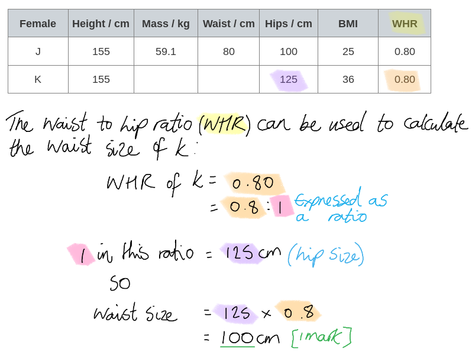
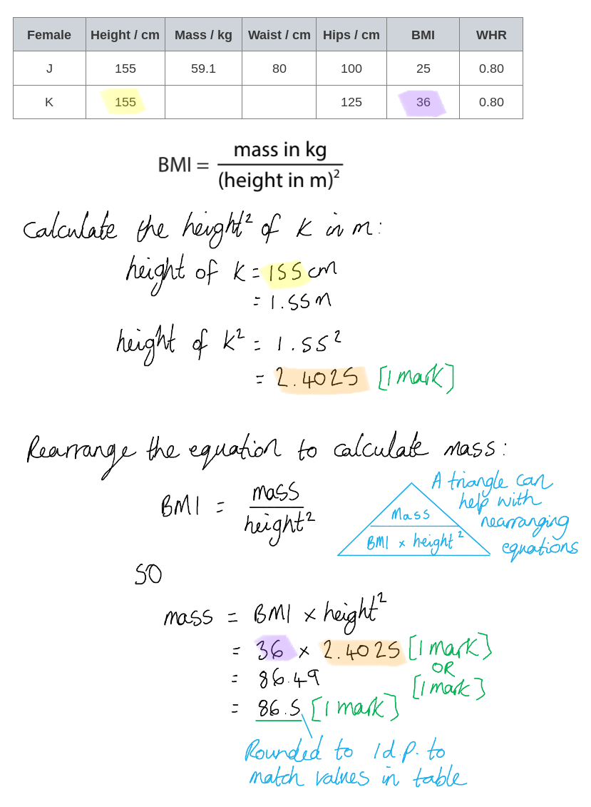
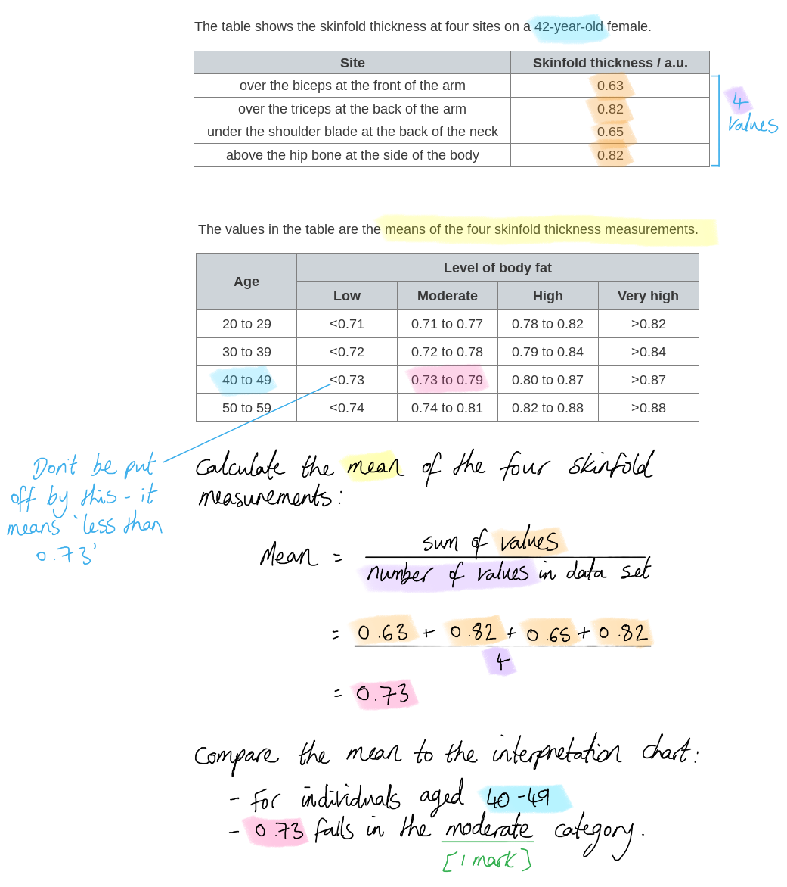
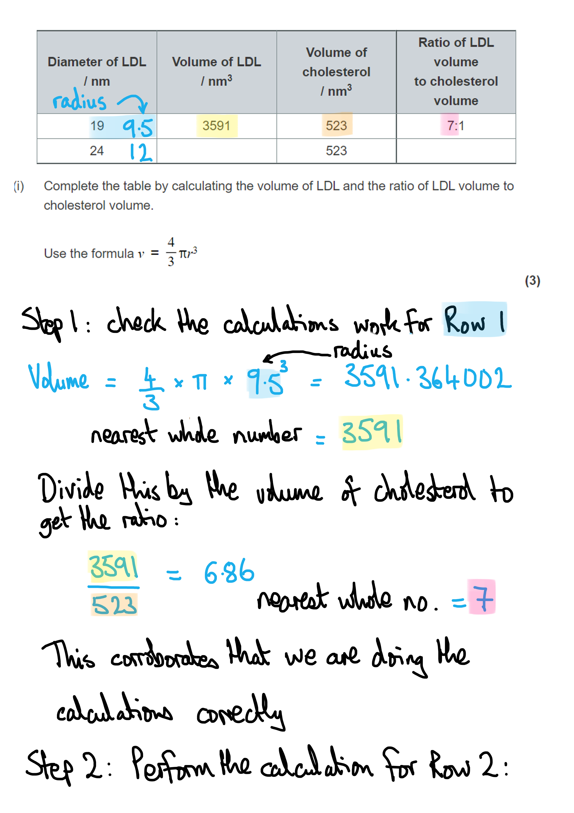
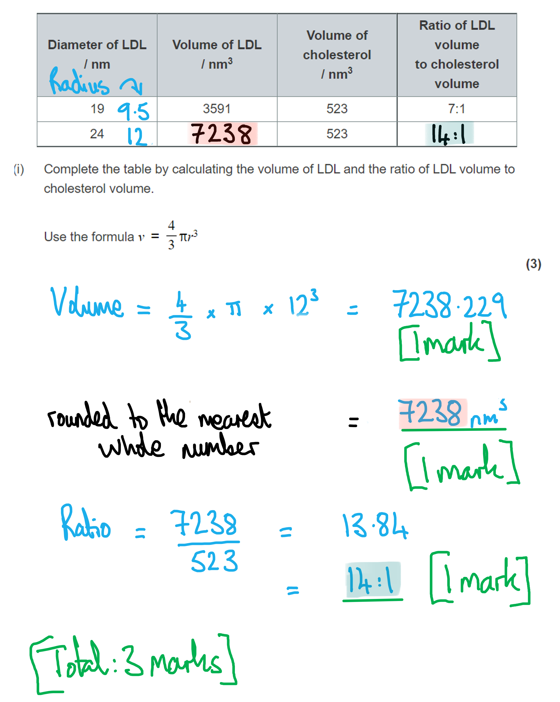

# Mark Schemes — Diet & Health
**1. Molecules, Transport & Health** · Edexcel International A Level (IAL) Biology (YBI11)

## Q1 — medium — 15 marks · exam-questions

### 7((a)) — 1 marks
Some factors that increase the risk of CVD are...

Any **one **of the following lifestyle risk factors:

- High BMI;
- Smoking;
- Alcohol intake;
- High salt intake;
- High cholesterol intake;
- Obesity / overweight / high waist to hip ratio;
- High level of fat/sugar in diet;
- Type 2 diabetes;
- High stress levels;
- Air pollution;

<u>**AND**</u>** **any **one **of the following non-lifestyle risk factors:

- Age;
- Sex;
- Gender;

Both a lifestyle factor **AND **a non-lifestyle factor needed to gain **[1 mark]**

**[Total: 1 mark]**

> *Make sure not to accidentally copy examples already given in the question! Make sure to be specific about factors that cause the risk to **increase**, for example if you just say "BMI" you can't get the mark, instead you must specify "**high **BMI".*

### 7((b)) — 2 marks
The conclusions that can be made from the information shown in this graph are...

Any** two **of the following:

- Increase in intensity of exercise decreases the risk of death from heart disease; **[1 mark]**
- Increase in the energy needed for exercise decreases the risk of death from heart disease; **[1 mark]**
- For the same energy expenditure, vigorous exercise/moderate exercise decreases risk of death from CVD more than light exercise; **[1 mark]**

**[Total: 2 marks]**

### 7((c)) — 6 marks
(i) Dietary antioxidants reduce the risk of CVD because...

- Antioxidants reduce free radicals; **[1 mark]**
- Free radicals cause cell damage / tissue damage / oxidative stress / damage to endothelial lining; **[1 mark]**
- (Antioxidants) reduce plaque/atheroma formation; **[1 mark]**

(ii) A study to confirm that antioxidants reduce the risk of CVD could be carried out as follows...

Any **three **of the following:

- Use (a large number of) healthy individuals / individuals with no known heart condition; **[1 mark]**
- Who have similar (lifestyle and non-lifestyle) risk factors / examples of risk factors, such as age/exercise; **[1 mark]**
- Compare group given antioxidants to a group using other preventative treatments/a placebo/no antioxidants; **[1 mark]**
- Monitor the incidence of heart disease over a (long) period of time / at least six months; **[1 mark]**

**[Total: 6 marks]**

> *You need to be specific about monitoring for the incidence of heart disease for the final marking point, alternative suggestions such as monitoring risk of heart disease or another factor would not gain the mark. *

### 7((d)) — 6 marks
The effects on the heart function after the coronary artery becomes completely blocked is...

> *This is a level-marked question, meaning that this is is marked **according to the levels table**. The indicative content points below the table are **not** to be used in the usual '**one point one mark**' way, but should be used together with the levels table to determine the number of marks which should be awarded. *

| **Level 1** Up to 4 points from anywhere; 1 points for **[1 mark]** and 2 points for **[2 marks]**. |
|---|
| **Level 2** Up to 2 points from each of two categories; 3 points for **[3 marks]**, 4 points for **[4 marks]**. |
| **Level 3** As level 2 plus up to 2 points from third category; 5 points for **[5 marks]** and 6 points for **[6 marks].** |

*Category 1: Outline of events*

- Less blood reaches the heart muscle cells,
- Muscle cells are not supplied with enough oxygen
- Muscle cells are not supplied with enough glucose (***reject**** nutrients*)
- <u>Aerobic</u> respiration decreases

*Category 2: Contraction stops*

- Anaerobic respiration produces lactic acid
- Lactic acid lowers pH and denatures enzymes
- Glycogen used as respiratory substrate
- Anaerobic respiration produces much less ATP/energy
- Therefore less/no blood is pumped by the heart
- Reference to effect on other organs e.g. no gas exchange in the lungs or tissues

*Category 3: Use of graph / information from the question stem*

- Energy released from heart cells decreases with time after blockage
- Reference to data from graph (separate to the points below)
- After 8 minutes the energy released is **52 - 54 a.u.**
- After 8 minutes there is not enough energy for contraction
- After 20 minutes the energy released is **23 - 24 a.u.**
- Which is too low to maintain cell viability / for cells to survive
- Cells die as not enough ATP for vital processes e.g. active transport

**[Total: 6 marks]**

> *It is really important in order to gain full marks in this question to interpret information from the question stem and graph, for example 8 minutes was a key milestone (when contraction stops), you can tell this by reading the energy level of the graph at this point and deducing that there was not enough energy for contraction to continue. Similarly, at 20 minutes heart muscle cells begin to die; stronger answers to this question would involve reading the energy level off the graph at this point and recognising that there was not enough energy for cells to survive.*

## Q2 — medium — 11 marks · exam-questions

### 6() — 8 marks
(i) The waist size of female K is…

- 100 (cm); **[1 mark]**

(ii) The mass of female K is...

- 2.4025 (m) / 24025 (cm); **[1 mark]**
- 36 x 2.4025 **OR** 86.49; **[1 mark]**
- 86.5; **[1 mark]**

*Full marks can be awarded for the correct answer of 86.5 in the absence of other calculations.*

(iii) The risk of developing CVD in these two women is as follows...

- The <u>WHR</u> shows that the two women have the same risk of developing CVD; **[1 mark]**
- The mass / BMI suggests that female K is at greater risk; **[1 mark]**

(iv) The way a person takes these measurements could produce an underestimate of their risk of CVD as follows...

Any **two** of the following:

- The tape could be pulled tighter to give a smaller waist measurement **OR** the (abdominal) muscles could be tightened/contracted/held in to give a smaller waist measurement; **[1 mark]**
- The tape could be help loosely to give a larger hip measurement; **[1 mark]**
- Giving a smaller <u>waist to hip ratio</u>; **[1 mark]**

*Award 1 mark for both method descriptions (i.e. pulling tape measure tight around the waist ****and**** holding it loosely at the hip) in the absence of a description of the the effect that this would have on the measurements.*

**[Total: 8 marks]**

### 6() — 3 marks
(i) Reasons why the skinfold thickness values are different at each site on the body could be…

Any **two** of the following:

- Fat is not evenly distributed under the skin; **[1 mark]**
- Exercise will cause fat under the skin to be replaced with muscle / exercising some parts of the body will reduce fat (in these locations); **[1 mark]**
- The woman may have had a child; **[1 mark]**
- The woman may have had liposuction; **[1 mark]**
- Lipoedema may be affecting the arms; **[1 mark]**

***Accept ****reverse answers for the second option in marking point 2, i.e. "stopping exercise in some parts of the body will increase fat".*

> *This is a 'suggest' question, so you are not expected to know the answer, just to make a valid suggestion.*

> *Note that you have been specifically informed that you should assume that the variation in values is **not** due to incorrect use of the callipers; it is always wise to **avoid 'incorrect use of equipment'** as an answer even in questions where this information has not been provided.*

(ii) The level of body fat of this female is...

- Moderate; **[1 mark]**

***Reject**** low / low to moderate.*

**[Total: 3 marks]**

> *The level of body fat can be determined as follows:*

## Q3 — medium — 12 marks · exam-questions

### 7((a)) — 6 marks
A man with a blood HDL level greater than 40mgdm−3 may still have a high risk of developing heart disease because:

> *This is a level-marked question, meaning that it is marked according to the levels table. The indicative content points below the table are not to be used in the usual 'one point per mark' way, but should be used together with the level descriptors to determine the number of marks which should be awarded. *

**Level indications**

| Level 1: | 1 named risk factor / comment on the graph  2 named risk factors / comments on the graph  **OR **an outline of how cholesterol causes CVD ie. recall of the story | **[1 mark]** **[2 marks]** |
|---|---|---|
| Level 2: | 2 simple explanations  3 simple explanations | **[3 marks]** **[4 marks]** |
| Level 3: | as for 4 marks + 1 point from an extended explanation  as for 5 marks + 2 points from extended explanations | **[5 marks]** **[6 marks]** |

**Indicative content**

**Graph:**

- HDL is involved in the removal of LDL from the blood by the liver
- It's not just the level of HDL that influences the risk
- Higher levels of LDL increase the risk
- The risk decreases with an increase in HDL
- HDL results in the uptake of cholesterol by the liver
- LDL forms the plaque
- The risk is a combination/ratio of HDL and LDL levels
- The higher the HDL:LDL ratio the lower the risk

**Other risk factors:**

- The more cholesterol in the blood the more cholesterol there is to build up the atheroma
- High blood pressure increases the chance of damage to the endothelial cell layer
- Smoking causes high blood pressure
- Smoking produces carbon monoxide/CO that binds to haemoglobin, putting strain on the heart
- A high salt content in diet causes high blood pressure
- Obesity increases the risk because of the strain it puts on the heart
- Age increases the risk because it affects heart muscle
- Any genetic predisposition to heart disease affects a person's overall risk

**Extended explanation:**

- Damage to the endothelial layer results in an inflammatory response
- Damage to the endothelial layer causes a build up of cholesterol / plaque
- Plaque causes more cholesterol to build up / a blood clot to form
- The <u>coronary artery</u> becomes blocked
- Resulting in less oxygen reaching the <u>heart's cells / tissues</u>
- A heart attack can result because <u>heart cells</u> cannot respire / may die

**[Total: 6 marks]**

> *You may simply try to describe the graph without looking at the major trends, or you may choose to ignore the graph and list risk factors. Neither is a good strategy in this level-described question.*

> *You should note that the command word is ‘explain’, so to score more marks, you should recognise that an explanation of  both the graph and the risk factors is required. *

### 7() — 6 marks
(i) To compare and contrast the structure of HDL with altered HDL, as follows:

**Similarities**

At least **one **of the following:

- Both contain ApoA-1; **[1 mark]**
- Both contain a phospholipid layer; **[1 mark]**

**Differences**

Up to **two** of the following:

- Altered HDL is larger; **[1 mark]**
- Altered HDL has more CE; **[1 mark]**
- Altered HDL has fewer (long-chain polyunsaturated) PC; **[1 mark]**

> *Remember that a 'compare and contrast' question always requires at least one similarity and one difference for a chance of gaining full marks.*

(b) (ii) The effect of the reduced antioxidant properties of altered HDL on reducing the risk of heart disease is:

**Three** of the following:

- There will be less reduction (in the number) of free radicals **OR** free radicals will not be reduced/neutralised; **[1 mark]**
- Therefore cell damage / damage to lining of blood vessels / oxidative stress will not be reduced **OR** cell damage / damage to lining of blood vessels / oxidative stress will occur; **[1 mark]**
- Therefore formation of a plaque / atheroma will not be reduced **OR** there will be more plaques; **[1 mark]**

> *Avoid the temptation to describe what antioxidants do, rather than what would happen without them, as asked in the question.*

**[Total: 6 marks]**

## Q4 — medium — 10 marks · exam-questions

### 5((a)) — 1 marks
Obesity indicators used by scientists include...

Any **two** of the following:

- BMI/body mass index; **[1 mark]**
- Waist to hip / hip to waist ratio; **[1 mark]**
- Waist to height / height to waist ratio; **[1 mark]**
- Waist circumference; **[1 mark]**
- Skin fold (thickness); **[1 mark]**

**[Total: 2 marks]**

> *Make sure to suggest **two different **obesity indicators, rather than giving additional (unnecessary) detail about the one indicator you have stated.*

### 5((b)) — 4 marks
(i) The glycosidic bonds that are responsible for the branching in glucomannan are **B** because...

**Glucomannan has a similar structure to amylopectin, which relies on 1-6 glycosidic bonds to provide the required branch points in the polysaccharide structure.**

> *A and C are incorrect because 1-4 bonds are present in straight chains only*

> *D is incorrect because 1-6 bonds form the branches*

(ii) Glucomannan aids weight loss by...

- Making the person feel full / suppressing appetite / filling up the stomach so less food is needed to satisfy hunger / taking the space of the food; **[1 mark]**

***Ignore**** 'reduces food intake' or 'decreases the volume of the stomach' without further detail.*

(iii) If digested, glucomannan would cause a gain in weight because...

Any **two** of the following...

- (Glucomannan) contains lots of monosaccharides/glucose/sugar /** **energy **OR** is a polymer of glucose; **[1 mark]**
- The energy input could be greater than energy output **OR **(excess) glucose would be converted to fat; **[1 mark]**
- Glucomannan would no longer be filling up the stomach so more food could be eaten; **[1 mark]**

***Allow**** mannose for monosaccharides in marking point 1.*

**[Total: 4 marks]**

> *(ii) Note that you must refer to the information provided in the question; if you do not then you could easily miss the point. This question is about the ability of glucomannan to take the place of food in the stomach; this suppresses appetite, resulting in lower food intake.*

> *You will not be credited for a reference to the 1-6 bonds or the branched structure of glucomannan here.*

> *(iii) It is crucial to this question that you take on board that glucomannan is a **polysaccharide**, so you can give a good explanation of how polysaccharides, when digested and respired, can cause a gain in weight if consumed to excess. *

### 5((c)) — 5 marks
(i) The extent to which this study supports the claim that a low‐carbohydrate diet can result in two to three times as much weight loss as a low‐fat diet is as follows:

Any **three** of the following**:**

*Support for the claim*

- The group on the low fat diet lost 4.3 kg and the group on the very low-carbohydrate diet lost 8.1 kg **OR** the group on low fat diet lost 3.8 kg <u>more</u>; **[1 mark]**
- The (overall) loss of 8.1 kg (in the very low carbohydrate group) is 1.88/1.9/2 times more weight (than the low-fat diet) **OR** the low fat diet group lost 4.6 % of their starting weight and the very low carbohydrate group lost 8.9 % of their starting weight loss; **[1 mark]**

*Against the claim*

- (This study has a) slightly lower (level of weight loss) than the other studies are claiming / results are at the lower end of the claim; **[1 mark]**
- The claims are referring to a low-carbohydrate diet BUT this one is a <u>very</u> low-carbohydrate diet; **[1 mark]**

***Accept**** weights quoted without units (kg)*

(ii) Factors, other than weight loss, that should have been monitored in this study are...

Any **two** of the following:

- (Blood) cholesterol/LDL levels **OR** LDL:HDL (ratio); **[1 mark]**
- Blood pressure; **[1 mark]**
- Heart rate; **[1 mark]**

***Ignore**** other named risk factors.*

**[Total: 5 marks]**

> *(i) The final two marking points are the hardest to gain, which is that the weight loss achieved was slightly lower than the claim made by other groups (2 or 3 times the loss versus a low-fat diet). Make sure to consider the body mass loss over the whole period of the study, rather than limiting your answer to body mass loss over shorter periods, which will not allow you to gain the first three marking points.*

## Q5 — medium — 15 marks · exam-questions

### 8((a)) — 3 marks
Comparative and contrasting features between a triglyceride and a phospholipid are as follows...

*Comparative features*

A **maximum of two** of the following:

- Both contain a glycerol molecule; **[1 mark]**
- Both contain fatty acids; **[1 mark]**
- Both contain ester bonds; **[1 mark]**

*Contrasting features*

- Triglycerides have three fatty acids **WHILE** phospholipids have two fatty acids; **[1 mark]**
- Triglycerides do not contain a phosphate group **WHILE** phospholipids do contain a phosphate group; **[1 mark]**

**[Total: 3 marks]**

> *The examiners are looking for direct comparisons (similarities) and contrasts (differences) made **within the same sentence**. For example, to state that 'triglycerides and phospholipids both contain a glycerol molecule' will be a valid answer for the first marking point, whereas separate sentences that both mention that each molecule contains a glycerol will not score.*

> *Note that you cannot gain full marks here just for comparing; you need to include both comparative and contrasting points.*

### 8((b)) — 3 marks
The properties of LDLs enable cholesterol to be transported in the blood because...

- The phosphate / phospholipid heads are soluble / hydrophilic / polar **SO** interact with blood / plasma; **[1 mark]**
- Fatty acids / triglycerides / cholesterol is insoluble / hydrophobic / non-polar; **[1 mark]**
- Cholesterol is surrounded by fatty acid tails / triglycerides (to keep it away from water); **[1 mark]**

**[Total: 3 marks]**

> *Gaining full marks in this question is difficult because there are no 'spare' marking points available; you have to mention all three listed above.*

> *The diagram from part (a) shows the layers within the LDL, and you should be able to identify the hydrophilic and hydrophobic areas within it. Not only does the LDL have an inner area that is hydrophobic to allow interaction with cholesterol, but its outer regions are hydrophilic to allow easy interaction with aqueous areas like blood plasma. *

### 8((c)) — 9 marks
(i) The completed table is as follows:

| **Diameter of LDL** **/ nm** | **Volume of LDL** **/ nm****3** | **Volume of cholesterol** **/ nm****3** | **Ratio of LDL volume** **to cholesterol volume** |
|---|---|---|---|
| 19 | 3591 | 523 | 7:1 |
| 24 | **Final answer:** **7238** | 523 | **Final answer:** **14:1** |

- 7238.229(47387); **[1 mark]**
- (Rounded to the nearest whole number =) 7238; **[1 mark]**
- 14:1; **[1 mark]**

> *It is important to round to the **nearest whole number**; this is because the rest of the data in the table have been rounded in this way. Failure to do this will lose you two of the three marks.*

> *You can test your method of calculation using the data in the fist row of the table, then substitute a radius of 9.5 (19 ÷ 2) with one of 12 (24 ÷ 2) to perform the equivalent calculation of the missing data (see model answer below). *

> *With scientific calculators you are advised to use the calculator's built-in π button to give you the correct value.*

(ii) *This is a level-marked question, meaning that it is marked **according to the levels table**. The indicative content points below the table are **not **to be used in the usual **'one point per mark'** way, but should be used together with the levels table to determine the number of marks which should be awarded. *

> *Note that for this question:*

- *K** = your own **k**nowledge*
- *G** = information given in the **g**raph*
- *Q** = information given in the **q**uestion*

| Level 1 | **[1 mark]** | 1 comment is made that relates to either K **OR** G **OR** Q |
|---|---|---|
| **[2 marks]** | 2 comments are made that relate to either K **OR** G **OR** Q |   |
| Level 2 | **[3 marks]** | 3 comments are made that contain at least two references to either K **OR** G **OR** Q |
| **[4 marks** | 4 comments are made that contain at least two references to either K **OR** G **OR** Q |   |
| Level 3 | **[5 marks]** | 5 comments are made that contain references to K **AND** G **AND** Q |
| **[6 marks]** | 6 comments are made that contain references to K **AND** G **AND** Q |   |

Measuring only the level of LDL in the blood is not a reliable predictor of CVD because...

*Indicative content:*

- (K/G = ) as LDL increases, risk of CVD increases
- (K = ) several factors beside LDLs can increase the risk of CVD
- (K = ) example of a factor given, e.g. high blood pressure
- (Q = ) LDLs can be different sizes
- (Q = ) LDLs are absorbed by endothelial cells differently (due to their different sizes)
- (K/Q = ) LDLs are broken down at different rates (due to their different sizes)
- (Q = ) LDLs carry different volumes of cholesterol  (due to their different sizes)
- (K/G = ) level of HDL (in blood) affects risk (of CVD)
- (G = ) example given from graph, e.g. having 0.65 arbitrary units of HDL increases CVD risk to a higher level than having 2.20 arbitrary units of HDL
- (K/G = ) Ratio of LDL : HDL affects risk (of developing CVD)
- (K/G = ) The lower the LDL : HDL ratio the lower risk of CVD

*Credit can be awarded for non-indicative content that you write in your answer. *

> *The most common reason for students failing to reach Level 3 is not including information from the question (Q) in responses. For example, the fact that LDLs can vary in size is shown in the table in part 8c, and there are several indicative points that relate to this piece of information.*

**[Total: 9 marks]**

## Q6 — medium — 11 marks · exam-questions

### 7((a)) — 3 marks
(i) The correct answer is **A **because...

**BMI is a lifestyle factor because it's influenced by aspects such as diet and exercise. Age is a non-lifestyle factor because it can't be modified. **

> *B** is incorrect because a person can modify their alcohol intake.*

> *C** is incorrect because a person can modify their blood pressure.*

> *D** is incorrect because a person can change their level of activity.*

(ii) A person might have to take several types of drugs to reduce the risk of CVD because...

- Because many factors cause CVD; **[1 mark]**
- Different drugs treat different conditions; **[1 mark]**

***Accept**** two named drugs and what they treat*

**[Total: 3 marks]**

### 7((b)) — 8 marks
(i) Antioxidants in the diet reduce the risk of CVD because...

- Because antioxidants reduce free radicals / neutralise/donate electrons to/break down/stabilise; **[1 mark]**
- Therefore cell damage / damage to lining of blood vessels / oxidative stress will be reduced; **[1 mark]**
- Therefore reducing plaque/atheroma formation (due to decreased free radicals); **[1 mark]**

(ii) The results of these studies have to be treated with caution because...

- Study/data will not be valid (**ignore** reliability/accuracy); **[1 mark]**
- Diet has an impact on CVD; **[1 mark]**
- An example explained e.g. high salt causes high blood pressure, high fibre reduces cholesterol absorption; **[1 mark]**

(iii) Changes in diet, other than antioxidants, can reduce the risk of CVD because...

Any **two **of the following:

- Because diet affects a number of risk factors; **[1 mark]**
- Examples of change in diet and the risk factor it reduces; **[up to 2 marks]**

  - Salt intake can be reduced to lower blood pressure
  - Saturated/animal fats can be reduced to reduce cholesterol levels / atheroma formation
  - Unsaturated fats can be increased to reduce cholesterol levels / atheroma formation

**[Total: 8 marks]**

> *It is important to remember to read the question carefully. If the question is asking about dietary risk factors then reference to risk factors like smoking could not gain marks. *
