# Exam Questions — Diet & Health
**1. Molecules, Transport & Health** · Edexcel International A Level (IAL) Biology (YBI11)
> Source: [https://www.savemyexams.com/international-a-level/biology/edexcel/18/topic-questions/1-molecules-transport-and-health/diet-and-health/exam-questions/](https://www.savemyexams.com/international-a-level/biology/edexcel/18/topic-questions/1-molecules-transport-and-health/diet-and-health/exam-questions/) · 6 questions · total 74 marks

## Q1 — medium — 15 marks · exam-questions

### 7((a)) — 1 mark — command: complete — structured — from paper Jan 2021 · WBI11/01
Several factors increase the risk of cardiovascular disease (CVD).

The diagram shows some factors that increase the risk of CVD.

Complete the diagram with **one** lifestyle risk factor and **one** non-lifestyle risk factor.

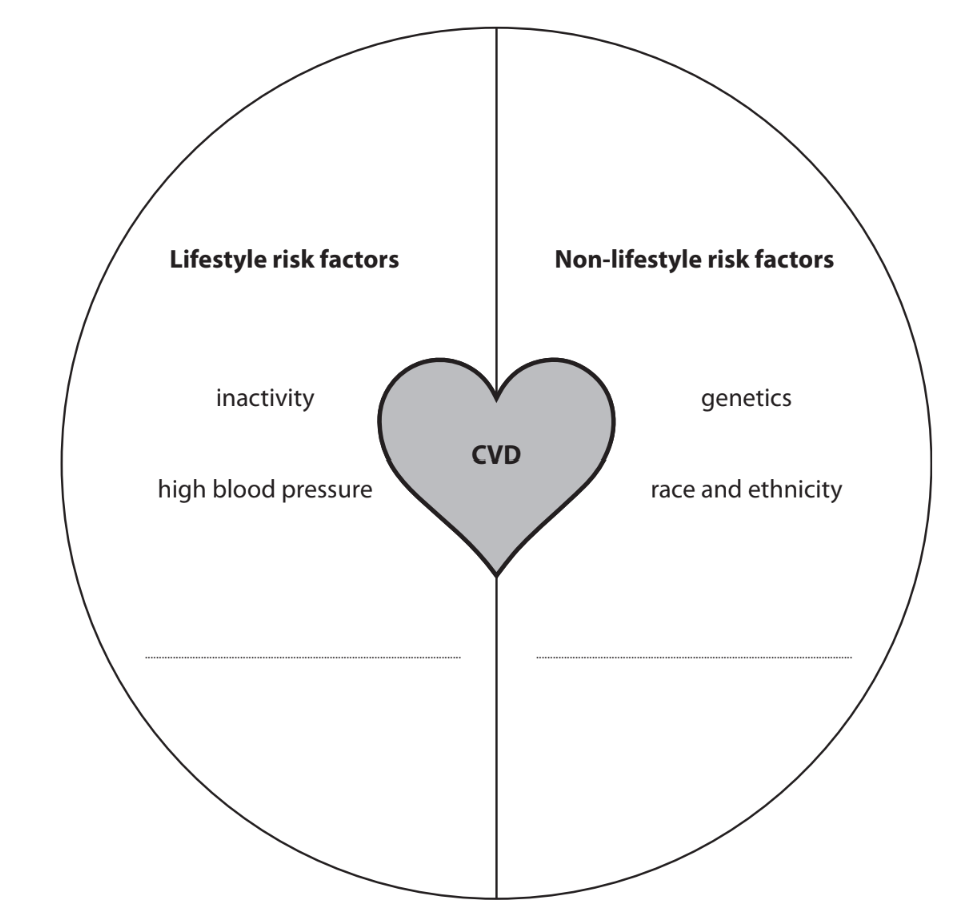

### 7((b)) — 2 marks — command: describe — structured — from paper Jan 2021 · WBI11/01
The graph shows the effect of exercise on the relative risk of death from CVD.

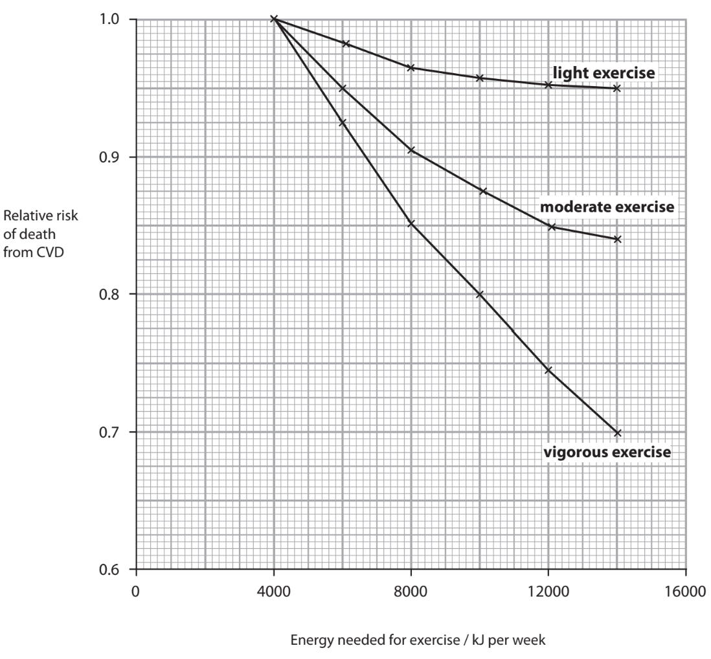

Describe the conclusions that can be made from the information shown in this graph.

### 7((c)) — 6 marks — command: multiple — structured — from paper Jan 2021 · WBI11/01
Dietary antioxidants may reduce the risk of CVD.

(i) Explain how dietary antioxidants reduce the risk of CVD.

**(3)**

(ii) Devise a study to confirm that antioxidants reduce the risk of CVD.

**(3)**

### 7((d)) — 6 marks — command: explain — structured — from paper Jan 2021 · WBI11/01
The coronary artery may become completely blocked in people with CVD.

The graph shows how the energy released by heart muscle cells changes after the coronary artery becomes completely blocked.

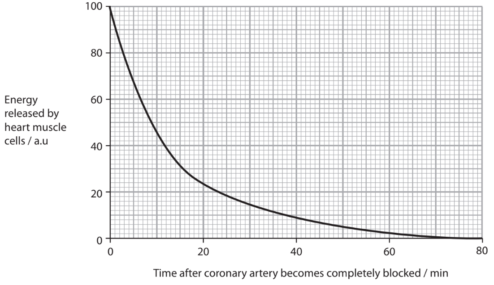

The heart muscle cells no longer contract 8 minutes after the coronary artery becomes completely blocked.

The heart muscle cells begin to die 20 minutes after the coronary artery becomes completely blocked.

Explain the effects on the heart function after the coronary artery becomes completely blocked.

Use the information shown in the graph and your own knowledge to support your answer.

## Q2 — medium — 11 marks · exam-questions

### 6() — 8 marks — command: multiple — structured — from paper June 2021 · WBI11/01
Obesity increases the risk of cardiovascular disease (CVD).

Body mass index (BMI), waist-to-hip ratio (WHR) and skinfold thickness are indicators of obesity.

The table shows some measurements taken from two females, female **J **and female **K**.

| **Female** | **Height / cm** | **Mass / kg** | **Waist / cm** | **Hips / cm** | **BMI** | **WHR** |
|---|---|---|---|---|---|---|
| J | 155 | 59.1 | 80 | 100 | 25 | 0.80 |
| K | 155 |   |   | 125 | 36 | 0.80 |

(i) Calculate the waist size of female** K**.

**(1)**

(ii) The formula for calculating BMI is:

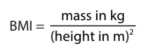

Calculate the mass of female** K**, using the data in the table.

**(3)**

(iii) Comment on the risk of developing CVD in these two women.

**(2)**

(iv) The diagram shows how the waist and hip measurements should be taken, using a tape measure.

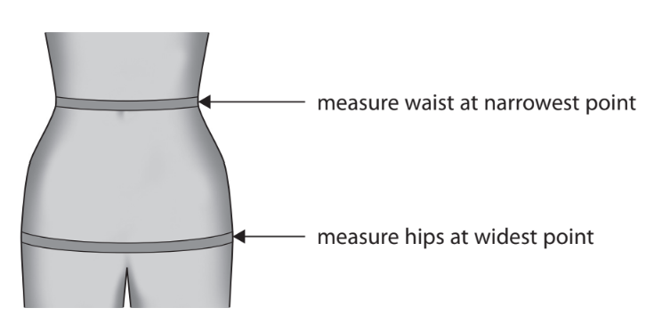

Explain how the way a person takes these measurements could produce an underestimate of their risk of CVD.

**(2)**

### 6() — 3 marks — command: multiple — structured — from paper June 2021 · WBI11/01
The diagram shows how a skinfold thickness measurement is taken over the triceps muscle at the back of the arm.

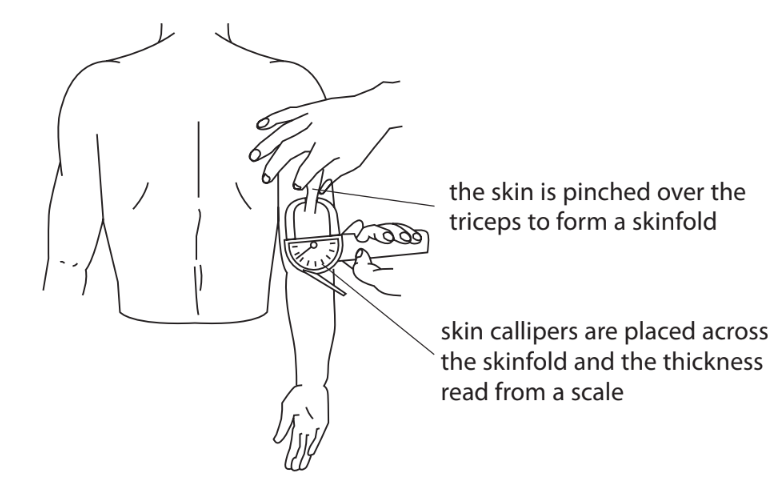

Skinfold thickness measures the thickness of the layer of fat under the skin.

Measurements are taken from several sites on the body.

The table shows the skinfold thickness at four sites on a 42-year-old female.

| **Site** | **Skinfold thickness / a.u.** |
|---|---|
| over the biceps at the front of the arm | 0.63 |
| over the triceps at the back of the arm | 0.82 |
| under the shoulder blade at the back of the neck | 0.65 |
| above the hip bone at the side of the body | 0.82 |

(i) Suggest **two** reasons why the skinfold thickness values are different at each site on the body.

Assume that the skin callipers have been used correctly.

**(2)**

(ii) The table shows a body fat interpretation chart.

The values in the table are the means of the four skinfold thickness measurements.

| **Age** | **Level of body fat** |   |   |   |
|---|---|---|---|---|
| **Low** | **Moderate** | **High** | **Very high** |   |
| 20 to 29 | <0.71 | 0.71 to 0.77 | 0.78 to 0.82 | >0.82 |
| 30 to 39 | <0.72 | 0.72 to 0.78 | 0.79 to 0.84 | >0.84 |
| 40 to 49 | <0.73 | 0.73 to 0.79 | 0.80 to 0.87 | >0.87 |
| 50 to 59 | <0.74 | 0.74 to 0.81 | 0.82 to 0.88 | >0.88 |

Determine the level of body fat of this female.

**(1)**

## Q3 — medium — 12 marks · exam-questions

### 7((a)) — 6 marks — command: explain — structured — from paper Oct/Nov 2021 · WBI11/01
A number of factors affect the risk of a person developing heart disease.

One factor affecting this risk is the level of high-density lipoprotein (HDL) in the blood.

The graph shows the effects of HDL levels and low-density lipoprotein (LDL) levels in the blood on the risk of men developing heart disease.

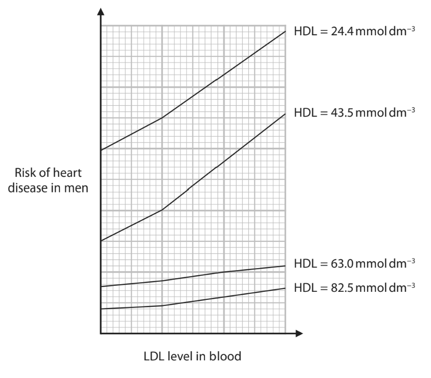

For men, a blood HDL level greater than 40mgdm−3 is thought to be optimal.

Explain why a man with a blood HDL level greater than 40mgdm−3 may still have a high risk of developing heart disease.

Use the information in the graph and your own knowledge to support your answer.

### 7() — 6 marks — command: multiple — structured — from paper Oct/Nov 2021 · WBI11/01
Very high levels of cholesterol in the blood can alter the structure of HDL. This altered HDL is less effective in reducing the risk of heart disease.

The diagram shows the structure of HDL in blood with a low level of cholesterol and altered HDL in blood with a high level of cholesterol.

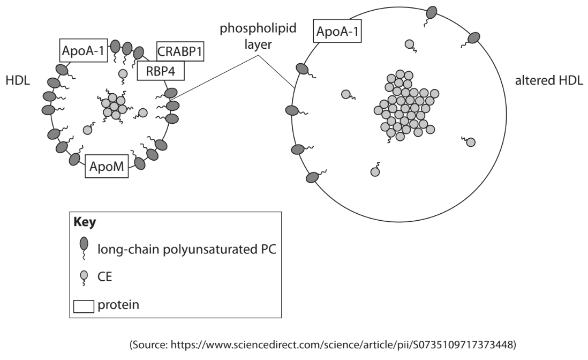

(i) Compare and contrast the structure of HDL with altered HDL.

**(3)**

(ii) The antioxidant properties of altered HDL are reduced.

Explain the effect that this has on reducing the risk of heart disease.

**(3)**

## Q4 — medium — 10 marks · exam-questions

### 5((a)) — 1 mark — command: name — structured — from paper Oct/Nov 2020 · WBI11/01
Obesity increases the risk of cardiovascular disease (CVD).

One way to reduce obesity is to lose weight by changing eating habits.

Name **two** obesity indicators used by scientists.

### 5((b)) — 4 marks — command: multiple — structured — from paper Oct/Nov 2020 · WBI11/01
Glucomannan is a dietary supplement claimed to aid weight loss.

Glucomannan is a branched polysaccharide similar in structure to amylopectin.

(i) Which glycosidic bonds are responsible for the branching in glucomannan?

**(1)**

| ☐ | **A** | 1‐4 only |
|---|---|---|
| ☐ | **B** | 1‐6 only |
| ☐ | **C** | both 1‐4 and 1‐6 |
| ☐ | **D** | neither 1‐4 nor 1‐6 |

(ii) In the presence of water, glucomannan swells to form a semi‐solid gel.

The diagram shows a stomach with glucomannan present and a stomach without glucomannan.

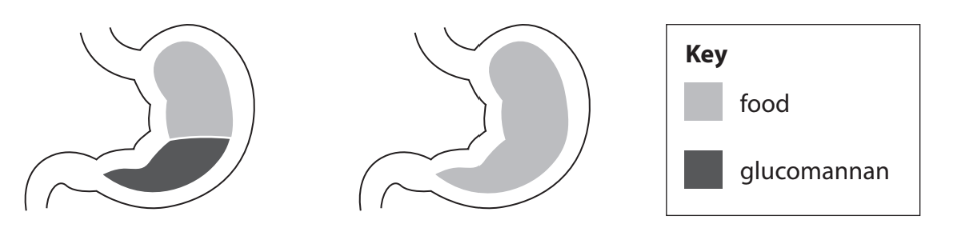

Suggest how glucomannan aids weight loss.

**(1)**

(iii) If glucomannan could be digested it would cause a gain in weight.

Explain why glucomannan could cause a gain in weight.

**(2)**

### 5((c)) — 5 marks — command: multiple — structured — from paper Oct/Nov 2020 · WBI11/01
A study compared weight loss in two groups of women.

One group of women had a low‐fat diet and the other group of women had a very low‐carbohydrate diet.

(i) The table shows the results of this study.

| **Number of weeks** **on the diet** | **Mean body mass of the group of women / kg** |   |
|---|---|---|
| **Group on the** **low‐fat diet** | **Group on the very** **low‐carbohydrate diet** |   |
| 0 | 92.5 | 91.1 |
| 2 | 90.6 | 88.3 |
| 4 | 89.9 | 87.5 |
| 6 | 89.0 | 85.6 |
| 8 | 88.8 | 84.5 |
| 10 | 88.3 | 84.1 |
| 12 | 88.2 | 83.0 |

Many studies claim that a low‐carbohydrate diet can result in two to three times as much weight loss as a low‐fat diet.

Determine the extent to which this study supports this claim.

**(3)**

(ii) Very low‐carbohydrate diets may increase cardiovascular risk factors.

Give** two** factors, other than weight loss, that should have been monitored in this study.

**(2)**

## Q5 — medium — 15 marks · exam-questions

### 8((a)) — 3 marks — command: contrast — structured — from paper Oct/Nov 2020 · WBI11/01
Low‐density lipoproteins (LDLs) transport lipids around the body in the blood.

Low‐density lipoproteins can result in the development of atherosclerosis.

They can be absorbed into the endothelial cells lining arteries and broken down by free radicals.

The diagram shows a low‐density lipoprotein containing cholesterol.

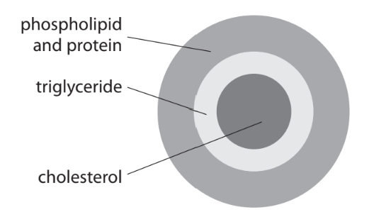

Compare and contrast the structure of a triglyceride and a phospholipid.

### 8((b)) — 3 marks — command: explain — structured — from paper Oct/Nov 2020 · WBI11/01
Explain why the properties of LDLs enable cholesterol to be transported in the blood.

### 8((c)) — 9 marks — command: multiple — structured — from paper Oct/Nov 2020 · WBI11/01
The diameters of LDLs range from 19nm to 24 nm.

The table shows some information about LDLs.

| **Diameter of LDL** **/ nm** | **Volume of LDL** **/ nm****3** | **Volume of cholesterol** **/ nm****3** | **Ratio of LDL volume** **to cholesterol volume** |
|---|---|---|---|
| 19 | 3591 | 523 | 7:1 |
| 24 |   | 523 |   |

(i) Complete the table by calculating the volume of LDL and the ratio of LDL volume to cholesterol volume. 
Use the formula $v=\frac{4}{3}πr^{3}$

**(3)**

(ii) The graph shows the relationship between LDLs, high‐density lipoproteins (HDLs) and the risk of CVD.

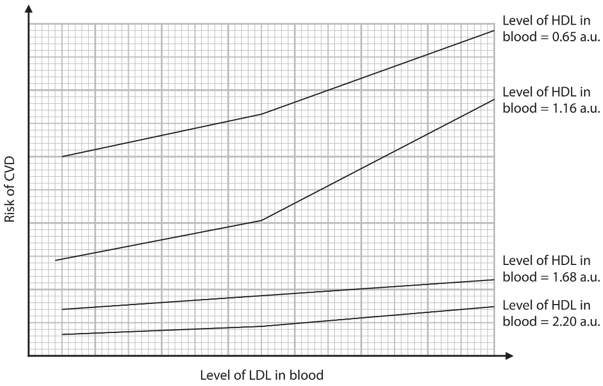

Explain why measuring only the level of LDL in the blood is **not** a reliable predictor of CVD.

Use the graph, all the information in this question and your own knowledge to support your answer.

**(6)**

## Q6 — medium — 11 marks · exam-questions

### 7((a)) — 3 marks — command: multiple — structured — from paper Jan 2022 · WBI11/01
The risk of developing cardiovascular disease (CVD) is affected by two groups of factors:

- Lifestyle factors that can be changed

  - Non‐lifestyle factors that cannot be changed.

Methods to reduce the risk of developing CVD include drug treatments and lifestyle changes.

(i) Which row of the table identifies one lifestyle factor and one non‐lifestyle factor?

**(1)**

|   | **Lifestyle factor** | **Non‐lifestyle factor** |
|---|---|---|
| `equation`☐ **A** | body mass index (BMI) | age |
| ☐ **B** | gender | high alcohol intake |
| ☐ **C** | genetics | high blood pressure |
| ☐ **D** | high blood cholesterol | inactivity |

(ii) Explain why a person might have to take several types of drugs to reduce the risk of CVD.

**(2)**

### 7((b)) — 8 marks — command: explain — structured — from paper Jan 2022 · WBI11/01
Nutritional studies have shown that dietary antioxidants can reduce the risk of CVD.

(i) Explain why antioxidants in the diet reduce the risk of CVD.

**(3)**

(ii) Some studies do not assess the nutritional quality of the diet of the participants.

Explain why the results of these studies have to be treated with caution.

**(3)**

(iii) Explain why changes in diet, other than antioxidants, can reduce the risk of CVD.

**(2)**
