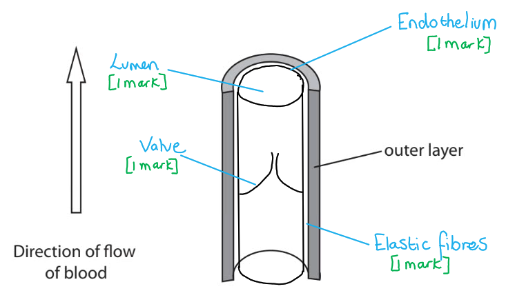
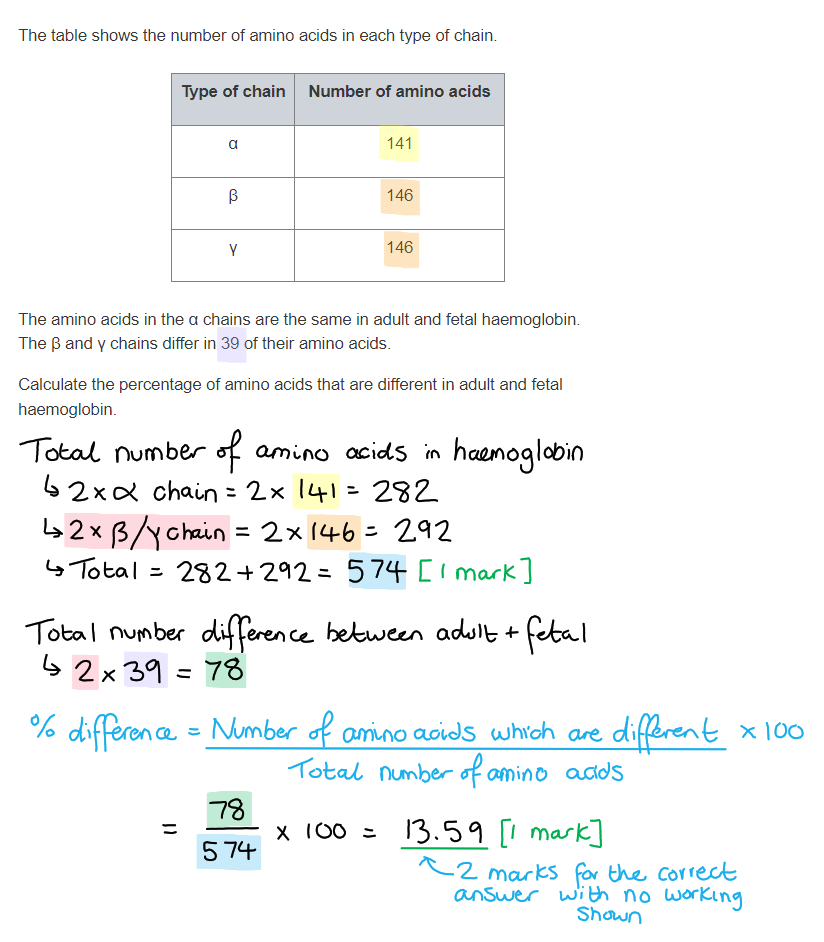
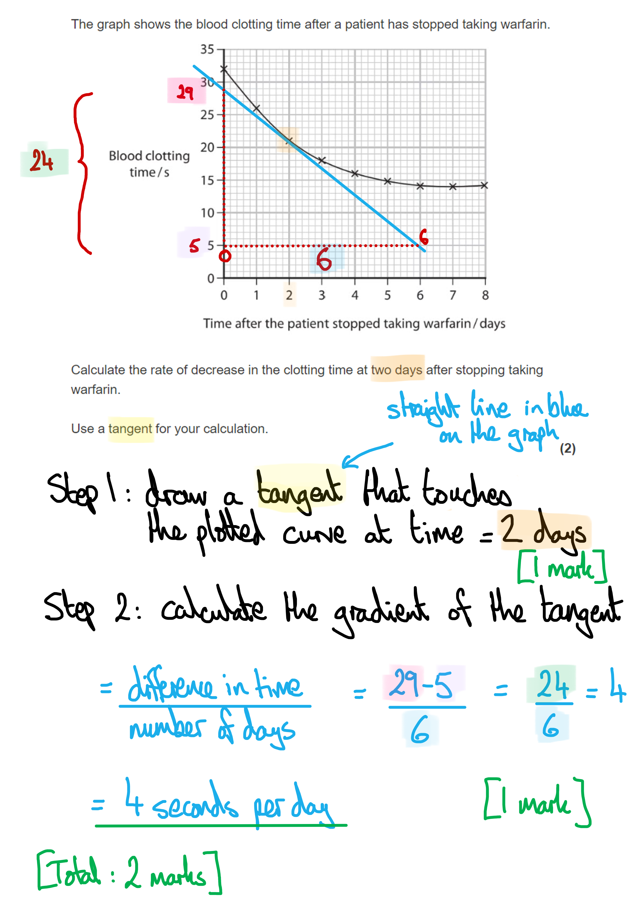
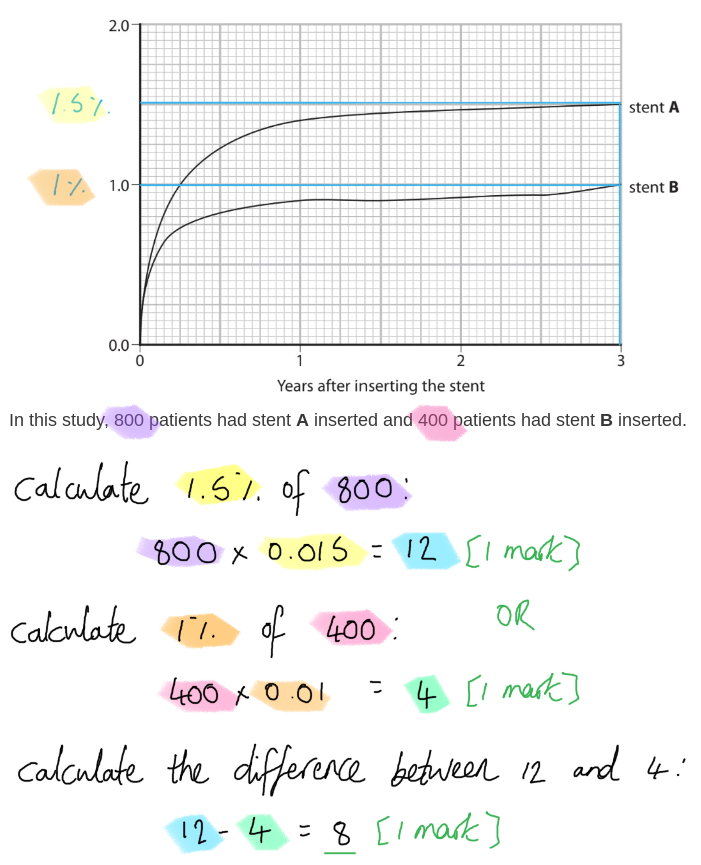
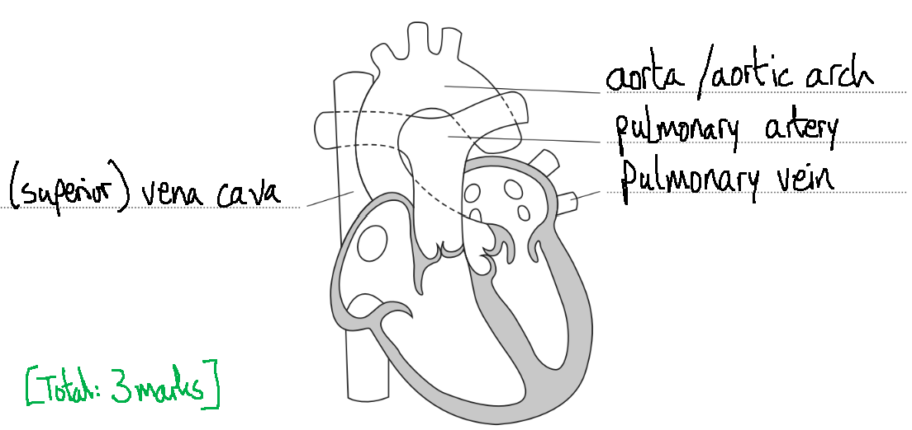
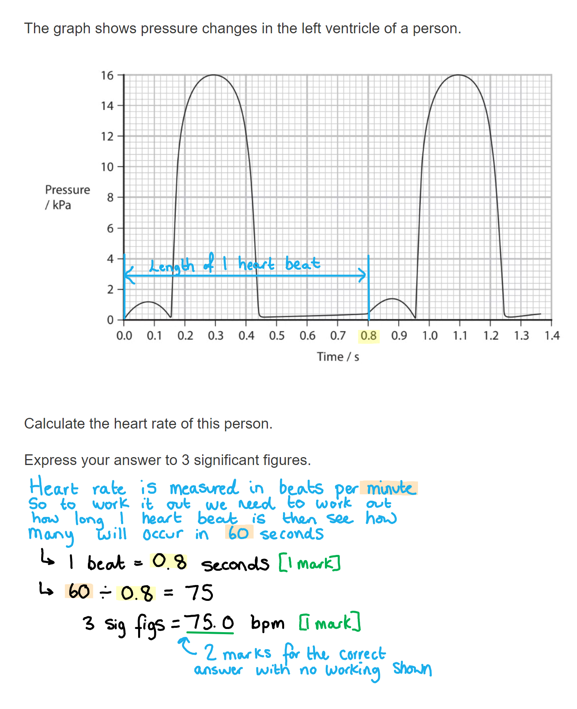

# Mark Schemes — The Circulatory System
**1. Molecules, Transport & Health** · Edexcel International A Level (IAL) Biology (YBI11)

## Q1 — medium — 7 marks · exam-questions

### 2((a)) — 2 marks
The volume of blood that passes through this heart in 24 hours is...

- Number of minutes in one day calculated **OR **volume in one hour calculated **OR** 7200; **[1 mark]**
- 7.2 x 103 litres; **[1 mark]**

*Full marks awarded for the correct answer in the absence of additional calculations. *

**[Total: 2 marks]**

> *The calculations for this question can  be carried out as follows:*

- *Calculate the number of minutes in 24 hours:*

  - *60 x 24 = 1440 minutes*
- *Calculate the volume of blood that flows through the heart in 24 hours:*

  - *5 x 1440 = 7200 litres*
- *Convert to standard form:*

  - *7200 =* **7.2 x 10****3** **litres**

> *OR*

- *Calculate the volume of blood that flows through the heart per hour:*

  - *5 x 60 = 300*
- *Calculate the volume of blood that flows through the heart per 24 hours:*

  - *300 x 24 = 7200*
- *Convert to standard form:*

  - *7200 =* **7.2 x 10****3** **litres**

> *Always remember to check the instructions in the question about how to present your final answer in a numerical question. Many students will lose a mark by failing to express their answer in standard form and just leaving the answer as 7200.*

### 2((b)) — 2 marks
A comparison between the structure of the aorta and the structure of the pulmonary artery is...

**An**y **one **of the following similarities**:**

- Both have walls containing muscle cells / elastic fibres / an endothelial cell lining / an (outer) collagen layer; **[1 mark]**
- Both have a valve (at the point they leave the heart); **[1 mark]**

Plus any **one **of the following differences**:**

- Aorta has a lumen with a wider diameter / thicker wall / more elastic tissue / more muscle tissue / more collagen; **[1 mark] **
- Aorta has branches to more organs; **[1 mark]**

**[Total: 2 marks]**

> *Because this is a compare and contrast question, make sure to include both similarities **and **differences between the vessels. Any answer that has just similarities or just differences can only gain a maximum of one mark. *

> *The question specifically asks for a comparison of the **structure**, so any description of function, such as where the blood is being carried to, cannot gain marks. *

### 2((c)) — 3 marks
The completed diagram is as follows...

- Correct drawings onto the diagram (see model answer);** [1 mark]**

Plus any **two **of the following labels**:**

- Endothelial cell / *tunica intima* lining labelled;** [1 mark]**
- Valve labelled;** [1 mark]**
- (Smooth) muscle / elastic fibres / *tunica media* labelled;** [1 mark]**
- Lumen labelled;** [1 mark]**

**[Total: 3 marks]**

> *Your valves must to drawn opening in the correct direction in order to get the mark (see model answer). This should be obvious because the direction of flow of blood is indicated in the diagram.  *

## Q2 — medium — 7 marks · exam-questions

### 4((a)) — 3 marks
(i) The role of the structure labelled** P **is...

- To bind to an oxygen (molecule)/O2; **[1 mark]**

(ii) The properties of amino acids located on the outer surface of the haemoglobin, for example at position **Q **are...

- Must be polar/hydrophilic **OR** have R groups that are polar/hydrophilic; **[1 mark]**
- So that the haemoglobin/protein can dissolve in (red blood cell) cytoplasm/is soluble in water; **[1 mark]**

**[Total: 3 marks]**

> *i) You can use lots of different words to convey the idea of the the haem binding to the oxygen, such as join to, or carry the oxygen. One important difference though is that you can't say that the haem **stores** oxygen, because this is incorrect, it just transports the oxygen from one location to another. *

> *ii) Remember that this is a universal feature of globular proteins that they are soluble in water because of the hydrophobic and hydrophilic interactions of the R groups of the amino acids, meaning that the hydrophobic R groups face inwards and the hydrophilic R groups face outwards into the solution. *

### 4((b)) — 4 marks
(i) The oxygen dissociation curve of adult haemoglobin is different from that of fetal haemoglobin because...

Any **two **of the following**:**

- Oxygen dissociation curve for maternal/adult haemoglobin is shifted to the right of curve for fetal haemoglobin; **[1 mark]**
- Because oxygen needs to diffuse from maternal/adult blood into fetal blood; **[1 mark]**
- Therefore fetal haemoglobin needs to have a higher affinity for oxygen; **[1 mark]**

(ii) The percentage of amino acids that are different in adult and fetal haemoglobin are...

- Total number of amino acids in haemoglobin calculated = 574; **[1 mark]**
- Percentage of amino acids that are different calculated = 14 / 13.6 / 13.59; **[1 mark]**

*Full marks awarded for the correct answers only*

**[Total: 4 marks]**

## Q3 — medium — 6 marks · exam-questions

### 2() — 4 marks
(i) The most appropriate word or words to complete the passage are as follows:

- Thromboplastin / (**NOT **calcium ions/Ca2+); **[1 mark]**
- Active site; **[1 mark]**
- Platelets / (red / white) blood cells / erythrocytes (**NOT** clot/scab); **[1 mark]**

| Warfarin is used to treat people with blood clots as it lowers the number of clotting factors in the blood.  One clotting factor in blood is prothrombin.  Prothrombin is converted to the enzyme thrombin by **thromboplastin**  The **active site** of thrombin binds to fibrinogen and as a result a mesh of fibres and **platelets** is formed. |
|---|

> *Be careful with your grammar here for the last mark scheme point.  Also, if you refer to a blood clot at the end, you are repeating what's in the stem of the question, so the examiners will not award you a mark for doing that. So that last mark scheme point is driving at what **makes up** a blood clot, ie. platelets and blood cells bound up with fibrinogen. *

(ii) The correct answer is **A** because...

**warfarin is an anticoagulant, which means it slows / prevents blood from clotting; it is sometimes referred to colloquially as a 'blood thinner'**

> *B** is incorrect because antihypertensives are used to lower blood pressure*

> *C** is incorrect because platelet inhibitors affect platelets*

> *D** is incorrect because statins lower blood cholesterol*

**[Total: 4 marks]**

### 2((b)) — 2 marks
The rate of decrease in the clotting time at two days after stopping taking warfarin is calculated as follows:

- Tangent drawn at 2 days; **[1 mark]**
- Correct answer up to 2 decimal places **AND** units

  - 2.7 - 4.5 seconds per day / sday-1; **[1 mark]**

*Tangent must be touching the curve at 2 days.*

*Accept an answer with or without a minus sign as it's a calculation of a rate of decrease.*

**[Total: 2 marks]**

## Q4 — medium — 9 marks · exam-questions

### 3((a)) — 3 marks
A stent is used in the treatment of atherosclerosis in a coronary artery because...

- To widen / increase the diameter of the (coronary) artery / vessel; **[1 mark]**
- So that more blood can flow to the heart cells / muscle; **[1 mark]**
- So that respiration can take place (in the heart muscle cells) **OR** so that heart muscle can contract; **[1 mark]**

***Ignore**** references to making the arteries larger or increasing their area for marking point 1.*

**[Total: 3 marks]**

> *While you may not know very much about the use of stents specifically, the diagram in the question provides you with enough information to work out how stents function, and you should be well aware of the dangers of atherosclerosis. You should therefore be able to explain that the role of a stent is to widen the blood vessel, increasing blood flow to the heart muscle cells and allowing respiration to continue. This produces ATP which allows the heart muscle to continue to contract.*

### 3() — 6 marks
(i) The difference in the number of patients who developed stent thrombosis three years after inserting the stent is...

- 1.5 % of 800 = 12 **OR** 1.0 % of 400 = 4; **[1 mark]**
- (12 - 4 =) 8; **[1 mark]**

*Full marks can be awarded for the correct answer in the absence of other calculations.*

> *The difference in the number of patients who developed stent thrombosis three years after inserting the stent can be calculated as follows:*

(ii) The formation of a blood clot in the coronary artery could cause the death of the patient as follows...

Any **one** of the following**:**

- (The blood clot would) block the (coronary) artery/vessel **SO** causing a stroke / the brain would not get any oxygen; **[1 mark]**
- The heart muscle would not receive any oxygen **SO** causing a heart attack; **[1 mark]**

(iii) The correct answer is **D** because...

**Thrombin is an enzyme that catalyses the conversion of fibrinogen to fibrin.**

**Thromboplastin functions as an enzyme to catalyse the conversion of prothrombin to thrombin.**

> *Prothrombin is an **inactive** form of thrombin.*

(iv) The correct answer is **C** because...

**Fibrinogen is the soluble form of fibrin.**

**Thromboplastin is soluble in blood plasma.**

> *Fibrin is the insoluble protein responsible for forming the protein mesh that traps platelets and red blood cells, forming a clot.*

(v) One type of drug that could be used in stent** **B is...

- Antigoagulants / platelet inhibitors; **[1 mark]**

***Accept**** named examples such as heparin or warfarin.*

***Reject**** antihypertensives and statins.*

**[Total: 6 marks]**

> *(v) Stent thrombosis is not caused by high blood pressure or high blood cholesterol, but by stimulation of the blood clotting process. This means that antihypertensives and statins will not be effective against this condition.*

## Q5 — medium — 9 marks · exam-questions

### 3((a)) — 3 marks
The labels of the four major blood vessels should be as below:

- (Superior) vena cava / (**NOT** inferior)
- Aorta / aortic arch
- Pulmonary artery
- Pulmonary vein

All 4 correct = **[3 marks]** 
3 correct = **[2 marks]** 1
 or 2 correct = **[1 mark]**

**[Total: 3 marks]**

### 3((b)) — 3 marks
The correctly-completed table is as follows:

**[1 mark] for each correctly-placed cross**

| **Structures** | **Found in** **arteries only** | **Found in** **capillaries only** | **Found in** **veins only** | **Found in** **arteries,** **capillaries and** **veins** |
|---|---|---|---|---|
| Lining of endothelial cells |   |   |   | **✘** |
| Valves along the length of the blood vessel |   |   | **✘** |   |
| Wall only one cell thick |   | **✘** |   |   |

**[Total: 3 marks]**

### 3((c)) — 3 marks
The changes in the velocity of the blood as it flows from an artery to a vein are as follows:

- The velocity / (blood) flow decreases as blood flows through the arterioles / from arteries to capillaries; **[1 mark]**
- The velocity / (blood) flow is low as blood flows through the capillaries; **[1 mark]**
- The velocity / (blood) flow increases as blood flows through the venules / from capillaries to veins; **[1 mark]**

*Ignore a description of what happens in the arteries and veins*

**[Total: 3 marks]**

> *You may risk losing marks marks through poor use of English, through describing the flow of blood through the wrong regions or trying to explain the data in terms of changes in blood pressure. Make sure you always refer to the parameter set out in the question stem, which is **velocity of blood**. *

## Q6 — medium — 7 marks · exam-questions

### 2((a)) — 2 marks
(i) The correct answer is **B **because...

**The pulmonary artery takes blood away from the right side of the heart to the lungs.**

> *A** is incorrect because the aorta takes blood away from the left hand side of the heart.*

> *C** is incorrect because pulmonary vein returns blood to the left hand side of the heart.*

> *D** is incorrect because the vena cava returns blood to the right atrium.*

(ii) The correct answer is **A **because...

**Final answer:** **Stage ****F**** is ventricular systole (when the ventricles contract), so the stage before is atrial systole (when the atria contract) and the stage after is cardiac diastole (when the cardiac muscle relaxes). **

**[Total: 2 marks]**

### 2((b)) — 5 marks
(i) The heart rate of this person is...

- Values read from the graph and subtracted to give the time for one heart beat = 0.8 / any pair of values that give 0.8 when subtracted; **[1 mark]**
- 75.0 (**DO NOT ACCEPT **75); **[1 mark]**

*Full marks awarded for the correct answer only.*

(ii) The shape and position of this line can be described as...

Any **three **of the following**:**

- Graph will be the same/similar in shape/position; **[1 mark]**
- Because the left hand side and right hand side beat/contract simultaneously; **[1 mark]**
- The peaks will be lower; **[1 mark]**
- Because pressure in the right hand side is lower as blood is only pumped to <u>lungs</u> / to prevent damage to <u>alveoli</u> **OR **because right ventricle has less muscle/thinner walls as blood is only pumped to <u>lungs</u>; **[1 mark]**

**[Total: 5 marks]**

> *Remember the two ventricles have different thicknesses of the cardiac muscle walls to allow the blood to be pumped at different pressures; this is due to the different distances the blood has to travel around the body from each location. The events of the cardiac cycle are always occurring simultaneously on both sides of the heart. *

## Q7 — medium — 12 marks · exam-questions

### 7((a)) — 3 marks
The role of prothrombin in the blood clotting process is...

Any **one **of the following:

- (Prothrombin is) present in the blood (all the time); **[1 mark]**
- (Prothrombin is) a precursor of the clotting process **OR** the inactive form of thrombin / the inactive enzyme / an inactive plasma protein; **[1 mark]**

**AND**

Any **two** of the following:

- It is needed to make thrombin; **[1 mark]**
- (Thrombin) is an enzyme/catalyst; **[1 mark]**
- (Thrombin catalyses the reaction during which) fibrinogen is converted into fibrin; **[1 mark]**

***Ignore**** references to the role of thromboplastin and Ca**2+** ions*

**[Total: 3 marks]**

> *The most difficult marking point is the first one, which identifies prothrombin as the precursor or an inactive form of thrombin.*

### 7((b)) — 1 marks
Warfarin as a treatment functions as **A**.

**Anticoagulants are drugs that prevent blood from clotting. Warfarin inhibits production of prothrombin (see part (a)) and blood cannot clot without the action of prothrombin.**

> *B is incorrect because antihypertensives treat high blood pressure.*

> *C is incorrect because platelet inhibitors inhibit platelet function.*

> *D is incorrect because statins treat high blood cholesterol levels.*

**[Total: 1 mark]**

### 7((c)) — 4 marks
(i) Warfarin inhibits the synthesis of prothrombin as follows...

Any **two **of the following:

- Warfarin and vitamin K have a similar structure **OR** warfarin and vitamin K have rings / double bond oxygen; **[1 mark]**
- Warfarin binds to / blocks the enzyme/vitamin K epoxide reductase/VKOR; **[1 mark]**
- (As a result of warfarin binding to enzyme) less / no vitamin K is reduced; **[1 mark]**

***Allow**** warfarin is a competitive inhibitor of VKOR for marking point 2.*

***Reject ****references to warfarin as a non-competitive inhibitor / binding to vitamin K for marking point 2.*

(ii) People taking warfarin have to avoid eating foods that contain a high concentration of vitamin K because...

- An increase in vitamin K would compete with warfarin for the active site (of vitamin K epoxide reductase) / there will be more enzyme-substrate / E-S complexes; **[1 mark]**
- Some / more vitamin K will be reduced (if vitamin K binds to enzyme);** [1 mark]**

**[Total: 4 marks]**

> *(i) The molecular structures are printed for a reason, and that is to ensure that you spot similarities in the molecules, and by extension, how the molecules might interact with each other.*

> *Note that you do not need to be aware of the terms competitive and non-competitive inhibition (of enzymes). *

> *(ii) Success in this question requires you to have already spotted the molecular interaction going on from part (c) (i) - the inhibitor binds to the enzyme's active site. *

### 7((d)) — 4 marks
This study should be designed, so that the effectiveness of these two drugs can be compared, as follows...

Any **four** of the following**:**

- Large groups of people / 20+ people per group; **[1 mark]**
- (The sample size is large) to ensure reproducibility/repeatability/reliability; **[1 mark]**
- People in both groups consume the same <u>mass</u> / <u>volume</u> / <u>concentration</u> of vitamin K; **[1 mark]**
- People in both groups consume the same concentration of drugs; **[1 mark]**
- Other (named) variables are controlled for <u>validity</u>, e.g. sex, age, diet, level of activity, alcohol intake; **[1 mark]**

***Ignore**** 'accurate / precise / valid' for reproducible in marking point 2.*

***Ignore**** 'amount' of vitamin K for marking point 3.*

***Ignore**** references to control of variables in relation to accuracy / precision / reproducibility / repeatability / reliability in marking point 5.*

**[Total: 4 marks]**

> *Avoid using the word 'amount' in your answers wherever possible; you will not gain the mark for using that word! There is almost always a better term such as mass, volume, concentration, number.*

## Q8 — medium — 11 marks · exam-questions

### 5((a)) — 5 marks
(i) The structure of collagen is...

Any **three **of the following:

- A fibrous protein; **[1 mark]**
- (Protein) composed of three polypeptide chains/three-stranded/triple <u>helix</u>; **[1 mark]**
- Held by hydrogen bonds (between the chains); **[1 mark]**
- Details of the chains eg. every third amino acid is a glycine, repeating sequences of amino acids, high content of glycine / proline / hydroxyproline; **[1 mark]**

(ii) The role of collagen in the wall of the aorta is...

- Gives (the wall) (tensile) strength; **[1 mark]**
- So that the aorta does not get damaged by / can withstand pressure (of the blood leaving the heart); **[1 mark]**

**[Total: 5 marks]**

### 5((b)) — 6 marks
The effect of age and sex on the types of collagen found in the wall of the aorta and aortic stiffness is...

> *This is a level-marked question, meaning that this is is marked **according to the levels table**. The indicative content points below the table are **not** to be used in the usual '**one point one mark**' way, but should be used together with the levels table to determine the number of marks which should be awarded. *

| **Level 1 ** | **[1 mark]** - Description made from one graph (D) |
|---|---|
| **[2 marks] - Descriptions made from two graphs (D)** |   |
| **Level 2 ** | **[3 marks]** - Level 1 answer plus one conclusion made (C) |
| **[4 marks] - Level 1 answer plus two conclusions made (C)** |   |
| **Level 3** | **[5 marks]** - Two conclusions and comments on the other two graphs |
| **[6 marks] **- Three conclusions that includes the asterisked conclusion (C*) and comments on the other two graphs |   |

**(D) Description** = Comparison of one variable. 
**(C) Conclusion** = Summary statement that includes both age and sex, interpretation of error bar and significance of data – not reliability, links between 2 graphs.

*Indicative content:*

Graph 1

- Older male monkeys have more stiffness than younger males (D)
- Older female monkeys have more stiffness than younger females (D)
- Older males have more stiffness than older females (D)
- Probably significant as error bars do not overlap (C)
- Not much difference in stiffness between younger males and females (D)
- As error bars overlap (C)
- Age increases aortic stiffness in both males and females (C)
- Age has a greater effect on aortic stiffness in males than females (C)

Graph 2

- Density of collagen decreases slightly with age (D)
- Males of all ages have (slightly) more collagen that females (C)
- Probably not significant as error bars overlap (C)
- Neither age nor sex affects density of collagen (C)
- Changes in stiffness do not appear to be related to the density of collagen (C)

Graph 3

- Higher type 1 in younger monkeys than older ones (D)
- More type 1 in females than males at each age (D)
- No error bars shown to judge significance (C)

Graph 4

- More type 8 in older male monkeys (D)
- May not be a difference in type 8 between older and younger females (D)
- No error bars to judge significance (C)
- The type of collagen appears to determine stiffness (C)
- Stiffness associated with decrease in type 1 and increase in type 8 (C*)

**[Total: 6 marks]**

> *If there are error bars in a graph, **always** make sure to comment on them, and you can even comment when they're not there! This is a really easy way to elevate your answer and gain marks. Remember when referring to error bars, they give you information about the **significance** of the data, **not** the **reliability**. *

## Q9 — medium — 10 marks · exam-questions

### 1() — 1 marks
**Correct answer: B** — high blood pressure damages the endothelium of coronary arteries, increasing the risk of atheroma formation

**Final answer:** **The correct answer is B.**

- High blood pressure damages the endothelium of coronary arteries, which triggers an inflammatory response and the accumulation of fatty deposits, increasing the risk of atheroma formation and coronary heart disease

**A **is incorrect because high blood pressure does not increase blood flow to the heart — it increases the pressure within vessels, and a heart attack results from reduced blood flow due to blockage, not increased flow.

**C** is incorrect because it is the coronary arteries, not veins, that are relevant to coronary heart disease; veins carry blood back to the heart at low pressure and are not sites of atheroma formation.

**D** is incorrect because increased capillary permeability causing fluid to leak into tissues describes a condition known as oedema, which is not the mechanism by which hypertension increases the risk of coronary heart disease.

### 2() — 4 marks
> **[mark-scheme]**
> (i) The semilunar valve opens at 0.15 s and closes at 0.4 s because:
> 
> - The SL/semilunar valve opens because pressure in the left ventricle rises above the pressure in the aorta **[1 mark]**
> - The SL/semilunar valve closes because the pressure in the left ventricle falls below the pressure in the aorta **[1 mark]**
> 
> (ii) The pressure changes in the aorta between 0.15s and 0.3 s can be explained as follows:
> 
> - Blood is forced into the aorta from the ventricles **SO** the volume of blood in the aorta increases **[1 mark]**
> 
> (iii) The pressure changes in the ventricle between 0.32 s and 0.55 s can be explained as follows:
> 
> - The left ventricle muscle walls relax / undergo (ventricular) diastole **[1 mark]**

> **[exam-tip]**
> "Explain" questions require you to give reasons, not just describe what you can see on the graph. For example, stating that ventricular pressure rises between 0.15 s and 0.3 s is a description — to gain the mark you must explain why this happens, for example by referring to ventricular contraction during systole. Make sure you read the time points carefully and focus your answer on the specific period stated in the question.

### 3() — 2 marks
To calculate the resting heart rate:

- Rearrange the cardiac output equation to determine heart rate:

cardiac output = heart rate × stroke volume

heart rate = cardiac output ÷ stroke volume

- Read resting cardiac output from the graph

resting cardiac output = 5.4 dm³ min⁻¹

- Convert cardiac output to cm³ min⁻¹

5.4 dm³ min⁻¹ = 5400 cm³ min⁻¹

- Substitute values

= 5400 ÷ 75** [1 mark]**

= **72 **beats min⁻¹ **[1 mark]**

> **[mark-scheme]**
> Award full marks for the correct answer in the absence of working.

> **[exam-tip]**
> Make sure you pay close attention to the units given on the graph axes. Here, cardiac output is given in dm³ min⁻¹, but stroke volume is provided in cm³. You must convert so that both volumes share the same unit before dividing.

### 4() — 1 marks
- To calculate percentage increase:

percentage increase = (change ÷ original value) × 100

- Determine the change in cardiac output:

Cardiac output at rest = 5.4 dm3 min-1

Cardiac output at 8 km h-1 = 13 dm3 min-1

13 - 5.4 = 7.6

- Use the equation:

= (7.6 ÷ 5.4) × 100

**= ****141%**** **** [1 mark]**

> **[exam-tip]**
> Always read values from the graph or table as accurately as possible, and show your working clearly so that even if you misread a value slightly, you can still pick up method marks.

### 5() — 2 marks
> **[mark-scheme]**
> Any** two** from:
> 
> - Walls are one cell thick **SO** minimising the diffusion distance
> - Capillaries form dense networks / there are many capillaries throughout tissues **SO** maximising the surface area
> - There are gaps/fenestrations between endothelial cells **SO** allowing substances to pass through the capillary wall
> 
> **[2 marks]**

> **[exam-tip]**
> Make sure you link each structural feature to its function — simply stating a feature (e.g. "thin walls") without explaining how it aids exchange will not earn the mark. A good approach is to name the structural adaptation and then use a phrase such as "which means that..." or "SO..." to connect it to efficient exchange.
