# Exam Questions — The Circulatory System
**1. Molecules, Transport & Health** · Edexcel International A Level (IAL) Biology (YBI11)
> Source: [https://www.savemyexams.com/international-a-level/biology/edexcel/18/topic-questions/1-molecules-transport-and-health/the-circulatory-system/exam-questions/](https://www.savemyexams.com/international-a-level/biology/edexcel/18/topic-questions/1-molecules-transport-and-health/the-circulatory-system/exam-questions/) · 9 questions · total 78 marks

## Q1 — medium — 7 marks · exam-questions

### 2((a)) — 2 marks — command: calculate — structured — from paper Jan 2021 · WBI11/01
Many animals have a heart and circulatory system.

Five litres of blood can pass through a human heart each minute.

Calculate the volume of blood that passes through this heart in 24 hours. Give your answer in standard form.

### 2((b)) — 2 marks — command: contrast — structured — from paper Jan 2021 · WBI11/01
Blood leaves the heart through the arteries.

Compare and contrast the structure of the aorta with the structure of the pulmonary artery.

### 2((c)) — 3 marks — command: complete — structured — from paper Jan 2021 · WBI11/01
Blood returns to the heart through the veins.

The diagram shows the outline of a vein. The direction of flow of blood is also shown.

Complete and label the diagram to show the structures present in a vein

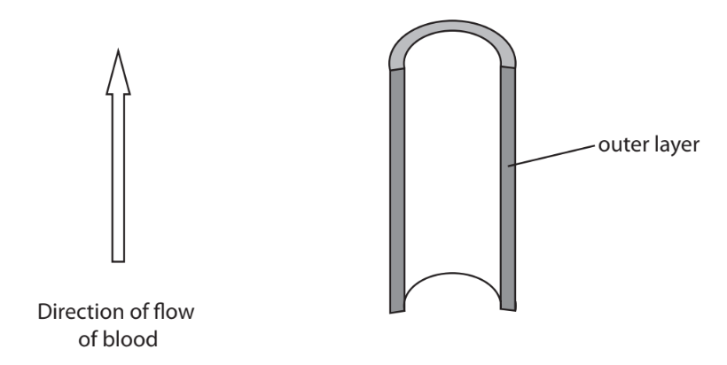

## Q2 — medium — 7 marks · exam-questions

### 4((a)) — 3 marks — command: multiple — structured — from paper Jan 2021 · WBI11/01
The role of haemoglobin is to transport oxygen and carbon dioxide in the blood.

The diagram shows the structure of adult haemoglobin

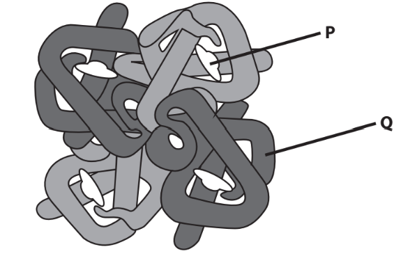

(i) State the role of the structure labelled** P.**

**(1)**

(ii) Explain the properties of amino acids located on the outer surface of the haemoglobin, for example at position **Q**.

**(2)**

### 4((b)) — 4 marks — command: multiple — structured — from paper Jan 2021 · WBI11/01
The graph shows the oxygen dissociation curves of adult and fetal haemoglobin.

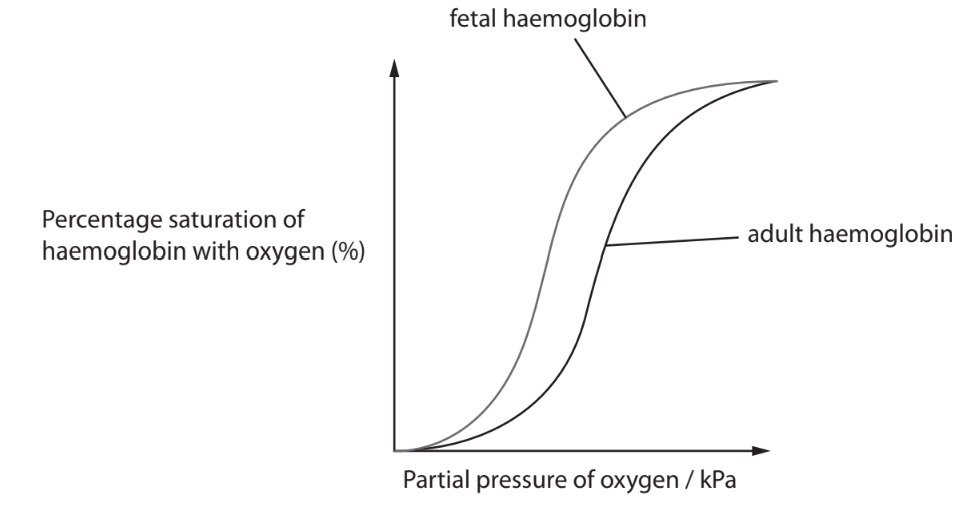

(ii) Explain why the oxygen dissociation curve of adult haemoglobin is different from that of fetal haemoglobin.

**(2)**

(iii) The structures of adult and fetal haemoglobin are different.

The diagram shows the structure of adult and fetal haemoglobin.

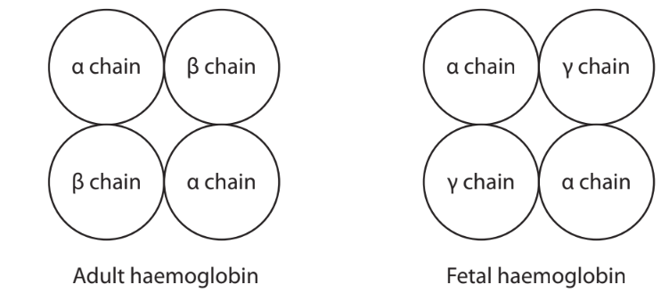

The table shows the number of amino acids in each type of chain.

| **Type of chain** | **Number of amino acids** |
|---|---|
| α | 141 |
| β | 146 |
| γ | 146 |

The amino acids in the α chains are the same in adult and fetal haemoglobin.

The β and γ chains differ in 39 of their amino acids.

Calculate the percentage of amino acids that are different in adult and fetal haemoglobin.

**(2)**

## Q3 — medium — 6 marks · exam-questions

### 2() — 4 marks — command: multiple — structured — from paper Oct/Nov 2021 · WBI11/01
Warfarin is a drug used to treat people who have a blood clot.

(i) Read through the following passage about warfarin.

Write on the dotted lines the most appropriate word or words to complete the passage.

**(3)**

Warfarin is used to treat people with blood clots as it lowers the number of clotting factors in the blood.

One clotting factor in blood is prothrombin.

Prothrombin is converted to the enzyme thrombin by ..........................................

The ............................................ of thrombin binds to fibrinogen and as a result a mesh of fibres and ................................................. is formed.

(ii) Which type of drug is warfarin?

**(1)**

☐ **A** an anticoagulant 
☐ **B** an antihypertensive 
☐ **C** a platelet inhibitor 
☐ **D** a statin

### 2((b)) — 2 marks — command: calculate — structured — from paper Oct/Nov 2021 · WBI11/01
The time taken for a blood sample to form a blood clot can be measured. This is called the clotting time. The graph shows the blood clotting time after a patient has stopped taking warfarin.

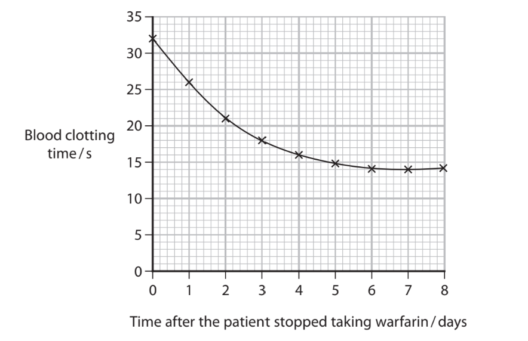

Calculate the rate of decrease in the clotting time at two days after stopping taking warfarin.

Use a tangent for your calculation.

## Q4 — medium — 9 marks · exam-questions

### 3((a)) — 3 marks — command: explain — structured — from paper June 2021 · WBI11/01
Stents are used in the treatment of atherosclerosis.

The diagram shows how stents are positioned in a diseased coronary artery.

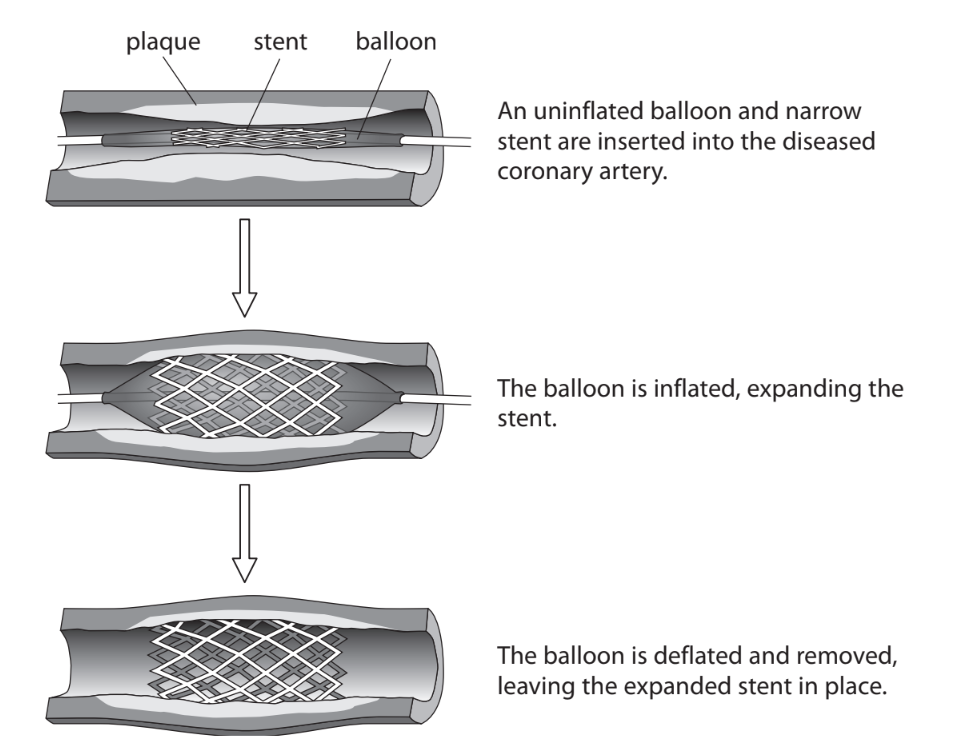

Explain why a stent is used in the treatment of atherosclerosis in a coronary artery.

### 3() — 6 marks — command: multiple — structured — from paper June 2021 · WBI11/01
Inserting a stent can damage the artery.

This damage can result in stent thrombosis if the blood clotting process is stimulated.

A study looked at the damage caused by two different types of stent, stent **A** and stent **B**.

The graph shows the incidence of stent thrombosis found in this study.

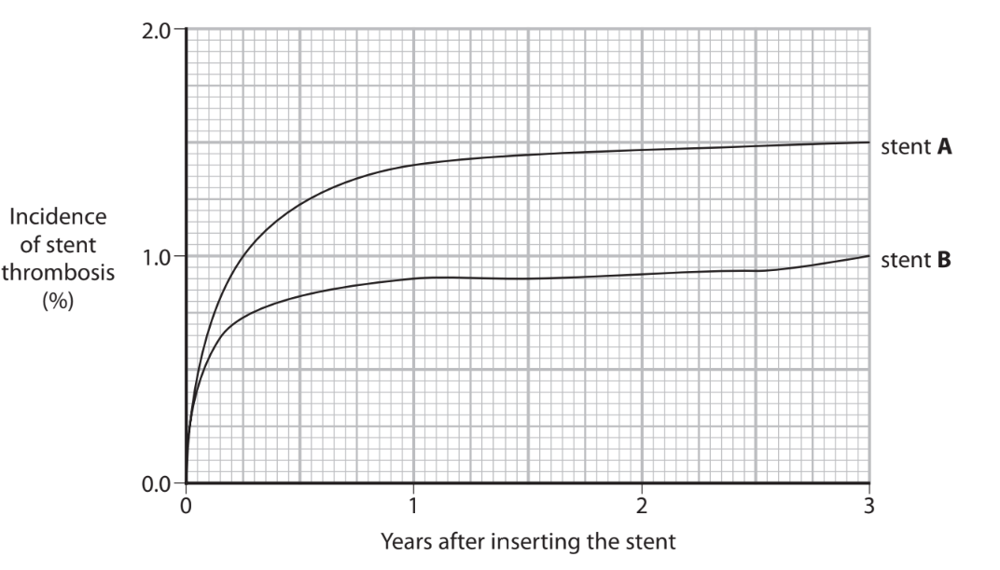

(i)In this study, 800 patients had stent **A** inserted and 400 patients had stent **B** inserted.

Calculate the difference in the number of patients who developed stent thrombosis three years after inserting the stent.

**(2)**

(ii) State how the formation of a blood clot in the coronary artery could cause the death of the patient.

**(1)**

(iii) Which components of the blood clotting process are enzymes in their active form?

**(1)**

☐ **A** Prothrombin and thromboplastin only 
☐ **B** Prothrombin and thrombin only 
☐ **C** Prothrombin, thrombin and thromboplastin 
☐ **D** Thrombin and thromboplastin only

(iv) Which components of the blood clotting process are soluble in blood plasma?

**(1)**

| ☐ | **A** | Fibrin and fibrinogen |
|---|---|---|
| ☐ | **B** | Fibrin and thromboplastin |
| ☐ | **C** | Fibrinogen and thromboplastin |
| ☐ | **D** | Fibrinogen only |

(v) Stent **B** contains a drug to prevent stent thrombosis.

Suggest one type of drug that could be used in stent **B**.

**(1)**

## Q5 — medium — 9 marks · exam-questions

### 3((a)) — 3 marks — command: label — structured — from paper Oct/Nov 2021 · WBI11/01
Many animals have a heart and circulation.

The diagram shows the structure of a human heart.

Label the diagram with the names of the four major blood vessels.

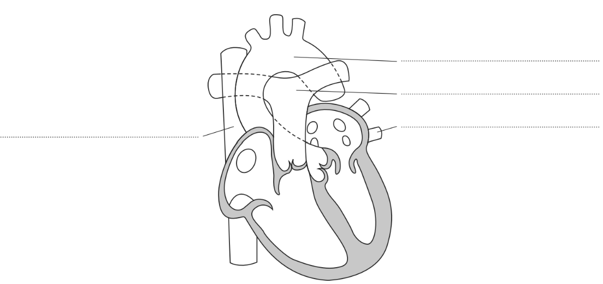

### 3((b)) — 3 marks — command: put — structured — from paper Oct/Nov 2021 · WBI11/01
The table shows some structures and the types of blood vessel that they are found in.

Put a cross ☒ in each row to show where these structures are found.

| **Structures** | **Found in** **arteries only** | **Found in** **capillaries only** | **Found in** **veins only** | **Found in** **arteries,** **capillaries and** **veins** |
|---|---|---|---|---|
| Lining of endothelial cells | ☐ | ☐ | ☐ | ☐ |
| Valves along the length of the blood vessel | ☐ | ☐ | ☐ | ☐ |
| Wall only one cell thick | ☐ | ☐ | ☐ | ☐ |

|   |   |   |   |   |
|---|---|---|---|---|
|   |   |   |   |   |

### 3((c)) — 3 marks — command: describe — structured — from paper Oct/Nov 2021 · WBI11/01
The graph shows the velocity of the blood as it flows through the arteries into the capillaries and then into the veins.

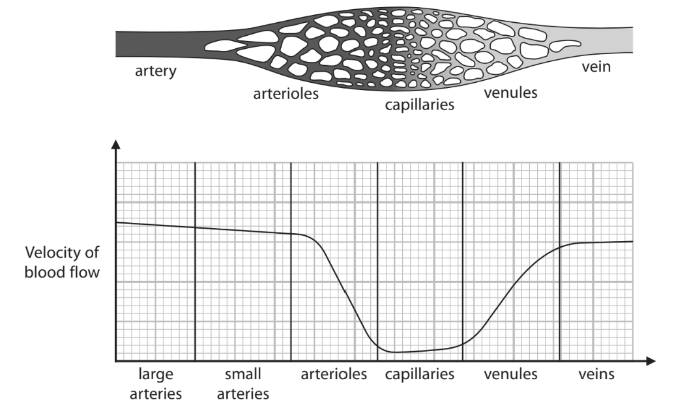

Describe the changes in the velocity of the blood as it flows from an artery to a vein.

## Q6 — medium — 7 marks · exam-questions

### 2((a)) — 2 marks — command: multiple — structured — from paper Jan 2022 · WBI11/01
The cardiac cycle describes the events that take place in the heart during one complete heartbeat.

The diagram shows a heart in one of the stages, stage **F**, of the cardiac cycle.

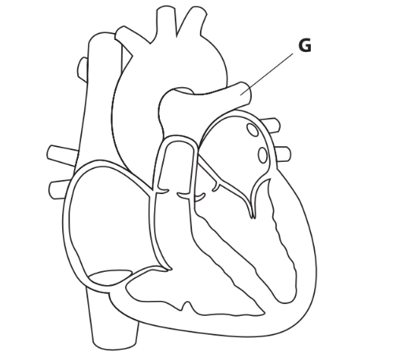

(i) What is the name of the blood vessel labelled **G**?

**(1)**

☐ **A** Aorta 
☐ **B** Pulmonary artery 
☐ **C** Pulmonary vein 
☐ **D** Vena cava

(ii) Which row of the table identifies the stages before and after stage **F**?

|   | **Stage before stage F** | **Stage after stage F** |
|---|---|---|
| ☐**A** | atrial systole | cardiac diastole |
| ☐**B** | atrial systole | ventricular systole |
| ☐**C** | ventricular systole | atrial systole |
| ☐**D** | ventricular systole | cardiac diastole |

**(1)**

### 2((b)) — 5 marks — command: multiple — structured — from paper Jan 2022 · WBI11/01
The graph shows pressure changes in the left ventricle of a person.

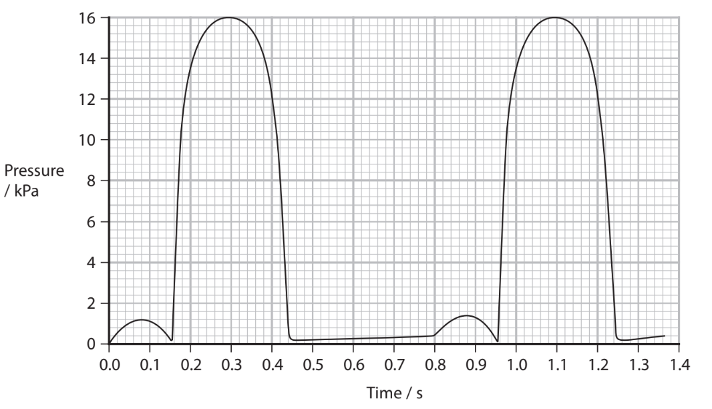

(i) Calculate the heart rate of this person.

Express your answer to 3 significant figures.

**(2)**

(ii) Another line could be drawn on this graph to show the pressure changes in the right ventricle.

Describe the shape and position of this line.

Give reasons for your answer.

**(3)**

## Q7 — medium — 12 marks · exam-questions

### 7((a)) — 3 marks — command: describe — structured — from paper Oct/Nov 2020 · WBI11/01
Warfarin is used in the treatment of cardiovascular disease.

Warfarin inhibits the synthesis of prothrombin.

Describe the role of prothrombin in the blood clotting process.

### 7((b)) — 1 mark — command: which — structured — from paper Oct/Nov 2020 · WBI11/01
Which type of treatment is warfarin?

| ☐ | **A** | anticoagulant |
|---|---|---|
| ☐ | **B** | antihypertensive |
| ☐ | **C** | platelet inhibitor |
| ☐ | **D** | statin |

### 7((c)) — 4 marks — command: suggest — structured — from paper Oct/Nov 2020 · WBI11/01
Reduced vitamin K is needed for the synthesis of prothrombin.

An enzyme, vitamin K epoxide reductase (VKOR), converts vitamin K to reduced vitamin K.

The diagram shows this conversion.

vitamin K $\overset{\mathrm{VKOR}}{\rightarrow}$ reduced vitamin K

(i) The diagrams show the structures of warfarin and vitamin K.

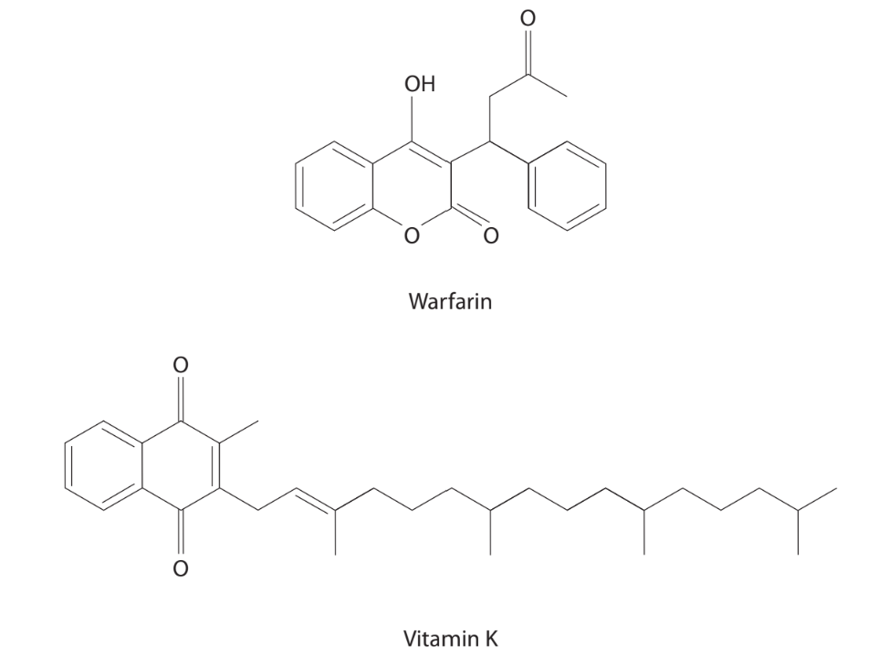

Using the information in the diagrams, suggest why warfarin inhibits the synthesis of prothrombin.

**(2)**

(ii) Suggest why people taking warfarin have to avoid eating foods that contain a high concentration of vitamin K.

**(2)**

### 7((d)) — 4 marks — command: explain — structured — from paper Oct/Nov 2020 · WBI11/01
Other drugs are available that work in a similar way to warfarin.

The diagram shows one study to compare the effect of warfarin with drug X.

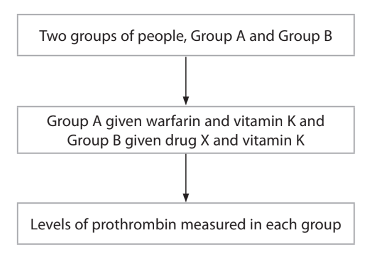

Explain how this study should be designed so that the effectiveness of these two drugs can be compared.

## Q8 — medium — 11 marks · exam-questions

### 5((a)) — 5 marks — command: multiple — structured — from paper Jan 2022 · WBI11/01
Collagen is a component of the wall of the aorta.

(i) Describe the structure of collagen.

**(3)**

(ii) Explain the role of collagen in the wall of the aorta.

**(2)**

### 5((b)) — 6 marks — command: comment — structured — from paper Jan 2022 · WBI11/01
Age and sex affect the types and density of collagen found in the wall of the aorta.

These are thought to cause aortic stiffness.

In one study, scientists investigated the effect of age and sex on aortic stiffness and the density of collagen in the wall of the aorta.

The graphs show the results of this study.

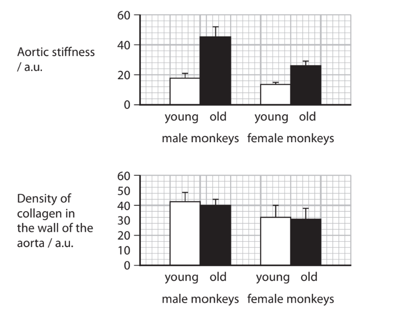

In another study, scientists investigated the effect of age and sex on two types of collagen present in the wall of the aorta.

The graphs show the relative proportion of each type of collagen in each group of monkeys.

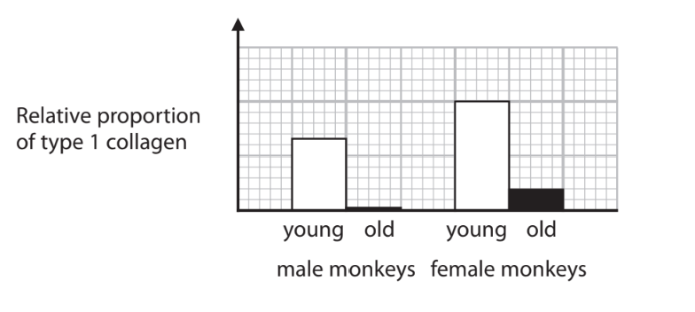

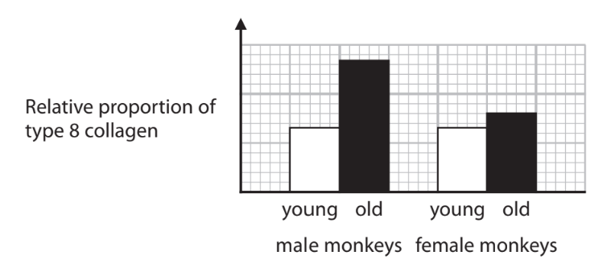

Comment on the effect of age and sex on the types of collagen found in the wall of the aorta and aortic stiffness.

Use the information in the graphs to support your answer.

## Q9 — medium — 10 marks · exam-questions

### 1() — 1 mark — multiple_choice
Which of the following correctly describes how hypertension increases the risk of coronary heart disease?
- **A.** high blood pressure increases the flow of blood to the heart, directly causing a heart attack
- **B.** high blood pressure damages the endothelium of coronary arteries, increasing the risk of atheroma formation
- **C.** high blood pressure damages the endothelium of veins, reducing the return of blood to the heart
- **D.** high blood pressure increases the permeability of capillary walls, causing fluid to leak into surrounding tissues

### 2() — 4 marks — command: explain — structured
The graph shows changes in pressure in the aorta and left ventricle during one cardiac cycle.

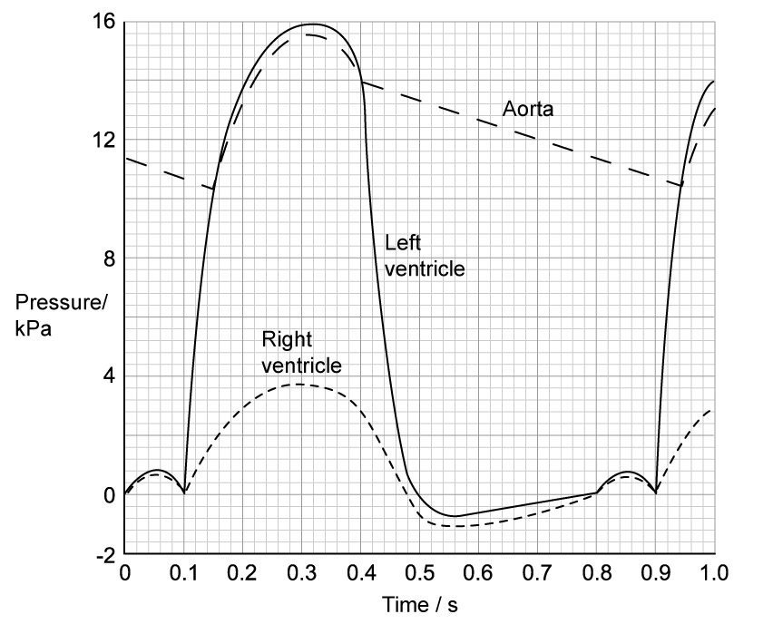

(i) Explain why the semilunar valve opens at 0.15 s and closes at 0.4 s.

[2]

(ii) Explain the pressure changes in the aorta between 0.15s and 0.3 s.

[1]

(iii) Explain the pressure changes in the ventricle between 0.32 s and 0.55 s.

[1]

### 3() — 2 marks — command: calculate — structured
A researcher monitored the cardiac output of the patient while walking and running on a treadmill at increasing speeds. The results are shown in the graph.

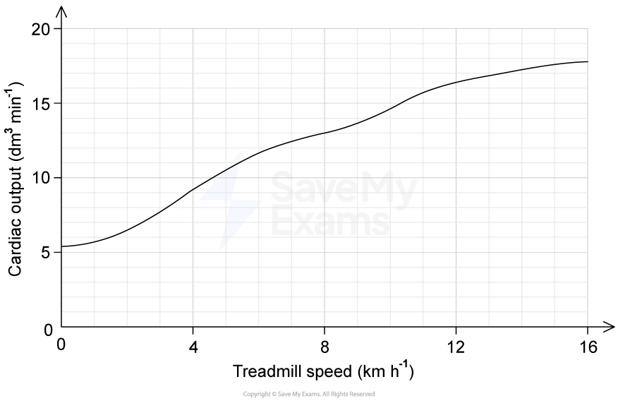

The patient's resting stroke volume is 75 cm³.

Using Figure 2, calculate the patient's resting heart rate in beats min⁻¹.

Use the equation:

cardiac output = heart rate × stroke volume

### 4() — 1 mark — command: calculate — structured
Calculate the percentage increase in cardiac output between rest and 8 km h⁻¹.

### 5() — 2 marks — command: explain — structured
Explain how the structure of a capillary is adapted for the efficient exchange of substances.
