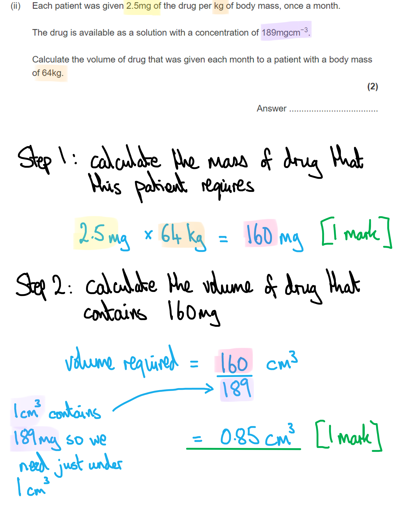
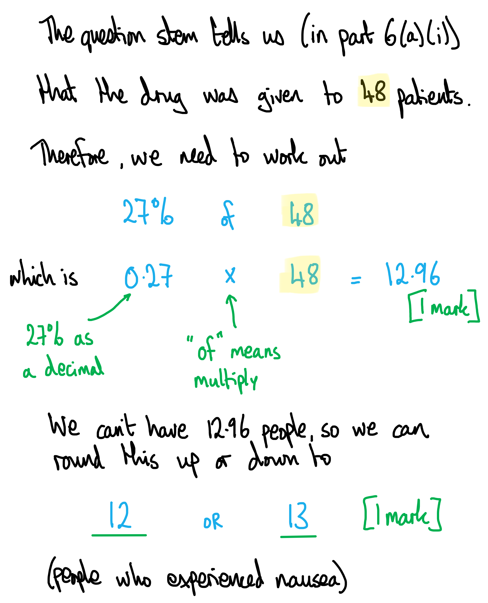
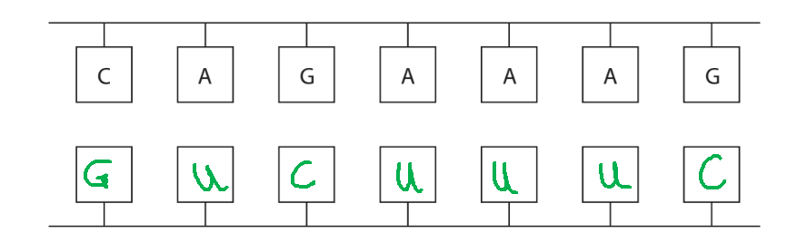
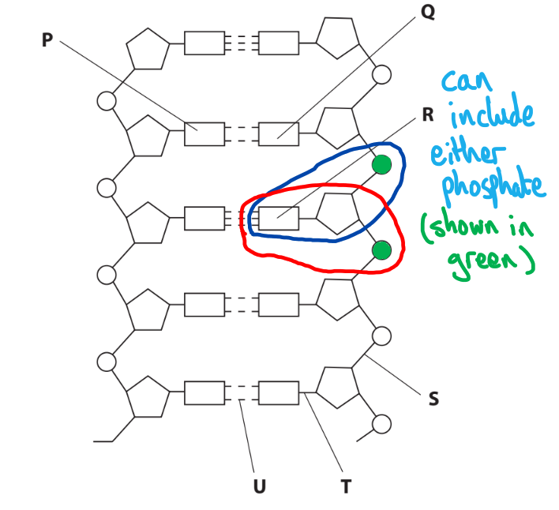
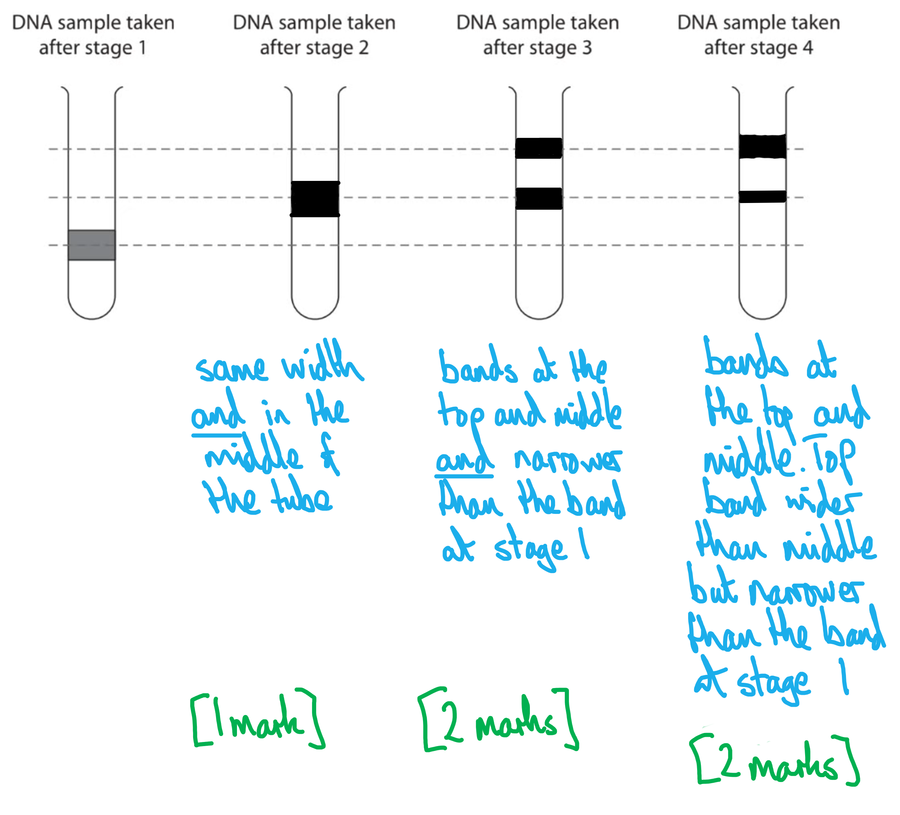
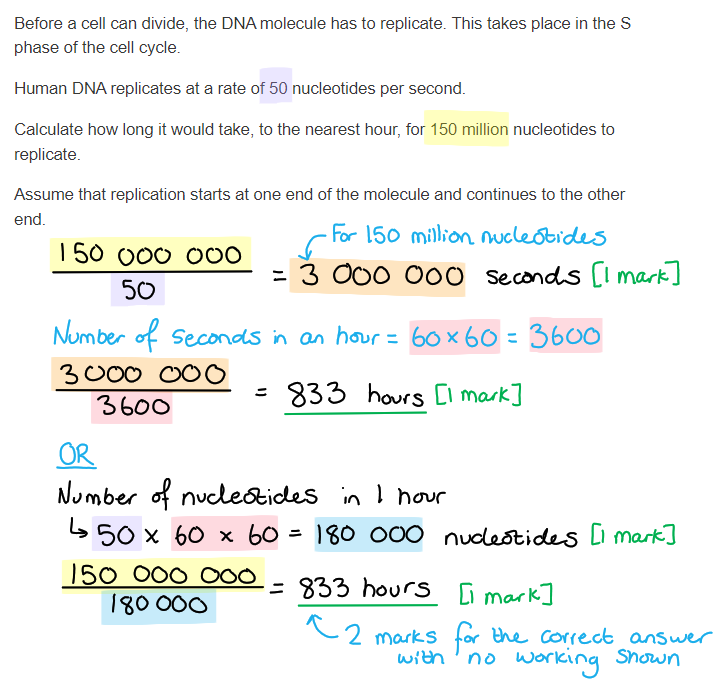
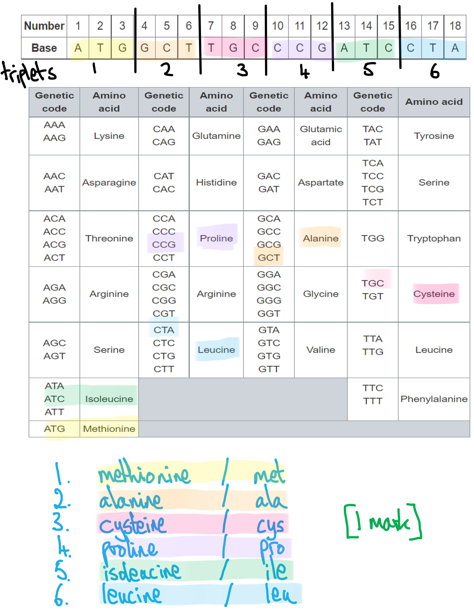

# Mark Schemes — DNA & Gene Expression
**2. Membranes, Proteins, DNA & Gene Expression** · Edexcel International A Level (IAL) Biology (YBI11)

## Q1 — medium — 14 marks · exam-questions

### 6() — 6 marks
(i) Comments on the design of this clinical trial are as follows:

Any** two** of the following:

- (46 / 48 /94 patients is) not a very large sample size; **[1 mark]**
- The trial was held in 18 countries / with a variety of people, so probably means that other variables (eg. lifestyle, diet, other types of disease) were not taken into account; **[1 mark]**
- However, AHP is a very rare disorder so there would not have been many patients available for the study; **[1 mark]**

*Ignore references to the reliability or validity of data and referencecs to age/sex.*

> *You will probably have noted that the sample size is small, but on the other hand, you should have noticed in the question stem that the disease is rare, so researchers would have to have looked far and wide to gather even enough cases for this size of study. The group sizes do not need to be the same size as each other because percentages can be used to make comparisons in the groups' data. *

(ii) The volume of drug that was given each month to a patient with a body mass of 64kg is calculated as follows:

- Mass of drug needed for that patient = 64 × 2.5 = 160mg; **[1 mark]**
- Volume of drug needed = (160 ÷ 189) = 0.8 / 0.85 / 0.847 cm3/ml/cc; **[1 mark]**

**OR**

- Volume of drug to give 2.5 mg = (2.5 ÷ 189) = 0.0132 cm3; **[1 mark]**
- Multiplied by the patient's mass = 0.0132 × 64 = 0.8 / 0.85 / 0.847 cm3; **[1 mark]**

(iii) The number of patients who experienced nausea is calculated as follows:

- 27% of 48 calculated; **[1 mark]**
- = 12 **or** 13; **[1 mark]**

*Award maximum of ***[1 mark]*** if answer is not a whole number eg. 12.96*

* Award ***[1 mark]*** for 27% of 94 = 25 (****NOT**** 26)*

**[Total: 6 marks]**

### 6() — 8 marks
(i) The completed diagram to show the base sequence on the other RNA strand is:

- GUCUUUC; **[2 marks]**

*Award one mark for one wrong base given ****OR**** one wrong base given consistently*

> *You have to notice from the question that this is a piece of RNA; if you mis-read and believe it to be a piece of DNA, you would put thymine (T) in, incorrectly. *

(ii) The bonding in this double-stranded RNA molecule is:

Any** three** of the following:

- <u>Phosphodiester</u> bonds between (adjacent) ribose and phosphate / nucleotides (in each strand); **[1 mark]**
- <u>Covalent</u> bonds attaching each base to a ribose / sugar; **[1 mark]**
- <u>Hydrogen/H</u> bonds between complementary bases (holding two strands together); **[1 mark]**
- Hydrogen/H bonds holding the double helix together; **[1 mark]**

*Accept sugar but NOT deoxyribose sugar*

*The fact that there are ***[3 marks]*** available for this question gives a hint that there are three different types of bonding; these are **phosphodiester**, **hydrogen,** and **covalent** bonding. All of these play a role in holding double-stranded RNA together. You'll be more familiar with DNA as a double-stranded molecule, but you can apply your knowledge of DNA to RNA in certain contexts, like this one.*

(iii) The action of the double-stranded RNA drug helps patients with AHP by...

Any **three** of the following:

- There is no/less translation of the mRNA **OR** translation of the mRNA is affected; **[1 mark]**
- (The altered mRNA) affects the shape of the protein / active site **OR** no protein/enzyme is formed; **[1 mark]**
- There is no/less/slower haem production; **[1 mark]**
- So there is no/less build-up of toxic porphyrin; **[1 mark]**

*Accept a description of translation ****NOT**** transcription*

**[Total: 8 marks]**

> *Heam is composed of a ringlike organic compound known as a **porphyrin**, to which an iron atom is attached.*

## Q2 — medium — 9 marks · exam-questions

### 4((a)) — 3 marks
(i) A circle around one mononucleotide that includes the base labelled R must enclose...

- Base R **AND** the deoxyribose sugar to the right **AND **<u>one</u> of the phosphates adjoining that sugar; **[1 mark]**

(ii) The row of the table that identifies the bonds labelled S, T and U is **D**.

> *Phosphodiester bonds link the nucleotides in the sugar-phosphate backbone of nucleic acids.*

> *The base is linked to the 5-carbon sugar by a covalent bond.*

> *The complementary base pairs are linked with hydrogen bonds.*

(iii) The base labelled Q is **C**.

> *A, B and D** **are all incorrect because adenine is complementary to thymine.*

**[Total: 3 marks]**

### 4((b)) — 6 marks
(i) The completed diagram to show the results of this experiment has the following features...

*In stage 2*

- A band the same width as stage 1 **AND **in the middle of the tube; **[1 mark]**

*In stage 3*

- Bands drawn at the top **AND** middle of tube; **[1 mark]**
- Both bands are narrower than stage 1; **[1 mark]**

*In stage 4*

- Bands drawn at the top **AND** middle of the tube; **[1 mark]**
- Top band is narrower than stage 1 **AND** top band is wider than stage 3 **AND** lower band is narrower than stage 3; **[1 mark]**

> *It's important to make sure that your bands are in the right place, but also are the correct relative widths. The dotted guidelines that are provided in the question are exactly that, they indicate where you should draw your bands, so avoid drawing bands in between the guidelines. A model answer is shown below. *

(ii) The diagram that would show the bands of DNA molecules on the density gradient at stage 2, if the dispersive theory was correct is **B **because...

**The bands shown in B are of intermediate weights; the upper band contains more N****14**** and the lower band contains more N****15****. The widths are about right to represent one cycle of DNA replication. **

> *A is incorrect because neither DNA molecule is made of **all** heavy nitrogen or **all** light nitrogen*

> *C is incorrect because neither DNA molecule is made of all heavy nitrogen or light nitrogen **and** the bands are too wide*

> *D is incorrect because it has only one band; this would suggest that all of the new DNA strands are the same, which is not the case as shown in the diagram above.*

**[Total: 6 marks]**

## Q3 — medium — 10 marks · exam-questions

### 3((a)) — 3 marks
The structure of a nucleotide pair can be described as...

- Contain deoxyribose/pentose/5 carbon sugar phosphate and bases **OR **pair contains purine and pyrimidine; **[1 mark]**
- (Mononucleotides / bases) held together by hydrogen bonds; **[1 mark]**
- Between complementary bases e.g. A(denine) and T(hymine) / C(ytosine) and G(uanine); **[1 mark]**

**[Total: 3 marks]**

> *For this answer you do not need to write about phosphodiester bonds joining together adjacent mononucleotides because this is not relevant to the question.*

### 3((b)) — 2 marks
The time it would take for 150 million nucleotides to replicate is...

- Number of seconds for molecules to replicate calculated = (150 million ÷ 50) 3 000 000 **OR **number of molecules replicated in 1 hour (50 × 60 × 60 =) 180 000; **[1 mark]**
- 833; **[1 mark]**

*Full marks awarded for the correct answer only.*

*Answer of 833.3 = ***[1 mark]*** unless given as a recurring number*

**[Total: 2 marks]**

### 3((c)) — 5 marks
(i) The role of DNA polymerase in a replication bubble is...

Any **two **of the following:

- Bind to each strand of the DNA (to initiate replication) / works at both ends of the bubble; **[1 mark]**
- Function of DNA polymerase e.g. lines up nucleotides (along each strand) / forms phosphodiester bond (between adjacent nucleotides) / repairs mistakes in replication; **[1 mark]**
- So that the DNA can be synthesised in both directions; **[1 mark]**

(ii) Each DNA molecule is replicated using many replication bubbles because...

- To speed up the process (of DNA synthesis); **[1 mark]**
- So that S phase is shorter / lasts 8 hours and not 833 hours; **[1 mark]**
- So that cell division is fast enough; **[1 mark]**

**[Total: 5 marks]**

> *Make sure you remember to check back to earlier diagrams and sections of the question that are relevant. Being able to interpret information from diagrams is an important skill you will be examined on. *

## Q4 — medium — 12 marks · exam-questions

### 6((a)) — 6 marks
> *This is a level-marked question, meaning that it is marked **according to the levels table**. The indicative content points below the table are **not **to be used in the usual **'one point per mark'** way, but should be used together with the levels table to determine the number of marks which should be awarded. *

The nature of the genetic code is:

| **Level 1** | - Answers refer to the triplet code system **OR** the degenerate code **OR **non-overlapping code. - **No** examples or explanations are given.  **[1 mark]** = 1 out of 3   **[2 marks]** = 2 out of 3 **OR** 1 out of 3 + a linked example or explanation |
|---|---|
| **Level 2** | - Answers refer to the triplet code system **OR** degenerate code **OR **non-overlapping code. - Either examples **OR** explanations are given.  **[3 marks]** = at least 2 examples **OR** 2 explanations **OR** 1 explanation AND 1 example  **[4 marks]** = at least 3 examples **OR** 3 explanations **OR **any combination of each |
| **Level 3** | - Answers refers to the triplet code system **AND** degenerate code **AND** non-overlapping code. - Examples **AND** explanation are given.  **[5 marks]** = at least 4 examples **OR **4 explanations **OR** any combination of each **[6 marks]** = at least 5 examples **OR** 5 explanations **OR** any combination of each |

Indicative content:

*The triplet code system*

- There is a triplet codon/code system **OR **three bases code for each amino acid
- (Explanation =) 20 codes are needed for the 20 amino acids **OR **each amino acid has its own code
- (Example =) AAC codes for asparagine
- (Example =) CAA codes for glutamine
- (Example =) TGG codes for tryptophan

*The degenerate nature of the code*

- The code is degenerate
- (Explanation =) some amino acids are coded for by more than one code **OR **there are more codes than necessary
- (Example =) threonine can be coded for by ACA, ACC, ACG or ACT
- (Example =) histidine can be coded for by CAT or CAC
- (Example =) cysteine can be coded for by TGC or TGT

*The non-overlapping nature of the code*

- The code is non-overlapping
- (Explanation =) each base is used in only one (discrete) triplet
- (Example =) AAC followed by AGA codes for two amino acids
- (Example =) GTA followed by TTA codes for two amino acids

***Accept ****as a fourth section any points relating to *the universal nature of the genetic code.

***Accept**** other correct examples given from the table; it is very unlikely that the examples above will be the ones that are used.*

**[Total: 6 marks]**

> *For these levelled questions try to split the distribution of the 6 marks into logical sections. In this case, you'll recall that the spec requires you to understand **three** features of the nature of the genetic code (triplet code, non-overlapping and degenerate); it is logical to assume that there are 2 marks available for a discussion of each of these, **including an example from the table** as instructed in the question.*

> *A three-paragraph answer organised in this manner will be concise, quick to write and will score marks with no unnecessary extra writing. *

### 6((b)) — 6 marks
(i) The sequence of amino acids that is coded for by these bases is:

- Methionine → alanine → cysteine → proline → isoleucine → leucine; **[1 mark]**

***Accept**** met → ala → cys → pro → ile → leu or any other plausible abbreviation system.*

(ii) The possible effects on a protein if there is a substitution mutation in the 9th base in this DNA strand are...

Any **five **of the following:

- It will have no effect (on the polypeptide) if the ninth base becomes a T **AS** this still codes for cysteine / the same amino acid; **[1 mark]**
- It will code for a stop codon if the ninth base becomes an A; **[1 mark]**
- (Therefore) the protein/polypeptide will be shorter / not formed **OR **only two amino acids will join together; **[1 mark]**
- It will code for tryptophan / a different amino acid if the ninth base becomes G; **[1 mark]**
- (This) could change the bonding in the protein; **[1 mark]**
- (And consequently) change the structure / activity of the protein; **[1 mark]**

***Accept ****an incorrectly named alternative amino acid instead of tryptophan for marking point 4.*

> *The key to accessing full in this question is to make frequent reference to information in both tables from the question stem. Note that the question specifies a **substitution** mutation so any reference to the consequences of a deletion or an insertion mutation (e.g. frame-shift) will not earn any marks. *

**[Total: 6 marks]**

## Q5 — medium — 11 marks · exam-questions

### 1() — 1 marks
> **[mark-scheme]**
> - Substitution **[1 mark]**
> 
> Reject point mutation, as this is not the terminology required by the specification

> **[exam-tip]**
> Remember the different types of gene mutation: substitution (one base replaced by another), insertion (an extra base is added) and deletion (a base is removed). In this case, only one base has changed (C → G) with no bases added or removed, so it is a substitution. Make sure you use the correct terminology.

### 2() — 1 marks
To determine the amino acid sequence transcribed from this DNA:

- Convert the DNA to mRNA codons

DNA: TAC — GGA — CGT — ATG

mRNA: **AUG — CCU — GCA —  UAC**

- Read the amino acids from the table

methionine — proline — alanine — tyrosine **[1 mark]**

> **[exam-tip]**
> Remember when converting DNA to mRNA, replace thymine (T) with uracil (U) and ensure you use the correct complementary bases (A↔U, C↔G).

### 3() — 4 marks
> **[mark-scheme]**
> - The CFTR protein is non-functional / cannot transport ions / is blocked **[1 mark]**
> - Chloride ions do not move out of the cells / transport of chloride ions out of cells is reduced **[1 mark]**
> - Water potential inside the cell decreases **OR** solute concentration inside the cell increases **[1 mark]**
> - Water leaves the mucus / enters the cells by osmosis (so the mucus becomes thick and sticky) **[1 mark]**
> 
> Reject "the CFTR protein is mutated"

> **[exam-tip]**
> A common mistake is to state that the CFTR protein is mutated — remember that mutations occur in the gene or DNA, which then codes for a faulty protein.
> 
> Make sure you describe the full sequence of events from the gene mutation through to the final effect on the mucus.
> 
> Use precise A-level terminology throughout — "decreased water potential" will be credited, but "decreased water concentration" will not.

### 4() — 1 marks
**Correct answer: B** — Increases effective thickness of the surface

**Final answer:** **The correct answer is B.**

- Thick mucus increases the diffusion pathway between air and blood, which increases the effective thickness of the surface
- According to Fick's law of diffusion, the rate of diffusion is inversely proportional to the thickness of the diffusion pathway, thus reducing the rate of gaseous exchange

**A** is incorrect as mucus would reduce, not increase, the concentration gradient by slowing oxygen reaching the surface

**C** is incorrect as mucus reduces or blocks functional surface area

**D** is incorrect as the carbon dioxide partial pressure in the blood is not directly altered by mucus thickness in the alveoli

### 5() — 4 marks
The probability that their child will be a carrier of cystic fibrosis can be determined as follows:

- Determine parental genotypes

  - Both parents are unaffected carriers

Mother =  Ff

Father =  Ff

- Determine parental gametes

F  f **AND** F   f **[1 mark]**

- Use Punnett square to determine offspring genotypes and outcomes

|   | **F** | **f** |
|---|---|---|
| **F** | FF | Ff |
| **f** | Ff | ff |

FF, Ff, Ff, ff **[1 mark]**

FF = unaffected **AND** Ff =** **(unaffected) carriers** AND **ff = affected **[1 mark]**

- Determine the probability:

Probability of carrier = **50 % ****[1 mark]**

> **[mark-scheme]**
> Award marks for genotypes and gametes written within a Punnett square, and for phenotypes written as labels for the Punnett square
> 
> Accept 0.5 or  ½
> 
> Accept healthy for unaffected
> 
> Accept cystic fibrosis/CF for affected

> **[exam-tip]**
> Make sure to read the question carefully; many students lose marks by identifying the probability of being affected rather than being a carrier.

## Q6 — medium — 10 marks · exam-questions

### 1() — 3 marks
> **[mark-scheme]**
> (i) The bonds that hold the two strands of a DNA molecule together are:
> 
> - Hydrogen bonds **[1 mark]**
> 
> (ii) They can be described as follows:
> 
> Any **two** from:
> 
> - They form / are present between complementary bases / between A and T **AND** between C and G
> - They are individually weak / easily broken
> - They form between a slightly negative/*δ*− oxygen atom and a slightly positive/*δ*+ hydrogen atom
> 
> **[2 marks]**

> **[exam-tip]**
> Your knowledge of hydrogen bonds in water is directly relevant here — the same principles apply to the bonds between complementary bases in DNA.

### 2() — 1 marks
> **[mark-scheme]**
> Any **one** from:
> 
> - DNA contains deoxyribose (sugar) **WHILE** RNA contains ribose (sugar)
> - DNA contains the base thymine **WHILE** RNA contains the base uracil
> - DNA is double-stranded / consists of two strands **WHILE** RNA is single-stranded / consists of one strand
> 
> **[1 mark]**

> **[exam-tip]**
> Make sure you give a clear comparative statement — mention both DNA and RNA in your answer. For example, simply writing "DNA has deoxyribose" without stating what RNA has instead would not be sufficient.

### 3() — 2 marks
> **[mark-scheme]**
> Any **two** from:
> 
> - Adds complementary nucleotides to each new DNA strand / assembles/lines up complementary nucleotides against the original/template strand
> - Forms phosphodiester bonds between adjacent (DNA) nucleotides
> - Proofreads the DNA / repairs damage/mistakes in the DNA
> 
> **[2 marks]**
> 
> Reject any implication that DNA polymerase is involved in formation of hydrogen bonds / joining of complementary bases

> **[exam-tip]**
> A common misconception is that DNA polymerase is responsible for forming the hydrogen bonds between complementary base pairs. DNA polymerase specifically catalyses the formation of phosphodiester bonds between adjacent nucleotides in the new strand — the hydrogen bonds between base pairs form spontaneously without the involvement of an enzyme. Make sure you do not confuse these two types of bond in your answer.

### 4() — 3 marks
> **[mark-scheme]**
> Describe:
> 
> - The initial rate increases from 0.3 at pH 4 to (a maximum of) 7.4 at pH 8 **AND** then decreases to 0.8 at pH 10 **[1 mark]**
> 
> Explain:
> 
> - At pH values above and below the optimum H+ / OH- ions interfere with the hydrogen bonds / ionic bonds / interactions between R groups maintaining tertiary structure **[1 mark]**
> - The active site is no longer complementary to the substrate **SO** fewer enzyme-substrate complexes form **[1 mark]**
> 
> Do not accept a description of the trend without supporting data values from the table.

> **[exam-tip]**
> When a question asks you to both "describe" and "explain", make sure you do both — a common mistake is to jump straight into the explanation without first quoting the data.
> 
> Use specific figures from the table (e.g. the rate rises from 0.3 at pH 4 to 7.4 at pH 8) to support your description.
> 
> For the explanation, always link changes in pH to the effect on bonds holding the tertiary structure and active site shape, and then to the consequence for enzyme-substrate complex formation. Avoid vaguely saying the enzyme is "denatured" at non-optimum pH values unless the rate drops to zero; instead, refer to the active site shape changing so that fewer enzyme-substrate complexes can form.

### 5() — 1 marks
**Correct answer: B** — Half the DNA molecules contain one 15N strand and one 14N strand, and half contain only 14N

**Final answer:** **The correct answer is B.**

- Round 1: the original 15N15N molecule separates and each strand acts as a template, producing two hybrid 15N14N molecules
- Round 2: each of the two hybrid molecules separates

  - The 15N strand from each acts as a template, producing two hybrid 15N14N molecules
  - The 14N strand from each acts as a template, producing two 14N14N molecules
- Therefore two of the resulting four molecules are hybrid 15N14N and two contain only 14N

**A** is incorrect because after two rounds of semi-conservative replication, the 14N strands produced in round 1 act as templates in round 2, producing molecules made entirely from 14N; so not all molecules can be hybrid.

**C** is incorrect because the original 15N strands are retained throughout replication; each acts as a template in round 1, producing hybrid molecules, and these 15N strands are still present in two of the four molecules after round 2, so not all molecules can contain only 14N.

**D** is incorrect because after two rounds of semi-conservative replication, the original 15N strands are not preserved intact in separate molecules; they each act as templates, meaning no molecule contains only 15N after transfer to the 14N medium.

## Q7 — medium — 10 marks · exam-questions

### 6((a)) — 2 marks
(i) The correct answer is **A** because...

**...tRNA's role is to bind to a specific amino acid, allowing that amino acid to be added to a growing polypeptide chain as dictated by the mRNA codon sequence.**

> *B** is incorrect because tRNA does not identify a base and transport it to a ribosome.*

> *C** is incorrect because tRNA does not form a template for DNA polymerase*

> *D** is incorrect because tRNA does not form a template for RNA polymerase*

(ii) The correct answer is **A** because...

**...the Golgi apparatus's job is to process newly-synthesised proteins and to prepare them for their final role eg. secretion, membrane protein, hormone etc**

> *B, C** and **D** are all incorrect because those organelles have other roles within the cell.*

**[Total: 2 marks]**

### 6((c)) — 2 marks
The role of DNA polymerase in DNA replication during cell proliferation is:

Any** two** of the following:

- (RNA polymerase) adds <u>complementary</u> nucleotides/bases (to the template strand); **[1 mark]**
- Phosphodiester bonds are formed **OR** formation of H bonds between bases in old and new strand; **[1 mark]**
- (It) proofreads the DNA; **[1 mark]**

**[Total: 2 marks]**

### 6((c)) — 3 marks
Cytokine genes can be expressed in an activated T lymphocyte as follows:

- (Activation) results in the production of / activation of transcription factors **OR** secondary messenger systems are activated; **[1 mark]**
- (Transcription factor) binds to the promotor region of the cytokine genes; **[1 mark]**
- So (cytokine genes) are transcribed / mRNA is produced / description of transcription (DNA → RNA); **[1 mark]**

**[Total: 3 marks]**

> *This is a question about DNA replication and transcription but in the disguise of a question about immunity. The mention of cytokines in an activated T lymphocyte may send you looking into your theory knowledge of immunity, whereas the examiners are looking for details about how the expression of **any** gene may be controlled. The gene in this question just happens to be one that codes for a specific type of protein, the cytokines. Context is crucial here.*

### 6((e)) — 3 marks
Different forms of the CD45 protein can be produced from a single CD45 gene as follows:

**Three** from the following:

- The gene for CD45 protein is transcribed into pre mRNA / post transcriptional modification occurs; **[1 mark]**
- A spliceosome / enzyme removes non coding regions / introns from the (pre) mRNA **OR** rearrangement of exons to produce mRNA; **[1 mark]**
- There is translation of (different) mRNA molecules simultaneously; **[1 mark]**
- To produce a CD45 protein with a different primary structure / different 3D/ tertiary structure; **[1 mark]**

*Do not accept reference to DNA splicing*

**[Total: 3 marks]**

*The question could be answered from the point of view of mutation creating new alleles. However, this would earn ***[0 marks]*** with the examiners' mark scheme. The question would be clearer if the wording was:*

> *'Describe how different forms of the CD45 protein can be produced from a single CD45 **gene** **allele**' in order to steer you away from mutation and direct you the correct part of the curriculum, which is one gene coding for more than one protein.*

> *You may have seen other questions where the answer lies in the fact that one gene can code for more than one protein, and be tempted to trot out a well-rehearsed answer. However, your answer must relate to the context of this question, so a generalised answer would not score well. You must relate your answer to the context of the question.*
