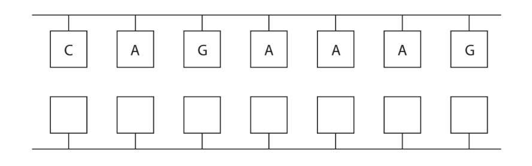
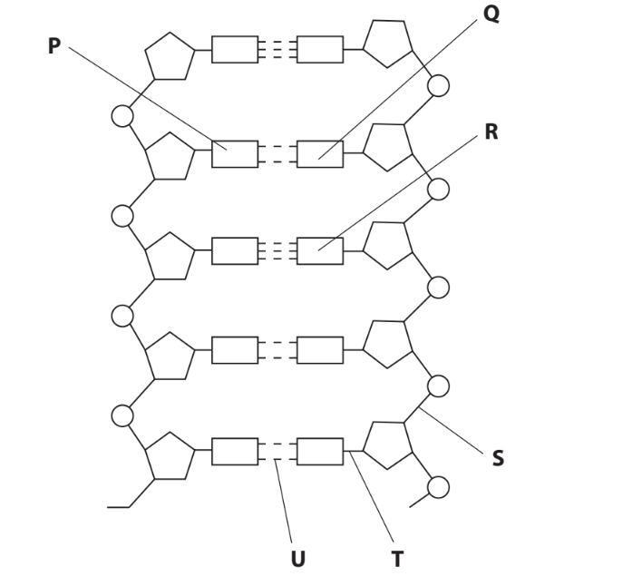
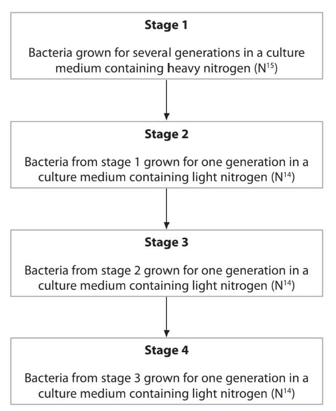
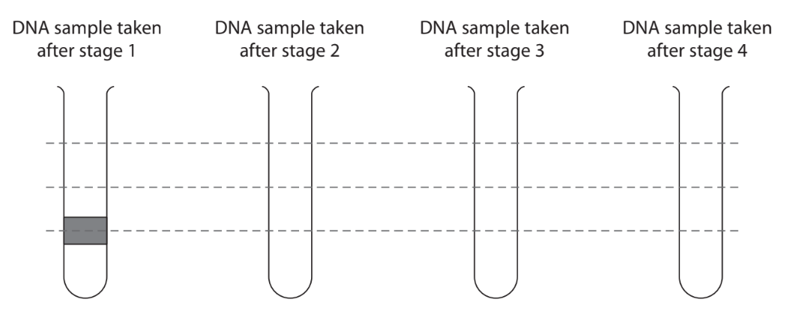
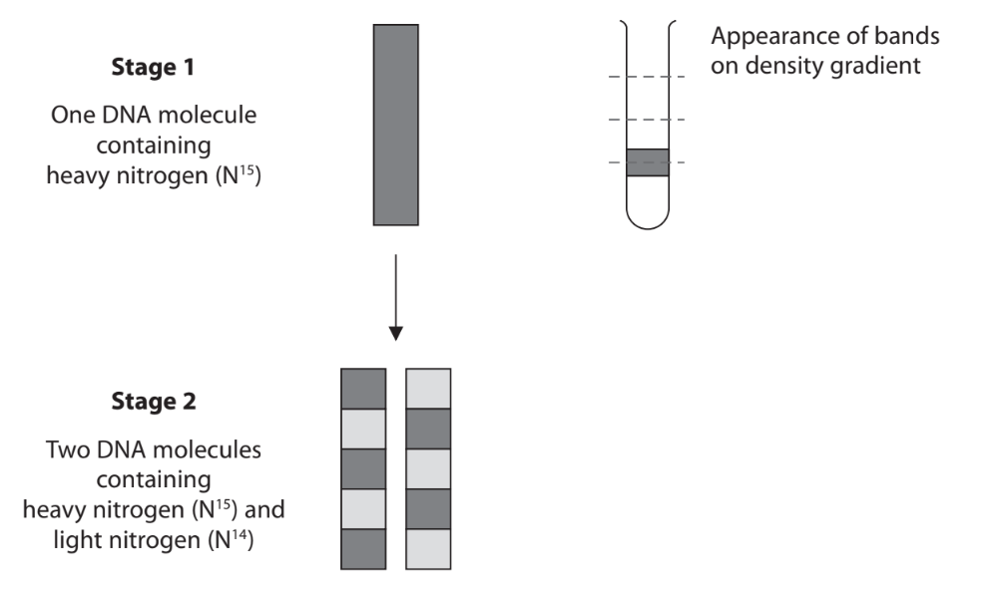
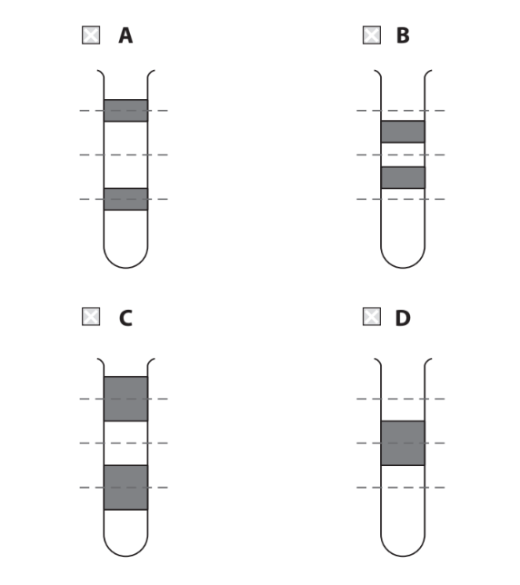
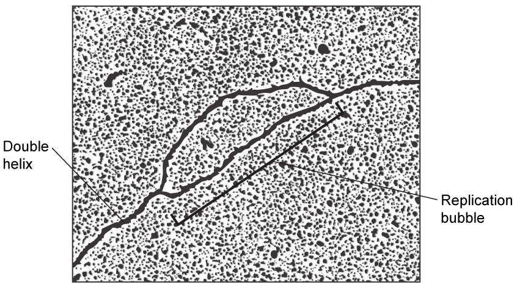
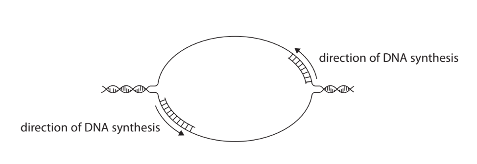

# Exam Questions — DNA & Gene Expression
**2. Membranes, Proteins, DNA & Gene Expression** · Edexcel International A Level (IAL) Biology (YBI11)
> Source: [https://www.savemyexams.com/international-a-level/biology/edexcel/18/topic-questions/2-membranes-proteins-dna-and-gene-expression/dna-and-gene-expression-/exam-questions/](https://www.savemyexams.com/international-a-level/biology/edexcel/18/topic-questions/2-membranes-proteins-dna-and-gene-expression/dna-and-gene-expression-/exam-questions/) · 7 questions · total 76 marks

## Q1 — medium — 14 marks · exam-questions

### 6() — 6 marks — command: multiple — structured — from paper Oct/Nov 2021 · WBI11/01
Acute hepatic porphyria (AHP) is a very rare genetic disorder.

A drug has been developed to treat AHP.

This drug was tested in a clinical trial involving 94 patients from 18 countries.

The drug was given to 48 of the patients. The other 46 patients were a control group.

(i) Comment on the design of this clinical trial.

**(2)**

(ii) Each patient was given 2.5 mg of the drug per kg of body mass, once a month.

The drug is available as a solution with a concentration of 189 mg cm−3.

Calculate the volume of drug that was given each month to a patient with a body mass of 64 kg.

**(2)**

(iii) Nausea was experienced by 27 % of the patients receiving this drug.

Calculate the number of patients who experienced nausea.

**(2)**

### 6() — 8 marks — command: multiple — structured — from paper Oct/Nov 2021 · WBI11/01
This drug is a double-stranded RNA molecule.

(i) The diagram shows part of the base sequence on one of the RNA strands. Complete the diagram to show the base sequence on the other RNA strand.

**(2)**

(ii) Describe the bonding in this double-stranded RNA molecule.

**(3)**

(iii) In AHP, toxic porphyrin molecules build up.

The synthesis of the haem component of haemoglobin involves several steps.

Each step in the synthesis of haem is catalysed by a different enzyme.

This drug works by interfering with the mRNA copies from the gene coding for one of these enzymes.

Explain how the action of this drug helps patients with AHP.

**(3)**

## Q2 — medium — 9 marks · exam-questions

### 4((a)) — 3 marks — command: multiple — structured — from paper Oct/Nov 2020 · WBI11/01
The polynucleotide DNA is composed of mononucleotides linked together.

Two polynucleotides form a DNA molecule.

The diagram shows part of a DNA molecule.

(i)Draw a circle around **one** mononucleotide that includes the base labelled **R**.

**(1)**

(ii) Which row of the table identifies the bonds labelled **S, T **and** U**?

**(1)**

| ** ** | **S** | **T** | **U** |
|---|---|---|---|
| **A** | hydrogen | phosphodiester | covalent |
| **B** | hydrogen | covalent | phosphodiester |
| **C** | phosphodiester | hydrogen | covalent |
| **D** | phosphodiester | covalent | hydrogen |

|   |   |   |   |   |
|---|---|---|---|---|

(iii) The base labelled **P** is adenine.

Which is the base labelled **Q**?

**(1)**

| ☐ | **A** | cytosine |
|---|---|---|
| ☐ | **B** | guanine |
| ☐ | **C** | thymine |
| ☐ | **D** | uracil |

### 4((b)) — 6 marks — command: multiple — structured — from paper Oct/Nov 2020 · WBI11/01
Meselson and Stahl carried out experiments that provided evidence for the semi‐conservative replication of DNA.

Heavy nitrogen (N15) and light nitrogen (N14) were used in these experiments.

The flow chart summarises part of one experiment performed by Meselson and Stahl.

After each stage, a sample of DNA was taken from the bacteria and the DNA molecules separated using a density gradient in a tube.

The heavier DNA molecules form bands lower down the gradient than the lighter DNA molecules.

The height of each band is proportional to the percentage of DNA molecules in the sample.

(i) Complete the diagram to show the results of this experiment.

Use the dotted lines to help you to position the bands on the diagram.

The first one has been done for you.

**(5)**

(ii) The experiments of Meselson and Stahl disproved the dispersive theory of DNA replication.

The diagram shows the expected results if the dispersive theory was correct.

Which diagram would show the bands of DNA molecules on the density gradient at stage 2, if the dispersive theory was correct?

**(1)**

## Q3 — medium — 10 marks · exam-questions

### 3((a)) — 3 marks — command: describe — structured — from paper Jan 2022 · WBI11/01
An average‐sized human chromosome contains a DNA molecule with about 300 million nucleotides, arranged in pairs.

Describe the structure of a nucleotide pair.

### 3((b)) — 2 marks — command: calculate — structured — from paper Jan 2022 · WBI11/01
Before a cell can divide, the DNA molecule has to replicate. This takes place in the S phase of the cell cycle.

Human DNA replicates at a rate of 50 nucleotides per second.

Calculate how long it would take, to the nearest hour, for 150 million nucleotides to replicate.

Assume that replication starts at one end of the molecule and continues to the other end.

### 3((c)) — 5 marks — command: multiple — structured — from paper Jan 2022 · WBI11/01
In human cells, replication of DNA occurs at several sites along the molecule.

These sites are called replication bubbles.

The image shows a replication bubble.

The diagram shows how the DNA is replicated in one replication bubble.

(i) Explain the role of DNA polymerase in a replication bubble.

Use the information in the diagram and your own knowledge to support your answer.

**(2)**

(ii) In human cells, S phase lasts about 10 hours.

Suggest why each DNA molecule is replicated using many replication bubbles

**(3)**

## Q4 — medium — 12 marks · exam-questions

### 6((a)) — 6 marks — command: explain — structured — from paper Oct/Nov 2020 · WBI11/01
A gene contains the genetic code for the sequence of amino acids in a polypeptide chain.

The table shows the genetic codes found in DNA.

| **Genetic** **code** | **Amino** **acid** | **Genetic** **code** | **Amino** **acid** | **Genetic** **code** | **Amino** **acid** | **Genetic** **code** | **Amino acid** |
|---|---|---|---|---|---|---|---|
| AAA AAG | Lysine | CAA CAG | Glutamine | GAA GAG | Glutamic acid | TAC TAT | Tyrosine |
| AAC AAT | Asparagine | CAT CAC | Histidine | GAC GAT | Aspartate | TCA TCC TCG TCT | Serine |
| ACA ACC ACG ACT | Threonine | CCA CCC CCG CCT | Proline | GCA GCC GCG GCT | Alanine | TGG | Tryptophan |
| AGA AGG | Arginine | CGA CGC CGG CGT | Arginine | GGA GGC GGG GGT | Glycine | TGC TGT | Cysteine |
| AGC AGT | Serine | CTA CTC CTG CTT | Leucine | GTA GTC GTG GTT | Valine | TTA TTG | Leucine |
| ATA ATC ATT | Isoleucine |   | TTC TTT | Phenylalanine |   |   |   |
| ATG | Methionine |   |   |   |   |   |   |

The genetic codes TAA, TAG and TGA are stop codons, that do not code for amino acids.

Explain the nature of the genetic code.

Use information in the table to support your answer.

### 6((b)) — 6 marks — command: multiple — structured — from paper Oct/Nov 2020 · WBI11/01
The diagram shows the sequence of nucleotide bases in part of a DNA template (antisense) strand.

| **Number** | 1 | 2 | 3 | 4 | 5 | 6 | 7 | 8 | 9 | 10 | 11 | 12 | 13 | 14 | 15 | 16 | 17 | 18 |
|---|---|---|---|---|---|---|---|---|---|---|---|---|---|---|---|---|---|---|
| **Base** | A | T | G | G | C | T | T | G | C | C | C | G | A | T | C | C | T | A |

(i) Give the sequence of amino acids that is coded for by these bases.

**(1)**

(ii) Explain the possible effects on a protein if there is a substitution mutation in the 9th base in this DNA strand.

Use information in the table to support your answer.

**(5)**

## Q5 — medium — 11 marks · exam-questions

### 1() — 1 mark — command: name — structured
Cystic fibrosis (CF) is caused by a mutation in the gene encoding the CFTR protein. The mutation changes one base in the normal CFTR sequence from CCT to CGT.

Name the type of mutation that occurs.

### 2() — 1 mark — command: determine — structured
The mutated CFTR gene contains the following DNA sequence:

TAC — GGA — CGT — ATG

Determine the amino acid sequence transcribed from this DNA.

Use the table below.

| mRNA codon | Amino acid |
|---|---|
| AUG | Methionine |
| CCU | Proline |
| GGU | Glycine |
| GCA | Alanine |
| UAC | Tyrosine |
| ACG | Threonine |

### 3() — 4 marks — command: explain — structured
People with cystic fibrosis produce very thick, sticky mucus

Explain why a mutation in this gene results in the production of very thick, sticky mucus.

### 4() — 1 mark — multiple_choice
The thick mucus accumulates in the airways of the lungs.

Which of the following explains why thick mucus reduces gaseous exchange?
- **A.** Increases concentration gradient
- **B.** Increases effective thickness of the surface
- **C.** Increases surface area
- **D.** Decreases partial pressure of CO₂

### 5() — 4 marks — command: construct — structured
A couple are both unaffected carriers of cystic fibrosis.

Construct a genetic cross and determine the probability of their next child being a carrier.

## Q6 — medium — 10 marks · exam-questions

### 1() — 3 marks — command: multiple — structured
(i) Name the bonds present between the bases of a DNA molecule.

[1]

(ii) Describe the bonds named in (i).

[2]

### 2() — 1 mark — command: state — structured
State **one** structural difference between DNA and RNA.

### 3() — 2 marks — command: describe — structured
DNA is replicated in cells during a process known as semi-conservative replication.

Describe the role of DNA polymerase in semi-conservative replication.

### 4() — 3 marks — command: explain — structured
DNA can also be broken down by enzymes.

DNase I is an enzyme that catalyses the hydrolysis of bonds in DNA. An investigation was carried out to determine the effect of pH on the activity of DNase I.

The results are shown in the table below.

| pH | Initial rate of reaction (arbitrary units) |
|---|---|
| 4 | 0.3 |
| 5 | 1.1 |
| 6 | 3.8 |
| 7 | 6.2 |
| 8 | 7.4 |
| 9 | 4.1 |
| 10 | 0.8 |

Describe and explain the effect of pH on the initial rate of DNase I activity.

### 5() — 1 mark — multiple_choice
In another experiment, bacteria were grown in a medium containing heavy nitrogen (15N). The bacteria were then transferred to a medium containing only light nitrogen (14N) and allowed to undergo two rounds of DNA replication.

Which of the following correctly describes the DNA molecules produced after two rounds of replication?
- **A.** All DNA molecules contain one 15N strand and one 14N strand
- **B.** Half the DNA molecules contain one 15N strand and one 14N strand, and half contain only 14N
- **C.** All DNA molecules contain only 14N
- **D.** Half the DNA molecules contain only 15N and half contain only 14N

## Q7 — medium — 10 marks · exam-questions

### 6((a)) — 2 marks — command: which — structured — from paper Oct/Nov 2021 · WBI15/01
When activated, T lymphocytes can divide rapidly and secrete proteins called cytokines.

These cytokines will activate different types of lymphocyte.

(i) Which is the function of tRNA in cytokine synthesis?

**(1)**

| ☐ | **A** | identifies an amino acid and transports it to a ribosome |
|---|---|---|
| ☐ | **B** | identifies a base and transports it to a ribosome |
| ☐ | **C** | forms a template for DNA polymerase |
| ☐ | **D** | forms a template for RNA polymerase |

(ii) Which organelle is involved in chemically modifying cytokine proteins before they are secreted?

**(1)**

| ☐ | **A** | Golgi apparatus |
|---|---|---|
| ☐ | **B** | ribosome |
| ☐ | **C** | smooth endoplasmic reticulum |
| ☐ | **D** | vesicle |

### 6((c)) — 2 marks — command: describe — structured — from paper Oct/Nov 2021 · WBI15/01
Describe the role of DNA polymerase in DNA replication during cell proliferation.

### 6((c)) — 3 marks — command: explain — structured — from paper Oct/Nov 2021 · WBI15/01
Explain how cytokine genes can be expressed in an activated T lymphocyte.

### 6((e)) — 3 marks — command: describe — structured — from paper Oct/Nov 2021 · WBI15/01
CD45 is a protein found on the surface of lymphocytes. Different forms of the CD45 protein are found on the surface of different lymphocytes.

Describe how different forms of the CD45 protein can be produced from a single CD45 gene.
