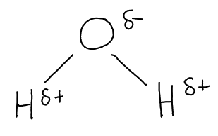

# Mark Schemes — Gas Exchange, Cell Membranes & Transport
**2. Membranes, Proteins, DNA & Gene Expression** · Edexcel International A Level (IAL) Biology (YBI11)

## Q1 — medium — 12 marks · exam-questions

### 5((a)) — 3 marks
This electron micrograph provides evidence for the structure of the cell membrane because...

- It shows that it is made of two layers of phospholipid / a bilayer; **[1 mark]**
- The size of a phospholipid is in the range 2.05 nm to 2.65 nm; **[1 mark]**
- Therefore the width of the membrane (5 nm) is within a bilayer range (of 4.1 nm to 5.3 nm); **[1 mark]**

**[Total: 3 marks]**

> *Keep in mind that the question is specifically asking you to use evidence from the question stem to support your answer, so therefore any information taken from your own knowledge alone cannot gain marks here. *

### 5((b)) — 3 marks
An explanation of the location of cholesterol in cell membranes is...

Any **three **of the following:

- Cholesterol is a non-polar/hydrophobic molecule; **[1 mark]**
- Fatty acid tails are non-polar/hydrophobic; **[1 mark]**
- Cholesterol will be located within the fatty acid tails/non-polar/hydrophobic part of the membrane; **[1 mark]**
- -OH group will be located near the phosphate heads; **[1 mark]**

**[Total: 3 marks] **

> *Because the question asks you to explain the location of cholesterol it means that you do not need to go into detail about the function of cholesterol because that doesn't answer the question. *

> *It is easy to lose marks here for imprecise language, for example describing the cholesterol as being in the phospholipid layer rather than between the fatty acid tails, or describing the fatty acid tails as hydrocarbon tails, which is not clear enough (since hydrocarbon tail was used as a label on part of the cholesterol molecule).*

### 5((c)) — 6 marks
(i) The dipolar nature of water can be explained by...

- Small / weak / delta / partial positive charge on hydrogen; **[1 mark]**
- Small / weak / delta / partial negative charge on oxygen; **[1 mark]**

*Accept a labelled diagram showing the partial charges such as the one below:*

(ii) The permeability of cell membranes to each chemical shown in the diagram can be explained by...

- Water is small enough to move by osmosis/diffusion (between the phospholipids); **[1 mark]**
- Steroid (is non-polar so) can diffuse through the membrane/phospholipids; **[1 mark]**
- Glucose (is polar so) passes through protein channels / carrier proteins / by facilitated diffusion; **[1 mark]**
- Ions (are polar so) pass through protein channels / carrier proteins / by facilitated diffusion/active transport; **[1 mark]**

***Accept ****description of water moving through protein channels/aquaporins*

***Accept**** steroid is not repelled by fatty acid tails*

***Accept ****glucose moves by active transport*

***Accept ****ions are repelled by fatty acid tails so cannot get through membrane*

**[Total: 6 marks]**

> *This is an explain question so make sure to avoid the trap of just describing the information in the figure without giving a thorough explanation as to why the permeabilities vary. References to both size and method of transport are important to gain marks here. *

## Q2 — medium — 10 marks · exam-questions

### 6((a)) — 4 marks
(i) This graph shows that there is a correlation between smoking and death rate from lung cancer in men by...

- Because both lines rise <u>and</u> fall (in parallel); **[1 mark]**
- But the line for deaths from lung cancer is a period of time after the line for cigarettes smoked / there is a delay; **[1 mark]**

(ii) This will affect gas exchange in people with emphysema by...

- Alveoli will have a smaller surface area (to volume ratio) / smaller area for gas exchange; **[1 mark]**
- Therefore the (rate of) gas exchange/diffusion of oxygen into the bloodstream will be slower; **[1 mark]**

**[Total: 4 marks]**

### 6((b)) — 6 marks
The factors that would determine the rate of diffusion of gases between the air and the tissues of the embryo are...

> *This is a level-marked question, meaning that this is is marked **according to the levels table**. The indicative content points below the table are **not** to be used in the usual '**one point one mark**' way, but should be used together with the levels table to determine the number of marks which should be awarded. *

| **Level 1** Up to 4 points from anywhere; 2 points for **[1 mark]** and 4 points for **[2 marks]**. |
|---|
| **Level 2** 5 points or more, from two best categories; 5 points for **[3 marks]**, 6 points for **[4 marks]**. |
| **Level 3** As level 2 plus up to 2 points from third category; 7 points for **[5 marks]** and 8 points for **[6 marks].** |

*Category 1: Points about the egg*

- Number/density of pores
- Width/size of pores
- Area of pores
- Thickness of shell and membranes
- Rate of respiration of developing embryo
- Rate of blood flow of embryo
- Temperature
- Shell is impermeable / pores are permeable
- Shell supports membrane so there is a large surface area for gas exchange

*Category 2: Theory points*

- Fick's Law of diffusion can be used to calculate diffusion rate
- State Fick’s Law; **[3 marks ****OR ****the statements below]**

  - because rate of diffusion depends on surface area
  - because rate of diffusion depends on diffusion distance
  - because rate of diffusion depends on concentration gradient
- Speed of molecules depends on the temperature
- Because the rate of diffusion depends on what substances oxygen is passing through e.g. water/air
- Diffusion coefficient through air
- Diffusion coefficient through membranes

*Category 3: Explanation points*

- Increasing surface area (or any named factor increasing this) causes an increase in the rate of diffusion
- Increasing distance (or any named factor increasing this) causes a decrease in the rate of diffusion
- Increasing concentration gradient (or any named factor increasing this) causes an increase in the rate of diffusion
- Increasing temperature increases the rate of diffusion

***Accept ****opposite statement for any point from category 3 e.g. decreasing SA causes decrease in rate of diffusion*

**[Total: 6 marks]**

> *When answering this style of question it is important to follow through the explanation, for example weaker answers might recognise that thickness of shell is important, but might forget to link it to diffusion distance or to the effect on rate. It would be incorrect to refer to 'less' diffusion, instead you should refer to a lower **rate** of diffusion.*

## Q3 — medium — 13 marks · exam-questions

### 8() — 3 marks
(i) The correct answer is **D** because...

The width of the phospholipid bilayer is usually somewhere between 5-10 nm, so a single phospholipid measuring 2 nm in length makes logical sense.

> *cm (A) and mm (B) are much larger units that we frequently use to measure everyday objects, so it would make no sense for a biological molecule to measure 2 of either of these units.*

> *While we often measure cells and organelles in μm (C), you should be aware that eukaryotic cells range in size between around 10-100 μm. It therefore would not make sense for a single phospholipid to measure 2 μm; the cell membrane of a cell with a 10 μm diameter would take up most of the cell! Prokaryotic cells are even smaller so wouldn't even have space for such a cell membrane.*

(ii) The correct answer is **B** because...

The part of a cell membrane that contains a phosphate group is the phosphate head of a phospholipid. Q is a phosphate head and T is a whole phospholipid (which contains a phosphate head).

> *R is a fatty acid tail which contains C, H, and O and therefore does not contain a phosphate group.*

> *S is cholesterol and also contains C, H, and O. It therefore also does not contain a phosphate group.*

(iii) The correct answer is **D** because...

The role of cholesterol is to regulate the fluidity of the cell membrane. When the ratio of cholesterol (S) to phospholipids (T) changes, the fluidity of the cell membrane will also change.

> *A is incorrect because there will always be one phosphate head (Q) to every complete phospholipid (T).*

> *B is incorrect because there will always be two fatty acid tails (R) to every phosphate head (Q) within a phospholipid bilayer.*

> *C is incorrect because there will always be two fatty acid tails (R) to every complete phospholipid (T).*

> *The ratios in A, B, and C do not change, so it is not possible for changes in these ratios to influence membrane fluidity.*

**[Total: 3 marks]**

### 8((b)) — 4 marks
The role of the primary structure in determining the properties of the protein labelled in the diagram is...

- The sequence of amino acids determines the tertiary structure of the protein; **[1 mark]**
- (The primary structure) determines the position / types of bonds that form between the <u>R groups</u> (of amino acids); **[1 mark]**
- Hydrophobic / non-polar groups/amino acids are in the (external) part of the protein that is embedded in the fatty acid tails; **[1 mark]**
- Hydrophilic / polar groups/amino acids are in the (external) part of the protein that is facing the cytoplasm / aqueous environment; **[1 mark]**

**[Total: 4 marks]**

> *It is tempting here to write a detailed description of the levels of protein structure, but you should note that the question refers specifically to the 'properties of the **protein in the diagram**'. You should therefore consider the types of properties that such a membrane protein would need; it will need regions that can interact with the inside of the bilayer, and regions that can interact with the cytoplasm.*

> *In order to interact with these different cellular environments the protein will need **hydrophobic and hydrophilic regions**; hydrophobic regions will interact with the hydrophobic fatty acid tails within the bilayer while hydrophilic regions will interact with the watery cytoplasm of the cell.*

### 8((c)) — 6 marks
> *This is a **level-marked question**, meaning that it is marked** according to the levels table**. The indicative content points below the table are **not** to be used in the usual **'one point = one mark'** way, but should be used together with the levels table to determine the number of marks which should be awarded.*

| **Level 1** | **1 mark** | 1 relevant comment |
|---|---|---|
| **Level 1** | **2 marks** | 3 relevant comments |
| **Level 2** | **3 marks** | 4 relevant comments **AND** comments relate to at least **two** different molecules |
| **Level 2** | **4 marks** | 5 relevant comments **AND** comments relate to at least **two** different molecules |
| **Level 3** | **5 marks** | 6 relevant comments **AND** comments relate to at least **three** different molecules |
| **Level 3** | **6 marks** | 7 relevant comments **AND** comments relate to **all four** different molecules |

c) Each of these molecules enters the cell by a different mechanism because...

*Indicative content relating to ****molecule E***

- Molecule E is water
- (Water) enters the cell by osmosis
- Molecules F, G and H lower the water potential (of the cell)
- E moves down the water potential gradient

*Indicative content relating to ****molecule F***

- Molecule F is polar **SO** cannot pass between the fatty acid tails
- (Molecule F therefore) enters the cell by facilitated diffusion
- F diffuses through a protein which provides a polar channel
- F moves down its concentration gradient / is at a higher concentration outside the cell

*Indicative content relating to ****molecule G***

- Molecule G is non-polar **SO** it can pass between the fatty acid tails
- G enters by (simple) diffusion
- G moves down its concentration gradient / is at a higher concentration outside the cell

*Indicative content relating to ****molecule H***

- H enters by active transport
- H moves against its concentration gradient / is at a higher concentration inside the cell
- H requires ATP **AND** a (transport/carrier) protein to pump it across the membrane

**[Total: 6 marks]**

## Q4 — medium — 12 marks · exam-questions

### 6((a)) — 3 marks
(i) **The correct answer is ****D**

- Active transport uses carrier proteins in the cell membrane
- Facilitated diffusion also uses carrier proteins or channel proteins
- Diffusion does not use proteins

(ii) **The correct answer is ****B**

- Only active transport requires energy
- Facilitated diffusion and diffusion are both passive processes that do not require energy

(iii) **The correct answer is ****B**

- Solutes move down a concentration gradient in diffusion and facilitated diffusion
- In active transport solutes move against a concentration gradient from an area where they are in low concentration to high concentration

**[Total: 3 marks]**

### 6((b)) — 3 marks
A explanation of the definition of osmosis is...

- 'Free water molecules' because some water molecules are restricted/prevented from movement **OR** some water molecules surround / are associated with solute particles so are not free to move around on their own; **[1 mark]**
- 'Partially permeable membrane' because membrane allows some (types of) molecules to pass through it; **[1 mark]**
- 'Down a water potential gradient' because water molecules move from a dilute solution to a more concentrated one / from a high osmotic potential to a lower one / from a high solute potential to a lower one; **[1 mark]**

**[Total: 3 marks]**

> *Remember to use the term 'water potential' to convey the 'concentration' of water in a particular area. The more the solute concentration, the lower the water potential. *

### 6((c)) — 6 marks
An explanation of the changes in water content and amino acid content in the muscle cells of the crabs in this investigation is...

> *This is a level-marked question, meaning that this is is marked **according to the levels table**. The indicative content points below the table are **not** to be used in the usual '**one point one mark**' way, but should be used together with the levels table to determine the number of marks which should be awarded. *

| **Level 1 ** | **[1 mark]** - A simple description (D) of one graph |
|---|---|
| **[2 marks] - A simple description (D) of both graphs** |   |
| **Level 2 ** | **[3 marks]** - A level 1 answer and a simple explanation (E) of one graph |
| **[4 marks] - A level 1 answer and a simple explanation (E) of both graphs** |   |
| **Level 3** | **[5 marks]** - **A level 2 answer and a** simple explanation (E) of one graph and a more detailed explanation (E) for the other graph |
| **[6 marks] **- A** level 2 answer and a** more detailed explanation (E) for both graphs |   |

**D = description** 
**E = explanation**

*Indicative content:*

- Water content decreases when crabs first moved (D)
- Because water passes out of cells by osmosis/description of osmosis (E)
- Water content then increases gradually (D)
- Because of the increase in amino acid concentration (E)
- Amino acid increases (D)
- Sharply at first and then rate decreases (D)
- Because insoluble/muscle proteins broken down into amino acids (E)
- By hydrolysis (E)
- Because crab eats more protein/amino acids (E)
- Which is digested into amino acids (E)
- Which are taken up into the cells by active transport / facilitated diffusion (from the blood) (E)
- Water content increases because the amino acid content increase (E)
- Which makes the cytoplasm more concentrated than the sea water (E)
- Therefore crabs do not die from dehydration (E)

**[Total: 6 marks]**

> *A big hint in this question is that when two sets of data are plotted on the same graph it is very highly likely that the two sets of data are related. The first two parts of this question also give you information about the fact that this question is about cell transport mechanisms. For example, if you refer to the proteins being used for reproduction, then that is not relevant to the context of this question. *

## Q5 — hard — 10 marks · exam-questions

### 1() — 1 marks
**Correct answer: B** — 1 and 3 only

**Final answer:** **The correct answer is B.**

- **Statement 1 is correct**: cholesterol acts as a fluidity buffer; at high temperatures it interacts with the fatty acid tails, restricting phospholipid movement and preventing the membrane from becoming too fluid
- **Statement 3 is correct**: carbohydrate chains project only into the extracellular environment; they are not found on the intracellular side of the cell surface membrane, as their primary roles are cell-to-cell recognition, adhesion, and acting as receptors

**Statement 2 is incorrect**: while transmembrane proteins are held in place by hydrophobic interactions, these interactions occur between the protein's non-polar amino acid R-groups and the hydrophobic *fatty acid tails* found in the core of the membrane. The statement incorrectly claims the hydrophobic interactions occur with the hydrophilic phosphate heads.

### 2() — 2 marks
The mean rate in seconds can be calculated as follows:

- Determine the change in absorbance over 45 minutes

  - 0 a.u. to 1.35 a.u.
  - A change of 1.35 a.u.
- Convert time to seconds

45 × 60 = 2700 seconds

- Calculate the rate

rate = 1.35 ÷ 2700

= 0.0005 **[1 mark]**

- Convert to standard form

**5.0 × 10⁻⁴**** [1 mark]**

> **[mark-scheme]**
> Award full marks for the correct answer in the absence of working.

### 3() — 3 marks
> **[mark-scheme]**
> Any **three** from:
> 
> - The non-polar part of ethanol interacts with the hydrophobic (fatty acid) tails
> - The -OH group/polar part of ethanol forms hydrogen bonds / hydrophilic interactions with the (phosphate) heads
> - (Small) ethanol molecules move between the phospholipids **SO** disrupt the bilayer (leaving gaps in the membrane)
> - The -OH groups of ethanol disrupt hydrogen bonds within membrane proteins **SO** membrane proteins denature / change shape (leaving gaps in the membrane)
> 
> **[3 marks]**
> 
> Do not accept ethanol denatures the phospholipids (phospholipids are not proteins)

> **[exam-tip]**
> Suggest questions reward you for applying what you already know to an unfamiliar context. To answer this one, you need to draw on three separate areas of the specification: polarity and the interactions between polar and non-polar regions, the role of -OH groups in hydrogen bonding, and the bonds that maintain the 3D structure of proteins. Treat each property given in the question as a signpost towards a specific area of your knowledge.

### 4() — 4 marks
> **[mark-scheme]**
> (i) Enzymes leave the cell by exocytosis rather than by diffusion across the cell membrane because:
> 
> Any **two** from:
> 
> - Digestive enzymes are proteins, which are too large to cross / diffuse across the phospholipid bilayer
> - (Globular) digestive enzymes have hydrophilic R groups on their outer surface **SO** cannot cross the hydrophobic core of the bilayer
> - Exocytosis releases many enzymes at once **SO** sufficient enzymes are available for digestion
> 
> **[2 marks]**
> 
> (ii) This process requires a constant supply of oxygen because:
> 
> - Exocytosis requires ATP / energy** [1 mark]**
> - Oxygen is required for aerobic respiration **SO** ATP can be produced (at a sufficient rate) **[1 mark]**

> **[exam-tip]**
> To answer this question, you need to pull together ideas from several parts of the specification: the structure of globular proteins like enzymes, what the phospholipid bilayer does and doesn't let through, and the different forms of membrane transport available to the cell. Don't forget to apply these ideas to the specific scenario — the third marking point for part (i) asks you to think about why exocytosis in particular suits the job of secreting digestive enzymes.

## Q6 — hard — 9 marks · exam-questions

### 1() — 3 marks
To calculate the SA:V ratio of a healthy alveolus:

- Determine the radius from the table

r =$\frac{200}{2}$

= 100 μm

- Calculate the surface area

surface area = 4πr²

= 4 x π x 1002

= 125 663.7 μm2

- Calculate the volume

volume = ($\frac{4}{3}$)πr³

= ($\frac{4}{3}$) x π x 1003

= 4 188 790.2

- Calculate the SA:V ratio

= $\frac{125664}{4188790}\,$

=  0.0300 μm⁻¹

**Final answer:** **0.0300 : 1**

> **[mark-scheme]**
> Award marks as follows:
> 
> - 125 663.7 / 125 664 **OR** 4 188 790.2 / 4 188 790 **[1 mark]**
> - 0.0300 **[1 mark]**
> - 0.0300 : 1** ****[1 mark]**
> 
> Award full marks for the correct answer in the absence of other calculations
> 
> Award 2 marks for 0.0300

> **[exam-tip]**
> A very common mistake here is to use the diameter (200 μm) instead of the radius (100 μm) in the formulae — always halve the diameter first.
> 
> Pay close attention to the instruction regarding significant figures — 0.03 is only 1 significant figure, whereas 0.0300 is 3 significant figures.

### 2() — 6 marks
This question assesses the quality of your written communication (indicated by *) and should be assessed using levelled criteria.

| **Level** | **Mark Range** | **Descriptor** |
|---|---|---|
| **Level 3** | 5–6 | Comprehensive and sustained account applying Fick's Law to both surface area and thickness using data from the table, with a clear explanation of reduced oxygen diffusion and well-linked consequences for haemoglobin saturation and fatigue.. |
| **Level 2** | 3–4 | Application of Fick's Law to both surface area and thickness using data from the table in a limited way, or detailed application to one factor only. Some reference to reduced oxygen diffusion and its effects on haemoglobin saturation and fatigue, but links not fully developed. |
| **Level 1** | 1–2 | Some application of Fick's Law to at least one factor using data from the table, with limited reference to oxygen diffusion, haemoglobin saturation or fatigue and weak or no linkage between them. |
| **Level 0** | 0 | No rewardable material. |

**Indicative content:**

Fick's Law:

- Fick's Law states that rate of diffusion is proportional to (surface area × concentration difference) ÷ thickness of the gas exchange surface
- Fibrotic alveoli have a smaller diameter (120 μm vs 200 μm), so have a reduced surface area for gas exchange
- A smaller surface area decreases the rate of oxygen diffusion into the blood
- Fibrotic alveolar walls are thicker (3.2 μm vs 0.5 μm), so have a longer diffusion distance
- A longer diffusion distance decreases the rate of oxygen diffusion into the blood

Consequences for saturation of haemoglobin and fatigue:

- Reduced rate of oxygen diffusion means blood oxygen partial pressure is lower
- Lower oxygen partial pressure results in reduced saturation of haemoglobin / fewer oxygen molecules bound per haemoglobin
- Less oxygen is transported to respiring tissues
- Tissues receive less oxygen, reducing the rate of aerobic respiration and ATP production
- Reduced ATP availability leads to fatigue
