# Exam Questions — Gas Exchange, Cell Membranes & Transport
**2. Membranes, Proteins, DNA & Gene Expression** · Edexcel International A Level (IAL) Biology (YBI11)
> Source: [https://www.savemyexams.com/international-a-level/biology/edexcel/18/topic-questions/2-membranes-proteins-dna-and-gene-expression/gas-exchange-cell-membranes-and-transport/exam-questions/](https://www.savemyexams.com/international-a-level/biology/edexcel/18/topic-questions/2-membranes-proteins-dna-and-gene-expression/gas-exchange-cell-membranes-and-transport/exam-questions/) · 6 questions · total 66 marks

## Q1 — medium — 12 marks · exam-questions

### 5((a)) — 3 marks — command: explain — structured — from paper Jan 2021 · WBI11/01
The structure and properties of the cell membrane are important in controlling which molecules can enter and leave a cell.

The image shows part of a cell membrane, as seen using an electron microscope.

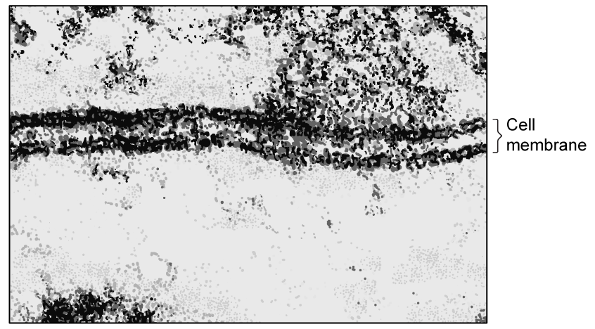

The width of this cell membrane is 5.00 nm.

A phosphate head of a phospholipid is between 0.8 and 0.9 nm in diameter and the fatty acid tails are between 1.25 and 1.75 nm long.

Explain how this electron micrograph provides evidence for the structure of the cell membrane.

Use the information given to support your answer.

### 5((b)) — 3 marks — command: explain — structured — from paper Jan 2021 · WBI11/01
Cell membranes contain cholesterol.

The molecular formula of cholesterol is C27H46O.

The diagram shows a cholesterol molecule.

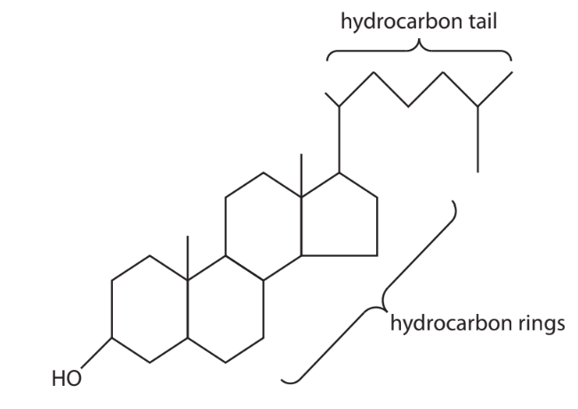

Explain the location of cholesterol in cell membranes.

Use the information in the diagram to support your answer.

### 5((c)) — 6 marks — command: multiple — structured — from paper Jan 2021 · WBI11/01
The diagram shows the permeability of cell membranes to some chemicals.

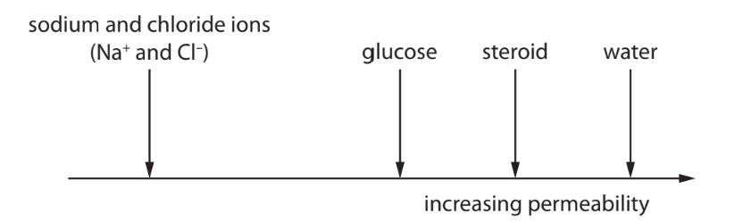

The sodium and chloride ions, glucose and water are polar chemicals.

A steroid is a non-polar chemical.

(i) Describe the dipolar nature of water.

**(2)**

(ii) Explain the permeability of cell membranes to each chemical shown in the diagram.

**(4)**

## Q2 — medium — 10 marks · exam-questions

### 6((a)) — 4 marks — command: explain — structured — from paper Jan 2021 · WBI11/01
Gas exchange surfaces have specific adaptations.

Lungs contain the gas exchange surfaces of humans.

Smoking causes lung damage.

(i) The graph shows that there is a correlation between smoking and death rate from lung cancer in men.

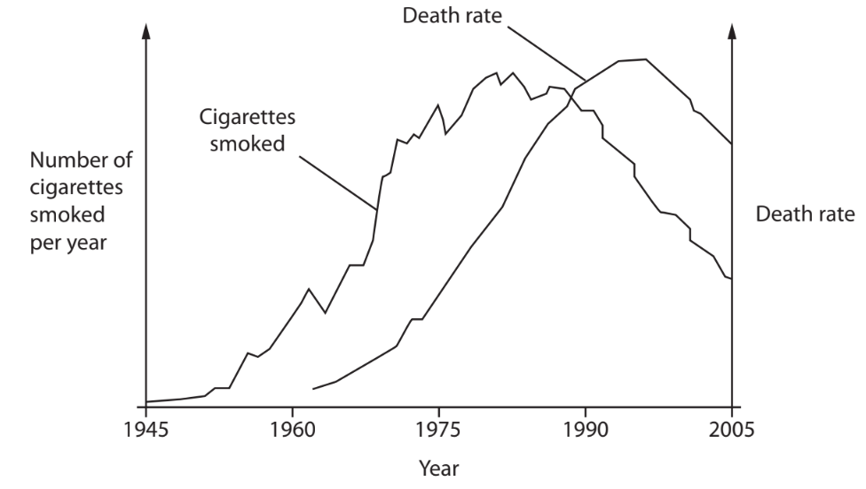

Explain how this graph shows that there is a correlation between smoking and death rate from lung cancer in men.

**(2)**

(ii) Smoking is a cause of emphysema.

People with emphysema have weakened alveoli that can collapse, creating fewer but larger alveoli.

Explain how this will affect gas exchange in people with emphysema.

**(2)**

### 6((b)) — 6 marks — command: explain — structured — from paper Jan 2021 · WBI11/01
Bird embryos develop inside hard-shelled eggs.

Gas exchange occurs across the shell of the egg. The oxygen diffuses into the bloodstream of the developing embryo and carbon dioxide diffuses back out.

The diagram shows a section through the shell of an egg.

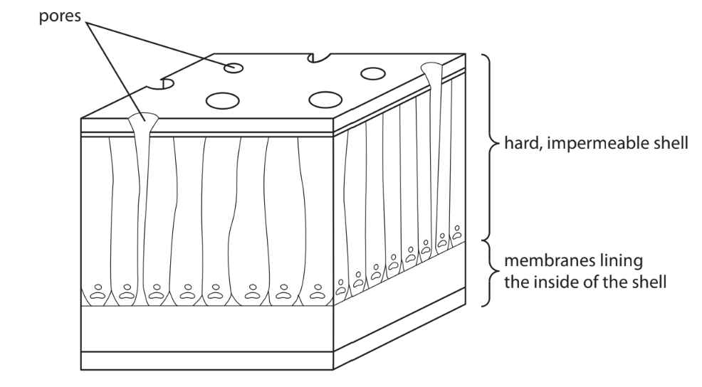

The thickness of the egg shell is 0.5 mm. The density of the pores in the shell varies from 40 to 400 per cm2.

Explain the factors that would determine the rate of diffusion of gases between the air and the tissues of the embryo.

Use the information in the diagram, the question and your own knowledge to support your answer.

## Q3 — medium — 13 marks · exam-questions

### 8() — 3 marks — command: multiple — structured — from paper June 2021 · WBI11/01
The structure of the cell membrane affects the properties of the cell membrane.

The diagram shows the structure of part of a cell membrane.

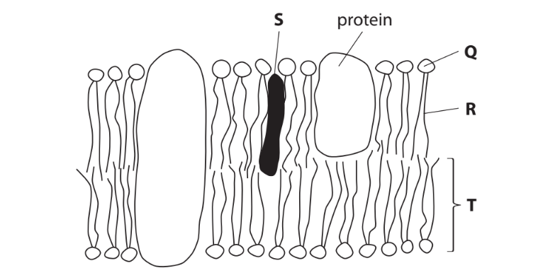

(i) The magnification of this diagram is 1×107.

The structure labelled** T** is 2 units long.

What is this unit?

**(1)**

| ☐ | **A** | cm |
|---|---|---|
| ☐ | **B** | mm |
| ☐ | **C** | μm |
| ☐ | **D** | nm |

(ii) Which structures contain a phosphate group?

**(1)**

| ☐ | **A** | **Q** and **R** |
|---|---|---|
| ☐ | **B** | **Q** and** T** |
| ☐ | **C** | **R** and **S** |
| ☐ | **D** | **S** and **T** |

(iii) Which ratio of the structures affects the fluidity of this membrane?

**(1)**

| ☐ | **A** | **Q:T** |
|---|---|---|
| ☐ | **B** | **R:Q ** |
| ☐ | **C** | **R:T** |
| ☐ | **D** | **S:T** |

### 8((b)) — 4 marks — command: explain — structured — from paper June 2021 · WBI11/01
Explain the role of the primary structure in determining the properties of the protein labelled in the diagram.

### 8((c)) — 6 marks — command: explain — structured — from paper June 2021 · WBI11/01
The diagram and table give information about some molecules found inside and outside a cell.

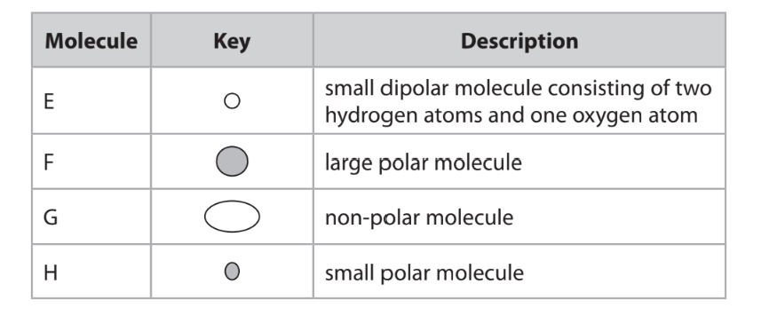

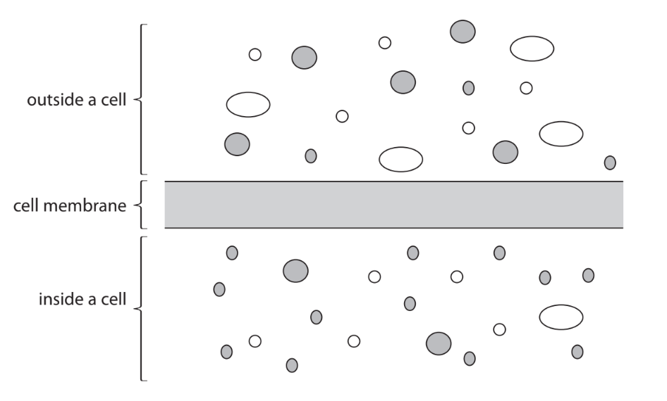

Explain why each of these molecules **enters** the cell by a different mechanism.

Use the information in the table and the diagram to support your answer.

## Q4 — medium — 12 marks · exam-questions

### 6((a)) — 3 marks — command: which — structured — from paper Jan 2022 · WBI11/01
The cell membrane controls which substances can move into the cell or out of the cell.

Processes by which substances can move into a cell or out of a cell include diffusion, facilitated diffusion, active transport and osmosis.

A Venn diagram can be used to show the similarities and differences between diffusion, facilitated diffusion and active transport.

Statements about similarities can be written in the numbered parts of the circles that overlap.

For example, statements about similarities shared by all three processes would be written in Part IV.

Statements about differences can be written in the numbered parts of the circles that do not overlap.

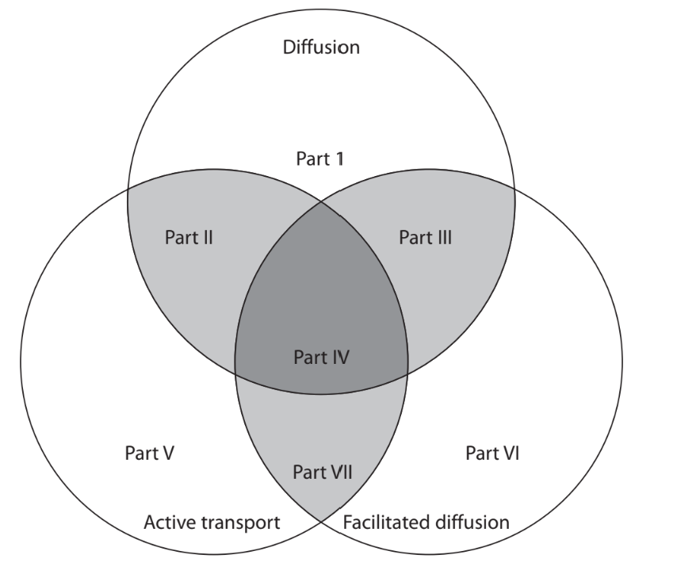

(i) Which part would contain the statement: uses proteins?

**(1)**

☐     **A**     II

☐      **B    ** III

☐      **C     **IV

☐       **D**     VII

(ii) Which part would contain the statement: needs energy in the form of ATP?

**(1)**

☐     **A**     II

☐      **B    ** V

☐      **C     **VI

☐       **D**     VII

(iii) Which part would contain the statement: solutes can only move down a concentration gradient?

**(1)**

☐     **A**     II

☐      **B    ** III

☐      **C     **V

☐       **D**     VII

### 6((b)) — 3 marks — command: explain — structured — from paper Jan 2022 · WBI11/01
Osmosis can be defined as the movement of free water molecules through a partially permeable membrane, down a water potential gradient.

Explain this definition.

### 6((c)) — 6 marks — command: explain — structured — from paper Jan 2022 · WBI11/01
The photograph shows a Chinese mitten crab.

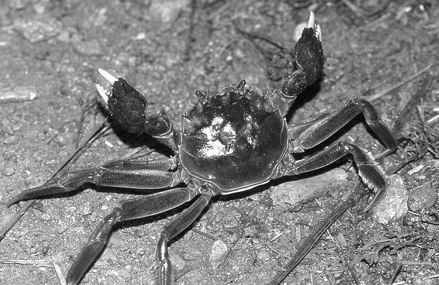

Christian Fischer, CC BY-SA 3.0 <https://creativecommons.org/licenses/by-sa/3.0>, via Wikimedia Commons

Mitten crabs spend most of their lives in fresh water and only return to the sea to breed.

In an investigation, mitten crabs were kept in fresh water and then moved into sea water.

The water content and amino acid content in the muscle cells of these crabs were measured for 15 days after moving them from fresh water into sea water.

The graph shows the results of this investigation.

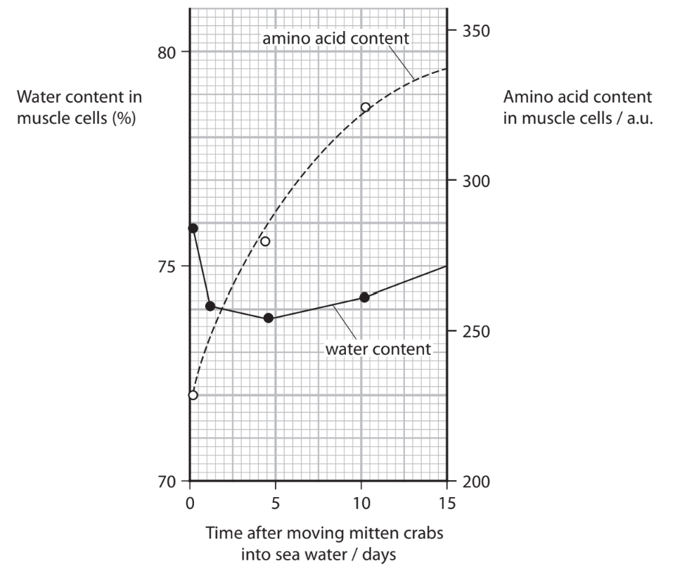

Sea water has a higher concentration of salt than fresh water.

Explain the changes in water content and amino acid content in the muscle cells of the crabs in this investigation.

## Q5 — hard — 10 marks · exam-questions

### 1() — 1 mark — multiple_choice
The fluid mosaic model describes the dynamic and complex arrangement of molecules in cell membranes.

A student made three statements regarding the components of the cell surface membrane:

1. Cholesterol decreases membrane fluidity at high temperatures by restricting the movement of the phospholipids
2. Transmembrane proteins are held within the bilayer by hydrophobic interactions between their amino acid R-groups and the phosphate heads.
3. The carbohydrate chains of glycolipids and glycoproteins are exclusively located on the extracellular (outer) leaflet of the membrane.

Which of the following options identifies the correct statements?
- **A.** 1 only
- **B.** 1 and 3 only
- **C.** 2 and 3 only
- **D.** 1, 2 and 3

### 2() — 2 marks — command: calculate — structured
A researcher placed a standard-sized piece of beetroot tissue into 10 cm³ of ethanol for 45 minutes. The absorbance of the surrounding solution was 0 a.u. at the start of the time period and 1.35 a.u. after 45 minutes.

Calculate the mean rate of pigment leakage in a.u. s⁻¹.

Give your answer in standard form. Show your working.

### 3() — 3 marks — command: suggest — structured
Ethanol is a small molecule that has both polar and non-polar properties. The polar part of ethanol is a hydroxyl (-OH) group.

Using this information, suggest how high concentrations of ethanol increase the permeability of the cell membrane.

### 4() — 4 marks — command: explain — structured
The phospholipid bilayer enables large molecules to leave the cell by exocytosis.

Acinar cells in the pancreas continuously secrete large digestive enzymes into the pancreatic duct by exocytosis.

(i) Explain why these enzymes leave the cell by exocytosis rather than by diffusion across the cell membrane.

[2]

(ii) Explain why this process requires a constant supply of oxygen.

[2]

## Q6 — hard — 9 marks · exam-questions

### 1() — 3 marks — command: calculate — structured
Pulmonary fibrosis is a condition in which collagen accumulates in the walls of the alveoli, progressively reducing lung function.

The table below shows the mean alveolar diameter and mean alveolar wall thickness in healthy individuals and in individuals with pulmonary fibrosis.

| Feature | Healthy | Pulmonary fibrosis |
|---|---|---|
| Mean alveolar diameter (μm) | 200 | 120 |
| Mean alveolar wall thickness (μm) | 0.5 | 3.2 |

An alveolus can be modelled as a sphere.

Using the data in the table and the formulae below, calculate the surface area to volume ratio of a healthy alveolus.

- Surface area = 4πr²
- Volume = ($\frac{4}{3}$)πr³

Give your answer to 3 significant figures.

### 2() — 6 marks — command: explain — structured
Individuals with pulmonary fibrosis often experience fatigue.

*Using Fick's Law and the data in the table, explain how the changes to the alveolar membrane in pulmonary fibrosis affect diffusion and the saturation of haemoglobin, and how this leads to fatigue.
