# Mark Schemes — Inheritance
**2. Membranes, Proteins, DNA & Gene Expression** · Edexcel International A Level (IAL) Biology (YBI11)

## Q1 — medium — 6 marks · exam-questions

### 2((a)) — 1 marks
The polysaccharide stored by the liver is **C** because...

**Glucose is stored in the form of glycogen in the liver.**

> *Amylopectin (A) is a form of starch and is a glucose storage molecule found in plant cells.*

> *Cellulose (B) is a structural carbohydrate found in plant cell walls.*

> *Starch (D) is the storage polysaccharide of plants.*

**[Total: 1 mark]**

### 2((b)) — 1 marks
The correct answer is **D** because...

**Lactose is a dissaccharide containing glucose and galactose.**

**Sucrose is a dissacharide containing glucose and fructose.**

> *Both fructose and galactose are monosaccharides so cannot be digested further to release glucose.*

**[Total: 1 mark]**

### 2() — 4 marks
(i) The number of people who have undiagnosed diabetes is...

- 190 900 000 / 191 000 000 / 191 million / 1.909 x 108 / 1.91 x 108; **[1 mark]**

> *The number of people with undiagnosed diabetes can be calculated as follows:*

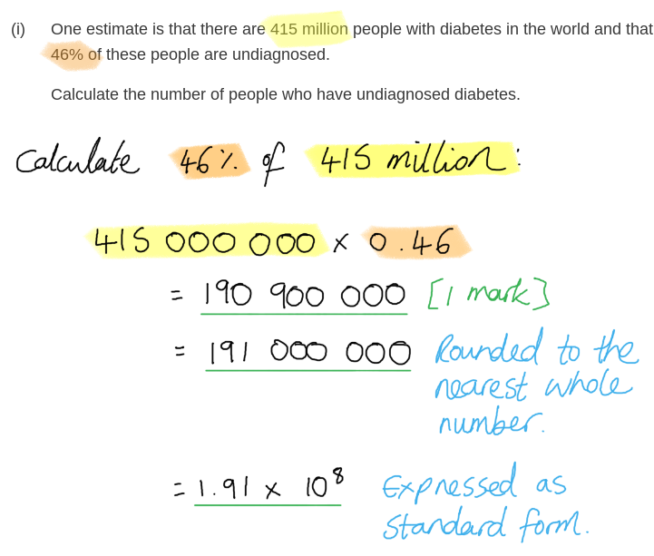

(ii) Doctors are more likely to screen individuals once they develop diabetes than use methods such as prenatal testing because...

Any **three** of the following:

- (Prenatal testing) can cause abortion / the fetus to abort; **[1 mark]**
- (The patient already having diabetes) avoids the risk of false negative or false positive results (that could then influence a decision around continuing or terminating a pregnancy); **[1 mark]**
- Complications can arise if another genetic condition is found (during the screening process); **[1 mark]**
- An individual could live a healthy life (despite a genetic predisposition to diabetes); **[1 mark]**
- There are ethical issues around destroying embryos (when carrying out screening of embryos during IVF); **[1 mark]**

**[Total: 4 marks]**

## Q2 — medium — 6 marks · exam-questions

### 2((a)) — 1 marks
The term genotype means...

- The combination of <u>alleles</u>; **[1 mark]**

**[Total: 1 mark]**

> *Genotype is a keyword definition that is worth committing to memory. It is easy to write vague and imprecise definitions of a keyword such as this, for example, 'genotype is the genetic make-up of an organism' which will not be precise enough to earn the mark. It is the combination of all the **alleles** (**not** genes - be aware of that distinction) that an organism possesses. *

### 2((b)) — 1 marks
The probability that the next tiger born to these two parents will be female is...

- 0.5 **OR** 50 % **OR** 50:50 **OR** 1 in 2 **OR** 1/2; **[1 mark]**

**[Total: 1 mark]**

*An important clue is the command words, which is 'state'. This means that you don't need to calculate anything, and the fact that it's a ***[1 mark]*** question gives a further hint that you don't need to do much to earn this mark.*

> *You should be aware that there is **always a 50 % probability** of offspring being born either male or female.*

### 2((c)) — 3 marks
The expected phenotypic ratio of orange tigers to white tigers born to the parents shown in this pedigree diagram is...

- Parent genotypes showing as heterozygous; **[1 mark]**
- Offspring genotypesclearly shown; **[1 mark]**
- 3:1 (orange to white) **OR** 1:3 (white to orange); **[1 mark]**

***Accept**** any pair of letters in upper and lower case to represent alleles in Punnett square.*

***Accept**** word notation, e.g. 3 to 1, for ratios.*

**[Total: 3 marks]**

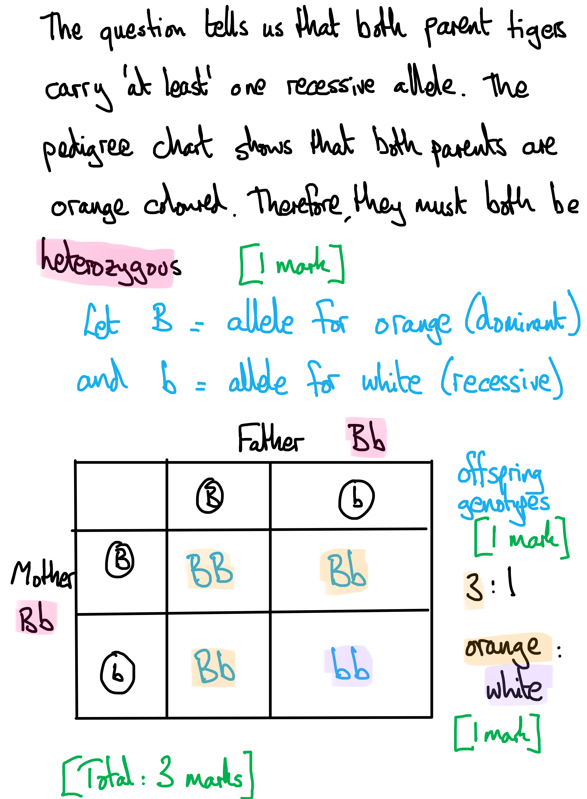

> *You are left to select your own letters to denote the dominant and recessive alleles. It is always wise to pick a letter that is **easily distinguishable** from its lower case version so that your writing is clear. E.g. Bb is a good choice, as is Rr. Cc or Oo is not a good choice because these letters look very similar in uppercase and lowercase. *

### 2((d)) — 1 marks
The incidence of white tigers in captivity is...

- 1 in 30 / 0.03 / 3.3 %; **[1 mark]**

***Allow**** 0.03 recurring.*

**[Total: 1 mark]**

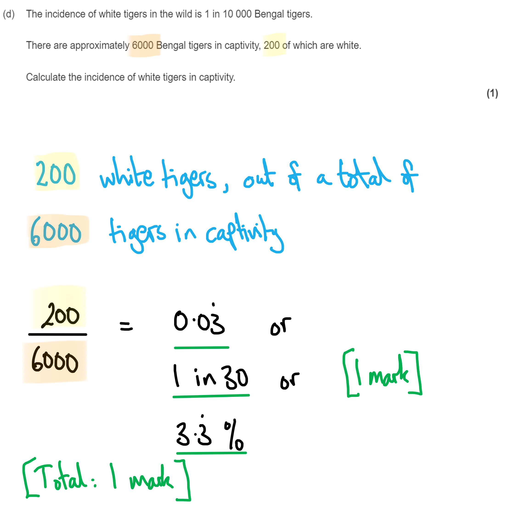

## Q3 — medium — 9 marks · exam-questions

### 4((a)) — 1 marks
The diagram should be completed as follows:

- Individual 7 = □ **AND** individual 8 = ■ **AND** individual 9 = ◯; **[1 mark]**

**[Total: 1 mark]**

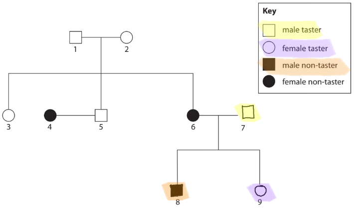

### 4() — 4 marks
(i) The difference between the terms gene and allele and information in the pedigree diagram that illustrates this is...

- A gene is a sequence of bases that codes for a polypeptide/protein **AND** (the diagram shows that there is a) gene for a bitter taste receptor (protein); **[1 mark]**
- An allele is a version of a gene **AND** (the diagram shows that some individuals have a) tasting and some have a non-tasting receptor (protein); **[1 mark]**

*Award 1 mark for two correct definitions but no examples.*

(ii) The difference between the terms genotype and phenotype and information in the pedigree diagram that illustrates this is...

- A genotype is the combination of alleles (that an individual has) **AND** (within the diagram there are individuals with the genotypes) TT / Tt / tt; **[1 mark]**
- A phenotype is the observable characteristics (of an individual) / characteristic that can be measured **AND** (within the diagram there are individuals with the phenotypes) taster / non-taster; **[1 mark]**

*Award 1 mark for two correct definitions but no examples.*

***Accept**** any combination of letters for marking point 1.*

**[Total: 4 marks]**

> *It is essential here that you answer both parts of the question to gain full marks; give clear definitions for both key terms **and** point to how these key terms can be applied in real life in the pedigree diagram shown.*

### 4((c)) — 2 marks
The dominant allele is...

- (The allele that codes for a receptor that) can taste bitter taste; **[1 mark]**

Information from the diagram that supports this is...

- Individuals 1 and 2 are tasters with children of both phenotypes / who can taste and who cannot taste; **[1 mark]**

**[Total: 2 marks]**

> *As in part (b), you must be sure to answer** both parts **of this question in order to gain full marks.*

> *When two individuals of the same phenotype have a child of a different phenotype to themselves, this is a sign that the trait shown by the parents is **dominant** and that both parents are **carriers of a recessive allele**. In this case if we assume that tasting is the dominant characteristic then parents 1 and 2 must be heterozygous for tasting in order to have a child who is not a taster (individual 6); this is because the child must have inherited a copy of the non-tasting allele from both parents.*

> *If tasting were a recessive characteristic then parents 1 and 2 would only have been able to have **children who were also tasters**, as they would have had no non-tasting alleles to pass on.*

### 4((d)) — 2 marks
The tasting gene is unlikely to be located on the X chromosome because...

- Individual 6 is a female non-taster; **[1 mark]**
- The father (of individual 6) is a taster; **[1 mark]**

**[Total: 2 marks]**

> *Males only have one X chromosome, which will always be passed to their daughters (if a father passes a Y chromosome to his child then the child will be a son!). If the gene were located on the X chromosome then the taster father would pass his (dominant) taster allele to his daughter, and she could only be a taster herself.*

## Q4 — medium — 11 marks · exam-questions

### 5((a)) — 3 marks
(a) A mutation in the CFTR gene results in the production of very thick, sticky mucus because...

Any **three** of the following:

- The mutated gene results in a faulty / less effective (CFTR) protein; **[1 mark]**
- Chloride ions do not move out of cells / there is reduced movement of chloride ions; **[1 mark]**
- The water potential of the cells decreases / the solute concentration of the cells increases; **[1 mark]**
- Water leaves the mucus / enters the cells by <u>osmosis</u>; **[1 mark]**

***Accept ****references to sodium ion channels not being inhibited for marking point 2.*

***Accept**** osmotic potential / solute potential for water potential for marking point 3.*

***Ignore**** references to water concentration for marking point 3.*

**[Total: 3 marks]**

### 5((b)) — 5 marks
Very thick, sticky mucus results in these health problems because...

Any **five** of the following:

*Breathing difficulties*

- Mucus blocks the airways; **[1 mark]**
- Airflow to the lungs / gas exchange is reduced; **[1 mark]**

*Problems absorbing nutrients*

- Mucus prevents (named) <u>pancreatic</u> enzymes from entering the small intestine/duodenum/gut; **[1 mark]**
- Large (named) food molecules are not broken down (and so cannot be absorbed); **[1 mark]**

*Infertility*

- Mucus prevents sperm passing through the cervix; **[1 mark]**
- Sperm cannot reach the egg cell / oviduct / fallopian tube; **[1 mark]**

**[Total: 5 marks]**

### 5() — 3 marks
(i) The correct answer is **C** because...

The concentration of chloride ions in the sweat of an individual when the level of function of CFTR protein is 100 % is **60 mmol dm****–3** and the concentration when function is 18 % is **20 mmol dm****–3**.

**60 - 20 = 40 mmol dm****–3**

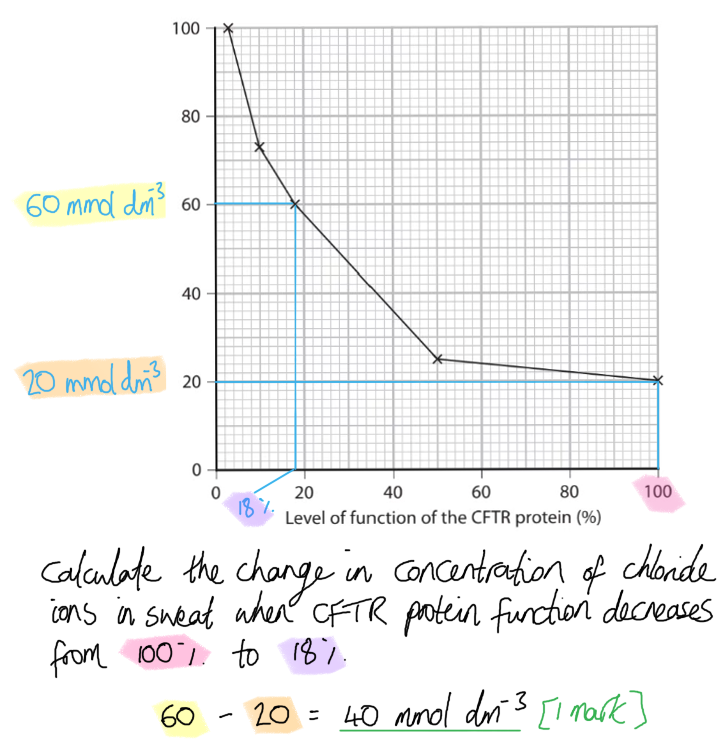

(ii) The graph provides evidence that cystic fibrosis results from different mutations in the CFTR gene as follows...

**Final answer:** **Any ****two**** of the following:**

- The (graph shows that the) level of CFTR protein function varies between 3 and 18 %; **1 mark]**
- Individuals diagnosed with cystic fibrosis have a range in concentration of chloride ions in their sweat; **1 mark]**
- The CFTR protein must be affected to different extents (by the different mutations); **[1 mark]**

**[Total: 3 marks]**

> * If cystic fibrosis were caused by a single mutation in the CFTR gene then we might expect to see a situation where there are only two levels of CFTR protein function (one where CFTR proteins function correctly and one where they do not), leading to two different concentrations of chloride ions in sweat (one in individuals with functioning CFTR proteins and one in individuals with non-functioning CFTR proteins). The fact that there is a large range of CFTR protein function and a range in chloride ion sweat concentrations suggests that there are several mutations which all affect CFTR protein function to a different extent.*

## Q5 — medium — 14 marks · exam-questions

### 7((a)) — 1 marks
The meaning of the term mutation is...

- A change in the base sequence/order (in DNA); **[1 mark]**

***Accept**** "a change in the chromosome number / deletion of part of a chromosome".*

**[Total: 1 mark]**

### 7() — 7 marks
(i) The meaning of the term correlation is…

- A change in one variable is reflected by / related to a change in another variable; **[1 mark]**

***Reject**** any reference to a change in one variable ****causing**** a change in another.*

> *It is essential that you are clear that a correlation is a **relationship** between variables, (i.e. when one changes the other also changes) but that a correlation between variables does **not** mean that the change in one variable **causes** the other. In other words **correlation is not causation**!*

(ii) The correlations shown by these graphs are as follows...

- Incidence of skin cancer increases with (an increase in) age (in both/either males and females); **[1 mark]**
- Incidence of skin cancer increases with an increase in years / between 2000 and 2005 (in both/either males and females); **[1 mark]**
- Males have a higher incidence of skin cancer than females; **[1 mark]**

***Accept**** reverse answers for any of the marking points, e.g. for marking point 1 "Incidence of skin cancer decreases as age decreases" or for marking point 3 "females have a lower incidence of skin cancer than males".*

> *When stating a correlation you need to describe how a change in one variable is related to a change in another; your statement must therefore include a description of the change in **both variables**. E.g. incidence of skin cancer (variable 1) increases with age (variable 2).*

(iii) A reason for each of the correlations shown by these graphs is...

Any **three** of the following:

- As age increases there is more time for mutations to occur / accumulate **OR** as the number of cell divisions increases (with age) the chance of mutations occurring increases **OR** as age increases the chance of exposure to (mutagenic) risk factors increases; **[1 mark]**
- (As the years increase from 2000 to 2005) people are spending more time in the sun / people are going on more holidays to hot countries (increasing UV exposure); **[1 mark]**
- (As the years increase from 2000 to 2005) more UV light is reaching the Earth's surface / the ozone layer is being depleted; **[1 mark]**
- More men (than women) have jobs/hobbies that cause them to spend time outside (in the sun) **OR** more men (than women) smoke; **[1 mark]**
- Men have a greater genetic predisposition to skin cancer; **[1 mark]**

**[Total: 7 marks]**

> *This is a 'suggest' question; you are not expected to **know** the causal connections between these variables but you should be able to give some valid ideas for how variables such as an increase in age, the passage of time, or biological sex, might influence the risk of cancer.*

> *It is worth saying that while suggestions relating to ozone depletion have been allowed as a valid causal link here, the ozone layer has actually vastly recovered in recent years and is no longer a source of urgent concern for scientists!*

### 7((c)) — 6 marks
> *This is a **level-marked question**, meaning that it is marked** according to the levels table**. The indicative content points below the table are **not** to be used in the usual **'one point = one mark'** way, but should be used together with the levels table to determine the number of marks which should be awarded.*

| **Level 1** | **1 mark** | 1-2 correct comments relating to the design of the study |
|---|---|---|
| **2 marks** | 3 correct comments relating to the design of the study |   |
| **Level 2** | **3 marks** | 4 correct comments relating to the design of the study **AND** at least one of these comments comes from each of the indicative content sections |
| **4 marks** | 5 correct comments relating to the design of the study **AND** at least one of these comments comes from each of the indicative content sections |   |
| **Level 3** | **5 marks** | 5 correct comments relating to the design of the study **AND** at least one of these comments has been clearly linked to the issue of reliability or validity |
| **6 marks** | 6 correct comments relating to the design of the study **AND** at least one of these comments has been clearly linked to the issue of reliability or validity **AND** a specific comment has been made about smoking / emphysema (indicated below by *) |   |

c) Criticisms of the design of this study include...

*Indicative content relating to ****repeatability***

- The sample size is small (this reduces the repeatability of the study as the small sample is less likely to be representative)
- Smokers are being studied and there are very few smokers within the sample*
- No statistical analysis has been carried out (so we do not know how variable the data is around the mean)
- There is no indication of the location of the individuals (if all individuals come from the same location then this reduces the repeatability of the study as the sample is less likely to be representative)

*Indicative content relating to ****validity***

- The mean age at diagnosis is similar but not identical (meaning that age is an uncontrolled factor)
- There is a greater range of ages for males than females
- There is no indication of the actual ages of the people
- There could be more people at the extremes of age in one group
- No information has been provided about other lifestyle factors (which could contribute to emphysema)
- Examples of relevant lifestyle factors include working in a polluted environment / living in the city
- No information has been provided about non-lifestyle factors (which could contribute to emphysema)
- Non-lifestyle factors could include ethnicity / genetics
- There is no indication of the location of the individuals (certain locations may have a higher or lower incidence of disease)
- There is no indication on whether individuals lived with other smokers (i.e. whether or not they are passive smokers)
- There is no indication of how long people have been smoking for*
- There is no indication of how many cigarettes were smoked by the smokers each day*
- There is no indication of whether the non-smokers had ever smoked previously*
- No information on the severity of emphysema has been provided*
- There is no indication of whether emphysema is self-diagnosed or whether individuals have been given a clinical diagnosis*

***Accept**** reproducible / reliable for repeatable.*

***Ignore**** references to precision and accuracy.*

**[Total: 6 marks]**

> *Issues of repeatability relate to the likelihood of being able to repeat the study again with the same study design and achieve the same results. The chances of this can be increased by ensuring that the sample studied is truly representative (e.g. in terms of size and location) and success in achieving repeatability can be measured by carrying out statistical analysis (e.g. calculating standard deviation).*

> *Validity is a broader term used to describe whether or not a study measures what it set out to measure. This will be the case if all factors (e.g. age, smoking history, lifestyle, ethnicity) other than the factor of interest (smoking) have been controlled or accounted for.*

> *A well designed study will be repeatable **and** valid, so you should aim to comment on issues of repeatability and validity when commenting on study design.*

## Q6 — medium — 9 marks · exam-questions

### 5((a)) — 4 marks
(i) The term 'tissue' means...

- A group of (similar) cells that (work together to) perform a (specific) function; **[1 mark]**

(ii) Using the data in the table, the stages of cancer in patients P and R are...

- Patient P has a mitotic index of 20; **[1 mark]**
- Patient R has a mitotic index of 45; **[1 mark]**
- P is at an earlier stage of cancer than R (or *vice versa*); **[1 mark]**

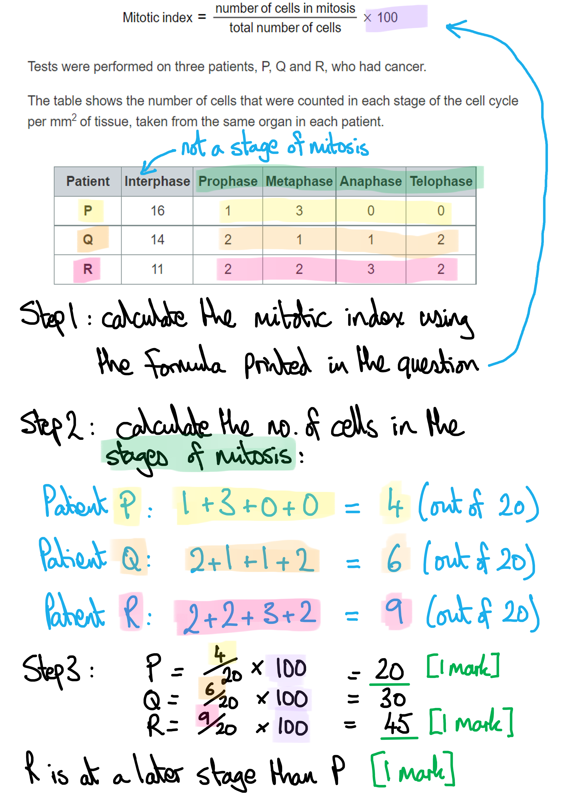

> *Make sure you multiply by 100 when using the formula from the question.*

> *When looking at the exam board's actual question paper, you may notice that you have around 10 lines to write your answer on, but these lines are preceded by about **1**/**4** of a page of blank space. This isn't a misprint, but a subtle way for the examiners to say, '**You might like to use this space for some relevant calculations**', which in reality means, '**You really SHOULD use this space for some relevant calculations**'! *

**[Total: 4 marks]**

### 5((b)) — 3 marks
Compare and contrast the probabilities of survival for the different stages of this cancer, as shown by the graph, as follows...

*Similarities*

- The survival probability decreases over time (for all three stages); **[1 mark]**

*Differences*

A **maximum of two** of the following:

- Stage I has the highest survival probability for all years **WHILE** stage IV has the lowest probability for all years; **[1 mark]**
- Stage IV has the fast<u>est</u>/steep<u>est</u> decrease (in survival probability) / stage I has the slow<u>est</u> decrease (in survival probability); **[1 mark]**
- Stated figures from a named point on the graph that demonstrate the order of survival for the different stages; **[1 mark]**

**[Total: 3 marks]**

> *A 'compare and contrast' question like this one always expects you to identify **similarities** and **differences**. Because the question is worth 3 marks, you can assume that **more than one similarity or difference** will be apparent when looking at the data. This is the case here, with one obvious similarity and two differences.  A mark is also available here for quoting data that support the stated differences.*

### 5((c)) — 2 marks
A placebo is used in a double-blind trial as follows...

- A placebo is given to one group while the other group receive the (anticancer) drug **OR** a description of a placebo, e.g. has no active ingredient / is an already known drug / sugar pill / dummy drug; **[1 mark]**
- Neither the patient nor the doctor/scientist/researcher knows whether the patient is receiving (the drug or) the placebo; **[1 mark]**

**[Total: 2 marks]**

> *Make sure you pay attention to the 'how' part of the question; it won't score a mark to explain 'why' placebos are used in double-blind drug trials. Also, be sure to distinguish a **double-blind** trial from a single-blind one, as many students will not make it clear that neither the patient **nor the doctor** knows which treatment that patient is receiving in a double-blind trial.*

## Q7 — medium — 5 marks · exam-questions

### 1((a)) — 1 marks
The correct answer is **C** because...

A mutation is a change in the base/nucleotide sequence of DNA

> *A** is incorrect because amino acids are not found in DNA*

> *B** is incorrect because a mutation is a change in DNA*

> *D** is incorrect because there are no bases in protein*

**[Total: 1 mark]**

### 1((b)) — 1 marks
(b) Types of mutation are...

Any **two** of the following:

- Deletion
- Insertion
- Substitution

*Allow chromosome / translocation*

*Ignore subtraction / addition / swapping / frameshift*

**[Total: 1 mark]**

### 1((c)) — 3 marks
The effect of age and sex on the number of cases of cancer is as follows...

Any **three** of the following:

- As age increases the number of cases increases (in both males and females) / positive correlation; **[1 mark]**
- Up to 57/58 years of age, males and females have a similar number of cases / females have a higher incidence; **[1 mark]**
- Above 57/58, the number of cases is higher in males; **[1 mark]**
- The onset of cancer is later in males than females; **[1 mark]**

**[Total: 3 marks]**

> *It's easy to miss that age causes cancer or the risk increases with age. Analysis of the data will reveal the important finding that the onset of cancer is later in males or earlier in females. Make sure to make this clear in your answer, rather than just quoting figures.*

## Q8 — medium — 10 marks · exam-questions

### 5((a)) — 2 marks
This data shows that there is a correlation between the age of the women and the miscarriage rate because:

- The rate of miscarriage increases with (increase in) age / directly proportion to each other; **[1 mark]**
- (However) there is no evidence that age is causing the miscarriage / no evidence of causation; **[1 mark]**

**[Total: 2 marks]**

*It's vital that you take notice of the number of marks to assess whether you need to elaborate on your first point. In this case, you would get ***[1 mark]*** for stating simply that there is a correlation, so you should, at that point, think about what extra information to write in order to gain a second mark. Usually, a correlation is observed but that does not prove causation, so a statement to that effect will secure you the second mark. *

### 5() — 5 marks
(i) The conclusions that can be made from these data about the causes of miscarriage are:

- Aneuploidy results in miscarriage because the screened embryos result in fewer miscarriages; **[1 mark]**
- However, other factors / named factor* can cause miscarriages because screened embryos / embryos that do not have aneuploidy are miscarried for other reasons; **[1 mark]**

**Allow: age, mutations, the process of implanting embryos, smoking, alcohol, dietary factors Ignore: lifestyle factors / screening cause miscarriage*

(ii) Conclusions made using these data may not be valid because:

Any **three** of the following:

- There is no indication of sample size / there is only a small sample size; **[1 mark]**
- No statistics have been presented; **[1 mark]**
- The data gives no idea of how many of the unscreened embryos had aneuploidy; **[1 mark]**
- Other lifestyles / factors / named factor have not been taken into account / are not shown; **[1 mark]**
- There may be some false (negative / positive) results; **[1 mark]**

*Ignore age/sex as a factor (these are already accounted for in the data).*

**[Total: 5 marks]**

> *The risk with (b)(i) is that you may decide to launch into your own knowledge about the causes of miscarriage, whereas the question just requires you to focus on what **this data** tells us about the causes. The only possible cause discussed in the data is whether aneuploidy (or the screening for aneuploidy) affects the rate of miscarriage or not. *

### 5((c)) — 3 marks
The implications of screening embryos for aneuploidy before implantation are:.

Any **three** of the following:

- (Preimplantation) screened embryos can still result in miscarriages so raising false hopes; **[1 mark]**
- There may be issues surrounding the embryos (that have aneuploidy), eg. discarding the embryos is unethical; **[1 mark]**
- False (positive) results are evident, which may result in unnecessary wastage / destruction of embryos **OR** a false negative result could lead to the use of that embryo; **[1 mark]**
- Other (genetic) defects may be found; **[1 mark]**

*Do not accept 'foetus' or 'baby' in place of 'embryo'.*

**[Total: 3 marks]**

> *If you think of an implication of screening these embryos, it isn't enough to just list it without giving some insight into the possible consequences of each one. Avoid the pitfall of discussing the implications of procedures such as chorionic villus sampling (CVS) or amniocentesis, which are not relevant to this question. Finally, an embryo is not yet a foetus, nor is it a baby; you will lose hard-earned marks for mixing up key terms like that!*

## Q9 — medium — 7 marks · exam-questions

### 4((a)) — 1 marks
The definition of gene is...

- The length of DNA/sequence of (DNA) bases that codes for amino acids / a (poly)peptide / a protein; **[1 mark]**

***Accept**** nucleotides for bases*

**[Total: 1 mark]**

### 4((b)) — 3 marks
Mutations result in cystic fibrosis because...

Any **three **of the following:

- Because the mutation is in the gene coding for the CFTR (protein); **[1 mark]**
- Therefore the CFTR (protein) does not function correctly; **[1 mark]**
- There is a dysfunction (resulting in very thick sticky mucus) e.g. reduced transport of chloride ions out of the cell sodium ions move into the cell, water leaves the mucus and enters the cell; **[1 mark]**
- Therefore the mucus will be (very) thick/sticky; **[1 mark]**

**[Total: 3 marks]**

### 4((c)) — 3 marks
The number of babies born with cystic fibrosis went down because...

Any **three **of the following:

- Couples (both) carrying one copy of the mutation can be identified / couples who are (both) heterozygous / have a CF allele; **[1 mark]**
- They can then make (an informed) decision/choice (about having a child); **[1 mark]**
- Naming an example of their options e.g. not having a child / adoption / IVF; **[1 mark]**
- Resulting in fewer babies being born who are homozygous / have two copies of the mutation / fewer heterozygous babies born; **[1 mark]**

**[Total: 3 marks]**

> *You cannot get a mark for discussing the option of abortion.  Make sure you don't confuse the screening of adults with the screening of an embryo.*

## Q10 — medium — 15 marks · exam-questions

### 6() — 6 marks
(i) The difference between gene and allele, using feather colour, is:

- A gene is the length of DNA / sequence of bases coding for a (poly)peptide/protein/sequence of amino acids; **[1 mark]**
- An allele is the (different) version/form/variation of the gene; **[1 mark]**
- The gene is for feather colour **WHEREAS** the allele is for white/black feathers; **[1 mark]**

*Do not allow 'allele for speckled feathers'*

(ii) The difference between genotype and phenotype, using feather colour, is:

- Genotype is the combination of alleles / mixture of alleles / the alleles present; **[1 mark]**
- Phenotype is the (observable) characteristics / appearance / traits of an individual / colour of feathers; **[1 mark]**
- Phenotype is the colour of the feathers and genotype is the presence of white alleles, black alleles or a combination of both **OR** genotype is WW, BB, WB etc; **[1 mark]**

*Ignore environmental factors*

**[Total: 6 marks]**

> *The question tells you to relate your knowledge to the context of feather colour in these chickens; make sure you do that rather than just regurgitating your knowledge without following the exact instructions of the examiners. *

### 8((b)) — 3 marks
A genetic diagram the show the expected number of speckled chicks has the following features:

Up to **three**** from the following:**

- Parent's genotypes shown as BB and BW; **[1 mark]**
- The offspring's genotypes shown as BB and BW; **[1 mark]**
- The predicted number of speckled chicks given as 12 or 13; **[1 mark]**

*Allow other letters to denote alleles but not X and Y. Allow lowercase letters eg. Bb For a correct answer with no genetic diagram/working award a maximum of ***[1 mark]**

**[Total: 3 marks]**

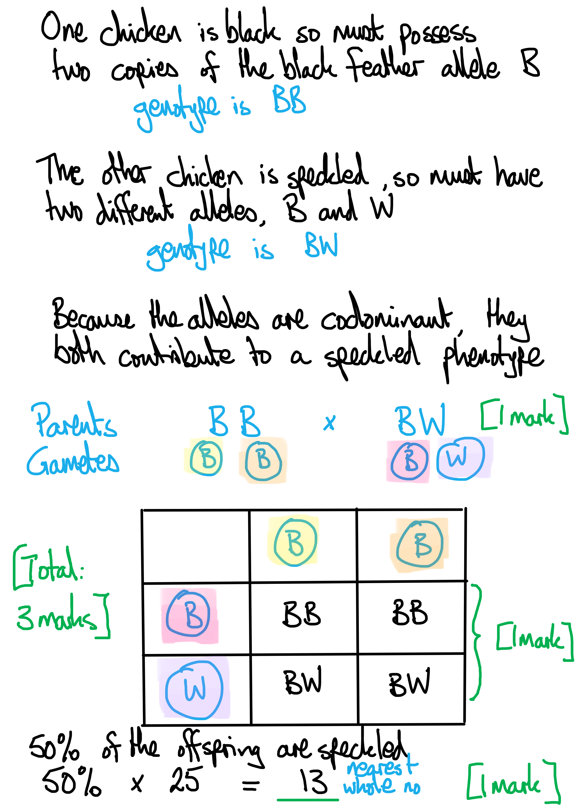

### 8() — 6 marks
(i) The statistics test being used to analyse these data is:

- The chi squared test / ✗2 test; **[1 mark]**

(ii) The completed table would have the following features:

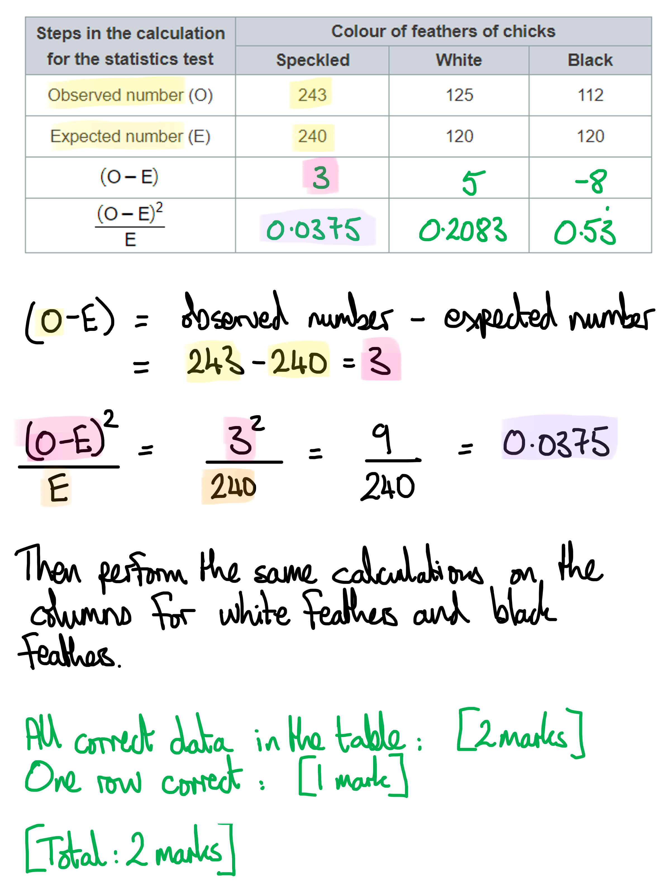

(iii) The value of Σ `open parentheses straight O minus straight E close parentheses squared over straight E` is calculated as follows:

- 0.0375 + 0.2083 + 0.5333 = 0.8 / 0.78 / 0.779 / 0.7791; **[1 mark]**

> *Because we have already calculated the individual values of *`open parentheses straight O minus straight E close parentheses squared over straight E`*, the sigma sign Σ just means we add all the values up to find a total. *

(iv) A critical value table could be used to accept or reject a null hypothesis for this experiment as follows:

Any** two** of the following:

- The number of data points would be used to calculate the number of degrees of freedom; **[1 mark]**
- (A probability) value of (up to or equal to) 5%/0.05 would be used; **[1 mark]**
- Then the calculated value would be compared to the critical value; **[1 mark]**
- *If the calculated value is greater than the critical value, then the null hypothesis is rejected; **[1 mark]**

**If this marking point alone is given award ***[2 marks]**

**[Total: 6 marks]**

## Q11 — medium — 15 marks · exam-questions

### 8((a)) — 5 marks
(i) The seventh triplet code in the gene for the β‐globin chain in a person who has sickle cell disease is...

- GUG; **[1 mark]**

***Accept**** guanine uracil guanine*

***Accept ****CAC / cytosine adenine cytosine*

(ii) The type of mutation that causes sickle cell disease is...

- Substitution; **[1 mark]**

***Do not accept ****frameshift / deletion / addition / insertion*

(iii) This mutation causes haemoglobin molecules to stick together because...

Any **three **of the following:

- The R groups (of these two amino acids) have different properties/bonding; **[1 mark]**
- Glu may have repelled polar groups on other haemoglobin molecules; **[1 mark]**
- Val / hydrophobic R group / hydrophobic part might form other (hydrophobic) interactions (with other haemoglobin molecules); **[1 mark]**
- (Part of haemoglobin containing) val (R group) turns away from/repels water/cytoplasm; **[1 mark]**

**[Total: 5 marks]**

### 8((b)) — 2 marks
The ratio of babies born with the disease to babies not born with the disease is...

- Number of non-affected babies calculated = (140 million - 305 800 = ) 139 694 200; **[1 mark]**
- 0.002 : 1 / 2×10-3 : 1; **[1 mark]**

*Full marks awarded for the correct answer only.*

***Accept ****0.0022 / 0.00219 / 0.002189*

***Accept**** 1 : 457 / 456.8*

**[Total: 2 marks]**

> *When working with long numbers, always make sure to check your calculation at least twice, because it can be easy to make mistakes with what you type into your calculator when you're stressed and in a hurry in an exam. *

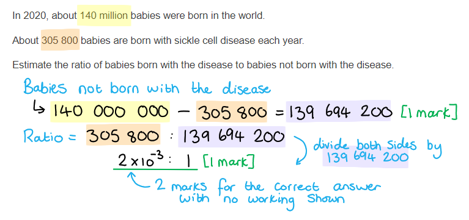

### 8((c)) — 8 marks
(i) The largest difference in the p50 values between a person with sickle cell disease and a person without this disease is...

- Values read correctly from the graph = 4.4 / 4.9 and 5.7 / 5.8 / 7.7 / 7.8; **[1 mark]**
- 3.3 / 3.4; **[1 mark]**

*Full marks awarded for the correct answer only. *

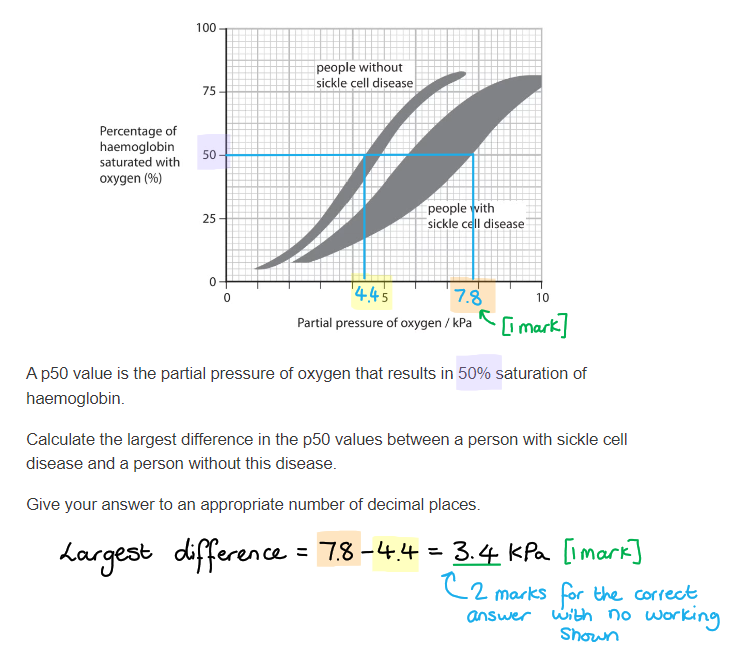

(ii) Two conclusions, other than the difference in p50 values, that can be made from this graph are...

- Person without the disease has higher saturation than person with the disease (at all partial pressures of oxygen); **[1 mark]**
- There is {greater variability / wider range} (in the saturation) of a person with the disease than a person without the disease (at a particular partial pressure of oxygen); **[1 mark]**

***Accept**** converse points, e.g. person with the disease has lower saturation that person without the disease*

> *Make sure all your answers are comparative. For example, saying that a person without the disease has **high** saturation is not comparative, you need to say that it is high**er** than the person with the disease. *

(iii) The lifespan of a healthy red blood cell is...

- 120 days; **[1 mark]**

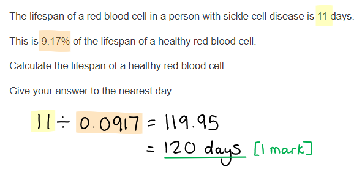

(iv) The changes in the structure of haemoglobin and the shape of the red blood cells could result in death in a person with sickle cell disease because...

Any **three **of the following:

- (Change in structure of haemoglobin) haemoglobin binds/carries less oxygen; **[1 mark]**
- (Shape of red blood cell) smaller surface area so less oxygen <u>diffuses</u> in / red blood cells get lodged in blood vessels preventing flow of blood to cells; **[1 mark]**
- Therefore less oxygen to cells/tissues so less available for (aerobic) <u>respiration</u> / switch to <u>anaerobic respiration</u>; **[1 mark]**
- An example of why less oxygen to cells could be fatal e.g. heart attack, stroke, sepsis, infection; **[1 mark] **

> *Always pay close attention to the words that are underlined in mark schemes because these words are essential in order to get the marks. *

**[Total: 8 marks]**

## Q12 — hard — 11 marks · exam-questions

### 1() — 2 marks
> **[mark-scheme]**
> - Genotype of I-1: pp **AND** genotype of I-2: Pp **[1 mark]**
> - I-1 is affected so must be homozygous recessive / have two copies of p **AND **I-2 is unaffected but has an affected child, so must be a carrier / be heterozygous **[1 mark]**

### 2() — 2 marks
> **[mark-scheme]**
> Any **two** from:
> 
> - The gene for PKU is located on an autosome / is not on a sex chromosome / both sexes possess two copies of the gene **SO** males and females are equally likely to inherit two recessive alleles **[1 mark]**
> - The gene for red-green colour blindness is located on the X chromosome / males possess only one copy of the gene **SO** males (XY) only require one recessive allele to be affected WHILE females (XX) must inherit two recessive alleles to be affected **[1 mark]**

> **[exam-tip]**
> Red-green colour blindness is named in the specification as the example you should use when learning about sex linkage on the X chromosome. Make sure you are confident with its pattern of inheritance, including why males are affected more frequently than females.

### 3() — 1 marks
**Correct answer: A** — 0%

**Final answer:** **The correct answer is A.**

- A cross of Pp × PP gives offspring PP, PP, Pp, Pp
- None of these genotypes (PP or Pp) result in an affected individual (pp)
- Therefore, the probability of an affected child is 0%

**B** is incorrect because 25% would apply to a Pp × Pp cross where both parents are carriers.

**C** is incorrect because 50% would apply to a pp × Pp cross where one parent is affected.

**D** is incorrect because neither parent is homozygous recessive, so no child can inherit two p alleles

### 4() — 6 marks
This question assesses the quality of your written communication (indicated by *) and should be assessed using levelled criteria.

| **Level** | **Mark Range** | **Descriptor** |
|---|---|---|
| **Level 3** | 5–6 | A comprehensive and balanced discussion covering multiple uses of genetic screening with their benefits and limitations, and a sustained exploration of ethical and social issues from more than one perspective. Reasoning is logically structured and well-developed throughout. |
| **Level 2** | 3–4 | Adequate discussion covering at least two uses of genetic screening with some ethical consideration, but reasoning not fully sustained or perspectives not balanced. |
| **Level 1** | 1–2 | Isolated points about genetic screening or ethical issues with limited linkage between ideas or to the context of the question. |
| **Level 0** | 0 | No rewardable material. |

**Indicative content**

Uses and benefits of genetic screening:

- Carrier testing can confirm whether other family members carry the recessive allele, allowing them to make informed decisions
- If both parents are carriers (Pp × Pp), preimplantation genetic diagnosis (PGD) can be used to select unaffected embryos
- Prenatal testing (amniocentesis at 15–20 weeks or chorionic villus sampling at 8–12 weeks) can determine if a fetus is affected
- Identification of carrier status for a parent may inform other family members of their potential risk

Limitations:

- Carrier testing alone does not determine risk unless the partner is also tested
- PGD requires IVF, which is physically demanding, expensive and not always successful
- Prenatal testing carries a risk of miscarriage
- Positive carrier results may cause anxiety despite individuals being unaffected

Ethical and social issues:

- Ethical concerns about PGD due to creation and possible destruction of embryos
- PKU can be managed through diet, so some argue selection or termination is unnecessary
- Potential for genetic discrimination (e.g. insurance implications)
- Testing one individual may reveal genetic information about relatives without consent
- Balance between reproductive autonomy and wider societal ethical concerns
