# Exam Questions — Inheritance
**2. Membranes, Proteins, DNA & Gene Expression** · Edexcel International A Level (IAL) Biology (YBI11)
> Source: [https://www.savemyexams.com/international-a-level/biology/edexcel/18/topic-questions/2-membranes-proteins-dna-and-gene-expression/inheritance/exam-questions/](https://www.savemyexams.com/international-a-level/biology/edexcel/18/topic-questions/2-membranes-proteins-dna-and-gene-expression/inheritance/exam-questions/) · 12 questions · total 118 marks

## Q1 — medium — 6 marks · exam-questions

### 2((a)) — 1 mark — command: which — structured — from paper June 2021 · WBI11/01
A person with diabetes has a blood glucose level that can be too high.

When the blood glucose level of a person without diabetes becomes too high, the liver stores glucose as a polysaccharide.

Which polysaccharide does the liver store?

| ☐ | **A** | Amylopectin |
|---|---|---|
| ☐ | **B** | Cellulose |
| ☐ | **C** | Glycogen |
| ☐ | **D** | Starch |

### 2((b)) — 1 mark — command: which — structured — from paper June 2021 · WBI11/01
Blood glucose levels can become high following the digestion of carbohydrates.

Which of the following can be digested to release glucose?

☐ **A** Both fructose and sucrose 
☐ **B** Both fructose and galactose 
☐ **C** Both galactose and lactose 
☐ **D** Both lactose and sucrose

### 2() — 4 marks — command: multiple — structured — from paper June 2021 · WBI11/01
Diabetes is a risk factor for cardiovascular disease.

(i) One estimate is that there are 415 million people with diabetes in the world and that 46% of these people are undiagnosed.

Calculate the number of people who have undiagnosed diabetes.

**(1)**

(ii) There are two types of diabetes, Type I and Type II.

The treatment for Type I diabetes is different from the treatment for Type II diabetes, so it is important for a correct diagnosis to be made.

Diagnosis can be difficult, particularly in people aged between 20 and 40 years old.

A genetic screening method is now available for the diagnosis of diabetes.

Explain why doctors are more likely to screen individuals once they develop diabetes than use methods such as prenatal testing.

**(3)**

## Q2 — medium — 6 marks · exam-questions

### 2((a)) — 1 mark — command: state — structured — from paper Oct/Nov 2020 · WBI11/01
Most Bengal tigers are orange with black stripes but there is a very small number of Bengal tigers that are white with black stripes.

The photograph shows a white Bengal tiger with black stripes.

SusuMa, CC0, via Wikimedia Commons

White tiger offspring are produced by two Bengal tigers that each carry at least one recessive allele for a gene affecting coat colour.

The pedigree diagram shows the phenotypes in one family of tigers, bred in captivity.

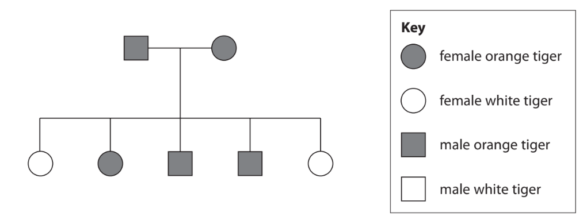

The phenotype is affected by the genotype.

State what is meant by the term genotype.

### 2((b)) — 1 mark — command: state — structured — from paper Oct/Nov 2020 · WBI11/01
State the probability that the next tiger born to these two parents will be female.

### 2((c)) — 3 marks — command: determine — structured — from paper Oct/Nov 2020 · WBI11/01
Determine the expected phenotypic ratio of orange tigers to white tigers born to the parents shown in this pedigree diagram.

Use a genetic diagram to support your answer.

### 2((d)) — 1 mark — command: calculate — structured — from paper Oct/Nov 2020 · WBI11/01
The incidence of white tigers in the wild is 1 in 10 000 Bengal tigers.

There are approximately 6000 Bengal tigers in captivity, 200 of which are white.

Calculate the incidence of white tigers in captivity.

## Q3 — medium — 9 marks · exam-questions

### 4((a)) — 1 mark — command: complete — structured — from paper June 2021 · WBI11/01
Phenylthiocarbamide (PTC) is a chemical that has a very bitter taste to some individuals (tasters).

The ability to taste PTC is determined by a gene that codes for a bitter-taste receptor on the tongue.

The pedigree diagram shows some of the tasters and non-tasters in a family.

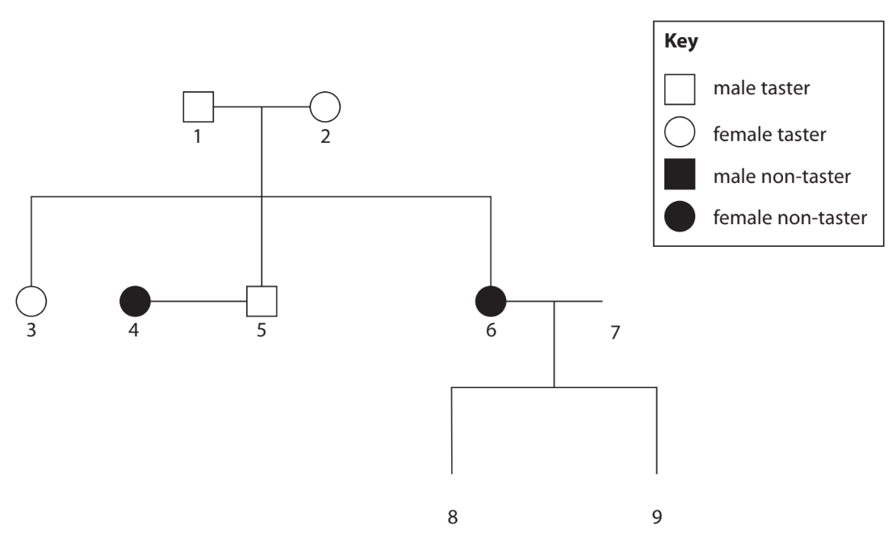

Complete the diagram to show the following information:

- Individual 7 as a male taster

  - Individual 8 as a male non-taster
  - Individual 9 as a female taster.

### 4() — 4 marks — command: describe — structured — from paper June 2021 · WBI11/01
Describe the difference between each of the following pairs of terms, using the information in the pedigree diagram to illustrate your answer.

(i) Gene and allele

**(2)**

(ii) Genotype and phenotype

**(2)**

### 4((c)) — 2 marks — command: explain — structured — from paper June 2021 · WBI11/01
Explain which is the dominant allele.

Use the information in the pedigree diagram to support your answer.

### 4((d)) — 2 marks — command: explain — structured — from paper June 2021 · WBI11/01
Explain why this gene is unlikely to be located on the X chromosome.

Use the information in the pedigree diagram to support your answer.

## Q4 — medium — 11 marks · exam-questions

### 5((a)) — 3 marks — command: explain — structured — from paper June 2021 · WBI11/01
People with cystic fibrosis produce very thick, sticky mucus.

Cystic fibrosis is caused by mutations in a gene coding for the CFTR protein.

Explain why a mutation in this gene results in the production of very thick, sticky mucus.

### 5((b)) — 5 marks — command: explain — structured — from paper June 2021 · WBI11/01
The diagram shows some health problems associated with cystic fibrosis, in a female.

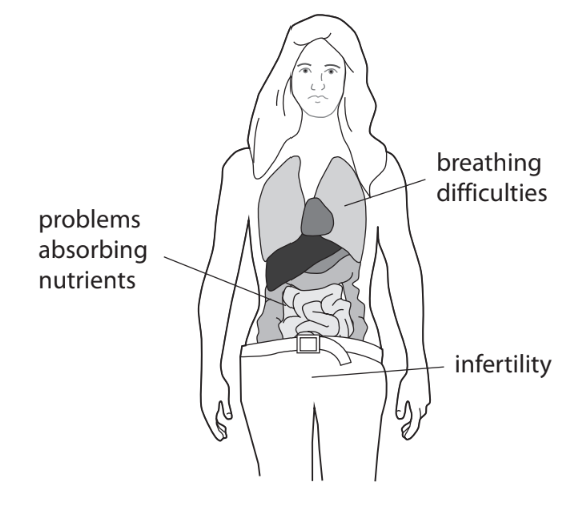

Explain why very thick, sticky mucus results in these health problems.

### 5() — 3 marks — command: multiple — structured — from paper June 2021 · WBI11/01
The graph shows the correlation between the concentration of chloride ions in sweat and the level of function of the CFTR protein.

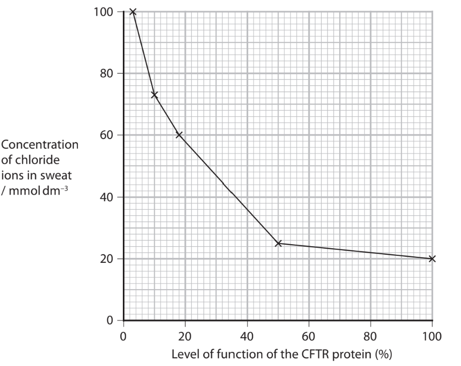

Individuals diagnosed with cystic fibrosis have a level of function of the CFTR protein of 18 % or less.

(i) Which is the change in concentration of chloride ions in the sweat of an individual when the level of function of CFTR protein decreased from 100 % to 18 %?

**(1)**

☐ **A** 15 mmol dm–3 
☐ **B** 35 mmol dm–3 
 ☐ **C** 40 mmol dm–3 
☐ **D** 80 mmol dm–3

(ii) Cystic fibrosis results from different mutations in the CFTR gene.

Explain how the graph provides evidence that cystic fibrosis results from different mutations in the CFTR gene.

**(2)**

## Q5 — medium — 14 marks · exam-questions

### 7((a)) — 1 mark — command: state — structured — from paper June 2021 · WBI11/01
A number of diseases are associated with lifestyle risk factors.

Some of these risk factors cause mutations.

Mutations can give rise to cancer.

State the meaning of the term **mutation.**

### 7() — 7 marks — command: multiple — structured — from paper June 2021 · WBI11/01
Exposure to ultraviolet light is associated with the development of skin cancer.

The graphs show the incidence of skin cancer in males and females in one country in the Far East, from 2000 to 2005.

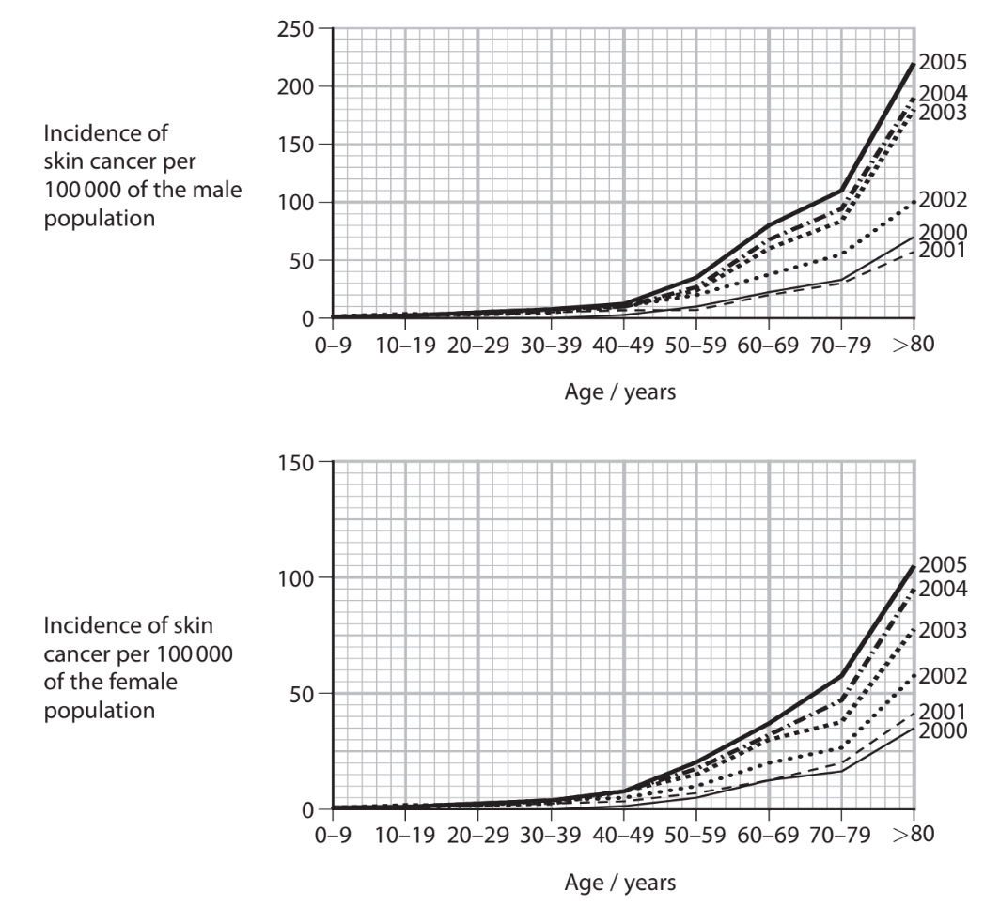

(i) The graphs show some correlations.

State the meaning of the term **correlation**.

**(1)**

(ii) Describe the correlations shown by these graphs.

**(3)**

(iii) Suggest a reason for each of the correlations shown by these graphs.

**(3)**

### 7((c)) — 6 marks — command: evaluate — structured — from paper June 2021 · WBI11/01
The table shows some information from a study of the incidence of emphysema in smokers and non-smokers.

| **Information** | **Males** | **Females** |
|---|---|---|
| Number of individuals in the study | 25 | 25 |
| Mean age when diagnosed / years | 53.1 | 54.2 |
| Range of ages when diagnosed / years | 32 to 77 | 34 to 68 |
| Number of smokers | 5 | 6 |
| Number of non-smokers | 20 | 19 |
| Number of smokers with emphysema | 1 | 6 |
| Number of non-smokers with emphysema | 0 | 0 |

Criticise the design of this study.

## Q6 — medium — 9 marks · exam-questions

### 5((a)) — 4 marks — command: multiple — structured — from paper Oct/Nov 2020 · WBI12/01
The five stages of cancer are used to describe the size and spread of a cancer in a human body.

The mitotic index of a tissue can be used to determine the stage of cancer.

A higher mitotic index is usually linked to a later stage of cancer.

The mitotic index is calculated using the formula

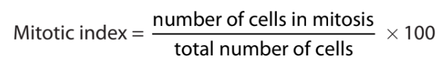

Tests were performed on three patients, P, Q and R, who had cancer.

The table shows the number of cells that were counted in each stage of the cell cycle per mm2 of tissue, taken from the same organ in each patient.

| **Patient** | **Interphase** | **Prophase** | **Metaphase** | **Anaphase** | **Telophase** |
|---|---|---|---|---|---|
| **P** | 16 | 1 | 3 | 0 | 0 |
| **Q** | 14 | 2 | 1 | 1 | 2 |
| **R** | 11 | 2 | 2 | 3 | 2 |

(i) State what is meant by the term **tissue.**

**(1)**

(ii) Using the data in the table, determine the stages of cancer in patients **P **and **R**.

**(3)**

### 5((b)) — 3 marks — command: contrast — structured — from paper Oct/Nov 2020 · WBI12/01
The graph shows the probability of survival for different stages of a cancer, after diagnosis.

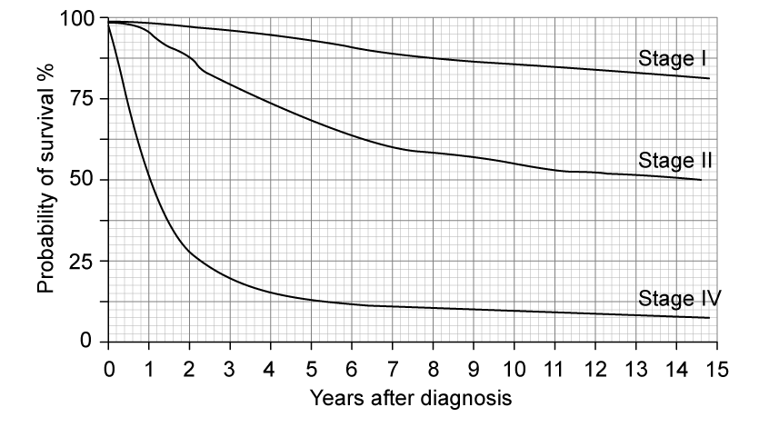

Compare and contrast the probabilities of survival for the different stages of this cancer, as shown by the graph.

### 5((c)) — 2 marks — command: describe — structured — from paper Oct/Nov 2020 · WBI12/01
Anticancer drugs have to undergo double‐blind trials before they are used to treat patients.

Describe how a placebo is used in a double‐blind trial.

## Q7 — medium — 5 marks · exam-questions

### 1((a)) — 1 mark — command: what — structured — from paper Oct/Nov 2021 · WBI11/01
Mutations can give rise to cancer.

What is a mutation?

☐ **A** a change in the amino acid sequence in DNA 
☐ **B** a change in the amino acid sequence in a protein 
☐ **C** a change in the base sequence in DNA  
☐ **D** a change in the base sequence in a protein

### 1((b)) — 1 mark — command: name — structured — from paper Oct/Nov 2021 · WBI11/01
Name **two **types of mutation.

### 1((c)) — 3 marks — command: describe — structured — from paper Oct/Nov 2021 · WBI11/01
The graph shows the number of cases of one type of cancer in a human population.

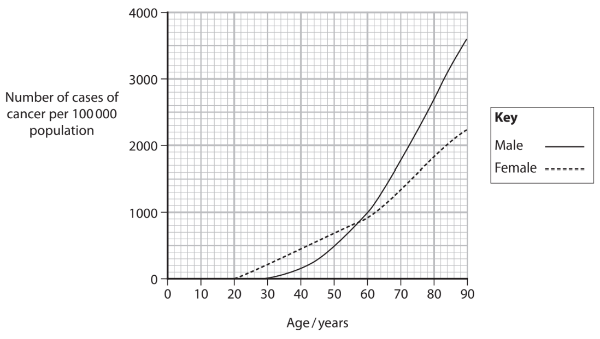

Describe the effect of age and sex on the number of cases of cancer.

## Q8 — medium — 10 marks · exam-questions

### 5((a)) — 2 marks — command: explain — structured — from paper Oct/Nov 2021 · WBI11/01
Genetic screening can be used to test for aneuploidy.

Aneuploidy is the presence of an abnormal number of chromosomes in a cell.

Aneuploidy can affect the miscarriage rate of implanted embryos.

Following screening, only embryos with the correct number of chromosomes are implanted into the female.

The table shows the miscarriage rate of two groups of implanted embryos:

- embryos not screened for aneuploidy
- embryos screened and shown not to have aneuploidy.

| **Age range** **of women at** **implantation/years** | **Miscarriage rate (%)** |   |
|---|---|---|
| **Implanted embryos** **not screened for** **aneuploidy** | **Implanted embryos** **screened and shown** **not to have aneuploidy** |   |
| <35 | 12.0 | 11.2 |
| 35 to 37 | 16.8 | 13.0 |
| 38 to 40 | 25.0 | 13.6 |
| 41 to 42 | 37.9 | 16.3 |
| >42 | 58.8 | 17.2 |

Explain how this data shows that there is a correlation between the age of the women and the miscarriage rate.

### 5() — 5 marks — command: explain — structured — from paper Oct/Nov 2021 · WBI11/01
(i) Explain the conclusions that can be made from these data about the causes of miscarriage.

**(2)**

(ii) Explain why conclusions made using these data may not be valid.

**(3)**

### 5((c)) — 3 marks — command: discuss — structured — from paper Oct/Nov 2021 · WBI11/01
Discuss the implications of screening embryos for aneuploidy before implantation.

## Q9 — medium — 7 marks · exam-questions

### 4((a)) — 1 mark — command: give — structured — from paper Jan 2022 · WBI11/01
Cystic fibrosis is an inherited recessive disease caused by mutations in a gene on chromosome 7.

Give the meaning of the term **gene.**

### 4((b)) — 3 marks — command: explain — structured — from paper Jan 2022 · WBI11/01
Explain how mutations result in cystic fibrosis.

### 4((c)) — 3 marks — command: suggest — structured — from paper Jan 2022 · WBI11/01
Population carrier screening (PCS) is one type of genetic screening.

This involves screening people who want a child to see if they are carriers of genetic disorders.

In one country, the number of babies born with cystic fibrosis went down following the introduction of PCS.

Suggest why the number of babies born with cystic fibrosis went down.

## Q10 — medium — 15 marks · exam-questions

### 6() — 6 marks — command: describe — structured — from paper Oct/Nov 2021 · WBI11/01
The drawing shows a speckled chicken. These chickens have a mixture of black and white feathers.

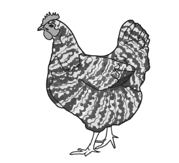

The colour of the feathers of a chicken is an example of codominance. One parent of this speckled chicken had white feathers and the other parent had black feathers.

Describe the difference between each of the following pairs of terms, using feather colour to illustrate your answer.

(i) Gene and allele

**(3)**

(ii) Genotype and phenotype

**(3)**

### 8((b)) — 3 marks — command: determine — structured — from paper Oct/Nov 2021 · WBI11/01
A black chicken was mated with a speckled chicken. They had 25 chicks.

Determine the expected number of speckled chicks.

You **must **use a genetic diagram.

### 8() — 6 marks — command: multiple — structured — from paper Oct/Nov 2021 · WBI11/01
In an experiment, several pairs of speckled chickens were mated together.

They produced 480 chicks.

The table shows the expected number of speckled chicks, white chicks and black chicks. It also shows the actual number of each type of chick.

| **Steps in the calculation** **for the statistics test** | **Colour of feathers of chicks** |   |   |
|---|---|---|---|
| **Speckled** | **White** | **Black** |   |
| Observed number (O) | 243 | 125 | 112 |
| Expected number (E) | 240 | 120 | 120 |
| `open parentheses straight O minus straight E close parentheses` |   |   |   |
| `open parentheses straight O minus straight E close parentheses squared over straight E` |   |   |   |

This table can be used in a statistics test.

(i) Name the statistics test being used to analyse these data.

**(1)**

(ii) Complete this table to show the missing values.

**(2)**

(iii)     Calculate

`sum for blank of open parentheses straight O minus straight E close parentheses squared over straight E`

**(1)**

(iv) Explain how a critical value table could be used to accept or reject a null hypothesis for this experiment.

**(2)**

## Q11 — medium — 15 marks · exam-questions

### 8((a)) — 5 marks — command: multiple — structured — from paper Jan 2022 · WBI11/01
Sickle cell disease is caused by a gene mutation affecting the β‐globin chain of haemoglobin.

The mutation occurs in the seventh triplet code of this gene.

This mutation results in the amino acid Glu being replaced with the amino acid Val.

The table shows the sequence of bases in the first part of the DNA in a person who does not have sickle cell disease. It also shows the corresponding sequence of amino acids in the β‐globin chain.

| **Position of triplet code** | first | second | third | fourth | fifth | sixth | seventh | eighth | ninth |
|---|---|---|---|---|---|---|---|---|---|
| ** DNA** | AUG | GUG | CAC | CUG | ACU | CCU | GAG | GAG | AAG |
| ** β‐globin chain** | (start) | Val | His | Leu | Thr | Pro | Glu | Glu | Lys |

(i) Give the seventh triplet code in the gene for the β‐globin chain in a person who has sickle cell disease.

**(1)**

(ii) Name the type of mutation that causes sickle cell disease.

**(1)**

(iii) The amino acid Glu is hydrophilic (polar) and the amino acid Val is hydrophobic (non‐polar).

Suggest why this mutation causes haemoglobin molecules to stick together.

**(3)**

### 8((b)) — 2 marks — command: estimate — structured — from paper Jan 2022 · WBI11/01
In 2020, about 140 million babies were born in the world.

About 305 800 babies are born with sickle cell disease each year.

Estimate the ratio of babies born with the disease to babies not born with the disease.

### 8((c)) — 8 marks — command: multiple — structured — from paper Jan 2022 · WBI11/01
The red blood cells in a person with sickle cell disease are sickle shaped and less elastic. They also have a shorter lifespan than healthy red blood cells.

These sickle shaped red blood cells cannot carry as much oxygen as healthy red blood cells and they get stuck in the capillaries.

The graph shows oxygen dissociation curves for groups of people with sickle cell disease and those without the disease.

The shaded areas represent the range of values for each group of people.

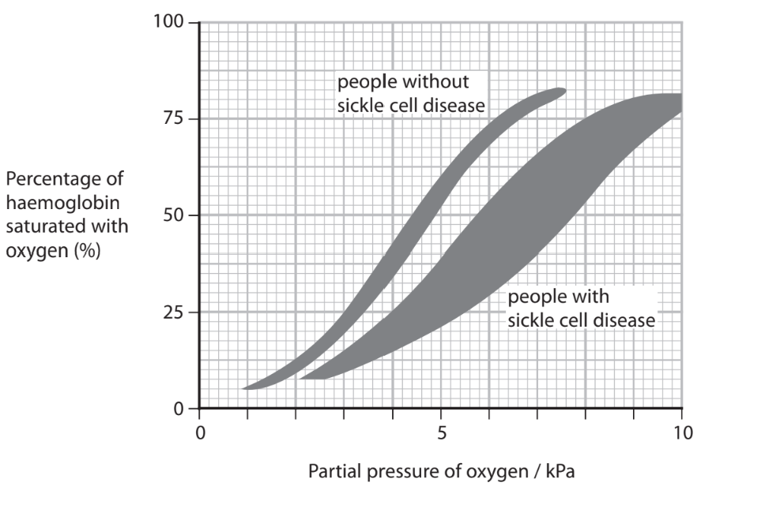

(i) A p50 value is the partial pressure of oxygen that results in 50% saturation of haemoglobin.

Calculate the largest difference in the p50 values between a person with sickle cell disease and a person without this disease.

Give your answer to an appropriate number of decimal places.

**(2)**

(ii) Identify **two** conclusions, other than the difference in p50 values, that can be made from this graph.

**(2)**

(iii) The lifespan of a red blood cell in a person with sickle cell disease is 11 days.

This is 9.17% of the lifespan of a healthy red blood cell.

Calculate the lifespan of a healthy red blood cell.

Give your answer to the nearest day.

**(1)**

(iv) Sickle cell disease can result in death.

Explain why the changes in the structure of haemoglobin and the shape of the red blood cells could result in death in a person with sickle cell disease.

**(3)**

## Q12 — hard — 11 marks · exam-questions

### 1() — 2 marks — command: explain — structured
Phenylketonuria (PKU) is an autosomal recessive condition caused by a mutation in the gene encoding the enzyme phenylalanine hydroxylase. Affected individuals cannot metabolise the amino acid phenylalanine, leading to neurological damage if untreated.

A family pedigree for a family affected by PKU is shown in the diagram.

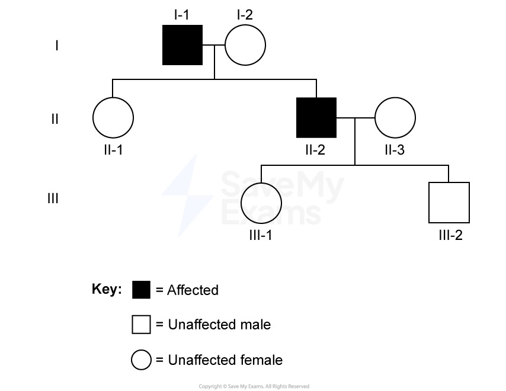

Using the symbols P and p, state the genotypes of I-1 and I-2, and explain how the pedigree supports your conclusions.

### 2() — 2 marks — command: explain — structured
Phenylketonuria (PKU) and red-green colour blindness are both genetic disorders caused by mutations.

Explain why PKU affects males and females equally, whereas red-green colour blindness affects males more frequently than females.

### 3() — 1 mark — multiple_choice
III-1 has been confirmed by genetic testing to be a carrier. III-1's partner has no family history of PKU and has been confirmed by genetic testing to be homozygous dominant.

Which of the following correctly states the probability that a child of III-1 and their partner will be affected by PKU?
- **A.** 0%
- **B.** 25%
- **C.** 50%
- **D.** 100%

### 4() — 6 marks — command: evaluate — structured
III-1 has been confirmed by genetic testing to be a carrier of the PKU allele. This finding has implications for other members of the family.

Evaluate the use of genetic screening for members of this family.
