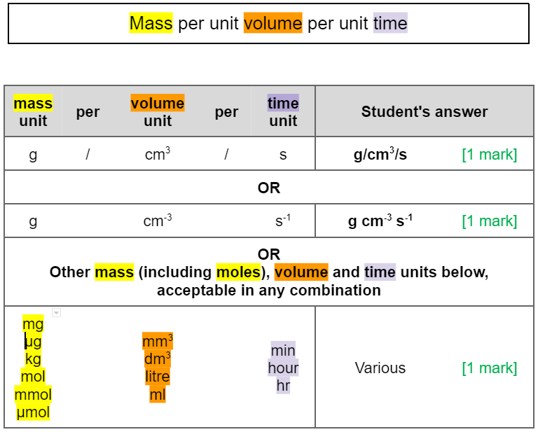
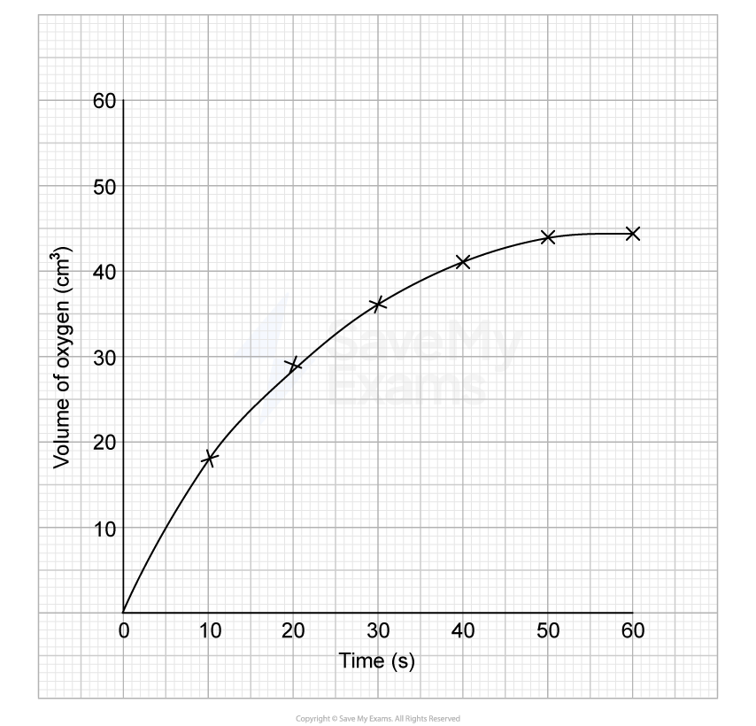
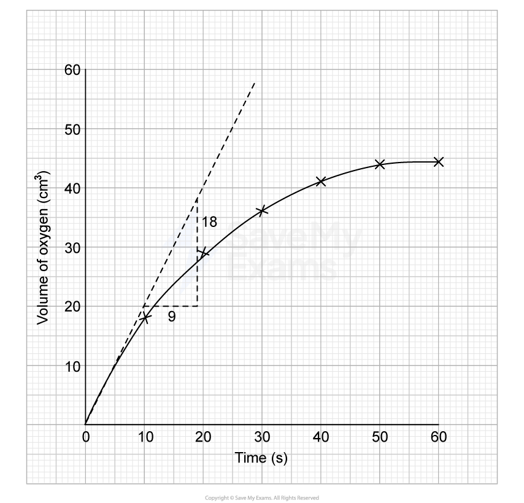

# Mark Schemes — Proteins
**2. Membranes, Proteins, DNA & Gene Expression** · Edexcel International A Level (IAL) Biology (YBI11)

## Q1 — medium — 7 marks · exam-questions

### 1((a)) — 3 marks
(i) The correct answer is **B **because...

The base is attached to carbon 1 and the phosphate is attached to carbon 4. Remember how the carbons are numbered. There is an oxygen at the top of the pentagon and then going in a clockwise direction the rest of the 5 carbons are numbered from that point, with carbon five being outside the ring next to the phosphate.

> *A** is incorrect because the phosphate should be joined to carbon 4, not the oxygen. *

> *C** is incorrect because the base should be attached to carbon 1, not carbon 3.*

> *D** is incorrect because the phosphate should be joined to carbon 4 and the base should be attached to carbon 1.*

(ii) The correct answer is **B **because...

A phosphodiester bond is between a phosphate and a sugar.

> *A** is incorrect because a phosphate should be attached to the sugar not the base.*

> *C** is incorrect because a phosphodiester joins a sugar with a phosphate, not two phosphates.*

> *D** is incorrect because the phosphate should be joined to a sugar not a base.*

(iii) The correct answer is **C **because...

There are two different sized bases joined together by hydrogen bonds (represented by dashed lines).

> *A** is incorrect because complementary bases should be joined by hydrogen bonds (dashed lines), not covalent bonds (solid lines).*

> *B** is incorrect because one large base and one small base should be joined together, not two small, and the bonds should be hydrogen bonds. *

> *D** is incorrect because one large base and one small base should be joined together, not two large.*

**[Total: 3 marks]**

### 1((b)) — 4 marks
(i) The correct statements are...

| **Statement** | **Both the new complementary DNA strand and the mRNA strand** | **Only the new complementary DNA strand** | **Only the mRNA strand** | **Neither strand** |
|---|---|---|---|---|
| The number of guanines will be the same as in the template strand |   |   |   | ✘ **[1 mark]** |
| The number of thymines will be the same as the number of adenines in the template strand |   | ✘ **[1 mark]** |   |   |
| There will be no adenine present |   |   |   | ✘ **[1 mark]** |

(ii) The process that synthesises a mRNA strand using the DNA template strand is...

- Transcription; **[1 mark]**

**[Total: 4 marks]**

> *Remember that the anti-sense/template strand is the one that is transcribed, and the the sense/coding strand is the opposite strand. *

## Q2 — medium — 13 marks · exam-questions

### 8((a)) — 4 marks
(i) The correct answer is **C **because...

Lactose is made from galactose and glucose. When they break down during lactose digestion this is hydrolysis. Remember that galactose has the word lactose in it and so you can use that as a helpful reminder.

> *A** is incorrect because fructose and galactose do not produce lactose when combined.*

> *B** is incorrect because fructose and glucose makes sucrose when combined.*

> *D** is incorrect because glucose and glucose make maltose when combined.*

(ii) The three-dimensional structure of lactase affects the mechanism of action of this enzyme by...

Any **three **of the following:

- Lactase is soluble because of its globular shape / external polar/hydrophilic R groups; **[1 mark]**
- (And therefore) lactase collides with lactose; **[1 mark]**
- Active site of lactase is complementary to the lactose/binds to lactose / active site allows enzyme-substrate complex to form; **[1 mark]**
- Formation of enzyme-substrate complex lowers the activation energy; **[1 mark]**

**[Total: 4 marks]**

> *For this question it is important that you refer specifically to lactase in your answer rather than making generic statements about protein structure and enzyme action. *

### 8((b)) — 7 marks
(i) One advantage of using immobilised lactase is...

- Lactase/enzyme is reusable / milk is not contaminated with lactase/enzyme; **[1 mark]**

(ii) The effects of pH on the activity of these two enzymes are...

Any **four **of the following:

- pH below 5/above 5 reduces lactase activity; **[1 mark]**
- Because pH affects the shape of the active site; **[1 mark]**
- Due to ionisation of the R groups; **[1 mark]**
- Immobilised lactase is active at wider range of pH values; **[1 mark]**
- Immobilisation holds the R groups in place so active site does not change shape; **[1 mark]**

> *This is an **explain** question and so any answers that just describe the data without giving any reason for the data cannot gain full marks. *

(iii) The rate of activity of the lactase could be measured by...

Any **one **of the following:

- Measure the decrease in concentration of lactose over time; **[1 mark]**
- Measure the increase in concentration of glucose/galactose over time; **[1 mark]**

Plus any **one** set of units from the table:

- Unit of mass per volume per time e.g. mg ml-1 s-1; **[1 mark]**

**[Total: 7 marks]**

> *Because the question requires a way of measuring the **rate** of activity, there must be an element of **time** in the units. There should be no mention of a.u. (arbitrary units) in this answer, because that scale is used to measure the activity of the enzyme, not the rate at which it works. *

### 8((c)) — 2 marks
Most people with CLI are found in one country because...

Any **two **of the following:

- Mutation (that resulted in CLI) occurred in the gene/DNA (of people living in one country); **[1 mark]**
- People from this country (had children that) stayed in this country / limited emigration / reproduction with others from same country; **[1 mark]**
- Relatively new mutation so has not had the chance to spread; **[1 mark]**

**[Total: 2 marks]**

> *Remember that mutations occur due to random chance **NOT **by consuming milk. This is a common misconception held by people that answer this question.*

## Q3 — medium — 7 marks · exam-questions

### 1((a)) — 5 marks
The completed account is as follows...

**[1 mark] for each correct answer indicated in green:**

The primary structure of a protein is the specific sequence of amino acids joined together by **peptide** bonds.

These bonds are formed between the **amino/amine** group of one amino acid and the **carboxyl/COOH/carboxylic (acid)** group of an adjacent amino acid by a **condensation** reaction.

These bonds are formed during the stage of protein synthesis called **translation**.

***Reject**** 'dipeptide/polypeptide/amide' bond for peptide bond. *

***Allow ****NH**2** or NH**3**+** for amino.*

***Allow**** CO**2**H or COO- for carboxyl.*

***Allow**** the 2**nd** and 3**rd** marking points written in either order. *

**[Total: 5 marks]**

> *Be sure not to confuse transcription with translation for the final mark scheme point. *

### 1((b)) — 2 marks
The correctly completed table is as follows:

| **Structure** | **Hydrogen** **bonds only** | **Ionic** **bonds only** | **Both hydrogen** **and ionic bonds** | **Neither of** **these bonds** |
|---|---|---|---|---|
| secondary structure | ☒; **[1 mark]** | □ | □ | □ |
| three‐dimensional structure | □ | □ | ☒; **[1 mark]** | □ |

**[Total: 2 marks]**

## Q4 — medium — 14 marks · exam-questions

### 1() — 2 marks
> **[mark-scheme]**
> - Independent variable: the concentration of catalase / enzyme concentration **[1 mark]**
> - Dependent variable: the initial rate of oxygen production / the volume of oxygen produced per unit time at the start of the reaction **[1 mark]**
> 
> Reject "amount of enzyme"
> 
> Reject "rate of reaction" alone for the dependent variable

> **[exam-tip]**
> Make sure you distinguish between the independent variable (what the experimenter deliberately changes) and the dependent variable (what is measured as a result).
> 
> A common mistake is writing "amount of enzyme" rather than "concentration of enzyme" — these are not the same thing, as amount could also refer to volume or mass.
> 
> For the dependent variable, always state what is actually being measured (e.g. volume of oxygen produced per unit time) rather than just saying "rate of reaction", since rate must be determined from a measurable quantity.

### 2() — 4 marks
> **[mark-scheme]**
> Any** two** pairs from:
> 
> - Temperature
> - Place test tubes / solutions in a water bath set to a fixed temperature
> 
> **AND/OR**
> 
> - pH
> - Add a buffer solution to each test tube / solution
> 
> **AND/OR**
> 
> - Concentration of hydrogen peroxide / substrate concentration
> - Add the same hydrogen peroxide solution to each test tube / solution
> 
> **AND/OR**
> 
> - Volume of enzyme / substrate
> - Measure equal volumes using a syringe / pipette
> 
> **[4 marks]**

> **[exam-tip]**
> Make sure you pair each variable with a specific, practical method of control — simply naming the variable without explaining how to control it will only earn half the available marks for that pair.
> 
> Many students lose marks by being too vague, e.g. writing "keep temperature the same" without stating how (such as using a water bath).

### 3() — 4 marks
The graph should be plotted as follows:

> **[mark-scheme]**
> - Time (s) on x-axis **AND** volume of oxygen (cm³) on y-axis **AND** both correctly labelled with units **[1 mark]**
> - Appropriate linear scales chosen **AND** that use more than half the grid available **[1 mark]**
> - All seven points plotted correctly to within 1 mm **[1 mark]**
> - Smooth curve drawn through all points **[1 mark]**

> **[exam-tip]**
> Pay close attention to the specific instructions when plotting graphs. If the question just asks you to "plot a graph" without further specification, join the points with straight lines. If the question specifically asks you to "draw a line of best fit," then draw a single smooth curve that best represents the overall trend through the points - some points may be slightly above or below your line.
> 
> Don't extrapolate your line beyond the data points provided unless specifically asked to do so.

### 4() — 3 marks
To determine the initial rate of reaction:

- Draw a tangent to the curve at t = 0 as a straight line touching the curve at that point without crossing it **[1 mark]**
- Select two points on the tangent and calculate the rise and the run

change in y = 18 cm³ **AND **change in x = 9 s **[1 mark]**

- Calculate the gradient using

gradient = change in y ÷ change in x

= 18 ÷ 9

= **2 ****cm³ s⁻¹**** ****[1 mark]**

> **[mark-scheme]**
> Award full marks for the correct answer in the absence of working.
> 
> Accept different values calculated from a correctly drawn tangent on the student's own graph.

> **[exam-tip]**
> To find the initial rate of reaction using a tangent: draw a straight line that just touches the curve at time = 0, matching the steepest slope at the start of the reaction. Use a ruler to ensure your tangent line is straight.
> 
> To calculate the gradient, choose two points on your tangent line where you can read exact coordinates from the grid; avoid estimating values between grid lines. Mark these points clearly and read off their coordinates precisely. Calculate the gradient using change in y ÷ change in x, making sure to include correct units in your final answer.

### 5() — 1 marks
> **[mark-scheme]**
> The rate of increase slows between 40 and 60 seconds because:
> 
> - Substrate concentration falls / there are fewer hydrogen peroxide molecules available **SO** the frequency of enzyme-substrate collisions decreases / fewer enzyme-substrate complexes form per unit time **[1 mark]**

> **[exam-tip]**
> When explaining a slowdown in the rate of an enzyme-controlled reaction, make sure you go beyond simply stating that the substrate has been used up. To access full marks, you should link the decrease in substrate concentration to the underlying mechanism — explaining that fewer collisions occur between enzyme and substrate molecules, resulting in fewer enzyme-substrate complexes being formed per unit time.

## Q5 — hard — 9 marks · exam-questions

### 1() — 2 marks
To calculate the rate of reaction:

rate = change in volume ÷ change in time

- Determine the change in volume

  - At 0 s volume of product = 0
  - At 10 s volume of product = 0.6

change = 0.6 - 0

= 0.6

- Apply the rate formula

= 0.6 ÷ 10** [1 mark]**

= **0.06 **cm³ s⁻¹ **[1 mark]**

> **[mark-scheme]**
> Award full marks for the correct answer in the absence of working.

### 2() — 3 marks
> **[mark-scheme]**
> - The competitive inhibitor has a similar shape/structure to the substrate **SO **binds to the active site of the enzyme **[1 mark]**
> - The substrate cannot bind to the active site **SO** fewer enzyme-substrate complexes are formed **[1 mark]**
> - At low substrate concentrations the inhibitor outcompetes the substrate / there is a higher chance of the inhibitor colliding with the active site than the substrate **[1 mark]**

> **[exam-tip]**
> At low substrate concentrations there is less competition from substrate molecules, so the inhibitor is proportionally more effective at occupying active sites.

### 3() — 4 marks
> **[mark-scheme]**
> Points that support the conclusion:
> 
> - Vitamin C is an antioxidant which reduces / neutralises free radicals
> - This reduces damage to the endothelial lining / reduces atheroma / plaque formation
> 
> Points that challenge the conclusion (maximum of **three**):
> 
> - Correlation does not equal causation
> - Another uncontrolled variable / (named) lifestyle factor could be responsible for the reduced incidence of atherosclerosis
> - Self-reported food diaries may be inaccurate / subjective / rely on memory
> - 500 adults may not be a sufficient sample size to draw valid conclusions **OR **six months may not be a sufficient duration to draw valid conclusions
> 
> Students must refer to points both supporting and challenging the conclusion to be awarded full marks.

> **[exam-tip]**
> "Assess" questions require you to consider evidence on both sides of an argument and come to a supported conclusion. In this question, that means explaining both why the data might support the student's conclusion and why it might not.
> 
> You will not be awarded more than 2 marks if you only argue one side — make sure you address both.
