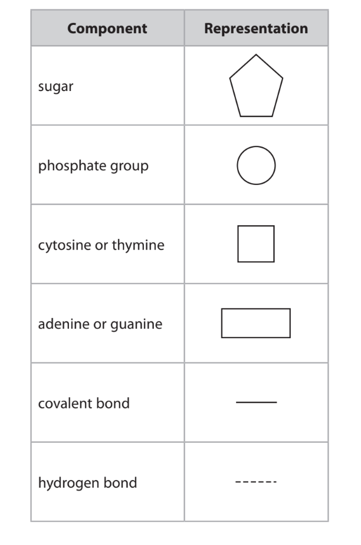
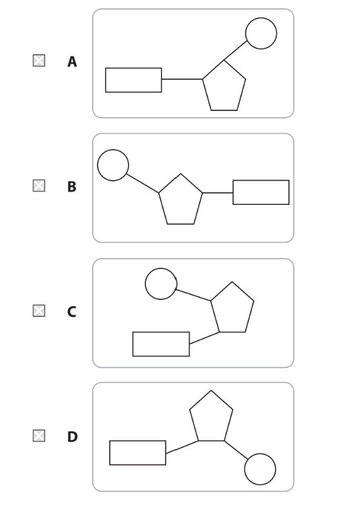
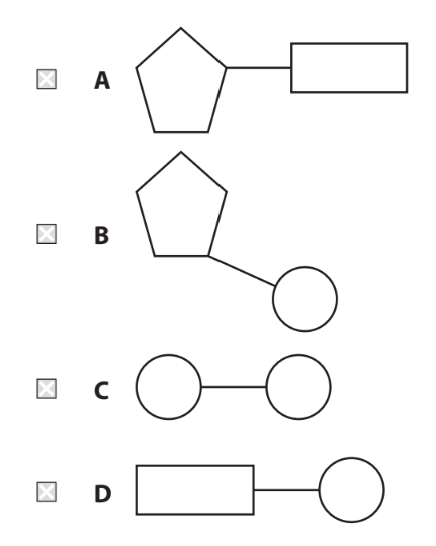
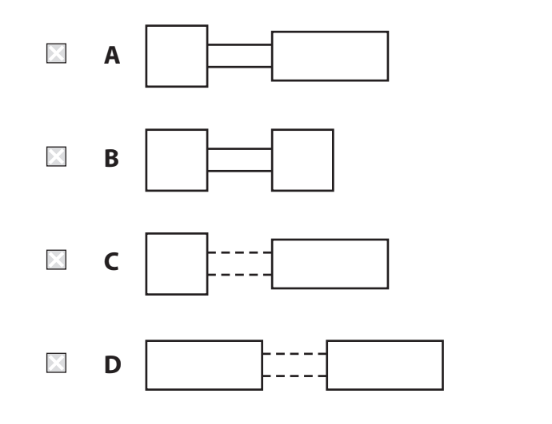
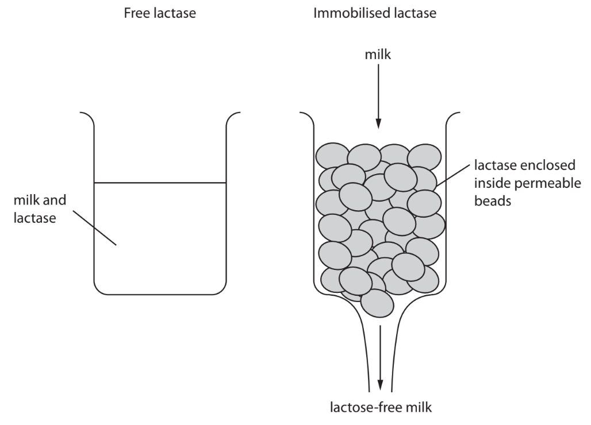
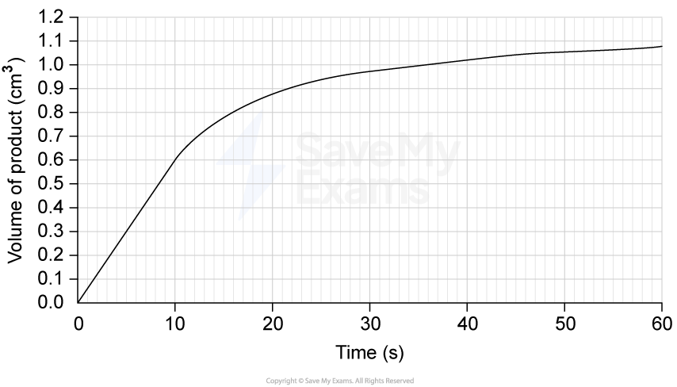

# Exam Questions — Proteins
**2. Membranes, Proteins, DNA & Gene Expression** · Edexcel International A Level (IAL) Biology (YBI11)
> Source: [https://www.savemyexams.com/international-a-level/biology/edexcel/18/topic-questions/2-membranes-proteins-dna-and-gene-expression/proteins/exam-questions/](https://www.savemyexams.com/international-a-level/biology/edexcel/18/topic-questions/2-membranes-proteins-dna-and-gene-expression/proteins/exam-questions/) · 5 questions · total 50 marks

## Q1 — medium — 7 marks · exam-questions

### 1((a)) — 3 marks — command: which — structured — from paper Jan 2021 · WBI11/01
Both DNA and RNA are polynucleotides.

The table shows how the components of polynucleotides can be represented.

(i) Which diagram shows a mononucleotide?

**(1)**

(ii) Which diagram shows two components joined by a phosphodiester bond?

**(1)**

(iii) Which diagram shows complementary base pairing?

**(1)**

### 1((b)) — 4 marks — command: multiple — structured — from paper Jan 2021 · WBI15/01
The diagram shows a sequence of bases in a DNA template (antisense) strand.

| **A** | **T** | **T** | **G** | **G** | **C** | **G** | **A** | **G** | **A** | **A** | **C** |
|---|---|---|---|---|---|---|---|---|---|---|---|

(i) The table shows some statements about the new complementary DNA strand and the mRNA strand synthesised using this sequence of bases.

For each statement, put **one** cross `box enclose bold cross times` in the appropriate box, in each row, to show the correct statement about these strands.

**(3)**

| **Statement** | **Both the new complementary DNA strand and the mRNA strand** | **Only the new complementary DNA strand** | **Only the mRNA strand** | **Neither strand** |
|---|---|---|---|---|
| The number of guanines will be the same as in the template strand |   |   |   |   |
| The number of thymines will be the same as the number of adenines in the template strand |   |   |   |   |
| There will be no adenine present |   |   |   |   |

(ii) Name the process that synthesises a mRNA strand using the DNA template strand.

**(1)**

## Q2 — medium — 13 marks · exam-questions

### 8((a)) — 4 marks — command: multiple — structured — from paper Jan 2021 · WBI11/01
People with lactose intolerance cannot digest lactose.

Lactose intolerance is due to a lack of the enzyme lactase.

(i) Which are the products of lactose digestion?

**(1)**

☐ **A** fructose and galactose 
☐ **B** fructose and glucose 
☐ **C** galactose and glucose 
☐ **D** glucose and glucose

(ii) Explain how the three-dimensional structure of lactase affects the mechanism of action of this enzyme.

**(3)**

### 8((b)) — 7 marks — command: multiple — structured — from paper Jan 2021 · WBI11/01
People with lactose intolerance can drink lactose-free milk.

Lactose-free milk is produced by treating milk with lactase.

There are two ways of removing lactose from milk:

- Mixing a solution of lactase with the milk (free lactase)

  - Enclosing the lactase inside permeable beads and pouring the milk over them (immobilised lactase).

The diagrams show these two methods.

(i) Suggest **one** advantage of using immobilised lactase.

**(1)**

(ii) The table shows the effect of pH on the activity of free lactase and immobilised lactase.

| **pH** | **Activity of free** **lactase** **/ a.u.** | **Activity of** **immobilised lactase** **/ a.u.** |
|---|---|---|
| 2 | 0 | 0 |
| 3 | 0 | 38 |
| 4 | 75 | 75 |
| 5 | 94 | 98 |
| 6 | 63 | 76 |
| 7 | 56 | 63 |
| 8 | 28 | 35 |

Explain the effects of pH on the activity of these two enzymes.

**(4)**

(iii) Suggest how the rate of activity of the lactase could be measured.

Include appropriate units in your answer.

**(2)**

### 8((c)) — 2 marks — command: suggest — structured — from paper Jan 2021 · WBI11/01
Congenital lactose intolerance (CLI) is an extremely rare genetic disorder.

Most people with CLI are found in one country.

Suggest why most people with CLI are found in one country.

## Q3 — medium — 7 marks · exam-questions

### 1((a)) — 5 marks — command: complete — structured — from paper Oct/Nov 2020 · WBI11/01
The primary structure of a protein determines its secondary structure and its three‐dimensional structure.

Read through the following account of the primary structure of a protein.

Complete the account by writing the most appropriate word or words on the dotted lines.

The primary structure of a protein is the specific sequence of amino acids joined together by .................................................... bonds.

These bonds are formed between the ................................................ group of one amino acid and the ..................................................... group of an adjacent amino acid by a .......................................................  reaction.

These bonds are formed during the stage of protein synthesis called ...............................................  .

### 1((b)) — 2 marks — command: which — structured — from paper Oct/Nov 2020 · WBI11/01
The table describes the types of bond that hold the secondary and the three‐dimensional structures together.

Which type of bonding is true for each structure?

| **Structure** | **Hydrogen** **bonds only** | **Ionic** **bonds only** | **Both hydrogen** **and ionic bonds** | **Neither of** **these bonds** |
|---|---|---|---|---|
| secondary structure | □ | □ | □ | □ |
| three‐dimensional structure | □ | □ | □ | □ |

## Q4 — medium — 14 marks · exam-questions

### 1() — 2 marks — command: identify — structured
Catalase is an enzyme that breaks down hydrogen peroxide into water and oxygen. A student investigated the effect of the concentration of catalase on the initial rate of this reaction.

Identify the independent variable and the dependent variable in this investigation.

### 2() — 4 marks — command: describe — structured
State two variables that should be controlled to ensure that the results are valid. For each variable, describe how it could be controlled.

### 3() — 4 marks — command: plot — structured
The table below shows the volume of oxygen produced over 60 seconds using a 5% catalase solution.

| Time (s) | Volume of oxygen (cm³) |
|---|---|
| 0 | 0.0 |
| 10 | 18.0 |
| 20 | 29.0 |
| 30 | 36.0 |
| 40 | 41.0 |
| 50 | 44.0 |
| 60 | 45.0 |

Plot a graph of these results and draw a line of best fit

### 4() — 3 marks — command: determine — structured
Use your graph to determine the initial rate of reaction.

### 5() — 1 mark — command: suggest — structured
Suggest an explanation for the rate of reaction between 40 and 60 seconds.

## Q5 — hard — 9 marks · exam-questions

### 1() — 2 marks — command: calculate — structured
The graph shows the volume of product formed during an enzyme controlled reaction over 60 seconds.

Calculate the average rate of reaction for the first 10 seconds.

### 2() — 3 marks — command: explain — structured
The study in (a) also tested a competitive inhibitor of the enzyme.

Explain why a competitive inhibitor reduces the rate of reaction at low substrate concentrations.

### 3() — 4 marks — command: assess — structured
Scientists recorded the dietary vitamin C intake of 500 adults using self-reported food diaries over a six-month period, and observed a positive correlation between high vitamin C intake and reduced incidence of atherosclerosis.

A student concluded from this that improving vitamin C intake would reduce heart disease.

Assess this conclusion.
