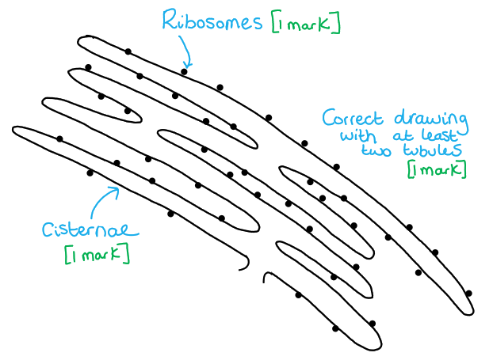
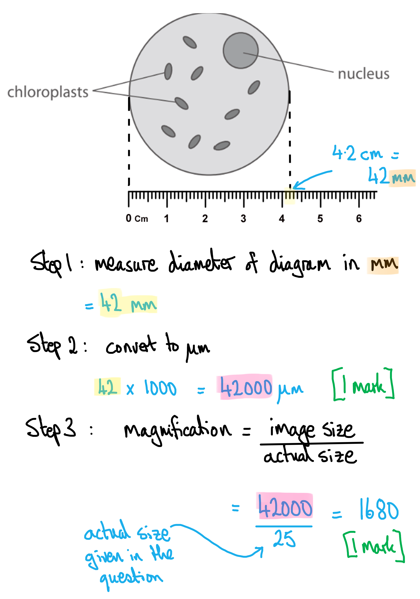
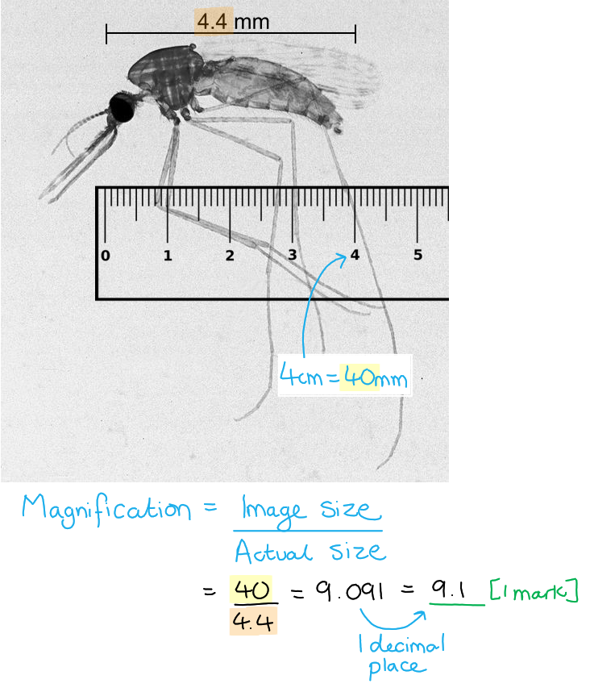
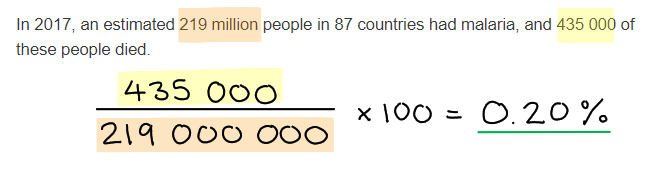

# Mark Schemes — Cell Structure & Organisation
**3. Cell Structure, Reproduction & Development** · Edexcel International A Level (IAL) Biology (YBI11)

## Q1 — medium — 9 marks · exam-questions

### 2((a)) — 2 marks
The types of adaptations shown by this caterpillar are...

| **Feature** | **Type of adaptation** |
|---|---|
| Looks like a pit viper snake | Anatomical; **[1 mark]** |
| Tries to strike potential predators | Behavioural; **[1 mark]** |

**[Total: 2 marks]**

### 2((b)) — 4 marks
(i) The type of microscope used to view this organelle is...

- Electron (microscope); **[1 mark]**

(ii) The function of this organelle is...

- <u>Aerobic</u> respiration; **[1 mark]**
- Produce ATP; **[1 mark]**
- For cell metabolism / named cell process e.g. mitosis/protein synthesis; **[1 mark]**

***Accept ****Krebs/citric acid cycle / oxidative phosphorylation*

**[Total: 4 marks]**

> *Note that this question is asking you to describe the function of the organelle, not the structure. Remember to **never** refer to energy being 'produced'. It can only be released. ATP is produced when the energy from the glucose is transferred to the ATP during the process of respiration. *

### 2((c)) — 3 marks
The drawing should include the following features...

- At least two tubules with ribosomes on surface; **[1 mark]**
- Cisternae/membrane labelled; **[1 mark]**
- Ribosomes labelled; **[1 mark]**

**[Total: 3 marks]**

## Q2 — medium — 9 marks · exam-questions

### 2((a)) — 2 marks
(i) The correct answer is **D** because...

**Cell membranes are found in all three types of cell.**

**A cell membrane is a fundamental part of any cell. It encases the cell contents (cytoplasm and other organelles) and separates the cell from its surroundings.**

(a) (ii) The correct answer is **C **because...

**Plant cells contain a cell wall, as do prokaryotic cells.**

**The cell walls of plant cells are made of cellulose while the cell walls of prokaryotes contain peptidoglycan.**

> *Animal cells do not contain a cell wall. *

**[Total: 2 marks]**

### 2((a)) — 4 marks
(i) The magnification of the diagram is...

- (Cell diameter measured and converted into micrometres =) 42 000 μm; **[1 mark]**
- (Diameter divided by 25 with no units =) x1680; [**1 mark]**

**OR**

- (25 µm converted to mm =) 0.025 mm; **[1 mark]**
- (Measured diameter of 42 mm ÷ 0.025 =) x1680; **[1 mark]**

***Allow**** '×' or 'times' as magnification units. *

***Reject**** µm or any other units for magnification.*

*Correct answer with no units and with no working scores full marks. *

(ii) The function of the chloroplasts in the cell is...

- (The site of) photosynthesis / to convert light energy to chemical energy/ATP / to form glucose/starch/sugars/other named product of photosynthesis; **[1 mark]**

***Ignore ****'makes food' with no named biological molecules*

***Ignore**** 'contains chlorophyll' without explaining the role of chlorophyll.*

(iii) Another reason why this organism is not a prokaryotic cell is...

- (It) has a nucleus / prokaryotic cells do not have a nucleus; **[1 mark]**

***Reject**** references to cell membrane or cytoplasm or membrane-bound organelles as these are not visible in the image.*

**[Total: 4 marks]**

### 2((c)) — 3 marks
(i) The part labelled **X** is...

- Plasmodesma/plasmodesmata; **[1 mark]**

(ii) The function of the part labelled **X **is...

- For communication between cells / to connect neighbouring cells; **[1 mark]**
- Signalling substances can pass through the symplast pathway / via the cytoplasm **OR** for transport of named molecules, e.g. minerals / water / glucose / amino acids / proteins / RNA; **[1 mark]**

*If ****pits****, ****cell wall**** or ****middle lamella**** incorrectly named in part (c) (i), ****accept ****the following:*

*Pits*

- Communication between / connects cells; **[1 mark]**
- Transport of named molecules; **[1 mark]**

*Cell wall*

- Cellulose fibres support the cell; **[1 mark]**
- Helps retain rigid structure / prevent cell lysis; **[1 mark]**

*Middle lamella*

- Joins (adjacent) cells together; **[1 mark]**
- Increases strength / stability of cell / cell wall; **[1 mark]**

**[Total: 3 marks]**

> *Part (ii) here is an example of what examiners call 'error carried forward' (ecf). You will not be penalised in part (c) (ii) if you get the answer wrong in part (c) (i) and name one of three incorrect structures. *

## Q3 — medium — 12 marks · exam-questions

### 7((a)) — 1 marks
The magnification is...

- 40 ÷ 4.4 = 9.1; **[1 mark]**

**[Total: 1 mark]**

> *Make sure your answer is to one decimal place as requested in the question stem. *

### 7((b)) — 1 marks
The correct answer is **B **because...

**0.20% of the people with malaria died.**

**[Total: 1 mark]**

### 7((c)) — 4 marks
(i) The function of a nucleolus is...

- Produce ribosomal subunits; **[1 mark]**

(ii) Three differences in ultrastructure between this cell and a cell taken from the root of a plant are...

Any **three **of the following:

- Plant cell would have starch (grain)/amyloplast (instead of glycogen granule); **[1 mark]**
- Plant cell would have a cell wall made from cellulose / plant cell would have lignin / plant cells do not have chitin cell wall; **[1 mark]**
- Plant cell would contain plasmodesmata/one nucleus (whereas this cell does not); **[1 mark]**
- The plant cell vacuole would be larger; **[1 mark]**

**[Total: 4 marks]**

> *Remember that the question is asking about cells from a **root** and therefore they do not have chloroplasts. Any reference to chloroplasts would not gain a mark. *

> *Make sure to use comparative language in your answer, for example instead of saying "plant cell vacuole is large" you should say that it is "larg**er**". *

### 7((d)) — 6 marks
An evaluation of these treatments are...

> *This is a level-marked question, meaning that this is is marked **according to the levels table**. The indicative content points below the table are **not** to be used in the usual '**one point one mark**' way, but should be used together with the levels table to determine the number of marks which should be awarded. *

| **Level 1** A conclusion may be attempted, demonstrating isolated elements of biological knowledge and understanding but with limited evidence to support the judgement being made.  **[1 mark]** - Description of results using table data.  **[2 marks]** - Consideration of one other point from the list of indicative content below. |
|---|
| **Level 2 **A conclusion is made, demonstrating linkages to elements of biological knowledge and understanding, with occasional evidence to support the judgement being made.  **[3 marks]** - Consideration of two points (other than describing the data) from the list of indicative content below.  **[4 marks]** - Consideration of three points (other than describing the data) from the list of indicative content below. |
| **Level 3 **A conclusion is made, demonstrating sustained linkages to biological knowledge and understanding, with evidence to support the judgement being made.  **[5 marks]** - Consideration of four points (other than describing the data) from the list of indicative content below.  **[6 marks]** - Consideration of five points (other than describing the data) from the list of indicative content below. |

*Indicative content:*

- Description of the table data e.g. a comparison of the numbers of mosquitoes killed/survived
- Consideration of the GM fungus being the most effective treatment
- Consideration that most mosquitoes were resistant to the insecticide used / some were not resistant to insecticide and were killed / inheritance of resistance
- Consideration that resistance arose due to mutation / natural selection / genetic variation in population
- As a gene is only switched on/expressed when the fungus has infected an *Anopheles* mosquito
- The toxin is only produced when the fungus has infected an *Anopheles* mosquito
- Consideration of protein synthesis / detail of the role of rER and Golgi apparatus
- Evaluation of methodology / limitations of the method eg. mosquitoes escaping, small sample size
- Consideration of the wider effects on biodiversity eg. toxin will not poison other insects / humans / organisms whereas insecticides would kill other insects / effect on food chains / biodiversity
- Transfer of the (spider venom) gene to other fungal species

**[Total: 6 marks]**

> *There is lots of information in the question stem here so make sure to consider it all carefully when producing your answer. Remember that high level answers will draw on a range of information, such as the data in the table, information from the question stem, and their own scientific knowledge, to make their conclusion. *

## Q4 — medium — 7 marks · exam-questions

### 1() — 4 marks
(i) The correct statement about rough endoplasmic reticulum is...

**B** the rough endoplasmic reticulum is covered in 80S (large) ribosomes; [1 mark]

> *A** is not correct because rER is covered in 80S (large) ribosomes.*

> *C **and** D** are not correct because rER forms vesicles which contain poly**peptides**.*

(ii) A substance synthesised by the organelle **A **(smooth endoplasmic reticulum) is...

Any **one** of the following:

- Lipids;** [1 mark]**
- Steroids / named steroid hormone; **[1 mark]**

(iii) Two structures that could be present inside the nucleus in the diagram are:

- The nucleolus; **[1 mark]**
- Named genetic material: ribosomes / rRNA / DNA / chromatin / chromatid / chromosomes / nucleosome / mRNA; **[1 mark]**

*Accept histones.*

**[Total: 4 marks]**

> *Make sure to study a diagram carefully before answering the question. It would be easy to mistakenly think that organelle A was the rough endoplasmic reticulum without looking closely. This would have affected your answer to (a) (ii).*

> *You would not gain any marks for stating the nuclear membrane or nuclear pores for (a) (iii).*

### 1((b)) — 3 marks
The plant cells increase in size by:

- Water uptake / increased volume of the cytoplasm / size of vacuole; **[1 mark]**
- The synthesis of additional organelles **OR** the synthesis of named proteins/enzymes; **[1 mark]**
- Which leads to the production of new/more cell membrane/wall; **[1 mark]**

**[Total: 3 marks]**

> *I know you have heard this advice before but make sure to read the question carefully. It would be very easy to see the words **cell division** and give an irrelevant response about how cells divide in plants. This would gain you no marks as the question is about an increase in cell size, not cell number.*

> *Remember, if cells increase in size then that means that there would need to be more cell membrane/wall formation to cover the circumference of the cell. *
