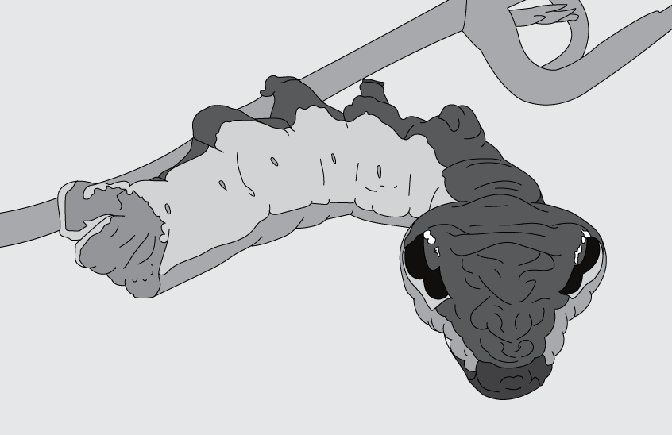
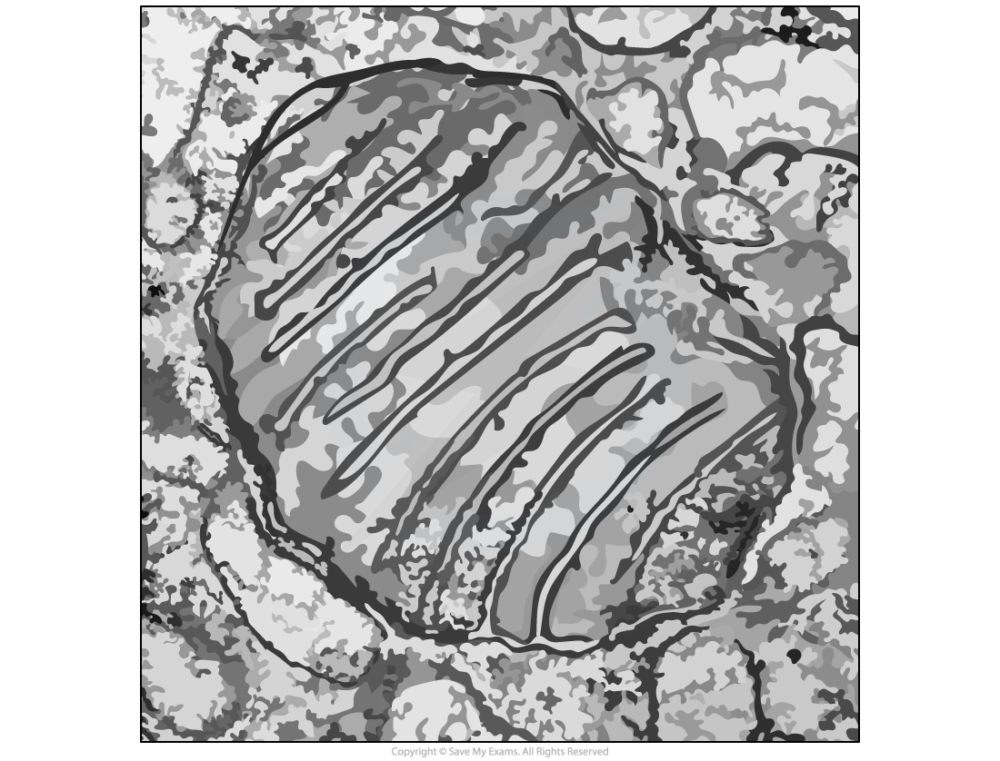
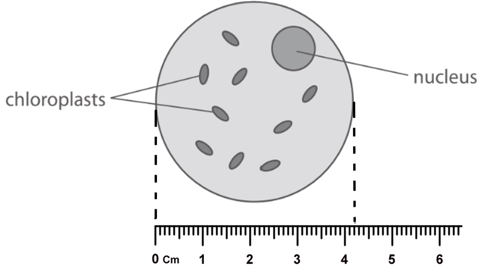
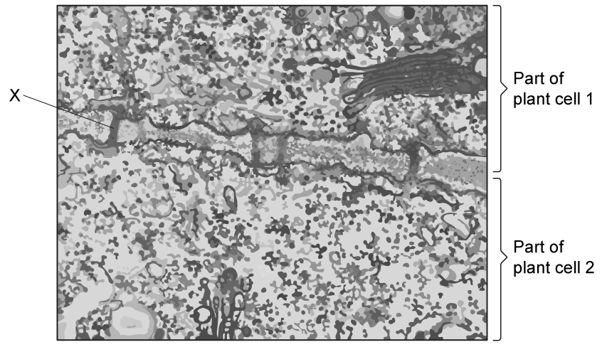
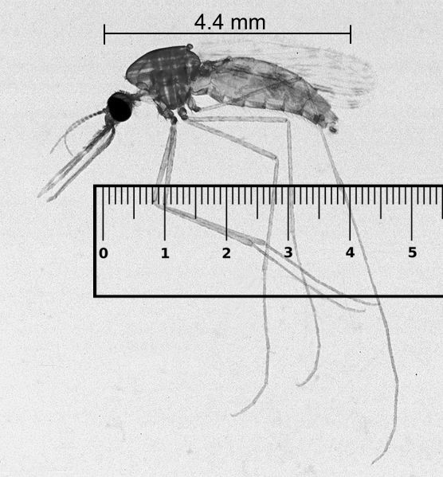
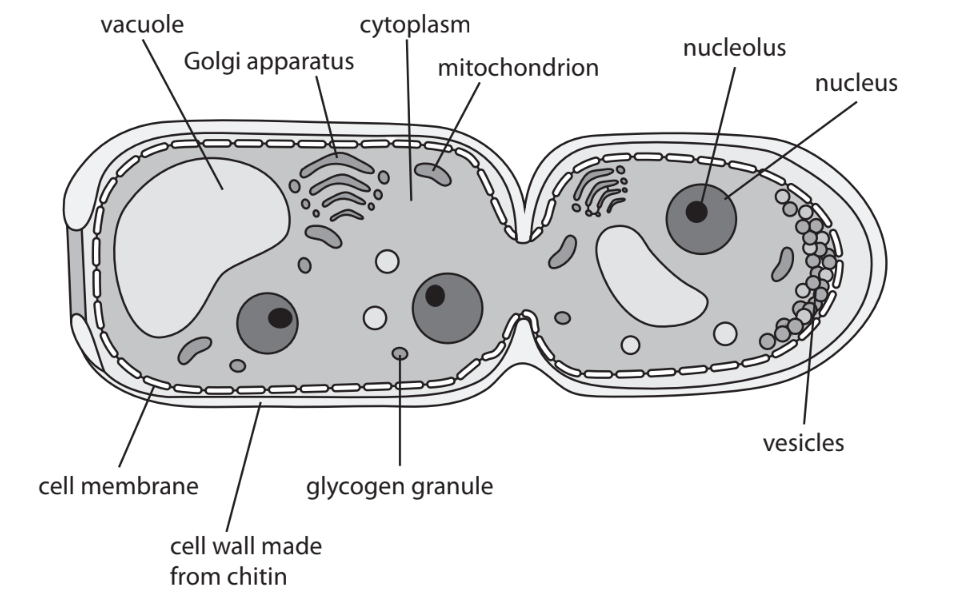
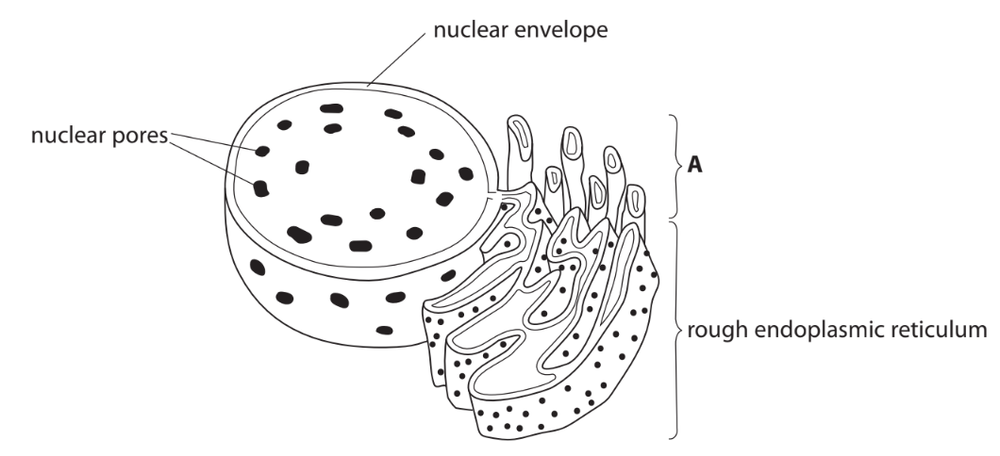

# Exam Questions — Cell Structure & Organisation
**3. Cell Structure, Reproduction & Development** · Edexcel International A Level (IAL) Biology (YBI11)
> Source: [https://www.savemyexams.com/international-a-level/biology/edexcel/18/topic-questions/3-cell-structure-reproduction-and-development/cell-structure-and-organisation/exam-questions/](https://www.savemyexams.com/international-a-level/biology/edexcel/18/topic-questions/3-cell-structure-reproduction-and-development/cell-structure-and-organisation/exam-questions/) · 4 questions · total 37 marks

## Q1 — medium — 9 marks · exam-questions

### 2((a)) — 2 marks — command: complete — structured — from paper Jan 2021 · WBI12/01
The photograph shows the caterpillar of a moth from Costa Rica.

The caterpillar looks like a pit viper snake. It will try to strike potential predators.

This caterpillar is adapted to its niche.

Complete the table to show the type of adaptations shown by this caterpillar.

| **Feature** | **Type of adaptation** |
|---|---|
| Looks like a pit viper snake |   |
| Tries to strike potential predators |   |

### 2((b)) — 4 marks — command: multiple — structured — from paper Jan 2021 · WBI12/01
The photograph shows an organelle that can be found in caterpillar cells, as seen using a microscope.

(i) State the type of microscope used to view this organelle.

**(1)**

(ii) Describe the function of this organelle.

**(3)**

### 2((c)) — 3 marks — command: draw — structured — from paper Jan 2021 · WBI12/01
Rough endoplasmic reticulum is another organelle found in caterpillar cells.

Draw a labelled diagram of rough endoplasmic reticulum.

## Q2 — medium — 9 marks · exam-questions

### 2((a)) — 2 marks — command: multiple — structured — from paper Oct/Nov 2020 · WBI12/01
All organisms contain one or more cells.

(i) In which of the following is a cell membrane present?

**(1)**

| ☐ | **A** | animal cells only |
|---|---|---|
| ☐ | **B** | animal and plant cells only |
| ☐ | **C** | plant and prokaryotic cells only |
| ☐ | **D** | animal, plant and prokaryotic cells |

(ii) In which of the following is a cell wall present?

**(1)**

| ☐ | **A** | plant cells only |
|---|---|---|
| ☐ | **B** | animal and plant cells only |
| ☐ | **C** | plant and prokaryotic cells only |
| ☐ | **D** | animal, plant and prokaryotic cells |

### 2((a)) — 4 marks — command: multiple — structured — from paper Oct/Nov 2020 · WBI12/01
Sailor’s eyeball (*Valonia ventricosa*) is a single-celled, spherical organism.

The diagram shows one of these cells. A ruler scale has been provided to show the diameter of the diagram when viewed on a screen.

(i) The diameter of this cell is 25 μm.

Calculate the magnification of the diagram.

**(2)**

(ii) This cell contains chloroplasts.

State the function of these chloroplasts.

**(1)**

(iii) This cell is not a prokaryotic cell as it contains chloroplasts.

Give **one** other reason why this organism is not a prokaryotic cell.

**(1)**

### 2((c)) — 3 marks — command: multiple — structured — from paper Oct/Nov 2020 · WBI12/01
The image shows part of two adjoining plant cells, as seen using an electron microscope.

(i) Name the part labelled **X**.

**(1)**

(ii) Explain the function of the part labelled **X**.

**   (2)**

## Q3 — medium — 12 marks · exam-questions

### 7((a)) — 1 mark — command: calculate — structured — from paper Jan 2021 · WBI12/01
Female mosquitoes feed on the blood of other animals to promote the development of their eggs. During this process, infected mosquitoes can transmit the *Plasmodium* parasite.

The *Plasmodium* parasite causes the disease malaria.

The photograph shows a female *Anopheles* mosquito.

A ruler has been included for scale.

Alan R Walker, CC BY-SA 3.0 <https://creativecommons.org/licenses/by-sa/3.0>, via Wikimedia Commons

Calculate the magnification of the *Anopheles* mosquito in this photograph.

Give your answer to one decimal place.

### 7((b)) — 1 mark — command: which — structured — from paper Jan 2021 · WBI12/01
In 2017, an estimated 219 million people in 87 countries had malaria, and 435 000 of these people died.

Which of the following shows the percentage of infected people who died?

☐ **A** 0.02% 
☐ **B** 0.20% 
☐ **C** 99.80% 
☐ **D** 99.98%

### 7((c)) — 4 marks — command: multiple — structured — from paper Jan 2021 · WBI12/01
The fungus *Metarhizium pingshaense* infects *Anopheles* mosquitoes.

A student drew a labelled diagram of a fungal cell that was dividing.

(i) State the function of a nucleolus.

**(1)**

(ii) Give **three** differences in ultrastructure between this cell and a cell taken from the root of a plant.

**(3)**

### 7((d)) — 6 marks — command: evaluate — structured — from paper Jan 2021 · WBI12/01
Insecticides are chemicals used to kill insects.

*Anopheles* mosquitoes have developed resistance to the insecticides currently used.

*Metarhizium pingshaense* is a fungus that infects *Anopheles* mosquitoes.

Scientists in West Africa have genetically engineered (GE) this fungus using a gene from a spider.

When the GE fungus infects an *Anopheles* mosquito this gene becomes activated. A toxin is released, which kills the mosquito.

In an investigation, four huts each containing a group of 500 breeding pairs of mosquitoes were used.

Three different treatments used to kill mosquitoes were compared with a control group.

The walls and ceiling of the huts were sprayed with the treatment.

The table shows the number of adult mosquitoes in the first two generations of offspring from each hut after spraying.

| **Treatment** | **Number of adult mosquitoes in each generation** |   |
|---|---|---|
| **First** | **Second** |   |
| Control (no treatment) | 921 | 1396 |
| Insecticide | 919 | 1353 |
| Normal fungus | 436 | 455 |
| GE fungus | 399 | 13 |

Evaluate these three treatments.

Use the information in the question, and your own knowledge, to support your answer.

## Q4 — medium — 7 marks · exam-questions

### 1() — 4 marks — command: multiple — structured — from paper Oct/Nov 2021 · WBI12/01
Eukaryotic cells contain cell organelles.

The diagram shows part of a eukaryotic cell, as drawn by a student.

The nuclear envelope, nuclear pores and rough endoplasmic reticulum are labelled.

(i) Which of the following is a correct statement about rough endoplasmic reticulum?

**(1)**

☐ **A** it has 70S (small) ribosomes 
☐ **B** it has 80S (large) ribosomes 
☐ **C** it forms vesicles surrounding phospholipids only  
☐ **D** it forms vesicles surrounding polysaccharides only

(ii) Name a substance synthesised by the organelle labelled **A **in the diagram.

**(1)**

(iii) Name **two** structures that could be present inside the nucleus in the diagram.

**(2)**

1........................................................... 2...........................................................

### 1((b)) — 3 marks — command: explain — structured — from paper Oct/Nov 2021 · WBI12/01
After cell division, the plant cells produced increase in size.

Explain how these plant cells increase in size.
