# Mark Schemes — Reproduction & Inheritance
**3. Cell Structure, Reproduction & Development** · Edexcel International A Level (IAL) Biology (YBI11)

## Q1 — medium — 9 marks · exam-questions

### 3((a)) — 5 marks
The events that occur from the time a pollen grain lands on the stigma to the production of a triploid endosperm nucleus and a zygote are...

Any **five **of the following:

- (Pollen) tube grows down (style) to ovary/ovule/egg cell/micropyle; **[1 mark]**
- (By releasing) digestive/hydrolytic enzymes; **[1 mark]**
- The generative nucleus divides / undergoes mitosis; **[1 mark]**
- To form two male/haploid nuclei; **[1 mark]**
- One male/haploid nucleus fertilises the egg cell (to form the zygote);  **[1 mark]**
- One male/haploid nucleus fertilises the (two) polar nuclei to form the endosperm (nucleus); **[1 mark]**

**[Total: 5 marks]**

### 3((b)) — 4 marks
The silver trumpet tree produces seeds that are genetically different from each other because...

- Each male nucleus and egg cell nucleus (from silver trumpet trees) is genetically different (from each other) / (each ovule) may have been fertilised by pollen/gamete from (many) different trees; **[1 mark]**
- Due to crossing over of alleles/DNA (between chromatids) / mutation; **[1 mark]**
- Due to independent/random assortment (of chromosomes); **[1 mark]**
- In meiosis; **[1 mark]**

**[Total: 4 marks]**

## Q2 — medium — 10 marks · exam-questions

### 4((a)) — 2 marks
The percentage difference in minimum total length of the Indian flat-haired mouse compared with the minimum total length of the harvest mouse is...

- *Correct difference: *170 - 105 = 65; **[1 mark]**
- *Correct percentage difference to 2 significant figures:* (65 ÷ 105) × 100 = 62%; **[1 mark]**

*Full marks awarded for the correct answer only.*

**[Total: 2 marks]**

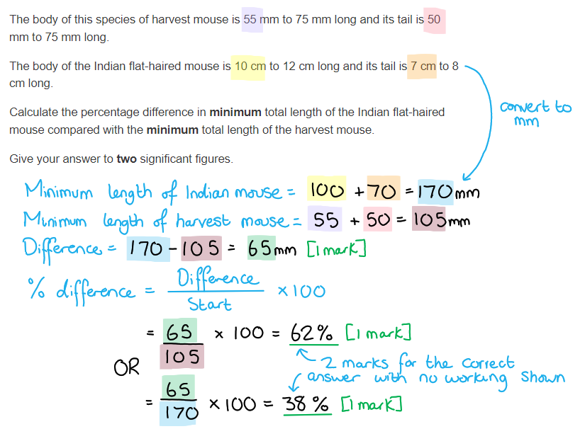

### 4((b)) — 5 marks
(i) The correct answer is** B** because...

**There are 1000 μm in 1 mm, so 88 μm = 0.088 mm.**

> *A** is incorrect because that is the volume in cm**3*

> *C** is incorrect because that is not the volume in mm**3*

> *D** is incorrect because that is the volume in μm**3*

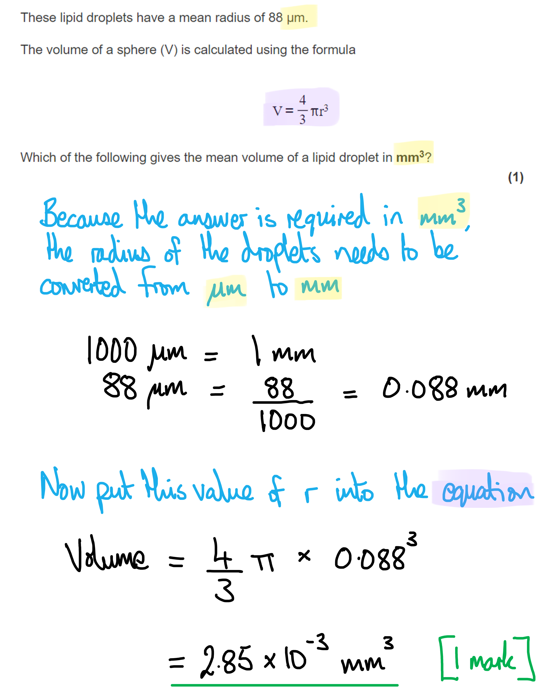

(ii) The mouse morula is...

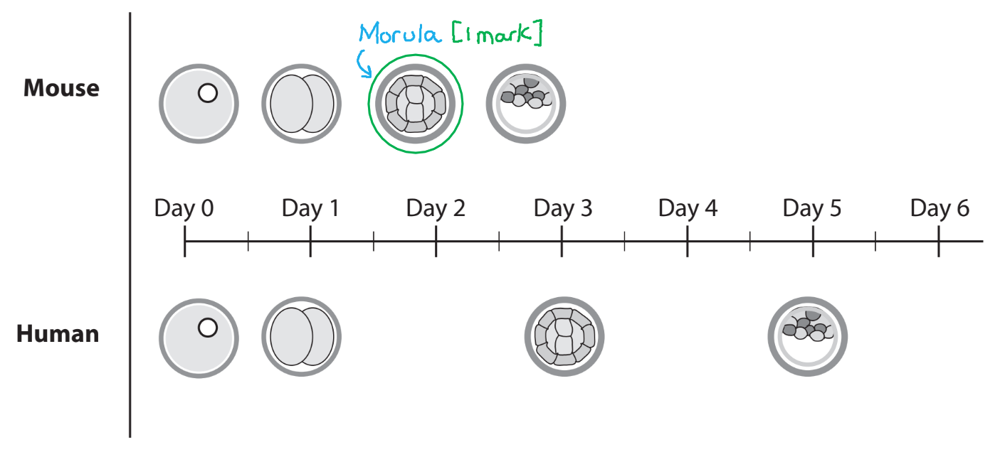

***Accept**** circle without morula label*

***Accept**** morula label without circle*

(iii) The events that occur after a sperm cell enters an egg cell, until a zygote is formed are...

- Fusion of cortical granules with cell (surface) membrane and release of enzymes; **[1 mark]**
- Hardening of zona pellucida (to prevent polyspermy); **[1 mark]**
- Fusion/joining of two haploid nuclei (to form diploid nucleus); **[1 mark]**

**[Total: 5 marks]**

> *Note that is question asks for a description of the events **after** the sperm enters the egg, so any description of the events before this point would not gain marks. *

### 4((c)) — 3 marks
Mitochondria were located within 10 nm of the lipid droplets because...

- It is a short distance between (mitochondria and lipid); **[1 mark]**
- Quicker diffusion of lipid/fatty acid/glycerol (into mitochondria); **[1 mark]**
- Lipids used in respiration / ATP production; **[1 mark]**

Reject any reference to energy being produced

**[Total: 3 marks]**

> *Remember that you need to link the function of the mitochondria to the lipid droplets correctly. Incorrect answers to this question would refer to lipids being used for insulation, or the production of lipids.*

## Q3 — medium — 7 marks · exam-questions

### 3((a)) — 1 marks
The correct answer is **C** because...

**Final answer:** **The order is ****C → D → B → E → A**

**Remember the mnemonic IPMAT (****I****nterphase ****P****rophase ****M****etaphase ****A****naphase ****T****elophase);*** ***C shows interphase, D shows prophase, B shows metaphase, E shows anaphase, and A shows telophase.**

**Note that if you identify stage A as the final stage of the cell cycle (because 2 daughter cells are the result) you can eliminate wrong answers A and B straight away.**

**[Total: 1 mark]**

### 3((b)) — 6 marks
(i) An explanation of the changes in the DNA content as shown by this graph is as follows...

Any **four** of the following:

- DNA content remains constant during G1 / G2 / mitosis **OR** DNA content stays at 2 during G1 **OR** DNA content stays at 4 during G2 / mitosis; **[1 mark]**
- The DNA content doubles **OR** increases **OR** goes from 2 to 4; **[1 mark]**
- (DNE content doubles due to) DNA/chromosome replication / S phase; **[1 mark]**
- The cell divides / carries out cytokinesis (after 15 hours); **[1 mark]**
- The cell produces (two) diploid (daughter) cells **OR** genetically identical (daughter) cells; **[1 mark]**

***Ignore**** references to interphase for marking point 3*

***Ignore**** references to telophase for marking point 4*

> *Avoid the pitfall of mis-reading the command word in this question. The command word is **explain**, so if you launch into a detailed **description** of what the graph is showing, without providing any explanation, you will score zero.*

> *'Explain' requires you to use your knowledge of the biological processes, whereas 'describe' is just 'write what you see'.  *

(ii) A drawing to show how the DNA content would change if the cell had undergone meiosis to form gametes has the following features...

- A similar shape to the graph for mitosis; **[1 mark]**
- With a further division line to reduce DNA content to haploid / 1 a.u.; **[1 mark]**

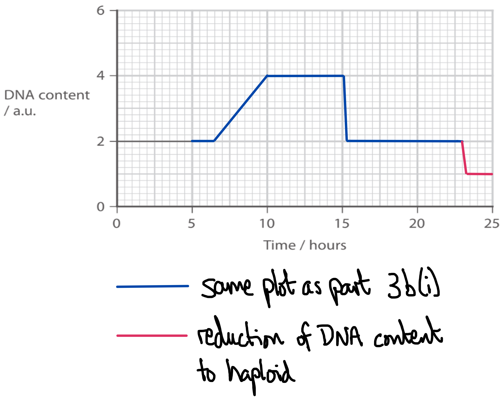

> *The key to scoring full marks on this question is to recognise that meiosis results in **haploid cells** i.e. cells that contain 1 a.u. DNA content.*

**[Total: 6 marks]**

## Q4 — medium — 9 marks · exam-questions

### 6((a)) — 2 marks
The graph to show the distribution for a phenotype showing continuous variation in a population would appear like...

- Graph showing normal distribution; **[1 mark]**
- Both axes labelled e.g. phenotype / characteristic / height (cm) on x axis frequency / number of individuals on y axis; **[1 mark]**

**[Total: 2 marks]**

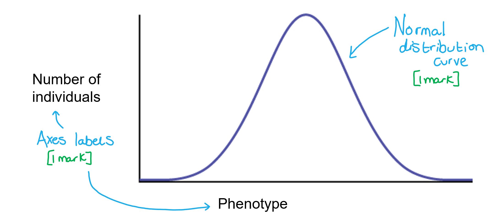

> *When sketching a graph you don't need to include specific plotted points, just the overall shape of the line is important. Also try not to make your line too sketchy/wispy. Make it one solid, clear line.*

### 6((b)) — 4 marks
A mutation could cause the development of teeth in a chicken embryo by...

- (Because) a mutation resulted in these genes becoming switched on / being expressed / not being switched off / remaining switched on; **[1 mark]**
- Transcription of/(active) mRNA made from (active tooth production) genes; **[1 mark]**
- (Therefore) translation (of mRNA) occurs / proteins are formed (for teeth development); **[1 mark]**
- (Proteins cause) a structural change to cells (in the beak) that changes them into teeth cells **OR **proteins result in (embryo) cells differentiating into teeth cells; **[1 mark]**

**[Total: 4 marks]**

### 6((c)) — 3 marks
The frequency of allele B can be calculated as follows...

- Calculation of q2 = 0.23; **[1 mark]**
- Value for q = 0.48; **[1 mark]**
- Value for p to two decimal places; **[1 mark]**

**[Total: 3 marks]**

> *Make sure to always show your working, in steps, for these kinds of question because if you get the final answer wrong you can still be awarded marks for your method. *

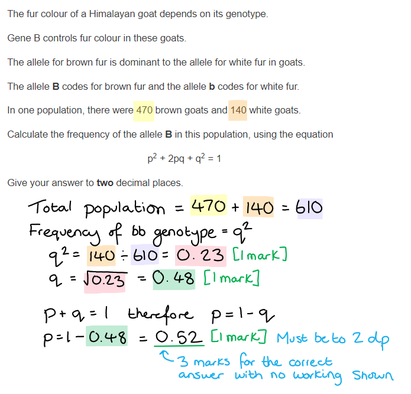

## Q5 — medium — 13 marks · exam-questions

### 7((a)) — 2 marks
(i) The correct answer is **A **(metaphase 1).

**Independent assortment occurs when the homologous pairs of chromosomes line up during metaphase I.**

(ii) The correct answer is **C **(prophase I).

**The homologous pairs of chromosomes pair up during prophase I. It is at this point that crossing over takes place.**

**[Total: 2 marks]**

### 7((b)) — 3 marks
The percentages are not 25 % for each combination of alleles because...

Any **three** of the following:

- <u>Linkage</u>; **[1 mark]**
- Genes A and B are on same chromosome **OR** a combination of 25 % would need gene A and B to be on separate chromosomes; **[1 mark]**
- Genes / alleles / AB / ab / 48 % are not separated due to crossing over **OR** AB / ab are inherited together **OR** the closer together two loci are the smaller the chance of separation (by recombination) **OR** the further apart the two loci are the greater the chance of separation (by recombination); **[1 mark]**
- Ab / aB / 2 % are formed by crossing over **OR** Ab / aB are recombinants; **[1 mark]**

**[Total: 3 marks]**

> *To unlock the marks on this question you have to spot that **linkage** is the reason for the unusual inheritance pattern (note: this is often the case!). Alleles located close together on the same chromosome are less likely to be separated by crossing over, because there is a statistically smaller chance of a chiasma forming between two genes as the gap between them gets smaller.*

> *If you build your answer on ideas of mutation, dominant/recessive alleles and random assortment, you will be on the wrong track.*

### 7((c)) — 5 marks
More than one type of protein can be synthesised from the RNA produced from one gene in the following ways...

- (Pre-) mRNA undergoes post transcriptional changes / splicing; **[1 mark]**
- Non-coding sections / introns / P, R, T, V **and** X are removed by enzymes/spliceosomes; **[1 mark]**
- Exons / Q, S, U **and** W are rearranged / some exons are removed / not all exons are used; **[1 mark]**
- Two examples of different resulting exon order are given, e.g. QSUW **and** SQUW; **[1 mark]**
- This results in a different amino acid sequence **OR** a different sequence of amino acids can result in a different polypeptide / differences in folding/bonding / a different 3D protein shape; **[1 mark]**

**[Total: 5 marks]**

> *At the heart of this question is a knowledge of **alternative splicing** and how different amino acid sequences can be formed as a result. Beware getting distracted by topics such as mutations and epigenetics as no credit will be given for this content.*

> *Before writing your answer, invest some time thinking about exactly what the question is asking you. It is never wasted time to read and re-read the question to be sure of the detail required. *

### 7((d)) — 3 marks
Comments on the changes in the activity of these two genes could be as follows...

Any **three** of the following:

- (The activity of) gene T decreases (during development) and that of gene U increases; **[1 mark]**
- Gene T is switched off; **[1 mark]**
- The product of gene T is not needed / not produced once the blastocyst stage is reached / not needed after the 8-cell stage is reached; **[1 mark]**
- The product of gene U is needed at higher levels after the 8-cell / morula stage **OR** gene U is involved in the  specialisation of the cells **OR** a correct suggested description of the role of the protein produced from gene U; **[1 mark]**

*Ignore references to gene U being activated/switched on as its activity did not begin at zero.*

**[Total: 3 marks]**

## Q6 — medium — 7 marks · exam-questions

### 3((a)) — 3 marks
(a) (i) The correct answer is **C** (two correct statements) because...

**Final answer:** **The first and third statements are correct**** because the diagram shows three gene loci, and one maternal and one paternal chromosome.**

> *The second statement is incorrect** because homologous pairs of chromosomes are not separated during mitosis, as at no point during mitosis do the homologous pairs of chromosomes pair up with each other. During mitosis the chromosomes line up in** **single file and it is the sister chromatids that are separated from each other when the centromere breaks.*

> *Homologous chromosomes are separated during **meiosis **(not mitosis).*

(ii) When the chromosomes enter the interphase stage of the cell cycle the following events take place...

- (The chromosomes) uncoil; **[1 mark]**
- (The chromosomes are involved with) protein synthesis / transcription **OR** DNA replication; **[1 mark]**

**[Total: 3 marks]**

### 3((b)) — 4 marks
(i) The stage of meiosis in which crossing over begins is...

- Prophase I; **[1 mark]**

(ii) The correct answer is **C** because...

Any combination of alleles **from those present** at the gene loci shown could occur.

> *The combination ABe could not occur because the allele B is not present on either of the chromosomes shown.*

(iii) Alleles b and e are more likely to be inherited together than alleles A and e because...

- Alleles b and e are closer together; **[1 mark]**
- Crossing over / a chiasma is less likely to occur (between alleles that are closer together); **[1 mark]**

***Accept**** reverse answers for both marking points, e.g. "alleles A and e are further apart" and "crossing over is more likely to occur (between alleles that are further apart)".*

***Accept**** chiasmata for chiasma in marking point 2.*

> *Distant alleles are more likely to be separated by crossing over than alleles that are close together. This is due to the increased chromosome length available in between the alleles for crossing over to take place. When alleles are located close together on a chromosome there is little space in between them for crossing over to occur.*

**[Total: 4 marks]**

## Q7 — medium — 12 marks · exam-questions

### 5((a)) — 6 marks
(i) A labelled diagram of the Golgi apparatus should have the following features…

- At least two curved cisternae;
- At least one vesicle;
- Cisternae labelled;
- One other correctly labelled feature, e.g. cis-face / trans face / lumen / membrane; **[1 mark]**

***Reject**** marking point 1 if ribosomes have been drawn or if the cisternae are connected to each other (these are features of rough/smooth endoplasmic reticulum).*

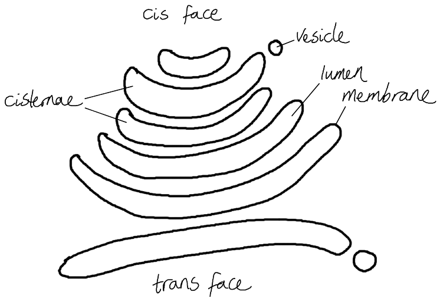

(ii) The correct answer is **C** (two) because...

**The Golgi apparatus is involved with the folding of proteins (e.g. to form enzymes) and with the modification of proteins (e.g. the addition of ions).**

> *Peptide binds form during translation in the cell cytoplasm.*

(iii) The structure in the cell that would become radioactive first is **D** (ribosomes) because...

**The ribosomes are the site of translation which occurs during protein synthesis.**

> *All of the other structures are involved, or formed, after translation has occurred:*

- *Centrioles (A) are made of protein, but these proteins need to undergo translation before forming into the centrioles.*
- *The Golgi apparatus (B) modifies proteins after the end of translation.*
- *The lysosomes (C) contain digestive enzymes which form after the process of translation has finished.*

**[Total: 6 marks]**

### 5((b)) — 6 marks
(i) The percentage difference in the diameters of the golgi apparatus is...

- 120 (%) **OR** 54.5 / 55 (%); **[1 mark]**

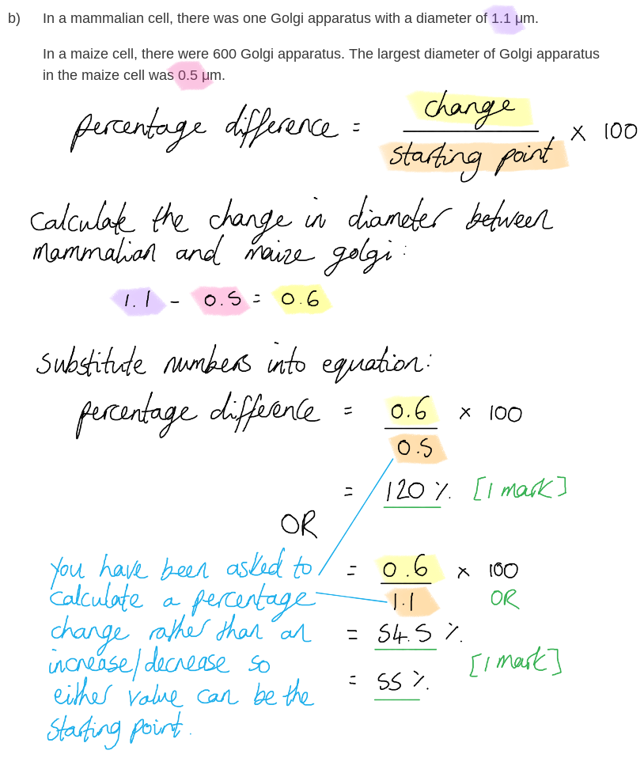

(ii) The stage of the cell cycle during which the number and size of the Golgi apparatus would increase is **B** because...

**Cell organelles grow and replicate during interphase in preparation for cell division; this ensures that there are enough organelles for the new daughter cells.**

> *Anaphase (A), prophase (C), and telophase (D) are all part of nuclear division and do not involve the growth and replication of organelles.*

(iii) The number and size of the Golgi apparatus change during the cell cycle because...

Any **four** of the following:

- During mitosis two cells are formed from one (parent) cell; **[1 mark]**
- The number/size of Golgi has to increase (during interphase/G1); **[1 mark]**
- (Increasing the number of Golgi) ensures that there are enough organelles/Golgi for two (daughter) cells (after mitosis); **[1 mark]**
- (Increasing the number of Golgi) allows increased levels of protein production / modification / packaging to occur eg. in interphase; **[1 mark]**
- Cells require <u>named</u> proteins (from protein synthesis), e.g. enzymes, hormones, structural proteins; **[1 mark]**

***Accept ****other named proteins for marking point 5, e.g. haemoglobin / antibodies / antigens / transport proteins.*

**[Total: 6 marks]**

## Q8 — medium — 10 marks · exam-questions

### 6((a)) — 4 marks
Cortical granules ensure that the egg cell is diploid after fertilisation by...

Any **four** of the following:

- (The contents of) cortical granules are released (from the egg cell);
- Cortical granules fuse with the zona pellucida / egg cell (surface) membrane;
- Cortical granules release chemicals/enzymes/proteins which cause the hardening of the zona pellucida;
- (The hardening of the zona pellucida) prevents more than one sperm entering the egg cell / prevents polyspermy;
- The egg cell and sperm cell nuclei are haploid and fuse (during fertilisation to produce a diploid cell); **[1 mark]**

**[Total: 4 marks]**

> *Note that it is always a good idea to refer to the female gamete as an egg **cell** rather than just an egg; this avoids confusing it with, e.g. a bird's egg!*

### 6((b)) — 6 marks
> *This is a** level-marked question**, meaning that it is marked **according to the levels table**. The indicative content points below the table are **not** to be used in the usual **'one point = one mark'** way, but should be used together with the levels table to determine the number of marks which should be awarded.*

> *For this question:*

- *I** = relevant **i**nformation taken from the question about the reproductive strategies*
- *R** = ways in which the strategy affects an individual's **r**eproductive success*
- *G** = ways in which the strategy affects **g**enetic diversity*

| **Level 1** | **[1 mark]** | - A limited number of relevant comments are provided AND no judgement is made about the effect of the different strategies - Comments about R or G are made relating to one mating strategy OR basic information (I) is given |
|---|---|---|
| **Level 1** | **[2 marks]** | - A limited number of relevant comments are provided AND no judgement is made about the effect of the different strategies - Comments about R and G are made relating to one mating strategy OR comments about R or G are made relating to two mating strategies OR basic information (I) is given and 1 or 2 comments are made relating to R or G |
| **Level 2** | **[3 marks]** | - Some relevant comments are provided AND a limited accurate judgement is made about the effect of the different strategies - 3 comments are made relating to R or G |
| **Level 2** | **[4 marks]** | - Some relevant comments are provided AND a limited accurate judgement is made about the effect of the different strategies - 4 comments are made relating to R or G |
| **Level 3** | **[5 marks]** | - Most relevant comments are provided AND a detailed and accurate judgement is made about the effect of the different strategies - Comments are made relating to R for all three strategies and relating to G for two strategies OR comments are made relating to G for all three strategies and relating to R for two strategies |
| **Level 3** | **[6 marks]** | - Most relevant comments are provided AND a detailed and accurate judgement is made about the effect of the different strategies - Comments are made relating to R AND G for all three strategies |

The effect that these three mating strategies would have on the reproductive success of the males and females, and the genetic diversity of the offspring includes...

*Indicative points relating to the strategy: increasing the length of the sperm middle region*

- (**I**) Increased length of the middle region increases swimming speed
- (**I**) This is because of an increased number of mitochondria releasing more energy / producing more ATP to move the flagella
- (**R**) A longer middle region increases the chances of the sperm reaching the egg cell first / fertilising the egg cell / reproductive success for that male
- (**R**) Males with alleles for longer mid-sections will have an advantage over other males
- (**G**) More offspring will have the same father / inherit the same alleles (due to one individual having increased success)
- (**G**) There could be a reduction in genetic diversity (due to this strategy)
- (**G**) The fact that females produce many eggs and mate with many males could increase genetic diversity

*Indicative points relating to the strategy: using spermatophores*

- (**I**) Spermatophores contain sperm which can fertilise the egg cell
- (**R**) Female can use nutrients to produce egg cells that contain more nutrients / more egg cells
- (**R**) Chemicals/pheromones reduce the chances of other males mating with the female
- (**R**) There is an increased chance of the original male's sperm fertilising the egg cell / reproductive success
- (**G**) More offspring will have the same father / inherit the same alleles (due to one individual having increased success)
- (**G**) There could be a reduction in genetic diversity (due to this strategy)

*Indicative points relating to the strategy: storage of sperm*

- (**I**) Fertilised eggs / offspring can be produced in the absence of a mate (provided that a mate was present within the last few years)
- (**R**) There is increased reproductive success for the female / for the male that originally mated with the female
- (**G**) The offspring may have multiple/several different fathers / inherit different alleles (to each other)
- (**G**) Having several different fathers will increase genetic diversity
- (**G**) If the female were to not mate for several years then this could lead to reduced genetic diversity

**[Total: 6 marks]**

> *This is a tricky question that covers content contained in the question itself that you may not have come across before. Make sure that you read the information carefully and that you have a good understanding of each mating strategy before you start writing.*

> *As ever in these level-marked questions it is essential that you aim to give as **broad** an answer as possible; to gain full marks here you need to address **all three strategies** and consider how each strategy affects both reproductive success **and **genetic diversity.*

## Q9 — medium — 11 marks · exam-questions

### 7((a)) — 6 marks
> *This is a level-marked question, meaning that it is marked according to the levels table. The indicative content points below the table are not to be used in the usual 'one point = one mark' way but should be used together with the levels table to determine the number of marks which should be awarded.*

| Level 1 | **[1 - 2 marks]** | Consideration of both types of reproductive behaviour from given information only **OR **more detailed consideration of one type of reproductive behaviour |
|---|---|---|
| Level 2 | **[3 - 4 marks]** | All level 1 info plus consideration of **two** of: - Explanation of advantage/disadvantage of asexual reproduction on survival of nematodes - Explanation of advantage/disadvantage of sexual reproduction on survival of nematodes - Effect of reproductive behaviour on the genetic diversity of offspring produced - Explanation of the impact of genetic diversity on the survival of nematodes |
| Level 3 | **[5 - 6 marks]** | All level 2 info plus consideration of **all **of: - Explanation of advantage/disadvantage of asexual reproduction on survival of nematodes - Explanation of advantage/disadvantage of sexual reproduction on survival of nematodes - Effect of reproductive behaviour on the genetic diversity of offspring produced - Explanation of the impact of genetic diversity on the survival of nematodes |

The indicative content below is not prescriptive and candidates are not required to include all the material indicated as relevant. Additional content included in the response must be scientific and relevant.

*A detailed description of asexual reproduction in nematodes:*

- Hermaphrodites can self-fertilise / reproduce without the need to find a mate
- Fertilising their own egg cells using their own sperm cells
- As a result, they produce fewer nematode offspring
- All offspring generated by this method are likely to be hermaphrodites
- As all gametes will contain a sex chromosome

*A detailed description of sexual reproduction in nematodes:*

- Hermaphrodites can reproduce with a mate / male nematode
- Males have only one chromosome
- If hermaphrodite mates with a male then (700) more egg cells are fertilised
- Half of the offspring will be hermaphrodites/ half will be male
- If sperm cells without a sex chromosome fertilise an egg cell then the offspring will be male
- If sperm cells with a sex chromosome fertilise an egg cell then the offspring will be hermaphrodites
- Half of the male sperm cells will not contain a sex chromosome

*Explanation of advantages/disadvantages of asexual reproduction on survival of nematodes*

- Advantages of reproducing without the need to find a mate/ all offspring being hermaphrodites in terms of chance of survival
- Disadvantages of fewer offspring in terms of chance of survival; fewer offspring will reduce the species chance of survival

*Explanation of advantages/disadvantages of sexual reproduction on survival of nematodes*

- Disadvantages of needing to find a mate to reproduce in terms of chance of survival
- Advantages of more offspring on the increased reproductive success /chance of survival/ the increased future sexual reproduction of nematode population/species/offspring

*Effect of reproductive behaviour on the genetic diversity of offspring produced*

- Self-fertilisation leads to limited genetic variation in the offspring / decrease/no change in the gene pool
- Sexual reproduction/mating with male nematode results in increased genetic variation of offspring

*Explanation of the impact of genetic diversity on the survival of nematodes*

- Disadvantages of limited genetic variation in regards to survival
- Advantages of increased genetic variation in regards to survival
- Benefits of having more offspring with increased genetic variation

**[Total: 6 marks]**

> *In your answer, you must acknowledge that the question is not just referring to individual nematodes, but also to the population or species.  In order to score a level 3 answer here you would need to have considered the effect the reproductive behaviours would have on future reproductive success.*

### 7((b)) — 5 marks
How histone modification can be passed on to embryos:

Any **five** of the following:

- Histone modification can be passed onto zygotes; **[1 mark]**
- If enzyme M is present, histone modification is passed on to all chromosomes / the embryo after cell division in experiment 1; **[1 mark]**
- Cells divide by mitosis **OR** cell division involves the replication of DNA; **[1 mark]**
- If enzyme M is absent in the egg cell cytoplasm then the histone modification decreases until no longer detected; **[1 mark]**
- Histone modification decreases because replicated DNA cannot be modified without enzyme (M); **[1 mark]**
- Description of histone modification; **[1 mark]**

*Ignore: genes being switched on/off.*

**[Total: 5 marks]**

> *Be careful not to forge ahead and write a generic response about histone modification here. Your answer needed to be specific to the experiments shown above.*

## Q10 — medium — 15 marks · exam-questions

### 8((a)) — 2 marks
How an egg cell is specialised for its function:

Any **two** of the following:

- It is haploid so that when it is fertilised a zygote is formed / it becomes diploid; **[1 mark]**
- It contains lipid droplets which act as a source of energy **OR** they are large cells that are able to store more lipids/energy; **[1 mark]**
- There are cortical granules / enzymes to harden the zona pellucida / prevent polyspermy **OR** they release chemicals to attract sperm **OR** sperm bind to glycoproteins on egg cell (surface); **[1 mark]**

**[Total: 2 marks]**

### 8() — 7 marks
(i) Compare and contrast metaphase in mitosis and meiosis:

Similarities

- Lining up of chromosomes/ chromatids occurs along the equator (of cell); **[1 mark]**
- Centromere / chromosomes / chromatids bond to the spindle fibres in metaphase; **[1 mark]**

Differences

Maximum of **two** from the following:

- There are two metaphase stages in meiosis whereas mitosis has only one; **[1 mark]**
- Independent/random assortment occurs (in metaphase I) in meiosis whereas it does not occur in mitosis; **[1 mark]**
- Meiosis involves homologous pairs of chromosomes (in metaphase I) and sister chromatids (in metaphase II) whereas mitosis involves sister chromatids; **[1 mark]**

(ii) How the cells of the beluga morula change as they develop into the cells of the blastocyst:

Any **four** of the following:

- Morula cells are totipotent whereas blastocyst cells are pluripotent; **[1 mark]**
- The specialisation of cells / differentiation occurs because gene(s) get switched off in blastocyst cells; **[1 mark]**
- Due to epigenetic modification / DNA methylation / histone modification; **[1 mark]**
- There is transcription of the active genes to produce (active) mRNA / (active) mRNA is translated at the ribosomes; **[1 mark]**
- The proteins produced determine / change the cell structure/function; **[1 mark]**

**[Total: 7 marks]**

> *Make sure to read the question carefully. For (b) (i) you need to focus on metaphase, you won't get marks for writing about  any of the other stages!*

### 8() — 6 marks
(i) The value for DΣ2:

| **Age/weeks** | **Rank of** **age** | **Mass of egg** **/g** | **Rank of** **mass of egg** | ***D*** | ***D*****2** |
|---|---|---|---|---|---|
| 36 | 1 | 2.27 | 8 | −7 | 49 |
| 39 | 2 | 1.91 | **1** | **1** | **1** |
| 42 | 3 | 2.18 | 5.5 | −2.5 | 6.25 |
| 45 | 4 | 2.28 | 9 | −5 | 25 |
| 48 | 5 | 2.12 | 4 | 1 | 1 |
| 51 | 6 | 2.19 | 7 | −1 | 1 |
| 54 | 7 | 2.18 | 5.5 | 1.5 | 2.25 |
| 57 | 8 | 2.09 | 3 | 5 | 25 |
| 60 | 9 | 2.03 | 2 | **7** | **49** |
|   |   |   |   | **Total:** | **159.5** |

- ∑D2= 159.5; **[2 marks]**

*Correct answer with no working shown scores full marks.*

*1 mark awarded for correct ∑ using incorrect D**2** values calculated in table.*

(ii) The correlation coefficient:

- Correct values substituted into formula; **[1 mark]**

`r subscript s equals space 1 space minus space fraction numerator 6 open parentheses 159.5 close parentheses over denominator 9 open parentheses 81 minus 1 close parentheses end fraction`

- Correct rs value: = -0.329 / -0.33 / -0.3; **[1 mark]**

(iii) The null hypothesis should be...

- Accepted; **[1 mark]**
- Because 0.38 is lower than 0.683; **[1 mark]**

**[Total: 6 marks]**

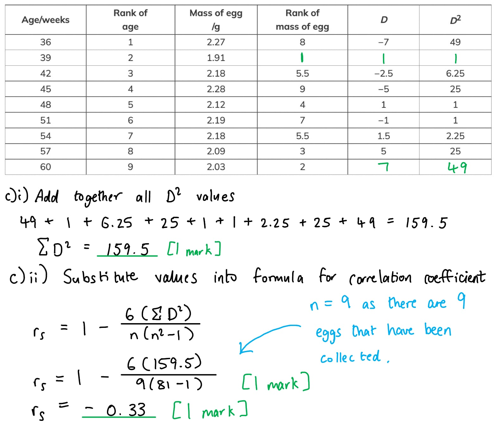

## Q11 — medium — 6 marks · exam-questions

### 3((a)) — 2 marks
The volume of the liposome is...

- Calculation of volume of liposome = 220893;
- Expressed in standard form = 2 x 105 / 2.2 x 105/ 2.21 x 105 (nm3);

*Full marks awarded for the correct answer only.*

**[Total: 2 marks]**

> *1 mark for doing the correct calculation but using 75 as the radius. *

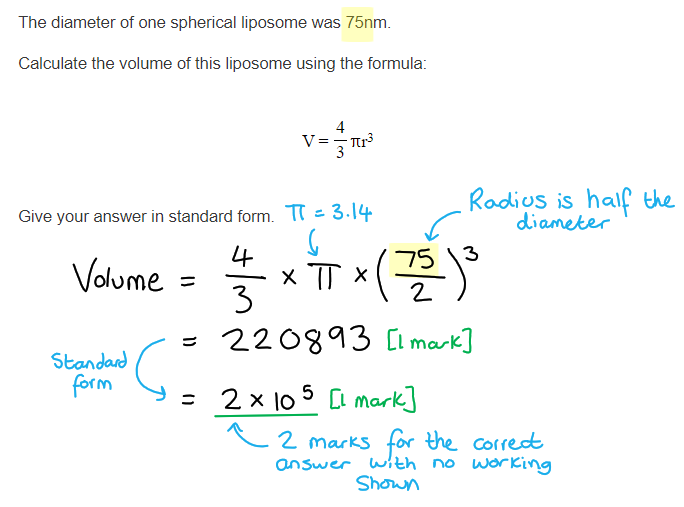

### 3((b)) — 4 marks
A comparison of pre-mRNA and active mRNA is...

Any **four **of the following:

*Similarities*

- Both are single-stranded / linear; **[1 mark]**
- Both contain the bases A,U,C,G / both contain a base, phosphate group and ribose (sugar) / both contain phosphodiester bonds / both do not contain thymine; **[1 mark]**
- An exon on pre-mRNA contains same base sequence as the matching exon on active mRNA; **[1 mark]**

*Differences*

- Pre-mRNA contains both introns and exons whereas active RNA only contains exons / pre-mRNA is longer / has more bases than active mRNA / pre-mRNA has recognition site for splicesome whereas active RNA does not; **[1 mark]**
- Active mRNA may have fewer/different order of exons (than pre-mRNA); **[1 mark]**

**[Total: 4 marks]**

> *It is important to remember that compare and contrast questions require both similarities and differences. Therefore, full marks can only be awarded if the answer contains both similarities and differences.*

## Q12 — medium — 9 marks · exam-questions

### 4((a)) — 2 marks
(i) The correct answer is **B **(stage K) because...

**The DNA content is being increasing from 2 to 4 a.u.**

(ii) The correct answer is **B** (stage L) because...

**The chromosomes have to condense after replication but before metaphase (M).**

**[Total: 2 marks]**

### 4((b)) — 5 marks
(i) The stage of mitosis when spindle fibres begin to form is...

- Prophase; **[1 mark]**

(ii) The role of the spindle in mitosis is....

Any **two **of the following:

- The attachment/binding of centromeres (to the spindle fibres); **[1 mark]**
- To allow the separation of the (daughter) chromatids/chromosomes / contract to move chromatids/chromosomes to opposite poles/ends of cell; **[1 mark]**
- So that each daughter cell gets identical genetic material/same number of chromosomes; **[1 mark]**

(iii) A drawing of a plant cell undergoing cell division, after mitosis has just finished would appear as follows...

- Cell wall and nuclear envelopes present/reforming; **[1 mark]**
- Cell plate visible; **[1 mark]**

**[Total: 5 marks]**

> *The cell that you draw needs to be a plant cell and therefore a cell wall needs to be present. It is important to remember that plant cells divide after a cell plate has formed, and so your drawing should show a part formed cell plate.*

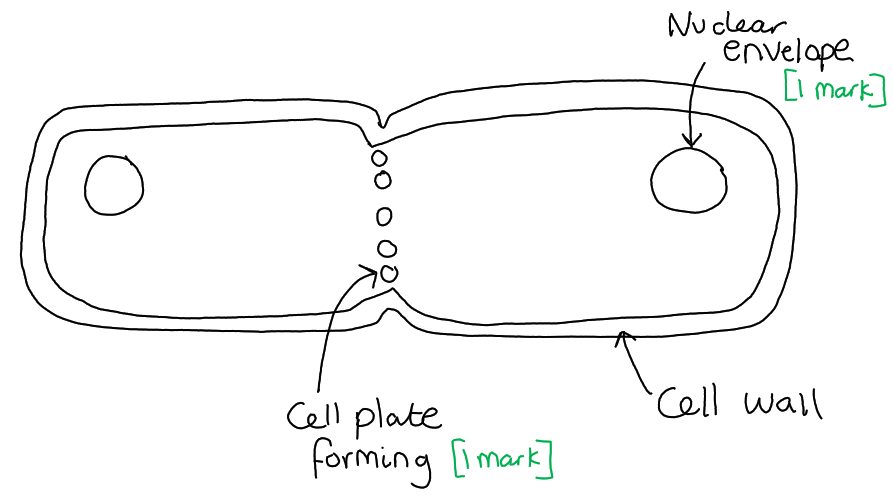

### 4((c)) — 2 marks
The mitotic index could be determined by...

- Count number of cells in mitosis and the total number of cells; **[1 mark]**
- Divide the number of cells in mitosis by the total number of cells in the photograph (then multiply the answer by 100); **[1 mark]**

**[Total: 2 marks]**

## Q13 — medium — 8 marks · exam-questions

### 6((a)) — 6 marks
There is a large variation in the skin colour of the offspring produced from this cross because...

> *This is a level-marked question, meaning that this is is marked **according to the levels table**. The indicative content points below the table are **not** to be used in the usual '**one point one mark**' way, but should be used together with the levels table to determine the number of marks which should be awarded. *

| **Level 1** **[1 or 2 marks]** Limited number of the most important or relevant scientific factors from the data/information provided are synthesised.  No judgement is made. |
|---|
| **Level 2** **[3 or 4 marks]**** **Some of the most important or relevant scientific factors from the data/information provided are synthesised.  A limited accurate judgement is made. |
| **Level 3 ****[5 or 6 marks]**** **Most of the important or relevant scientific factors from the data/information provided are synthesised.  A detailed and accurate judgement is made. |

*Indicative content:*

- Description of table data e.g., the more dominant alleles present in the zygote increases the darkness of the skin
- Description of polygenic inheritance e.g. the expression of more than one gene affects the outcome of the phenotype
- Recognition that 3 genes / 6 alleles involved with this phenotype / each gamete contains 3 alleles involved with this phenotype

- Description of graph data
- E.g., phenotype shows normal distribution / phenotype shows continuous variation
- E.g., offspring have highest probability of inheriting 3 dominant alleles/medium skin colour

- Consideration that large variation due to crossing over of genetic material / allele / DNA in prophase I
- Description of crossing over e.g. non-sister chromatids exchanging alleles

- Consideration that large variation due to random assortment of chromosomes in metaphase I
- Description of random assortment e.g. the production of different combinations of alleles in daughter cells due to the random alignment of homologous pairs along the equator of the spindle during metaphase I of meiosis I

- Consideration that random fertilisation of genetically different gametes increases variation

- Consideration of probability of different types of mutation e.g., silent
- Consideration of environmental variation/mutation increasing variation e.g. sun tan, DNA methylation
- Explanation of how environmental variation/mutation would increase variation e.g. pigment production

**[Total: 6 marks]**

> *Level 1 can be achieved by describing some information from the question/table and the graph only.*

> *A level 2 answer involves building on this to consider some of the genetic causes of variation, for example crossing over and independent assortment in meiosis.*

> *In order to produce a level 3 answer then you would need to extend your answers to consider random fertilisation of gametes and how the environment/mutations affect variation in skin colour.*

### 6((b)) — 2 marks
Two reasons why individuals that have inherited the genotype AaBbCc, may have a darker skin colour than other individuals with the same genotype are...

Any **two **of the following:

- Increased/more exposure to UV/sun light (would result in a darker skin tone); **[1 mark]**
- Mutation could result in production of a protein which would result in a darker skin tone / fewer melanocytes **OR **epigenetic modification; **[1 mark]**
- Limited food source containing materials for pigment synthesis / disease killing pigment cells **OR **skin cancer / disease; **[1 mark]**

**[Total: 2 marks]**

> *It is important to always read the question carefully, for example you must take note of the words ‘same genotype’. If you suggest that the difference was down to a different genotype you cannot get a mark. *

## Q14 — medium — 11 marks · exam-questions

### 8((a)) — 2 marks
The sticky proteins would have been secreted by...

- Being packaged into a (secretory) vesicle by the Golgi apparatus/body; **[1 mark]**
- (Vesicle) fuses with cell surface membrane to release them outside of the cell / exocytosis; **[1 mark]**

**[Total: 2 marks]**

### 8((b)) — 4 marks
A comment on the result of the investigation is...

- Individual sperm have slower speeds than bundled sperm (in all resistances); **[1 mark]**
- Increase in resistance (above 0.5) decreased the speed of individual sperm more than bundled sperm / individual sperm speed decreases with increased resistance whereas bundled sperm speed increases/stays relatively constant; **[1 mark]**
- (Because) bundles of sperm/more flagella can generate more force; **[1 mark]**
- Lower confidence/no significant difference in results for 0.5 resistance due to overlap of SD/error/range bars / resistance has little effect on the speed of the sperm bundle as the error bars for each of the resistance overlap; **[1 mark]**

***Accept**** converse for all points e.g. bundled sperm have faster speeds than individual sperm*

**[Total: 4 marks] **

> *You need to make sure you compare the data from the two types of sperm, rather than just commenting on the two trends in isolation from each other. *

### 8((c)) — 5 marks
(i) The correctly plotted graph is...

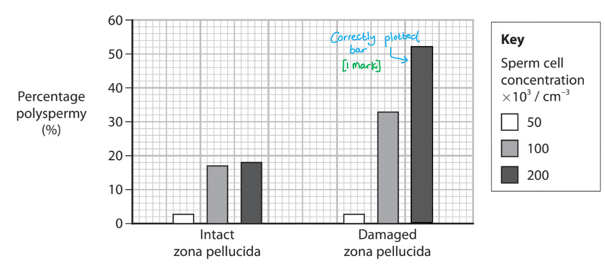

> *The bar must be plotted in the correct location along the x-axis and shaded in accordance with the information in the key.*

(ii) An explanation of the results of the experiment is...

Any **four **of the following:

- There was more polyspermy of egg cells when the zona pellucida was damaged / less polyspermy of egg cells when there is intact zona pellucida; **[1 mark]**
- Due to cortical reactions only occurring over some part of the egg cell **OR **fewer/no cortical reactions (with damaged zona pellucida); **[1 mark]**
- (Therefore some) areas of the egg cell not being covered by a hardened zona pellucida; **[1 mark]**
- There was more polyspermy of egg cells with a higher sperm concentration; **[1 mark]**
- Increased sperm cell concentration increased the likelihood of sperm cells entering the egg cell before cortical reaction occurred / through the gap in hardened zona pellucida **OR **increased sperm cell concentration increased the concentration of digestive enzymes / rate of digestion of zona pellucida; **[1 mark]**

**[Total: 5 marks]**

## Q15 — medium — 12 marks · exam-questions

### 1() — 3 marks
> **[mark-scheme]**
> (i) One variable that the scientist would need to control in this investigation is:
> 
> Any **one** from:
> 
> - Temperature
> - pH
> - Presence of other solutes in the solution
> - Number of sperm cells / sperm concentration
> - The time for which the sperm cells were in the glucose solution before fertilisation was attempted
> - Age of sperm sample
> - Source of sperm / individual donor
> 
> Accept any reasonable suggestion relating to the source or condition of the egg cells
> 
> **[1 mark]**
> 
> (ii) The mean percentage would have been determined for each concentration as follows:
> 
> - Fertilisation rates from repeated experiments/replicates added together and divided by the number of repeats **[1 mark]**
> - Any anomalous results left out / ignored **[1 mark]**

### 2() — 3 marks
> **[mark-scheme]**
> Any **three** from:
> 
> As glucose concentration increases, mean fertilisation rate increases because:
> 
> - Increasing glucose availability increases the rate of respiration **SO** increases ATP production
> - More ATP allows the flagellum to move more **SO** allowing the sperm to swim faster
> 
> At higher glucose concentrations (above 10 mM), mean fertilisation rate decreases because:
> 
> - The water potential of the surrounding solution decreases **SO** creating a water potential gradient (between the sperm and the solution)
> - Water leaves the sperm cells by osmosis **SO** reducing their function / reducing motility
> 
> **[3 marks]**

> **[exam-tip]**
> This question asks you to suggest an explanation, not a description. You will not be awarded marks for simply restating what the data shows, for example writing "as glucose concentration increases, fertilisation rate increases." You need to explain why this relationship exists by linking glucose availability to biological processes in the sperm cell.

### 3() — 3 marks
> **[mark-scheme]**
> Award **three** from:
> 
> Arguments for the conclusion
> 
> - 10 mM glucose produced the highest mean fertilisation rate / 70% fertilisation rate
> - The investigation was carried out using human sperm cells in vitro, which closely matches the conditions of IVF
> 
> Arguments against the conclusion (maximum of **two**)
> 
> - No concentrations between 5 mM and 20 mM were tested, so 10 mM may not be the true optimal concentration
> - No statistical test has been carried out, so it cannot be determined whether the difference in fertilisation rate between concentrations is significant
> - This is a single study, so the results may not be applicable to all IVF practice / may not be the same for all sperm cells / all egg cells

> **[exam-tip]**
> In evaluate questions, you should always try to present arguments both for and against the conclusion. Begin by considering what the data directly supports or contradicts. Then think about the experimental design — were there any factors that might limit the applicability of the results to real-world situations, or that strengthen the case for the conclusion? Finally, consider whether appropriate statistical analysis has been carried out to determine whether any differences observed are significant.

### 4() — 3 marks
> **[mark-scheme]**
> Any **three** from:
> 
> - Cortical granules fuse with the egg cell surface membrane **AND** release enzymes
> - Enzymes cause the zona pellucida to harden / thicken
> - Enzymes modify the sperm binding sites so other sperm can no longer attach to the zona pellucida
> - This prevents polyspermy / prevents additional sperm cells from entering the egg cell
> 
> **[3 marks]**

## Q16 — medium — 11 marks · exam-questions

### 1() — 3 marks
> **[mark-scheme]**
> - A = metaphase **[1 mark]**
> - C = interphase **[1 mark]**
> - D = telophase **[1 mark]**

> **[exam-tip]**
> Read the question carefully and make sure you only identify the stages shown in cells A, C and D — you have not yet been asked about cell B.
> 
> When identifying stages of mitosis, look carefully at the appearance and arrangement of the chromosomes.
> 
> - In metaphase, chromosomes are condensed and aligned along the equator / middle of the cell
> - In interphase, no individual chromosomes are visible within the nucleus
> - In telophase, two groups of chromosomes can be seen at opposite poles of a single cell

### 2() — 2 marks
> **[mark-scheme]**
> Any **two** from:
> 
> - Centromeres split / divide
> - Spindle fibres contract / shorten
> - Chromatids / one copy of each chromosome pulled to opposite poles
> 
> **[2 marks]**

### 3() — 3 marks
To calculate the mitotic index of sample 1 (**X**):

- Determine the total number of cells in mitosis:

6 + 5 + 4 + 3 = 18

- Use the mitotic index formula

mitotic index = (number of cells in mitosis ÷ total number of cells) × 100

= (18 ÷ 60) × 100

= **30 **%

To calculate the total number of cells in sample 2 (**Z**):

- Rearrange the mitotic index formula to find the total number of cells

total number of cells = (number of cells in mitosis ÷ mitotic index) × 100

- Determine the total number of cells in mitosis

10 + 9 + 8 + 5 = 32

- Use the rearranged formula

= (32 ÷ 40) × 100

= **80** cells

To calculate the number of cells in interphase in sample 2 (**Y**):

- Subtract the number of cells in mitosis from the total number of cells

= 80 − 32

= **48** cells

> **[mark-scheme]**
> - X =** **30** ****[1 mark]**
> - Y = 48** ****[1 mark]**
> - Z = 80** ****[1 mark]**
> 
> Award full marks for correct answers in the absence of working shown.
> 
> Accept error carried forward for Y, if this is calculated from an incorrect value of Z.

### 4() — 3 marks
> **[mark-scheme]**
> Any **three** from:
> 
> - Epigenetic modification **OR** DNA methylation **OR** histone modification / acetylation
> - Differential gene expression occurs / different genes are switched on or off / only certain genes are transcribed to produce mRNA
> - Pre-mRNA can be spliced in different ways **OR** different exons are retained / different introns are removed during splicing
> - Different proteins control/determine the activities of the cell
