# Exam Questions — Reproduction & Inheritance
**3. Cell Structure, Reproduction & Development** · Edexcel International A Level (IAL) Biology (YBI11)
> Source: [https://www.savemyexams.com/international-a-level/biology/edexcel/18/topic-questions/3-cell-structure-reproduction-and-development/reproduction-and-inheritance/exam-questions/](https://www.savemyexams.com/international-a-level/biology/edexcel/18/topic-questions/3-cell-structure-reproduction-and-development/reproduction-and-inheritance/exam-questions/) · 16 questions · total 160 marks

## Q1 — medium — 9 marks · exam-questions

### 3((a)) — 5 marks — command: describe — structured — from paper Jan 2021 · WBI12/01
The diagram shows the nuclei in an ovule of a flowering plant.

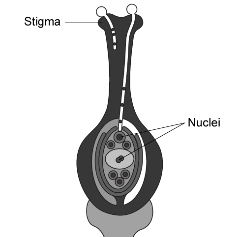

Double fertilisation takes place in the ovules.

Describe the events that occur from the time a pollen grain lands on the stigma to the production of a triploid endosperm nucleus and a zygote.

Use the information in the diagram to support your answer.

### 3((b)) — 4 marks — command: explain — structured — from paper Jan 2021 · WBI12/01
The photograph shows flowers from a silver trumpet tree in Thailand.

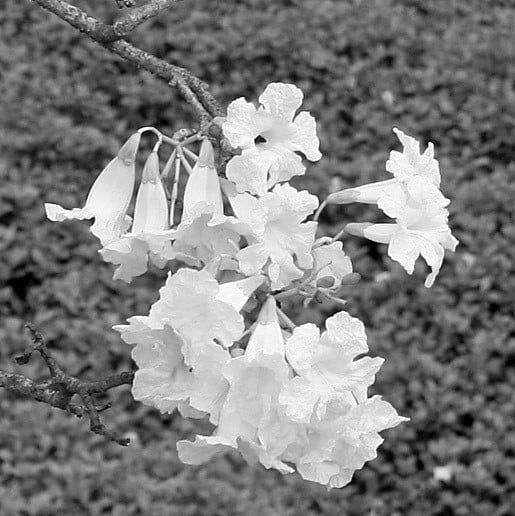

I, J.M.Garg, CC BY-SA 3.0 <https://creativecommons.org/licenses/by-sa/3.0>, via Wikimedia Commons

Flowering plants such as the silver trumpet tree contain several ovules.

Explain how the silver trumpet tree produces seeds that are genetically different from each other.

## Q2 — medium — 10 marks · exam-questions

### 4((a)) — 2 marks — command: calculate — structured — from paper Jan 2021 · WBI12/01
The photograph shows a species of harvest mouse native to countries in Asia.

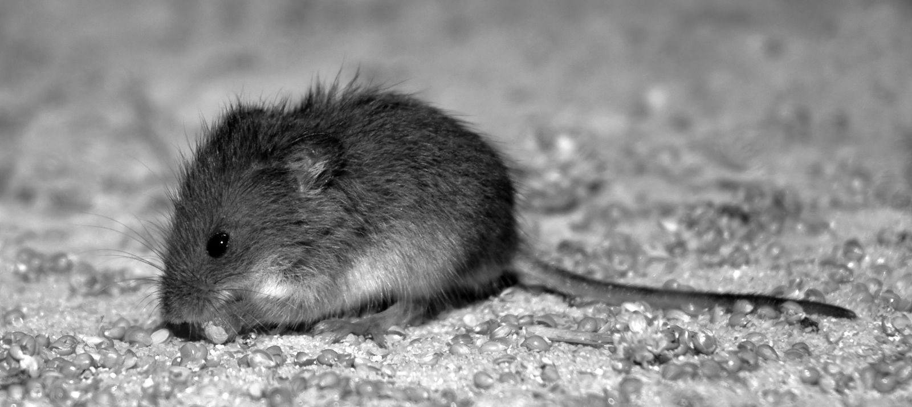

André Karwath aka Aka, CC BY-SA 2.5 <https://creativecommons.org/licenses/by-sa/2.5>, via Wikimedia Commons

The body of this species of harvest mouse is 55 mm to 75 mm long and its tail is 50 mm to 75 mm long.

The body of the Indian flat-haired mouse is 10 cm to 12 cm long and its tail is 7 cm to 8 cm long.

Calculate the percentage difference in **minimum** total length of the Indian flat-haired mouse compared with the **minimum** total length of the harvest mouse.

Give your answer to **two** significant figures.

### 4((b)) — 5 marks — command: multiple — structured — from paper Jan 2021 · WBI12/01
The diagram shows the timeline for the structures formed after fertilisation in a mouse and in a human.

A fertilised egg cell is called a zygote.

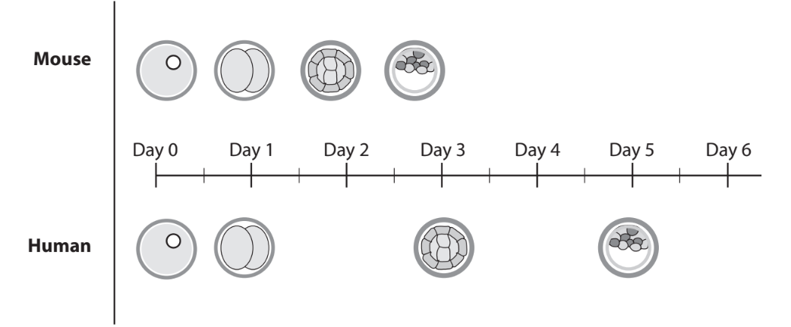

(i) As mouse egg cells develop they accumulate small spherical lipid droplets.

These lipid droplets have a mean radius of 88 μm.

The volume of a sphere (V) is calculated using the formula

$V=\frac{4}{3}\mathrm{πr}^{3}$ 
Which of the following gives the mean volume of a lipid droplet in **mm****3**?

**(1)**

☐     **A        ** 2.85 × 10-6 
☐     **B**          2.85 × 10-3 
☐     **C         ** 2.85 × 103 
☐      **D**          2.85 × 106

(ii) Draw a circle around the part of the diagram that is a mouse morula.

Label the circle ‘morula’.

**(1)**

(iii) Describe the events that occur after a sperm cell enters an egg cell, until a zygote is formed.

**(3)**

### 4((c)) — 3 marks — command: suggest — structured — from paper Jan 2021 · WBI12/01
Analysis of some mouse egg cells showed that the lipid droplets were located within 10 nm of mitochondria.

Suggest why mitochondria were located within 10 nm of the lipid droplets.

## Q3 — medium — 7 marks · exam-questions

### 3((a)) — 1 mark — command: which — structured — from paper Oct/Nov 2020 · WBI12/01
Cells undergo cell division.

The diagrams show cells from a plant.

The cells are in different stages of division.

These cells do not show the correct order for the process of division by mitosis.

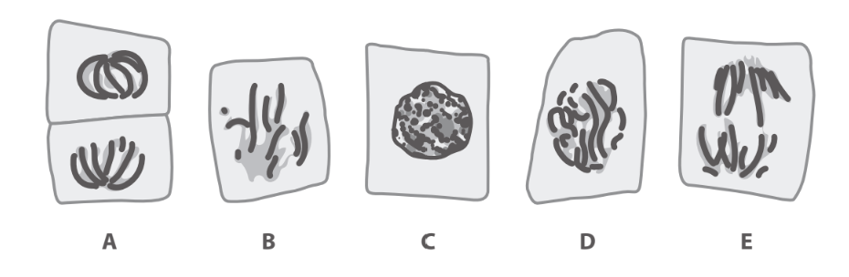

Which of the following shows the correct order for the process of division by mitosis?

| ** ** | **1st** | **2nd** | **3rd** | **4th** | **5th** |
|---|---|---|---|---|---|
| ☐ **A** | A | E | B | D | C |
| ☐ **B** | A | D | C | E | B |
| ☐ **C** | C | D | B | E | A |
| ☐ **D** | C | B | E | D | A |

### 3((b)) — 6 marks — command: multiple — structured — from paper Oct/Nov 2020 · WBI12/01
The graph shows the changes in the DNA content of a cell during one cell cycle.

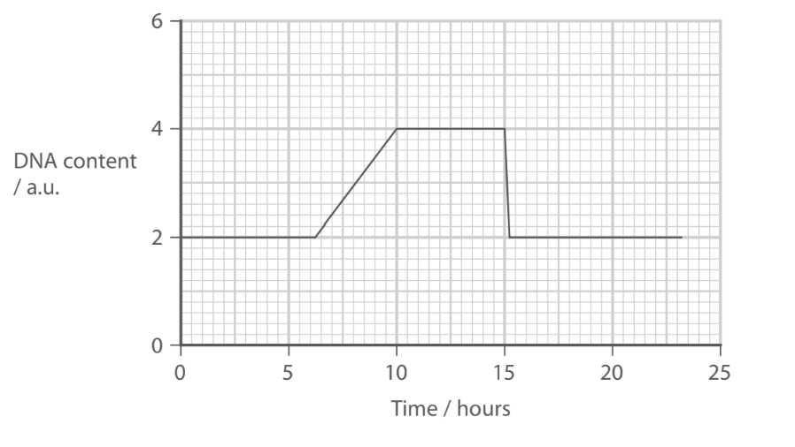

(i) Explain the changes in the DNA content as shown by this graph.

**(4)**

(ii) Complete the graph to show how the DNA content would change if the cell had undergone meiosis to form gametes.

**(2)**

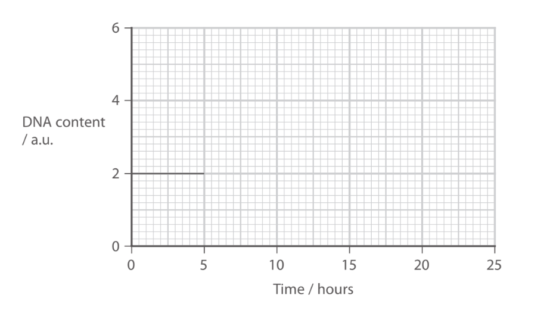

## Q4 — medium — 9 marks · exam-questions

### 6((a)) — 2 marks — command: sketch — structured — from paper Jan 2021 · WBI12/01
The phenotype of an organism is the result of interactions between the genotype and the environment.

Phenotypes can show continuous or discontinuous variation in a population.

Sketch a graph to show the distribution for a phenotype showing continuous variation in a population.

### 6((b)) — 4 marks — command: explain — structured — from paper Jan 2021 · WBI12/01
The presence or absence of teeth in chickens is one example of a discontinuous phenotype.

Chicken genomes contain the genes for tooth production, but chickens do not normally develop teeth.

These genes are switched off as the embryo develops.

Explain how a mutation could cause the development of teeth in a chicken embryo.

### 6((c)) — 3 marks — command: calculate — structured — from paper Jan 2021 · WBI12/01
The photograph shows some Himalayan goats.

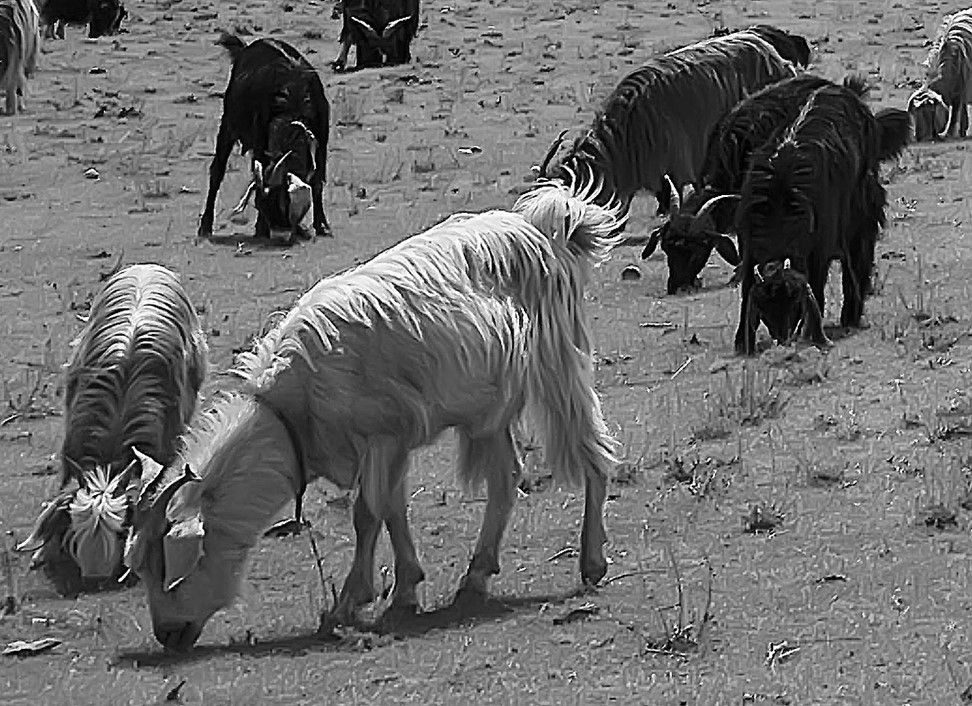

Tahsin A Shah, CC BY-SA 4.0 <https://creativecommons.org/licenses/by-sa/4.0>, via Wikimedia Commons

The fur colour of a Himalayan goat depends on its genotype.

Gene B controls fur colour in these goats.

The allele for brown fur is dominant to the allele for white fur in goats.

The allele** B** codes for brown fur and the allele **b** codes for white fur.

In one population, there were 470 brown goats and 140 white goats.

Calculate the frequency of the allele **B** in this population, using the equation

p2 + 2pq + q2 = 1

Give your answer to **two** decimal places.

## Q5 — medium — 13 marks · exam-questions

### 7((a)) — 2 marks — command: which — structured — from paper Oct/Nov 2020 · WBI12/01
Meiosis increases genetic variation through independent assortment and crossing over.

(i) In which stage of meiosis does independent assortment occur?

**(1)**

| ☐ | **A** | metaphase I |
|---|---|---|
| ☐ | **B** | metaphase II |
| ☐ | **C** | telophase I |
| ☐ | **D** | telophase II |

(ii) In which stage of meiosis does crossing over occur?

**(1)**

| ☐ | **A** | metaphase I |
|---|---|---|
| ☐ | **B** | metaphase II |
| ☐ | **C** | prophase I |
| ☐ | **D** | prophase II |

### 7((b)) — 3 marks — command: explain — structured — from paper Oct/Nov 2020 · WBI12/01
Genetic variation increases due to the production of new combinations of alleles.

A cell has gene A and gene B with alleles A, a and B, b.

Meiosis could produce the following percentages of gametes containing the combinations of alleles shown in the table.

| **Combination of alleles** | **Percentage of total gametes produced (%)** |
|---|---|
| AB | 48 |
| Ab | 2 |
| aB | 2 |
| ab | 48 |

Explain why the percentages are not 25 % for each combination of alleles.

### 7((c)) — 5 marks — command: describe — structured — from paper Oct/Nov 2020 · WBI12/01
More than one type of protein can be synthesised from the RNA produced from one gene.

The diagram shows parts of this process.

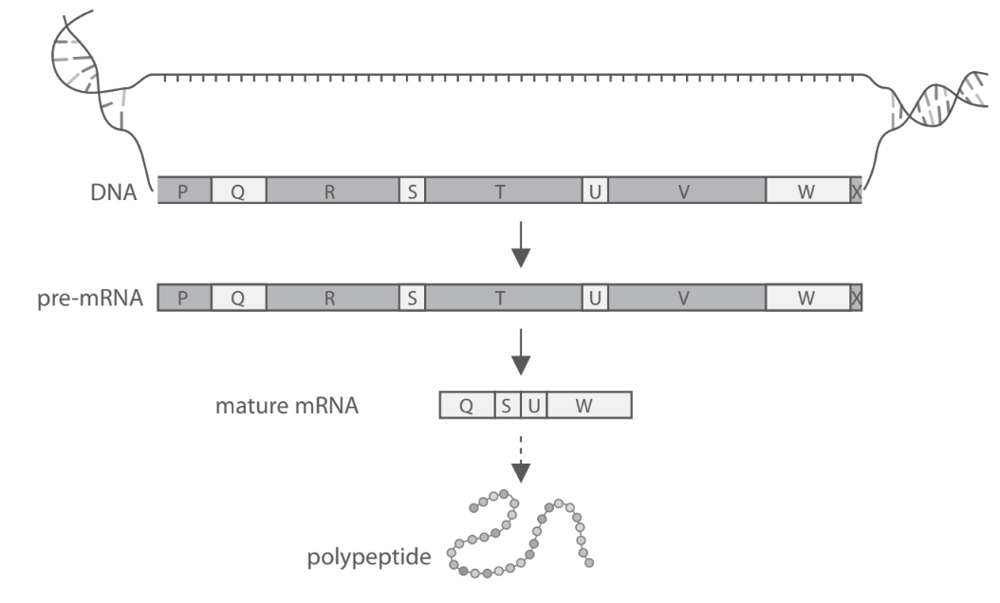

Describe how more than one type of protein can be synthesised from the RNA produced from one gene.

Use the information in the diagram to support your answer.

### 7((d)) — 3 marks — command: comment — structured — from paper Oct/Nov 2020 · WBI12/01
The graphs show the activity of two genes, T and U, as a mouse zygote (fertilised egg cell) develops into a blastocyst.

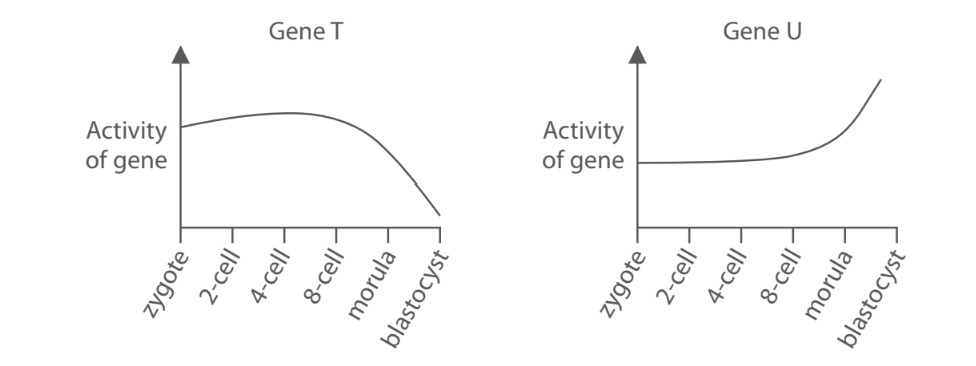

Comment on the changes in the activity of these two genes.

## Q6 — medium — 7 marks · exam-questions

### 3((a)) — 3 marks — command: multiple — structured — from paper June 2021 · WBI12/01
The nucleus of a cell contains chromosomes.

The diagram shows three genes present on a pair of chromosomes.

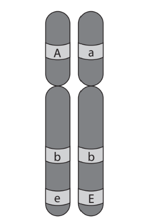

(i) How many of the following statements about this diagram are correct?

- there are three gene loci
- the pair of chromosomes will be separated into different cells following mitosis
- one chromosome was inherited from the mother and one chromosome was inherited from the father

**(1)**

| ☐ | **A** | none |
|---|---|---|
| ☐ | **B** | one |
| ☐ | **C** | two |
| ☐ | **D** | three |

(ii) Describe what will happen to these chromosomes when they enter the interphase stage of the cell cycle.

**(2)**

### 3((b)) — 4 marks — command: multiple — structured — from paper June 2021 · WBI12/01
Crossing over between pairs of chromosomes increases genetic variation.

(i) Name the stage of meiosis in which crossing over begins.

**(1)**

(ii) How many of the following combinations could result from one crossover of the chromosomes shown in the diagram?

- AbE
- ABe
- abE
- abe

**(1)**

| ☐ | **A** | one |
|---|---|---|
| ☐ | **B** | two |
| ☐ | **C** | three |
| ☐ | **D** | four |

(iii) Explain why alleles b and e are more likely to be inherited together than alleles A and e.

**(2)**

## Q7 — medium — 12 marks · exam-questions

### 5((a)) — 6 marks — command: multiple — structured — from paper June 2021 · WBI12/01
The number and size of Golgi apparatus vary depending on the type of cell.

(i)  Draw a labelled diagram of the Golgi apparatus.

**(4)**

(ii) How many of the following are functions of the Golgi apparatus?

- formation of extracellular enzymes
- modification of proteins
- formation of peptide bonds through condensation reactions

**(1)**

| ☐ | **A** | none |
|---|---|---|
| ☐ | **B** | one |
| ☐ | **C** | two |
| ☐ | **D** | three |

(iii) A cell was supplied with radioactive amino acids. The cell took in these amino acids and used them in protein synthesis.

Which structure in the cell would become radioactive first?

**(1)**

| ☐ | **A** | centrioles |
|---|---|---|
| ☐ | **B** | Golgi apparatus |
| ☐ | **C** | lysosomes |
| ☐ | **D** | ribosomes |

### 5((b)) — 6 marks — command: multiple — structured — from paper June 2021 · WBI12/01
In a mammalian cell, there was one Golgi apparatus with a diameter of 1.1 μm.

In a maize cell, there were 600 Golgi apparatus. The largest diameter of Golgi apparatus in the maize cell was 0.5 μm.

(i) Calculate the percentage difference in these diameters.

**(1)**

(ii) The number and size of the Golgi apparatus in the maize cell increases during one stage of the cell cycle.

In which stage of the cell cycle would the number and size of the Golgi apparatus increase?

**(1)**

| ☐ | **A** | anaphase |
|---|---|---|
| ☐ | **B** | interphase |
| ☐ | **C** | prophase |
| ☐ | **D** | telophase |

(iii) Suggest why the number and size of the Golgi apparatus change during the cell cycle.

**(4)**

## Q8 — medium — 10 marks · exam-questions

### 6((a)) — 4 marks — command: explain — structured — from paper June 2021 · WBI12/01
Many female organisms produce egg cells containing cortical granules.

Explain how cortical granules ensure that the egg cell is diploid after fertilisation.

### 6((b)) — 6 marks — command: comment — structured — from paper June 2021 · WBI12/01
Organisms have evolved different mating strategies such as:

- Some male animals have sperm cells with longer middle regions, as shown in the diagram.

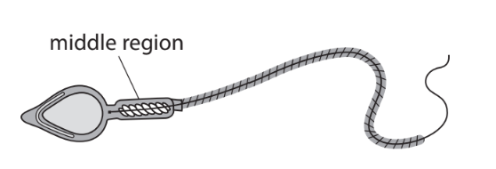

The females of these species produce multiple egg cells and mate with many males in a short period of time.

The graph shows the effect of the length of the middle region on the swimming speed of the sperm cell.

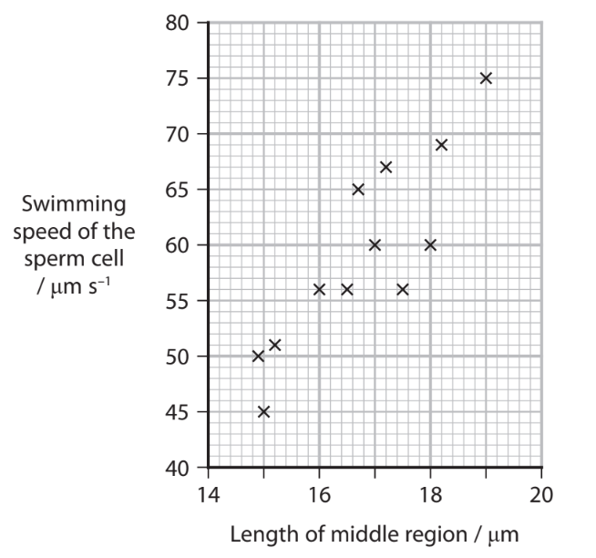

- Some male animals, such as the zebra longwing butterfly, produce spermatophores that remain inside the reproductive system of the female after mating. The spermatophore contains sperm cells and nutrients for the female. The spermatophore also releases chemicals that reduce the attractiveness of this female butterfly to other males.
- Some female animals, such as the eastern box turtle, mate with numerous males and then store the sperm for a number of years. This allows fertilised egg cells to be laid even when the female has not mated in that year.

Comment on the effect that these three mating strategies would have on the reproductive success of the males and females, and the genetic diversity of the offspring.

## Q9 — medium — 11 marks · exam-questions

### 7((a)) — 6 marks — command: explain — structured — from paper Oct/Nov 2021 · WBI12/01
Variation between organisms occurs as a result of sexual reproduction and epigenetic modification.

The photograph shows a nematode, as seen using an electron microscope.

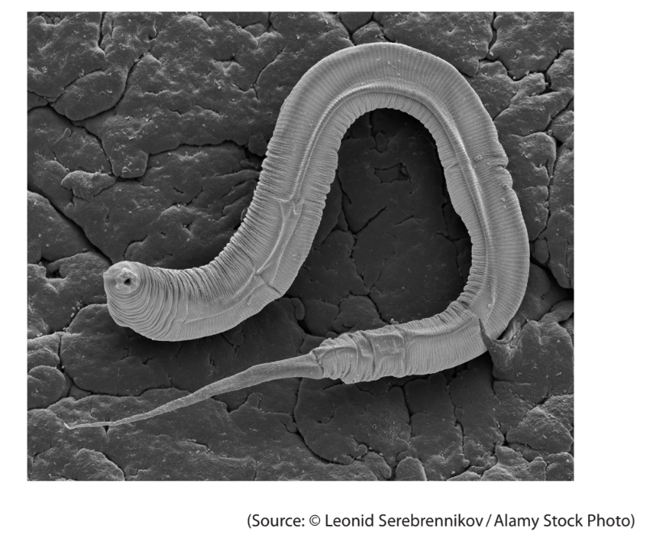

Animals of this species are either male or hermaphrodites.

Nematodes that inherit one sex chromosome are male.

Nematodes that inherit two sex chromosomes are hermaphrodites.

Hermaphrodites can produce both egg cells and sperm. Approximately 300 sperm are produced first and stored inside the nematode. After this, egg cells are produced.

The sperm of a hermaphrodite nematode can fertilise its own egg cells. This is called self-fertilisation.

However, when a hermaphrodite nematode mates with a male nematode, the sperm of the male fertilises the egg cells. This results in 700 more egg cells being fertilised than when a hermaphrodite self-fertilises. Half of these fertilised egg cells will result in male offspring.

Explain how the reproductive behaviour of these nematodes increases their chance of survival.

### 7((b)) — 5 marks — command: deduce — structured — from paper Oct/Nov 2021 · WBI12/01
In nematodes, histone modification can be passed onto embryos.

Enzyme M causes this modification.

The diagram shows two experiments that demonstrated this.

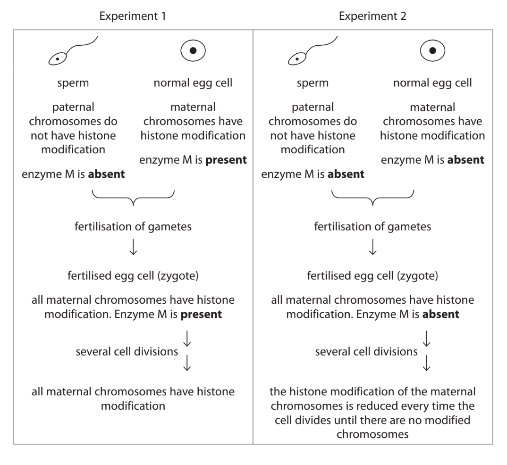

Deduce how histone modification can be passed onto embryos.

## Q10 — medium — 15 marks · exam-questions

### 8((a)) — 2 marks — command: explain — structured — from paper Oct/Nov 2021 · WBI12/01
Egg cells are produced by many organisms.

The development of fish embryos can be studied using fertilised egg cells.

The photograph shows part of a beluga fish from the Caspian Sea.

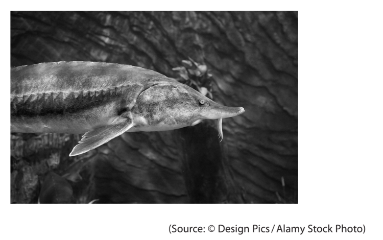

Explain how an egg cell is specialised for its function.

### 8() — 7 marks — command: multiple — structured — from paper Oct/Nov 2021 · WBI12/01
A student studied beluga fish cells undergoing mitosis and meiosis.

(i) Compare and contrast metaphase in mitosis and meiosis.

**(3)**

(ii) Some of the cells undergoing mitosis were from a beluga morula whereas some of the cells were from a beluga blastocyst.

Explain how the cells of the beluga morula change as they develop into the cells of the blastocyst.

**(4)**

### 8() — 6 marks — command: multiple — structured — from paper Oct/Nov 2021 · WBI12/01
Chickens produce eggs.

The effect of(c the age of a chicken on the mass of the eggs it laid was investigated.

A statistical test can be used to see if there is a significant correlation between the age of a chicken and the mass of her eggs.

The value generated by this statistical test will always be between −1.0 to +1.0.

The table shows the mass of eggs collected from chickens of different ages.

| **Age/weeks** | **Rank of** **age** | **Mass of egg** **/g** | **Rank of** **mass of egg** | ***D*** | ***D*****2** |
|---|---|---|---|---|---|
| 36 | 1 | 2.27 | 8 | −7 | 49 |
| 39 | 2 | 1.91 |   |   |   |
| 42 | 3 | 2.18 | 5.5 | −2.5 | 6.25 |
| 45 | 4 | 2.28 | 9 | −5 | 25 |
| 48 | 5 | 2.12 | 4 | 1 | 1 |
| 51 | 6 | 2.19 | 7 | −1 | 1 |
| 54 | 7 | 2.18 | 5.5 | 1.5 | 2.25 |
| 57 | 8 | 2.09 | 3 | 5 | 25 |
| 60 | 9 | 2.03 | 2 |   |   |

(i) Calculate the value for ΣD2. Use the table to help you.

**(2)**

ΣD2= ..........................................

(ii) Calculate the correlation coefficient, rs value, for this data using the formula:

**(2)**

`r subscript s equals 1 minus fraction numerator 6 open parentheses space sum D squared space close parentheses over denominator n open parentheses n squared minus 1 close parentheses end fraction`

Answer ......................................

(iii) The null hypothesis is that there was no significant correlation between the age of the chicken and the mass of the eggs laid.

Another scientist replicated this study and gained a correlation coefficient value of 0.38.

The table shows the critical values at the 95% probability level.

| **Number of pairs of data** | **Critical values at the 0.05%** **probability level** |
|---|---|
| 8 | 0.738 |
| 9 | 0.683 |
| 10 | 0.648 |

Explain whether the null hypothesis should be accepted or rejected.

**(2)**

## Q11 — medium — 6 marks · exam-questions

### 3((a)) — 2 marks — command: calculate — structured — from paper Jan 2022 · WBI12/01
A new vaccine has been developed that contains active mRNA.

The flow diagram shows how this vaccine causes body cells to produce a new protein.

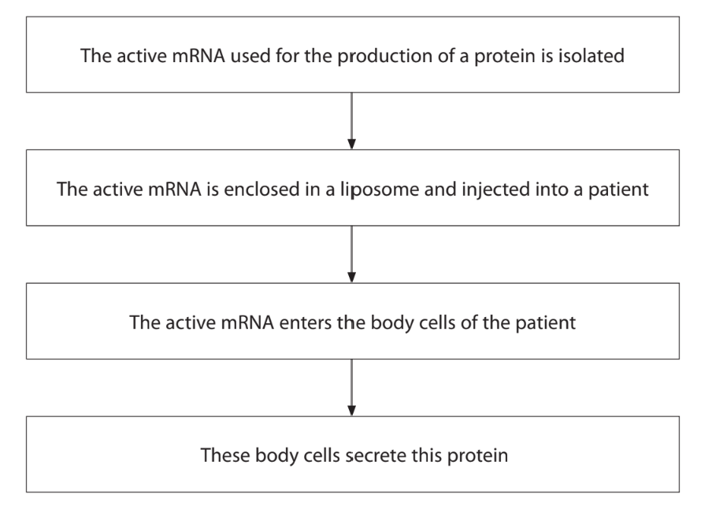

The diameter of one spherical liposome was 75nm.

Calculate the volume of this liposome using the formula:

$V=\frac{4}{3}\mathrm{πr}^{3}$

Give your answer in standard form.

### 3((b)) — 4 marks — command: contrast — structured — from paper Jan 2022 · WBI12/01
Active mRNA is formed after post‐transcriptional modification of pre‐mRNA.

The structure of pre‐mRNA produced from transcription is different from the structure of active mRNA.

Compare and contrast the structures of pre‐mRNA and active mRNA.

## Q12 — medium — 9 marks · exam-questions

### 4((a)) — 2 marks — command: which — structured — from paper Jan 2022 · WBI12/01
The graph shows the changes in the DNA content of one cell during one cell cycle.

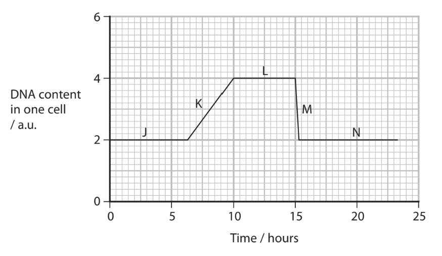

(i) In which part of the graph is the DNA being replicated?

**(1)**

| ☐ | **A** | J |
|---|---|---|
| ☐ | **B** | K |
| ☐ | **C** | L |
| ☐ | **D** | M |

(ii) In which part of the graph would the condensation of chromosomes be completed?

**(1)**

| ☐ | **A** | J |
|---|---|---|
| ☐ | **B** | L |
| ☐ | **C** | M |
| ☐ | **D** | N |

### 4((b)) — 5 marks — command: multiple — structured — from paper Jan 2022 · WBI12/01
Centrioles are involved in spindle formation.

(i) Name the stage of mitosis when spindle fibres begin to form.

**(1)**

(ii) Explain the role of the spindle in mitosis.

**(2)**

(iii) Draw a plant cell undergoing cell division, after mitosis has just finished.

**(2)**

### 4((c)) — 2 marks — command: describe — structured — from paper Jan 2022 · WBI12/01
The photograph shows a section through a root tip, as seen using a microscope.

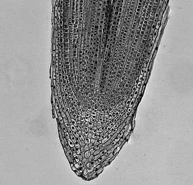

Berkshire Community College  Bioscience Image Library, CC0, via Wikimedia Commons

Describe how to determine the mitotic index of this tissue.

## Q13 — medium — 8 marks · exam-questions

### 6((a)) — 6 marks — command: explain — structured — from paper Jan 2022 · WBI12/01
Skin colour is an example of continuous variation in some species.

In one species skin colour is polygenic and controlled by three genes: A, B, and C.

Two individuals heterozygous for each of these three genes were crossed.

The diagram shows the possible allele combinations present in the gametes and the offspring produced in this cross.

The shading indicates the darkness of the skin colour of the offspring.

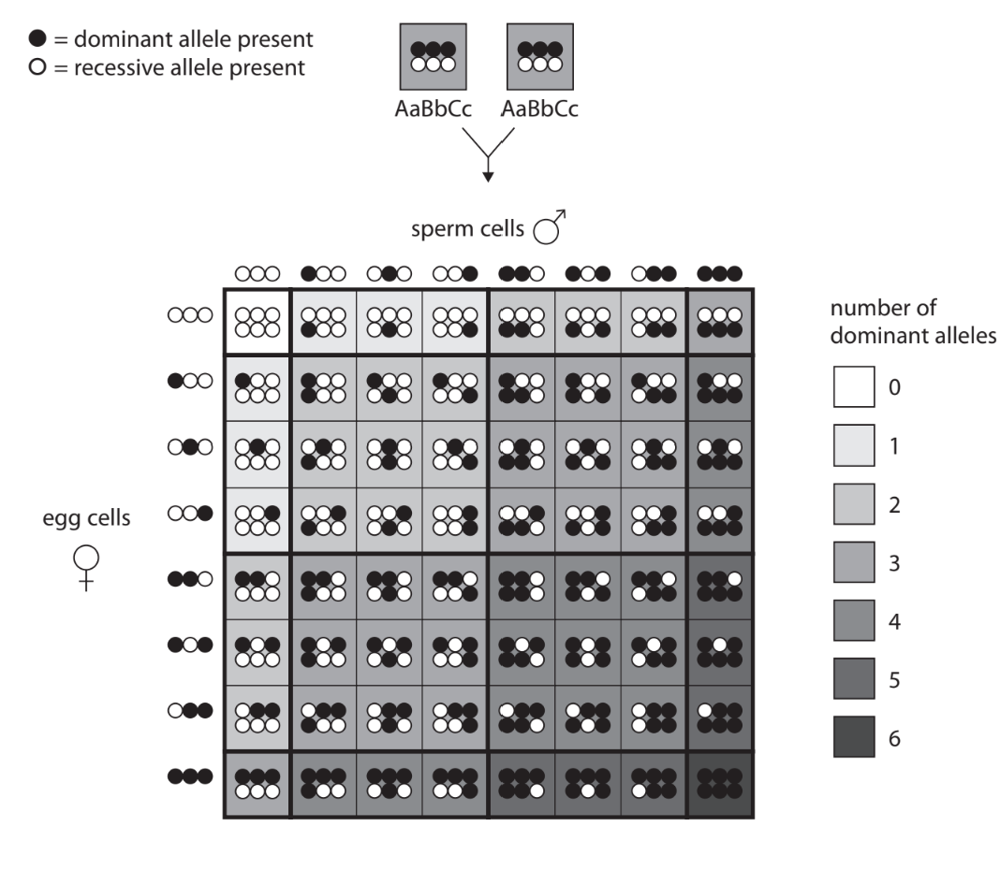

The graph shows the probability of the skin colours of the offspring from this cross.

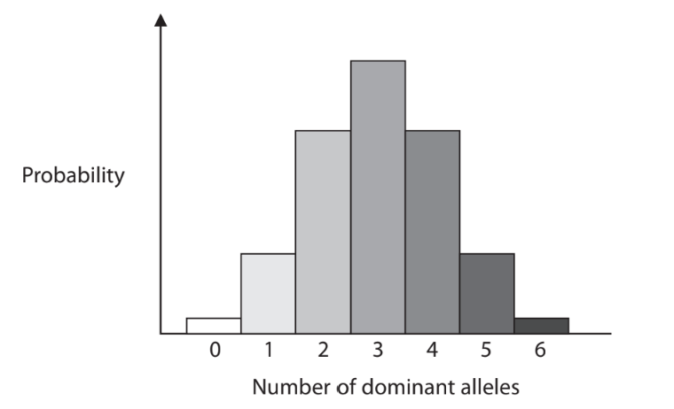

Explain why there is a large variation in the skin colour of the offspring produced from this cross.

Use information from the question, and your own knowledge, to help support your answer.

### 6((b)) — 2 marks — command: suggest — structured — from paper Jan 2022 · WBI12/01
Suggest **two** reasons why individuals that have inherited the genotype AaBbCc, may have a darker skin colour than other individuals with the same genotype.

## Q14 — medium — 11 marks · exam-questions

### 8((a)) — 2 marks — command: suggest — structured — from paper Jan 2022 · WBI12/01
Gametes are specialised for their function.

Egyptian female desert ants (*Cataglyphis savignyi*) mate with more than one male.

A male desert ant has an adaptation to improve the chances of his sperm fertilising a female’s egg cell.

The sperm are released in bundles with the heads held together by a sticky protein.

The diagram shows a bundle of desert ant sperm.

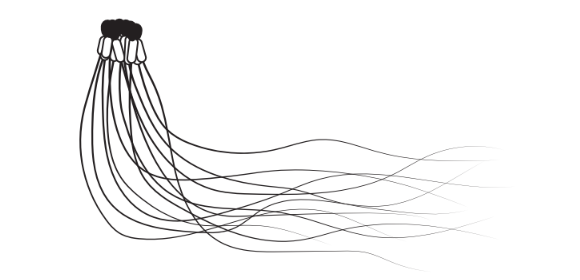

Suggest how the sticky proteins would have been secreted.

### 8((b)) — 4 marks — command: comment — structured — from paper Jan 2022 · WBI12/01
The graph shows the speed of individual sperm compared with bundles of sperm in liquids of different resistance.

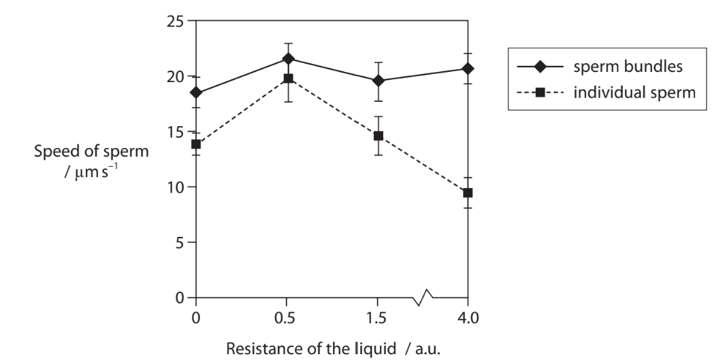

Comment on the results of this investigation.

### 8((c)) — 5 marks — command: multiple — structured — from paper Jan 2022 · WBI12/01
The photograph shows an Amur leopard found in south-eastern Russia and northern China.

*In‐vitro* fertilisation (IVF) techniques are being developed to help conserve this endangered species of leopard.

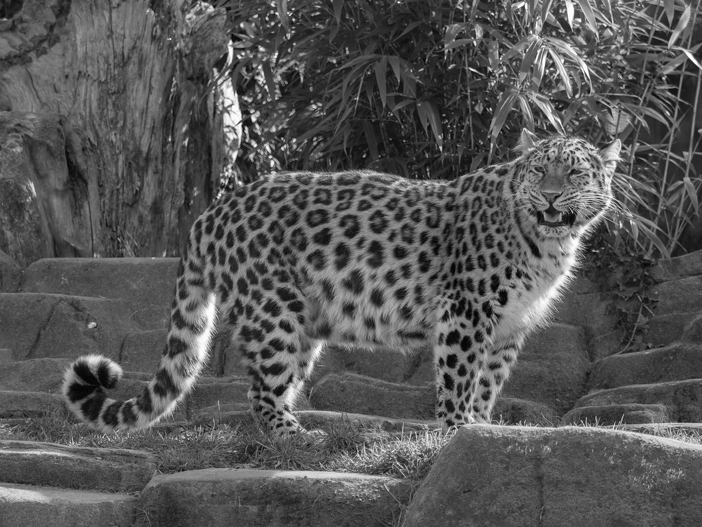

William Warby, CC BY 2.0 <https://creativecommons.org/licenses/by/2.0>, via Wikimedia Commons

These techniques are being developed using mice.

IVF involves the removal of egg cells from the female mice. The zona pellucida can be damaged during this process.

The effect of damaging the zona pellucida was investigated.

Three hundred mouse egg cells were distributed equally in three Petri dishes containing nutrient solutions.

Samples of sperm of different concentrations were added to each Petri dish.

The volume of each sample added was the same.

The experiment was repeated for egg cells which had their zona pellucida damaged.

The graph shows the percentage of egg cells fertilised by more than one sperm (percentage polyspermy).

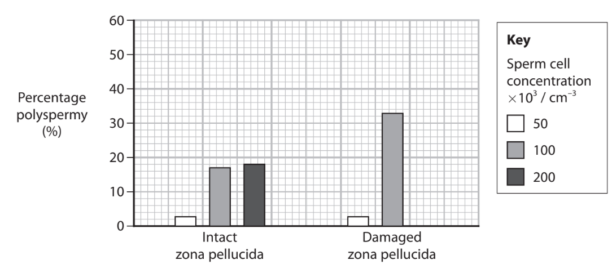

(i) When the highest sperm concentration was added to the egg cells with damaged zona pellucida, the percentage polyspermy was 52%.

Plot this result on the graph.

**(1)**

(ii) Explain the results of this investigation.

**(4)**

## Q15 — medium — 12 marks · exam-questions

### 1() — 3 marks — command: multiple — structured
A scientist investigated the effect of glucose concentration on the fertilisation rate of human sperm cells. Sperm cells were kept in solutions of different glucose concentrations. The scientist recorded the mean percentage of egg cells that were successfully fertilised at each glucose concentration. The investigation was carried out in vitro.

(i) Identify one variable that the scientist would need to control in this investigation.

[1]

(ii) State how the mean percentage would have been determined for each concentration.

[2]

### 2() — 3 marks — command: suggest — structured
The table shows the mean fertilisation rate of human sperm cells at different glucose concentrations, as determined by the investigation in (a).

| Glucose concentration (mM) | Mean fertilisation rate (%) |
|---|---|
| 0 | 8 |
| 1 | 24 |
| 2 | 45 |
| 5 | 68 |
| 10 | 70 |
| 20 | 62 |
| 35 | 48 |
| 50 | 31 |

Suggest an explanation for the relationship between glucose concentration and mean fertilisation rate.

### 3() — 3 marks — command: evaluate — structured
In vitro fertilisation (IVF) is a procedure in which egg cells are fertilised by sperm cells outside of the body. The fertilised egg is then implanted into the uterus.

A student concluded that sperm cells used in IVF should be stored in a solution containing 10 mM glucose to maximise fertilisation rates.

Evaluate this conclusion.

### 4() — 3 marks — command: explain — structured
Describe the cortical reaction and explain its importance in fertilisation.

## Q16 — medium — 11 marks · exam-questions

### 1() — 3 marks — command: identify — structured
A student carried out a root tip squash using garlic roots. The image below shows the microscope slide produced.

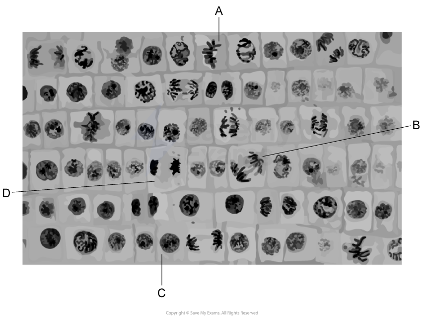

Identify the specific stages of the cell cycle that are visible in cells **A**, **C** and **D**.

### 2() — 2 marks — command: describe — structured
Describe the events taking place in cell **B**.

### 3() — 3 marks — command: complete — structured
The table shows the number of cells observed at each stage of the cell cycle in two samples of root tip cells. Sample 1 was taken from an untreated plant. Sample 2 was taken from a plant that had been exposed to a growth-promoting chemical.

| Stage | Sample 1 | Sample 2 |
|---|---|---|
| Interphase | 42 | **Y** |
| Prophase | 6 | 10 |
| Metaphase | 5 | 9 |
| Anaphase | 4 | 8 |
| Telophase | 3 | 5 |
| **Total** | 60 | **Z** |
| **Mitotic index** | **X** | 40 |

Complete the table by determining the values for **X**, **Y** and **Z**.

### 4() — 3 marks — command: explain — structured
Garlic root tips contain cell types which differ in structure and function.

Explain how two cells produced by mitosis from the same parent cell can differ in structure and function.
