# Mark Schemes — Classification & Biodiversity
**4. Plant Structure & Function, Biodiversity & Conservation** · Edexcel International A Level (IAL) Biology (YBI11)

## Q1 — medium — 15 marks · exam-questions

### 8((a)) — 3 marks
Human activity could cause the extinction of the Sehuencas water frog in the wild by...

Any **three **of the following:

- (Habitat loss) due to deforestation / urbanisation / water drainage / pollution of habitat e.g. water pollution, pesticides; **[1 mark]**
- Reduction in food due to habitat loss / competition with other species / pollution; **[1 mark]**
- (Reduction in population) due to hunting / fewer mates / disease; **[1 mark]**
- Introduction of new predator (by humans); **[1 mark]**

**[Total: 3 marks]**

> *If you refer to habitat loss you should also explain how human activity could have caused that habitat loss.*

### 8((b)) — 4 marks
Resistance to this fungus could develop in a population of Sehuencas water frogs by...

Any **four **of the following:

- (Genetic) mutation occurred;** [1 mark]**
- (New) allele (coding for protein) involved in fungal resistance; **[1 mark]**
- Frogs resistant to the fungus survive and breed / have selective advantage; **[1 mark]**
- Pass this (resistant) allele onto the offspring; **[1 mark]**
- Increase in resistant allele frequency; **[1 mark]**

**[Total: 4 marks]**

> *As with any question on this topic, use of key vocabulary is really important here. Remember that if you learn these important key words you can apply them to any new example you are presented with in your real exams in the future. These are as follows: mutation, new allele, survive and reproduce, pass on allele to offspring, increase (advantageous) allele frequency. This format of question comes up very frequently so it is really worthwhile taking the time to memorise these.*

### 8((c)) — 2 marks
The scientists could calculate the heterozygosity index for a population of Sehuencas water frogs by...

- Analyse the DNA of (Sehuencas water) frogs / determine the number of heterozygotes / determine the population size of (Bolivian Sehuencas water) frogs; **[1 mark]**
- Divide the number of heterozygotes by the total number of (Sehuencas water) frogs (in the Bolivia population); **[1 mark]**

**[Total: 2 marks]**

### 8((d)) — 6 marks
The role of zoos in the conservation of endangered Sehuencas water frogs involves...

> *This is a level-marked question, meaning that this is is marked **according to the levels table**. The indicative content points below the table are **not** to be used in the usual '**one point one mark**' way, but should be used together with the levels table to determine the number of marks which should be awarded. *

| **Level 1** Demonstrates isolated elements of biological knowledge related to the given context with generalised comments made. The description will contain basic information with some attempt made to link knowledge and understanding to the given context.  **[1 mark]** - Description of one point from the list of indicative content below. **[2 marks]** - Description of two points from the list of indicative content below. |
|---|
| **Level 2 **Demonstrates adequate knowledge by selecting and applying some relevant biological facts/concepts to provide the description being presented. The description shows some linkages and lines of reasoning with some structure.  **[3 marks]** - Description of three points from the list of indicative content below. **[4 marks]** - Description of four points from the list of indicative content below. |
| **Level 3** Demonstrates comprehensive knowledge by selecting and applying relevant knowledge of biological facts/concepts to provide the description being presented. The description is clear, coherent and logically structured.  **[5 marks]** - Description of five points from the list of indicative content below. **[6 marks]** - Description of six points from the list of indicative content below. |

*Indicative content:*

- Genetic diversity identified as the variety of alleles in the population
- Genetic analysis of the frog in the zoo and the frogs in Bolivia / method of analysis
- Consideration of maintaining genetic diversity/variation / reducing inbreeding / maintain/increase gene pool
- Captive breeding / breeding in zoos or in natural habitat
- Use of stud books (without reference to maintaining genetic diversity)
- Conservation of / increase in frog habitat in Bolivia
- Guidance to local government / raising awareness of the need for protected area e.g. national park
- Conservation in zoos / recreating similar habitat in zoos / protection from predators (in zoos) / food provision
- Eradication/treatment of {fungal / other} disease
- Protection from predators (in the wild)
- Reintroduction of frogs from captive breeding programme
- Suggested details of method of reintroduction
- Education of local population in Bolivia / country where zoo is located
- Research

**[Total: 6 marks]**

> *Notice that the command word for this question is describe, meaning that you don't need to provide a justification for the zoo roles that you mention. *

> *Remember that you need to make your answer specific to the conservation of the frog species in the question stem, not just statements about zoos in general. *

## Q2 — medium — 15 marks · exam-questions

### 8((a)) — 4 marks
(i) Anatomical adaptations of the Tristan albatross that enable it to occupy its niche are...

Any **two** of the following:

- Long/large wings to allow it to fly long distances / glide / use thermals/updraft; **[1 mark]**
- Webbed feet to allow it to paddle through water **OR** to allow increased air resistance, e.g. for landing; **[1 mark]**
- A long beak to allow it to catch its prey / to feed / for defence **OR** large eyes to see prey in the water; **[1 mark]**

(ii) The predicted albatross population after one year is calculated as follows...

- (5.3 % of 4500 =) 238.5 / 239; **[1 mark]**
- 4261 /4262; **[1 mark]**

*Correct answer with no working shown scores full marks.*

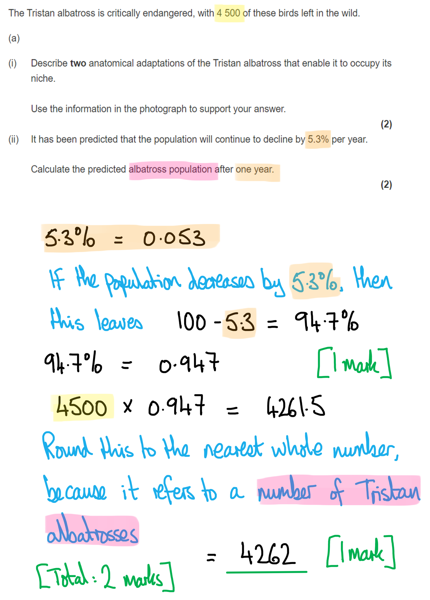

**[Total: 4 marks]**

### 8((b)) — 1 marks
The Tristan albatross and wandering albatross were once classified as the same species because...

- They have a <u>similar</u> phenotype / appearance / physical features / anatomy / morphology **OR** they could interbreed to produce fertile offspring; **[1 mark]**

**[Total: 1 mark]**

### 8((c)) — 4 marks
The mice on this island could have evolved to become a new species as follows...

Any **four** of the following:

- Mutation(s) occurred; **[1 mark]**
- (Resulting in a new) <u>allele</u> for larger size / ability to digest meat / eat chicks; **[1 mark]**
- (This) gave the mice a selective advantage / mutated mice were more likely to survive and reproduce / mutated mice were more likely to pass alleles to offspring **OR** those mice without the new allele were less likely to survive and reproduce; **[1 mark]**
- The new <u>allele</u> increased in frequency; **[1 mark]**
- Mutated mice on this island became reproductively isolated (resulting in two different species; **[1 mark]**

*A maximum of 3 marks if your answer does not refer to a specific example of an advantage given by the mutated allele, e.g. larger size, the ability to digest meat, eat chicks, or the inability of the chicks to defend themselves from mice. *

**[Total: 4 marks]**

> *Always refer to **alleles** rather than genes in answers such as this one. The idea that advantageous alleles emerge is critical. The original, smaller mice could have been able to eat chicks with an original gene, but a mutation in that gene could result in an advantageous **allele **that allows the mice to eat more chicks / predate on them more successfully.*

### 8((d)) — 6 marks
> *This is a **level-marked question**, meaning that it is marked **according to the levels table**. The indicative content points below the table are **not **to be used in the usual **'one point per mark'** way, but should be used together with the level descriptors to determine the number of marks which should be awarded. *

> *For this question:*

- *D = a **d**escription of a conservation method*
- *E = an **e**xplanation of how that method works*

| **Level 1** | The answer is mainly description and covers either the island or a zoo. Some limited explanation is attempted but focuses on one topic area.  **[1 mark]** = description of one method  **[2 marks]** = description of two methods **OR** description of one method with a matching explanation |
|---|---|
| **Level 2 ** | Description and explanation are both given, and both the island and a zoo are mentioned. Some analysis and evaluation are present and the answer has a logical structure.  **[3 marks] **= description of two methods **AND** some explanation for one method **[4 marks]** = description of two methods **AND** a matching explanation for both |
| **Level 3** | Description and explanation are both given, and both the island and a zoo are mentioned. Explanations contain some application of biological knowledge to other topic areas and are well-developed with clear reasoning. The answer is clear and logical.  **[5 marks]** = description of three methods **AND** a matching explanation for all **AND **reference is made to genetic diversity in zoos **or** to reintroduction strategies  **[6 marks] **= description of three methods **AND** a matching explanation for all **AND **reference is made to genetic diversity in zoos **AND** references is made to reintroduction strategies |

The Tristan albatross could be conserved as follows...

*Indicative content relating to the island*

- (D) Introducing laws to protect the albatross
- (D) Removal of predators
- (D) Through trapping / poisoning of mice / introducing a predator of mice
- (E) So more chicks will survive to breeding age
- (D) Fishing exclusion zone
- (E) Allowing albatross to catch more food
- (E) More food available for parents to give to chicks
- (E) Therefore increase population size
- (D) Reintroduction program
- (D) Strategies to ensure increased survival chances of reintroduced birds e.g. removal of mice, behavioural conditioning
- (E) Therefore increase population size

*Indicative content relating to zoos*

- (D) Tristan albatross breeding pairs taken to zoos
- (D) Captive breeding programmes
- (E) To increase population size
- (D) Reference to studbooks / keeping a record of which albatrosses are breeding together
- (D) Hardy Weinberg equation used to see change in allele frequency over time
- (E) To ensure that genetic diversity is maintained/increased
- (E) To reduce inbreeding depression
- (D) Collecting eggs and taking them elsewhere to hatch
- (E) Therefore offspring are not eaten by mice / protected from predators
- (D) Offspring reintroduced to the island
- (E) To increase population size
- (D) Reintroduce Tristan albatross currently held in zoos
- (E) Therefore increase population size

**[Total: 6 marks]**

## Q3 — medium — 9 marks · exam-questions

### 2((a)) — 4 marks
(i) The magnification of the photograph in standard form is…

- (Actual length in nm =) 35 000 000 (nm); **[1 mark]**
- 2.9 x 104; **[1 mark]**

*Award a maximum of 1 mark for the correct answer not expressed in standard form, e.g. 29 000*

*Award a maximum of 1 mark for the correct answer not written to 2sf, e.g. 2.92 × 10**4*

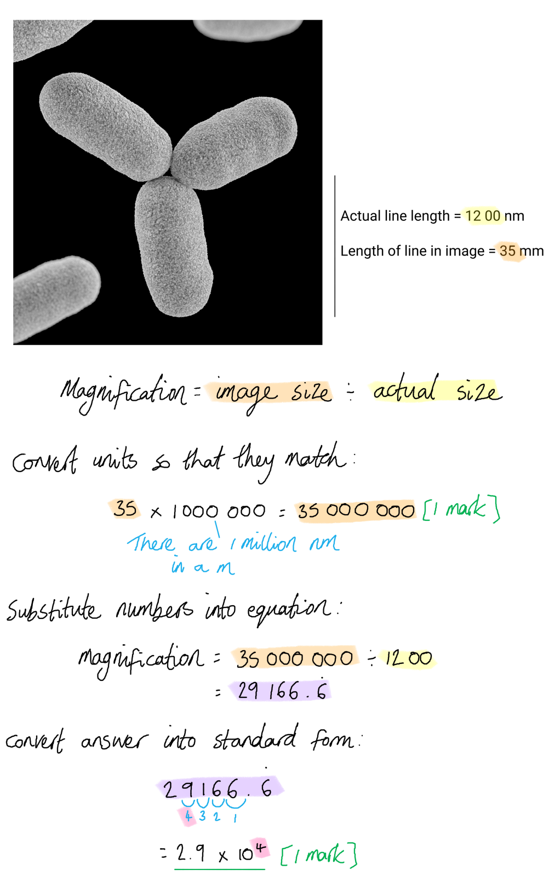

> *Make sure that you follow the instructions on how to present your final answer (in standard form **AND** to 2sf).*

(ii) The type of microscope used to take this photograph is...

- An electron microscope; **[1 mark]**
- (This is because of the) high magnification / resolution; **[1 mark]**

**OR**

- A <u>scanning</u> electron microscope; **[1 mark]**
- (This is because) the image is 3D; **[1 mark]**

**[Total: 4 marks]**

### 2((b)) — 5 marks
(i) The information the scientists would have used to classify *M. smithii* into the Archaea domain is…

*They can be identified as prokaryotes and not eukaryotes because...*

Any** one** of the following:

- The absence of a nucleus / lack of membrane-bound organelles; **[1 mark]**
- They have circular DNA / a circular chromosome; **[1 mark]**
- They have 70S ribosomes; **[1 mark]**

**AND**

*They can be identified as archaea and not bacteria because...*

Any** one** of the following:

- Their DNA is associated with histones; **[1 mark]**
- They have distinctive ribosomes / ribosomal RNA / their ribosome (small subunits) are more similar to those of eukaryotes (than to those of bacteria); **[1 mark]**
- They have no peptidogylcan in their cell walls; **[1 mark]**
- Their RNA polymerase (is more similar to eukaryotic RNA polymerase than to bacterial RNA polymerase); **[1 mark]**
- (Their cell membrane lipids have) ether bonds; **[1 mark]**

(ii) The scientists could confirm that *M. smithii* and *M. oralis* are different species of Archaea as follows...

Any **three** of the following:

- (Analysis of) molecular evidence / DNA / mRNA / proteins / enzymes; **[1 mark]**
- Identification of similarities and differences / comparison between biological molecules; **[1 mark]**
- (Analysis of) phenotype / named example of phenotypic feature (e.g. cell structure / anatomical features / favoured conditions for growth); **[1 mark]**
- Identification of similarities and differences / comparison between the (phenotype of the) two microorganisms; **[1 mark]**

**[Total: 5 marks]**

> *When describing the analysis of organisms for the purposes of classification, remember that you should always state that the purpose of such analysis is to **identify similarities and differences**; the more similar two organisms are, the more closely related they are likely to be.*

## Q4 — medium — 14 marks · exam-questions

### 9() — 6 marks
(i) These data were used to estimate the number of moose in 2016 as follows...

- By extrapolation / line of best fit / calculation of mean decrease (per year); **[1 mark]**

(ii) The percentage decrease in the number of moose from 1994 to 2016 is...

- 7.6 - 3.4 **OR **4.2; **[1 mark]**
- 55 / 55.3 / 55.26; **[1 mark]**

*Full marks can be awarded for the correct answer in the absence of other calculations.*

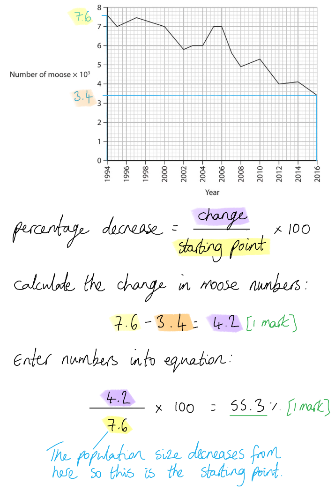

(iii) A sketch graph to show the decrease in the number of moose from 1994 to 2016 would have the following features...

- Temperature / rainfall / days of drought on the x-axis; **[1 mark]**
- Number of moose on the y-axis; **[1 mark]**
- A relatively straight line sloping down from top left to bottom right **OR** sloping up if axes labelled the wrong way around; **[1 mark]**

*Award 1 mark for marking points 1 and 2 if axes are labelled the wrong way around.*

*Award 1 mark maximum for a correct graph of temperature against year.*

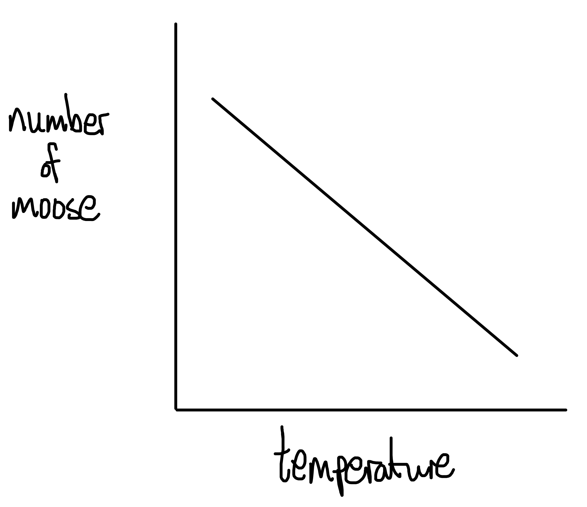

> *Note that on a sketch graph units are not required alongside the axis labels.*

**[Total: 6 marks]**

### 9() — 8 marks
(i) The percentage of moose that have 50 000 or more ticks on their bodies is...

- 214 **AND** 41; **[1 mark]**
- 19/19.2/19.16 (%); **[1 mark]**

*Full marks can be awarded for the correct answer in the absence of calculations.*

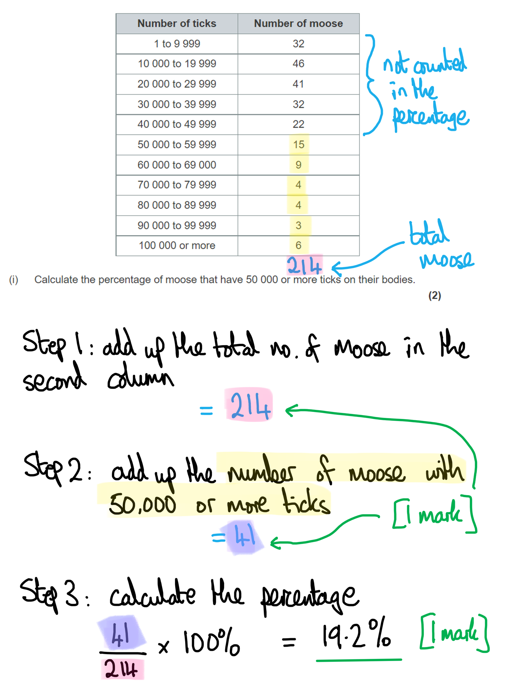

(ii)

> *This is a level-marked question, meaning that it is marked **according to the levels table**. The indicative content points below the table are **not **to be used in the usual **'one point per mark'** way, but should be used together with the level descriptors to determine the number of marks which should be awarded. *

> *For this question:*

- *R = **r**eason for decline in moose numbers*

| **Level 1** | **[1 mark]** | A description from one section has been given |
|---|---|---|
| **[2 marks]** | Unconnected descriptions from two sections have been given |   |
| **Level 2** | **[3 marks]** | Descriptions from two sections have been given **AND** one connection has been made between the descriptions |
| **[4 marks]** | Descriptions from all three sections have been given **AND** two connections have been made between the descriptions |   |
| **Level 3** | **[5 marks]** | Descriptions from all three sections have been given **AND** connections have been made between all sections **AND** one reason for the decline in moose numbers has been given |
| **[6 marks] ** | Descriptions from all three sections have been given **AND** connections have been made between all sections **AND** two reasons for the decline in moose numbers has been given |   |

Global warming might affect the life cycle of ticks and result in the decline in the number of moose as follows...

*Indicative content relating to global warming (section 1)*

- Global warming will increase the temperature of the earth's surface / atmosphere
- Winters will get warmer so there will be less snow
- Winters will get shorter so snow will be present for fewer days

*Indicative content relating to the effect of change on ticks (section 2)*

- Warmer conditions decrease life cycle time of ticks
- Fewer ticks will die in the snow in early spring
- More females will be able to lay eggs
- Larvae are less likely to be covered in snow in the autumn
- So more larvae become nymphs

*Indicative content relating to the effect of ticks on moose (section 3)*

- More ticks mean larger volumes of blood removed from each moose
- Moose become weaker if they lose more blood
- (R) Moose die from lack of nutrients / oxygen / energy **OR** from anaemia
- (R) Less energy for hunting so the moose starve
- (R) Less energy for reproduction
- (R) If moose lose their fur they will not be able to keep warm
- (R) Moose die from the cold
- (R) Scratching can cause open wounds that can get infected
- (R) Ticks pass on pathogens
- (R) Moose die from infections

## Q5 — medium — 12 marks · exam-questions

### 7((a)) — 3 marks
The total population of Santa Cruz in 2025 will be...

- 20 000; **[1 mark]**
- 27 273.3 / 27 273.328 / 27 273.33; **[1 mark]**
- 27 273; **[1 mark]**

*Full marks can be awarded for the correct answer of 27 273 in the absence of other calculations*

**[Total: 3 marks]**

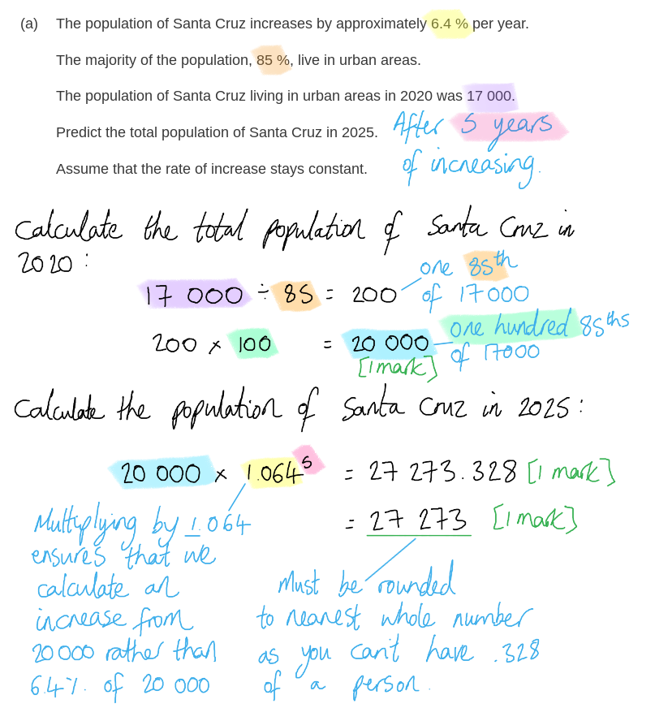

### 7((b)) — 1 marks
The relationship shown in the graph is...

- A positive correlation between the number of recorded non endemic species and the number of tourists / as the number of tourists increases so does the number of non endemic species; **[1 mark]**

**[Total: 1 mark]**

> *Note that you are simply being asked to describe a relationship here; no credit will be given for any attempt to explain the graph.*

### 7((c)) — 8 marks
(i) The index of diversity (D) for this area of the forest is…

- N(N-1) = 21 462; **[1 mark]**
- ∑n(n-1) = 4 684; **[1 mark]**
- D = 4.6; **[1 mark]**

*Full marks can be awarded for the correct answer of 4.6 in the absence of other calculations.*

*Award 2 marks for the correct answer of 4.58 without correct rounding.*

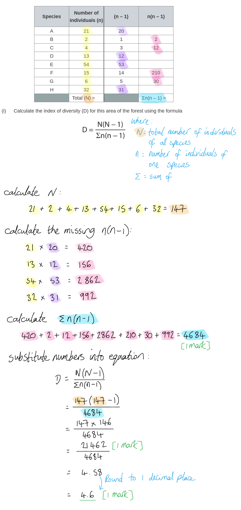

(ii) The spread of the wild blackberry affects the biodiversity of the island because...

Any **five** of the following:

- It reduces forest habitat / outcompetes forest plants / introduces disease to forest plants; **[1 mark]**
- It (therefore) causes a reduction in biodiversity (as forest is a habitat for many species); **[1 mark]**
- Loss of forest causes a loss of habitat for animals / animals are not adapted to feed on blackberry / blackberry is poisonous to animals **SO** populations decrease; **[1 mark]**
- Loss of forest will result in a loss of genetic diversity / a smaller gene pool; **[1 mark]**
- (Small gene pools will occur due to) populations becoming smaller / isolated; **[1 mark]**
- There is a reduction in species richness (if species become locally extinct); **[1 mark]**

*Accept references to causing increased competition for marking point 3, e.g. "loss of forest causes increased competition between species (for food / nesting sites) ****SO**** populations decrease".*

> *This question is all about the effect of the blackberry on the forest community; you should consider how the blackberry will affect the forest habitat, and how this in turn will impact the other species that depend on the forest to survive. You must link this back to biodiversity.*

**[Total: 8 marks]**

## Q6 — medium — 7 marks · exam-questions

### 2() — 4 marks
(i) The surface area: volume ratio of one cube with a length of 2.5cm:

- Surface area = 6 × 2.52 = 37.5 **AND** volume = 2.53 = 15.625; **[1 mark]**
- Ratio

  - 37.5 : 15.6
  - Divide both sides by 15.6
  - 37.5 ÷ 15.6 = 2.4 **AND** 15.6 ÷ 15.6 = 1
  - 2.4 : 1; **[1 mark]**

*Allow answer expressed as a single number: 2.4 Correct answer with no working shown scores ***[2 marks]**

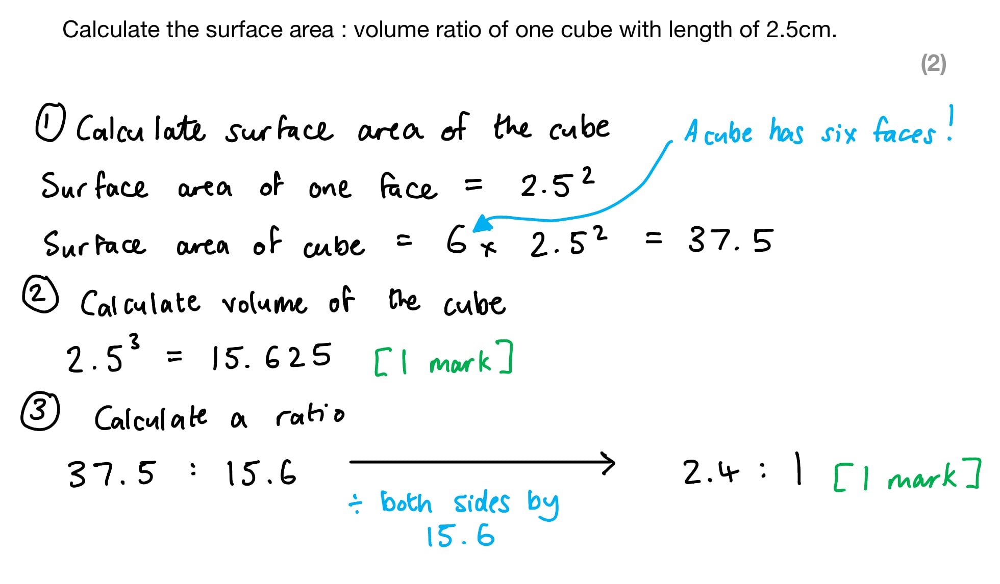

(ii) A habitat is...

- It is a place where organisms/species live; **[1 mark]**

(iii) Species can be defined as...

- Organisms that can reproduce with others to form fertile offspring; **[1 mark]**

**[Total: 4 marks]**

### 2((b)) — 1 marks
What is meant by the term polygenic inheritance with reference to wombat height...

Any **one** of the following:

- Many/multiple genes code for the height of a wombat; **[1 mark]**
- Genes at different loci / positions on the chromosome contribute to the height of a wombat; **[1 mark]**

**[Total: 1 mark]**

> *Continuous traits such as height and skin colour often tend to be controlled by several genes.*

### 2((c)) — 2 marks
Two anatomical adaptations of a common wombat that help it to dig burrows to live in include:

Any **two** of the following:

- Long/sharp claws **OR** large paws for clawing at the earth; **[1 mark]**
- Short / powerful legs to dig deep; **[1 mark]**
- Ears that face backwards **OR** small eyes that won't fill with soil; **[1 mark]**

**[Total: 2 marks]**

> *Make sure you use the photograph to find your answer to this question. If you listed other adaptations that were not visible in the photograph then you will not gain the marks.*

## Q7 — medium — 7 marks · exam-questions

### 3() — 3 marks
(i) Ways that molecular evidence can be used to support the three-domain system:

Any **one** of the following:

- An analysis of similarities/differences in DNA / RNA / genes / non-coding DNA; **[1 mark]**
- A comparison of similarities/differences in proteins / amino acid sequences / enzymes / ribosomes / membrane components / cell wall components; **[1 mark]**

(ii) The scientific community can...

Any **two** of the following:

- Carry out peer reviews of research/evidence; **[1 mark]**
- Repeat experiments to see if the same data is collected / if results can be replicated;** [1 mark]**
- Carry out the analysis / evaluation / discussion / comparison of data collected; **[1 mark]**
- Extend the analysis e.g. look for similarities / differences in more genes; **[1 mark]**

**[Total: 3 marks]**

> *The key word in this question that you needed to be aware of is **molecular **so you won't get any marks for saying organelles for (i). *

> *Don't spend too long giving examples of the roles that the scientific community can play as (a)(ii) is only worth two marks!*

### 3((b)) — 4 marks
(b) Completion of the table:

| **Feature** | **Archaea only** | **Archaea and** **Bacteria only** | **Archaea and** **Eukarya only** | **Archaea and** **Bacteria and** **Eukarya** |
|---|---|---|---|---|
| absence of a nuclear envelope | ☐ | X | ☐ | ☐ |
| presence of circular DNA | ☐ | ☐ | ☐ | X |
| presence of a cell membrane | ☐ | ☐ | ☐ | X |
| presence of ribosomes | ☐ | ☐ | ☐ | X |

*One mark for each correct row.*

**[Total: 4 marks]**

> *You may not have realised that some eukaryotic organelles contain circular DNA, such as mitochondria and chloroplasts.*

## Q8 — medium — 11 marks · exam-questions

### 7((a)) — 1 marks
The term species richness means...

- (Species richness) is the number of (different) species in a habitat/area/ecosystem; **[1 mark]**

**[Total: 1 mark]**

### 7((b)) — 2 marks
The advantages of drying seeds before storage are...

Any **two **of the following:

- Extends storage time of the seeds / prevents/reduces microbial growth / reduces decomposition / prolongs life of seed; **[1 mark]**
- (Because drying) prevents germination of seeds/keeps seeds dormant; **[1 mark]**
- (Because removal of water) slows enzyme activity/metabolic reactions (in seed cells) / enzymes are not activated **OR** prevents destruction of cells due to ice formation; **[1 mark]**

**[Total: 2 marks]**

### 7((c)) — 8 marks
(i) The equation used to calculate heterozygosity index is...

- heterozygosity index = no of heterozygotes ÷ number of individuals (in the population/species); **[1 mark]**

(ii) The number of heterozygotes in this population is...

- 83; **[1 mark]**

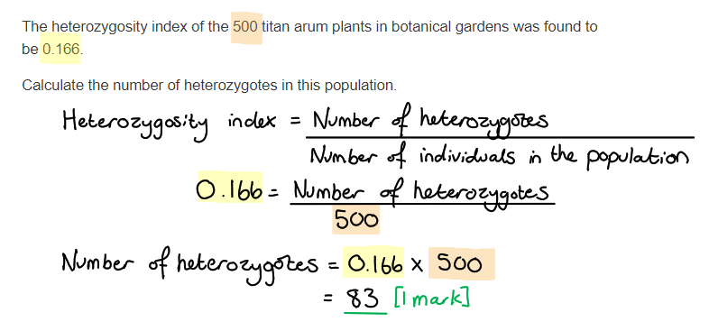

(iii) A discussion of the suggestions for conserving titan arum is...

> *This is a level-marked question, meaning that this is is marked **according to the levels table**. The indicative content points below the table are **not** to be used in the usual '**one point one mark**' way, but should be used together with the levels table to determine the number of marks which should be awarded. *

| **Level 1** Demonstrates isolated elements of biological knowledge and understanding to the given context with generalised comments made.  Vague statements related to consequences are made with limited linkage to a range of scientific ideas, processes, techniques and procedures.  The discussion will contain basic information with some attempt made to link knowledge and understanding to the given context.  **[1 mark]** - Basic consideration of one suggestion **[2 marks]** - Basic consideration of two suggestions **or** detailed consideration of one suggestion |
|---|
| **Level 2 **Demonstrates adequate knowledge and understanding by selecting and applying some relevant biological facts / concepts.  Consequences are discussed which are occasionally supported through linkage to a range of scientific ideas, processes, techniques and procedures.  The discussion shows some linkages and lines of scientific reasoning with some structure.  **[3 marks]** - Basic consideration of three suggestions **or** detailed consideration of two suggestions **[4 marks]** - More detailed consideration of three suggestions |
| **Level 3 **  Demonstrates comprehensive knowledge and understanding by selecting and applying relevant biological facts / concepts.  Consequences are discussed which supported throughout by sustained linkage to a range of scientific ideas, processes, techniques and procedures.  The discussion shows a well-developed and sustained line of scientific reasoning which is clear and logically structured.  **[5 marks]** - Basic consideration of four suggestions **[6 marks]** - Detailed consideration of four suggestions |

*Indicative content:*

**Grow more plants produced via asexual reproduction in botanical gardens**

- Increasing population
- But all genetically identical / no effect on genetic diversity
- Low genetic diversity could lead to decreased chance of survival if environment changes
- More plants mean more opportunities to collect pollen / pollinate other Titan arum plants

**Collecting pollen when an individual plants flowers and storing it in a seedbank**

- Pollen available (for artificial pollination) when an individual plant flowers
- Consideration of local seedbank in Sumatra and others in strategic locations around the world as transporting pollen around the world may delay/prevent successful fertilisation
- Ability to select pollen which comes from individuals with different alleles / consideration of possibility of collecting pollen with same alleles/low genetic diversity
- Consideration of viability of stored pollen / cost to store pollen

**Studbook for the species**

- Consideration of analysing the genetic material of all of the individual plants throughout the world
- Decide which pollen would be used to fertilise which flowering plant
- Selective breeding could increase genetic diversity

**Artificially pollinate plants in the wild and in botanical gardens**

- Individual plants may not be able to be fertilised naturally / more successful than relying on insect pollination
- Possible reasons why e.g. only Titan arum plant in the botanical garden
- So artificially pollinating would result in population increasing faster
- Consideration of short timescale for pollination/cost/labour intensive method
- Ability to select pollen which comes from individuals with different alleles / could increase genetic diversity

**[Total: 8 marks]**

> *When referring to pollen being stored in a seedbank, try to avoid getting pollen and seeds mixed up. The two are not the same and not interchangeable. *

> *It is a good idea to spend some time planning your answers. If you take this question for example, if you had it in an exam you could make notes next to each suggestion on the question paper. This would increase the chance of you addressing each suggestion in your answer and allow you to score higher marks as a result.*

## Q9 — medium — 13 marks · exam-questions

### 9((a)) — 1 marks
The correct answer is **B** (endemic) because...

**When a species is endemic to an area it means that they're only found in that particular area. **

> *A** is incorrect because diversity describes the variety of different species or individuals that exist in an area. *

> *C** is incorrect because isolation refers to a species that is not able to move into other areas.*

> *D** is incorrect because linkage often refers to mechanisms of inheritance. *

**[Total: 1 mark]**

### 9((b)) — 4 marks
(i) The completed table is as follows...

| **Feature** | **Type of adaptation** |
|---|---|
| Long neck | Anatomical; **[1 mark]** |
| Shell that arches above neck | Anatomical; **[1 mark]** |
| Making themselves look as large as possible | Behavioural; **[1 mark]** |

(ii) One selection pressure that results in the development of one of these features could be...

Any **one **of the following:

- Competition for a mate/territory; **[1 mark]**
- Competition for food / height of food; **[1 mark]**

***Accept**** predators*

**[Total: 4 marks]**

> *If you're asked to give only one answer then make sure not to write a long list. Any additional answers can't gain marks and it can waste time during an exam.*

### 9((c)) — 6 marks
(i) The percentage of female 10’s offspring that were fathered by male B is...

- (18÷27) × 100 = 66.67% / 66.7% / 67%; **[1 mark]**

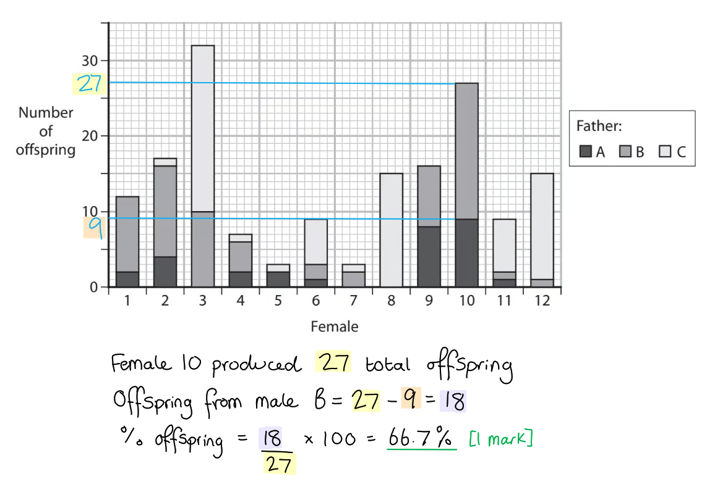

> *Make sure to check your rounding on this question. If you gave an answer of 66.6% then that would not be correct. *

(ii) The percentage increase in the wild population of C*. hoodensis* tortoises is...

- 1800-15 = 1785; **[1 mark]**
- (1785÷15) × 100 =11 900.0 %; **[1 mark]**

*Full marks awarded for the correct answer only.*

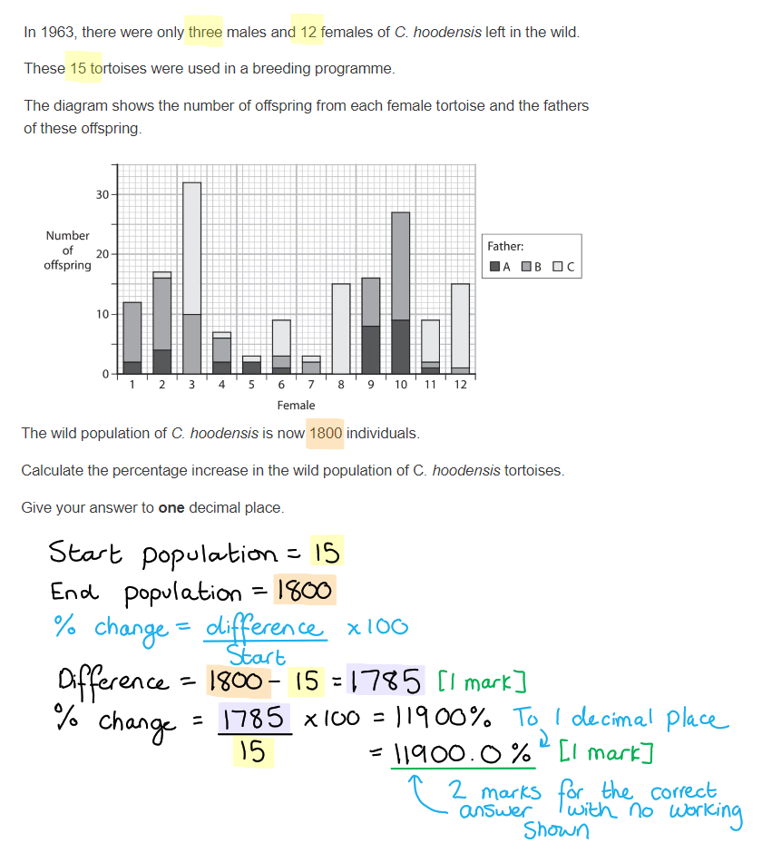

(iii) The zoo determined that its giant tortoise was a *C. hoodensis* tortoise by...

Any **three **of the following:

- Analysis of molecular evidence (of the zoo tortoise) e.g. DNA / RNA / proteins; **[1 mark]**
- Comparison (of molecular evidence) to a *C. hoodensis *tortoise (to see how similar the sequences are) / comparison of bands (from gel electrophoresis) with* C. hoodensis *tortoise; **[1 mark]**
- Comparison of phenotype/anatomy/physiology to a *C. hoodensis* tortoise; **[1 mark]**
- Breeding the tortoise with a* C. hoodensis* tortoise to see if** fertile** offspring are produced; **[1 mark]**

**[Total: 6 marks]**

### 9((d)) — 2 marks
The change in frequency of this allele could be determined by...

Any **two **of the following:

- DNA analysis to identify different alleles; **[1 mark]**
- Use of Hardy-Weinberg equation / p2+2pq+q2; **[1 mark]**
- (In order to) compare (recessive) allele frequency in previous generation(s) with the current generation; **[1 mark]**

**[Total: 2 marks]**

> *It is important to remember that Hardy-Weinberg is the equation used for the calculation of allele frequency. Try not to get this confused with heterozygosity index and index of diversity.*

## Q10 — medium — 9 marks · exam-questions

### 1() — 1 marks
**Correct answer: A** — 1, 2 and 3 only

> **[mark-scheme]**
> **Final answer:** **The correct answer is A.**
> 
> - **Statement 1** is correct because endemic species only occur in a particular geographical area
> - **Statement 2** is correct because endemic species, being restricted to a particular geographical area, often exist in smaller populations, which limits genetic diversity
> - **Statement 3** is correct because, as endemic species are restricted to a single geographical area, localised threats such as habitat destruction or disease could cause the entire population to go extinct
> - **Statement 4** is incorrect; an endemic species may be found across a variety of different habitat types within its geographical range, and is not necessarily restricted to a single habitat type.

### 2() — 2 marks
> **[mark-scheme]**
> - Breed individuals from the two populations together **OR** attempt to interbreed the two populations
> - If they produce fertile offspring they belong to the same species **OR** if they produce infertile offspring / fail to breed they belong to different species
> 
> **OR**
> 
> - Compare the DNA / mRNA / amino acid sequences of individuals from each population
> - The more similar the sequences, the more closely related / likely to be the same species the two populations are
> 
> **[2 marks]**
> 
> Accept gel electrophoresis to compare DNA banding patterns / DNA profiling as alternatives for the fourth bullet point
> 
> If none of the above are credited then award one mark for references to observing whether the two populations show different courtship behaviours / rituals that prevent mating

> **[exam-tip]**
> This question asks you to describe a method, not simply name two different approaches. You should choose one method and describe it in enough detail to gain full marks.
> 
> Two main approaches can be credited here:
> 
> - For breeding, you must state not only that the populations would be bred together, but also what the outcome would indicate about whether they belong to the same species or different species
> - For molecular evidence, you must refer to comparing specific sequences, such as DNA, mRNA or amino acid sequences — vague references to "DNA analysis" or "comparing DNA" will not be credited
> 
> Note that the fact that the two populations live on different islands is not sufficient evidence that they are different species, as this simply reflects their geographical location rather than any biological property of the species itself.

### 3() — 4 marks
> **[mark-scheme]**
> Anatomical adaptation (any pair from):
> 
> - The 'i'iwi has a long / narrow curved bill
> - This allows it to reach nectar from deep within narrow/tubular flowers
> 
> **OR**
> 
> - The kiwikiu has a short / strong hooked bill
> - This allows it to peel bark from trees to find food **OR** break through the tough outer casings of beetles **OR** extract food from beneath wood / rocks
> 
> **OR**
> 
> - The 'i'iwi has a streamlined body
> - This allows it to fly long distances through the forest canopy efficiently / fly through narrow gaps between branches/leaves
> 
> **[2 marks]**
> 
> Behavioural adaptation (any pair from):
> 
> - The 'i'iwi flies / travels in search of flowers
> - This ensures a reliable food source is available throughout the year
> 
> **OR**
> 
> - The kiwikiu defends a foraging territory
> - This prevents competitors from taking its food
> 
> **OR**
> 
> - Kiwikiu young remain with their parents
> - This provides protection from predators
> 
> **OR**
> 
> - Kiwikiu young learn foraging techniques from their parents
> - This ensures they develop the skills needed to find food
> 
> **[2 marks]**

> **[exam-tip]**
> This question asks you to identify and explain one anatomical and one behavioural adaptation. Make sure you clearly identify the adaptation first before explaining how it increases the bird's chances of survival — you will not gain marks for a description of what the bird does without linking it to survival.
> 
> For anatomical adaptations, use the photographs to identify visible structural features. For behavioural adaptations, use the information provided in the question stem.

### 4() — 2 marks
> **[mark-scheme]**
> (i) A niche is:
> 
> - The role of an organism within its habitat / ecosystem / environment **[1 mark]**
> 
> (ii) One factor, other than food source, that might form part of the niche of these honeycreepers is:
> 
> Any **one** from:
> 
> - The predators that feed on it
> - The organisms it competes with
> - Time of day at which it feeds / is active
> - The habitat / vegetation type in which it nests / forages
> - Height at which it feeds / nests
> - Its role in pollination of native plants
> 
> **[1 mark]**
> 
> Accept any other valid factor that forms part of the birds' niche

> **[exam-tip]**
> The niche of an organism describes its role within its ecosystem, not simply where it lives. When suggesting factors that form part of an organism's niche, think about how the organism interacts with other living things and its environment — for example what eats it, what it competes with, where it nests, and when it is active.
> 
> Avoid simply naming abiotic factors such as temperature or rainfall, as these describe the organism's habitat rather than its niche.

## Q11 — medium — 12 marks · exam-questions

### 1() — 3 marks
To calculate the expected number of heterozygous plants:

- Determine the frequency of the homozygous recessive genotype (q²):

  - 80 plants out of 500 show the homozygous recessive phenotype

q² = 80 ÷ 500

= 0.16

- Calculate q by finding the square root of q²

q = √0.16

= 0.4

- Use the equation p + q = 1 to find p

p = 1 - 0.4

= 0.6

- Calculate 2pq to find the frequency of heterozygous individuals

= 2 × 0.4 × 0.6

= 0.48

- Convert to a number of plants by multiplying by the total population size

= 0.48 × 500

= **240** plants

> **[mark-scheme]**
> Award marks as follows:
> 
> - 0.16 **AND** 0.4 **[1 mark]**
> - 0.48 / 48% **[1 mark]**
> - 240 **[1 mark]**
> 
> Award full marks for correct answers in the absence of working shown.
> 
> Award 2 marks for 0.48 / 48%
> 
> Award a maximum of 2 marks for error carried forward, e.g. for the correct method used to calculate an incorrect final answer from an incorrect value of *p* or *q*

### 2() — 3 marks
> **[mark-scheme]**
> Any **three** from:
> 
> - The fungal pathogen acts as a selection pressure
> - Plants with low production of the antimicrobial compound/allele a are less likely to survive **OR **plants with high production of the antimicrobial compound/allele A have a selective advantage / are more likely to survive
> - Surviving plants reproduce **AND** pass allele A on to their offspring
> - Over many generations the frequency of allele A increases within the population / gene pool

> **[exam-tip]**
> When explaining changes in allele frequency, make sure you refer specifically to the named allele — in this case allele A or a — rather than using the term "gene." All plants in the population have the gene for antimicrobial compound production; it is the specific allele of that gene that provides the selective advantage, and that changes in frequency over time.

### 3() — 6 marks
> **[mark-scheme]**
> (i) Conclusions about the antibacterial properties of thyme oil and clove oil against *E. coli* include:
> 
> Any **four** from:
> 
> - The volume of thyme oil used affects its antibacterial effectiveness / a greater volume of thyme oil produces a greater zone of inhibition
> - The volume of clove oil used does not significantly affect its antibacterial effectiveness / both volumes of clove oil produce a similar zone of inhibition
> - Thyme oil is more effective than clove oil as an antibacterial agent at equivalent volumes
> - All treatments show a statistically significant difference from the antibiotic
> - The combination of thyme oil and clove oil is significantly more effective than the antibiotic alone at inhibiting the growth of E. coli / produces a significantly larger zone of inhibition than the antibiotic
> - A correct statement about specific probability levels, e.g. 60 μl thyme oil is significantly different from the antibiotic at p < 0.05 / there is less than a 5% probability that the difference between 60 μl thyme oil and the antibiotic is due to chance
> 
> **[4 marks]**
> 
> For marking point 6, accept other correct descriptions of statistical significance in relation to probability levels.
> 
> (ii) Additional pieces of information that would be needed before these new preservatives could be developed are:
> 
> Any **two** from:
> 
> - Whether the oils are safe / non-toxic to humans at the concentrations required
> - Whether the oils affect the taste / smell / quality of the food
> - Whether the oils are effective against other food spoilage microorganisms / pathogens
> - Whether the oils remain effective over the shelf life of the food product
> - The cost of producing / extracting the oils at a commercial scale
> 
> **[2 marks]**
> 
> Accept other valid suggestions.

> **[exam-tip]**
> When drawing conclusions from this graph, make sure your answers are conclusions rather than descriptions. A description simply states what the data shows, while a conclusion interprets what the data means.
> 
> Also note that the asterisks above each bar indicate the statistical significance of the difference between that treatment and the antibiotic only — you cannot use the asterisks to make statements about the statistical significance of differences between any other pairs of treatments, for example between thyme oil and clove oil. For conclusions that do not involve a direct comparison with the antibiotic, you can still comment on the data but you should not make claims about statistical significance.

## Q12 — medium — 11 marks · exam-questions

### 1() — 3 marks
> **[mark-scheme]**
> Any **three** from:
> 
> - Quadrats should be placed randomly
> - Quadrats should be an appropriate size for the habitat / species being surveyed
> - Enough quadrats should be placed to ensure a representative sample
> - All species within each quadrat are recorded / counted
> - Species must be accurately identified / a key should be used to identify species
> 
> **[3 marks]**

> **[exam-tip]**
> This question does not require you to describe the precise practical steps involved in placing quadrats in the field. Instead, you should focus on the methodological decisions that would make this a reliable investigation. Think about how you would ensure that your sample is representative of the habitat as a whole — for example, how quadrats should be placed, how many should be used, and how you would ensure that species are accurately recorded. Applying general principles of good experimental design, such as random sampling and sufficient sample size, will help you access the marks here.
> 
> Note that quadrats do not need to be 1 m² — in a habitat such as a forest, much larger quadrats would be needed to adequately sample the plant species present.

### 2() — 2 marks
> **[mark-scheme]**
> - The index of diversity is higher in the conserved area (4.37) than the unconserved area (2.14) **SO** indicating that conservation strategies have increased / maintained species diversity **[1 mark]**
> - The heterozygosity index is higher in the conserved area (0.62) than the unconserved area (0.38) **SO** indicating that conservation strategies have maintained / increased genetic diversity within the red squirrel population **[1 mark]**

### 3() — 6 marks
> **[mark-scheme]**
> This question assesses the quality of your written communication (indicated by *) and should be assessed using levelled criteria.
> 
> | Level | Marks | Level descriptor |
> |---|---|---|
> | Level 3 | 5–6 | Demonstrates comprehensive biological knowledge by selecting and applying relevant facts and concepts.  Most of the important conservation strategies are discussed to make a detailed and accurate judgement.  The answer is well-structured with a clear and sustained line of scientific reasoning throughout. |
> | Level 2 | 3–4 | Demonstrates adequate biological knowledge by selecting and applying some relevant facts and concepts.  More than one conservation strategy is discussed, and an attempt at an overall judgement is made, with some supporting evidence.  The answer shows some structure and lines of scientific reasoning, with occasional links to the maintenance of biodiversity and genetic diversity. |
> | Level 1 | 1–2 | Demonstrates isolated elements of biological knowledge applied to the context in a generalised or vague way.  Limited evaluation is attempted, with little structure and no clear overall judgement made. |
> | Level 0 | 0 | No awardable content. |
> 
> **Indicative content**
> 
> In-situ conservation:
> 
> - Replanting native tree species, such as Scots pine, restores habitat, increasing species richness in the forest
> - Controlling invasive grey squirrels increases survival rate of red squirrels to breeding age, maintaining allele frequencies in the red squirrel population
> - Removing invasive species prevents them from outcompeting native species, such as bluebell and wood sorrel, maintaining species diversity
> - Introducing conservation laws / protected area status prevents further destruction of the Caledonian Forest
> - Educating local communities encourages sustainable land use / reduces further damage to the forest
> 
> Ex-situ conservation — captive breeding:
> 
> - Red squirrels collected from geographically separated populations to maximise genetic diversity / expand the gene pool
> - Studbooks kept to prevent inbreeding / maintain variety of alleles in the captive red squirrel population
> - DNA analysis / Hardy-Weinberg equation used to monitor allele frequencies in the red squirrel population over time
> - Offspring protected from predators until old enough to be reintroduced to restored areas of the Caledonian Forest
> - IVF / frozen sperm can be used to maintain genetic diversity in red squirrels, though sperm motility may be reduced and costs are high
> 
> Ex-situ conservation — seed banks:
> 
> - Seeds harvested from genetically different plants across different locations within the Caledonian Forest to ensure a diverse gene pool
> - Seeds X-rayed to check for presence of a viable embryo
> - Seeds dried / dehydrated to prevent germination and fungal growth
> - Seeds treated with antimicrobials / sterilised to prevent infection
> - Seeds stored at below 0°C to prevent deterioration
> 
> Broader conservation:
> 
> - Scientific research funded to monitor population sizes and allele frequencies over time
> - Reintroducing individuals carrying different alleles to those already present ensures the population is not disrupted by a reduction in genetic diversity
> 
> Credit answers that relate to different species examples

## Q13 — medium — 4 marks · exam-questions

### 7() — 4 marks
(i) The correct answer is **B** (3 organelles) because...

Only the **nuclei**, Golgi apparatus and **mitochondria **are surrounded by a membrane.

> *Glycogen granules** and **cytoplasm** are not organelles but are still identifiable parts of the cell. *

> *The other organelles labelled are not surrounded by a membrane: these are the **cell wall**, **cell membrane** (because it is itself a membrane) and the **ribosomes**.*

(ii) Fungi are not classified as bacteria, plants or animals because...

- (Fungi are not plants because) they have glycogen granules (rather than starch) **OR** they do not have <u>cellulose</u> cell walls; **[1 mark]**
- (Fungi are not animals because) they have a cell wall; **[1 mark]**
- (Fungi are not bacteria because) they have nuclei / Golgi apparatus / mitochondria / membrane-bound organelles **OR** they have <u>chitin</u> cell walls / do not have <u>peptidoglycan</u> cell walls; **[1 mark]**

***Ignore**** references to chloroplasts / vacuole for marking point 1.*

***Ignore**** references to flagellum / pili / capsule / endoplasmic reticulum for marking point 2.*

***Reject ****references to ribosomes / cytoplasm / glycogen granules / cell membrane for marking point 3 as these are all features that can be found in bacterial cells.*

> *It's vital that you follow the clue in the question to '**use the information in the diagram**'; marks are not available for describing features that are not present in the diagram.*

**[Total: 4 marks]**
